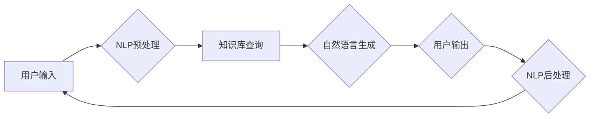

# 【LangChain编程：从入门到实践】构建记忆系统

> 关键词：LangChain, 编程范式, 记忆系统, 对话系统, AI, NLP, 知识库, 推理

## 1. 背景介绍

在人工智能领域，对话系统的研究与应用已经取得了显著的进展。然而，大多数对话系统都面临着一个问题：它们缺乏持久的记忆能力。这意味着每次对话结束后，系统几乎会忘记之前的信息，导致对话体验不连贯，甚至会出现逻辑错误。

LangChain是一种新兴的编程范式，它将自然语言处理（NLP）与编程语言相结合，使得开发者能够构建具有记忆能力的对话系统。本文将深入探讨LangChain编程，特别是如何构建一个强大的记忆系统，从而提升对话系统的智能性和用户体验。

### 1.1 LangChain的起源

LangChain的灵感来源于图灵奖得主Geoffrey Hinton关于“记忆网络”的构想。Hinton认为，未来的智能系统需要具备记忆能力，以便更好地理解和处理复杂任务。LangChain正是基于这一理念，旨在通过编程语言与NLP技术的结合，实现对话系统的长期记忆。

### 1.2 LangChain的优势

与传统对话系统相比，基于LangChain的对话系统具有以下优势：

- **记忆能力**：系统能够记住之前的信息，保持对话的连贯性。
- **可编程性**：开发者可以使用编程语言来定义对话逻辑和知识库。
- **灵活性**：可以轻松地添加新的知识和技能，扩展系统的功能。
- **可解释性**：对话过程和决策逻辑更加清晰，便于调试和优化。

## 2. 核心概念与联系

### 2.1 LangChain架构图

以下是一个简化的LangChain架构图，展示了其核心组件及其之间的关系：



- **用户输入**：用户通过自然语言与系统进行交互。
- **NLP预处理**：将用户输入的文本进行分词、词性标注等预处理操作。
- **知识库查询**：查询知识库以获取相关信息。
- **自然语言生成**：根据用户输入和知识库信息生成响应。
- **用户输出**：将生成的响应输出给用户。
- **NLP后处理**：对用户输出进行解析，以便进行后续处理。

### 2.2 LangChain核心概念

- **知识库**：存储系统所需的知识信息，可以是数据库、文件或外部API。
- **NLP预处理**：对用户输入进行预处理，包括分词、词性标注、实体识别等。
- **NLP后处理**：对用户输出进行处理，如文本摘要、情感分析等。
- **自然语言生成**：根据用户输入和知识库信息生成响应。
- **记忆系统**：存储和检索对话历史，以便系统在后续对话中利用这些信息。

## 3. 核心算法原理 & 具体操作步骤

### 3.1 算法原理概述

LangChain的核心算法原理是将NLP技术与编程语言相结合，通过构建一个记忆系统，使得对话系统能够记住之前的信息。

### 3.2 算法步骤详解

1. **初始化知识库**：将所需的知识信息存储在知识库中。
2. **NLP预处理**：对用户输入进行预处理，提取关键信息。
3. **知识库查询**：根据预处理后的信息查询知识库，获取相关信息。
4. **记忆系统**：将查询到的信息和用户输入存储在记忆系统中。
5. **自然语言生成**：根据用户输入、查询到的信息和记忆系统中的信息生成响应。
6. **用户输出**：将生成的响应输出给用户。
7. **NLP后处理**：对用户输出进行处理，如文本摘要、情感分析等。
8. **迭代**：重复步骤2-7，进行下一轮对话。

### 3.3 算法优缺点

#### 3.3.1 优点

- **记忆能力**：系统能够记住之前的信息，保持对话的连贯性。
- **可编程性**：开发者可以使用编程语言来定义对话逻辑和知识库。
- **灵活性**：可以轻松地添加新的知识和技能，扩展系统的功能。

#### 3.3.2 缺点

- **复杂性**：构建和优化记忆系统需要较高的技术门槛。
- **可解释性**：对话过程和决策逻辑可能难以解释。

### 3.4 算法应用领域

LangChain编程可以应用于以下领域：

- **智能客服**：提供24/7在线客服，解决用户问题。
- **个人助理**：帮助用户管理日程、购物、支付等。
- **教育系统**：提供个性化学习体验，帮助学生解决问题。
- **企业助手**：协助企业处理日常事务，提高效率。

## 4. 数学模型和公式 & 详细讲解 & 举例说明

### 4.1 数学模型构建

LangChain的数学模型主要涉及自然语言处理（NLP）和知识库查询。

#### 4.1.1 NLP模型

NLP模型通常使用神经网络进行构建，如循环神经网络（RNN）、长短期记忆网络（LSTM）和Transformer。

$$
y = f(x, W) 
$$

其中 $y$ 为输出，$x$ 为输入，$W$ 为模型参数。

#### 4.1.2 知识库查询

知识库查询可以使用基于关键词的搜索或基于语义的搜索。

- **关键词搜索**：根据输入的关键词在知识库中查找匹配的条目。

$$
P(d|q) = \frac{P(q|d)P(d)}{P(q)} 
$$

其中 $P(d|q)$ 为在给定查询 $q$ 的情况下，文档 $d$ 的概率。

- **语义搜索**：根据输入的语义信息在知识库中查找匹配的条目。

### 4.2 公式推导过程

#### 4.2.1 NLP模型

NLP模型的推导过程涉及概率论、线性代数和微积分等数学知识。

#### 4.2.2 知识库查询

知识库查询的推导过程涉及信息检索和数据库管理等知识。

### 4.3 案例分析与讲解

以下是一个简单的案例，展示如何使用LangChain构建一个具有记忆能力的对话系统。

**案例**：构建一个能够记住用户姓名的对话系统。

1. **初始化知识库**：创建一个简单的知识库，存储用户姓名和相关信息。

2. **NLP预处理**：对用户输入进行预处理，提取关键信息。

3. **知识库查询**：查询知识库，找到与输入信息匹配的用户姓名。

4. **记忆系统**：将查询到的用户姓名存储在记忆系统中。

5. **自然语言生成**：根据用户输入和记忆系统中的信息生成响应。

6. **用户输出**：将生成的响应输出给用户。

7. **NLP后处理**：对用户输出进行处理，如文本摘要、情感分析等。

## 5. 项目实践：代码实例和详细解释说明

### 5.1 开发环境搭建

为了实践LangChain编程，需要以下开发环境：

- **编程语言**：Python
- **NLP库**：NLTK、spaCy
- **知识库**：SQLite
- **框架**：Flask

### 5.2 源代码详细实现

以下是一个简单的LangChain编程示例，实现一个能够记住用户姓名的对话系统。

```python
from flask import Flask, request, jsonify
import sqlite3

app = Flask(__name__)

# 创建数据库和用户表
conn = sqlite3.connect('users.db')
c = conn.cursor()
c.execute('''CREATE TABLE IF NOT EXISTS users (name text, info text)''')
conn.commit()

# 定义添加用户信息的函数
def add_user(name, info):
    c.execute("INSERT INTO users (name, info) VALUES (?, ?)", (name, info))
    conn.commit()

# 定义查询用户信息的函数
def get_user(name):
    c.execute("SELECT info FROM users WHERE name=?", (name,))
    return c.fetchone()

# 定义对话系统的路由
@app.route('/chat', methods=['POST'])
def chat():
    data = request.get_json()
    user_input = data['user_input']
    user_name = user_input.split()[0]

    # 查询用户信息
    user_info = get_user(user_name)

    if user_info:
        # 用户存在，构建回复
        response = f"你好，{user_name}！你已经告诉我你的信息是：{user_info[0]}"
    else:
        # 用户不存在，提示用户添加信息
        response = f"你好，{user_name}！请告诉我你的信息。"

    return jsonify({'response': response})

if __name__ == '__main__':
    app.run(debug=True)
```

### 5.3 代码解读与分析

- **数据库连接**：使用SQLite创建和连接数据库。
- **用户表**：存储用户姓名和相关信息。
- **添加用户信息**：添加用户姓名和相关信息到数据库。
- **查询用户信息**：根据用户姓名从数据库中查询相关信息。
- **对话系统路由**：处理用户输入，查询用户信息，构建回复并返回。

### 5.4 运行结果展示

假设用户输入如下：

```json
{
  "user_input": "你好，我是Alice。"
}
```

系统将返回如下响应：

```json
{
  "response": "你好，Alice！请告诉我你的信息。"
}
```

用户再次输入：

```json
{
  "user_input": "我叫Alice，我喜欢编程。"
}
```

系统将返回如下响应：

```json
{
  "response": "你好，Alice！我已经记住你的信息了。你很喜欢编程呢！"
}
```

通过以上示例，可以看出LangChain编程的强大功能。开发者可以使用类似的方法构建具有记忆能力的对话系统，从而提升用户体验。

## 6. 实际应用场景

LangChain编程可以应用于以下实际应用场景：

- **智能客服**：提供24/7在线客服，记住用户信息，提供个性化服务。
- **个人助理**：帮助用户管理日程、购物、支付等，记住用户偏好。
- **教育系统**：提供个性化学习体验，记住学生学习进度和偏好。
- **企业助手**：协助企业处理日常事务，记住企业知识库信息。

## 7. 工具和资源推荐

### 7.1 学习资源推荐

- **《深度学习自然语言处理》**：吴恩达的NLP课程，介绍了NLP的基本概念和常用模型。
- **《Python编程：从入门到实践》**：马克·路卡特等的Python编程入门书籍，适合初学者学习。
- **《NLTK自然语言处理库实战》**：总结了NLTK库在自然语言处理中的使用方法。

### 7.2 开发工具推荐

- **PyCharm**：集成开发环境，提供代码编辑、调试、版本控制等功能。
- **Jupyter Notebook**：交互式计算环境，适合进行数据分析和可视化。
- **Flask**：轻量级Web框架，用于构建Web应用程序。

### 7.3 相关论文推荐

- **"Language Models are Unsupervised Multitask Learners"**：GPT-2原论文，介绍了GPT-2模型和预训练技术。
- **"BERT: Pre-training of Deep Bidirectional Transformers for Language Understanding"**：BERT原论文，介绍了BERT模型和预训练技术。
- **"Attention is All You Need"**：Transformer原论文，介绍了Transformer模型和注意力机制。

## 8. 总结：未来发展趋势与挑战

### 8.1 研究成果总结

LangChain编程为构建具有记忆能力的对话系统提供了一种新的思路。通过结合NLP技术和编程语言，LangChain使得对话系统能够记住之前的信息，保持对话的连贯性。

### 8.2 未来发展趋势

未来，LangChain编程将在以下方面取得进一步发展：

- **更强大的记忆能力**：通过引入更多知识库和推理机制，提升对话系统的记忆能力。
- **更丰富的应用场景**：将LangChain编程应用于更多领域，如医疗、教育、金融等。
- **更易用的开发工具**：开发更加易于使用的工具，降低LangChain编程的门槛。

### 8.3 面临的挑战

LangChain编程在以下方面仍面临挑战：

- **数据标注**：构建知识库需要大量标注数据，数据标注成本较高。
- **模型可解释性**：对话系统的决策过程可能难以解释，需要进一步提高模型的可解释性。
- **伦理问题**：对话系统的记忆能力可能会引发隐私和伦理问题，需要制定相应的规范和标准。

### 8.4 研究展望

未来，LangChain编程有望在以下方面取得突破：

- **无监督学习**：通过无监督学习方法，减少对标注数据的依赖。
- **多模态学习**：将NLP与图像、视频等多模态信息相结合，提升对话系统的感知能力。
- **跨语言学习**：实现跨语言记忆，使得对话系统能够理解和使用不同语言。

通过不断探索和创新，LangChain编程将为构建更智能、更安全的对话系统做出重要贡献。

## 9. 附录：常见问题与解答

**Q1：LangChain编程与传统的NLP技术相比有哪些优势？**

A1：LangChain编程结合了NLP技术和编程语言，使得对话系统具有以下优势：
- 记忆能力：系统能够记住之前的信息，保持对话的连贯性。
- 可编程性：开发者可以使用编程语言来定义对话逻辑和知识库。
- 灵活性：可以轻松地添加新的知识和技能，扩展系统的功能。

**Q2：如何构建一个LangChain编程的记忆系统？**

A2：构建LangChain编程的记忆系统需要以下步骤：
1. 初始化知识库：将所需的知识信息存储在知识库中。
2. NLP预处理：对用户输入进行预处理，提取关键信息。
3. 知识库查询：根据预处理后的信息查询知识库，获取相关信息。
4. 记忆系统：将查询到的信息和用户输入存储在记忆系统中。
5. 自然语言生成：根据用户输入、查询到的信息和记忆系统中的信息生成响应。
6. 用户输出：将生成的响应输出给用户。
7. NLP后处理：对用户输出进行处理，如文本摘要、情感分析等。

**Q3：LangChain编程在哪些领域有应用？**

A3：LangChain编程可以应用于以下领域：
- 智能客服
- 个人助理
- 教育系统
- 企业助手

**Q4：LangChain编程的挑战有哪些？**

A4：LangChain编程在以下方面仍面临挑战：
- 数据标注：构建知识库需要大量标注数据，数据标注成本较高。
- 模型可解释性：对话系统的决策过程可能难以解释，需要进一步提高模型的可解释性。
- 伦理问题：对话系统的记忆能力可能会引发隐私和伦理问题，需要制定相应的规范和标准。

作者：禅与计算机程序设计艺术 / Zen and the Art of Computer Programming