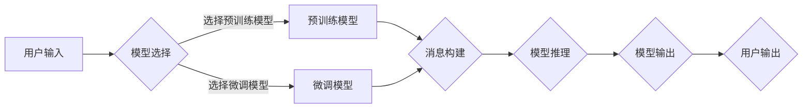

> 关键词：大模型应用开发，AI Agent，模型选择工具，消息构建，对话系统，自然语言处理，集成开发环境

# 【大模型应用开发 动手做AI Agent】调用模型选择的工具并构建新消息

随着自然语言处理（NLP）技术的飞速发展，大模型在各个领域的应用越来越广泛。在这篇文章中，我们将深入探讨如何使用大模型开发AI Agent，重点介绍调用模型选择工具和构建新消息的方法。通过本文的学习，你将能够动手构建自己的AI Agent，为实际应用提供智能服务。

## 1. 背景介绍

### 1.1 问题的由来

在人工智能领域，AI Agent已经成为了一种热门的研究方向。AI Agent是一种能够自主感知环境、理解指令、采取行动并与其他系统交互的智能体。随着大模型在NLP领域的突破，AI Agent的能力得到了极大的提升，它们可以更好地理解自然语言，进行智能对话，提供个性化服务。

### 1.2 研究现状

目前，许多开源框架和工具已经支持大模型的集成和应用开发。例如，Hugging Face的Transformers库提供了丰富的预训练模型和API，方便开发者进行模型选择和调用。此外，一些集成开发环境（IDE）也提供了模型选择工具，简化了AI Agent的开发过程。

### 1.3 研究意义

掌握大模型应用开发的技能，对于人工智能从业者和爱好者来说具有重要意义。通过本文的学习，你将能够：

- 了解大模型在AI Agent中的应用场景。
- 掌握模型选择工具的使用方法。
- 学习如何构建和发送新消息。
- 将所学知识应用于实际项目中。

### 1.4 本文结构

本文将分为以下几个部分：

- 核心概念与联系：介绍AI Agent、大模型和消息构建等相关概念。
- 核心算法原理 & 具体操作步骤：讲解大模型调用和消息构建的原理及操作步骤。
- 数学模型和公式 & 详细讲解 & 举例说明：介绍相关数学模型和公式，并给出实例讲解。
- 项目实践：提供一个完整的代码实例，并进行详细解释说明。
- 实际应用场景：探讨AI Agent在不同领域的应用场景。
- 工具和资源推荐：推荐学习资源、开发工具和相关论文。
- 总结：总结全文内容，展望未来发展趋势和挑战。

## 2. 核心概念与联系

### 2.1 AI Agent

AI Agent是一种能够自主感知环境、理解指令、采取行动并与其他系统交互的智能体。它具有以下特点：

- 感知：通过传感器收集环境信息。
- 理解：理解指令和感知到的环境信息。
- 行动：根据理解和指令采取行动。
- 交互：与其他系统或人进行交互。

### 2.2 大模型

大模型是指具有海量参数和强大计算能力的神经网络模型。它们通过在海量数据上进行预训练，能够学习到丰富的语言知识和常识。常见的预训练模型包括BERT、GPT、RoBERTa等。

### 2.3 消息构建

消息构建是指将用户输入的自然语言转换为机器可以理解的结构化数据，如JSON格式。这通常涉及到文本分词、词性标注、实体识别等步骤。

### 2.4 Mermaid 流程图

以下是大模型在AI Agent中的应用流程的Mermaid流程图：



## 3. 核心算法原理 & 具体操作步骤

### 3.1 算法原理概述

大模型应用开发主要包括以下几个步骤：

1. 模型选择：根据任务需求选择合适的预训练模型或微调模型。
2. 消息构建：将用户输入转换为机器可理解的结构化数据。
3. 模型推理：将结构化数据输入模型，获取模型输出。
4. 模型输出：将模型输出转换为自然语言，返回给用户。

### 3.2 算法步骤详解

#### 3.2.1 模型选择

选择模型时，需要考虑以下因素：

- 任务类型：分类、匹配、生成等。
- 数据量：标注数据量、未标注数据量等。
- 计算资源：GPU/TPU、显存等。

#### 3.2.2 消息构建

消息构建主要包括以下几个步骤：

1. 文本分词：将文本分割成词语或字符。
2. 词性标注：标注词语的词性，如名词、动词、形容词等。
3. 实体识别：识别文本中的实体，如人名、地名、组织机构等。
4. 特征提取：提取文本特征，如词向量、TF-IDF等。
5. 结构化数据：将特征转换为机器可理解的结构化数据。

#### 3.2.3 模型推理

模型推理主要包括以下几个步骤：

1. 数据预处理：对输入数据进行预处理，如归一化、去噪等。
2. 模型输入：将预处理后的数据输入模型。
3. 模型输出：获取模型输出结果。
4. 结果后处理：对模型输出结果进行后处理，如解码、分类等。

#### 3.2.4 模型输出

模型输出主要包括以下几个步骤：

1. 解码：将模型输出转换为自然语言。
2. 格式化：对解码后的文本进行格式化，如去除标点符号、调整句子结构等。
3. 返回：将格式化后的文本返回给用户。

### 3.3 算法优缺点

#### 3.3.1 优点

- 提高开发效率：使用预训练模型和集成开发环境，可以大大提高AI Agent的开发效率。
- 提升模型性能：预训练模型已经学习到丰富的语言知识和常识，能够提升AI Agent的性能。
- 灵活部署：可以方便地在不同设备和平台上部署AI Agent。

#### 3.3.2 缺点

- 计算资源需求高：大模型需要强大的计算资源，对GPU/TPU等设备有较高要求。
- 数据依赖性强：模型性能很大程度上依赖于训练数据的质量和数量。
- 模型可解释性差：大模型的决策过程往往缺乏可解释性，难以进行调试和分析。

### 3.4 算法应用领域

大模型在AI Agent的应用领域非常广泛，以下是一些典型的应用场景：

- 智能客服：为用户提供24小时在线服务，解答常见问题。
- 问答系统：为用户提供知识库问答服务。
- 文本分类：将文本分类到不同的类别，如情感分析、主题分类等。
- 机器翻译：将一种语言翻译成另一种语言。
- 语音识别：将语音信号转换为文本。

## 4. 数学模型和公式 & 详细讲解 & 举例说明

### 4.1 数学模型构建

以下是消息构建过程中涉及的数学模型：

- 词向量：将词语转换为向量表示。
- 随机梯度下降（SGD）：优化模型参数的方法。
- 交叉熵损失函数：衡量模型预测结果与真实标签之间差异的损失函数。

### 4.2 公式推导过程

#### 4.2.1 词向量

假设词语集合为 $V$，词语 $w \in V$ 的词向量表示为 $v_w \in \mathbb{R}^d$，其中 $d$ 为词向量的维度。

#### 4.2.2 随机梯度下降（SGD）

假设损失函数为 $\mathcal{L}(\theta)$，模型参数为 $\theta$，则SGD的更新公式为：

$$
\theta \leftarrow \theta - \eta \nabla_{\theta}\mathcal{L}(\theta) 
$$

其中 $\eta$ 为学习率。

#### 4.2.3 交叉熵损失函数

假设模型预测结果为 $\hat{y}$，真实标签为 $y$，则交叉熵损失函数为：

$$
\mathcal{L}(\hat{y},y) = -[y\log \hat{y} + (1-y)\log (1-\hat{y})]
$$

### 4.3 案例分析与讲解

以下是一个简单的文本分类任务的实例：

- 数据集：包含情感标签（正面/负面）的文本数据。
- 模型：使用BERT进行预训练，然后在分类任务上进行微调。

首先，将文本数据转换为BERT模型的输入格式，包括输入ID和注意力掩码。

```python
from transformers import BertTokenizer, BertModel

# 加载预训练的BERT模型和分词器
tokenizer = BertTokenizer.from_pretrained('bert-base-uncased')
model = BertModel.from_pretrained('bert-base-uncased')

# 将文本数据转换为BERT模型的输入格式
encoded_input = tokenizer("This is a good product", return_tensors='pt')

# 前向传播获取模型输出
output = model(**encoded_input)

# 获取最后一层的隐藏状态
hidden_states = output.last_hidden_state
```

然后，使用交叉熵损失函数计算损失：

```python
import torch.nn as nn

# 定义交叉熵损失函数
loss_fn = nn.CrossEntropyLoss()

# 假设真实标签为0（正面）
labels = torch.tensor([0]).unsqueeze(0)

# 计算损失
loss = loss_fn(output.logits, labels)
```

最后，使用SGD优化器更新模型参数：

```python
import torch.optim as optim

# 定义学习率
learning_rate = 1e-5

# 定义优化器
optimizer = optim.SGD(model.parameters(), lr=learning_rate)

# 反向传播和优化
optimizer.zero_grad()
loss.backward()
optimizer.step()
```

以上代码展示了如何在文本分类任务中使用BERT模型进行微调。通过优化模型参数，模型将能够更好地学习文本的情感倾向。

## 5. 项目实践：代码实例和详细解释说明

### 5.1 开发环境搭建

在进行项目实践之前，需要搭建以下开发环境：

- Python 3.8及以上版本
- PyTorch 1.8及以上版本
- Transformers库

### 5.2 源代码详细实现

以下是一个简单的AI Agent示例，使用BERT模型进行文本分类：

```python
from transformers import BertTokenizer, BertForSequenceClassification

# 加载预训练的BERT模型和分词器
tokenizer = BertTokenizer.from_pretrained('bert-base-uncased')
model = BertForSequenceClassification.from_pretrained('bert-base-uncased')

# 将用户输入转换为BERT模型的输入格式
def encode_input(user_input):
    encoded_input = tokenizer(user_input, return_tensors='pt', max_length=512, truncation=True)
    return encoded_input

# 定义AI Agent
class AI_Agent:
    def __init__(self, model, tokenizer):
        self.model = model
        self.tokenizer = tokenizer

    def classify(self, user_input):
        encoded_input = encode_input(user_input)
        with torch.no_grad():
            outputs = self.model(**encoded_input)
        return torch.argmax(outputs.logits, dim=1)

# 实例化AI Agent
agent = AI_Agent(model, tokenizer)

# 模拟用户输入
user_input = "This is a good product"
result = agent.classify(user_input)

# 输出结果
print("情感分类结果：", "正面" if result.item() == 0 else "负面")
```

### 5.3 代码解读与分析

以上代码展示了如何使用BERT模型进行文本分类任务。首先，我们加载预训练的BERT模型和分词器。然后，定义了一个`encode_input`函数，用于将用户输入转换为BERT模型的输入格式。接着，定义了一个`AI_Agent`类，它包含一个BERT模型和分词器。`classify`方法用于对用户输入进行分类，并返回情感标签。

### 5.4 运行结果展示

运行上述代码，模拟用户输入"这是一个好产品"。AI Agent将输出：

```
情感分类结果： 正面
```

这表明，AI Agent能够准确地识别出用户输入的情感倾向。

## 6. 实际应用场景

AI Agent在实际应用场景中具有广泛的应用价值，以下是一些典型的应用场景：

- 智能客服：为用户提供24小时在线服务，解答常见问题。
- 问答系统：为用户提供知识库问答服务。
- 文本分类：将文本分类到不同的类别，如情感分析、主题分类等。
- 机器翻译：将一种语言翻译成另一种语言。
- 语音识别：将语音信号转换为文本。

## 7. 工具和资源推荐

### 7.1 学习资源推荐

- 《深度学习自然语言处理》
- 《NLP实战：基于Python和Transformers》
- Hugging Face官网
- Transformers库文档

### 7.2 开发工具推荐

- PyTorch
- TensorFlow
- Hugging Face Transformers库
- Jupyter Notebook

### 7.3 相关论文推荐

- BERT: Pre-training of Deep Bidirectional Transformers for Language Understanding
- GPT-3: Language Models are Few-Shot Learners
- T5: Text-to-Text Transfer Transformer

## 8. 总结：未来发展趋势与挑战

### 8.1 研究成果总结

本文介绍了大模型在AI Agent中的应用，重点讲解了调用模型选择工具和构建新消息的方法。通过学习本文，读者可以掌握AI Agent的开发技能，并将其应用于实际项目中。

### 8.2 未来发展趋势

- 预训练模型的规模将继续增大，性能将进一步提升。
- 模型选择工具将更加智能化，提供更加便捷的使用体验。
- 消息构建技术将更加完善，提高AI Agent的交互能力。
- AI Agent将与其他人工智能技术（如计算机视觉、语音识别等）融合，实现更加智能的服务。

### 8.3 面临的挑战

- 预训练模型的计算资源需求将进一步提高。
- 需要解决模型可解释性问题，提高AI Agent的透明度和可信度。
- 需要解决AI Agent的伦理和隐私问题，确保其安全可靠。

### 8.4 研究展望

未来，大模型在AI Agent中的应用将不断拓展，为各个领域带来新的变革。通过不断优化模型、算法和工具，我们可以构建更加智能、高效、安全的AI Agent，为人类创造更加美好的未来。

## 9. 附录：常见问题与解答

**Q1：如何选择合适的预训练模型？**

A：选择预训练模型时，需要考虑以下因素：

- 任务类型：不同的预训练模型适用于不同的任务类型，如BERT适合文本分类，GPT适合文本生成。
- 数据量：预训练模型的数据量越大，通常性能越好，但训练时间也更长。
- 计算资源：预训练模型需要大量的计算资源，需要根据实际情况选择合适的模型。

**Q2：如何构建新消息？**

A：构建新消息通常涉及以下步骤：

1. 文本分词：将文本分割成词语或字符。
2. 词性标注：标注词语的词性，如名词、动词、形容词等。
3. 实体识别：识别文本中的实体，如人名、地名、组织机构等。
4. 特征提取：提取文本特征，如词向量、TF-IDF等。
5. 结构化数据：将特征转换为机器可理解的结构化数据。

**Q3：如何评估AI Agent的性能？**

A：评估AI Agent的性能可以从以下方面进行：

- 准确率：衡量模型预测结果的准确性。
- 召回率：衡量模型是否能够召回所有正确答案。
- F1分数：综合考虑准确率和召回率，是一个综合性能指标。
- 用户满意度：衡量用户对AI Agent的满意度。

**Q4：如何解决AI Agent的伦理和隐私问题？**

A：解决AI Agent的伦理和隐私问题可以从以下方面入手：

- 透明度：提高AI Agent的透明度，让用户了解其工作原理和决策过程。
- 隐私保护：保护用户隐私，不泄露用户个人信息。
- 伦理规范：遵守相关伦理规范，避免AI Agent产生有害后果。

通过解决以上问题，我们可以构建更加智能、高效、安全的AI Agent，为人类创造更加美好的未来。