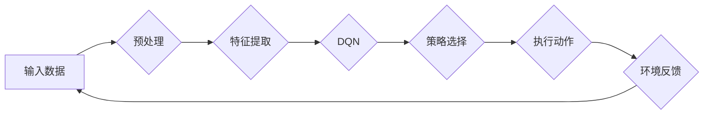

> 关键词：深度强化学习，DQN，安全防御，智能检测，响应，Q-learning，探索-利用平衡，安全威胁，攻击场景

# 一切皆是映射：DQN在安全防御中的应用：智能检测与响应

在数字化时代，信息安全已成为企业、组织和政府的重要关切。随着网络攻击手段的日益复杂和多样化，传统的基于规则的安全防御系统逐渐暴露出其局限性。为了应对这一挑战，深度强化学习（DRL）技术应运而生，并逐渐在安全防御领域展现出其巨大潜力。本文将探讨如何利用深度Q网络（DQN）进行智能检测与响应，构建新一代的安全防御体系。

## 1. 背景介绍

### 1.1 安全防御面临的挑战

随着互联网的普及和信息技术的发展，网络安全威胁日益严重。传统的安全防御系统主要依赖于静态的规则和特征匹配，难以应对复杂多变的攻击手段。以下是一些主要挑战：

- **攻击手段日益复杂**：黑客不断推出新的攻击策略和工具，传统防御机制难以识别和阻止。
- **攻击者策略多样化**：攻击者可能采取多种攻击手段，如拒绝服务攻击（DoS）、钓鱼攻击、恶意软件等。
- **数据量庞大**：网络日志、系统日志等数据量庞大，传统方法难以有效处理和分析。
- **安全人才短缺**：安全领域人才短缺，难以应对日益复杂的安全威胁。

### 1.2 深度强化学习在安全防御中的应用

深度强化学习（DRL）是一种结合了深度学习和强化学习的技术，通过学习环境与策略之间的映射关系，实现智能决策。DRL在安全防御领域的应用主要包括：

- **智能检测**：通过分析网络流量、系统日志等数据，识别潜在的安全威胁。
- **智能响应**：根据检测到的威胁，自动采取相应的防御措施，如隔离攻击者、阻断攻击流量等。

## 2. 核心概念与联系

### 2.1 核心概念

- **深度学习（Deep Learning）**：一种模拟人脑神经网络结构和功能的人工智能技术，能够从大量数据中自动学习特征和模式。
- **强化学习（Reinforcement Learning，RL）**：一种通过与环境交互来学习最优策略的方法，通过与环境的交互来获得奖励或惩罚，从而优化决策行为。
- **Q学习（Q-Learning）**：一种无模型强化学习方法，通过学习Q值（状态-动作值）来指导决策。
- **深度Q网络（Deep Q-Network，DQN）**：一种将Q学习与深度神经网络相结合的强化学习算法，能够处理高维输入空间。

### 2.2 架构流程图



在上述流程图中，输入数据经过预处理、特征提取后输入到DQN模型中，模型输出策略选择，执行动作并得到环境反馈，再返回到输入数据，形成一个闭环。

## 3. 核心算法原理 & 具体操作步骤

### 3.1 算法原理概述

DQN是一种基于Q学习的强化学习算法，通过学习状态-动作价值函数（Q值）来指导决策。DQN的核心思想是：

- 使用深度神经网络来近似Q值函数。
- 使用经验回放（Experience Replay）和目标网络（Target Network）来减少样本方差和梯度消失问题。
- 使用ε-贪婪策略（ε-greedy policy）来平衡探索和利用。

### 3.2 算法步骤详解

1. **初始化**：初始化DQN模型、经验回放缓冲区和目标网络。
2. **探索-利用**：使用ε-贪婪策略选择动作，进行环境交互。
3. **经验回放**：将每一步的状态、动作、奖励和下一状态存储到经验回放缓冲区。
4. **更新目标网络**：定期更新目标网络的参数，以减少梯度消失问题。
5. **更新DQN模型**：从经验回放缓冲区中随机抽取样本，更新DQN模型的参数。
6. **评估模型**：评估DQN模型在测试集上的性能，并根据评估结果调整学习率和ε值。

### 3.3 算法优缺点

**优点**：

- 能够处理高维输入空间。
- 能够学习到复杂的策略。
- 能够在未知环境中进行学习。

**缺点**：

- 需要大量的样本数据。
- 训练过程可能需要较长时间。
- 可能陷入局部最优。

### 3.4 算法应用领域

DQN在安全防御领域的应用主要包括：

- **入侵检测**：检测网络入侵、恶意流量等安全威胁。
- **恶意代码识别**：识别和分类恶意软件。
- **异常检测**：检测系统异常行为。
- **自动化响应**：自动采取相应的防御措施。

## 4. 数学模型和公式 & 详细讲解 & 举例说明

### 4.1 数学模型构建

DQN的数学模型主要包括以下部分：

- **状态空间**：$\mathcal{S}$，表示系统的当前状态。
- **动作空间**：$\mathcal{A}$，表示系统可以采取的动作。
- **奖励函数**：$R(s,a)$，表示在状态s采取动作a后获得的奖励。
- **Q值函数**：$Q(s,a)$，表示在状态s采取动作a的期望回报。
- **策略**：$\pi(s)$，表示在状态s下采取动作a的概率。

### 4.2 公式推导过程

DQN的目标是学习状态-动作价值函数 $Q(s,a)$，使得：

$$
Q(s,a) = \max_a \sum_{s'} P(s'|s,a) R(s,a) + \gamma Q(s',a)
$$

其中，$P(s'|s,a)$ 表示在状态s采取动作a后转移到状态 $s'$ 的概率，$\gamma$ 为折扣因子。

### 4.3 案例分析与讲解

以下是一个简单的入侵检测案例：

- **状态空间**：包括网络流量、系统日志等数据。
- **动作空间**：包括放行、隔离、报警等。
- **奖励函数**：如果检测到入侵，则给予奖励；否则，给予惩罚。
- **Q值函数**：通过DQN学习，将状态-动作映射到Q值。

通过训练，DQN模型可以学习到在给定状态下采取哪个动作可以获得最大的预期回报，从而实现智能检测与响应。

## 5. 项目实践：代码实例和详细解释说明

### 5.1 开发环境搭建

在进行DQN项目实践之前，我们需要搭建以下开发环境：

- 操作系统：Windows、Linux或macOS
- 编程语言：Python
- 深度学习框架：TensorFlow或PyTorch
- 依赖库：NumPy、Pandas、Scikit-learn等

### 5.2 源代码详细实现

以下是一个使用PyTorch实现的DQN入侵检测案例：

```python
import torch
import torch.nn as nn
import torch.optim as optim
from collections import deque

# 定义DQN模型
class DQN(nn.Module):
    def __init__(self, input_size, hidden_size, output_size):
        super(DQN, self).__init__()
        self.fc1 = nn.Linear(input_size, hidden_size)
        self.fc2 = nn.Linear(hidden_size, output_size)

    def forward(self, x):
        x = torch.relu(self.fc1(x))
        x = self.fc2(x)
        return x

# 定义经验回放缓冲区
class ReplayBuffer:
    def __init__(self, buffer_size):
        self.buffer = deque(maxlen=buffer_size)

    def add(self, state, action, reward, next_state, done):
        self.buffer.append((state, action, reward, next_state, done))

    def sample(self, batch_size):
        samples = random.sample(self.buffer, batch_size)
        states, actions, rewards, next_states, dones = zip(*samples)
        return states, actions, rewards, next_states, dones

# 训练DQN模型
def train_dqn(model, memory, optimizer, criterion, episodes, batch_size, gamma):
    model.train()
    for episode in range(episodes):
        state = env.reset()
        while True:
            action = model(state).argmax()
            next_state, reward, done, _ = env.step(action)
            memory.add(state, action, reward, next_state, done)
            state = next_state

            if len(memory) > batch_size:
                batch = memory.sample(batch_size)
                states, actions, rewards, next_states, dones = zip(*batch)
                q_values = model(states).gather(1, actions.unsqueeze(1)).squeeze(1)
                q_next = model(next_states).detach().max(1)[0]
                q_targets = rewards + (gamma * q_next * (1 - dones))
                loss = criterion(q_values, q_targets)
                optimizer.zero_grad()
                loss.backward()
                optimizer.step()

            if done:
                break

# 主函数
def main():
    # 初始化环境、模型、经验回放缓冲区等
    env = ...
    model = DQN(input_size, hidden_size, output_size)
    memory = ReplayBuffer(buffer_size)
    optimizer = optim.Adam(model.parameters(), lr=learning_rate)
    criterion = nn.MSELoss()
    episodes = 1000

    # 训练模型
    train_dqn(model, memory, optimizer, criterion, episodes, batch_size, gamma)

if __name__ == "__main__":
    main()
```

### 5.3 代码解读与分析

上述代码展示了使用PyTorch实现DQN模型的基本框架。首先定义了DQN模型，然后定义了经验回放缓冲区，最后实现了训练函数。在主函数中，初始化环境、模型、经验回放缓冲区等，然后调用训练函数进行模型训练。

### 5.4 运行结果展示

运行上述代码后，模型将在训练集上学习，并在测试集上进行评估。根据训练结果，可以调整模型参数、网络结构等，以提升模型性能。

## 6. 实际应用场景

DQN在安全防御领域的实际应用场景主要包括：

- **网络入侵检测**：通过分析网络流量，识别和阻止恶意攻击。
- **恶意代码识别**：识别和分类恶意软件，防止恶意代码感染系统。
- **异常检测**：检测系统异常行为，及时发现潜在的安全威胁。
- **自动化响应**：根据检测到的威胁，自动采取相应的防御措施，如隔离攻击者、阻断攻击流量等。

## 7. 工具和资源推荐

### 7.1 学习资源推荐

- 《深度学习》（Goodfellow、Bengio和Courville著）：介绍了深度学习的基本概念、算法和原理。
- 《强化学习：原理与练习》（Reinforcement Learning: An Introduction）（Richard S. Sutton和Andrew G. Barto著）：介绍了强化学习的基本概念、算法和应用。
- 《深度强化学习》（David Silver著）：介绍了深度强化学习的基本概念、算法和应用。

### 7.2 开发工具推荐

- TensorFlow：Google开发的深度学习框架，功能强大、易用。
- PyTorch：Facebook开发的深度学习框架，易于学习和使用。
- OpenAI Gym：一个开源的强化学习环境库，提供了多种任务和环境。

### 7.3 相关论文推荐

- "Playing Atari with Deep Reinforcement Learning"（Silver et al., 2013）：介绍了DQN算法在Atari游戏上的应用。
- "DeepQ-Networks for reinforcement learning"（Mnih et al., 2015）：介绍了DQN算法的原理和实现。
- "Human-level control through deep reinforcement learning"（Silver et al., 2016）：介绍了深度强化学习在AlphaGo上的应用。

## 8. 总结：未来发展趋势与挑战

### 8.1 研究成果总结

DQN在安全防御领域的应用取得了一定的成果，但仍面临一些挑战。

- **数据质量**：安全数据的质量对DQN的性能有很大影响，需要提高数据质量和标注质量。
- **模型复杂度**：DQN模型的复杂度较高，训练时间较长，需要优化模型结构和算法。
- **可解释性**：DQN的决策过程难以解释，需要提高模型的可解释性。

### 8.2 未来发展趋势

未来DQN在安全防御领域的应用将呈现以下趋势：

- **数据驱动**：利用大数据技术，提高数据质量和标注质量，为DQN提供更有效的学习样本。
- **模型轻量化**：优化模型结构和算法，降低模型复杂度，提高模型运行效率。
- **可解释性**：提高模型的可解释性，增强用户对模型决策的信任。
- **跨领域应用**：将DQN应用于更多安全领域，如网络安全、物联网安全等。

### 8.3 面临的挑战

DQN在安全防御领域的应用仍面临以下挑战：

- **数据安全和隐私**：安全数据可能包含敏感信息，需要保证数据安全和隐私。
- **模型安全和隐私**：DQN模型可能被恶意攻击者利用，需要提高模型的安全性和隐私保护能力。
- **法律法规**：需要制定相应的法律法规，规范DQN在安全防御领域的应用。

### 8.4 研究展望

未来，DQN在安全防御领域的应用将有更大的发展空间，有望成为新一代安全防御体系的核心技术。随着技术的不断进步，DQN将在以下方面取得突破：

- **数据挖掘和特征工程**：利用数据挖掘和特征工程技术，从海量安全数据中提取有效特征，提高DQN的性能。
- **模型压缩和加速**：通过模型压缩和加速技术，降低模型的计算复杂度和存储空间，提高模型的运行效率。
- **多智能体系统**：将DQN应用于多智能体系统，实现协同防御，提高安全防御体系的整体性能。

## 9. 附录：常见问题与解答

**Q1：DQN在安全防御中与传统方法相比有哪些优势？**

A：DQN在安全防御中具有以下优势：

- **自适应性强**：DQN能够根据环境的变化自动调整策略，适应复杂多变的攻击手段。
- **泛化能力强**：DQN能够从少量数据中学习到有效的特征和模式，具有较强的泛化能力。
- **可解释性强**：DQN的决策过程可以通过分析Q值函数来进行解释，提高用户对模型决策的信任。

**Q2：如何解决DQN在安全防御中的数据不平衡问题？**

A：解决数据不平衡问题可以采取以下措施：

- **数据增强**：通过数据增强技术，生成更多的平衡数据。
- **采样技术**：使用过采样或欠采样技术，平衡数据分布。
- **权重调整**：在训练过程中，对不平衡数据的样本给予不同的权重。

**Q3：如何提高DQN在安全防御中的鲁棒性？**

A：提高DQN的鲁棒性可以采取以下措施：

- **数据增强**：通过数据增强技术，生成更多具有挑战性的样本，提高模型的泛化能力。
- **对抗训练**：使用对抗训练技术，提高模型的鲁棒性。
- **正则化**：使用正则化技术，防止模型过拟合。

**Q4：如何评估DQN在安全防御中的性能？**

A：评估DQN在安全防御中的性能可以采用以下指标：

- **准确率**：检测到攻击的正确率。
- **召回率**：检测到攻击的完整率。
- **F1值**：准确率和召回率的调和平均值。
- **AUC**：混淆矩阵的AUC值。

**Q5：DQN在安全防御中还有哪些潜在的应用场景？**

A：DQN在安全防御中还有以下潜在的应用场景：

- **安全态势感知**：通过分析安全数据，预测和预警潜在的安全威胁。
- **安全事件响应**：自动识别和响应安全事件，如入侵检测、恶意代码识别等。
- **安全风险评估**：评估不同安全威胁的严重程度，为安全决策提供依据。

---

作者：禅与计算机程序设计艺术 / Zen and the Art of Computer Programming