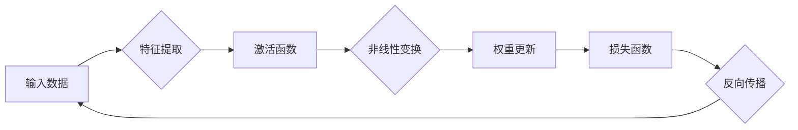

> 关键词：深度神经网络，映射，参数调优，优化策略，反向传播，梯度下降，激活函数，正则化，超参数

# 一切皆是映射：深度神经网络的调优与优化策略

深度神经网络（Deep Neural Networks，DNN）在图像识别、自然语言处理、语音识别等领域的广泛应用，推动了人工智能技术的飞速发展。然而，要想使深度神经网络达到最佳的性能，需要对网络结构、参数和超参数进行精细的调优。本文将深入探讨深度神经网络的映射原理，并介绍一系列有效的调优与优化策略。

## 1. 背景介绍

随着计算能力的提升和大数据的积累，深度神经网络在各个领域取得了显著的成果。然而，深度神经网络的训练和调优过程并非易事。如何选择合适的网络结构、参数和超参数，以获得最佳的模型性能，是深度学习领域的一个关键问题。

## 2. 核心概念与联系

### 2.1 核心概念原理

#### Mermaid 流程图



#### 关键概念

- **输入数据**：深度神经网络处理的原始数据，如图像、文本、声音等。
- **特征提取**：将输入数据转换为更适合神经网络处理的形式，如图像的像素值、文本的词向量等。
- **激活函数**：引入非线性因素，使神经网络具备学习非线性关系的能力。
- **权重更新**：通过反向传播算法，根据损失函数对网络权重进行调整。
- **损失函数**：衡量模型预测结果与真实标签之间的差距，用于指导权重更新。
- **反向传播**：从输出层开始，逐层计算损失函数对权重的梯度，并反向更新权重。

### 2.2 架构联系

深度神经网络的核心是映射关系，即输入数据经过一系列特征提取、非线性变换、权重更新和损失计算的过程，最终得到模型的预测结果。在这个过程中，激活函数、损失函数和优化算法起着至关重要的作用。

## 3. 核心算法原理 & 具体操作步骤

### 3.1 算法原理概述

深度神经网络的调优主要涉及以下几个方面：

1. **网络结构设计**：选择合适的网络层数、神经元数量、连接方式等。
2. **参数设置**：确定权重初始化、学习率等参数。
3. **超参数调整**：调整批量大小、训练轮数、正则化强度等超参数。
4. **优化算法**：选择合适的优化算法，如梯度下降、Adam等。

### 3.2 算法步骤详解

1. **数据预处理**：对输入数据进行分析、清洗、归一化等预处理操作。
2. **网络结构设计**：根据任务需求设计网络结构，包括层数、神经元数量、连接方式等。
3. **参数初始化**：对权重、偏置等进行随机初始化，避免梯度消失或梯度爆炸。
4. **损失函数设置**：选择合适的损失函数，如均方误差、交叉熵等。
5. **优化算法选择**：选择合适的优化算法，如SGD、Adam等。
6. **训练过程**：使用训练数据进行模型训练，不断调整权重和偏置。
7. **验证和测试**：使用验证集和测试集评估模型性能，并根据需要进行调整。

### 3.3 算法优缺点

#### 优点

- **强大的非线性建模能力**：通过多层非线性变换，深度神经网络可以学习到复杂的非线性关系。
- **泛化能力强**：通过正则化和数据增强等技术，可以提高模型的泛化能力。
- **可解释性强**：通过可视化技术，可以分析模型内部的工作原理。

#### 缺点

- **计算复杂度高**：深度神经网络需要大量的计算资源。
- **需要大量标注数据**：模型的训练需要大量的标注数据。
- **调参难度大**：网络结构、参数和超参数的选择对模型性能有很大影响。

### 3.4 算法应用领域

深度神经网络在各个领域都有广泛的应用，以下是一些典型的应用场景：

- **图像识别**：人脸识别、物体检测、图像分类等。
- **自然语言处理**：情感分析、机器翻译、文本分类等。
- **语音识别**：语音识别、语音合成等。
- **推荐系统**：个性化推荐、广告投放等。

## 4. 数学模型和公式 & 详细讲解 & 举例说明

### 4.1 数学模型构建

深度神经网络的数学模型主要包括以下几个方面：

- **输入层**：表示输入数据的特征。
- **隐藏层**：表示神经网络的中间层，包含多个神经元，每个神经元通过激活函数进行非线性变换。
- **输出层**：表示模型的预测结果。

#### 数学公式

假设输入层有 $m$ 个神经元，隐藏层有 $n$ 个神经元，则第 $i$ 个隐藏层神经元的输出可以表示为：

$$
y_i^{(h)} = \sigma(W^{(h)}x^{(h-1)} + b^{(h)})
$$

其中 $W^{(h)}$ 为隐藏层权重，$b^{(h)}$ 为隐藏层偏置，$\sigma$ 为激活函数。

输出层的预测结果可以表示为：

$$
y = \sigma(W^{(o)}x^{(h)} + b^{(o)})
$$

其中 $W^{(o)}$ 为输出层权重，$b^{(o)}$ 为输出层偏置，$\sigma$ 为激活函数。

### 4.2 公式推导过程

假设模型的损失函数为 $L(y, y')$，其中 $y$ 为模型的预测结果，$y'$ 为真实标签。则损失函数对权重 $W$ 的梯度为：

$$
\frac{\partial L}{\partial W} = \frac{\partial L}{\partial y} \frac{\partial y}{\partial W}
$$

其中 $\frac{\partial L}{\partial y}$ 为损失函数对预测结果的梯度，$\frac{\partial y}{\partial W}$ 为预测结果对权重的梯度。

### 4.3 案例分析与讲解

以一个简单的二分类问题为例，使用梯度下降算法进行模型训练。

假设模型的预测结果为 $y = \sigma(Wx + b)$，损失函数为 $L(y, y') = (y - y')^2$，其中 $y \in \{0, 1\}$，$y' \in \{0, 1\}$。

则损失函数对权重 $W$ 的梯度为：

$$
\frac{\partial L}{\partial W} = 2(y - y')x
$$

梯度下降算法的迭代公式为：

$$
W \leftarrow W - \alpha \frac{\partial L}{\partial W}
$$

其中 $\alpha$ 为学习率。

通过不断迭代更新权重 $W$，可以使模型在训练集上达到较好的性能。

## 5. 项目实践：代码实例和详细解释说明

### 5.1 开发环境搭建

本例使用 Python 和 PyTorch 进行深度神经网络的开发。

1. 安装 PyTorch 库：

```bash
pip install torch torchvision torchaudio
```

2. 安装其他依赖库：

```bash
pip install numpy pandas matplotlib
```

### 5.2 源代码详细实现

以下是一个简单的二分类问题示例代码：

```python
import torch
import torch.nn as nn
import torch.optim as optim
import numpy as np

# 创建数据集
x_data = np.array([[0.1, 0.2], [0.3, 0.4], [0.5, 0.6], [0.7, 0.8]])
y_data = np.array([0, 1, 1, 0])

# 转换为 PyTorch 张量
x_data = torch.tensor(x_data, dtype=torch.float32)
y_data = torch.tensor(y_data, dtype=torch.long)

# 定义模型
class SimpleNet(nn.Module):
    def __init__(self):
        super(SimpleNet, self).__init__()
        self.fc1 = nn.Linear(2, 10)
        self.fc2 = nn.Linear(10, 1)

    def forward(self, x):
        x = torch.relu(self.fc1(x))
        x = torch.sigmoid(self.fc2(x))
        return x

# 实例化模型和优化器
model = SimpleNet().cuda()
optimizer = optim.Adam(model.parameters(), lr=0.01)

# 训练模型
def train_model():
    model.train()
    optimizer.zero_grad()
    output = model(x_data)
    loss = nn.BCELoss()(output, y_data)
    loss.backward()
    optimizer.step()
    return loss.item()

# 测试模型
def test_model():
    model.eval()
    with torch.no_grad():
        output = model(x_data)
        loss = nn.BCELoss()(output, y_data)
    return loss.item()

# 训练和测试
num_epochs = 1000
for epoch in range(num_epochs):
    train_loss = train_model()
    test_loss = test_model()
    print(f"Epoch {epoch+1}, train loss: {train_loss:.4f}, test loss: {test_loss:.4f}")
```

### 5.3 代码解读与分析

1. **数据准备**：创建一个简单的二分类数据集，并使用 PyTorch 库进行封装。
2. **模型定义**：定义一个简单的线性神经网络模型，包含两个线性层，分别进行特征提取和分类。
3. **优化器选择**：使用 Adam 优化器进行模型训练，设置学习率为 0.01。
4. **训练和测试**：使用训练集和测试集对模型进行训练和测试，并打印出训练集和测试集的损失值。

通过以上代码，我们可以看到使用 PyTorch 开发深度神经网络的基本流程。

### 5.4 运行结果展示

运行上述代码，可以看到训练集和测试集的损失值逐渐减小，说明模型在训练过程中不断优化，最终收敛。

## 6. 实际应用场景

深度神经网络在各个领域都有广泛的应用，以下是一些典型的应用场景：

- **图像识别**：人脸识别、物体检测、图像分类等。
- **自然语言处理**：情感分析、机器翻译、文本分类等。
- **语音识别**：语音识别、语音合成等。
- **推荐系统**：个性化推荐、广告投放等。

## 7. 工具和资源推荐

### 7.1 学习资源推荐

1. 《深度学习》（Goodfellow et al.）
2. 《神经网络与深度学习》（邱锡鹏）
3. 《PyTorch深度学习》（fastai）

### 7.2 开发工具推荐

1. PyTorch
2. TensorFlow
3. Keras

### 7.3 相关论文推荐

1. "Deep Learning"（Goodfellow et al.）
2. "A Theoretically Grounded Application of Dropout in Recurrent Neural Networks"（Hinton et al.）
3. "Batch Normalization: Accelerating Deep Network Training by Reducing Internal Covariate Shift"（Szegedy et al.）

## 8. 总结：未来发展趋势与挑战

### 8.1 研究成果总结

深度神经网络作为一种强大的机器学习模型，在各个领域取得了显著的成果。然而，深度神经网络的调优和优化仍然是一个挑战。

### 8.2 未来发展趋势

1. **更强大的网络结构**：设计更复杂的网络结构，如可变形神经网络、图神经网络等，以处理更复杂的任务。
2. **更高效的优化算法**：研究更高效的优化算法，如自适应学习率、分布式训练等，以提高训练效率。
3. **更鲁棒的数据增强**：研究更鲁棒的数据增强方法，以提高模型的泛化能力。

### 8.3 面临的挑战

1. **过拟合**：如何防止模型过拟合，提高模型的泛化能力。
2. **计算复杂度**：如何降低深度神经网络的计算复杂度，使其在资源受限的设备上运行。
3. **可解释性**：如何提高模型的可解释性，使模型的工作原理更加透明。

### 8.4 研究展望

深度神经网络在各个领域都有广泛的应用前景。随着研究的深入和技术的进步，深度神经网络将在未来发挥更大的作用。

## 9. 附录：常见问题与解答

### 9.1 常见问题

**Q1：深度神经网络如何防止过拟合？**

A1：防止过拟合的方法包括正则化、数据增强、提前停止等。

**Q2：什么是深度神经网络的激活函数？**

A2：激活函数是深度神经网络的非线性部分，常用的激活函数包括 Sigmoid、ReLU、Tanh 等。

**Q3：什么是深度神经网络的梯度下降？**

A3：梯度下降是深度神经网络训练过程中的一种优化算法，通过计算损失函数对权重的梯度，并反向更新权重，以最小化损失函数。

**Q4：如何选择合适的深度神经网络模型？**

A4：选择合适的深度神经网络模型需要考虑任务类型、数据量、计算资源等因素。

**Q5：如何提高深度神经网络的性能？**

A5：提高深度神经网络性能的方法包括选择合适的网络结构、优化算法、超参数等。

### 9.2 解答

**Q1：如何防止过拟合？**

A1：防止过拟合的方法包括正则化、数据增强、提前停止等。正则化可以通过添加正则化项到损失函数中，惩罚模型复杂度高的参数；数据增强可以通过对训练数据进行变换，增加数据的多样性；提前停止可以通过在验证集上监控损失函数，当损失函数不再下降时停止训练。

**Q2：什么是深度神经网络的激活函数？**

A2：激活函数是深度神经网络的非线性部分，它将线性组合的输入转换为非线性输出。常用的激活函数包括 Sigmoid、ReLU、Tanh 等。Sigmoid 函数将输入压缩到 [0, 1] 区间，ReLU 函数将输入设置为正数或零，Tanh 函数将输入压缩到 [-1, 1] 区间。

**Q3：什么是深度神经网络的梯度下降？**

A3：梯度下降是深度神经网络训练过程中的一种优化算法。它通过计算损失函数对权重的梯度，并根据梯度方向更新权重，以最小化损失函数。梯度下降的基本思想是沿着损失函数的负梯度方向更新权重，即：

$$
\theta_{t+1} = \theta_t - \eta \frac{\partial L}{\partial \theta_t}
$$

其中 $\theta$ 是权重，$L$ 是损失函数，$\eta$ 是学习率。

**Q4：如何选择合适的深度神经网络模型？**

A4：选择合适的深度神经网络模型需要考虑以下因素：

- **任务类型**：不同的任务需要不同的网络结构和模型参数。
- **数据量**：数据量较大的任务可以使用更复杂的模型，数据量较小的任务则需要简化模型。
- **计算资源**：根据可用的计算资源选择合适的模型，包括模型尺寸、参数数量、计算复杂度等。

**Q5：如何提高深度神经网络的性能？**

A5：提高深度神经网络性能的方法包括：

- **选择合适的网络结构**：根据任务类型选择合适的网络结构，如卷积神经网络、循环神经网络等。
- **优化算法**：选择合适的优化算法，如 Adam、AdamW 等。
- **超参数调整**：调整学习率、批量大小、正则化强度等超参数，以达到最佳性能。
- **数据增强**：通过数据增强增加数据的多样性，提高模型的泛化能力。
- **正则化**：使用正则化技术防止模型过拟合。
- **模型集成**：使用多个模型进行集成，提高模型的预测精度。

作者：禅与计算机程序设计艺术 / Zen and the Art of Computer Programming