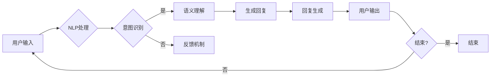

# 一切皆是映射：聊天机器人的智能化与人性化

> 关键词：聊天机器人，映射，自然语言处理，机器学习，深度学习，用户交互，人性化设计

## 1. 背景介绍

随着互联网的普及和人工智能技术的飞速发展，聊天机器人已经成为各类应用中不可或缺的一部分。从客服助手到虚拟助手，从智能客服到个人助理，聊天机器人在提高效率、降低成本、提升用户体验等方面发挥着越来越重要的作用。然而，如何实现聊天机器人的智能化与人性化，使其不仅能够高效地处理用户请求，还能理解用户情感、提供个性化服务，是一个值得深入探讨的话题。

## 2. 核心概念与联系

### 2.1 核心概念

#### 2.1.1 映射

在聊天机器人领域，映射指的是将用户的自然语言输入映射到机器能够理解和处理的内部表示的过程。这种映射包括词汇到词向量的转换、句法结构的分析、语义理解的推断等。

#### 2.1.2 自然语言处理（NLP）

自然语言处理是人工智能领域的一个重要分支，旨在使计算机能够理解和生成人类语言。NLP技术包括文本分析、语义理解、语音识别、机器翻译等。

#### 2.1.3 机器学习（ML）

机器学习是一种使计算机能够从数据中学习并做出决策的技术。在聊天机器人中，机器学习用于训练模型，使其能够识别用户意图、理解语言、生成回复等。

#### 2.1.4 深度学习（DL）

深度学习是机器学习的一个子领域，使用神经网络模型对数据进行学习。深度学习在聊天机器人中用于构建复杂的特征提取和模式识别模型。

#### 2.1.5 用户交互

用户交互是指用户与聊天机器人之间的互动过程。良好的用户交互体验是提升聊天机器人成功率和用户满意度的关键。

### 2.2 架构流程图

以下是聊天机器人架构的Mermaid流程图：



## 3. 核心算法原理 & 具体操作步骤

### 3.1 算法原理概述

聊天机器人的核心算法原理包括：

1. **文本预处理**：包括去除噪声、分词、词性标注等。
2. **意图识别**：通过机器学习或深度学习模型识别用户的意图。
3. **实体识别**：识别用户输入中的关键信息，如时间、地点、人物等。
4. **语义理解**：理解用户意图背后的深层含义。
5. **回复生成**：根据用户意图和上下文信息生成回复。

### 3.2 算法步骤详解

1. **文本预处理**：使用NLP工具对用户输入进行预处理，如去除标点符号、数字、特殊字符等。
2. **意图识别**：使用机器学习或深度学习模型对预处理后的文本进行分类，识别用户意图。
3. **实体识别**：使用NLP工具识别文本中的实体信息，如时间、地点、人物等。
4. **语义理解**：结合上下文信息，理解用户意图背后的深层含义。
5. **回复生成**：根据用户意图和上下文信息，生成相应的回复。

### 3.3 算法优缺点

#### 3.3.1 优点

- 提高服务效率，降低人力成本。
- 7x24小时提供服务，提升用户体验。
- 可扩展性强，易于集成到各种应用场景。

#### 3.3.2 缺点

- 需要大量标注数据进行训练。
- 难以理解复杂的人类语言和情感。
- 可能出现误解和歧义。

### 3.4 算法应用领域

聊天机器人的应用领域包括：

- 智能客服
- 虚拟助手
- 智能导购
- 智能教育
- 医疗健康
- 金融理财

## 4. 数学模型和公式 & 详细讲解 & 举例说明

### 4.1 数学模型构建

聊天机器人的数学模型主要包括：

- **词向量**：将文本中的词汇映射到高维空间中的向量。
- **神经网络**：用于学习词汇之间的关系和语义表示。
- **分类器**：用于识别用户意图。

### 4.2 公式推导过程

以词向量为例，常见的词向量模型有：

- **Word2Vec**：使用CBOW或Skip-gram模型将词汇映射到词向量。
- **GloVe**：使用全局词频信息学习词汇的共现矩阵，进而得到词向量。

### 4.3 案例分析与讲解

以Word2Vec为例，其核心公式如下：

$$
\text{Word2Vec} = \text{CBOW} \text{或} \text{Skip-gram}
$$

其中，CBOW模型使用上下文词汇预测中心词汇，Skip-gram模型使用中心词汇预测上下文词汇。

## 5. 项目实践：代码实例和详细解释说明

### 5.1 开发环境搭建

1. 安装Python和pip。
2. 安装NLP相关库，如NLTK、spaCy、gensim等。
3. 安装深度学习框架，如TensorFlow或PyTorch。

### 5.2 源代码详细实现

以下是一个简单的Word2Vec模型实现：

```python
from gensim.models import Word2Vec

# 加载文本数据
texts = [line.strip() for line in open('text.txt')]

# 训练Word2Vec模型
model = Word2Vec(texts, vector_size=100, window=5, min_count=5, workers=4)

# 获取词向量
vector = model.wv['hello']
print(vector)
```

### 5.3 代码解读与分析

上述代码使用gensim库实现了一个简单的Word2Vec模型。首先，加载文本数据并预处理。然后，使用`Word2Vec`函数训练模型，指定向量维度、窗口大小、最小词频等参数。最后，使用`wv`属性获取词向量。

### 5.4 运行结果展示

运行上述代码后，将输出“hello”的词向量。这个向量包含了“hello”在文本中的语义信息。

## 6. 实际应用场景

### 6.1 智能客服

智能客服是聊天机器人最典型的应用场景之一。通过聊天机器人，企业可以提供24小时在线客服服务，提高客户满意度，降低人力成本。

### 6.2 虚拟助手

虚拟助手可以协助用户完成各种任务，如查询天气、设置闹钟、发送邮件等。

### 6.3 智能导购

智能导购可以帮助用户在购物平台上找到合适的商品。

### 6.4 智能教育

智能教育可以提供个性化的学习方案，帮助学生提高学习成绩。

### 6.5 医疗健康

智能医疗可以辅助医生进行诊断和治疗，提高医疗服务质量。

### 6.6 金融理财

智能理财可以为用户提供投资建议，帮助用户实现财富增值。

## 7. 工具和资源推荐

### 7.1 学习资源推荐

- 《自然语言处理综论》
- 《深度学习》
- 《Python机器学习》

### 7.2 开发工具推荐

- TensorFlow
- PyTorch
- spaCy
- NLTK

### 7.3 相关论文推荐

- Word2Vec: http://arxiv.org/abs/1301.3781
- GloVe: http://nlp.stanford.edu/projects/glove/

## 8. 总结：未来发展趋势与挑战

### 8.1 研究成果总结

聊天机器人技术取得了显著的进展，但在智能化和人性化方面仍存在挑战。

### 8.2 未来发展趋势

- 基于深度学习的NLP技术将进一步发展，提高聊天机器人的智能化水平。
- 聊天机器人将更加注重用户体验，实现更加人性化的交互方式。
- 聊天机器人将与其他人工智能技术（如语音识别、图像识别等）融合，实现更全面的服务。

### 8.3 面临的挑战

- 如何提高聊天机器人的智能化水平，使其更好地理解人类语言和情感。
- 如何实现更加人性化的人际交互，提升用户体验。
- 如何保证聊天机器人的安全性和隐私保护。

### 8.4 研究展望

未来，聊天机器人技术将朝着以下方向发展：

- 更加智能化的对话理解能力
- 更加人性化的交互体验
- 更广泛的应用场景
- 更高的安全性

## 9. 附录：常见问题与解答

**Q1：如何提高聊天机器人的智能化水平？**

A：提高聊天机器人的智能化水平可以从以下几个方面入手：

- 使用更先进的NLP和深度学习技术。
- 收集更多高质量的标注数据，训练更强大的模型。
- 不断优化模型结构和训练策略。

**Q2：如何实现更加人性化的人际交互？**

A：实现更加人性化的人际交互可以从以下几个方面入手：

- 增强聊天机器人的情感识别和表达能力。
- 提供个性化服务，满足用户个性化需求。
- 采用自然语言生成技术，生成更加流畅、自然的回复。

**Q3：如何保证聊天机器人的安全性和隐私保护？**

A：保证聊天机器人的安全性和隐私保护可以从以下几个方面入手：

- 建立完善的数据安全管理制度。
- 采取数据加密措施，保护用户隐私。
- 加强对聊天机器人的安全监测和风险评估。

作者：禅与计算机程序设计艺术 / Zen and the Art of Computer Programming