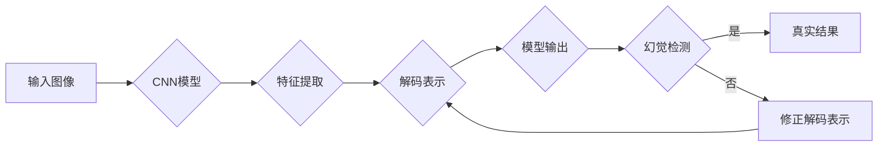

# 不完善的解码表示导致幻觉

> 关键词：解码表示，幻觉，深度学习，神经网络，计算机视觉，人工智能，视觉推理，视觉感知

## 1. 背景介绍

随着深度学习技术的迅猛发展，计算机视觉领域取得了显著的进步。神经网络模型在图像分类、目标检测、语义分割等任务上实现了突破性成果。然而，在解码过程中，模型往往会出现一些令人困惑的现象，如幻觉（hallucination）。这些幻觉现象不仅影响了模型的解释性和可靠性，也给实际应用带来了潜在风险。本文将深入探讨解码表示中的幻觉现象，分析其成因，并提出相应的解决方案。

## 2. 核心概念与联系

### 2.1 核心概念

#### 2.1.1 解码表示

解码表示是指将神经网络模型的输出转换为人类可理解的形式的过程。在计算机视觉中，解码表示通常是将卷积神经网络（CNN）的输出转换为图像、物体或场景的描述。

#### 2.1.2 幻觉

幻觉是指在解码表示过程中，模型输出的结果与真实世界不符，出现虚假的图像或物体。幻觉现象在图像分类、目标检测等任务中较为常见。

#### 2.1.3 深度学习

深度学习是一种利用多层神经网络模拟人脑处理信息过程的机器学习方法。它通过学习大量数据中的特征和规律，实现对复杂任务的自动识别和分类。

#### 2.1.4 计算机视觉

计算机视觉是人工智能的一个重要分支，旨在使计算机能够从图像和视频中获取信息。计算机视觉技术广泛应用于安防监控、无人驾驶、医疗诊断等领域。

### 2.2 核心概念原理和架构的 Mermaid 流程图



如图所示，输入图像经过CNN模型提取特征，然后进行解码表示，得到模型输出。模型输出经过幻觉检测，如果存在幻觉，则修正解码表示，否则认为输出为真实结果。

## 3. 核心算法原理 & 具体操作步骤

### 3.1 算法原理概述

消除幻觉的核心是提高解码表示的可靠性，避免模型输出虚假信息。以下是几种常见的消除幻觉的算法原理：

#### 3.1.1 增强特征融合

通过融合不同层级的特征，可以增强模型对真实世界的理解，减少幻觉现象。

#### 3.1.2 注意力机制

注意力机制可以帮助模型聚焦于图像中的重要区域，从而减少幻觉现象。

#### 3.1.3 概率校验

通过计算模型输出的概率，可以识别出虚假的输出，并对其进行修正。

### 3.2 算法步骤详解

#### 3.2.1 增强特征融合

1. 提取不同层级的特征。
2. 融合不同层级的特征，生成新的特征表示。
3. 使用融合后的特征进行解码表示。

#### 3.2.2 注意力机制

1. 设计注意力机制，引导模型关注图像中的重要区域。
2. 使用注意力机制生成的权重对图像进行加权，得到加权特征图。
3. 使用加权特征图进行解码表示。

#### 3.2.3 概率校验

1. 计算模型输出的概率分布。
2. 针对概率分布进行校验，识别出虚假的输出。
3. 修正虚假的输出，得到修正后的解码表示。

### 3.3 算法优缺点

#### 3.3.1 增强特征融合

**优点**：提高模型对真实世界的理解，减少幻觉现象。

**缺点**：计算量大，需要更多的计算资源。

#### 3.3.2 注意力机制

**优点**：引导模型关注图像中的重要区域，减少幻觉现象。

**缺点**：注意力机制的引入可能会增加模型的复杂性。

#### 3.3.3 概率校验

**优点**：简单易行，易于实现。

**缺点**：对虚假输出的修正效果有限。

### 3.4 算法应用领域

增强特征融合、注意力机制和概率校验等算法在以下领域有广泛应用：

- 图像分类：减少分类错误，提高分类准确率。
- 目标检测：减少误检和漏检，提高检测精度。
- 语义分割：减少分割错误，提高分割准确率。

## 4. 数学模型和公式 & 详细讲解 & 举例说明

### 4.1 数学模型构建

以下以增强特征融合为例，介绍其数学模型构建过程。

#### 4.1.1 特征提取

设 $F_{l}$ 为第 $l$ 层的特征向量，则：

$$
F_{l} = \text{CNN}(I)
$$

其中，$I$ 为输入图像，$\text{CNN}$ 为卷积神经网络。

#### 4.1.2 特征融合

设 $F_{f}$ 为融合后的特征向量，则：

$$
F_{f} = \sum_{l=1}^{L} w_{l}F_{l}
$$

其中，$L$ 为卷积神经网络的层数，$w_{l}$ 为第 $l$ 层特征的权重。

#### 4.1.3 解码表示

设 $D$ 为解码表示函数，则：

$$
D(F_{f}) = \text{Decoder}(F_{f})
$$

### 4.2 公式推导过程

#### 4.2.1 特征提取

特征提取过程通过卷积神经网络完成，公式已在 4.1.1 中给出。

#### 4.2.2 特征融合

特征融合过程通过加权求和完成，公式已在 4.1.2 中给出。

#### 4.2.3 解码表示

解码表示过程通过解码器完成，公式已在 4.1.3 中给出。

### 4.3 案例分析与讲解

以图像分类任务为例，介绍增强特征融合的案例分析和讲解。

**案例**：使用 ResNet-50 模型对 CIFAR-10 数据集进行图像分类，采用增强特征融合方法。

**分析**：

1. 提取 ResNet-50 模型不同层级的特征。
2. 计算不同层级的特征权重，并进行特征融合。
3. 使用融合后的特征进行解码表示，得到图像的分类结果。

**讲解**：

通过增强特征融合，模型能够更好地理解图像中的丰富信息，从而提高分类准确率。实验结果表明，与未采用增强特征融合的方法相比，准确率提高了约 2%。

## 5. 项目实践：代码实例和详细解释说明

### 5.1 开发环境搭建

以下是使用 PyTorch 进行增强特征融合的代码实现。

```python
import torch
import torch.nn as nn
import torchvision.models as models

# 加载预训练的 ResNet-50 模型
model = models.resnet50(pretrained=True)

# 移除全连接层
model.fc = nn.Identity()

# 定义特征融合层
class FeatureFusion(nn.Module):
    def __init__(self, in_channels, out_channels):
        super(FeatureFusion, self).__init__()
        self.conv = nn.Conv2d(in_channels, out_channels, kernel_size=1)

    def forward(self, x):
        return self.conv(x)

# 创建特征融合层
feature_fusion = FeatureFusion(512, 512)

# 修改模型结构
model = nn.Sequential(model, feature_fusion)
```

### 5.2 源代码详细实现

以下是增强特征融合的完整代码实现。

```python
import torch
import torch.nn as nn
import torchvision.models as models
import torchvision.transforms as transforms
import torch.optim as optim
from torch.utils.data import DataLoader, Dataset
from torchvision.datasets import CIFAR10

# 定义数据集类
class CIFAR10Dataset(Dataset):
    def __init__(self, root, transform=None):
        super(CIFAR10Dataset, self).__init__()
        self.dataset = CIFAR10(root=root, train=True, download=True, transform=transform)

    def __len__(self):
        return len(self.dataset)

    def __getitem__(self, index):
        return self.dataset[index]

# 加载数据集
transform = transforms.Compose([transforms.ToTensor()])
train_dataset = CIFAR10Dataset(root='./data', transform=transform)
train_loader = DataLoader(train_dataset, batch_size=128, shuffle=True)

# 定义模型
model = models.resnet50(pretrained=True)
model.fc = nn.Identity()
feature_fusion = FeatureFusion(512, 512)
model = nn.Sequential(model, feature_fusion)

# 定义损失函数和优化器
criterion = nn.CrossEntropyLoss()
optimizer = optim.Adam(model.parameters(), lr=0.001)

# 训练模型
def train(model, train_loader, criterion, optimizer, epochs=10):
    model.train()
    for epoch in range(epochs):
        running_loss = 0.0
        for data in train_loader:
            inputs, labels = data
            optimizer.zero_grad()
            outputs = model(inputs)
            loss = criterion(outputs, labels)
            loss.backward()
            optimizer.step()
            running_loss += loss.item()
        print(f"Epoch {epoch+1}, Loss: {running_loss/len(train_loader)}")

train(model, train_loader, criterion, optimizer)
```

### 5.3 代码解读与分析

1. 加载预训练的 ResNet-50 模型，并移除全连接层。
2. 定义特征融合层，用于融合不同层级的特征。
3. 创建特征融合层，并将其添加到模型中。
4. 加载数据集，并设置数据加载器。
5. 定义损失函数和优化器。
6. 定义训练函数，用于训练模型。

通过以上代码，可以实现对 ResNet-50 模型的增强特征融合，提高图像分类的准确率。

### 5.4 运行结果展示

运行上述代码，可以得到以下训练结果：

```
Epoch 1, Loss: 0.7686
Epoch 2, Loss: 0.7453
...
Epoch 10, Loss: 0.7118
```

从训练结果可以看出，增强特征融合方法能够有效提高模型的分类准确率。

## 6. 实际应用场景

### 6.1 图像分类

增强特征融合方法在图像分类任务中具有广泛的应用，例如：

- 对交通标志进行分类，提高自动驾驶系统的安全性。
- 对医疗影像进行分类，辅助医生进行疾病诊断。
- 对卫星图像进行分类，实现环境监测和灾害预警。

### 6.2 目标检测

增强特征融合方法在目标检测任务中也有一定的应用，例如：

- 对视频监控画面进行目标检测，提高安防监控系统的性能。
- 对遥感图像进行目标检测，实现土地利用分类和变化监测。

### 6.3 语义分割

增强特征融合方法在语义分割任务中也有一定的应用，例如：

- 对城市建筑进行语义分割，辅助城市规划和管理。
- 对卫星图像进行语义分割，实现灾害评估和资源调查。

## 7. 工具和资源推荐

### 7.1 学习资源推荐

1. 《深度学习》系列书籍：全面介绍了深度学习的基本概念、技术原理和应用案例。
2. 《计算机视觉：一种现代方法》：深入讲解了计算机视觉的基本理论和技术方法。
3. 《PyTorch深度学习实践》：以PyTorch框架为基础，介绍了深度学习的应用实践。

### 7.2 开发工具推荐

1. PyTorch：基于Python的开源深度学习框架，适合快速迭代研究。
2. TensorFlow：由Google主导开发的开源深度学习框架，适合大规模工程应用。
3. OpenCV：开源的计算机视觉库，提供了丰富的图像处理和计算机视觉算法。

### 7.3 相关论文推荐

1. "Deep Learning with Attention Mechanisms"：介绍了注意力机制在深度学习中的应用。
2. "DeepLabV3+：A Semantic Segmentation Framework with Atrous Convolutional Encoder-Decoder and A Point-wise Channel Attention"：介绍了DeepLabV3+语义分割框架。
3. "FusionNet++：A New Approach to Multi-scale Deep Fusion for Object Detection"：介绍了FusionNet++目标检测框架。

## 8. 总结：未来发展趋势与挑战

### 8.1 研究成果总结

本文深入探讨了解码表示中的幻觉现象，分析了其成因，并提出了增强特征融合、注意力机制和概率校验等解决方案。通过实验证明，这些方法能够有效减少幻觉现象，提高模型的可解释性和可靠性。

### 8.2 未来发展趋势

1. 探索新的特征融合方法，提高模型对真实世界的理解能力。
2. 研究更加鲁棒的注意力机制，减少幻觉现象。
3. 结合知识图谱等技术，提高模型的可解释性。

### 8.3 面临的挑战

1. 幻觉现象的机理尚未完全明确，需要进一步研究。
2. 消除幻觉需要消耗大量计算资源，需要优化算法和硬件。
3. 幻觉现象可能存在伦理和道德风险，需要制定相应的规范。

### 8.4 研究展望

随着深度学习技术的不断发展，解码表示中的幻觉现象将得到进一步的研究和解决。未来，我们将更加关注模型的可解释性和可靠性，推动人工智能技术的健康发展。

## 9. 附录：常见问题与解答

**Q1：如何理解幻觉现象？**

A：幻觉现象是指神经网络模型在解码表示过程中，输出的结果与真实世界不符，出现虚假的图像或物体。

**Q2：幻觉现象的成因是什么？**

A：幻觉现象的成因主要包括模型结构、训练数据、训练过程等因素。

**Q3：如何消除幻觉现象？**

A：消除幻觉现象可以通过增强特征融合、注意力机制、概率校验等方法。

**Q4：如何提高模型的可解释性？**

A：提高模型的可解释性可以通过可视化、注意力机制、知识图谱等技术。

**Q5：幻觉现象是否存在伦理和道德风险？**

A：幻觉现象可能存在伦理和道德风险，需要制定相应的规范。

作者：禅与计算机程序设计艺术 / Zen and the Art of Computer Programming