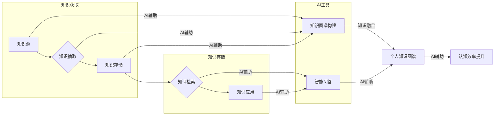

# 个人知识管理与AI工具的结合

> 关键词：知识管理，AI工具，个人知识图谱，信息过载，认知效率，人工智能，机器学习，自然语言处理，知识图谱构建

## 1. 背景介绍

在信息爆炸的时代，个人知识的积累与更新速度远超以往。如何高效地管理个人知识，成为了现代知识工作者面临的重要挑战。传统的个人知识管理方法，如笔记、文档整理等，虽然在一定程度上能够帮助人们组织信息，但随着知识量的不断增长，效率低下、信息难以检索等问题逐渐凸显。

近年来，随着人工智能技术的快速发展，AI工具在各个领域得到了广泛应用。将AI技术与个人知识管理相结合，构建智能化的个人知识管理体系，成为了提升认知效率、应对信息过载的有效途径。

## 2. 核心概念与联系

### 2.1 核心概念

**知识管理**：指通过各种方法和技术，对个人或组织的知识进行获取、创造、存储、共享和利用的过程。个人知识管理关注个体层面的知识积累与应用。

**AI工具**：指利用人工智能技术，如机器学习、自然语言处理、知识图谱等，实现对数据和信息的智能化处理和分析的工具。

**个人知识图谱**：以个人知识为研究对象，通过知识抽取、知识融合等技术构建的知识图谱，能够直观地展示知识之间的关系和结构。

**认知效率**：指个体在信息获取、处理、存储和应用过程中，所消耗的时间和精力。

### 2.2 核心概念原理和架构的 Mermaid 流程图



从流程图中可以看出，个人知识管理过程可以分为知识获取、知识存储、知识应用三个阶段。AI工具在这一过程中发挥着重要作用，如辅助知识抽取、知识存储、知识检索和知识应用等，最终构建个人知识图谱，并通过智能问答等手段提升认知效率。

## 3. 核心算法原理 & 具体操作步骤

### 3.1 算法原理概述

个人知识管理与AI工具的结合，主要涉及以下算法原理：

- **知识抽取**：从文本、图像、音频等数据源中提取有用信息，形成结构化的知识表示。
- **知识融合**：将来自不同来源的知识进行整合，形成统一的个人知识图谱。
- **知识检索**：根据用户需求，从个人知识图谱中快速检索相关知识点。
- **智能问答**：基于用户提出的问题，在个人知识图谱中寻找答案，并生成自然语言回答。

### 3.2 算法步骤详解

**步骤 1：知识获取**

1. **信息采集**：从书籍、文章、报告、演讲等多种渠道采集信息。
2. **知识抽取**：利用自然语言处理、信息抽取等技术，从采集到的信息中提取知识点和关系。

**步骤 2：知识存储**

1. **知识结构化**：将抽取到的知识点和关系进行结构化处理，形成知识图谱的节点和边。
2. **知识存储**：将结构化后的知识存储到数据库或知识图谱平台。

**步骤 3：知识检索**

1. **用户查询**：用户输入查询关键词或问题。
2. **知识检索**：基于用户查询，在知识图谱中检索相关知识点和关系。
3. **结果展示**：将检索到的知识点和关系以可视化的方式展示给用户。

**步骤 4：智能问答**

1. **问题解析**：将用户输入的问题进行解析，提取关键词和语义信息。
2. **知识检索**：在知识图谱中检索与问题相关的知识点和关系。
3. **答案生成**：根据检索到的知识点和关系，生成自然语言回答。

### 3.3 算法优缺点

**优点**：

- **提高知识获取效率**：AI工具能够自动化地从海量信息中提取有用知识，节省大量时间和精力。
- **提升知识存储和管理效率**：个人知识图谱能够直观地展示知识之间的关系，便于用户快速查找和梳理知识。
- **增强知识检索和问答能力**：智能问答系统能够快速、准确地回答用户问题，提高认知效率。
- **促进知识共享和传播**：个人知识管理系统可以方便地与其他用户共享知识，促进知识的传播和交流。

**缺点**：

- **知识质量依赖于数据源**：AI工具的知识抽取和融合效果受数据源质量的影响，存在一定的局限性。
- **隐私和安全问题**：个人知识管理系统中存储大量个人隐私信息，需要采取有效措施保障数据安全。
- **技术门槛较高**：构建个人知识管理系统需要一定的技术支持，对普通用户而言有一定难度。

### 3.4 算法应用领域

个人知识管理与AI工具的结合，在以下领域具有广泛的应用前景：

- **教育领域**：构建个性化学习系统，为学生提供定制化的学习内容和学习路径。
- **科研领域**：帮助科研人员快速获取相关领域的知识，提高科研效率。
- **企业管理**：帮助企业员工共享知识，提升团队协作效率。
- **医疗领域**：为医生提供辅助诊断和治疗建议，提高医疗质量。

## 4. 数学模型和公式 & 详细讲解 & 举例说明

### 4.1 数学模型构建

个人知识图谱的构建主要基于图论和语义网络等技术。以下是一个简单的数学模型示例：

$$
G = (V, E)
$$

其中，$V$ 是图中的节点集合，表示知识点；$E$ 是图中的边集合，表示知识点之间的关系。

### 4.2 公式推导过程

以知识抽取为例，假设我们使用基于机器学习的文本分类算法对文本数据进行分类。以下是分类算法的公式推导过程：

1. **特征提取**：将文本数据转换为特征向量 $X \in \mathbb{R}^n$。
2. **模型训练**：使用标注数据对分类器进行训练，得到参数 $\theta$。
3. **预测**：将待分类文本转换为特征向量 $X$，计算预测概率 $P(Y|X;\theta)$。

$$
P(Y|X;\theta) = \frac{\exp(\theta^T X)}{\sum_{y \in Y} \exp(\theta^T X_y)}
$$

### 4.3 案例分析与讲解

以下是一个基于知识图谱的个人知识管理系统案例：

**案例背景**：某公司员工需要管理大量技术知识，包括技术文档、技术博客、在线课程等。

**解决方案**：

1. **知识获取**：通过爬虫技术获取技术文档、技术博客、在线课程等数据源。
2. **知识抽取**：利用自然语言处理、信息抽取等技术，从数据源中提取知识点和关系。
3. **知识存储**：将抽取到的知识点和关系存储到知识图谱平台。
4. **知识检索**：用户输入查询关键词，系统根据关键词在知识图谱中检索相关知识点和关系。
5. **智能问答**：用户提出问题，系统根据问题在知识图谱中检索答案，并生成自然语言回答。

**案例效果**：

- 员工能够快速找到所需的技术知识。
- 提高团队知识共享和协作效率。
- 降低新员工的技术培训成本。

## 5. 项目实践：代码实例和详细解释说明

### 5.1 开发环境搭建

1. 安装Python环境。
2. 安装相关库：`nltk`、`spacy`、`neo4j`、`networkx`等。

### 5.2 源代码详细实现

以下是一个简单的知识抽取和知识图谱构建的代码示例：

```python
from nltk.tokenize import word_tokenize
from spacy.lang.en import English
from neo4j import GraphDatabase

# 初始化Spacy
nlp = English()

# 创建Neo4j数据库连接
driver = GraphDatabase.driver("bolt://localhost:7687", auth=("neo4j", "password"))

# 知识抽取函数
def extract_knowledge(text):
    doc = nlp(text)
    entities = [(ent.text, ent.label_) for ent in doc.ents]
    return entities

# 知识图谱构建函数
def build_knowledge_graph(entities):
    with driver.session() as session:
        for entity in entities:
            node = session.run("MERGE (n:Entity {name: $name, type: $type})", name=entity[0], type=entity[1])

# 示例文本
text = "Apple is a fruit."

# 知识抽取
entities = extract_knowledge(text)

# 知识图谱构建
build_knowledge_graph(entities)

# 关闭数据库连接
driver.close()
```

### 5.3 代码解读与分析

以上代码展示了如何使用Spacy进行文本分词和实体识别，以及如何使用Neo4j构建知识图谱。首先，我们使用Spacy将文本分词，并识别出实体及其类型。然后，将实体信息存储到Neo4j数据库中，构建知识图谱。

### 5.4 运行结果展示

运行上述代码后，Neo4j数据库中会创建一个名为“Entity”的节点，存储了文本中的实体信息和类型。

## 6. 实际应用场景

### 6.1 教育领域

**场景**：为学生提供个性化学习路径。

**解决方案**：

1. 根据学生的学习兴趣和背景知识，构建个人知识图谱。
2. 根据知识图谱，为学生推荐合适的学习资源。
3. 根据学生的学习进度，动态调整学习路径。

### 6.2 科研领域

**场景**：为科研人员提供知识搜索和辅助决策。

**解决方案**：

1. 收集科研领域的文献、专利、报告等数据。
2. 利用知识图谱技术，将数据转换为结构化的知识表示。
3. 为科研人员提供基于知识图谱的知识搜索和辅助决策。

### 6.3 企业管理

**场景**：帮助企业员工共享知识，提升团队协作效率。

**解决方案**：

1. 建立企业内部知识库，收集员工的知识和经验。
2. 利用知识图谱技术，将知识库中的知识进行结构化处理。
3. 提供基于知识图谱的知识搜索和问答功能，方便员工快速获取所需知识。

### 6.4 未来应用展望

随着AI技术的不断发展，个人知识管理与AI工具的结合将在以下方面取得更大突破：

1. **个性化推荐**：基于个人知识图谱和用户行为，为用户提供个性化推荐。
2. **知识共创**：利用AI工具，促进知识的共享和共创。
3. **智能问答**：基于知识图谱和自然语言处理技术，实现更智能的问答系统。
4. **知识自动化生成**：利用AI工具，实现知识的自动化生成和更新。

## 7. 工具和资源推荐

### 7.1 学习资源推荐

1. 《图解人工智能》
2. 《深度学习》
3. 《自然语言处理综论》
4. 《图神经网络》

### 7.2 开发工具推荐

1. Neo4j：图数据库，用于存储和管理知识图谱。
2. NetworkX：Python图处理库，用于构建和分析知识图谱。
3. Spacy：自然语言处理库，用于文本分词、词性标注、实体识别等。
4. NLTK：自然语言处理库，用于文本处理和机器学习。

### 7.3 相关论文推荐

1. "Knowledge Graphs and Personalized Recommendations" - KEG Lab
2. "A Survey of Knowledge Graph Construction Techniques" - ACM Computing Surveys
3. "Neural Knowledge Graph Embeddings" - KEG Lab
4. "A Graph Neural Network Approach to Personalized Learning" - Microsoft Research

## 8. 总结：未来发展趋势与挑战

### 8.1 研究成果总结

本文从个人知识管理与AI工具的结合出发，探讨了知识管理、AI工具、个人知识图谱等核心概念，并介绍了相关算法原理和具体操作步骤。通过案例分析，展示了个人知识管理与AI工具在实际应用中的价值。最后，对个人知识管理与AI工具的未来发展趋势和挑战进行了展望。

### 8.2 未来发展趋势

1. **个性化知识管理**：根据用户需求，提供定制化的知识服务。
2. **跨模态知识管理**：结合文本、图像、音频等多种模态，构建更加丰富的知识体系。
3. **知识自动化生成**：利用AI工具，实现知识的自动化生成和更新。
4. **知识共创与共享**：促进知识的共享和共创，构建知识社区。

### 8.3 面临的挑战

1. **数据质量和标注**：高质量的数据和准确的标注是构建有效知识图谱的基础。
2. **知识表示**：如何将复杂知识有效地表示为结构化的知识图谱，是一个挑战。
3. **知识推理**：如何从知识图谱中推理出新的知识，是一个难点。
4. **隐私和安全**：个人知识管理系统中存储大量个人隐私信息，需要采取有效措施保障数据安全。

### 8.4 研究展望

个人知识管理与AI工具的结合，将推动知识的获取、存储、共享和应用，为人类社会的进步和发展贡献力量。未来，我们需要不断探索新的技术和方法，解决现有挑战，推动个人知识管理与AI工具的结合迈向更高水平。

## 9. 附录：常见问题与解答

**Q1：什么是知识图谱？**

A：知识图谱是一种用于表示实体及其关系的知识库，它将现实世界中的知识以图的形式进行建模，便于人们理解和处理。

**Q2：什么是自然语言处理？**

A：自然语言处理是人工智能领域的一个分支，旨在使计算机能够理解、解释和生成人类语言。

**Q3：如何评估知识图谱的质量？**

A：评估知识图谱的质量可以从以下几个方面进行：

- **知识覆盖度**：知识图谱中包含的实体和关系的数量。
- **知识准确性**：知识图谱中存储的知识是否准确。
- **知识一致性**：知识图谱中实体和关系之间的逻辑关系是否一致。
- **知识更新速度**：知识图谱的更新速度是否及时。

**Q4：如何确保个人知识管理系统的安全性？**

A：为确保个人知识管理系统的安全性，可以从以下几个方面进行：

- **数据加密**：对用户数据和敏感信息进行加密处理。
- **访问控制**：对系统进行访问控制，确保只有授权用户才能访问。
- **安全审计**：对系统进行安全审计，及时发现和修复安全漏洞。
- **备份和恢复**：定期备份用户数据，以便在数据丢失或损坏时进行恢复。

**Q5：如何评估个人知识管理系统的有效性？**

A：评估个人知识管理系统的有效性可以从以下几个方面进行：

- **知识获取效率**：用户获取所需知识的速度和准确性。
- **知识应用效率**：用户应用知识的效率和质量。
- **知识共享效率**：知识在用户之间的共享和传播效率。
- **用户满意度**：用户对个人知识管理系统的满意度。

作者：禅与计算机程序设计艺术 / Zen and the Art of Computer Programming