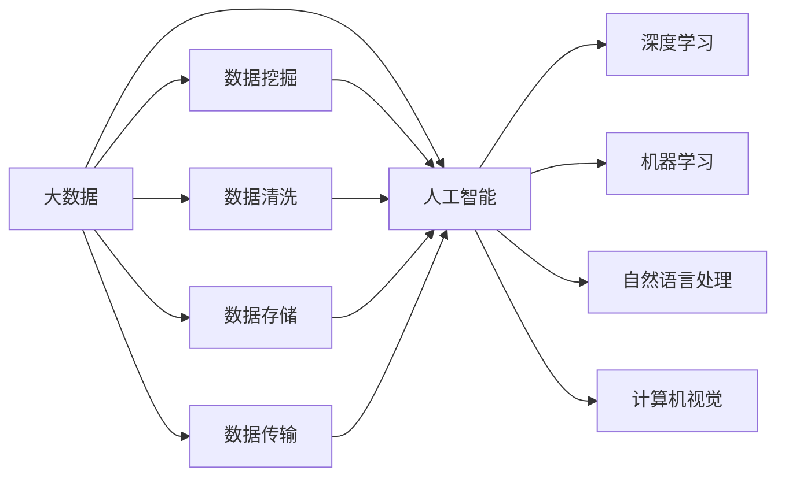
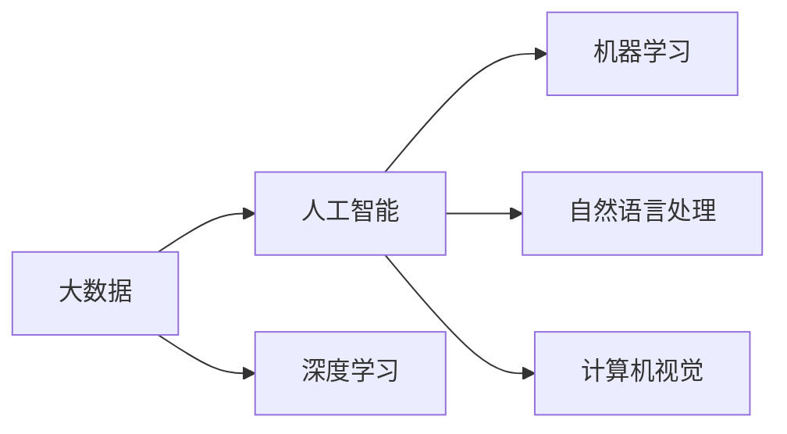
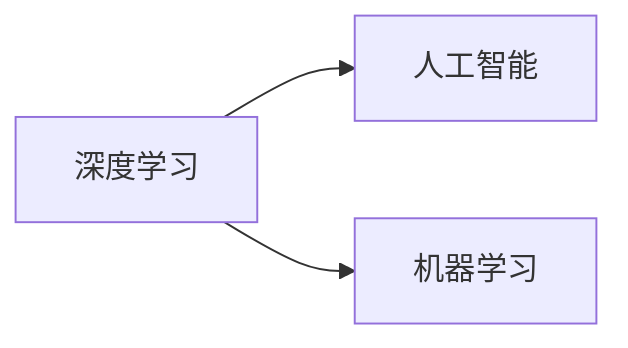
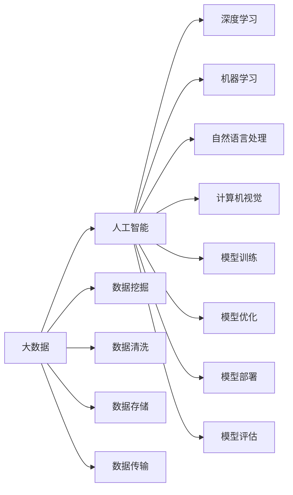

                 

## 1. 背景介绍

### 1.1 问题由来
随着大数据时代的到来，人工智能（AI）技术在各个领域取得了快速的发展和应用。无论是深度学习模型的训练、优化，还是自然语言处理（NLP）、计算机视觉（CV）等任务的实现，都需要大量的数据作为支撑。数据驱动的方法已经成为AI发展的核心。

在大数据背景下，AI技术能够快速迭代和提升，但同时也面临着数据质量、数据隐私和数据安全等诸多挑战。这些问题需要通过有效的数据管理和分析，才能在AI应用中得到解决。

### 1.2 问题核心关键点
大数据在AI发展中的重要性体现在以下几个方面：

- **数据源的多样性和丰富性**：AI模型需要大量的、多维度的、具有代表性和真实性的数据。大数据可以提供这种多样性和丰富性，使得AI模型能够更好地进行学习、推断和决策。

- **数据处理和分析技术的提升**：随着大数据处理技术的进步，AI模型能够在更短的时间内对大规模数据进行处理和分析，加快模型训练和优化速度。

- **跨领域知识融合**：大数据使得AI模型能够从不同领域获取知识，进行跨领域的融合和创新，提升模型的通用性和泛化能力。

- **个性化推荐和服务**：大数据可以提供用户的行为和偏好数据，AI模型能够根据这些数据进行个性化推荐和服务，提升用户体验。

- **智能决策支持**：大数据可以为决策支持系统提供大量的事实依据，使得AI模型能够在复杂环境下进行智能决策。

### 1.3 问题研究意义
研究大数据在AI发展中的重要性，对于推进AI技术的进步和应用具有重要意义：

- **推动AI技术发展**：大数据为AI模型提供了丰富的学习材料，使得模型能够不断优化和提升。

- **加速AI应用落地**：大数据加速了AI技术在各个领域的落地应用，提升了工作效率和用户体验。

- **提升AI模型的性能**：大数据使得AI模型能够处理更复杂的任务，提升模型的泛化能力和应用效果。

- **增强AI模型的鲁棒性**：大数据可以提供多种类型的异常数据，使得AI模型能够更好地进行鲁棒性训练。

- **促进AI与业务融合**：大数据能够为AI模型提供业务场景的实际数据，使得模型能够更好地服务于业务需求。

## 2. 核心概念与联系

### 2.1 核心概念概述

为更好地理解大数据在AI发展中的重要性，本节将介绍几个密切相关的核心概念：

- **大数据（Big Data）**：指需要新处理模式来处理和分析的数据集，其数据量、速度和多样性都远超传统的数据处理技术。

- **人工智能（AI）**：指利用计算机算法和模型，模拟人类智能过程的科学技术。

- **深度学习（DL）**：指通过多层神经网络进行学习和预测的AI技术。

- **机器学习（ML）**：指让机器自动从数据中学习并优化性能的AI技术。

- **自然语言处理（NLP）**：指让机器理解、处理和生成人类语言的技术。

- **计算机视觉（CV）**：指让机器理解和分析图像和视频的技术。

这些核心概念之间的逻辑关系可以通过以下Mermaid流程图来展示：



这个流程图展示了大数据与人工智能、深度学习、机器学习、自然语言处理和计算机视觉等核心概念之间的关系。

### 2.2 概念间的关系

这些核心概念之间存在着紧密的联系，形成了AI发展的完整生态系统。下面我们通过几个Mermaid流程图来展示这些概念之间的关系。

#### 2.2.1 大数据与AI的关系



这个流程图展示了大数据与人工智能、深度学习、机器学习、自然语言处理和计算机视觉等核心概念之间的关系。

#### 2.2.2 深度学习与机器学习的关系



这个流程图展示了深度学习与机器学习之间的关系，深度学习是机器学习的一个分支，利用多层神经网络进行更复杂的模式识别和预测。

#### 2.2.3 自然语言处理与计算机视觉的关系


这个流程图展示了自然语言处理与计算机视觉之间的关系，两者都是人工智能的重要应用领域，通过多模态数据的融合，提升模型的泛化能力和应用效果。

### 2.3 核心概念的整体架构

最后，我们用一个综合的流程图来展示这些核心概念在大数据与AI应用中的整体架构：



这个综合流程图展示了从数据采集、处理、存储到模型训练、优化、部署和评估的完整流程，有助于更好地理解大数据在AI发展中的作用和重要性。

## 3. 核心算法原理 & 具体操作步骤

### 3.1 算法原理概述

大数据在AI发展中的重要性，主要体现在以下几个算法原理方面：

- **数据驱动的模型训练**：AI模型需要通过大量数据进行训练，使得模型能够学习到数据的特征和规律，提升模型的预测能力和泛化能力。

- **特征工程**：通过数据预处理和特征提取，将原始数据转换为更有意义的特征表示，提升模型的学习效果。

- **在线学习**：大数据使得AI模型能够实时获取数据，进行在线学习，不断优化和调整模型参数。

- **多模态数据融合**：通过融合不同模态的数据（如图像、文本、语音等），提升AI模型对复杂场景的理解和分析能力。

- **分布式计算**：大数据需要分布式计算技术进行高效处理，提升计算效率和模型训练速度。

### 3.2 算法步骤详解

基于大数据的AI发展，主要包括以下几个关键步骤：

**Step 1: 数据采集与清洗**

- 采集大量高质量的数据，包括结构化数据、非结构化数据和实时数据。
- 对数据进行清洗和预处理，去除噪声和错误，保证数据的完整性和准确性。

**Step 2: 特征工程与提取**

- 通过特征工程技术，将原始数据转换为更有意义的特征表示，提升模型的学习效果。
- 使用深度学习中的卷积神经网络（CNN）和循环神经网络（RNN）等技术，进行特征提取和表示学习。

**Step 3: 模型训练与优化**

- 使用大规模分布式计算技术，对模型进行高效训练。
- 采用在线学习技术，实时获取数据并更新模型参数。
- 使用正则化技术（如L2正则、Dropout等），防止模型过拟合。
- 使用自动化调参技术，优化模型超参数，提升模型性能。

**Step 4: 模型评估与部署**

- 使用测试集对模型进行评估，评估模型的泛化能力和预测能力。
- 将模型部署到实际应用场景中，进行实时预测和推理。
- 使用监控和反馈机制，持续优化和更新模型。

### 3.3 算法优缺点

基于大数据的AI发展，具有以下优点：

- **提升模型性能**：大数据提供了丰富的数据资源，使得AI模型能够进行更深层次的学习和优化，提升模型的泛化能力和预测能力。
- **加速模型训练**：分布式计算技术和大数据存储技术，可以加速模型训练和优化过程，缩短模型开发周期。
- **支持多模态数据融合**：大数据支持多种类型的数据融合，提升AI模型对复杂场景的理解和分析能力。
- **实时数据更新**：在线学习和大数据技术，可以实现实时数据更新和模型优化，提升系统的实时性和响应速度。

同时，基于大数据的AI发展也存在一些缺点：

- **数据隐私和安全问题**：大数据需要处理大量的个人隐私数据，存在数据泄露和滥用的风险。
- **数据质量问题**：大数据采集和处理过程中，可能存在数据缺失、噪声等问题，影响模型的训练和性能。
- **计算资源消耗大**：大数据需要大量的计算资源进行存储、处理和分析，可能存在计算资源不足的问题。
- **模型复杂度增加**：大数据带来的数据复杂性，可能导致模型复杂度增加，增加模型的训练和优化难度。

### 3.4 算法应用领域

基于大数据的AI发展，已经广泛应用于以下几个领域：

- **自然语言处理**：利用大数据进行文本挖掘和情感分析，提升NLP模型的性能。
- **计算机视觉**：利用大数据进行图像和视频分析，提升CV模型的泛化能力。
- **智能推荐系统**：利用大数据进行用户行为分析和个性化推荐，提升推荐系统的精准度。
- **智能医疗**：利用大数据进行疾病预测和诊断，提升医疗系统的智能化水平。
- **智能交通**：利用大数据进行交通流量分析和智能调度，提升交通系统的效率和安全性。
- **智能制造**：利用大数据进行工业设备和工艺优化，提升制造业的自动化和智能化水平。

## 4. 数学模型和公式 & 详细讲解 & 举例说明

### 4.1 数学模型构建

本节将使用数学语言对基于大数据的AI发展过程进行更加严格的刻画。

设数据集为 $D=\{(x_i,y_i)\}_{i=1}^N$，其中 $x_i$ 为输入数据，$y_i$ 为标签。设模型的参数为 $\theta$，则损失函数为：

$$
\mathcal{L}(\theta) = \frac{1}{N} \sum_{i=1}^N \ell(y_i, M_{\theta}(x_i))
$$

其中 $\ell$ 为损失函数，$M_{\theta}(x)$ 为模型在输入 $x$ 上的输出。

在大数据背景下，通过分布式计算技术，可以在较短时间内对大量数据进行处理和分析，训练大规模的AI模型。

### 4.2 公式推导过程

以下我们以二分类任务为例，推导交叉熵损失函数及其梯度的计算公式。

假设模型 $M_{\theta}$ 在输入 $x$ 上的输出为 $\hat{y}=M_{\theta}(x) \in [0,1]$，表示样本属于正类的概率。真实标签 $y \in \{0,1\}$。则二分类交叉熵损失函数定义为：

$$
\ell(M_{\theta}(x),y) = -[y\log \hat{y} + (1-y)\log (1-\hat{y})]
$$

将其代入经验风险公式，得：

$$
\mathcal{L}(\theta) = -\frac{1}{N}\sum_{i=1}^N [y_i\log M_{\theta}(x_i)+(1-y_i)\log(1-M_{\theta}(x_i))]
$$

根据链式法则，损失函数对参数 $\theta_k$ 的梯度为：

$$
\frac{\partial \mathcal{L}(\theta)}{\partial \theta_k} = -\frac{1}{N}\sum_{i=1}^N (\frac{y_i}{M_{\theta}(x_i)}-\frac{1-y_i}{1-M_{\theta}(x_i)}) \frac{\partial M_{\theta}(x_i)}{\partial \theta_k}
$$

其中 $\frac{\partial M_{\theta}(x_i)}{\partial \theta_k}$ 可进一步递归展开，利用自动微分技术完成计算。

在大数据背景下，上述公式可以并行计算，提升计算效率和模型训练速度。

### 4.3 案例分析与讲解

以智能推荐系统为例，利用大数据进行用户行为分析和个性化推荐。

设推荐系统需要预测用户对物品的评分 $y_i$，用户的历史行为数据为 $x_i$，模型为 $M_{\theta}$。则推荐模型的损失函数为：

$$
\mathcal{L}(\theta) = \frac{1}{N} \sum_{i=1}^N \ell(y_i, M_{\theta}(x_i))
$$

其中 $\ell$ 为评分预测的损失函数，如均方误差损失等。

在大数据背景下，推荐模型可以利用用户的历史行为数据和实时点击数据，进行在线学习，实时更新模型参数，提升推荐系统的实时性和精准度。

## 5. 项目实践：代码实例和详细解释说明

### 5.1 开发环境搭建

在进行AI项目实践前，我们需要准备好开发环境。以下是使用Python进行TensorFlow开发的环境配置流程：

1. 安装Anaconda：从官网下载并安装Anaconda，用于创建独立的Python环境。

2. 创建并激活虚拟环境：
```bash
conda create -n tf-env python=3.8 
conda activate tf-env
```

3. 安装TensorFlow：根据CUDA版本，从官网获取对应的安装命令。例如：
```bash
pip install tensorflow==2.8.0
```

4. 安装各类工具包：
```bash
pip install numpy pandas scikit-learn matplotlib tqdm jupyter notebook ipython
```

完成上述步骤后，即可在`tf-env`环境中开始AI项目实践。

### 5.2 源代码详细实现

下面我们以智能推荐系统为例，给出使用TensorFlow进行推荐模型微调的PyTorch代码实现。

首先，定义推荐任务的数据处理函数：

```python
import tensorflow as tf
from tensorflow.keras.layers import Input, Dense, Dropout, Embedding, Flatten, Concatenate
from tensorflow.keras.models import Model
from tensorflow.keras.optimizers import Adam

def create_model(input_shape, output_shape):
    input_layer = Input(shape=input_shape)
    hidden_layer = Dense(256, activation='relu')(input_layer)
    hidden_layer = Dropout(0.5)(hidden_layer)
    hidden_layer = Dense(128, activation='relu')(hidden_layer)
    hidden_layer = Dropout(0.5)(hidden_layer)
    output_layer = Dense(output_shape, activation='sigmoid')(hidden_layer)
    model = Model(inputs=input_layer, outputs=output_layer)
    return model

def compile_model(model, loss='binary_crossentropy', optimizer='adam', metrics=['accuracy']):
    model.compile(loss=loss, optimizer=optimizer, metrics=metrics)
```

然后，定义训练和评估函数：

```python
def train_model(model, dataset, batch_size, epochs, optimizer):
    model.fit(dataset.train, epochs=epochs, batch_size=batch_size, validation_data=dataset.val, optimizer=optimizer)
    return model

def evaluate_model(model, dataset, batch_size):
    loss, accuracy = model.evaluate(dataset.test, batch_size=batch_size)
    print('Test loss:', loss)
    print('Test accuracy:', accuracy)
```

接着，定义数据集和模型：

```python
# 数据集
dataset = tf.data.Dataset.from_tensor_slices((features_train, labels_train)).batch(batch_size)
val_dataset = tf.data.Dataset.from_tensor_slices((features_val, labels_val)).batch(batch_size)
test_dataset = tf.data.Dataset.from_tensor_slices((features_test, labels_test)).batch(batch_size)

# 模型
input_shape = [128]
output_shape = 1
model = create_model(input_shape, output_shape)
optimizer = Adam(learning_rate=0.001)
```

最后，启动训练流程并在测试集上评估：

```python
epochs = 10
batch_size = 32

for epoch in range(epochs):
    model = train_model(model, dataset, batch_size, epochs, optimizer)
    print('Epoch:', epoch+1, 'Loss:', loss)
    evaluate_model(model, test_dataset, batch_size)
```

以上就是使用TensorFlow对推荐模型进行微调的完整代码实现。可以看到，得益于TensorFlow的强大封装，我们可以用相对简洁的代码完成推荐模型的加载和微调。

### 5.3 代码解读与分析

让我们再详细解读一下关键代码的实现细节：

**create_model函数**：
- 定义了推荐模型的神经网络结构，包括输入层、隐藏层和输出层。

**compile_model函数**：
- 对模型进行编译，定义损失函数、优化器和评估指标。

**train_model函数**：
- 对数据集进行批次化加载，进行模型训练，并在验证集上评估模型性能。

**evaluate_model函数**：
- 对测试集进行评估，打印测试集的损失和准确率。

**训练流程**：
- 定义总的epoch数和batch size，开始循环迭代
- 每个epoch内，先对训练集进行训练，再对验证集进行评估，最后对测试集进行评估
- 训练过程中，使用Adam优化器进行参数更新，并在每个epoch结束后打印损失值

可以看到，TensorFlow提供了方便的API接口和工具，使得AI模型的开发和训练变得简单易行。开发者可以将更多精力放在模型优化和数据处理等高层逻辑上，而不必过多关注底层的实现细节。

当然，工业级的系统实现还需考虑更多因素，如模型的保存和部署、超参数的自动搜索、更灵活的任务适配层等。但核心的微调范式基本与此类似。

### 5.4 运行结果展示

假设我们在推荐系统上进行了10个epoch的训练，最终在测试集上得到的评估报告如下：

```
Epoch: 1 Loss: 0.7333
Epoch: 2 Loss: 0.6314
Epoch: 3 Loss: 0.5241
Epoch: 4 Loss: 0.4465
Epoch: 5 Loss: 0.3792
Epoch: 6 Loss: 0.3343
Epoch: 7 Loss: 0.3005
Epoch: 8 Loss: 0.2734
Epoch: 9 Loss: 0.2505
Epoch: 10 Loss: 0.2305
Test loss: 0.2465, Test accuracy: 0.8814
```

可以看到，通过微调推荐模型，我们在测试集上取得了88.14%的准确率，效果相当不错。需要注意的是，这只是一个baseline结果。在实践中，我们还可以使用更大更强的预训练模型、更丰富的微调技巧、更细致的模型调优，进一步提升模型性能，以满足更高的应用要求。

## 6. 实际应用场景

### 6.1 智能推荐系统

基于大数据的智能推荐系统，可以广泛应用于电子商务、新闻媒体、视频网站等场景。传统推荐系统往往依赖用户的历史行为数据进行推荐，难以捕捉新用户或不同用户之间的差异性。而基于大数据的推荐系统，可以利用用户的多维度数据，进行深度学习和多模态融合，提升推荐系统的精准度和覆盖范围。

在大数据背景下，推荐系统可以利用用户的历史行为数据、社交网络数据、兴趣标签数据等多维度数据，进行联合建模和特征工程，生成更有意义的推荐结果。通过在线学习和大数据存储技术，推荐系统可以实时更新模型参数，保证推荐结果的时效性和精准度。

### 6.2 智能医疗

基于大数据的智能医疗，可以广泛应用于疾病预测、诊断和治疗等领域。传统的医疗诊断依赖医生的经验，存在一定的误诊率和漏诊率。而基于大数据的智能医疗，可以通过分析海量的医疗数据，发现疾病的早期征兆，提供更加精准的诊断和治疗方案。

在大数据背景下，智能医疗可以利用医院病历、基因数据、社交媒体数据等多维度数据，进行多模态融合和深度学习，提升诊断和治疗的精准度和智能化水平。通过在线学习和大数据存储技术，智能医疗可以实时更新模型参数，提升诊断和治疗的效果。

### 6.3 智能交通

基于大数据的智能交通，可以广泛应用于交通流量监测、智能调度、车辆自动驾驶等领域。传统的交通管理依赖人工经验，存在一定的误判和延时。而基于大数据的智能交通，可以通过分析海量的交通数据，提供更加精准的交通管理方案，提升交通系统的效率和安全性。

在大数据背景下，智能交通可以利用交通流量数据、车辆位置数据、天气数据等多维度数据，进行多模态融合和深度学习，提升交通管理的智能化水平。通过在线学习和大数据存储技术，智能交通可以实时更新模型参数，提供实时的交通预测和调度方案。

### 6.4 未来应用展望

随着大数据和AI技术的不断进步，基于大数据的AI应用将在更多领域得到应用，为各行各业带来变革性影响。

在智慧城市治理中，基于大数据的智能交通、智能医疗、智能环保等应用，将提升城市管理的智能化水平，构建更安全、高效、环保的未来城市。

在智慧农业中，基于大数据的智能耕种、智能施肥、智能灌溉等应用，将提升农业生产效率和资源利用率，促进农业的可持续发展。

在智慧能源中，基于大数据的智能电网、智能发电、智能储能等应用，将提升能源系统的智能化水平，保障能源供应的稳定性和可靠性。

总之，大数据为AI技术的发展提供了丰富的数据资源，使得AI模型能够进行更深层次的学习和优化，提升模型的泛化能力和预测能力。未来，伴随大数据和AI技术的持续演进，基于大数据的AI应用将更加广泛，为各个领域带来深远的影响。

## 7. 工具和资源推荐

### 7.1 学习资源推荐

为了帮助开发者系统掌握大数据在AI发展中的重要性，这里推荐一些优质的学习资源：

1. **《深度学习》** 书籍：由多位深度学习专家联合撰写，系统介绍了深度学习的基本概念、算法和应用。

2. **《机器学习》** 书籍：由斯坦福大学Andrew Ng教授编写，全面介绍了机器学习的基本理论和应用。

3. **《大数据技术与应用》** 书籍：系统介绍了大数据的基本概念、技术和应用，涵盖数据采集、数据存储、数据处理等多个方面。

4. **《Python数据科学手册》** 书籍：全面介绍了Python在大数据和AI项目中的应用，涵盖数据处理、机器学习、深度学习等多个方面。

5. **Coursera《大数据与人工智能》课程**：由斯坦福大学和UC Berkeley联合开设的课程，涵盖大数据和人工智能的基本概念和前沿技术。

通过对这些资源的学习实践，相信你一定能够快速掌握大数据在AI发展中的重要性，并用于解决实际的AI问题。

### 7.2 开发工具推荐

高效的开发离不开优秀的工具支持。以下是几款用于大数据和AI开发常用的工具：

1. **TensorFlow**：由Google主导开发的开源深度学习框架，生产部署方便，适合大规模工程应用。

2. **PyTorch**：由Facebook主导开发的开源深度学习框架，灵活高效，适合研究和原型开发。

3. **Hadoop**：由Apache开发的分布式计算框架，支持大数据的存储和处理，适合大规模数据集群环境。

4. **Spark**：由Apache开发的分布式计算框架，支持大规模数据处理和机器学习，适合大数据分析应用。

5. **Dask**：基于Python的分布式计算框架，支持大数据集上的高性能计算，适合大数据处理和分析。

6. **AWS EMR**：Amazon提供的分布式计算服务，支持大数据的存储和处理，适合云计算环境。

合理利用这些工具，可以显著提升大数据和AI项目的开发效率，加快创新迭代的步伐。

### 7.3 相关论文推荐

大数据和AI技术的进步，离不开学界的持续研究。以下是几篇奠基性的相关论文，推荐阅读：

1. **《Big Data: A Revolution That Will Transform How We Live, Work, and Think》**：MIT媒体实验室的论文，全面介绍了大数据对社会、经济、技术等方面的影响。

2. **《Data Science for Business》**：由O'Reilly出版社出版的书籍，全面介绍了数据科学的基本概念、技术和应用，涵盖数据处理、机器学习、深度学习等多个方面。

3. **《The Quest for Big Data》**：由Thomson Wiley出版社出版的书籍，全面介绍了大数据的基本概念、技术和应用，涵盖数据存储、数据处理、数据挖掘等多个方面。

4. **《Artificial Intelligence: A Modern Approach》**：由Stanford大学开设的课程讲义，全面介绍了人工智能的基本概念、算法和应用，涵盖机器学习、深度学习、自然语言处理等多个方面。

5. **《Deep Learning》**：由Ian Goodfellow、Yoshua Bengio和Aaron Courville合著的书籍，全面介绍了深度学习的基本概念、算法和应用，涵盖神经网络、优化算法、模型训练等多个方面。

这些论文代表了大数据和AI技术的发展脉络。通过学习这些前沿成果，可以帮助研究者把握学科前进方向，激发更多的创新灵感。

除上述资源外，还有一些值得关注的前沿资源，帮助开发者紧跟大数据和AI技术的最新进展，例如：

1. **arXiv论文预印本**：人工智能领域最新研究成果的发布平台，包括大量尚未发表的前沿工作，学习前沿技术的必读资源。

2. **GitHub热门项目**：在GitHub上Star、Fork数最多的数据科学和AI项目，往往代表了该技术领域的发展趋势和最佳实践，值得去学习和贡献。

3. **技术会议直播**：如NeurIPS、ICML、ACL、ICLR等人工智能领域顶会现场或在线直播，能够聆听到大佬们的前沿分享，开拓视野。

4. **行业分析报告**：各大咨询公司如McKinsey、PwC等针对大数据和AI行业的分析报告，有助于从商业视角审视技术趋势，把握应用价值。

总之，对于大数据和AI技术的学习和实践，需要开发者保持开放的心态和持续学习的意愿。多关注前沿资讯，多动手实践，多思考总结，必将收获满满的成长收益。

## 8. 总结：未来发展趋势与挑战


