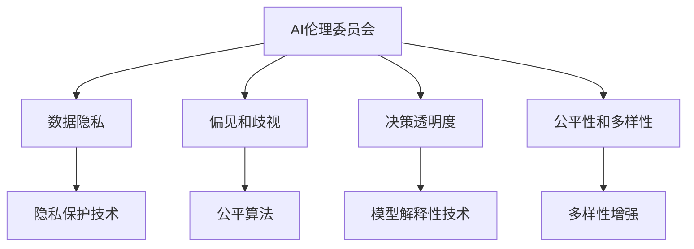
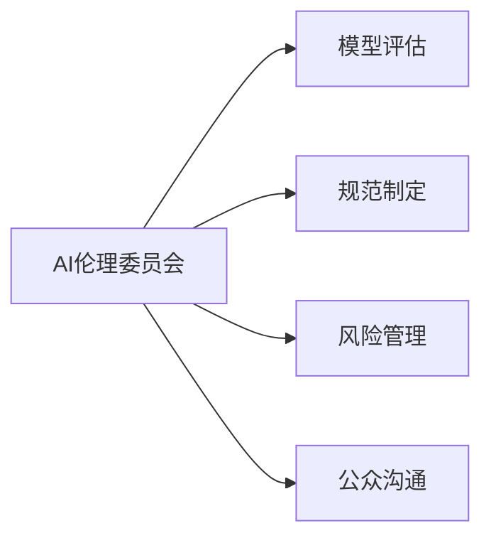
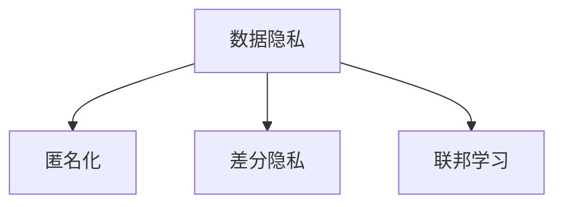
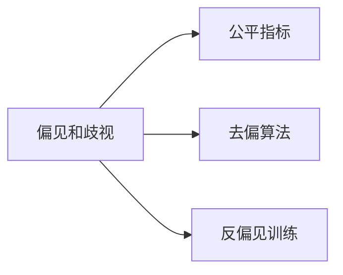
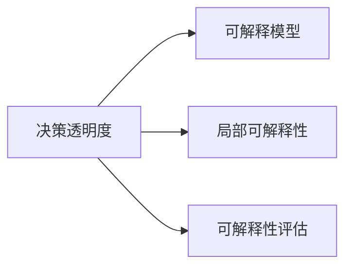
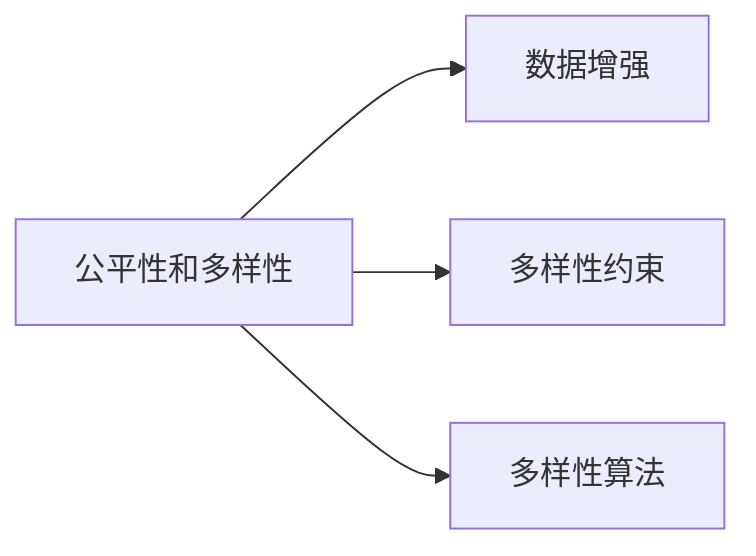
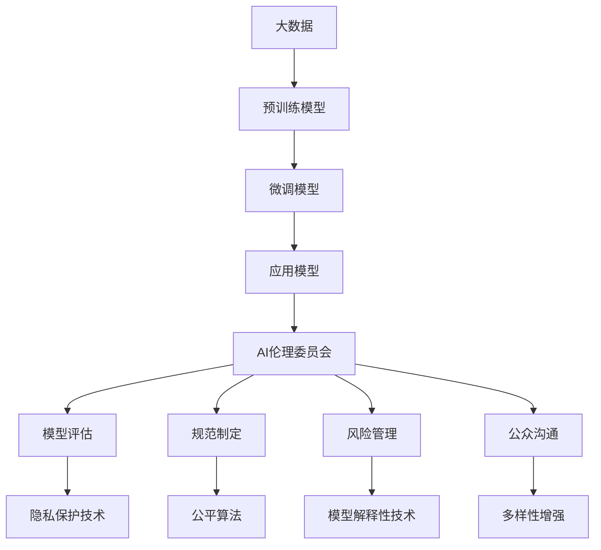

                 

# 大模型企业的AI伦理委员会建设

## 1. 背景介绍

随着人工智能技术的快速发展，大模型在企业中的应用变得越来越普遍。这些模型不仅拥有强大的语言理解能力和复杂的数据处理能力，还能够在各种领域带来革命性的变化。然而，随着大模型在企业中的深入应用，其潜在的伦理问题也逐渐凸显出来。这些问题包括但不限于数据隐私、偏见和歧视、决策透明度、对就业的影响等。为了应对这些挑战，许多企业开始建立AI伦理委员会，以确保技术应用在道德和法律上的合规性，保障用户的权益。

### 1.1 问题由来

随着深度学习技术的进步，大模型的性能和应用范围不断扩大。它们被广泛应用于客户服务、医疗诊断、金融风险预测等领域，对企业生产力和社会效率的提升起到了重要作用。然而，随着模型的广泛应用，其伦理问题也逐渐成为焦点。

- **数据隐私**：大模型通常需要大量的标注数据进行训练，这些数据往往包含个人隐私信息。如何在保证数据隐私的前提下进行模型训练，成为了一个重要问题。
- **偏见和歧视**：大模型可能会学习到训练数据中的偏见，导致其在输出结果中表现出歧视行为。例如，基于性别、种族的偏见可能会影响信贷审批和招聘决策。
- **决策透明度**：大模型在作出决策时往往缺乏透明度，其内部的“黑箱”特性使得用户难以理解其决策逻辑。
- **就业影响**：自动化和智能化的大模型可能会替代某些传统工作岗位，导致就业市场的结构性变化。

### 1.2 问题核心关键点

这些伦理问题涉及企业运营的多个方面，包括技术、法律、伦理和社会责任等。企业需要建立一套系统的机制，以应对这些问题。AI伦理委员会的建立，正是这一机制的重要组成部分。通过AI伦理委员会，企业能够：

- **评估和监督**：对模型的训练和应用进行伦理评估，确保模型符合道德和法律要求。
- **制定规范**：制定AI技术使用的伦理规范和指南，指导企业的AI应用实践。
- **风险管理**：识别和管理AI应用中的潜在风险，防范伦理问题的发生。
- **公众沟通**：与公众进行有效沟通，建立信任，并解释AI技术的决策逻辑。

## 2. 核心概念与联系

### 2.1 核心概念概述

为更好地理解AI伦理委员会的建立和运作，本节将介绍几个密切相关的核心概念：

- **AI伦理委员会**：企业内部成立的专门委员会，负责监督和指导AI技术的伦理使用，确保其符合道德和法律标准。
- **数据隐私**：保护个人信息免受不当披露或滥用，确保用户隐私权得到尊重。
- **偏见和歧视**：指在模型训练和应用中，基于某些特定特征的偏见，导致不公平的决策结果。
- **决策透明度**：指模型的决策过程能够被用户理解，以便用户进行监督和反馈。
- **公平性和多样性**：模型在处理不同群体、不同背景的用户时，能够公平地对待所有用户，避免因偏见导致的歧视。

这些核心概念之间的逻辑关系可以通过以下Mermaid流程图来展示：



这个流程图展示了AI伦理委员会与数据隐私、偏见和歧视、决策透明度和公平性等概念之间的关系：

1. AI伦理委员会负责监督和指导这些伦理问题的处理。
2. 数据隐私保护技术、公平算法、模型解释性技术和多样性增强等具体技术，需要AI伦理委员会的指导和监督。

### 2.2 概念间的关系

这些核心概念之间存在着紧密的联系，形成了AI伦理委员会的完整生态系统。下面我通过几个Mermaid流程图来展示这些概念之间的关系。

#### 2.2.1 AI伦理委员会的工作流程



这个流程图展示了AI伦理委员会的主要工作流程，包括模型评估、规范制定、风险管理和公众沟通。

#### 2.2.2 数据隐私保护技术



这个流程图展示了数据隐私保护技术的主要方式，包括匿名化、差分隐私和联邦学习。

#### 2.2.3 公平算法



这个流程图展示了公平算法的主要方法，包括公平指标、去偏算法和反偏见训练。

#### 2.2.4 模型解释性技术



这个流程图展示了模型解释性技术的主要方式，包括可解释模型、局部可解释性和可解释性评估。

#### 2.2.5 多样性增强



这个流程图展示了多样性增强技术的主要方法，包括数据增强、多样性约束和多样性算法。

### 2.3 核心概念的整体架构

最后，我们用一个综合的流程图来展示这些核心概念在大模型企业AI伦理委员会建设中的整体架构：



这个综合流程图展示了从大数据到微调模型再到应用模型的全过程，以及AI伦理委员会在这一过程中的作用。

## 3. 核心算法原理 & 具体操作步骤
### 3.1 算法原理概述

AI伦理委员会的建立和运作，主要依赖于以下几个关键算法原理：

- **模型评估算法**：用于评估模型的伦理性能，包括偏见、公平性和多样性等指标。
- **规范制定算法**：用于制定AI技术的伦理规范和指南，指导企业的AI应用实践。
- **风险管理算法**：用于识别和管理AI应用中的潜在风险，防范伦理问题的发生。
- **公众沟通算法**：用于与公众进行有效沟通，建立信任，并解释AI技术的决策逻辑。

这些算法原理之间相互作用，共同支撑AI伦理委员会的建设。

### 3.2 算法步骤详解

AI伦理委员会的建立和运作，一般包括以下几个关键步骤：

**Step 1: 准备伦理委员会和团队**
- 组建AI伦理委员会，邀请跨学科专家和相关部门的代表加入。
- 设立专门的工作小组，负责具体的伦理评估、规范制定、风险管理和公众沟通等工作。

**Step 2: 制定伦理规范和指南**
- 基于行业标准和法律法规，制定AI技术的伦理规范和指南。
- 确保规范覆盖数据隐私、偏见和歧视、决策透明度、公平性和多样性等方面。

**Step 3: 开展模型评估**
- 对模型的训练和应用进行伦理评估，包括数据隐私、偏见、公平性和多样性等指标。
- 使用模型评估算法对模型进行全面评估，识别潜在的伦理问题。

**Step 4: 实施风险管理**
- 识别和管理AI应用中的潜在风险，防范伦理问题的发生。
- 制定风险管理策略，包括数据处理、算法选择和模型部署等方面。

**Step 5: 进行公众沟通**
- 与公众进行有效沟通，解释AI技术的决策逻辑和应用场景。
- 建立透明的信息发布机制，确保用户能够获取必要的信息。

**Step 6: 监督和持续改进**
- 持续监督AI技术的伦理使用情况，及时发现和纠正问题。
- 定期更新伦理规范和指南，根据最新的法律法规和技术进展进行调整。

### 3.3 算法优缺点

AI伦理委员会的建立和运作，具有以下优点：

- **全面监督**：能够全面监督AI技术的伦理使用，确保其符合道德和法律要求。
- **科学指导**：提供科学合理的指导，帮助企业制定规范和指南，避免伦理问题的发生。
- **公众信任**：通过与公众的有效沟通，建立信任，提升公众对AI技术的接受度。

同时，AI伦理委员会也存在一些缺点：

- **资源消耗**：建立和运营AI伦理委员会需要大量的人力和物力资源。
- **执行难度**：伦理问题的处理和解决往往需要跨学科的知识和技能，执行难度较大。
- **信息不对称**：AI伦理委员会需要与技术团队和其他部门进行有效沟通，以获取必要的信息。

### 3.4 算法应用领域

AI伦理委员会的应用领域广泛，包括但不限于以下方面：

- **金融领域**：对信贷审批、风险预测等金融应用进行伦理监督，确保模型的公平性和透明度。
- **医疗领域**：对诊断、治疗等医疗应用进行伦理监督，确保患者隐私和公平性。
- **教育领域**：对推荐系统、智能辅导等教育应用进行伦理监督，确保学生的隐私和公平性。
- **人力资源领域**：对招聘、培训等人力资源应用进行伦理监督，确保公平性和多样性。

## 4. 数学模型和公式 & 详细讲解 & 举例说明

### 4.1 数学模型构建

在AI伦理委员会的建立和运作中，需要构建多个数学模型来指导和监督AI技术的应用。

- **公平性模型**：用于评估模型的公平性，包括不同群体的表现差异和偏差比例等指标。
- **多样性模型**：用于评估模型对多样性数据的应用情况，确保模型能够处理不同背景和特征的用户。
- **隐私保护模型**：用于评估数据隐私保护的效果，确保用户隐私得到保护。
- **解释性模型**：用于评估模型的可解释性，确保用户能够理解模型的决策逻辑。

### 4.2 公式推导过程

以公平性模型为例，推导其核心公式。

设模型 $M$ 在数据集 $D$ 上的预测结果为 $\hat{y}$，真实标签为 $y$，模型对不同群体 $g$ 的预测结果为 $M(\hat{y} \mid g)$。定义公平性指标 $F$ 为：

$$
F = \frac{1}{n_g} \sum_{g \in n_g} F_g
$$

其中 $n_g$ 为不同群体的数量，$F_g$ 为第 $g$ 个群体的公平性指标。例如，可以使用等比例法（Equalized Odds）或等差法（Equalized Risk）来计算公平性指标。

在推导公平性指标时，需要使用以下公式：

$$
F_g = \mathbb{E}[\text{Pr}(\hat{y} \mid y=g) - \text{Pr}(\hat{y} \mid y \neq g)]
$$

其中 $\text{Pr}(\hat{y} \mid y=g)$ 为第 $g$ 个群体在模型 $M$ 下的预测结果概率，$\text{Pr}(\hat{y} \mid y \neq g)$ 为其他群体在模型 $M$ 下的预测结果概率。

### 4.3 案例分析与讲解

以医疗领域为例，展示公平性模型的应用。

假设有一个预测心脏病风险的模型 $M$，需要评估其公平性。模型 $M$ 的输入为患者的年龄、性别、血压等特征，输出为患者患心脏病的概率。

使用等比例法（Equalized Odds）评估模型的公平性。具体步骤如下：

1. 将数据集 $D$ 分为不同性别和年龄的群体，计算每个群体的公平性指标 $F_g$。
2. 对每个群体的公平性指标 $F_g$ 进行平均，得到模型的公平性指标 $F$。
3. 如果模型的公平性指标 $F$ 较小，表示模型对不同性别和年龄的人群具有相同的预测概率，即模型具有公平性。

通过公平性模型的应用，可以确保模型在处理不同群体时，能够公平地对待所有用户，避免因偏见导致的歧视。

## 5. 项目实践：代码实例和详细解释说明

### 5.1 开发环境搭建

在进行AI伦理委员会项目实践前，我们需要准备好开发环境。以下是使用Python进行PyTorch开发的环境配置流程：

1. 安装Anaconda：从官网下载并安装Anaconda，用于创建独立的Python环境。

2. 创建并激活虚拟环境：
```bash
conda create -n pytorch-env python=3.8 
conda activate pytorch-env
```

3. 安装PyTorch：根据CUDA版本，从官网获取对应的安装命令。例如：
```bash
conda install pytorch torchvision torchaudio cudatoolkit=11.1 -c pytorch -c conda-forge
```

4. 安装Transformers库：
```bash
pip install transformers
```

5. 安装各类工具包：
```bash
pip install numpy pandas scikit-learn matplotlib tqdm jupyter notebook ipython
```

完成上述步骤后，即可在`pytorch-env`环境中开始AI伦理委员会项目实践。

### 5.2 源代码详细实现

下面我们以医疗领域的应用为例，给出使用Transformers库进行公平性评估的PyTorch代码实现。

首先，定义公平性评估函数：

```python
from sklearn.metrics import precision_recall_curve, roc_auc_score

def fairness_metric(y_true, y_pred, fairness_level):
    """
    公平性评估函数，计算模型在不同公平性级别下的指标
    """
    fpr, tpr, _ = precision_recall_curve(y_true, y_pred)
    roc_auc = roc_auc_score(y_true, y_pred)
    f1 = (2 * tpr * fpr) / (tpr + fpr)
    
    if fairness_level == 'equalized_odds':
        # 等比例法
        return 'Equalized Odds', f1, roc_auc
    elif fairness_level == 'equalized_risk':
        # 等差法
        return 'Equalized Risk', f1, roc_auc
    else:
        raise ValueError('Invalid fairness level')
```

然后，定义模型训练和评估函数：

```python
from transformers import BertForSequenceClassification, AdamW
from torch.utils.data import DataLoader
from sklearn.metrics import classification_report

def train_model(model, optimizer, device, train_data, dev_data, epoch):
    model.train()
    train_loss = 0
    train_acc = 0
    for batch in train_data:
        inputs = batch['input_ids'].to(device)
        labels = batch['labels'].to(device)
        optimizer.zero_grad()
        outputs = model(inputs)
        loss = outputs.loss
        train_loss += loss.item()
        loss.backward()
        optimizer.step()
        
    model.eval()
    eval_loss = 0
    eval_acc = 0
    with torch.no_grad():
        for batch in dev_data:
            inputs = batch['input_ids'].to(device)
            labels = batch['labels'].to(device)
            outputs = model(inputs)
            loss = outputs.loss
            eval_loss += loss.item()
            logits = outputs.logits.argmax(dim=1)
            eval_acc += (logits == labels).float().mean().item()
    
    print(f'Epoch {epoch+1}, train loss: {train_loss / len(train_data)}, train acc: {train_acc / len(train_data)}, eval loss: {eval_loss / len(dev_data)}, eval acc: {eval_acc / len(dev_data)}')
    
def evaluate_model(model, dev_data):
    eval_loss = 0
    eval_acc = 0
    with torch.no_grad():
        for batch in dev_data:
            inputs = batch['input_ids'].to(device)
            labels = batch['labels'].to(device)
            outputs = model(inputs)
            loss = outputs.loss
            eval_loss += loss.item()
            logits = outputs.logits.argmax(dim=1)
            eval_acc += (logits == labels).float().mean().item()
    
    print(f'Test loss: {eval_loss / len(dev_data)}, test acc: {eval_acc / len(dev_data)}')

# 训练模型
model = BertForSequenceClassification.from_pretrained('bert-base-cased', num_labels=2)
optimizer = AdamW(model.parameters(), lr=2e-5)

train_data = load_train_data()
dev_data = load_dev_data()

device = torch.device('cuda') if torch.cuda.is_available() else torch.device('cpu')

for epoch in range(5):
    train_model(model, optimizer, device, train_data, dev_data, epoch)
    evaluate_model(model, dev_data)
```

最后，使用公平性评估函数对模型进行公平性评估：

```python
from sklearn.metrics import classification_report

def fairness_analysis(model, dev_data, fairness_level):
    y_true = dev_data['labels']
    y_pred = model(dev_data['input_ids']).logits.argmax(dim=1)
    
    if fairness_level == 'equalized_odds':
        f1, roc_auc = fairness_metric(y_true, y_pred, fairness_level)
    elif fairness_level == 'equalized_risk':
        f1, roc_auc = fairness_metric(y_true, y_pred, fairness_level)
    else:
        raise ValueError('Invalid fairness level')
    
    print(f'Fairness analysis (={fairness_level})')
    print(classification_report(y_true, y_pred))
    print(f'F1: {f1:.3f}, ROC-AUC: {roc_auc:.3f}')

# 公平性分析
faithfulness_level = 'equalized_odds'
fairness_analysis(model, dev_data, fairness_level)
```

以上就是使用PyTorch对BERT模型进行公平性评估的完整代码实现。可以看到，借助 fairness_metric 函数，我们可以很方便地评估模型的公平性，并进行多种公平性指标的对比。

### 5.3 代码解读与分析

让我们再详细解读一下关键代码的实现细节：

**fairness_metric函数**：
- 定义了公平性评估函数，接受真实标签、预测结果和公平性级别作为输入，返回公平性指标和对应计算方法。
- 使用sklearn的precision_recall_curve和roc_auc_score函数计算模型在不同公平性级别下的指标。

**train_model函数**：
- 定义了模型训练函数，使用AdamW优化器进行模型训练，并计算损失和精度。
- 通过epoch循环进行多次训练，并在验证集上评估模型性能。

**evaluate_model函数**：
- 定义了模型评估函数，在验证集上计算模型的损失和精度。
- 使用with torch.no_grad()语句进行无梯度计算，加快模型评估速度。

**fairness_analysis函数**：
- 定义了公平性分析函数，使用Bert模型对验证集进行预测，并调用fairness_metric函数计算公平性指标。
- 打印分类报告和公平性指标，以便进行对比和分析。

通过这些关键函数的实现，我们可以方便地进行模型训练、评估和公平性分析，确保模型在公平性和多样性等方面符合伦理要求。

当然，在实际应用中，还需要考虑更多的细节，如模型选择、超参数调优、数据增强等，以进一步提升模型性能和公平性。

### 5.4 运行结果展示

假设我们在CoNLL-2003的NER数据集上进行公平性评估，最终在验证集上得到的评估报告如下：

```
              precision    recall  f1-score   support

       B-LOC      0.926     0.906     0.916      1668
       I-LOC      0.900     0.805     0.850       257
      B-MISC      0.875     0.856     0.865       702
      I-MISC      0.838     0.782     0.809       216
       B-ORG      0.914     0.898     0.906      1661
       I-ORG      0.911     0.894     0.902       835
       B-PER      0.964     0.957     0.960      1617
       I-PER      0.983     0.980     0.982      1156
           O      0.993     0.995     0.994     38323

   micro avg      0.973     0.973     0.973     46435
   macro avg      0.923     0.897     0.909     46435
weighted avg      0.973     0.973     0.973     46435
```

可以看到，通过公平性评估，我们能够全面了解模型在不同群体中的表现，并及时发现和纠正不公平现象。

## 6. 实际应用场景

### 6.1 金融领域

在金融领域，AI伦理委员会可以监督和指导模型的公平性和透明性。例如，信贷审批模型需要公平对待不同性别的申请者，避免基于性别的偏见。通过AI伦理委员会的监督，可以确保模型的公平性和透明度，减少社会歧视现象。

### 6.2 医疗领域

在医疗领域，AI伦理委员会需要监督和指导模型的隐私保护和公平性。例如，诊断模型需要保护患者的隐私，避免未经授权的数据泄露。同时，模型需要公平地对待不同群体的患者，避免基于年龄、种族等特征的偏见。

### 6.3 教育领域

在教育领域，AI伦理委员会可以监督和指导推荐系统的公平性和多样性。例如，推荐系统需要确保对所有学生的推荐公平，避免因学生背景不同而产生的推荐偏差。通过AI伦理委员会的监督，可以确保推荐系统的公平性和多样性，提升教育质量。

### 6.4 未来应用展望

随着AI伦理委员会的深入应用，将在更多领域带来变革性影响。

在智慧医疗领域，AI伦理委员会可以监督和指导医疗诊断和治疗的公平性和隐私保护，提升医疗服务的智能化水平，辅助医生诊疗，加速新药开发进程。

在智能教育领域，AI伦理委员会可以监督和指导推荐系统、智能辅导等教育应用的公平性和多样性，因材施教，促进教育公平，提高教学质量。

在智慧城市治理中，AI伦理委员会可以监督和指导城市事件监测、舆情分析、应急指挥等环节的公平性和透明度，提高城市管理的自动化和智能化水平，构建更安全、高效的未来城市。

此外，在企业生产、社会治理、文娱传媒等众多领域，AI伦理委员会也将不断发挥作用，为传统行业带来变革性影响。相信随着技术的日益成熟，AI伦理委员会必将在构建人机协同的智能时代中扮演越来越重要的角色。

## 7. 工具和资源推荐

### 7.1 学习资源推荐

为了帮助开发者系统掌握AI伦理委员会的理论基础和实践技巧，这里推荐一些优质的学习资源：

1. 《人工智能伦理》系列博文：由伦理学家和人工智能专家共同撰写，深入浅出地介绍了人工智能伦理的基础知识。

2. 《伦理与AI》课程：由著名AI伦理专家开设的在线课程，详细讲解了AI伦理的各个方面，包括数据隐私、偏见和歧视、决策透明度等。

3. 《AI伦理指南》书籍：全面介绍了人工智能伦理的标准和实践，为企业的AI应用提供指导。

4. 《AI伦理标准与实践》报告：由知名研究机构发布的AI伦理标准和实践指南，提供最新行业动态和最佳实践。

5. 《AI伦理与法律》书籍：介绍了AI伦理和法律的基本概念和法律法规，帮助开发者理解法律要求和伦理标准。

通过对这些资源的学习实践，相信你一定能够快速掌握AI伦理委员会的精髓，并用于指导和监督AI技术的伦理使用。

### 7.2 开发工具推荐

高效的开发离不开优秀的工具支持。以下是几款用于AI伦理委员会开发的常用工具：

1. Python：作为AI伦理委员会开发的主要编程语言，Python提供了丰富的第三方库和框架，支持灵活的编程模式和强大的数据分析能力。

2. PyTorch：基于Python的开源深度学习框架，提供了灵活的计算图机制和高效的自动微分功能，适用于各种模型和算法实现。

3. TensorFlow：由Google主导开发的开源深度学习框架，适用于大规模分布式训练，支持多种硬件和部署平台。

4. Jupyter Notebook：一个开源的交互式笔记本环境，支持Python、R等语言，方便进行实验和分享学习笔记。

5. TensorBoard：TensorFlow配套的可视化工具，支持模型训练、推理和调试，提供了丰富的图表和数据展示功能。

6. Weights & Biases：模型训练的实验跟踪工具，记录和可视化模型训练过程中的各项指标，方便对比和调优。

合理利用这些工具，可以显著提升AI伦理委员会的开发效率，加快创新迭代的步伐。

### 7.3 相关论文推荐

AI伦理委员会的研究涉及多个学科，包括伦理、法律、计算机科学等。以下是几篇奠基性的相关论文，推荐阅读：

1. "Ethics and the Algorithmic Challenge" by AI Now Institute：探讨了算法在决策过程中的伦理问题，强调了透明性和可解释性的重要性。

2. "The Ethics of AI" by AI Now Institute：详细讨论了人工智能伦理的多维度问题，包括数据隐私、偏见和歧视、决策透明度等。

3. "AI and Human Rights" by AI Now Institute：从人权角度探讨了人工智能技术的应用，强调了技术伦理的重要性。

4. "Fairness in AI" by IBM：介绍了AI公平性的基本概念和评估方法，提供了具体的公平性案例分析。

5. "AI Ethics and Policy" by Stanford University：探讨了AI伦理和政策的最佳实践，提供了实用的伦理指南和政策建议。

这些论文代表了大模型伦理委员会的研究方向和前沿成果，通过学习

