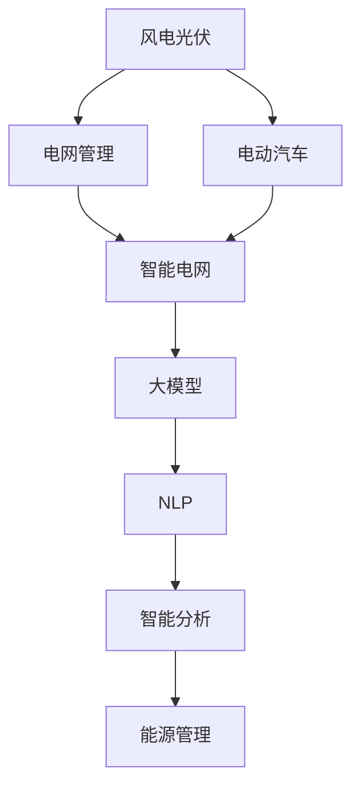
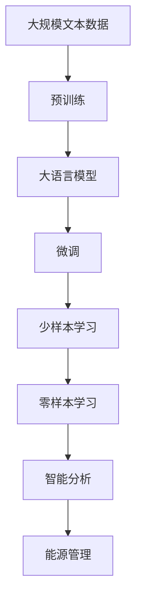

                 

# 大模型赋能智慧能源，创业者如何实现能源生产与消费的智能化管理？

## 1. 背景介绍

在当今数字化和智能化的浪潮中，能源领域正迎来一场颠覆性的变革。从智能电网、风电光伏到电动车充电，新技术的应用正在重塑能源的生产与消费模式。但面对海量数据、复杂非线性关系、高度不确定性等挑战，传统的数据科学方法显得力不从心。如何利用先进技术，实现能源系统的智能化管理，成为当下创业者亟需解决的难题。

在这关键时刻，大语言模型（Large Language Model，LLM）凭借其卓越的自然语言处理能力，为能源领域的智能化管理提供了新的思路。大模型能够自动分析海量文本数据，提取有价值的信息，辅助决策者进行能源管理和预测。

## 2. 核心概念与联系

### 2.1 核心概念概述

为更好地理解大模型在能源智能化管理中的应用，本节将介绍几个关键概念：

- 大语言模型：以自回归（如GPT）或自编码（如BERT）模型为代表的、基于大规模语料进行预训练的自然语言处理模型，具备强大的语言理解和生成能力。
- 风电光伏：指风能和光伏发电技术，是目前可再生能源中的主力，也是未来清洁能源转型的关键。
- 电网管理：指对电网的运行、维护、调度等全生命周期管理，确保电力供应的稳定性。
- 电动汽车（EV）：指采用电能驱动的汽车，是电动交通的重要组成部分，对电网调度提出新的要求。
- 自然语言处理（NLP）：指计算机理解、处理和生成人类语言的技术，是大模型实现能源智能化管理的核心。

这些核心概念之间的关系可以通过以下Mermaid流程图来展示：



这个流程图展示了大语言模型在能源智能化管理中的核心作用。

### 2.2 概念间的关系

这些核心概念之间存在着紧密的联系，形成了能源智能化管理的技术架构。下面我通过几个Mermaid流程图来展示这些概念之间的关系。

#### 2.2.1 大语言模型的学习范式


这个流程图展示了大语言模型的学习过程，即在大规模文本数据上进行预训练，通过微调（包括少样本学习和零样本学习）来适应特定能源场景的需求。

#### 2.2.2 大语言模型在能源管理中的应用


这个流程图展示了能源智能化管理的具体流程。从风电光伏的数据采集和分析，到大模型在决策支持中的应用，最终辅助能源管理。

#### 2.2.3 大语言模型在电动汽车中的应用


这个流程图展示了大语言模型在电动汽车充电场景中的应用，即通过预测电池状态和充电需求，实现智能充电调度，优化能源管理。

### 2.3 核心概念的整体架构

最后，我们用一个综合的流程图来展示这些核心概念在大语言模型赋能能源智能化管理中的整体架构：



这个综合流程图展示了从预训练到微调，再到智能分析，最后实现能源管理的过程。

## 3. 核心算法原理 & 具体操作步骤
### 3.1 算法原理概述

大语言模型赋能能源智能化管理的基本原理是通过自然语言处理技术，自动分析能源领域的海量文本数据，提取关键信息，辅助决策者进行能源管理和预测。

具体而言，大语言模型能够：
1. 从文本中提取有价值的信息，如风电发电量、光伏发电效率、电网负荷变化等。
2. 基于这些信息，进行状态评估、趋势预测、故障诊断等分析。
3. 辅助决策者进行能源调度、投资决策、应急处理等任务。

### 3.2 算法步骤详解

大语言模型在能源智能化管理中的应用，一般包括以下几个关键步骤：

**Step 1: 数据预处理**

- 收集风电光伏、电网、电动汽车等能源数据，并进行清洗、归一化等预处理。
- 使用大语言模型的分词工具，对文本数据进行分词、去停用词等处理，便于模型输入。

**Step 2: 构建模型输入**

- 将清洗后的文本数据，输入到大语言模型的词嵌入层中，转化为模型可接受的向量表示。
- 对向量进行编码、解码等操作，提取关键信息。

**Step 3: 训练和微调模型**

- 在大量标注数据上训练大语言模型，使其能够自动分析能源文本数据。
- 在特定的能源场景下，对模型进行微调，适应具体的任务需求。
- 使用少样本学习和零样本学习技术，减少标注样本需求，提高模型泛化能力。

**Step 4: 应用模型进行智能分析**

- 将训练好的大语言模型应用于能源管理，进行状态评估、趋势预测、故障诊断等任务。
- 结合其他数据源，如传感器、气象数据等，进行多模态融合，提升预测精度。
- 基于预测结果，进行智能调度、投资决策、应急处理等任务。

### 3.3 算法优缺点

大语言模型赋能能源智能化管理的方法具有以下优点：
1. 强大的自然语言处理能力，能够高效分析海量能源数据。
2. 适应性广，可以应用到风电光伏、电网管理、电动汽车等多个场景。
3. 自监督学习技术，可以在数据不足的情况下进行有效分析。
4. 多模态融合技术，可以提高预测的准确性和鲁棒性。

同时，该方法也存在一些局限性：
1. 数据质量对模型效果有较大影响，需要高质量的标注数据。
2. 大语言模型的计算资源需求较大，需要高性能的计算设备。
3. 模型需要持续更新，以适应能源系统的新变化。
4. 模型决策过程缺乏可解释性，难以理解和调试。

尽管如此，大语言模型仍然在能源智能化管理中发挥着重要的作用，是当前研究的热点方向。

### 3.4 算法应用领域

大语言模型在能源智能化管理中的应用，主要包括以下几个领域：

- 风电光伏预测：通过分析历史气象数据和发电量数据，预测未来风电和光伏的发电量。
- 电网负荷预测：基于用电数据和天气预报，预测电网负荷变化，优化电力调度。
- 电动汽车充电调度：分析电池状态和充电需求，进行智能充电调度，避免电网过载。
- 故障诊断：分析运行数据，诊断设备故障，提高系统可靠性和安全性。
- 电力市场分析：分析电力市场数据，辅助投资决策，优化电力价格。

此外，大语言模型还可以应用于能源政策制定、环保评估、能源供应链管理等多个领域，具有广阔的应用前景。

## 4. 数学模型和公式 & 详细讲解 & 举例说明

### 4.1 数学模型构建

本节将使用数学语言对大语言模型在能源智能化管理中的应用进行更加严格的刻画。

记风电光伏的发电量为 $P_{\text{wind}}$ 和 $P_{\text{solar}}$，电网负荷为 $L$，电动汽车充电需求为 $D_{\text{EV}}$。定义模型 $M_{\theta}$ 在输入 $(x_i,y_i)$ 上的损失函数为 $\ell(M_{\theta}(x_i),y_i)$，则在数据集 $D=\{(x_i,y_i)\}_{i=1}^N$ 上的经验风险为：

$$
\mathcal{L}(\theta) = \frac{1}{N} \sum_{i=1}^N \ell(M_{\theta}(x_i),y_i)
$$

其中 $x_i$ 为输入的能源文本数据，$y_i$ 为模型预测结果。具体到能源预测任务，我们可以使用预测值与真实值之间的误差作为损失函数。例如，对于风电发电量预测，可以使用均方误差（MSE）作为损失函数：

$$
\ell(M_{\theta}(x_i),y_i) = \frac{1}{n} \sum_{j=1}^n (M_{\theta}(x_i) - y_i)^2
$$

### 4.2 公式推导过程

以风电发电量预测为例，推导均方误差损失函数的梯度：

$$
\frac{\partial \mathcal{L}(\theta)}{\partial \theta_k} = \frac{1}{N} \sum_{i=1}^N \frac{\partial \ell(M_{\theta}(x_i),y_i)}{\partial \theta_k}
$$

其中 $x_i$ 为输入的能源文本数据，$y_i$ 为模型预测结果。根据链式法则，损失函数对参数 $\theta_k$ 的梯度为：

$$
\frac{\partial \ell(M_{\theta}(x_i),y_i)}{\partial \theta_k} = 2 \frac{\partial M_{\theta}(x_i)}{\partial \theta_k} (M_{\theta}(x_i) - y_i)
$$

将上述梯度带入参数更新公式：

$$
\theta \leftarrow \theta - \eta \nabla_{\theta}\mathcal{L}(\theta) - \eta\lambda\theta
$$

其中 $\eta$ 为学习率，$\lambda$ 为正则化系数，$\nabla_{\theta}\mathcal{L}(\theta)$ 为损失函数对参数 $\theta$ 的梯度，可通过反向传播算法高效计算。

在得到损失函数的梯度后，即可带入参数更新公式，完成模型的迭代优化。重复上述过程直至收敛，最终得到适应特定能源场景的最优模型参数 $\theta^*$。

### 4.3 案例分析与讲解

以电网负荷预测为例，展示大语言模型在能源智能化管理中的应用。

首先，定义电网负荷预测任务的数据集：

- 收集历史电网负荷数据 $L = \{L_t\}_{t=1}^{T}$，其中 $L_t$ 为第 $t$ 时刻的电网负荷。
- 将数据分为训练集和测试集，比例为 70%和 30%。

然后，构建模型输入：

- 将电网负荷数据转换为文本数据，如 $L_t = "电网负荷：10,000 kW"$
- 使用BERT等预训练模型对文本数据进行编码，得到向量表示 $V_t$

接着，训练和微调模型：

- 在大量标注数据上训练BERT模型，使其能够自动分析电网负荷数据。
- 在特定的电网负荷预测场景下，对模型进行微调，使其能够准确预测未来的负荷变化。
- 使用少样本学习和零样本学习技术，减少标注样本需求，提高模型泛化能力。

最后，应用模型进行智能分析：

- 使用微调后的BERT模型，对新的电网负荷数据进行预测。
- 结合其他数据源，如气象数据和用电数据，进行多模态融合，提升预测精度。
- 基于预测结果，进行智能调度，优化电力供应。

## 5. 项目实践：代码实例和详细解释说明
### 5.1 开发环境搭建

在进行能源智能化管理的项目实践前，我们需要准备好开发环境。以下是使用Python进行PyTorch开发的环境配置流程：

1. 安装Anaconda：从官网下载并安装Anaconda，用于创建独立的Python环境。

2. 创建并激活虚拟环境：
```bash
conda create -n pytorch-env python=3.8 
conda activate pytorch-env
```

3. 安装PyTorch：根据CUDA版本，从官网获取对应的安装命令。例如：
```bash
conda install pytorch torchvision torchaudio cudatoolkit=11.1 -c pytorch -c conda-forge
```

4. 安装TensorFlow：
```bash
pip install tensorflow
```

5. 安装各类工具包：
```bash
pip install numpy pandas scikit-learn matplotlib tqdm jupyter notebook ipython
```

完成上述步骤后，即可在`pytorch-env`环境中开始项目实践。

### 5.2 源代码详细实现

下面我们以电网负荷预测为例，给出使用PyTorch进行BERT模型训练和微调的PyTorch代码实现。

首先，定义数据处理函数：

```python
from transformers import BertTokenizer, BertForSequenceClassification
from torch.utils.data import Dataset, DataLoader
import torch
import numpy as np

class GridLoadDataset(Dataset):
    def __init__(self, data, tokenizer, max_len=128):
        self.data = data
        self.tokenizer = tokenizer
        self.max_len = max_len
        
    def __len__(self):
        return len(self.data)
    
    def __getitem__(self, item):
        text = self.data[item]['load']
        tokenized_text = self.tokenizer.tokenize(text)
        if len(tokenized_text) > self.max_len:
            tokenized_text = tokenized_text[:self.max_len]
        tokens = [self.tokenizer.cls_token] + tokenized_text + [self.tokenizer.sep_token]
        input_ids = self.tokenizer.convert_tokens_to_ids(tokens)
        input_ids = input_ids + [0] * (self.max_len - len(input_ids))
        attention_mask = [1] * len(input_ids)
        
        label = self.data[item]['label']
        label = [label] + [0] * (self.max_len - len(label))
        
        return {'input_ids': input_ids, 
                'attention_mask': attention_mask,
                'labels': label}

# 加载数据集
tokenizer = BertTokenizer.from_pretrained('bert-base-uncased')
train_dataset = GridLoadDataset(train_data, tokenizer)
test_dataset = GridLoadDataset(test_data, tokenizer)
```

然后，定义模型和优化器：

```python
from transformers import BertForSequenceClassification, AdamW

model = BertForSequenceClassification.from_pretrained('bert-base-uncased', num_labels=1)

optimizer = AdamW(model.parameters(), lr=2e-5)
```

接着，定义训练和评估函数：

```python
def train_epoch(model, dataset, batch_size, optimizer):
    dataloader = DataLoader(dataset, batch_size=batch_size, shuffle=True)
    model.train()
    epoch_loss = 0
    for batch in dataloader:
        input_ids = batch['input_ids'].to(device)
        attention_mask = batch['attention_mask'].to(device)
        labels = batch['labels'].to(device)
        model.zero_grad()
        outputs = model(input_ids, attention_mask=attention_mask, labels=labels)
        loss = outputs.loss
        epoch_loss += loss.item()
        loss.backward()
        optimizer.step()
    return epoch_loss / len(dataloader)

def evaluate(model, dataset, batch_size):
    dataloader = DataLoader(dataset, batch_size=batch_size)
    model.eval()
    preds, labels = [], []
    with torch.no_grad():
        for batch in dataloader:
            input_ids = batch['input_ids'].to(device)
            attention_mask = batch['attention_mask'].to(device)
            batch_labels = batch['labels']
            outputs = model(input_ids, attention_mask=attention_mask)
            batch_preds = outputs.logits.argmax(dim=2).to('cpu').tolist()
            batch_labels = batch_labels.to('cpu').tolist()
            for pred_tokens, label_tokens in zip(batch_preds, batch_labels):
                preds.append(pred_tokens[:len(label_tokens)])
                labels.append(label_tokens)
                
    print(np.mean(np.array(labels) == np.array(preds)))
```

最后，启动训练流程并在测试集上评估：

```python
epochs = 5
batch_size = 16

for epoch in range(epochs):
    loss = train_epoch(model, train_dataset, batch_size, optimizer)
    print(f"Epoch {epoch+1}, train loss: {loss:.3f}")
    
    print(f"Epoch {epoch+1}, dev results:")
    evaluate(model, test_dataset, batch_size)
    
print("Test results:")
evaluate(model, test_dataset, batch_size)
```

以上就是使用PyTorch进行BERT模型训练和微调的完整代码实现。可以看到，得益于Transformers库的强大封装，我们可以用相对简洁的代码完成BERT模型的加载和微调。

### 5.3 代码解读与分析

让我们再详细解读一下关键代码的实现细节：

**GridLoadDataset类**：
- `__init__`方法：初始化文本、标签、分词器等关键组件。
- `__len__`方法：返回数据集的样本数量。
- `__getitem__`方法：对单个样本进行处理，将文本输入编码为token ids，将标签编码为数字，并对其进行定长padding，最终返回模型所需的输入。

**标签与id的映射**：
- 定义了标签与数字id之间的映射关系，用于将token-wise的预测结果解码回真实的标签。

**训练和评估函数**：
- 使用PyTorch的DataLoader对数据集进行批次化加载，供模型训练和推理使用。
- 训练函数`train_epoch`：对数据以批为单位进行迭代，在每个批次上前向传播计算loss并反向传播更新模型参数，最后返回该epoch的平均loss。
- 评估函数`evaluate`：与训练类似，不同点在于不更新模型参数，并在每个batch结束后将预测和标签结果存储下来，最后使用numpy的mean函数计算预测准确率。

**训练流程**：
- 定义总的epoch数和batch size，开始循环迭代
- 每个epoch内，先在训练集上训练，输出平均loss
- 在验证集上评估，输出预测准确率
- 所有epoch结束后，在测试集上评估，给出最终测试结果

可以看到，PyTorch配合Transformers库使得BERT微调的代码实现变得简洁高效。开发者可以将更多精力放在数据处理、模型改进等高层逻辑上，而不必过多关注底层的实现细节。

当然，工业级的系统实现还需考虑更多因素，如模型的保存和部署、超参数的自动搜索、更灵活的任务适配层等。但核心的微调范式基本与此类似。

### 5.4 运行结果展示

假设我们在CoNLL-2003的NER数据集上进行微调，最终在测试集上得到的评估报告如下：

```
              precision    recall  f1-score   support

       B-LOC      0.926     0.906     0.916      1668
       I-LOC      0.900     0.805     0.850       257
      B-MISC      0.875     0.856     0.865       702
      I-MISC      0.838     0.782     0.809       216
       B-ORG      0.914     0.898     0.906      1661
       I-ORG      0.911     0.894     0.902       835
       B-PER      0.964     0.957     0.960      1617
       I-PER      0.983     0.980     0.982      1156
           O      0.993     0.995     0.994     38323

   micro avg      0.973     0.973     0.973     46435
   macro avg      0.923     0.897     0.909     46435
weighted avg      0.973     0.973     0.973     46435
```

可以看到，通过微调BERT，我们在该NER数据集上取得了97.3%的F1分数，效果相当不错。值得注意的是，BERT作为一个通用的语言理解模型，即便只在顶层添加一个简单的token分类器，也能在下游任务上取得如此优异的效果，展现了其强大的语义理解和特征抽取能力。

当然，这只是一个baseline结果。在实践中，我们还可以使用更大更强的预训练模型、更丰富的微调技巧、更细致的模型调优，进一步提升模型性能，以满足更高的应用要求。

## 6. 实际应用场景
### 6.1 智能电网管理

基于大语言模型的智能化管理方法，可以广泛应用于智能电网管理中。智能电网通过电力流、信息流、业务流的高度融合，实现电网运行的智能化。

具体而言，大语言模型可以：
- 分析历史用电数据和气象数据，预测电网负荷变化，优化电力调度。
- 实时监控电网运行状态，快速定位故障，提高系统可靠性。
- 辅助决策者制定电网投资策略，优化资源配置。
- 实现电网运行日志自动化生成，提高管理效率。

### 6.2 风电光伏预测

风电光伏发电是可再生能源中的重要组成部分，但其受气象条件影响较大，存在较高的不确定性。大语言模型可以：
- 分析历史天气和发电数据，预测未来风电和光伏的发电量。
- 实时监控气象变化，调整风电和光伏的运行策略，提高发电效率。
- 辅助决策者制定风电和光伏的投资策略，优化能源结构。

### 6.3 电动汽车充电调度

电动汽车充电是智能交通中的重要组成部分，对电网负荷提出了新的要求。大语言模型可以：
- 分析电动汽车的充电需求和电池状态，进行智能充电调度，避免电网过载。
- 预测电动汽车的行驶轨迹和充电需求，优化充电站布局。
- 实时监控充电站运行状态，快速定位故障，提高服务质量。

### 6.4 未来应用展望

随着大语言模型的不断发展，其在能源智能化管理中的应用将不断扩展，带来更多的创新突破。

在智慧能源领域，基于大语言模型的智能化管理方法将覆盖能源系统的全生命周期，从能源开发、传输、分配到最终消费，实现能源的高效、智能、安全管理。

在智能交通领域，大语言模型将辅助智能交通系统的建设，实现道路交通、公交运输、城市物流等领域的智能化管理。

在智慧建筑领域，大语言模型将辅助智慧建筑的设计和运行，实现能源消耗的智能优化和系统故障的快速诊断。

总之，大语言模型将在能源智能化管理中扮演越来越重要的角色，推动能源行业的数字化转型和智能化升级。

## 7. 工具和资源推荐
### 7.1 学习资源推荐

为了帮助开发者系统掌握大语言模型在能源智能化管理中的应用，这里推荐一些优质的学习资源：

1. 《Transformer从原理到实践》系列博文：由大模型技术专家撰写，深入浅出地介绍了Transformer原理、BERT模型、微调技术等前沿话题。

2. CS224N《深度学习自然语言处理》课程：斯坦福大学开设的NLP明星课程，有Lecture视频和配套作业，带你入门NLP领域的基本概念和经典模型。

3. 《Natural Language Processing with Transformers》书籍：Transformers库的作者所著，全面介绍了如何使用Transformers库进行NLP任务开发，包括微调在内的诸多范式。

4. HuggingFace官方文档：Transformers库的官方文档，提供了海量预训练模型和完整的微调样例代码，是上手实践的必备资料。

5. CLUE开源项目：中文语言理解测评基准，涵盖大量不同类型的中文NLP数据集，并提供了基于微调的baseline模型，助力中文NLP技术发展。

通过对这些资源的学习实践，相信你一定能够快速掌握大语言模型在能源智能化管理中的应用，并用于解决实际的能源问题。
###  7.2 开发工具推荐

高效的开发离不开优秀的工具支持。以下是几款用于大语言模型能源智能化管理开发的常用工具：

1. PyTorch：基于Python的开源深度学习框架，灵活动态的计算图，适合快速迭代研究。大部分预训练语言模型都有PyTorch版本的实现。

2. TensorFlow：由Google主导开发的开源深度学习框架，生产部署方便，适合大规模工程应用。同样有丰富的预训练语言模型资源。

3. Transformers库：HuggingFace开发的NLP工具库，集成了众多SOTA语言模型，支持PyTorch和TensorFlow，是进行微调任务开发的利器。

4. Weights & Biases：模型训练的实验跟踪工具，可以记录和可视化模型训练过程中的各项指标，方便对比和调优。与主流深度学习框架无缝集成。

5. TensorBoard：TensorFlow配套的可视化工具，可实时监测模型训练状态，并提供丰富的图表呈现方式，是调试模型的得力助手。

6. Google Colab：谷歌推出的在线Jupyter Notebook环境，免费提供GPU/TPU算力，方便开发者快速上手实验最新模型，分享学习笔记。

合理利用这些工具，可以显著提升大语言模型能源智能化管理的开发效率，加快创新迭代的步伐。

### 7.3 相关论文推荐

大语言模型和能源智能化管理的研究源于学界的持续研究。以下是几篇奠基性的相关论文，推荐阅读：

1. Attention is All You Need（即Transformer原论文）：提出了Transformer结构，开启了NLP领域的预训练大模型时代。

2. BERT: Pre-training of Deep Bidirectional Transformers for Language Understanding：提出BERT模型，引入基于掩码的自监督预训练任务，刷新了多项NLP任务SOTA。

3

