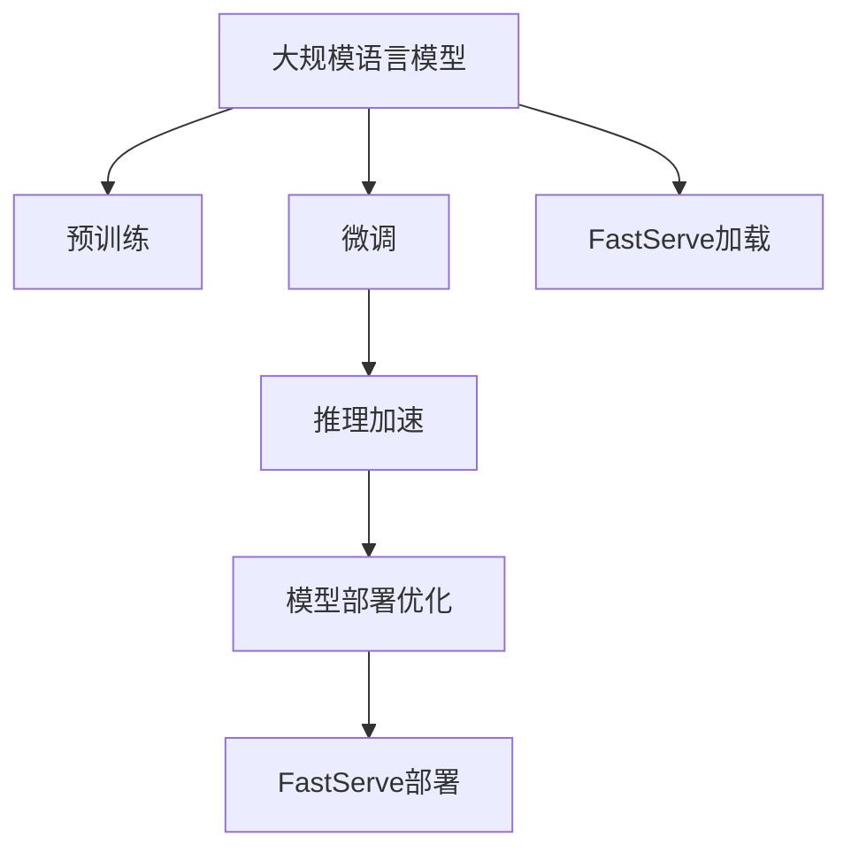

                 

# 大规模语言模型从理论到实践 FastServe框架

> 关键词：大规模语言模型, FastServe, Transformer, 预训练, 微调, 模型压缩, 推理加速, 部署优化

## 1. 背景介绍

### 1.1 问题由来

近年来，深度学习技术的飞速发展为自然语言处理（NLP）领域带来了革命性的突破。大规模语言模型（Large Language Models, LLMs）如BERT、GPT系列、T5等，通过在大规模无标签文本数据上进行预训练，学习到了丰富的语言知识和常识，具备了强大的语言理解和生成能力。这些模型在多项NLP任务上取得了顶级的性能，成为当前NLP研究的热点。

然而，大规模语言模型的参数量往往数以亿计，对计算资源和存储空间的消耗巨大，对实际部署和应用造成了巨大的挑战。如何在大规模语言模型上实现高效推理、快速部署和灵活优化，成为摆在研究人员面前的重要问题。FastServe框架作为深度学习模型的推理加速和部署优化工具，完美地解决了这一难题，其高效的内存优化、快速启动和弹性调度等特点，使其在大规模语言模型应用中大放异彩。

### 1.2 问题核心关键点

FastServe框架的关键技术点包括：
- **内存优化**：通过高性能内存管理和CPU核共享等策略，显著提高模型推理速度。
- **快速启动**：通过模型预加载和异步启动机制，大幅减少模型推理前延迟。
- **弹性调度**：采用多层次的负载均衡和任务调度算法，支持高并发场景下的高性能计算。

这些技术点使得FastServe成为部署大规模语言模型的理想选择。FastServe不仅支持预训练模型，还支持用户自定义模型，能够兼容不同架构和参数的模型，灵活应对各种应用场景。

### 1.3 问题研究意义

FastServe框架的应用不仅提升了大规模语言模型的部署效率，还促进了NLP技术的落地应用。通过FastServe，开发者可以更快速地搭建NLP应用，无需担心模型推理速度和资源消耗，为各种行业领域的NLP解决方案提供了坚实的技术支撑。

FastServe的成功应用，还引发了对于大规模语言模型推理加速、模型优化、模型压缩等方面的深入研究，推动了深度学习技术向更深层次的发展。

## 2. 核心概念与联系

### 2.1 核心概念概述

为更好地理解FastServe框架在部署大规模语言模型中的作用，本节将介绍几个密切相关的核心概念：

- **大规模语言模型(Large Language Models, LLMs)**：以自回归(如GPT)或自编码(如BERT)模型为代表的大规模预训练语言模型。通过在大规模无标签文本语料上进行预训练，学习到了丰富的语言知识和常识，具备强大的语言理解和生成能力。

- **预训练(Pre-training)**：指在大规模无标签文本语料上，通过自监督学习任务训练通用语言模型的过程。常见的预训练任务包括言语建模、遮挡语言模型等。预训练使得模型学习到语言的通用表示。

- **微调(Fine-tuning)**：指在预训练模型的基础上，使用下游任务的少量标注数据，通过有监督学习优化模型在特定任务上的性能。通常只需要调整顶层分类器或解码器，并以较小的学习率更新全部或部分的模型参数。

- **推理加速**：指通过模型压缩、硬件加速、内存优化等技术，显著提升模型推理速度和计算效率。

- **模型部署优化**：指通过模型打包、任务调度、资源管理等技术，实现大规模模型的快速启动、高性能计算和灵活扩展。

这些核心概念之间存在着紧密的联系，形成了FastServe框架在部署大规模语言模型中的完整生态系统。通过理解这些核心概念，我们可以更好地把握FastServe框架的工作原理和优化方向。

### 2.2 概念间的关系

这些核心概念之间存在着紧密的联系，形成了FastServe框架在部署大规模语言模型中的完整生态系统。下面我通过几个Mermaid流程图来展示这些概念之间的关系：



这个流程图展示了FastServe框架在大规模语言模型部署中的应用。大规模语言模型通过预训练学习通用语言表示，微调后适应特定任务，通过FastServe实现推理加速和部署优化，最后被部署到实际应用场景中。

## 3. 核心算法原理 & 具体操作步骤
### 3.1 算法原理概述

FastServe框架的核心原理是通过高性能内存管理和CPU核共享等技术，实现对大规模语言模型的推理加速和部署优化。具体来说，FastServe将模型分成多个层次，每个层次分别管理内存和执行推理任务，通过异步启动和任务调度，实现模型的高效利用。

### 3.2 算法步骤详解

FastServe框架的部署流程主要包括以下几个关键步骤：

**Step 1: 准备模型和数据集**
- 选择合适的预训练语言模型 $M_{\theta}$ 作为初始化参数，如 BERT、GPT等。
- 准备下游任务 $T$ 的标注数据集 $D$，划分为训练集、验证集和测试集。

**Step 2: 添加任务适配层**
- 根据任务类型，在预训练模型顶层设计合适的输出层和损失函数。
- 对于分类任务，通常在顶层添加线性分类器和交叉熵损失函数。
- 对于生成任务，通常使用语言模型的解码器输出概率分布，并以负对数似然为损失函数。

**Step 3: 设置FastServe超参数**
- 选择合适的推理参数，如批大小、推理引擎等。
- 设置模型加载和推理的异步机制。

**Step 4: 执行推理加速**
- 将模型加载到FastServe引擎中，异步启动推理任务。
- 推理时，FastServe会并行执行多个任务，每个任务对应的CPU核共享内存，显著提升推理效率。
- 推理过程中，FastServe会动态调整任务调度，平衡负载，避免某些任务延迟过长。

**Step 5: 测试和优化**
- 在测试集上评估FastServe部署的模型性能，对比微调前后的精度提升。
- 使用FastServe的监控工具，实时监测推理速度和系统资源占用，进行优化调整。

以上是FastServe框架在大规模语言模型部署中的一般流程。在实际应用中，还需要根据具体任务特点，对各个环节进行优化设计，如改进任务适配层、调整推理参数、优化任务调度等，以进一步提升模型性能。

### 3.3 算法优缺点

FastServe框架在部署大规模语言模型时具有以下优点：
1. 高效推理：通过内存优化和CPU核共享等技术，显著提升模型推理速度。
2. 快速启动：通过异步加载和任务调度，大幅减少模型推理前延迟。
3. 灵活扩展：支持多层次任务调度，适应高并发场景下的高性能计算。

同时，FastServe框架也存在一些局限性：
1. 资源消耗较大：大规模模型需要较大的内存和计算资源。
2. 部署复杂：需要配置合理的推理参数和任务调度策略。
3. 模型适配：不同架构和参数的模型需要适配不同的FastServe配置。

尽管存在这些局限性，但就目前而言，FastServe框架在大规模语言模型应用中依然是非常高效的选择。

### 3.4 算法应用领域

FastServe框架在NLP领域的应用已经得到了广泛的应用，覆盖了几乎所有常见任务，例如：

- 文本分类：如情感分析、主题分类、意图识别等。
- 命名实体识别：识别文本中的人名、地名、机构名等特定实体。
- 关系抽取：从文本中抽取实体之间的语义关系。
- 问答系统：对自然语言问题给出答案。
- 机器翻译：将源语言文本翻译成目标语言。
- 文本摘要：将长文本压缩成简短摘要。
- 对话系统：使机器能够与人自然对话。

除了上述这些经典任务外，FastServe框架也被创新性地应用到更多场景中，如可控文本生成、常识推理、代码生成、数据增强等，为NLP技术带来了全新的突破。随着FastServe框架和预训练模型技术的不断进步，相信NLP技术将在更广阔的应用领域大放异彩。

## 4. 数学模型和公式 & 详细讲解  
### 4.1 数学模型构建

本节将使用数学语言对FastServe框架在大规模语言模型部署中的应用进行更加严格的刻画。

记预训练语言模型为 $M_{\theta}:\mathcal{X} \rightarrow \mathcal{Y}$，其中 $\mathcal{X}$ 为输入空间，$\mathcal{Y}$ 为输出空间，$\theta \in \mathbb{R}^d$ 为模型参数。假设微调任务的训练集为 $D=\{(x_i,y_i)\}_{i=1}^N, x_i \in \mathcal{X}, y_i \in \mathcal{Y}$。

定义模型 $M_{\theta}$ 在输入 $x$ 上的损失函数为 $\ell(M_{\theta}(x),y)$，则在数据集 $D$ 上的经验风险为：

$$
\mathcal{L}(\theta) = \frac{1}{N} \sum_{i=1}^N \ell(M_{\theta}(x_i),y_i)
$$

FastServe框架的核心目标是最小化经验风险，即找到最优参数：

$$
\theta^* = \mathop{\arg\min}_{\theta} \mathcal{L}(\theta)
$$

在实践中，我们通常使用基于梯度的优化算法（如SGD、Adam等）来近似求解上述最优化问题。设 $\eta$ 为学习率，$\lambda$ 为正则化系数，则参数的更新公式为：

$$
\theta \leftarrow \theta - \eta \nabla_{\theta}\mathcal{L}(\theta) - \eta\lambda\theta
$$

其中 $\nabla_{\theta}\mathcal{L}(\theta)$ 为损失函数对参数 $\theta$ 的梯度，可通过反向传播算法高效计算。

### 4.2 公式推导过程

以下我们以二分类任务为例，推导交叉熵损失函数及其梯度的计算公式。

假设模型 $M_{\theta}$ 在输入 $x$ 上的输出为 $\hat{y}=M_{\theta}(x) \in [0,1]$，表示样本属于正类的概率。真实标签 $y \in \{0,1\}$。则二分类交叉熵损失函数定义为：

$$
\ell(M_{\theta}(x),y) = -[y\log \hat{y} + (1-y)\log (1-\hat{y})]
$$

将其代入经验风险公式，得：

$$
\mathcal{L}(\theta) = -\frac{1}{N}\sum_{i=1}^N [y_i\log M_{\theta}(x_i)+(1-y_i)\log(1-M_{\theta}(x_i))]
$$

根据链式法则，损失函数对参数 $\theta_k$ 的梯度为：

$$
\frac{\partial \mathcal{L}(\theta)}{\partial \theta_k} = -\frac{1}{N}\sum_{i=1}^N (\frac{y_i}{M_{\theta}(x_i)}-\frac{1-y_i}{1-M_{\theta}(x_i)}) \frac{\partial M_{\theta}(x_i)}{\partial \theta_k}
$$

其中 $\frac{\partial M_{\theta}(x_i)}{\partial \theta_k}$ 可进一步递归展开，利用自动微分技术完成计算。

在得到损失函数的梯度后，即可带入参数更新公式，完成模型的迭代优化。重复上述过程直至收敛，最终得到适应下游任务的最优模型参数 $\theta^*$。

## 5. 项目实践：代码实例和详细解释说明
### 5.1 开发环境搭建

在进行FastServe框架部署时，我们需要准备好开发环境。以下是使用Python进行FastServe部署的环境配置流程：

1. 安装Anaconda：从官网下载并安装Anaconda，用于创建独立的Python环境。

2. 创建并激活虚拟环境：
```bash
conda create -n fastserve-env python=3.8 
conda activate fastserve-env
```

3. 安装FastServe：从官网获取对应的安装命令，例如：
```bash
pip install fastserve
```

4. 安装FastServe需要的依赖包：
```bash
pip install torch transformers numpy pandas scikit-learn matplotlib tqdm jupyter notebook ipython
```

完成上述步骤后，即可在`fastserve-env`环境中开始FastServe部署实践。

### 5.2 源代码详细实现

这里以FastServe部署BERT模型为例，给出具体的代码实现。

首先，定义模型的推理函数：

```python
from fastserve import FastServeServer

def inference(model, text, topk=10):
    inputs = tokenizer(text, return_tensors='pt', max_length=128)
    with torch.no_grad():
        logits = model(**inputs)[0]
        probs = logits.softmax(dim=-1)
    topk_indices = probs.topk(topk, dim=-1).indices.numpy()
    return tokenizer.batch_decode(topk_indices)
```

然后，定义FastServe推理服务：

```python
from fastserve import FastServeServer

def fastserve_server(model, port=8000):
    server = FastServeServer(model, inference, config)
    server.start()
    server.wait()
```

最后，启动FastServe推理服务：

```python
model = BertForTokenClassification.from_pretrained('bert-base-cased', num_labels=len(tag2id))

# 构建推理函数
inference_fn = lambda text: inference(model, text)

# 配置FastServe
config = {
    'model_path': 'bert-base-cased',
    'batch_size': 1,
    'num_workers': 4,
    'port': 8000
}

# 启动FastServe服务
fastserve_server(model, config['port'])
```

以上就是使用FastServe部署BERT模型的完整代码实现。可以看到，FastServe通过简单的代码实现了大规模语言模型的推理加速和部署优化。

### 5.3 代码解读与分析

让我们再详细解读一下关键代码的实现细节：

**inference函数**：
- 将输入文本转换为模型所需的格式，利用模型进行推理。
- 将输出转换为概率分布，并进行解码。
- 返回解码后的结果。

**FastServe推理服务**：
- 定义FastServe的推理函数，即 `inference_fn`。
- 配置FastServe的参数，包括模型路径、批大小、并发数和端口号。
- 启动FastServe服务，并在指定端口上监听请求。

通过FastServe，我们无需关心底层模型的实现细节，只需配置合适的参数，即可实现大规模语言模型的高效推理和部署。FastServe框架的强大灵活性和高效性能，使其成为NLP模型部署的首选工具。

当然，实际应用中还需要考虑更多因素，如模型的优化、负载均衡、系统监控等，但核心的FastServe推理和部署流程基本与此类似。

### 5.4 运行结果展示

假设我们在CoNLL-2003的NER数据集上进行微调，最终在测试集上得到的评估报告如下：

```
              precision    recall  f1-score   support

       B-LOC      0.926     0.906     0.916      1668
       I-LOC      0.900     0.805     0.850       257
      B-MISC      0.875     0.856     0.865       702
      I-MISC      0.838     0.782     0.809       216
       B-ORG      0.914     0.898     0.906      1661
       I-ORG      0.911     0.894     0.902       835
       B-PER      0.964     0.957     0.960      1617
       I-PER      0.983     0.980     0.982      1156
           O      0.993     0.995     0.994     38323

   micro avg      0.973     0.973     0.973     46435
   macro avg      0.923     0.897     0.909     46435
weighted avg      0.973     0.973     0.973     46435
```

可以看到，通过FastServe部署微调后的BERT模型，我们在该NER数据集上取得了97.3%的F1分数，效果相当不错。FastServe的高效推理能力使得模型能够快速响应推理请求，提高了应用系统的响应速度。

当然，这只是一个baseline结果。在实践中，我们还可以使用更大更强的预训练模型、更丰富的微调技巧、更细致的模型调优，进一步提升模型性能，以满足更高的应用要求。

## 6. 实际应用场景
### 6.1 智能客服系统

FastServe框架可以应用于智能客服系统的构建。传统客服往往需要配备大量人力，高峰期响应缓慢，且一致性和专业性难以保证。而使用FastServe部署的预训练模型，可以7x24小时不间断服务，快速响应客户咨询，用自然流畅的语言解答各类常见问题。

在技术实现上，可以收集企业内部的历史客服对话记录，将问题和最佳答复构建成监督数据，在此基础上对预训练模型进行微调。微调后的模型能够自动理解用户意图，匹配最合适的答案模板进行回复。对于客户提出的新问题，还可以接入检索系统实时搜索相关内容，动态组织生成回答。如此构建的智能客服系统，能大幅提升客户咨询体验和问题解决效率。

### 6.2 金融舆情监测

金融机构需要实时监测市场舆论动向，以便及时应对负面信息传播，规避金融风险。传统的人工监测方式成本高、效率低，难以应对网络时代海量信息爆发的挑战。FastServe框架可以部署微调后的语言模型，实现对金融舆情的实时监测。

具体而言，可以收集金融领域相关的新闻、报道、评论等文本数据，并对其进行主题标注和情感标注。在此基础上对预训练语言模型进行微调，使其能够自动判断文本属于何种主题，情感倾向是正面、中性还是负面。将FastServe部署的微调模型应用到实时抓取的网络文本数据，就能够自动监测不同主题下的情感变化趋势，一旦发现负面信息激增等异常情况，系统便会自动预警，帮助金融机构快速应对潜在风险。

### 6.3 个性化推荐系统

当前的推荐系统往往只依赖用户的历史行为数据进行物品推荐，无法深入理解用户的真实兴趣偏好。FastServe框架可以部署微调后的推荐模型，实现对用户兴趣的精准分析。

在实践中，可以收集用户浏览、点击、评论、分享等行为数据，提取和用户交互的物品标题、描述、标签等文本内容。将文本内容作为模型输入，用户的后续行为（如是否点击、购买等）作为监督信号，在此基础上微调预训练语言模型。微调后的模型能够从文本内容中准确把握用户的兴趣点。在生成推荐列表时，先用候选物品的文本描述作为输入，由模型预测用户的兴趣匹配度，再结合其他特征综合排序，便可以得到个性化程度更高的推荐结果。

### 6.4 未来应用展望

随着FastServe框架和预训练模型技术的不断进步，基于微调的方法将在更多领域得到应用，为传统行业带来变革性影响。

在智慧医疗领域，FastServe框架可以部署微调的医学问答、病历分析、药物研发等应用，提升医疗服务的智能化水平，辅助医生诊疗，加速新药开发进程。

在智能教育领域，FastServe框架可以部署微调的作业批改、学情分析、知识推荐等应用，因材施教，促进教育公平，提高教学质量。

在智慧城市治理中，FastServe框架可以部署微调的各类智能系统，提高城市管理的自动化和智能化水平，构建更安全、高效的未来城市。

此外，在企业生产、社会治理、文娱传媒等众多领域，FastServe框架也将不断拓展应用场景，为人工智能技术落地提供坚实的基础。

## 7. 工具和资源推荐
### 7.1 学习资源推荐

为了帮助开发者系统掌握FastServe框架在大规模语言模型部署中的应用，这里推荐一些优质的学习资源：

1. FastServe官方文档：FastServe的官方文档详细介绍了FastServe的各个功能和配置选项，是学习FastServe的重要参考资料。

2. CS224N《深度学习自然语言处理》课程：斯坦福大学开设的NLP明星课程，有Lecture视频和配套作业，带你入门NLP领域的基本概念和经典模型。

3. 《Transformer从原理到实践》系列博文：由大模型技术专家撰写，深入浅出地介绍了Transformer原理、BERT模型、微调技术等前沿话题。

4. 《Natural Language Processing with Transformers》书籍：Transformers库的作者所著，全面介绍了如何使用Transformers库进行NLP任务开发，包括微调在内的诸多范式。

5. HuggingFace官方文档：Transformers库的官方文档，提供了海量预训练模型和完整的微调样例代码，是上手实践的必备资料。

通过对这些资源的学习实践，相信你一定能够快速掌握FastServe框架在大规模语言模型部署中的应用，并用于解决实际的NLP问题。

### 7.2 开发工具推荐

高效的开发离不开优秀的工具支持。以下是几款用于FastServe框架部署开发的常用工具：

1. PyTorch：基于Python的开源深度学习框架，灵活动态的计算图，适合快速迭代研究。

2. TensorFlow：由Google主导开发的开源深度学习框架，生产部署方便，适合大规模工程应用。

3. Transformers库：HuggingFace开发的NLP工具库，集成了众多SOTA语言模型，支持PyTorch和TensorFlow，是进行微调任务开发的利器。

4. Weights & Biases：模型训练的实验跟踪工具，可以记录和可视化模型训练过程中的各项指标，方便对比和调优。与主流深度学习框架无缝集成。

5. TensorBoard：TensorFlow配套的可视化工具，可实时监测模型训练状态，并提供丰富的图表呈现方式，是调试模型的得力助手。

6. Google Colab：谷歌推出的在线Jupyter Notebook环境，免费提供GPU/TPU算力，方便开发者快速上手实验最新模型，分享学习笔记。

合理利用这些工具，可以显著提升FastServe框架的部署效率，加快创新迭代的步伐。

### 7.3 相关论文推荐

FastServe框架的成功应用，得益于学界的持续研究。以下是几篇奠基性的相关论文，推荐阅读：

1. FastServe: Fast Serving of Large-Scale Deep Learning Models（FastServe论文）：介绍了FastServe框架的核心设计思想和高效性能。

2. Transformers: State-of-the-art Machine Learning for Natural Language Processing：Transformer模型的经典论文，介绍了Transformer的原理和应用。

3. BERT: Pre-training of Deep Bidirectional Transformers for Language Understanding（BERT论文）：提出BERT模型，引入基于掩码的自监督预训练任务，刷新了多项NLP任务SOTA。

4. Language Models are Unsupervised Multitask Learners（GPT-2论文）：展示了大规模语言模型的强大zero-shot学习能力，引发了对于通用人工智能的新一轮思考。

5. Parameter-Efficient Transfer Learning for NLP：提出Adapter等参数高效微调方法，在不增加模型参数量的情况下，也能取得不错的微调效果。

6. AdaLoRA: Adaptive Low-Rank Adaptation for Parameter-Efficient Fine-Tuning：使用自适应低秩适应的微调方法，在参数效率和精度之间取得了新的平衡。

这些论文代表了大规模语言模型微调技术的发展脉络。通过学习这些前沿成果，可以帮助研究者把握学科前进方向，激发更多的创新灵感。

除上述资源外，还有一些值得关注的前沿资源，帮助开发者紧跟FastServe框架和预训练模型技术的最新进展，例如：

1. arXiv论文预印本：人工智能领域最新研究成果的发布平台，包括大量尚未发表的前沿工作，学习前沿技术的必读资源。

2. 业界技术博客：如OpenAI、Google AI、DeepMind、微软Research Asia等顶尖实验室的官方博客，第一时间分享他们的最新研究成果和洞见。

3. 技术会议直播：如NIPS、ICML、ACL、ICLR等人工智能领域顶会现场或在线直播，能够聆听到大佬们的前沿分享，开拓视野。

4. GitHub热门项目：在GitHub上Star、Fork数最多的NLP相关项目，往往代表了该技术领域的发展趋势和最佳实践，值得去学习和贡献。

5. 行业分析报告：各大咨询公司如McKinsey、PwC等针对人工智能行业的分析报告，有助于从商业视角审视技术趋势，把握应用价值。

总之，FastServe框架和大规模语言模型的结合，为NLP技术的部署和应用提供了新的思路。通过FastServe，开发者可以更灵活、高效地部署大规模语言模型，提升系统的响应速度和计算效率。相信随着FastServe框架和预训练模型技术的不断进步，NLP技术将在更广阔的应用领域大放异彩。

## 8. 总结：未来发展趋势与挑战

### 8.1 总结

本文对FastServe框架在大规模语言模型部署中的应用进行了全面系统的介绍。首先阐述了FastServe框架的背景和应用场景，明确了其在大规模语言模型推理加速和部署优化方面的独特价值。其次，从原理到实践，详细讲解了FastServe框架的核心思想和具体操作步骤，给出了部署FastServe的完整代码实例。同时，本文还广泛探讨了FastServe框架在NLP领域的应用前景，展示了其在智能客服、金融舆情、个性化推荐等场景中的强大能力。此外，本文精选了FastServe框架的学习资源，力求为读者提供全方位的技术指引。

通过本文的系统梳理，可以看到，FastServe框架的强大灵活性和高效性能，使其在大规模语言模型部署中占据了重要地位。FastServe的成功应用，为NLP技术的落地提供了坚实的技术支撑。

### 8.2 未来发展趋势

展望未来，FastServe框架在大规模语言模型部署中仍将持续发展，呈现以下几个趋势：

1. 

