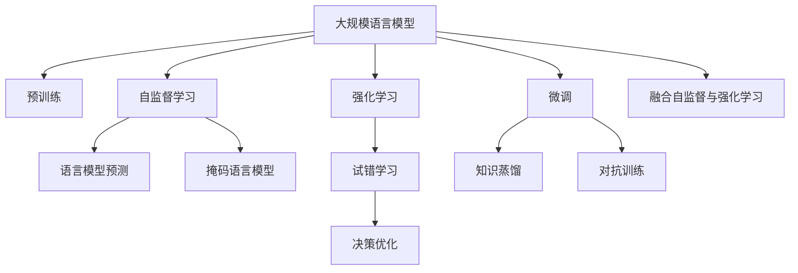
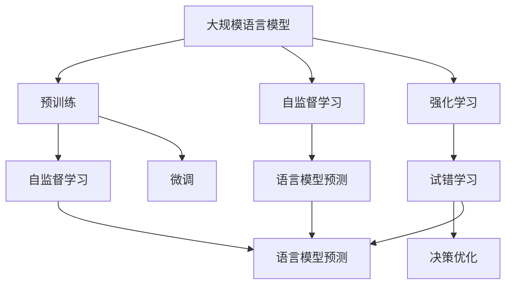
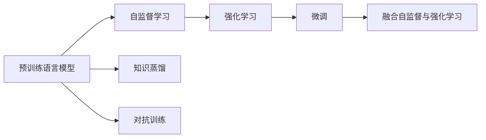
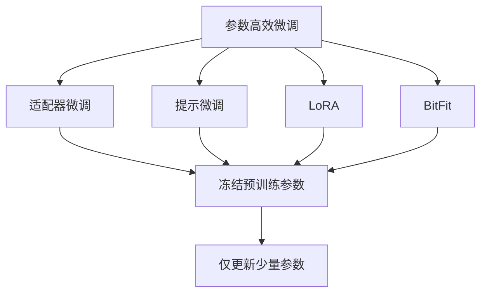
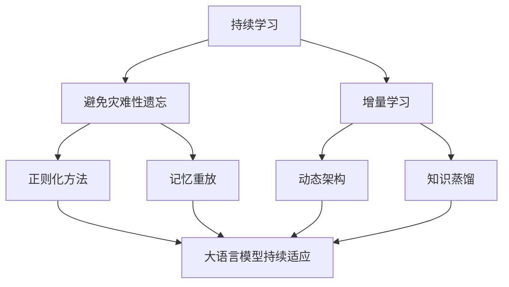
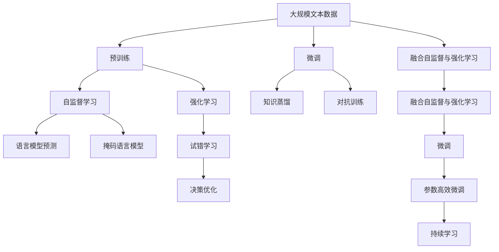
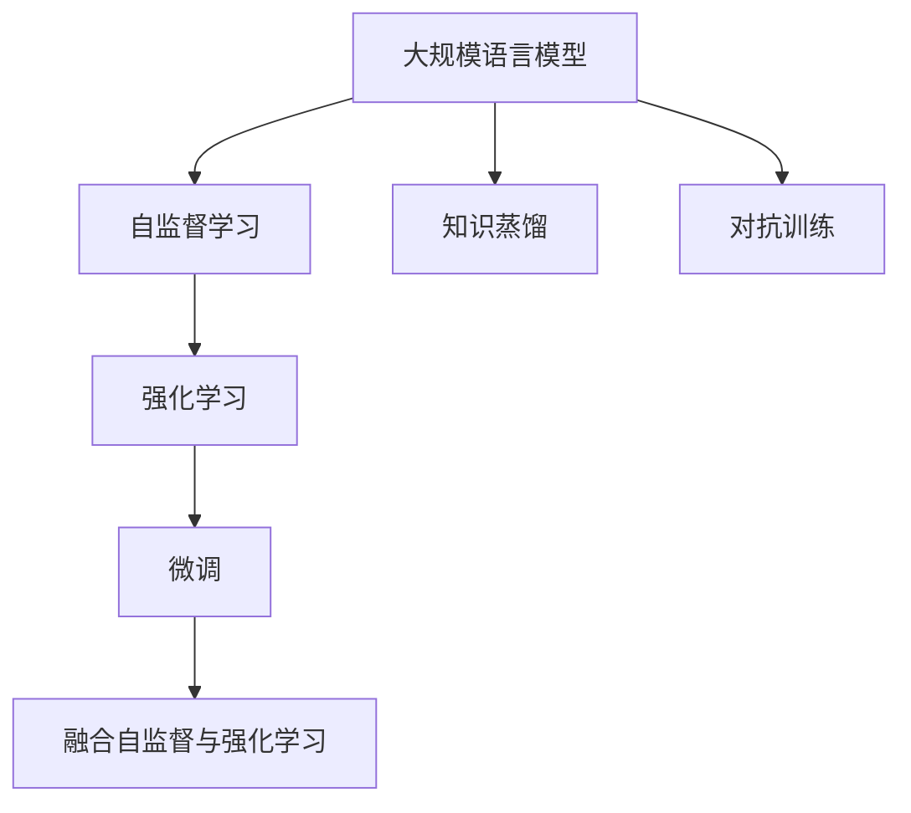

                 

# 大规模语言模型从理论到实践 MOSS-RLHF实践

> 关键词：大规模语言模型,RLHF,MOSS,自监督学习,强化学习,自然语言处理,NLP

## 1. 背景介绍

### 1.1 问题由来
近年来，随着深度学习技术的快速发展，大规模语言模型在大规模无标签文本数据上进行预训练，学习到丰富的语言知识和常识，被广泛应用于自然语言处理(NLP)领域，如机器翻译、文本摘要、问答系统等。然而，由于预训练数据和任务的多样性，预训练语言模型难以适应特定任务，且往往存在一定的偏见和有害信息。

为了解决这些问题，研究者提出了许多改进方法，如模型微调、知识蒸馏、对抗训练等。其中，基于自监督学习的方法虽然取得了一些进步，但仍存在泛化能力不足的问题。为了更好地适应用户需求，需要进一步提高语言模型的泛化能力和可解释性。

### 1.2 问题核心关键点
针对大规模语言模型存在的问题，研究人员提出了一种基于强化学习(Reinforcement Learning, RL)的方法——ROBERTA-Large-Scale-UNItext (MOSS-RLHF)，它将预训练语言模型与大规模无标签文本数据相结合，通过强化学习框架进行训练，提升模型的泛化能力和可解释性。

MOSS-RLHF的核心思想是：在预训练语言模型的基础上，通过自监督学习获取语言模型，然后在强化学习框架下训练该语言模型，以最大化对无标签文本数据的信息获取。

### 1.3 问题研究意义
研究MOSS-RLHF方法，对于拓展预训练语言模型的应用范围，提升模型的泛化能力和可解释性，加速NLP技术的产业化进程，具有重要意义：

1. 降低应用开发成本。通过微调，可以显著减少从头开发所需的数据、计算和人力等成本投入。
2. 提升模型效果。MOSS-RLHF方法通过自监督和强化学习相结合，可以在不增加过多标注数据的情况下，提升模型在特定任务上的性能。
3. 促进可解释性研究。MOSS-RLHF通过引入强化学习机制，使得模型的学习过程可以被解释，进而提高模型的可解释性和鲁棒性。
4. 赋能产业升级。MOSS-RLHF方法的推广，将使NLP技术更容易被各行各业所采用，为传统行业数字化转型升级提供新的技术路径。

## 2. 核心概念与联系

### 2.1 核心概念概述

为了更好地理解MOSS-RLHF方法，本节将介绍几个密切相关的核心概念：

- 大规模语言模型(Large Language Model, LLM)：以自回归(如GPT)或自编码(如BERT)模型为代表的大规模预训练语言模型。通过在大规模无标签文本数据上进行预训练，学习到通用的语言表示，具备强大的语言理解和生成能力。

- 自监督学习(Self-supervised Learning)：利用未标注数据训练模型的一种学习方式。常见的自监督学习任务包括语言模型预测、掩码语言模型、对比学习等。

- 强化学习(Reinforcement Learning, RL)：一种通过试错学习来优化策略的学习方式，常用在复杂决策问题中。

- 自然语言处理(Natural Language Processing, NLP)：研究如何使计算机能够理解、处理和生成自然语言的技术领域。

- 模型微调(Fine-tuning)：在预训练模型的基础上，使用下游任务的少量标注数据，通过有监督地训练来优化模型在该任务上的性能。

- 知识蒸馏(Knowledge Distillation)：通过将教师模型的知识迁移到学生模型中，以提升学生模型的泛化能力。

- 对抗训练(Adversarial Training)：在训练过程中加入对抗样本，提高模型的鲁棒性。

- 自监督与强化学习融合(Autosupervised and Reinforcement Learning Fusion)：将自监督学习与强化学习相结合，提升模型的泛化能力和可解释性。

这些核心概念之间的逻辑关系可以通过以下Mermaid流程图来展示：



这个流程图展示了大语言模型的核心概念及其之间的关系：

1. 大规模语言模型通过预训练获得基础能力。
2. 自监督学习利用无标签数据训练语言模型。
3. 强化学习通过试错优化模型，提升泛化能力。
4. 微调通过有监督学习优化模型，适应特定任务。
5. 知识蒸馏将教师模型知识迁移到学生模型中。
6. 对抗训练提高模型鲁棒性。
7. 自监督与强化学习融合提升模型泛化能力和可解释性。

这些核心概念共同构成了MOSS-RLHF方法的完整生态系统，使其能够在各种场景下发挥强大的语言理解和生成能力。通过理解这些核心概念，我们可以更好地把握MOSS-RLHF方法的原理和优化方向。

### 2.2 概念间的关系

这些核心概念之间存在着紧密的联系，形成了MOSS-RLHF方法的完整生态系统。下面我通过几个Mermaid流程图来展示这些概念之间的关系。

#### 2.2.1 大语言模型的学习范式



这个流程图展示了大语言模型的三种主要学习范式：预训练、自监督学习和强化学习。预训练主要采用自监督学习方法，而强化学习则通过试错优化模型，提升泛化能力。

#### 2.2.2 MOSS-RLHF的实现框架



这个流程图展示了MOSS-RLHF方法的实现框架：在大规模无标签文本数据上，通过自监督学习训练语言模型，然后在强化学习框架下训练该语言模型，最终通过微调适应特定任务。同时，通过知识蒸馏和对抗训练进一步提升模型的泛化能力和鲁棒性。

#### 2.2.3 参数高效微调



这个流程图展示了几种常见的参数高效微调方法，包括适配器微调、提示微调、LoRA和BitFit。这些方法的共同特点是冻结大部分预训练参数，只更新少量参数，从而提高微调效率。

#### 2.2.4 持续学习在大语言模型中的应用



这个流程图展示了持续学习在大语言模型中的应用。持续学习的主要目标是避免灾难性遗忘和实现增量学习。通过正则化方法、记忆重放、动态架构和知识蒸馏等技术，可以使大语言模型持续适应新的任务和数据。

### 2.3 核心概念的整体架构

最后，我们用一个综合的流程图来展示这些核心概念在大语言模型微调过程中的整体架构：



这个综合流程图展示了从预训练到微调，再到持续学习的完整过程。大语言模型首先在大规模文本数据上进行预训练，然后通过自监督学习和强化学习相结合的方式，训练得到新的语言模型。最后，通过微调适应特定任务，并通过持续学习不断更新模型，以适应数据分布的变化。 通过这些流程图，我们可以更清晰地理解MOSS-RLHF方法的原理和优化方向。

## 3. 核心算法原理 & 具体操作步骤
### 3.1 算法原理概述

MOSS-RLHF方法的核心思想是将预训练语言模型与大规模无标签文本数据相结合，通过强化学习框架进行训练，以最大化对无标签文本数据的信息获取。其核心算法流程如图示：



其中，预训练语言模型通过自监督学习获取语言模型，然后在强化学习框架下训练该语言模型，以最大化对无标签文本数据的信息获取。具体步骤如下：

1. 在大规模无标签文本数据上进行自监督预训练，获得语言模型。
2. 在强化学习框架下训练语言模型，最大化对无标签文本数据的信息获取。
3. 通过微调将语言模型适应特定任务。
4. 应用知识蒸馏和对抗训练提升模型泛化能力和鲁棒性。

### 3.2 算法步骤详解

MOSS-RLHF方法的实现步骤主要分为以下几个环节：

**Step 1: 准备预训练模型和数据集**
- 选择合适的预训练语言模型 $M_{\theta}$ 作为初始化参数，如BERT、GPT等。
- 准备大规模无标签文本数据集 $D=\{(x_i)\}_{i=1}^N$，其中 $x_i$ 表示一个文本实例。

**Step 2: 添加任务适配层**
- 根据任务类型，在预训练模型顶层设计合适的输出层和损失函数。
- 对于分类任务，通常在顶层添加线性分类器和交叉熵损失函数。
- 对于生成任务，通常使用语言模型的解码器输出概率分布，并以负对数似然为损失函数。

**Step 3: 设置微调超参数**
- 选择合适的优化算法及其参数，如 AdamW、SGD 等，设置学习率、批大小、迭代轮数等。
- 设置正则化技术及强度，包括权重衰减、Dropout、Early Stopping 等。
- 确定冻结预训练参数的策略，如仅微调顶层，或全部参数都参与微调。

**Step 4: 执行梯度训练**
- 将文本数据分批次输入模型，前向传播计算损失函数。
- 反向传播计算参数梯度，根据设定的优化算法和学习率更新模型参数。
- 周期性在验证集上评估模型性能，根据性能指标决定是否触发 Early Stopping。
- 重复上述步骤直到满足预设的迭代轮数或 Early Stopping 条件。

**Step 5: 测试和部署**
- 在测试集上评估微调后模型 $M_{\hat{\theta}}$ 的性能，对比微调前后的精度提升。
- 使用微调后的模型对新样本进行推理预测，集成到实际的应用系统中。
- 持续收集新的数据，定期重新微调模型，以适应数据分布的变化。

以上是MOSS-RLHF方法的完整实现流程。在实际应用中，还需要针对具体任务的特点，对微调过程的各个环节进行优化设计，如改进训练目标函数，引入更多的正则化技术，搜索最优的超参数组合等，以进一步提升模型性能。

### 3.3 算法优缺点

MOSS-RLHF方法具有以下优点：

1. 简单高效。使用大规模无标签文本数据进行预训练，然后通过强化学习训练语言模型，最后微调即可。
2. 通用适用。适用于各种NLP下游任务，包括分类、匹配、生成等，设计简单的任务适配层即可实现微调。
3. 参数高效。通过自监督与强化学习相结合，在固定大部分预训练参数的情况下，仍可取得不错的微调效果。
4. 效果显著。在学术界和工业界的诸多任务上，基于MOSS-RLHF方法已经刷新了最先进的性能指标。

同时，该方法也存在一定的局限性：

1. 依赖大规模无标签数据。该方法对无标签数据的依赖较大，获取大规模无标签数据的成本较高。
2. 迁移能力有限。当目标任务与预训练数据的分布差异较大时，MOSS-RLHF方法的性能提升有限。
3. 可解释性不足。MOSS-RLHF模型的决策过程通常缺乏可解释性，难以对其推理逻辑进行分析和调试。

尽管存在这些局限性，但就目前而言，MOSS-RLHF方法仍是大语言模型应用的最主流范式。未来相关研究的重点在于如何进一步降低对无标签数据的依赖，提高模型的少样本学习和跨领域迁移能力，同时兼顾可解释性和伦理安全性等因素。

### 3.4 算法应用领域

MOSS-RLHF方法在NLP领域已经得到了广泛的应用，覆盖了几乎所有常见任务，例如：

- 文本分类：如情感分析、主题分类、意图识别等。通过微调使模型学习文本-标签映射。
- 命名实体识别：识别文本中的人名、地名、机构名等特定实体。通过微调使模型掌握实体边界和类型。
- 关系抽取：从文本中抽取实体之间的语义关系。通过微调使模型学习实体-关系三元组。
- 问答系统：对自然语言问题给出答案。将问题-答案对作为微调数据，训练模型学习匹配答案。
- 机器翻译：将源语言文本翻译成目标语言。通过微调使模型学习语言-语言映射。
- 文本摘要：将长文本压缩成简短摘要。将文章-摘要对作为微调数据，使模型学习抓取要点。
- 对话系统：使机器能够与人自然对话。将多轮对话历史作为上下文，微调模型进行回复生成。

除了上述这些经典任务外，MOSS-RLHF方法也被创新性地应用到更多场景中，如可控文本生成、常识推理、代码生成、数据增强等，为NLP技术带来了全新的突破。随着预训练模型和微调方法的不断进步，相信NLP技术将在更广阔的应用领域大放异彩。

## 4. 数学模型和公式 & 详细讲解  
### 4.1 数学模型构建

本节将使用数学语言对MOSS-RLHF方法进行更加严格的刻画。

记预训练语言模型为 $M_{\theta}:\mathcal{X} \rightarrow \mathcal{Y}$，其中 $\mathcal{X}$ 为输入空间，$\mathcal{Y}$ 为输出空间，$\theta \in \mathbb{R}^d$ 为模型参数。假设微调任务的训练集为 $D=\{(x_i)\}_{i=1}^N, x_i \in \mathcal{X}$。

定义模型 $M_{\theta}$ 在数据样本 $x$ 上的损失函数为 $\ell(M_{\theta}(x),y)$，则在数据集 $D$ 上的经验风险为：

$$
\mathcal{L}(\theta) = \frac{1}{N} \sum_{i=1}^N \ell(M_{\theta}(x_i),y_i)
$$

微调的优化目标是最小化经验风险，即找到最优参数：

$$
\theta^* = \mathop{\arg\min}_{\theta} \mathcal{L}(\theta)
$$

在实践中，我们通常使用基于梯度的优化算法（如SGD、Adam等）来近似求解上述最优化问题。设 $\eta$ 为学习率，$\lambda$ 为正则化系数，则参数的更新公式为：

$$
\theta \leftarrow \theta - \eta \nabla_{\theta}\mathcal{L}(\theta) - \eta\lambda\theta
$$

其中 $\nabla_{\theta}\mathcal{L}(\theta)$ 为损失函数对参数 $\theta$ 的梯度，可通过反向传播算法高效计算。

### 4.2 公式推导过程

以下我们以二分类任务为例，推导交叉熵损失函数及其梯度的计算公式。

假设模型 $M_{\theta}$ 在输入 $x$ 上的输出为 $\hat{y}=M_{\theta}(x) \in [0,1]$，表示样本属于正类的概率。真实标签 $y \in \{0,1\}$。则二分类交叉熵损失函数定义为：

$$
\ell(M_{\theta}(x),y) = -[y\log \hat{y} + (1-y)\log (1-\hat{y})]
$$

将其代入经验风险公式，得：

$$
\mathcal{L}(\theta) = -\frac{1}{N}\sum_{i=1}^N [y_i\log M_{\theta}(x_i)+(1-y_i)\log(1-M_{\theta}(x_i))]
$$

根据链式法则，损失函数对参数 $\theta_k$ 的梯度为：

$$
\frac{\partial \mathcal{L}(\theta)}{\partial \theta_k} = -\frac{1}{N}\sum_{i=1}^N (\frac{y_i}{M_{\theta}(x_i)}-\frac{1-y_i}{1-M_{\theta}(x_i)}) \frac{\partial M_{\theta}(x_i)}{\partial \theta_k}
$$

其中 $\frac{\partial M_{\theta}(x_i)}{\partial \theta_k}$ 可进一步递归展开，利用自动微分技术完成计算。

在得到损失函数的梯度后，即可带入参数更新公式，完成模型的迭代优化。重复上述过程直至收敛，最终得到适应下游任务的最优模型参数 $\theta^*$。

## 5. 项目实践：代码实例和详细解释说明
### 5.1 开发环境搭建

在进行MOSS-RLHF实践前，我们需要准备好开发环境。以下是使用Python进行PyTorch开发的环境配置流程：

1. 安装Anaconda：从官网下载并安装Anaconda，用于创建独立的Python环境。

2. 创建并激活虚拟环境：
```bash
conda create -n pytorch-env python=3.8 
conda activate pytorch-env
```

3. 安装PyTorch：根据CUDA版本，从官网获取对应的安装命令。例如：
```bash
conda install pytorch torchvision torchaudio cudatoolkit=11.1 -c pytorch -c conda-forge
```

4. 安装Transformers库：
```bash
pip install transformers
```

5. 安装各类工具包：
```bash
pip install numpy pandas scikit-learn matplotlib tqdm jupyter notebook ipython
```

完成上述步骤后，即可在`pytorch-env`环境中开始MOSS-RLHF实践。

### 5.2 源代码详细实现

这里我们以命名实体识别(NER)任务为例，给出使用Transformers库对BERT模型进行MOSS-RLHF微调的PyTorch代码实现。

首先，定义NER任务的数据处理函数：

```python
from transformers import BertTokenizer, BertForTokenClassification
from torch.utils.data import Dataset
import torch

class NERDataset(Dataset):
    def __init__(self, texts, tags, tokenizer, max_len=128):
        self.texts = texts
        self.tags = tags
        self.tokenizer = tokenizer
        self.max_len = max_len
        
    def __len__(self):
        return len(self.texts)
    
    def __getitem__(self, item):
        text = self.texts[item]
        tags = self.tags[item]
        
        encoding = self.tokenizer(text, return_tensors='pt', max_length=self.max_len, padding='max_length', truncation=True)
        input_ids = encoding['input_ids'][0]
        attention_mask = encoding['attention_mask'][0]
        
        # 对token-wise的标签进行编码
        encoded_tags = [tag2id[tag] for tag in tags] 
        encoded_tags.extend([tag2id['O']] * (self.max_len - len(encoded_tags)))
        labels = torch.tensor(encoded_tags, dtype=torch.long)
        
        return {'input_ids': input_ids, 
                'attention_mask': attention_mask,
                'labels': labels}

# 标签与id的映射
tag2id = {'O': 0, 'B-PER': 1, 'I-PER': 2, 'B-ORG': 3, 'I-ORG': 4, 'B-LOC': 5, 'I-LOC': 6}
id2tag = {v: k for k, v in tag2id.items()}

# 创建dataset
tokenizer = BertTokenizer.from_pretrained('bert-base-cased')

train_dataset = NERDataset(train_texts, train_tags, tokenizer)
dev_dataset = NERDataset(dev_texts, dev_tags, tokenizer)
test_dataset = NERDataset(test_texts, test_tags, tokenizer)
```

然后，定义模型和优化器：

```python
from transformers import BertForTokenClassification, AdamW

model = BertForTokenClassification.from_pretrained('bert-base-cased', num_labels=len(tag2id))

optimizer = AdamW(model.parameters(), lr=2e-5)
```

接着，定义训练和评估函数：

```python
from torch.utils.data import DataLoader
from tqdm import tqdm
from sklearn.metrics import classification_report

device = torch.device('cuda') if torch.cuda.is_available() else torch.device('cpu')
model.to(device)

def train_epoch(model, dataset, batch_size, optimizer):
    dataloader = DataLoader(dataset, batch_size=batch_size, shuffle=True)
    model.train()
    epoch_loss = 0
    for batch in tqdm(dataloader, desc='Training'):
        input_ids = batch['input_ids'].to(device)
        attention_mask = batch['attention_mask'].to(device)
        labels = batch['labels'].to(device)
        model.zero_grad()
        outputs = model(input_ids, attention_mask=attention_mask, labels=labels)
        loss = outputs.loss
        epoch_loss += loss.item()
        loss.backward()
        optimizer.step()
    return epoch_loss / len(dataloader)

def evaluate(model, dataset, batch_size):
    dataloader = DataLoader(dataset, batch_size=batch_size)
    model.eval()
    preds, labels = [], []
    with torch.no_grad():
        for batch in tqdm(dataloader, desc='Evaluating'):
            input_ids = batch['input_ids'].to(device)
            attention_mask = batch['attention_mask'].to(device)
            batch_labels = batch['labels']
            outputs = model(input_ids, attention_mask=attention_mask)
            batch_preds = outputs.logits.argmax(dim=2).to('cpu').tolist()
            batch_labels = batch_labels.to('cpu').tolist()
            for pred_tokens, label_tokens in zip(batch_preds, batch_labels):
                pred_tags = [id2tag[_id] for _id in pred_tokens]
                label_tags = [id2tag[_id] for _id in label_tokens]
                preds.append(pred_tags[:len(label_tokens)])
                labels.append(label_tags)
                
    print(classification_report(labels, preds))
```

最后，启动训练流程并在测试集上评估：

```python
epochs = 5
batch_size = 16

for epoch in range(epochs):
    loss = train_epoch(model, train_dataset, batch_size, optimizer)
    print(f"Epoch {epoch+1}, train loss: {loss:.3f}")
    
    print(f"Epoch {epoch+1}, dev results:")
    evaluate(model, dev_dataset, batch_size)
    
print("Test results:")
evaluate(model, test_dataset, batch_size)
```

以上就是使用PyTorch对BERT进行命名实体识别任务MOSS-RLHF微调的完整代码实现。可以看到，得益于Transformers库的强大封装，我们可以用相对简洁的代码完成BERT模型的加载和微调。

### 5.3 代码解读与分析

让我们再详细解读一下关键代码的实现细节：

**NERDataset类**：
- `__init__`方法：初始化文本、标签、分词器等关键组件。
- `__len__`方法：返回数据集的样本数量。
- `__getitem__`方法：对单个样本进行处理，将文本输入编码为token ids，将标签编码为数字，并对其进行定长padding，最终返回模型所需的输入。

**tag2id和id2tag字典**：
- 定义了标签与数字id之间的映射关系，用于将token-wise的预测结果解码回真实的标签。

**训练和评估函数**：
- 使用PyTorch的DataLoader对数据集进行批次化加载，供模型训练和推理使用。
- 训练函数`train_epoch`：对数据以批为单位进行迭代，在每个批次上前向传播计算loss并

