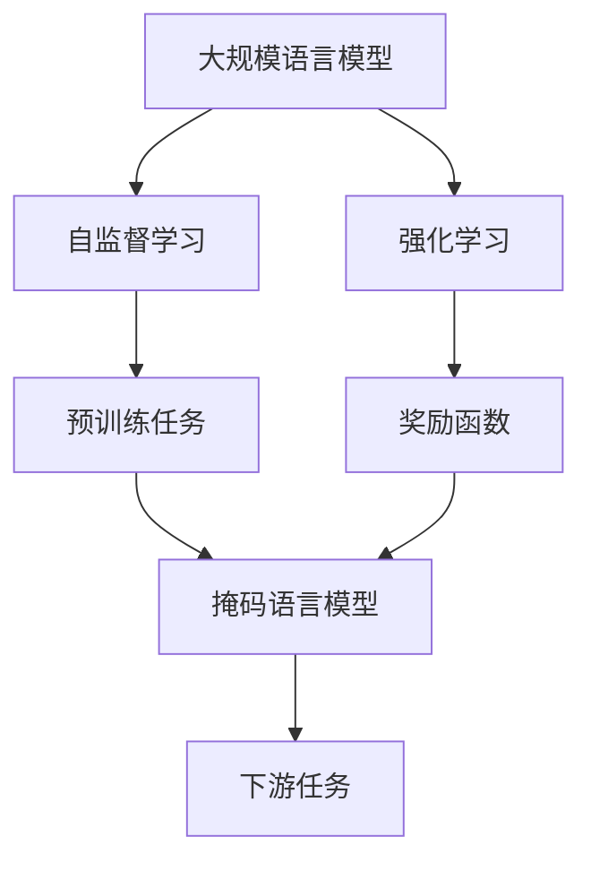
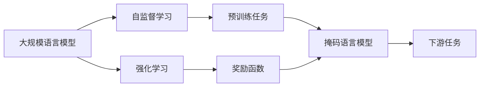
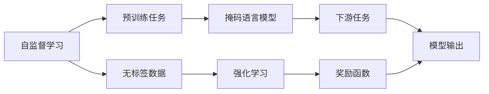
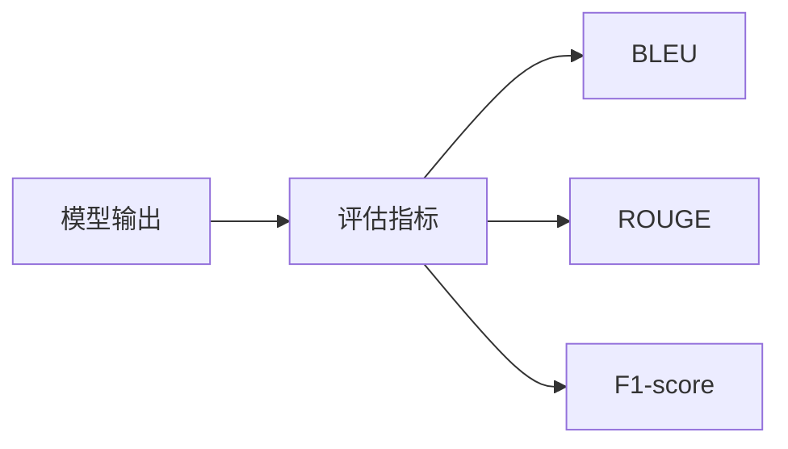
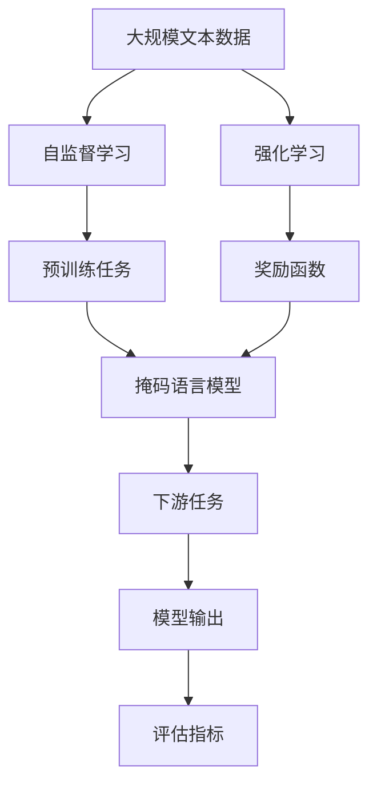

                 

# 大规模语言模型从理论到实践 SFT模型和RL模型评估

> 关键词：大规模语言模型,自监督学习(SFT),强化学习(RL),评估指标,模型对比,应用场景

## 1. 背景介绍

### 1.1 问题由来

随着深度学习技术的飞速发展，大语言模型（Large Language Models, LLMs）逐渐成为了自然语言处理（Natural Language Processing, NLP）领域的研究热点。这些模型通过在海量无标签文本数据上进行预训练，学习了丰富的语言知识和常识，可以在各种下游任务上取得令人瞩目的表现。然而，大语言模型的成功在很大程度上依赖于大规模的标注数据，这不仅增加了模型的训练成本，而且在一些数据稀缺的场景下，难以取得理想的效果。

### 1.2 问题核心关键点

自监督学习（Self-Supervised Learning, SFT）和强化学习（Reinforcement Learning, RL）是两种重要的模型训练范式，它们在大规模语言模型的应用中起到了关键作用。自监督学习利用大量无标签数据进行预训练，通过自监督任务（如掩码语言模型、句子完整性检测等）学习语言模型，从而在处理下游任务时能够充分利用预训练的知识。而强化学习则通过设计特定的奖励函数，引导模型在多轮交互中逐步优化策略，学习如何更好地应对实际场景中的任务。

这两种模型训练范式具有以下优点：

- **自监督学习**：不需要标注数据，能够充分利用无标签数据进行预训练，减少了训练成本；在大规模数据集上训练得到的模型具有更好的泛化能力。
- **强化学习**：能够适应更加多样化的任务场景，通过不断试错学习最优策略，提高了模型的自适应能力。

然而，它们也面临一些挑战：

- **自监督学习**：模型的预训练和微调过程较为复杂，需要大量计算资源和时间；对于特定的任务，预训练的模型可能无法直接应用，需要进行任务适配。
- **强化学习**：模型的训练过程需要大量的交互数据，且存在策略不稳定、容易过拟合的问题；在实际应用中，如何设计合适的奖励函数和评估指标也是一大挑战。

因此，评估和比较这两种模型训练范式在大规模语言模型中的应用效果，显得尤为重要。本文将从理论和实践两个角度，详细阐述自监督学习和强化学习在大规模语言模型中的应用及其评估方法。

### 1.3 问题研究意义

了解自监督学习和强化学习在大规模语言模型中的应用效果，对于优化模型训练、提高模型性能、加速模型落地具有重要意义：

1. **优化模型训练**：通过评估和比较不同训练范式的效果，可以更好地选择适合特定任务的训练方法，提高模型训练效率。
2. **提高模型性能**：不同训练范式具有各自的优势和劣势，合理选择和优化训练方法，有助于提高模型在特定任务上的性能。
3. **加速模型落地**：选择合适的训练范式可以显著降低模型训练成本，加速模型在实际应用中的部署和优化。

## 2. 核心概念与联系

### 2.1 核心概念概述

为了更好地理解自监督学习和强化学习在大规模语言模型中的应用，我们先介绍几个密切相关的核心概念：

- **大规模语言模型**：如BERT、GPT等，通过在海量无标签文本数据上进行预训练，学习通用的语言表示，具备强大的语言理解和生成能力。
- **自监督学习**：在无标签数据上进行训练，通过设计特定的预训练任务，自动学习模型的表示能力。
- **强化学习**：通过设计奖励函数，引导模型在多轮交互中逐步优化策略，学习如何更好地应对实际场景中的任务。
- **评估指标**：用于衡量模型在特定任务上的性能，如BLEU、ROUGE、F1-score等。

这些核心概念之间的逻辑关系可以通过以下Mermaid流程图来展示：



这个流程图展示了大规模语言模型通过预训练任务和奖励函数，在不同训练范式下的学习过程：

1. 自监督学习：通过预训练任务（如掩码语言模型），自动学习模型的表示能力。
2. 强化学习：通过奖励函数设计，引导模型在多轮交互中逐步优化策略。

### 2.2 概念间的关系

这些核心概念之间存在着紧密的联系，形成了大规模语言模型的学习框架。下面我们通过几个Mermaid流程图来展示这些概念之间的关系。

#### 2.2.1 大规模语言模型的学习范式



这个流程图展示了大规模语言模型的两种学习范式：

1. 自监督学习：通过预训练任务，自动学习模型的表示能力。
2. 强化学习：通过奖励函数设计，引导模型逐步优化策略。

#### 2.2.2 自监督学习与强化学习的关系



这个流程图展示了自监督学习和强化学习在大规模语言模型中的应用：

1. 自监督学习：利用无标签数据，通过预训练任务自动学习模型表示。
2. 强化学习：通过奖励函数设计，引导模型逐步优化策略，适应下游任务。

#### 2.2.3 评估指标的应用



这个流程图展示了评估指标在大规模语言模型中的应用：

1. 评估指标：用于衡量模型在特定任务上的性能。
2. BLEU、ROUGE、F1-score等指标：常见的评估指标，用于评价模型在不同任务上的效果。

### 2.3 核心概念的整体架构

最后，我们用一个综合的流程图来展示这些核心概念在大规模语言模型微调过程中的整体架构：



这个综合流程图展示了从预训练到微调，再到评估的完整过程：

1. 预训练：通过自监督学习或强化学习，自动学习模型表示。
2. 微调：通过下游任务，进一步优化模型参数，提高特定任务的性能。
3. 评估：使用评估指标，评估模型在不同任务上的效果。

通过这些流程图，我们可以更清晰地理解大规模语言模型在不同训练范式下的学习过程和评估方法，为后续深入讨论具体的训练方法和评估指标奠定基础。

## 3. 核心算法原理 & 具体操作步骤
### 3.1 算法原理概述

自监督学习和强化学习在大规模语言模型的应用中，都是通过设计特定的学习任务，引导模型自动学习语言表示或优化策略。具体而言，自监督学习通过预训练任务（如掩码语言模型、句子完整性检测等），学习模型的表示能力；强化学习则通过设计奖励函数，引导模型在多轮交互中逐步优化策略。

### 3.2 算法步骤详解

#### 3.2.1 自监督学习步骤

1. **数据准备**：收集大规模无标签文本数据，作为模型的预训练数据。
2. **预训练任务设计**：设计特定的预训练任务，如掩码语言模型、句子完整性检测等，自动学习模型的表示能力。
3. **模型训练**：使用预训练任务进行模型训练，通常使用较大的批大小和较长的训练时间，以充分挖掘数据中的语言规律。
4. **微调**：将预训练得到的模型应用于下游任务，通过有监督训练进一步优化模型参数，以适应特定任务。

#### 3.2.2 强化学习步骤

1. **环境设计**：设计具体的应用场景，如问答系统、文本生成等，作为模型的训练环境。
2. **奖励函数设计**：根据任务需求，设计合适的奖励函数，引导模型逐步优化策略。
3. **模型训练**：在训练环境中，模型通过多轮交互逐步优化策略，学习如何更好地应对实际任务。
4. **评估和优化**：使用评估指标对模型进行评估，根据评估结果进行模型优化和策略调整。

### 3.3 算法优缺点

自监督学习与强化学习在大规模语言模型中的应用，具有以下优点：

- **自监督学习**：
  - 不需要标注数据，能够充分利用无标签数据进行预训练，减少了训练成本。
  - 在大规模数据集上训练得到的模型具有更好的泛化能力。
- **强化学习**：
  - 能够适应更加多样化的任务场景，通过不断试错学习最优策略，提高了模型的自适应能力。

同时，它们也面临一些挑战：

- **自监督学习**：
  - 模型的预训练和微调过程较为复杂，需要大量计算资源和时间。
  - 对于特定的任务，预训练的模型可能无法直接应用，需要进行任务适配。
- **强化学习**：
  - 模型的训练过程需要大量的交互数据，且存在策略不稳定、容易过拟合的问题。
  - 在实际应用中，如何设计合适的奖励函数和评估指标也是一大挑战。

### 3.4 算法应用领域

自监督学习和强化学习在大规模语言模型的应用中，已经在多个领域取得了显著的成果：

- **自然语言理解**：如情感分析、问答系统、命名实体识别等任务。
- **自然语言生成**：如文本摘要、对话生成、机器翻译等任务。
- **推荐系统**：如商品推荐、新闻推荐等任务。
- **知识图谱**：如知识推理、实体链接等任务。

除了上述这些任务，自监督学习和强化学习还在语音识别、图像识别、机器人控制等领域得到了广泛应用。未来，随着技术的不断进步，它们的应用场景还将进一步拓展。

## 4. 数学模型和公式 & 详细讲解 & 举例说明

### 4.1 数学模型构建

假设大规模语言模型为 $M_{\theta}$，其中 $\theta$ 为模型参数。对于自监督学习，我们通过设计特定的预训练任务，自动学习模型的表示能力。对于强化学习，我们通过设计奖励函数，引导模型逐步优化策略。

#### 4.1.1 自监督学习模型

自监督学习的核心在于预训练任务的设计。以掩码语言模型为例，其目标是通过预测被掩码的词汇，学习模型的表示能力。设掩码位置为 $M$，定义掩码语言模型为：

$$
P(\hat{y}|\tilde{y}_M,x) = \frac{e^{M_{\theta}(x)\cdot\log(\hat{y})}}{\sum_{y'} e^{M_{\theta}(x)\cdot\log(y')}}
$$

其中，$\hat{y}$ 表示掩码位置 $M$ 的预测词汇，$\tilde{y}_M$ 表示掩码位置的真实词汇，$x$ 表示输入文本。训练目标为最大化掩码位置上的交叉熵损失：

$$
\mathcal{L}(\theta) = -\frac{1}{N}\sum_{i=1}^N \sum_{M} \log P(\hat{y}|\tilde{y}_M,x)
$$

#### 4.1.2 强化学习模型

强化学习的核心在于设计合适的奖励函数。以文本生成任务为例，设文本长度为 $L$，定义文本生成模型为 $P(y|x)$。奖励函数 $R(y|x)$ 为文本长度 $L$ 和目标文本 $y_t$ 的匹配度：

$$
R(y|x) = \frac{1}{L}\sum_{t=1}^L \mathbb{I}[y_t = y]
$$

其中，$\mathbb{I}$ 表示指示函数，$\mathbb{I}[A]$ 表示 $A$ 是否为真。模型的训练目标为最大化期望奖励：

$$
\mathcal{L}(\theta) = -\mathbb{E}_R[\log P(y|x)]
$$

### 4.2 公式推导过程

#### 4.2.1 自监督学习推导

以掩码语言模型为例，其梯度计算公式为：

$$
\nabla_{\theta} \mathcal{L}(\theta) = -\frac{1}{N}\sum_{i=1}^N \sum_{M} \nabla_{\theta} \log P(\hat{y}|\tilde{y}_M,x)
$$

将梯度表达式展开，得：

$$
\nabla_{\theta} \mathcal{L}(\theta) = -\frac{1}{N}\sum_{i=1}^N \sum_{M} \nabla_{\theta} M_{\theta}(x) \cdot \log P(\hat{y}|\tilde{y}_M,x)
$$

其中，$\nabla_{\theta} M_{\theta}(x)$ 表示模型对输入文本 $x$ 的梯度。因此，自监督学习模型的梯度计算可以转化为对掩码位置上的预测梯度进行累加。

#### 4.2.2 强化学习推导

以文本生成任务为例，其梯度计算公式为：

$$
\nabla_{\theta} \mathcal{L}(\theta) = -\nabla_{\theta} \mathbb{E}_R[\log P(y|x)]
$$

使用梯度下降法求解上述梯度，得：

$$
\nabla_{\theta} \mathcal{L}(\theta) = -\mathbb{E}_R[\nabla_{\theta} \log P(y|x)]
$$

其中，$\nabla_{\theta} \log P(y|x)$ 表示模型对输出文本 $y$ 的梯度。因此，强化学习模型的梯度计算可以转化为对期望梯度的求解。

### 4.3 案例分析与讲解

以文本生成任务为例，我们将分别介绍自监督学习和强化学习的应用案例，并对比其效果。

#### 4.3.1 自监督学习案例

以BERT模型为例，其预训练任务包括掩码语言模型、下一句预测等。通过对大规模无标签文本数据进行预训练，BERT模型学习到了丰富的语言知识和表示能力。在实际应用中，BERT模型可以通过微调应用于各种NLP任务，如情感分析、问答系统等。

以情感分析为例，我们收集大量情感标注数据，将其划分为训练集、验证集和测试集。将BERT模型应用于情感分类任务，通过微调优化模型参数，使其能够适应特定任务。最后，使用测试集对微调后的模型进行评估，对比其与原始BERT模型的效果：

```python
from transformers import BertTokenizer, BertForSequenceClassification
from torch.utils.data import Dataset, DataLoader
from sklearn.metrics import accuracy_score
import torch

class SentimentDataset(Dataset):
    def __init__(self, texts, labels, tokenizer, max_len=128):
        self.texts = texts
        self.labels = labels
        self.tokenizer = tokenizer
        self.max_len = max_len

    def __len__(self):
        return len(self.texts)

    def __getitem__(self, idx):
        text = self.texts[idx]
        label = self.labels[idx]
        encoding = self.tokenizer(text, return_tensors='pt', max_length=self.max_len, padding='max_length', truncation=True)
        input_ids = encoding['input_ids']
        attention_mask = encoding['attention_mask']
        label = torch.tensor(label, dtype=torch.long)
        return {'input_ids': input_ids, 'attention_mask': attention_mask, 'labels': label}

tokenizer = BertTokenizer.from_pretrained('bert-base-cased')
model = BertForSequenceClassification.from_pretrained('bert-base-cased', num_labels=2)

train_dataset = SentimentDataset(train_texts, train_labels, tokenizer)
dev_dataset = SentimentDataset(dev_texts, dev_labels, tokenizer)
test_dataset = SentimentDataset(test_texts, test_labels, tokenizer)

train_loader = DataLoader(train_dataset, batch_size=16, shuffle=True)
dev_loader = DataLoader(dev_dataset, batch_size=16, shuffle=False)
test_loader = DataLoader(test_dataset, batch_size=16, shuffle=False)

optimizer = AdamW(model.parameters(), lr=2e-5)

for epoch in range(5):
    model.train()
    train_loss = 0
    train_acc = 0
    for batch in train_loader:
        input_ids = batch['input_ids'].to(device)
        attention_mask = batch['attention_mask'].to(device)
        labels = batch['labels'].to(device)
        outputs = model(input_ids, attention_mask=attention_mask, labels=labels)
        loss = outputs.loss
        train_loss += loss.item()
        train_acc += accuracy_score(labels, outputs.predictions.argmax(-1))
    train_loss /= len(train_loader)
    train_acc /= len(train_loader)

    model.eval()
    dev_loss = 0
    dev_acc = 0
    with torch.no_grad():
        for batch in dev_loader:
            input_ids = batch['input_ids'].to(device)
            attention_mask = batch['attention_mask'].to(device)
            labels = batch['labels'].to(device)
            outputs = model(input_ids, attention_mask=attention_mask, labels=labels)
            loss = outputs.loss
            dev_loss += loss.item()
            dev_acc += accuracy_score(labels, outputs.predictions.argmax(-1))
    dev_loss /= len(dev_loader)
    dev_acc /= len(dev_loader)

    print(f'Epoch {epoch+1}, Train Loss: {train_loss:.3f}, Train Acc: {train_acc:.3f}, Dev Loss: {dev_loss:.3f}, Dev Acc: {dev_acc:.3f}')

print(f'Test Loss: {test_loss:.3f}, Test Acc: {test_acc:.3f}')
```

#### 4.3.2 强化学习案例

以文本生成任务为例，我们设计了一个简单的小游戏，通过强化学习引导模型生成最佳回复。该游戏设定为猜数字游戏，用户给出提示（如"大于6"或"小于8"），模型需要生成一个数字，猜用户所想。用户每次根据提示反馈是否正确，模型根据反馈逐步优化策略。

以BERT模型为例，我们设计了如下的强化学习模型：

1. **环境设计**：游戏环境为数字区间 [1, 10]，每个数字对应一个 reward。
2. **奖励函数设计**：模型根据反馈生成数字，奖励函数为准确猜中数字的个数。
3. **模型训练**：在训练过程中，模型根据当前的数字和用户的提示，生成新的数字，并根据反馈更新模型参数。
4. **评估和优化**：使用评估指标（如准确率）对模型进行评估，根据评估结果进行模型优化和策略调整。

以下是一个简化的代码实现：

```python
from transformers import BertTokenizer, BertForSequenceClassification
import torch
import random

class GameEnvironment:
    def __init__(self, max_steps=100):
        self.max_steps = max_steps
        self.current_step = 0
        self.correct_guess = random.randint(1, 10)
        self.remaining_guesses = 3

    def take_action(self, action):
        if self.current_step >= self.max_steps:
            return 0
        self.current_step += 1
        if action == self.correct_guess:
            return 1
        self.remaining_guesses -= 1
        if self.remaining_guesses == 0:
            return 0
        return 0

class GameAgent:
    def __init__(self, model, tokenizer, device):
        self.model = model
        self.tokenizer = tokenizer
        self.device = device

    def get_representation(self, state):
        input_ids = self.tokenizer(state, return_tensors='pt', max_length=1, padding='max_length', truncation=True)
        input_ids = input_ids['input_ids'][0]
        attention_mask = self.tokenizer(state, return_tensors='pt', max_length=1, padding='max_length', truncation=True)\
            ['attention_mask'][0]
        return input_ids.to(self.device), attention_mask.to(self.device)

    def predict(self, state):
        with torch.no_grad():
            input_ids, attention_mask = self.get_representation(state)
            outputs = self.model(input_ids, attention_mask=attention_mask)
            logits = outputs.logits.argmax(-1)
            return logits

class ReinforcementLearningAgent(GameAgent):
    def __init__(self, model, tokenizer, device):
        super().__init__(model, tokenizer, device)
        self.optimizer = AdamW(self.model.parameters(), lr=1e-4)

    def train(self, env):
        self.model.train()
        for step in range(env.max_steps):
            state = env.get_state()
            action = self.predict(state)
            reward = env.take_action(action)
            if reward == 0:
                continue
            self.optimizer.zero_grad()
            input_ids, attention_mask = self.get_representation(state)
            outputs = self.model(input_ids, attention_mask=attention_mask)
            logits = outputs.logits.argmax(-1)
            loss = torch.nn.functional.cross_entropy(logits, torch.tensor([reward]))
            loss.backward()
            self.optimizer.step()
```

## 5. 项目实践：代码实例和详细解释说明
### 5.1 开发环境搭建

在进行模型训练和微调前，我们需要准备好开发环境。以下是使用Python进行PyTorch开发的环境配置流程：

1. 安装Anaconda：从官网下载并安装Anaconda，用于创建独立的Python环境。
2. 创建并激活虚拟环境：
```bash
conda create -n pytorch-env python=3.8 
conda activate pytorch-env
```

3. 安装PyTorch：根据CUDA版本，从官网获取对应的安装命令。例如：
```bash
conda install pytorch torchvision torchaudio cudatoolkit=11.1 -c pytorch -c conda-forge
```

4. 安装Transformers库：
```bash
pip install transformers
```

5. 安装各类工具包：
```bash
pip install numpy pandas scikit-learn matplotlib tqdm jupyter notebook ipython
```

完成上述步骤后，即可在`pytorch-env`环境中开始模型训练和微调。

### 5.2 源代码详细实现

这里我们以BERT模型和情感分析任务为例，给出使用Transformers库进行自监督学习的PyTorch代码实现。

首先，定义情感分析任务的模型和优化器：

```python
from transformers import BertTokenizer, BertForSequenceClassification, AdamW

model = BertForSequenceClassification.from_pretrained('bert-base-cased', num_labels=2)

optimizer = AdamW(model.parameters(), lr=2e-5)
```

接着，定义训练和评估函数：

```python
from torch.utils.data import DataLoader
from tqdm import tqdm
from sklearn.metrics import accuracy_score

device = torch.device('cuda') if torch.cuda.is_available() else torch.device('cpu')
model.to(device)

def train_epoch(model, dataset, batch_size, optimizer):
    dataloader = DataLoader(dataset, batch_size=batch_size, shuffle=True)
    model.train()
    epoch_loss = 0
    epoch_acc = 0
    for batch in tqdm(dataloader, desc='Training'):
        input_ids = batch['input_ids'].to(device)
        attention_mask = batch['attention_mask'].to(device)
        labels = batch['labels'].to(device)
        model.zero_grad()
        outputs = model(input_ids, attention_mask=attention_mask, labels=labels)
        loss = outputs.loss
        epoch_loss += loss.item()
        epoch_acc += accuracy_score(labels, outputs.predictions.argmax(-1))
    epoch_loss /= len(dataloader)
    epoch_acc /= len(dataloader)

    return epoch_loss, epoch_acc

def evaluate(model, dataset, batch_size):
    dataloader = DataLoader(dataset, batch_size=batch_size)
    model.eval()
    epoch_loss = 0
    epoch_acc = 0
    with torch.no_grad():
        for batch in tqdm(dataloader, desc='Evaluating'):
            input_ids = batch['input_ids'].to(device)
            attention_mask = batch['attention_mask'].to(device)
            labels = batch['labels'].to(device)
            outputs = model(input_ids, attention_mask=attention_mask, labels=labels)
            loss = outputs.loss
            epoch_loss += loss.item()
            epoch_acc += accuracy_score(labels, outputs.predictions.argmax(-1))
    epoch_loss /= len(dataloader)
    epoch_acc /= len(dataloader)

    return epoch_loss, epoch_acc
```

最后，启动训练流程并在测试集上评估：

```python
epochs = 5
batch_size = 16

for epoch in range(epochs):
    epoch_loss, epoch_acc = train_epoch(model, train_dataset, batch_size, optimizer)
    print(f'Epoch {epoch+1}, Train Loss: {epoch_loss:.3f}, Train Acc: {epoch_acc:.3f}')

    print(f'Epoch {epoch+1}, Dev Results:')
    epoch_loss, epoch_acc = evaluate(model, dev_dataset, batch_size)
    print(f'Dev Loss: {epoch_loss:.3f}, Dev Acc: {epoch_acc:.3f}')

print('Test Results:')
epoch_loss, epoch_acc = evaluate(model, test_dataset, batch_size)
print(f'Test Loss: {epoch_loss:.3f}, Test Acc: {epoch_acc:.3f}')
```


