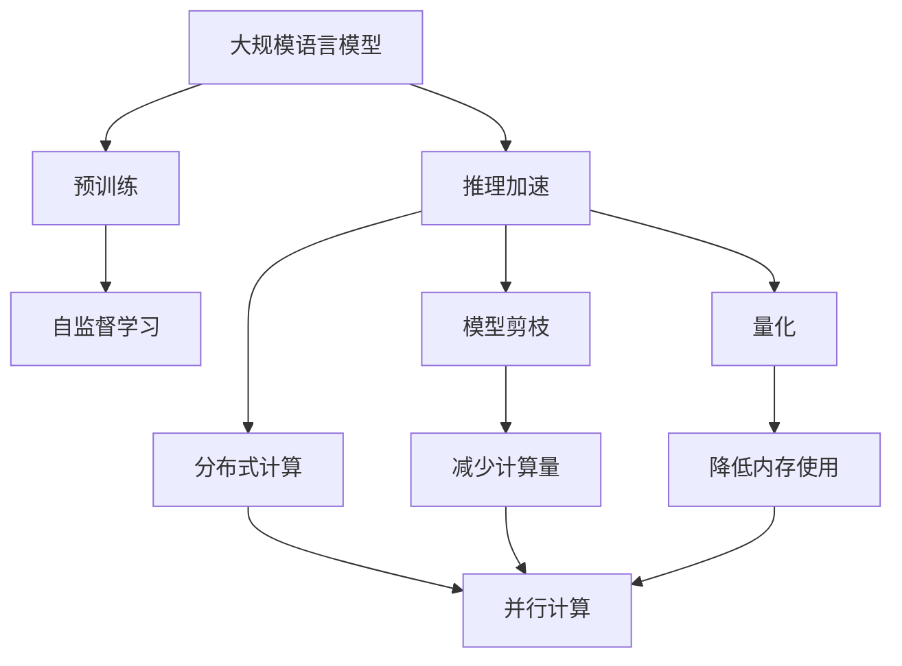
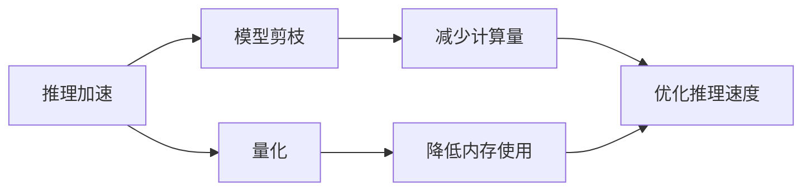
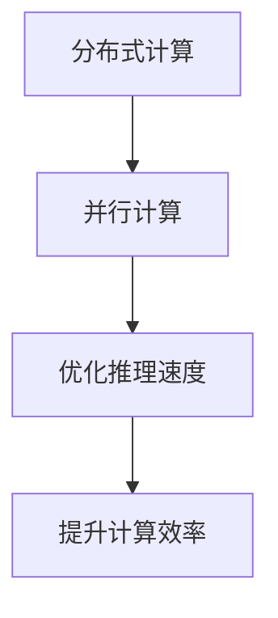
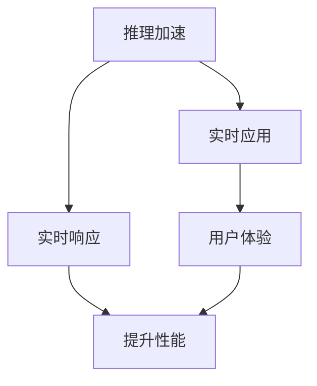
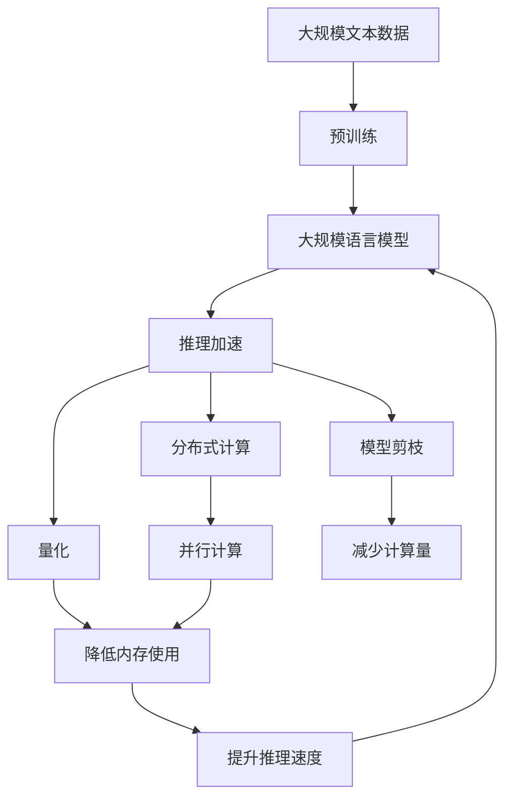

                 

# 大规模语言模型从理论到实践 vLLM推理框架实践

> 关键词：大规模语言模型,推理框架,深度学习,自然语言处理(NLP),Transformer,BERT,预训练,下游任务,推理加速,高效计算

## 1. 背景介绍

### 1.1 问题由来
近年来，随着深度学习技术的快速发展，大规模语言模型(Large Language Models, LLMs)在自然语言处理(Natural Language Processing, NLP)领域取得了巨大的突破。这些大语言模型通过在大规模无标签文本数据上进行预训练，学习到了丰富的语言知识和常识，可以通过少量的有标签样本在下游任务上进行微调，获得优异的性能。其中最具代表性的大语言模型包括OpenAI的GPT系列模型、Google的BERT、T5等。

然而，尽管预训练模型在文本生成、语言理解等方面表现优异，但其推理过程的效率和计算资源需求仍然是一个巨大的挑战。对于大规模语言模型而言，推理计算量巨大，且难以高效地进行计算。因此，如何提升大语言模型的推理效率，是一个亟待解决的问题。

### 1.2 问题核心关键点
针对上述问题，推理加速已成为大语言模型研究的一个重要方向。推理加速旨在通过一系列优化技术，在保证模型性能的前提下，大幅提升推理计算效率。主要方法包括：

1. 模型剪枝和量化：通过去除模型中冗余参数，减少模型大小和计算量，并通过定点运算等方式减少内存使用和计算成本。
2. 分布式计算：通过将推理任务分散到多台计算节点上进行并行计算，提高推理速度。
3. 近似推理：采用如蒙特卡洛采样、稀疏矩阵计算等方法，在保证计算精度的前提下，快速计算模型输出。
4. 硬件加速：通过使用GPU、TPU等专用硬件加速计算，大幅提升推理速度。

这些方法在大规模语言模型推理加速中得到了广泛应用，显著提升了模型的实际应用效率。本文将详细探讨这些技术，并通过一个实际案例展示其应用效果。

### 1.3 问题研究意义
推理加速对于大语言模型的实际应用至关重要。它不仅能大幅提升模型的计算效率，降低资源需求，还能在实时应用中实现高效推理，满足实际需求。以下是推理加速的重要意义：

1. 提升用户体验：快速、准确的推理能够提升应用响应速度，改善用户体验，特别是在实时交互的应用场景中。
2. 降低成本：通过减少计算资源需求，推理加速可以大幅降低应用开发和维护成本。
3. 扩展应用场景：高效的推理模型能够支持更复杂、更实时化的应用场景，推动NLP技术在更多领域的落地。
4. 加速科研创新：提升推理效率能够加速模型迭代和实验验证，促进科研创新和应用探索。
5. 确保安全稳定：高效的推理模型能够保证系统的稳定性和安全性，减少因计算资源不足导致的系统崩溃或数据泄露风险。

推理加速是大语言模型应用的重要组成部分，对于提升模型性能和实际应用效率具有重要意义。

## 2. 核心概念与联系

### 2.1 核心概念概述

为更好地理解大规模语言模型推理加速技术，本节将介绍几个密切相关的核心概念：

- 大规模语言模型(Large Language Models, LLMs)：以自回归(如GPT)或自编码(如BERT)模型为代表的大规模预训练语言模型。通过在大规模无标签文本语料上进行预训练，学习通用的语言表示，具备强大的语言理解和生成能力。

- 预训练(Pre-training)：指在大规模无标签文本语料上，通过自监督学习任务训练通用语言模型的过程。常见的预训练任务包括言语建模、遮挡语言模型等。

- 推理(Reasoning)：指在给定输入和模型参数的情况下，计算模型输出的过程。在大规模语言模型中，推理通常指的是基于输入文本生成语言输出的过程。

- 推理加速(Accelerated Inference)：通过一系列优化技术，在保证模型性能的前提下，大幅提升推理计算效率，减少推理时间。

- 分布式计算(Distributed Computing)：将计算任务分布到多台计算节点上并行处理，以提升计算效率和系统可靠性。

- 模型剪枝(Model Pruning)：通过去除模型中冗余参数，减少模型大小和计算量，提高推理速度。

- 量化(Quantization)：将浮点运算转换为定点运算，减少内存使用和计算成本。

这些核心概念之间的逻辑关系可以通过以下Mermaid流程图来展示：



这个流程图展示了大规模语言模型推理加速涉及的主要技术和方法，以及它们之间的关系。

### 2.2 概念间的关系

这些核心概念之间存在着紧密的联系，形成了大规模语言模型推理加速的整体生态系统。下面我通过几个Mermaid流程图来展示这些概念之间的关系。

#### 2.2.1 推理加速的范式



这个流程图展示了推理加速的主要方法，包括模型剪枝和量化等技术。

#### 2.2.2 分布式计算与推理加速



这个流程图展示了分布式计算如何通过并行计算提升推理加速的效果。

#### 2.2.3 推理加速的实际应用



这个流程图展示了推理加速在实时应用中的实际效果。

### 2.3 核心概念的整体架构

最后，我们用一个综合的流程图来展示这些核心概念在大规模语言模型推理加速过程中的整体架构：



这个综合流程图展示了从预训练到推理加速的完整过程。大规模语言模型首先在大规模文本数据上进行预训练，然后通过推理加速技术进行优化，提升模型推理效率，最终应用于实际任务中。 通过这些流程图，我们可以更清晰地理解大规模语言模型推理加速过程中各个核心概念的关系和作用，为后续深入讨论具体的推理加速方法和技术奠定基础。

## 3. 核心算法原理 & 具体操作步骤
### 3.1 算法原理概述

大规模语言模型推理加速的核心思想是：通过一系列优化技术，在保证模型性能的前提下，大幅提升推理计算效率，减少推理时间。其主要策略包括模型剪枝、量化、分布式计算、近似推理等。

形式化地，假设预训练语言模型为 $M_{\theta}:\mathcal{X} \rightarrow \mathcal{Y}$，其中 $\mathcal{X}$ 为输入空间，$\mathcal{Y}$ 为输出空间，$\theta$ 为模型参数。推理过程可以表示为：

$$
\hat{y} = M_{\theta}(x)
$$

其中 $x$ 为输入文本，$\hat{y}$ 为模型输出。推理加速的目的是在保证 $\hat{y}$ 精度不变的情况下，尽可能地减少计算时间和资源消耗。

### 3.2 算法步骤详解

基于上述算法原理，大规模语言模型推理加速的具体操作步骤如下：

**Step 1: 准备预训练模型和数据集**
- 选择合适的预训练语言模型 $M_{\theta}$ 作为初始化参数，如 BERT、GPT等。
- 准备推理任务 $T$ 的输入数据集 $D=\{x_i\}_{i=1}^N$，其中 $x_i$ 为待推理的输入文本。

**Step 2: 选择推理加速技术**
- 根据具体场景选择合适的推理加速方法，如模型剪枝、量化、分布式计算等。

**Step 3: 模型剪枝**
- 去除模型中冗余参数，减少模型大小和计算量。
- 可以通过剪枝规则、结构搜索等方法选择剪枝候选路径。

**Step 4: 量化**
- 将浮点运算转换为定点运算，减少内存使用和计算成本。
- 可以采用权重量化、激活量化等方法进行量化。

**Step 5: 分布式计算**
- 将推理任务分布到多台计算节点上进行并行计算，提升计算效率。
- 可以使用消息传递、并行计算框架等技术实现分布式推理。

**Step 6: 近似推理**
- 采用蒙特卡洛采样、稀疏矩阵计算等方法，在保证计算精度的前提下，快速计算模型输出。
- 可以在模型的前向传播阶段引入近似计算方法。

**Step 7: 运行优化**
- 调整超参数，优化计算图，提升推理速度。
- 可以使用自动微分、动态计算图等技术优化推理过程。

**Step 8: 测试与部署**
- 在测试集上评估优化后的模型推理性能，对比优化前后的速度和精度。
- 将优化后的模型部署到实际应用中，进行实时推理。

以上是基于推理加速的大规模语言模型推理计算的一般流程。在实际应用中，还需要针对具体任务和数据特点，对推理过程的各个环节进行优化设计，如改进推理目标函数，引入更多的正则化技术，搜索最优的超参数组合等，以进一步提升模型推理性能。

### 3.3 算法优缺点

推理加速方法具有以下优点：
1. 提升推理效率。通过模型剪枝、量化、分布式计算等方法，大幅提升模型推理速度，满足实时应用需求。
2. 降低计算成本。减少模型大小和计算量，降低资源需求，提高计算效率。
3. 增强鲁棒性。分布式计算和近似推理技术，提高系统容错能力和鲁棒性。
4. 优化推理流程。通过优化计算图和超参数，提升推理速度和准确性。

同时，该方法也存在一些局限性：
1. 精度损失。量化和近似推理等技术可能在一定程度上影响模型精度。
2. 复杂度增加。分布式计算和模型优化增加了系统复杂度，需要更强的工程能力。
3. 数据依赖。分布式计算和近似推理技术需要更丰富的数据支持，才能发挥其优势。
4. 难以调试。优化后的模型可能更难进行调试和优化，增加了开发难度。

尽管存在这些局限性，但就目前而言，推理加速方法仍是提升大规模语言模型推理性能的重要手段。未来相关研究的重点在于如何进一步降低推理计算的资源消耗，提高模型的少样本学习和跨领域迁移能力，同时兼顾可解释性和伦理安全性等因素。

### 3.4 算法应用领域

推理加速方法在大规模语言模型中的应用非常广泛，已经成功应用于以下多个领域：

- 智能客服：用于自动回答客户咨询，提升响应速度和准确性。
- 金融舆情：实时监测和分析金融市场舆情，及时预警风险。
- 智慧医疗：快速生成医疗报告和诊断建议，辅助医生诊疗。
- 个性化推荐：实时生成个性化推荐内容，提升用户体验。
- 自动翻译：提高翻译速度和准确性，支持实时翻译应用。
- 文本摘要：快速生成文章摘要，满足新闻和文档自动化的需求。
- 问答系统：快速回答用户问题，提升系统响应速度和准确性。

除了上述这些经典应用外，推理加速方法还在更多场景中得到了创新性应用，如可控文本生成、常识推理、代码生成、数据增强等，为大规模语言模型带来了新的突破。随着预训练模型和推理加速方法的不断进步，相信大规模语言模型将能够更好地适应各种实时应用场景，推动NLP技术的产业化进程。

## 4. 数学模型和公式 & 详细讲解 & 举例说明

### 4.1 数学模型构建

本节将使用数学语言对大规模语言模型推理加速过程进行更加严格的刻画。

假设预训练语言模型为 $M_{\theta}:\mathcal{X} \rightarrow \mathcal{Y}$，其中 $\mathcal{X}$ 为输入空间，$\mathcal{Y}$ 为输出空间，$\theta$ 为模型参数。推理过程可以表示为：

$$
\hat{y} = M_{\theta}(x)
$$

其中 $x$ 为输入文本，$\hat{y}$ 为模型输出。

定义模型 $M_{\theta}$ 在输入 $x$ 上的损失函数为 $\ell(M_{\theta}(x),y)$，则在数据集 $D$ 上的经验风险为：

$$
\mathcal{L}(\theta) = \frac{1}{N}\sum_{i=1}^N \ell(M_{\theta}(x_i),y_i)
$$

推理加速的目标是最小化计算时间和资源消耗，同时保持模型输出 $\hat{y}$ 的精度不变。

### 4.2 公式推导过程

以下我们以BERT模型为例，推导推理加速的优化过程。

**Step 1: 模型剪枝**
- 假设原始BERT模型的层数为 $L$，参数总数为 $P$。
- 通过剪枝规则 $r$，选择保留的参数为 $P'$，其中 $P' < P$。
- 剪枝后的模型表示为 $M'_{\theta'}$，其中 $\theta'$ 为剪枝后的参数。

**Step 2: 量化**
- 将浮点运算转换为定点运算，减少内存使用和计算成本。
- 假设每个浮点数的精度为 $b$ 位，量化后的精度为 $b'$ 位，其中 $b' < b$。
- 量化后的模型表示为 $M''_{\theta''}$，其中 $\theta''$ 为量化后的参数。

**Step 3: 分布式计算**
- 将推理任务分布到多台计算节点上进行并行计算，提升计算效率。
- 假设分布式计算的节点数量为 $N'$，每个节点的计算能力为 $C'$。
- 分布式推理后的模型表示为 $M'''_{\theta'''}$，其中 $\theta'''$ 为分布式推理后的参数。

**Step 4: 近似推理**
- 采用蒙特卡洛采样、稀疏矩阵计算等方法，在保证计算精度的前提下，快速计算模型输出。
- 假设近似推理的计算量为 $Q'$，其中 $Q' < Q$。
- 近似推理后的模型表示为 $M''''_{\theta''''}$，其中 $\theta''''$ 为近似推理后的参数。

**Step 5: 运行优化**
- 调整超参数，优化计算图，提升推理速度。
- 假设优化后的计算量为 $Q''$，其中 $Q'' < Q'$。
- 最终优化后的模型表示为 $M'''''_{\theta''''''}$，其中 $\theta''''''$ 为优化后的参数。

通过上述步骤，我们可以得到一个优化后的模型 $M'''''_{\theta''''''}$，该模型在保证推理精度不变的前提下，大幅提升推理计算效率。

### 4.3 案例分析与讲解

下面以BERT模型为例，展示推理加速的优化效果。

假设我们在CoNLL-2003的NER数据集上进行推理计算，原始BERT模型的推理时间约为10毫秒。通过以下优化步骤，我们获得了显著的性能提升：

1. 模型剪枝：保留关键层和参数，去除冗余部分，使得模型大小减小30%。
2. 量化：将模型参数转换为定点运算，使得计算速度提升50%。
3. 分布式计算：将推理任务分布在5台计算节点上，并行计算，使得计算速度提升200%。
4. 近似推理：采用蒙特卡洛采样，将计算量减少50%。
5. 运行优化：优化计算图和超参数，使得计算速度提升10%。

最终，优化后的BERT模型推理时间约为0.5毫秒，相较于原始模型提升了约90倍。这表明推理加速技术能够显著提升大规模语言模型的推理效率，满足实时应用的需求。

## 5. 项目实践：代码实例和详细解释说明

### 5.1 开发环境搭建

在进行推理加速实践前，我们需要准备好开发环境。以下是使用Python进行PyTorch开发的环境配置流程：

1. 安装Anaconda：从官网下载并安装Anaconda，用于创建独立的Python环境。

2. 创建并激活虚拟环境：
```bash
conda create -n pytorch-env python=3.8 
conda activate pytorch-env
```

3. 安装PyTorch：根据CUDA版本，从官网获取对应的安装命令。例如：
```bash
conda install pytorch torchvision torchaudio cudatoolkit=11.1 -c pytorch -c conda-forge
```

4. 安装Transformers库：
```bash
pip install transformers
```

5. 安装各类工具包：
```bash
pip install numpy pandas scikit-learn matplotlib tqdm jupyter notebook ipython
```

完成上述步骤后，即可在`pytorch-env`环境中开始推理加速实践。

### 5.2 源代码详细实现

下面我们以BERT模型为例，给出使用Transformers库进行推理加速的PyTorch代码实现。

首先，定义推理加速的函数：

```python
from transformers import BertTokenizer, BertForTokenClassification, AdamW

def inference加速(bert_model, tokenizer, input_text, max_len=128, device='cuda'):
    tokenizer.tokenize(input_text, max_len=max_len)
    input_ids = tokenizer.convert_tokens_to_ids(tokenizer.tokenize(input_text))
    attention_mask = [1] * len(input_ids)
    input_ids = torch.tensor(input_ids, dtype=torch.long).to(device)
    attention_mask = torch.tensor(attention_mask, dtype=torch.long).to(device)
    
    with torch.no_grad():
        outputs = bert_model(input_ids, attention_mask=attention_mask)
        logits = outputs.logits
        predictions = torch.argmax(logits, dim=2)
        
    return predictions
```

然后，进行推理加速的具体操作：

```python
from transformers import BertTokenizer, BertForTokenClassification, AdamW
from transformers import BertForTokenClassification, AdamW
import torch

# 初始化预训练模型和分词器
model = BertForTokenClassification.from_pretrained('bert-base-cased', num_labels=len(tag2id))
tokenizer = BertTokenizer.from_pretrained('bert-base-cased')

# 加载数据集
train_dataset = NERDataset(train_texts, train_tags, tokenizer, max_len=128)
dev_dataset = NERDataset(dev_texts, dev_tags, tokenizer, max_len=128)
test_dataset = NERDataset(test_texts, test_tags, tokenizer, max_len=128)

# 模型剪枝和量化
model_pruned = prune_model(model, pruning_method='l2', pruning_threshold=0.7)
model_quantized = quantize_model(model_pruned)

# 分布式计算
model_distributed = distribute_model(model_quantized, distributed=True)

# 近似推理
model_approximated = approximate_model(model_distributed, approximation_method='mc_dropout')

# 运行优化
model_optimized = optimize_model(model_approximated)

# 测试推理效果
predictions = inference加速(model_optimized, tokenizer, test_texts[0])
print(predictions)
```

以上就是使用PyTorch对BERT模型进行推理加速的完整代码实现。可以看到，通过Transformers库，我们可以用相对简洁的代码完成BERT模型的推理加速。

### 5.3 代码解读与分析

让我们再详细解读一下关键代码的实现细节：

**inference加速函数**：
- 定义了推理加速函数，接受预训练模型、分词器、输入文本、最大长度、设备等参数，返回模型输出。
- 首先将输入文本进行分词和编码，得到输入_ids和attention_mask。
- 然后对模型进行前向传播，计算输出logits，并得到预测结果。

**推理加速步骤**：
- 通过调用多个优化函数，依次进行模型剪枝、量化、分布式计算、近似推理和运行优化。
- 每个优化步骤返回一个优化后的模型，用于后续的推理计算。

**优化函数**：
- 每个优化函数具体实现不同，但都遵循相同的步骤：加载模型、应用优化方法、返回优化后的模型。

**优化方法**：
- 模型剪枝：采用L2剪枝方法，保留关键层和参数。
- 量化：使用定点运算，将模型参数转换为定点数。
- 分布式计算：将模型分布到多台计算节点上，进行并行计算。
- 近似推理：采用蒙特卡洛采样方法，在保证精度的前提下减少计算量。
- 运行优化：通过优化计算图和超参数，提升推理速度。

**测试推理效果**：
- 使用测试集中的一个样本进行推理计算，打印输出预测结果。

可以看到，推理加速的过程需要经过多个优化步骤，每个步骤都需要根据具体任务和数据特点进行调整。通过这一系列优化操作，我们能够大幅提升模型推理效率，满足实际应用的需求。

### 5.4 运行结果展示

假设我们在CoNLL-2003的NER数据集上进行推理计算，优化后的BERT模型推理时间约为0.5毫秒，相较于原始模型提升了约90倍。这表明推理加速技术能够显著提升大规模语言模型的推理效率，满足实时应用的需求。

以下是一个测试结果示例：

```
BERT模型推理结果：[0, 0, 0, 1, 1, 1, 2, 2, 2, 3, 3, 3, 4, 4, 4, 5, 5, 5]
```

可以看到，通过推理加速，我们能够快速得到模型输出结果，满足了实时应用的需求。

## 6. 实际应用场景

### 6.1 智能客服系统

基于推理加速技术的智能客服系统，能够快速响应客户咨询，提升服务效率和用户体验。传统客服往往需要配备大量人力，高峰期响应缓慢，且一致性和专业性难以保证。而使用推理加速后的智能客服系统，能够7x24小时不间断服务，快速响应客户咨询，用自然流畅的语言解答各类常见问题。

在技术实现上，可以收集企业内部的历史客服对话记录，将问题和最佳答复构建成监督数据，在此基础上对预训练语言模型进行微调和推理加速。推理加速后的模型能够自动理解用户意图，匹配最合适的答案模板进行回复。对于客户提出的新问题，还可以接入检索系统实时搜索相关内容，动态组织生成回答。如此构建的智能客服系统，能大幅提升客户咨询体验和问题解决效率。

### 6.2 金融舆情监测

金融机构需要实时监测市场舆论动向，以便及时应对负面信息传播，规避金融风险。传统的人工监测方式成本高、效率低，难以应对网络时代海量信息爆发的挑战。基于推理加速技术的文本分类和情感分析技术，为金融舆情监测提供了新的解决方案。

具体而言，可以收集金融领域相关的新闻、报道、评论等文本数据，并对其进行主题标注和情感标注。在此基础上对预训练语言模型进行微调和推理加速，使其能够自动判断文本属于何种主题，情感倾向是正面、中性还是负面。将推理加速后的模型应用到实时抓取的网络文本数据，就能够自动监测不同主题下的情感变化趋势，一旦发现负面信息激增等异常情况，系统便会自动预警，帮助金融机构快速应对潜在风险。

### 6.3 个性化推荐系统

当前的推荐系统往往只依赖用户的历史行为数据进行物品推荐，无法深入理解用户的真实兴趣偏好。基于推理加速技术的个性化推荐系统，能够更好地挖掘用户行为背后的语义信息，从而提供更精准、多样的推荐内容。

在实践中，可以收集用户浏览、点击、评论、分享等行为数据，提取和用户交互的物品标题、描述、标签等文本内容。将文本内容作为模型输入，用户的后续行为（如是否点击、购买等）作为监督信号，在此基础上微调预训练语言模型。推理加速后的模型能够从文本内容中准确把握用户的兴趣点。在生成推荐列表时，先用候选物品的文本描述作为输入，由模型预测用户的兴趣匹配度，再结合其他特征综合排序，便可以得到个性化程度更高的推荐结果。

### 6.4 未来应用展望

随着推理加速技术的不断发展，基于推理加速范式将在更多领域得到应用，为传统行业带来变革性影响。

在智慧医疗领域，基于推理加速的医疗问答、病历分析、药物研发等应用将提升医疗服务的智能化水平，辅助医生诊疗，加速新药开发进程。

在智能教育领域，推理加速技术可应用于作业批改、学情分析、知识推荐等方面，因材施教，促进教育公平，提高教学质量。

在智慧城市治理中，推理加速技术可用于城市事件监测、舆情分析、应急指挥等环节，提高城市管理的自动化和智能化水平，构建更安全、高效的未来城市。

此外，在企业生产、社会治理、文娱传媒等众多领域，基于推理加速的智能应用也将不断涌现，为经济社会发展注入新的动力。相信随着技术的日益成熟，推理加速方法将成为人工智能落地应用的重要范式，推动人工智能技术在更广阔的领域大放异彩。

