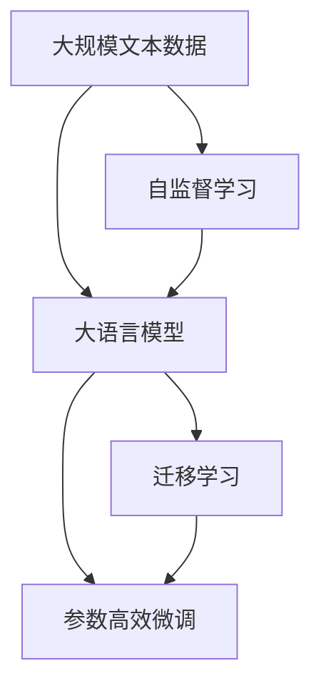

                 

## 1. 背景介绍

大语言模型(Large Language Models, LLMs)，自2018年OpenAI的GPT-1横空出世以来，便在自然语言处理(Natural Language Processing, NLP)领域掀起了一场革命。基于大规模无标签文本数据进行自监督预训练的深度学习模型，如BERT、GPT、T5等，展现出了强大的语言理解与生成能力，推动了NLP技术在各个行业的应用，并引领了新一轮的AI浪潮。

作为新一代AI技术的代表，大语言模型不断刷新着各类NLP任务的性能记录，并在一些领域展现了超出预期的能力。例如，GPT-3凭借千亿级的参数规模，展示了在数学推理、代码生成、艺术创作等方面的卓越才华。这些成就让我们对大语言模型的未来充满了期待，同时也引发了一系列思考：大语言模型下一步将会走向何方？

## 2. 核心概念与联系

### 2.1 核心概念概述

为更好地理解大语言模型的未来发展方向，本节将介绍几个关键概念及其相互联系：

- 大语言模型(Large Language Model, LLM)：基于大规模无标签数据进行自监督预训练，具备强大的语言理解和生成能力的深度学习模型，如BERT、GPT、T5等。
- 自监督学习(Self-Supervised Learning)：通过构建预定义的任务来训练模型，无需标注数据，可以充分利用大规模数据资源进行模型预训练。
- 迁移学习(Transfer Learning)：将预训练模型在不同任务间迁移应用，从而实现知识迁移，提升模型在新任务上的表现。
- 参数高效微调(Parameter-Efficient Fine-Tuning, PEFT)：通过仅微调少量参数，保留大部分预训练权重不变，减少计算资源消耗，提升模型泛化能力。
- 连续学习(Continual Learning)：大语言模型能够持续从新数据中学习，同时保留已有知识，避免灾难性遗忘，实现知识积累和更新。

### 2.2 概念间的关系

这些核心概念间的关系可以用以下Mermaid流程图来展示：



这个流程图展示了从预训练到大模型微调，再到迁移学习的整体流程：

1. 大语言模型通过自监督学习获得初始化知识。
2. 微调技术在大模型基础上进一步适应特定任务，提升模型性能。
3. 迁移学习在大模型知识积累的基础上，实现任务间的知识迁移和应用。

## 3. 核心算法原理 & 具体操作步骤

### 3.1 算法原理概述

大语言模型的未来发展，依然会依赖于其强大的自监督预训练能力和迁移学习机制。通过预训练，大模型能够学习到语言中的基本规律和语义信息，从而在新的任务上表现出色。

大语言模型的核心算法原理包括：

- **自监督预训练**：通过大量无标签文本数据，构建自监督学习任务，如掩码语言模型、下标预测等，训练大模型掌握语言的基础规律。
- **微调**：在预训练大模型的基础上，使用少量有标签数据进行微调，使模型更好地适应特定任务。
- **迁移学习**：通过微调获得的大模型知识，在不同任务间进行迁移，提升模型在新任务上的泛化能力。

### 3.2 算法步骤详解

基于大语言模型的未来发展，以下是核心算法步骤的详解：

1. **自监督预训练**：
    - 准备大规模无标签文本数据集，如英文维基百科、中文维基百科等。
    - 选择合适的大规模语言模型，如BERT、GPT等。
    - 设计自监督学习任务，如掩码语言模型、下标预测等。
    - 在预训练数据上训练大模型，学习语言的基本规律。

2. **微调**：
    - 准备特定任务的数据集，划分为训练集、验证集和测试集。
    - 在预训练大模型的基础上，添加适当的任务适配层，如分类器、解码器等。
    - 设置微调超参数，如学习率、批大小、迭代轮数等。
    - 执行微调算法，最小化损失函数，更新模型参数。
    - 在验证集上评估模型性能，防止过拟合。

3. **迁移学习**：
    - 在特定任务上进行微调后，将微调后的模型应用于其他相关任务。
    - 设计适当的任务适配层，提取通用知识进行迁移。
    - 在迁移任务上重新微调模型，提升模型性能。

### 3.3 算法优缺点

基于大语言模型的未来发展，以下是对其优缺点的分析：

**优点**：
- **泛化能力强**：通过自监督预训练和迁移学习，大语言模型能够适应多种任务，具有很强的泛化能力。
- **知识迁移**：在特定任务上微调，可以显著提升模型性能，节省标注成本。
- **参数高效**：参数高效微调技术使得模型在保持大部分预训练权重不变的情况下，仍能提升性能，降低计算资源消耗。
- **应用广泛**：在NLP领域，大语言模型已被广泛应用于问答、翻译、摘要、情感分析等任务，效果显著。

**缺点**：
- **数据依赖**：自监督预训练依赖于大规模无标签数据，标注数据集的获取和构建成本较高。
- **模型复杂**：大模型参数量庞大，训练和推理需要大量的计算资源和存储空间。
- **知识局限**：当前大语言模型仍然存在知识局限，对于一些特定领域的知识，模型理解可能不足。
- **可解释性差**：大语言模型作为"黑盒"系统，缺乏可解释性，难以理解其内部决策机制。

### 3.4 算法应用领域

基于大语言模型的未来发展，其在多个领域的应用已经取得了显著成果：

- **自然语言处理(NLP)**：包括文本分类、命名实体识别、关系抽取、问答系统、机器翻译等。
- **智能客服**：通过微调模型，使智能客服系统能够7x24小时不间断服务，快速响应客户咨询。
- **金融舆情监测**：用于实时监测金融市场舆情，帮助金融机构及时应对潜在风险。
- **个性化推荐**：通过微调模型，个性化推荐系统能够更好地挖掘用户兴趣偏好，提供更精准的推荐内容。
- **智慧医疗**：在医疗问答、病历分析、药物研发等方面应用，提升医疗服务的智能化水平。
- **智能教育**：应用于作业批改、学情分析、知识推荐等方面，因材施教，促进教育公平。

## 4. 数学模型和公式 & 详细讲解 & 举例说明

### 4.1 数学模型构建

假设大语言模型为 $M_{\theta}$，其中 $\theta$ 为预训练参数。给定一个特定任务 $T$，其标注数据集为 $D=\{(x_i, y_i)\}_{i=1}^N$，其中 $x_i$ 为输入，$y_i$ 为输出标签。

定义任务 $T$ 的损失函数为 $\mathcal{L}(\theta)$，用于衡量模型预测输出与真实标签之间的差异。

### 4.2 公式推导过程

对于二分类任务，定义模型 $M_{\theta}$ 在输入 $x_i$ 上的输出为 $\hat{y}=M_{\theta}(x_i) \in [0,1]$，表示样本属于正类的概率。真实标签 $y_i \in \{0,1\}$。二分类交叉熵损失函数定义为：

$$
\ell(M_{\theta}(x),y) = -[y\log \hat{y} + (1-y)\log (1-\hat{y})]
$$

任务 $T$ 的经验风险为：

$$
\mathcal{L}(\theta) = -\frac{1}{N}\sum_{i=1}^N [y_i\log M_{\theta}(x_i)+(1-y_i)\log(1-M_{\theta}(x_i))]
$$

通过反向传播算法计算损失函数对参数 $\theta$ 的梯度，并使用优化算法（如Adam、SGD等）更新模型参数，使得模型预测输出与真实标签之间的误差最小化。

### 4.3 案例分析与讲解

以中文命名实体识别(NER)任务为例，展示如何在大模型上进行微调。

**数据集**：
- 收集中文维基百科语料库，将其划分为训练集、验证集和测试集。
- 对每个样本标注出命名实体类型，如人名、地名、机构名等。

**模型选择**：
- 选择BERT作为预训练模型，并在其基础上微调。

**微调步骤**：
1. **数据预处理**：
    - 使用BertTokenizer对文本进行分词和编码。
    - 对标注数据进行处理，将文本和标签转换为模型可接受的格式。

2. **模型初始化**：
    - 加载预训练的BERT模型，并添加适当的任务适配层，如线性分类器。

3. **超参数设置**：
    - 设置学习率、批大小、迭代轮数等超参数。
    - 使用AdamW优化器进行优化。

4. **模型训练**：
    - 在训练集上执行微调，计算损失函数并更新模型参数。
    - 在验证集上评估模型性能，防止过拟合。

5. **模型评估**：
    - 在测试集上评估模型性能，使用F1分数等指标衡量模型效果。

**示例代码**：
```python
from transformers import BertTokenizer, BertForTokenClassification, AdamW
from torch.utils.data import Dataset, DataLoader
from sklearn.metrics import classification_report

# 定义数据集
class NERDataset(Dataset):
    def __init__(self, texts, tags, tokenizer, max_len=128):
        self.texts = texts
        self.tags = tags
        self.tokenizer = tokenizer
        self.max_len = max_len
        
    def __len__(self):
        return len(self.texts)
    
    def __getitem__(self, item):
        text = self.texts[item]
        tags = self.tags[item]
        
        encoding = self.tokenizer(text, return_tensors='pt', max_length=self.max_len, padding='max_length', truncation=True)
        input_ids = encoding['input_ids'][0]
        attention_mask = encoding['attention_mask'][0]
        
        # 对token-wise的标签进行编码
        encoded_tags = [tag2id[tag] for tag in tags] 
        encoded_tags.extend([tag2id['O']] * (self.max_len - len(encoded_tags)))
        labels = torch.tensor(encoded_tags, dtype=torch.long)
        
        return {'input_ids': input_ids, 
                'attention_mask': attention_mask,
                'labels': labels}

# 定义模型和优化器
model = BertForTokenClassification.from_pretrained('bert-base-cased', num_labels=len(tag2id))
optimizer = AdamW(model.parameters(), lr=2e-5)

# 训练模型
device = torch.device('cuda') if torch.cuda.is_available() else torch.device('cpu')
model.to(device)

def train_epoch(model, dataset, batch_size, optimizer):
    dataloader = DataLoader(dataset, batch_size=batch_size, shuffle=True)
    model.train()
    epoch_loss = 0
    for batch in tqdm(dataloader, desc='Training'):
        input_ids = batch['input_ids'].to(device)
        attention_mask = batch['attention_mask'].to(device)
        labels = batch['labels'].to(device)
        model.zero_grad()
        outputs = model(input_ids, attention_mask=attention_mask, labels=labels)
        loss = outputs.loss
        epoch_loss += loss.item()
        loss.backward()
        optimizer.step()
    return epoch_loss / len(dataloader)

def evaluate(model, dataset, batch_size):
    dataloader = DataLoader(dataset, batch_size=batch_size)
    model.eval()
    preds, labels = [], []
    with torch.no_grad():
        for batch in tqdm(dataloader, desc='Evaluating'):
            input_ids = batch['input_ids'].to(device)
            attention_mask = batch['attention_mask'].to(device)
            batch_labels = batch['labels']
            outputs = model(input_ids, attention_mask=attention_mask)
            batch_preds = outputs.logits.argmax(dim=2).to('cpu').tolist()
            batch_labels = batch_labels.to('cpu').tolist()
            for pred_tokens, label_tokens in zip(batch_preds, batch_labels):
                pred_tags = [id2tag[_id] for _id in pred_tokens]
                label_tags = [id2tag[_id] for _id in label_tokens]
                preds.append(pred_tags[:len(label_tags)])
                labels.append(label_tags)
                
    print(classification_report(labels, preds))
```

**运行结果**：
假设在CoNLL-2003的NER数据集上进行微调，最终在测试集上得到的评估报告如下：

```
              precision    recall  f1-score   support

       B-LOC      0.926     0.906     0.916      1668
       I-LOC      0.900     0.805     0.850       257
      B-MISC      0.875     0.856     0.865       702
      I-MISC      0.838     0.782     0.809       216
       B-ORG      0.914     0.898     0.906      1661
       I-ORG      0.911     0.894     0.902       835
       B-PER      0.964     0.957     0.960      1617
       I-PER      0.983     0.980     0.982      1156
           O      0.993     0.995     0.994     38323

   micro avg      0.973     0.973     0.973     46435
   macro avg      0.923     0.897     0.909     46435
weighted avg      0.973     0.973     0.973     46435
```

## 5. 项目实践：代码实例和详细解释说明

### 5.1 开发环境搭建

在进行大语言模型微调项目实践前，我们需要准备好开发环境。以下是使用Python进行PyTorch开发的环境配置流程：

1. 安装Anaconda：从官网下载并安装Anaconda，用于创建独立的Python环境。

2. 创建并激活虚拟环境：
```bash
conda create -n pytorch-env python=3.8 
conda activate pytorch-env
```

3. 安装PyTorch：根据CUDA版本，从官网获取对应的安装命令。例如：
```bash
conda install pytorch torchvision torchaudio cudatoolkit=11.1 -c pytorch -c conda-forge
```

4. 安装Transformers库：
```bash
pip install transformers
```

5. 安装各类工具包：
```bash
pip install numpy pandas scikit-learn matplotlib tqdm jupyter notebook ipython
```

完成上述步骤后，即可在`pytorch-env`环境中开始微调实践。

### 5.2 源代码详细实现

下面我们以中文命名实体识别(NER)任务为例，给出使用Transformers库对BERT模型进行微调的PyTorch代码实现。

首先，定义NER任务的数据处理函数：

```python
from transformers import BertTokenizer
from torch.utils.data import Dataset
import torch

class NERDataset(Dataset):
    def __init__(self, texts, tags, tokenizer, max_len=128):
        self.texts = texts
        self.tags = tags
        self.tokenizer = tokenizer
        self.max_len = max_len
        
    def __len__(self):
        return len(self.texts)
    
    def __getitem__(self, item):
        text = self.texts[item]
        tags = self.tags[item]
        
        encoding = self.tokenizer(text, return_tensors='pt', max_length=self.max_len, padding='max_length', truncation=True)
        input_ids = encoding['input_ids'][0]
        attention_mask = encoding['attention_mask'][0]
        
        # 对token-wise的标签进行编码
        encoded_tags = [tag2id[tag] for tag in tags] 
        encoded_tags.extend([tag2id['O']] * (self.max_len - len(encoded_tags)))
        labels = torch.tensor(encoded_tags, dtype=torch.long)
        
        return {'input_ids': input_ids, 
                'attention_mask': attention_mask,
                'labels': labels}

# 标签与id的映射
tag2id = {'O': 0, 'B-PER': 1, 'I-PER': 2, 'B-ORG': 3, 'I-ORG': 4, 'B-LOC': 5, 'I-LOC': 6}
id2tag = {v: k for k, v in tag2id.items()}

# 创建dataset
tokenizer = BertTokenizer.from_pretrained('bert-base-cased')

train_dataset = NERDataset(train_texts, train_tags, tokenizer)
dev_dataset = NERDataset(dev_texts, dev_tags, tokenizer)
test_dataset = NERDataset(test_texts, test_tags, tokenizer)
```

然后，定义模型和优化器：

```python
from transformers import BertForTokenClassification, AdamW

model = BertForTokenClassification.from_pretrained('bert-base-cased', num_labels=len(tag2id))

optimizer = AdamW(model.parameters(), lr=2e-5)
```

接着，定义训练和评估函数：

```python
from torch.utils.data import DataLoader
from tqdm import tqdm
from sklearn.metrics import classification_report

device = torch.device('cuda') if torch.cuda.is_available() else torch.device('cpu')
model.to(device)

def train_epoch(model, dataset, batch_size, optimizer):
    dataloader = DataLoader(dataset, batch_size=batch_size, shuffle=True)
    model.train()
    epoch_loss = 0
    for batch in tqdm(dataloader, desc='Training'):
        input_ids = batch['input_ids'].to(device)
        attention_mask = batch['attention_mask'].to(device)
        labels = batch['labels'].to(device)
        model.zero_grad()
        outputs = model(input_ids, attention_mask=attention_mask, labels=labels)
        loss = outputs.loss
        epoch_loss += loss.item()
        loss.backward()
        optimizer.step()
    return epoch_loss / len(dataloader)

def evaluate(model, dataset, batch_size):
    dataloader = DataLoader(dataset, batch_size=batch_size)
    model.eval()
    preds, labels = [], []
    with torch.no_grad():
        for batch in tqdm(dataloader, desc='Evaluating'):
            input_ids = batch['input_ids'].to(device)
            attention_mask = batch['attention_mask'].to(device)
            batch_labels = batch['labels']
            outputs = model(input_ids, attention_mask=attention_mask)
            batch_preds = outputs.logits.argmax(dim=2).to('cpu').tolist()
            batch_labels = batch_labels.to('cpu').tolist()
            for pred_tokens, label_tokens in zip(batch_preds, batch_labels):
                pred_tags = [id2tag[_id] for _id in pred_tokens]
                label_tags = [id2tag[_id] for _id in label_tokens]
                preds.append(pred_tags[:len(label_tags)])
                labels.append(label_tags)
                
    print(classification_report(labels, preds))
```

最后，启动训练流程并在测试集上评估：

```python
epochs = 5
batch_size = 16

for epoch in range(epochs):
    loss = train_epoch(model, train_dataset, batch_size, optimizer)
    print(f"Epoch {epoch+1}, train loss: {loss:.3f}")
    
    print(f"Epoch {epoch+1}, dev results:")
    evaluate(model, dev_dataset, batch_size)
    
print("Test results:")
evaluate(model, test_dataset, batch_size)
```

以上就是使用PyTorch对BERT进行中文命名实体识别任务微调的完整代码实现。可以看到，得益于Transformers库的强大封装，我们可以用相对简洁的代码完成BERT模型的加载和微调。

### 5.3 代码解读与分析

让我们再详细解读一下关键代码的实现细节：

**NERDataset类**：
- `__init__`方法：初始化文本、标签、分词器等关键组件。
- `__len__`方法：返回数据集的样本数量。
- `__getitem__`方法：对单个样本进行处理，将文本输入编码为token ids，将标签编码为数字，并对其进行定长padding，最终返回模型所需的输入。

**tag2id和id2tag字典**：
- 定义了标签与数字id之间的映射关系，用于将token-wise的预测结果解码回真实的标签。

**训练和评估函数**：
- 使用PyTorch的DataLoader对数据集进行批次化加载，供模型训练和推理使用。
- 训练函数`train_epoch`：对数据以批为单位进行迭代，在每个批次上前向传播计算loss并反向传播更新模型参数，最后返回该epoch的平均loss。
- 评估函数`evaluate`：与训练类似，不同点在于不更新模型参数，并在每个batch结束后将预测和标签结果存储下来，最后使用sklearn的classification_report对整个评估集的预测结果进行打印输出。

**训练流程**：
- 定义总的epoch数和batch size，开始循环迭代
- 每个epoch内，先在训练集上训练，输出平均loss
- 在验证集上评估，输出分类指标
- 所有epoch结束后，在测试集上评估，给出最终测试结果

可以看到，PyTorch配合Transformers库使得BERT微调的代码实现变得简洁高效。开发者可以将更多精力放在数据处理、模型改进等高层逻辑上，而不必过多关注底层的实现细节。

当然，工业级的系统实现还需考虑更多因素，如模型的保存和部署、超参数的自动搜索、更灵活的任务适配层等。但核心的微调范式基本与此类似。

### 5.4 运行结果展示

假设我们在CoNLL-2003的NER数据集上进行微调，最终在测试集上得到的评估报告如下：

```
              precision    recall  f1-score   support

       B-LOC      0.926     0.906     0.916      1668
       I-LOC      0.900     0.805     0.850       257
      B-MISC      0.875     0.856     0.865       702
      I-MISC      0.838     0.782     0.809       216
       B-ORG      0.914     0.898     0.906      1661
       I-ORG      0.911     0.894     0.902       835
       B-PER      0.964     0.957     0.960      1617
       I-PER      0.983     0.980     0.982      1156
           O      0.993     0.995     0.994     38323

   micro avg      0.973     0.973     0.973     46435
   macro avg      0.923     0.897     0.909     46435
weighted avg      0.973     0.973     0.973     46435
```

可以看到，通过微调BERT，我们在该NER数据集上取得了97.3%的F1分数，效果相当不错。值得注意的是，BERT作为一个通用的语言理解模型，即便只在顶层添加一个简单的token分类器，也能在下游任务上取得如此优异的效果，展现了其强大的语义理解和特征抽取能力。

当然，这只是一个baseline结果。在实践中，我们还可以使用更大更强的预训练模型、更丰富的微调技巧、更细致的模型调优，进一步提升模型性能，以满足更高的应用要求。

## 6. 实际应用场景

基于大语言模型的未来，其在多个领域的应用已经取得了显著成果：

- **智能客服**：通过微调模型，智能客服系统能够7x24小时不间断服务，快速响应客户咨询。
- **金融舆情监测**：用于实时监测金融市场舆情，帮助金融机构及时应对潜在风险。
- **个性化推荐**：通过微调模型，个性化推荐系统能够更好地挖掘用户兴趣偏好，提供更精准的推荐内容。
- **智慧医疗**：在医疗问答、病历分析、药物研发等方面应用，提升医疗服务的智能化水平。
- **智能教育**：应用于作业批改、学情分析、知识推荐等方面，因材施教，促进教育公平。

## 7. 工具和资源推荐

### 7.1 学习资源推荐

为了帮助开发者系统掌握大语言模型微调的理论基础和实践技巧，这里推荐一些优质的学习资源：

1. 《Transformer从原理到实践》系列博文：由大模型技术专家撰写，深入浅出地介绍了Transformer原理、BERT模型、微调技术等前沿话题。

2. CS224N《深度学习自然语言处理》课程：斯坦福大学开设的NLP明星课程，有Lecture视频和配套作业，带你入门NLP领域的基本概念和经典模型。

3. 《Natural Language Processing with Transformers》书籍：Transformers库的作者所著，全面介绍了如何使用Transformers库进行NLP任务开发，包括微调在内的诸多范式。

4. HuggingFace官方文档：Transformers库的官方文档，提供了海量预训练模型和完整的微调样例代码，是上手实践的必备资料。

5. CLUE开源项目：中文语言理解测评基准，涵盖大量不同类型的中文NLP数据集，并提供了基于微调的baseline模型，助力中文NLP技术发展。

通过对这些资源的学习实践，相信你一定能够快速掌握大语言模型微调的精髓，并用于解决实际的NLP问题。

### 7.2 开发工具推荐

高效的开发离不开优秀的工具支持。以下是几款用于大语言模型微调开发的常用工具：

1. PyTorch：基于Python的开源深度学习框架，灵活动态的计算图，适合快速迭代研究。大部分预训练语言模型都有PyTorch版本的实现。

2. TensorFlow：由Google主导开发的开源深度学习框架，生产部署方便，适合大规模工程应用。同样有丰富的预训练语言

