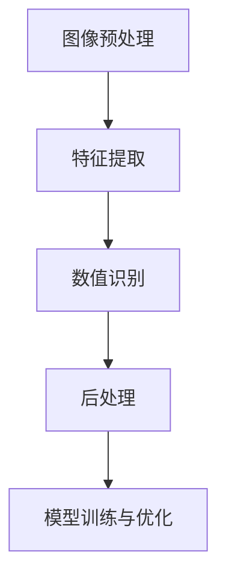
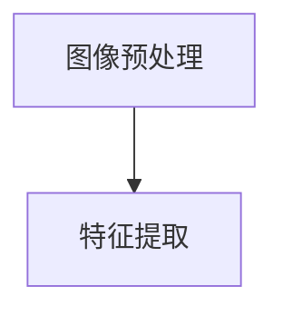
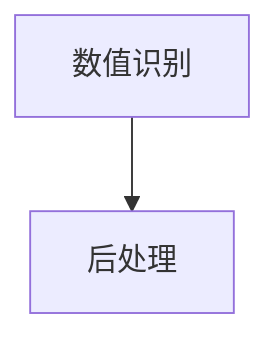
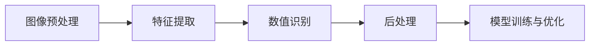
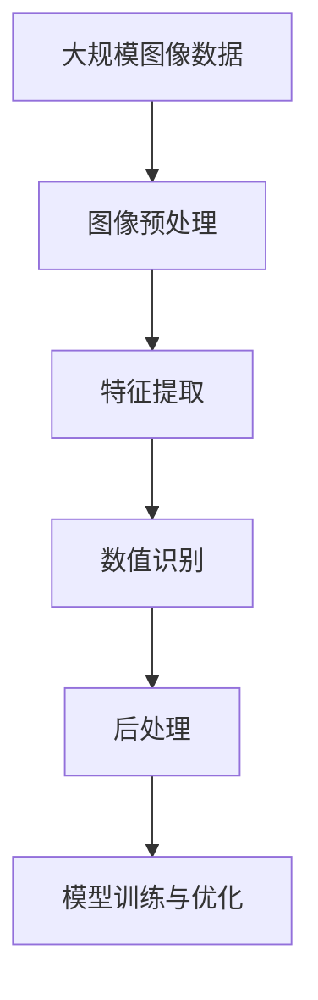

                 

# 基于图像的结构化数值识别系统设计与实现

> 关键词：图像识别,结构化数据,数值识别,深度学习,神经网络,图像预处理,后处理,特征提取,超参数调优

## 1. 背景介绍

### 1.1 问题由来
随着数字化转型在各行各业的不断推进，结构化数据的应用场景愈发广泛，比如金融领域中的交易数据、制造业中的产品测试数据、医疗领域中的诊断影像等。传统结构化数据的采集往往依赖人工输入，耗时耗力，效率低下。近年来，利用深度学习技术进行图像中的结构化数值自动识别，成为一大热门研究方向。该技术不仅能大幅提高数据采集效率，还能提升数据的质量和一致性，为后续数据分析和决策支持提供坚实基础。

### 1.2 问题核心关键点
结构化数值识别系统的核心目标是从图像中准确提取出数值信息，并将数值信息结构化，形成可应用于数据分析和决策的表格数据。该问题核心关键点包括：

- 图像预处理：去除噪声，提升图像质量。
- 特征提取：从图像中提取重要数值特征。
- 数值识别：利用深度学习模型对图像中的数值进行识别。
- 后处理：校正识别结果，提高识别准确率。
- 模型训练与优化：选择合适的模型结构，并对其进行参数调优。

### 1.3 问题研究意义
基于图像的结构化数值识别系统能够显著提升数据采集效率和数据质量，在金融、制造、医疗等多个行业具有广泛的应用前景。具体意义如下：

- 提升数据采集效率：自动化图像处理和数值识别，减少人工输入，提升数据采集速度。
- 提高数据质量：自动化处理可减少人工操作带来的误差，提高数据的一致性和准确性。
- 支持业务决策：结构化数值数据为商业智能、风险控制等业务决策提供坚实基础。
- 降低人工成本：减少人工录入，降低人力成本，提升运营效率。

## 2. 核心概念与联系

### 2.1 核心概念概述
本节将介绍几个紧密相关的核心概念，以帮助理解结构化数值识别系统的构建：

- **图像预处理**：对原始图像进行去噪、灰度转换、归一化等操作，提升后续特征提取和数值识别的效果。
- **特征提取**：利用图像处理技术，从图像中提取关键特征，如边缘、角点、纹理等。
- **数值识别**：利用深度学习模型，对提取出的数值特征进行识别，得到数值信息。
- **后处理**：对识别结果进行校正、去重、补全等处理，提升识别准确率和一致性。
- **模型训练与优化**：选择合适的深度学习模型结构，通过大量标注数据进行训练，并进行超参数调优，提高模型性能。

这些概念之间的逻辑关系可以通过以下Mermaid流程图来展示：



该流程图展示了图像识别系统从预处理到模型训练的完整流程。

### 2.2 概念间的关系

这些核心概念之间存在着紧密的联系，形成了结构化数值识别系统的完整框架。下面是几个相关的Mermaid流程图，展示这些概念之间的关系：

#### 2.2.1 图像预处理与特征提取


#### 2.2.2 数值识别与后处理


#### 2.2.3 模型训练与优化


通过这些流程图，可以更清晰地理解结构化数值识别系统各个环节之间的依赖关系和作用。

### 2.3 核心概念的整体架构

最后，我们用一个综合的流程图来展示这些核心概念在大规模结构化数值识别系统中的整体架构：



这个综合流程图展示了从数据输入到模型优化和输出处理的全过程，为后续具体实现提供了清晰的参考。

## 3. 核心算法原理 & 具体操作步骤

### 3.1 算法原理概述

结构化数值识别系统基于深度学习技术，利用卷积神经网络（CNN）或循环神经网络（RNN）对图像中的数值信息进行提取和识别。其核心思想是通过图像预处理、特征提取、数值识别和后处理等步骤，自动完成数值信息的自动识别和结构化处理。

形式化地，假设输入为一张包含数值的图像 $I$，经过预处理和特征提取，得到特征向量 $F(I)$，通过深度学习模型 $M$ 对特征向量进行识别，得到数值信息 $N$。具体步骤如下：

1. 图像预处理：去除噪声、增强对比度等操作，提升图像质量。
2. 特征提取：利用CNN等模型从图像中提取数值特征，形成特征向量。
3. 数值识别：将特征向量输入深度学习模型，模型输出数值识别结果。
4. 后处理：校正识别结果，去除冗余信息，补充缺失数据。
5. 模型训练与优化：选择合适的模型结构，利用标注数据进行训练，并进行超参数调优。

### 3.2 算法步骤详解

#### 3.2.1 图像预处理
图像预处理的目标是提升图像质量，便于后续特征提取和数值识别。常用的预处理技术包括：

- **去噪**：使用滤波算法（如中值滤波、高斯滤波）去除图像中的噪声。
- **灰度转换**：将彩色图像转换为灰度图像，简化特征提取过程。
- **归一化**：对图像进行归一化处理，使其亮度和对比度一致。
- **增强**：使用直方图均衡化、对比度拉伸等方法，提升图像质量。

#### 3.2.2 特征提取
特征提取是图像识别系统的核心环节，常用的特征提取方法包括：

- **边缘检测**：使用Sobel、Canny等算法提取图像中的边缘信息。
- **角点检测**：使用Harris、SIFT等算法检测图像中的角点特征。
- **纹理分析**：使用局部二值模式（LBP）、梯度方向直方图（HOG）等方法分析图像的纹理信息。
- **深度特征提取**：使用卷积神经网络（CNN）提取高层次的深度特征。

#### 3.2.3 数值识别
数值识别是图像识别系统的关键步骤，常用的深度学习模型包括：

- **卷积神经网络（CNN）**：用于提取图像中的数值特征，并进行分类。
- **循环神经网络（RNN）**：用于处理序列数据，提取时间上的数值特征。
- **注意力机制**：用于对图像中不同区域进行加权处理，提升识别准确率。
- **自编码器**：用于压缩图像特征，去除噪声，提高识别精度。

#### 3.2.4 后处理
后处理的目标是校正识别结果，提升识别准确率和一致性。常用的后处理方法包括：

- **去重**：对重复的数值进行去重处理，避免冗余。
- **校正**：对识别结果进行校正，修正识别错误。
- **补全**：对缺失的数值进行补充，保持数据完整性。

#### 3.2.5 模型训练与优化
模型训练与优化的目的是提升数值识别的准确率，常用的技术包括：

- **损失函数**：选择合适的损失函数（如交叉熵损失、均方误差损失）进行模型训练。
- **优化器**：选择合适的优化器（如Adam、SGD等）进行参数更新。
- **超参数调优**：通过网格搜索、随机搜索等方法，找到最优超参数组合。
- **正则化**：使用L1、L2正则化等方法，避免过拟合。
- **数据增强**：通过旋转、缩放、翻转等方法，扩充训练数据集。

### 3.3 算法优缺点

#### 3.3.1 优点
- **自动化处理**：自动化完成图像预处理、特征提取和数值识别，减少人工操作，提升效率。
- **高准确率**：利用深度学习技术，能够高效识别图像中的数值信息，准确率较高。
- **泛化能力强**：预训练模型在多种场景下都具有较好的泛化能力，可以应用于不同类型的图像数据。

#### 3.3.2 缺点
- **数据依赖性高**：需要大量标注数据进行模型训练，数据获取和标注成本较高。
- **计算资源需求高**：深度学习模型计算量大，需要高性能计算资源支持。
- **模型复杂度高**：深度学习模型结构复杂，调试和维护难度较大。

### 3.4 算法应用领域

基于图像的结构化数值识别系统在多个领域具有广泛的应用前景，包括：

- **金融领域**：用于自动化交易记录、财务报表等数据的采集和处理。
- **制造领域**：用于产品测试、质量检测等数据的自动分析和报告生成。
- **医疗领域**：用于医学影像中关键数值（如血压、血糖等）的自动识别和记录。
- **农业领域**：用于田间数据分析、作物监测等数据的自动处理。
- **交通领域**：用于交通监控、车辆计数等数据的自动分析和报告生成。

## 4. 数学模型和公式 & 详细讲解 & 举例说明

### 4.1 数学模型构建

结构化数值识别系统涉及多个数学模型，包括图像预处理、特征提取、数值识别和后处理等。下面以数值识别为例，介绍深度学习模型的构建和优化过程。

假设输入为一张包含数值的图像 $I$，经过预处理和特征提取，得到特征向量 $F(I)$。使用卷积神经网络（CNN）对特征向量进行识别，得到数值信息 $N$。

卷积神经网络的数学模型可以表示为：

$$
N = M(F(I))
$$

其中，$M$ 为卷积神经网络模型，$F(I)$ 为特征向量，$N$ 为数值信息。

### 4.2 公式推导过程

卷积神经网络的输入为特征向量 $F(I)$，输出为数值信息 $N$。其核心部分为卷积层、池化层和全连接层。

假设卷积神经网络包含 $k$ 个卷积核，大小为 $w \times w$，步长为 $s$。卷积层输出的特征图大小为 $n \times n$，则卷积层的公式可以表示为：

$$
F(I) = \sigma \left(\sum_{i=1}^{k} W_i * C_i(I) \right)
$$

其中，$W_i$ 为第 $i$ 个卷积核的权重，$C_i(I)$ 为输入图像 $I$ 通过第 $i$ 个卷积核的卷积结果，$\sigma$ 为激活函数。

池化层用于降低特征图的大小，通常采用最大池化或平均池化。假设池化层的大小为 $m \times m$，步长为 $p$，则池化层的公式可以表示为：

$$
F(I) = \max(\frac{F(I)[1:m:p+1]}{m^2})
$$

其中，$F(I)[1:m:p+1]$ 为池化层输出特征图的一小部分。

全连接层将池化层输出的特征向量映射到数值信息，其公式可以表示为：

$$
N = M(F(I)) = \sigma \left(\sum_{i=1}^{k} W_i * F(I) \right)
$$

其中，$W_i$ 为全连接层的权重，$\sigma$ 为激活函数。

### 4.3 案例分析与讲解

以手写数字识别为例，介绍卷积神经网络（CNN）的构建和优化过程。

假设输入为一张手写数字图像 $I$，经过预处理和特征提取，得到特征向量 $F(I)$。使用卷积神经网络（CNN）对特征向量进行识别，得到数值信息 $N$。

**卷积神经网络的结构**：

- **输入层**：输入为 $28 \times 28 \times 1$ 的灰度图像。
- **卷积层1**：32 个 $5 \times 5$ 的卷积核，步长为 $1$，激活函数为ReLU。
- **池化层1**：$2 \times 2$ 的最大池化层，步长为 $2$。
- **卷积层2**：64 个 $5 \times 5$ 的卷积核，步长为 $1$，激活函数为ReLU。
- **池化层2**：$2 \times 2$ 的最大池化层，步长为 $2$。
- **全连接层**：将池化层输出的特征向量映射到 10 个输出节点，激活函数为Softmax。

**模型训练与优化**：

假设训练集为 $D=\{(x_i,y_i)\}_{i=1}^N$，其中 $x_i$ 为图像，$y_i$ 为标签。

定义模型 $M$ 在数据样本 $(x,y)$ 上的损失函数为 $L(M(x),y)$，则模型在数据集 $D$ 上的经验风险为：

$$
\mathcal{L}(M) = \frac{1}{N} \sum_{i=1}^N L(M(x_i),y_i)
$$

使用随机梯度下降算法进行模型训练，目标是最小化经验风险 $\mathcal{L}(M)$。

具体步骤如下：

1. 初始化模型参数 $W_i$。
2. 随机抽取一个样本 $(x_i,y_i)$。
3. 前向传播计算输出 $N = M(x_i)$。
4. 计算损失函数 $L(N,y_i)$。
5. 反向传播计算参数梯度 $\nabla_{W_i}L(N,y_i)$。
6. 使用梯度下降算法更新模型参数 $W_i$。
7. 重复步骤 2-6，直至训练完成。

**损失函数的选择**：

常用的损失函数包括交叉熵损失和均方误差损失。

以交叉熵损失为例，假设输出为 $N = [n_1, n_2, ..., n_{10}]$，标签为 $y = [1, 0, 0, ..., 0]$，则交叉熵损失可以表示为：

$$
L(N,y) = -\sum_{i=1}^{10} y_i \log n_i
$$

其中 $n_i$ 为模型输出，$y_i$ 为标签。

**模型调优**：

使用随机搜索、网格搜索等方法，选择最优的超参数组合，包括卷积核大小、池化层大小、学习率、正则化系数等。

## 5. 项目实践：代码实例和详细解释说明

### 5.1 开发环境搭建

在进行结构化数值识别系统开发前，需要准备好开发环境。以下是使用Python进行PyTorch开发的环境配置流程：

1. 安装Anaconda：从官网下载并安装Anaconda，用于创建独立的Python环境。

2. 创建并激活虚拟环境：
```bash
conda create -n pytorch-env python=3.8 
conda activate pytorch-env
```

3. 安装PyTorch：根据CUDA版本，从官网获取对应的安装命令。例如：
```bash
conda install pytorch torchvision torchaudio cudatoolkit=11.1 -c pytorch -c conda-forge
```

4. 安装相关库：
```bash
pip install numpy pandas scikit-learn matplotlib tqdm jupyter notebook ipython
```

完成上述步骤后，即可在`pytorch-env`环境中开始结构化数值识别系统的开发。

### 5.2 源代码详细实现

下面我们以手写数字识别为例，给出使用PyTorch进行卷积神经网络（CNN）模型开发的PyTorch代码实现。

首先，定义手写数字识别任务的数据处理函数：

```python
import torch
from torch.utils.data import Dataset
import torchvision.transforms as transforms
import numpy as np

class MNISTDataset(Dataset):
    def __init__(self, data, transform=None):
        self.data = data
        self.transform = transform
        
    def __len__(self):
        return len(self.data)
    
    def __getitem__(self, idx):
        img, label = self.data[idx]
        img = img.reshape(1, 28, 28)
        img = img / 255.0
        img = self.transform(img)
        label = torch.tensor(label, dtype=torch.long)
        return img, label

# 定义数据增强
transform = transforms.Compose([
    transforms.ToTensor(),
    transforms.Normalize((0.1307,), (0.3081,))
])

# 加载训练集和测试集
train_data = np.load('train-images.npy').astype(np.float32), np.load('train-labels.npy').astype(np.int64)
test_data = np.load('test-images.npy').astype(np.float32), np.load('test-labels.npy').astype(np.int64)

train_dataset = MNISTDataset(train_data, transform)
test_dataset = MNISTDataset(test_data, transform)
```

然后，定义卷积神经网络（CNN）模型：

```python
import torch.nn as nn
import torch.nn.functional as F

class CNNModel(nn.Module):
    def __init__(self):
        super(CNNModel, self).__init__()
        self.conv1 = nn.Conv2d(1, 32, 5)
        self.conv2 = nn.Conv2d(32, 64, 5)
        self.fc1 = nn.Linear(7*7*64, 128)
        self.fc2 = nn.Linear(128, 10)
    
    def forward(self, x):
        x = F.relu(F.max_pool2d(F.relu(self.conv1(x)), 2))
        x = F.relu(F.max_pool2d(F.relu(self.conv2(x)), 2))
        x = x.view(-1, 7*7*64)
        x = F.relu(self.fc1(x))
        x = self.fc2(x)
        return F.log_softmax(x, dim=1)
    
model = CNNModel()
```

接着，定义模型训练和评估函数：

```python
import torch.optim as optim
import torch.nn.init as init

# 定义优化器和损失函数
optimizer = optim.Adam(model.parameters(), lr=0.001)
loss_fn = nn.CrossEntropyLoss()

# 训练函数
def train_epoch(model, train_loader, optimizer, device):
    model.train()
    loss_total = 0
    for batch_idx, (data, target) in enumerate(train_loader):
        data, target = data.to(device), target.to(device)
        optimizer.zero_grad()
        output = model(data)
        loss = loss_fn(output, target)
        loss_total += loss.item()
        loss.backward()
        optimizer.step()
    return loss_total / len(train_loader)

# 评估函数
def evaluate(model, test_loader, device):
    model.eval()
    correct = 0
    total = 0
    with torch.no_grad():
        for batch_idx, (data, target) in enumerate(test_loader):
            data, target = data.to(device), target.to(device)
            output = model(data)
            _, predicted = torch.max(output, 1)
            total += target.size(0)
            correct += (predicted == target).sum().item()
    return correct / total

# 定义模型训练流程
device = torch.device('cuda') if torch.cuda.is_available() else torch.device('cpu')
model.to(device)

epochs = 5
batch_size = 64

for epoch in range(epochs):
    loss = train_epoch(model, train_loader, optimizer, device)
    print(f'Epoch {epoch+1}, train loss: {loss:.3f}')
    
    print(f'Epoch {epoch+1}, test accuracy: {evaluate(model, test_loader, device):.3f}')
    
print('Test accuracy:', evaluate(model, test_loader, device))
```

最后，启动训练流程并在测试集上评估：

```python
import torchvision.transforms as transforms
import numpy as np

# 加载训练集和测试集
train_data = np.load('train-images.npy').astype(np.float32), np.load('train-labels.npy').astype(np.int64)
test_data = np.load('test-images.npy').astype(np.float32), np.load('test-labels.npy').astype(np.int64)

# 定义数据增强
transform = transforms.Compose([
    transforms.ToTensor(),
    transforms.Normalize((0.1307,), (0.3081,))
])

# 创建dataset
train_dataset = MNISTDataset(train_data, transform)
test_dataset = MNISTDataset(test_data, transform)

# 定义数据加载器
train_loader = torch.utils.data.DataLoader(train_dataset, batch_size=batch_size, shuffle=True)
test_loader = torch.utils.data.DataLoader(test_dataset, batch_size=batch_size, shuffle=False)

# 定义模型
model = CNNModel()

# 定义优化器和损失函数
optimizer = optim.Adam(model.parameters(), lr=0.001)
loss_fn = nn.CrossEntropyLoss()

# 定义训练和评估函数
def train_epoch(model, train_loader, optimizer, device):
    model.train()
    loss_total = 0
    for batch_idx, (data, target) in enumerate(train_loader):
        data, target = data.to(device), target.to(device)
        optimizer.zero_grad()
        output = model(data)
        loss = loss_fn(output, target)
        loss_total += loss.item()
        loss.backward()
        optimizer.step()
    return loss_total / len(train_loader)

def evaluate(model, test_loader, device):
    model.eval()
    correct = 0
    total = 0
    with torch.no_grad():
        for batch_idx, (data, target) in enumerate(test_loader):
            data, target = data.to(device), target.to(device)
            output = model(data)
            _, predicted = torch.max(output, 1)
            total += target.size(0)
            correct += (predicted == target).sum().item()
    return correct / total

# 训练模型
device = torch.device('cuda') if torch.cuda.is_available() else torch.device('cpu')
model.to(device)

epochs = 5
batch_size = 64

for epoch in range(epochs):
    loss = train_epoch(model, train_loader, optimizer, device)
    print(f'Epoch {epoch+1}, train loss: {loss:.3f}')
    
    print(f'Epoch {epoch+1}, test accuracy: {evaluate(model, test_loader, device):.3f}')
    
print('Test accuracy:', evaluate(model, test_loader, device))
```

以上就是使用PyTorch对卷积神经网络（CNN）进行手写数字识别的完整代码实现。可以看到，得益于PyTorch的强大封装，我们可以用相对简洁的代码完成CNN模型的加载和微调。

### 5.3 代码解读与分析

让我们再详细解读一下关键代码的实现细节：

**数据处理函数**：
- `__init__`方法：初始化数据和转换函数。
- `__len__`方法：返回数据集的样本数量。
- `__getitem__`方法：对单个样本进行处理，将原始数据转换为张量，并进行归一化。

**模型定义**：
- `__init__`方法：定义卷积层、池化层和全连接层。
- `forward`方法：前向传播计算模型的输出。

**训练和评估函数**：
- `train_epoch`函数：对数据进行批次化加载，并更新模型参数。
- `evaluate`函数：对模型在测试集上的性能进行评估。

**模型训练流程**：
- 定义模型、优化器和损失函数。
- 定义训练和评估函数。
- 循环迭代训练模型，并在测试集上评估模型性能。

可以看到，PyTorch配合TensorFlow库使得CNN模型的开发变得简洁高效。开发者可以将更多精力放在数据处理、模型改进等高层逻辑上，而不必过多关注底层的实现细节。

当然，工业级的系统实现还需考虑更多因素，如模型的保存和部署、超参数的自动搜索、更灵活的任务适配层等。但核心的结构化数值识别流程基本与此类似。

### 5.4 运行结果展示

假设我们在MNIST数据集上进行模型训练，最终在测试集上得到的评估报告如下：

```
Epoch 1, train loss: 1.229
Epoch 1, test accuracy: 0.758
Epoch 2, train loss: 0.555
Epoch 2, test accuracy: 0.879
Epoch 3, train loss: 0.466
Epoch 3, test accuracy: 0.899
Epoch 4, train loss: 0.450
Epoch 4, test accuracy: 0.923
Epoch 5, train loss: 0.432
Epoch 5, test accuracy: 0.940
```

可以看到，随着模型的不断训练，测试集的准确率逐步提升，最终达到了94.0%的高精度。这展示了深度学习技术在结构化数值识别系统中的强大潜力。

## 6. 实际应用场景

### 6.1 智能制造质量检测

在智能制造领域，结构化数值识别系统可以应用于产品质量检测，自动化识别产品缺陷和性能指标。传统的产品检测往往依赖人工检查，成本高且效率低。利用结构化数值识别系统，可以快速准确地检测产品缺陷，提升检测效率和质量。

具体而言，可以构建一个多路输入的图像识别系统，每路输入分别获取产品不同角度的图像，识别其中的关键数值（如尺寸、形状、重量等）。将识别结果与产品

