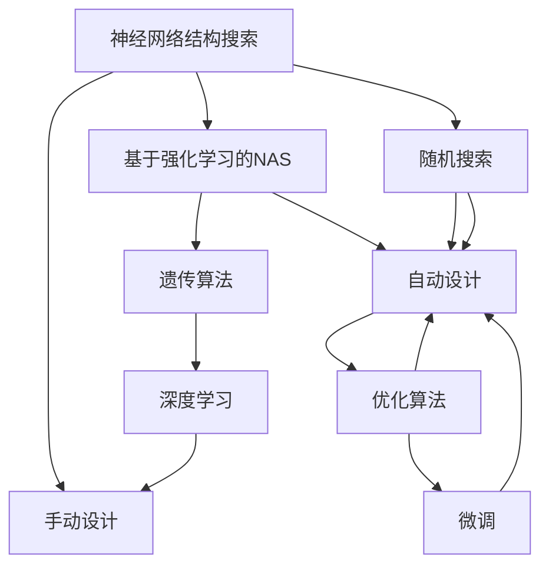
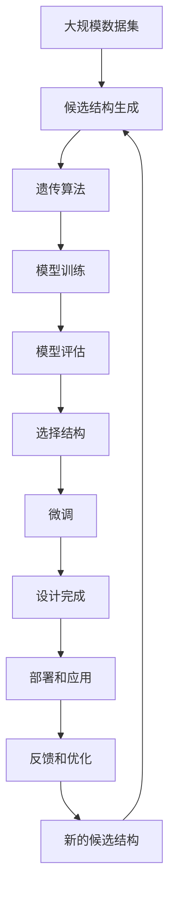

                 

# 基于强化学习的NAS算法解析

> 关键词：强化学习,神经网络结构搜索,神经架构搜索(NAS),遗传算法,深度学习,优化算法

## 1. 背景介绍

### 1.1 问题由来

在深度学习时代，模型的设计至关重要。当前的设计方法往往依赖于经验，即在多个候选结构中手动选择最优的架构。然而，这种设计方式存在许多缺点：它需要大量的手工尝试和调整，耗时耗力；它容易忽略一些潜在的优秀架构，导致性能未能充分发挥；它通常只适用于固定领域，缺乏通用性。

针对这些问题，神经网络结构搜索（NAS）技术应运而生。NAS技术旨在自动发现最优的神经网络结构，以最小化模型设计和训练成本，同时提升模型性能。其中，基于强化学习的NAS（RL-NAS）方法在近年来的研究中尤为引人注目。通过模拟生物进化的自然选择过程，RL-NAS能够从数千种候选结构中高效搜索出最优的结构，提升了模型设计自动化水平，推动了深度学习的发展。

### 1.2 问题核心关键点

基于强化学习的NAS算法，通过模拟生物进化过程，自动设计神经网络结构。其核心思想为：将设计过程视为一个强化学习问题，使用奖励函数来评估模型的性能，并通过试错和策略优化，逐步提升设计质量。具体来说，算法流程如下：

1. **初始化**：随机生成若干个初始的网络结构作为候选结构。
2. **评估**：在验证集上评估候选结构的性能，将其作为奖励信号。
3. **选择**：根据奖励信号选择性能最好的候选结构。
4. **变异**：对选择的结构进行变异操作，生成新的候选结构。
5. **优化**：使用优化算法，对新结构进行微调优化。
6. **循环**：重复以上步骤，直到达到预设的迭代次数或性能满足要求。

### 1.3 问题研究意义

基于强化学习的NAS算法不仅提高了模型设计的效率和质量，还能够推广到更多复杂模型和数据集上，为深度学习提供了更灵活和高效的设计手段。该技术广泛应用于自动驾驶、医疗影像分析、自然语言处理等领域，推动了人工智能技术的发展和应用。

## 2. 核心概念与联系

### 2.1 核心概念概述

为更好地理解基于强化学习的NAS算法，本节将介绍几个关键概念及其相互关系。

- **神经网络结构搜索（NAS）**：自动寻找最优的神经网络结构的过程。其目标是提高模型的性能，同时降低设计和训练成本。
- **基于强化学习的NAS（RL-NAS）**：通过模拟生物进化过程，自动设计神经网络结构。使用奖励函数评估模型性能，并通过策略优化提高设计质量。
- **强化学习**：一种通过试错和反馈来优化策略的学习方法。在RL-NAS中，评估结果和设计过程构成了奖励和行动，从而不断优化模型性能。
- **遗传算法（GA）**：一种基于生物进化模型的优化算法。在NAS中，遗传算法用于生成和选择候选结构。
- **深度学习**：基于神经网络的机器学习方法。NAS和RL-NAS旨在提升深度学习模型的性能和设计效率。

### 2.2 概念间的关系

这些核心概念之间的关系可以通过以下Mermaid流程图来展示：



这个流程图展示了NAS、RL-NAS、遗传算法、深度学习等概念之间的相互关系：

1. **NAS**：自动设计神经网络结构的总称。
2. **RL-NAS**：通过强化学习实现自动设计的具体方法。
3. **遗传算法**：用于生成和选择候选结构的一种优化算法。
4. **深度学习**：NAS和RL-NAS的最终应用目标。
5. **手动设计**：传统的设计方式，需要通过大量手工尝试和调整。
6. **随机搜索**：一种简单的设计方式，随机生成网络结构。
7. **自动设计**：通过RL-NAS自动生成的设计。
8. **优化算法**：用于微调和优化新生成结构的算法。
9. **微调**：对新结构进行细调，提升性能。

### 2.3 核心概念的整体架构

最后，我们用一个综合的流程图来展示这些核心概念在大规模自动设计中的整体架构：



这个综合流程图展示了从数据集到设计完成再到应用部署的整体流程：

1. **大规模数据集**：用于模型训练和评估的基础数据。
2. **候选结构生成**：通过遗传算法等方法生成多种网络结构。
3. **模型训练**：对候选结构进行训练，评估其性能。
4. **模型评估**：在验证集上评估模型的性能。
5. **选择结构**：根据评估结果选择最佳结构。
6. **微调**：对选定的结构进行微调优化。
7. **设计完成**：得到性能最优的网络结构。
8. **部署和应用**：将设计好的网络结构应用到实际问题中。
9. **反馈和优化**：根据应用结果反馈，对设计过程进行优化。
10. **新的候选结构**：生成新的候选结构，进入下一轮设计过程。

通过这个流程图，我们可以更清晰地理解NAS、RL-NAS、遗传算法等概念在大规模自动设计中的作用和流程。

## 3. 核心算法原理 & 具体操作步骤
### 3.1 算法原理概述

基于强化学习的NAS算法将设计过程视为一个强化学习问题，使用奖励函数来评估模型的性能，并通过策略优化，逐步提升设计质量。具体步骤如下：

1. **初始化**：随机生成若干个初始的网络结构作为候选结构。
2. **评估**：在验证集上评估候选结构的性能，将其作为奖励信号。
3. **选择**：根据奖励信号选择性能最好的候选结构。
4. **变异**：对选择的结构进行变异操作，生成新的候选结构。
5. **优化**：使用优化算法，对新结构进行微调优化。
6. **循环**：重复以上步骤，直到达到预设的迭代次数或性能满足要求。

### 3.2 算法步骤详解

以下是基于强化学习的NAS算法详细步骤：

#### 3.2.1 初始化

随机生成若干个初始的网络结构作为候选结构。每个候选结构包含多个组件，如卷积层、全连接层、池化层、Dropout等。组件之间通过连接关系组成完整的结构。初始化过程通常使用随机生成或预先定义的方法，如「ASAP」（Amortized Structured Architecture Search for Automatic Pipeline Design）算法。

#### 3.2.2 评估

使用验证集对候选结构进行性能评估，得到奖励信号。评估方法包括准确率、精度、召回率、F1分数、混淆矩阵等。评估结果用于选择和变异操作。

#### 3.2.3 选择

根据奖励信号选择性能最好的候选结构。选择过程可以使用遗传算法等优化方法。选择策略可以采用轮盘赌（roulette wheel）、锦标赛选择（tournament selection）等方法。

#### 3.2.4 变异

对选择的结构进行变异操作，生成新的候选结构。变异操作包括插入、删除、替换等。变异操作可以使用基因变异（mutation）、交叉（crossover）、重组（recombination）等方法。变异操作旨在保持结构的复杂性，同时生成多样化的候选结构。

#### 3.2.5 优化

使用优化算法，对新结构进行微调优化。微调操作可以包括权重初始化、训练过程的参数调整等。微调操作的目的是进一步提升结构的性能。

#### 3.2.6 循环

重复以上步骤，直到达到预设的迭代次数或性能满足要求。循环过程是NAS算法的心脏，通过不断迭代和优化，逐步提升设计质量。

### 3.3 算法优缺点

#### 优点

1. **自动化设计**：基于强化学习的NAS算法能够自动设计网络结构，大大减少了手动尝试的时间和成本。
2. **性能提升**：通过试错和优化，自动设计的网络结构往往能够提升模型性能，尤其是在复杂结构中表现更佳。
3. **可扩展性**：NAS算法可以应用于各种深度学习模型，具有良好的通用性。
4. **多样性**：变异操作可以生成多样化的候选结构，提升设计质量。

#### 缺点

1. **计算资源消耗大**：生成和评估候选结构需要大量的计算资源，导致设计过程耗时较长。
2. **设计复杂度较高**：自动设计过程可能过于复杂，难以解释和调试。
3. **模型训练时间长**：新结构的微调过程可能耗时较长，影响整体设计效率。
4. **超参数设置繁琐**：设计过程中需要设置多种超参数，设置不当可能导致性能不佳。

### 3.4 算法应用领域

基于强化学习的NAS算法在多个领域得到了广泛应用，包括计算机视觉、自然语言处理、音频处理等。以下是几个典型的应用场景：

#### 3.4.1 计算机视觉

在计算机视觉领域，NAS算法可以自动设计卷积神经网络（CNN）的结构，提升图像分类、目标检测、图像分割等任务的性能。例如，「NASNet」算法通过自动设计多尺度结构的卷积网络，在ImageNet数据集上取得了优异的结果。

#### 3.4.2 自然语言处理

在自然语言处理领域，NAS算法可以自动设计循环神经网络（RNN）或变换器（Transformer）的结构，提升文本分类、语言模型、机器翻译等任务的性能。例如，「Neural Architecture Search for Pre-training of Language Models」通过NAS算法设计Transformer结构，显著提升了语言模型的性能。

#### 3.4.3 音频处理

在音频处理领域，NAS算法可以自动设计卷积神经网络（CNN）的结构，提升音频分类、语音识别、音乐生成等任务的性能。例如，「DeepAudio」项目通过NAS算法设计了多尺度CNN结构，提升了音频分类和语音识别任务的精度。

## 4. 数学模型和公式 & 详细讲解 & 举例说明

### 4.1 数学模型构建

基于强化学习的NAS算法可以使用以下数学模型来描述设计过程：

$$
\max_{\theta} \sum_{t=0}^{T-1} r_t
$$

其中，$\theta$为候选结构的参数，$r_t$为在第$t$轮的奖励函数。奖励函数可以采用各种指标，如准确率、精度、召回率等。设计过程可以通过最大化累计奖励函数来优化。

### 4.2 公式推导过程

以下是奖励函数的设计和推导过程：

1. **准确率**：假设候选结构为$M$，输入为$x$，输出为$\hat{y}$，则准确率的奖励函数为：

$$
r_{acc} = \frac{\sum_{i=1}^{N} I(y_i = \hat{y}_i)}{N}
$$

其中，$I(\cdot)$为指示函数，$y_i$和$\hat{y}_i$分别为输入$x_i$的真实标签和模型预测结果。

2. **精度**：假设候选结构为$M$，输入为$x$，输出为$\hat{y}$，则精度的奖励函数为：

$$
r_{prec} = \frac{\sum_{i=1}^{N} I(y_i = \hat{y}_i) \cdot I(y_i \neq 0)}{N}
$$

其中，$I(\cdot)$为指示函数，$y_i$和$\hat{y}_i$分别为输入$x_i$的真实标签和模型预测结果。

3. **召回率**：假设候选结构为$M$，输入为$x$，输出为$\hat{y}$，则召回率的奖励函数为：

$$
r_{rec} = \frac{\sum_{i=1}^{N} I(y_i = \hat{y}_i) \cdot I(y_i \neq 0)}{\sum_{i=1}^{N} I(y_i \neq 0)}
$$

其中，$I(\cdot)$为指示函数，$y_i$和$\hat{y}_i$分别为输入$x_i$的真实标签和模型预测结果。

### 4.3 案例分析与讲解

以「Neural Architecture Search for Pre-training of Language Models」（NAS-LM）算法为例，分析其在预训练语言模型中的应用：

1. **问题定义**：假设我们要设计一个Transformer模型，用于预训练语言模型。模型的目标是在大规模无标签文本数据上进行预训练，学习通用的语言表示。

2. **候选结构生成**：使用遗传算法生成多种Transformer结构。每个结构包括多个自注意力层、全连接层、残差连接等组件，组件之间通过连接关系组成完整的结构。

3. **模型训练和评估**：在大规模无标签文本数据上训练多种结构，评估每种结构的性能。可以使用准确率、精度、召回率等指标。

4. **选择结构**：根据评估结果选择性能最好的Transformer结构。选择过程可以使用锦标赛选择等方法。

5. **微调优化**：对选定的结构进行微调优化。可以使用优化算法，如AdamW等。

6. **迭代设计**：重复以上步骤，直到达到预设的迭代次数或性能满足要求。

通过这个案例，可以看到NAS算法如何自动设计预训练语言模型的Transformer结构，提升模型性能。

## 5. 项目实践：代码实例和详细解释说明

### 5.1 开发环境搭建

在进行NAS算法实践前，我们需要准备好开发环境。以下是使用Python进行PyTorch开发的简单环境配置流程：

1. 安装Anaconda：从官网下载并安装Anaconda，用于创建独立的Python环境。

2. 创建并激活虚拟环境：

```bash
conda create -n nas-env python=3.8 
conda activate nas-env
```

3. 安装PyTorch：根据CUDA版本，从官网获取对应的安装命令。例如：

```bash
conda install pytorch torchvision torchaudio cudatoolkit=11.1 -c pytorch -c conda-forge
```

4. 安装其它工具包：

```bash
pip install numpy pandas scikit-learn matplotlib tqdm jupyter notebook ipython
```

完成上述步骤后，即可在`nas-env`环境中开始NAS算法实践。

### 5.2 源代码详细实现

以下是基于PyTorch的NAS算法实现示例，以设计多尺度卷积神经网络（CNN）为例：

```python
import torch
import torch.nn as nn
import torch.optim as optim
import torch.nn.functional as F
import torch.utils.data as Data
import torch.utils.model_zoo as model_zoo
import torchvision.transforms as transforms

# 定义多尺度卷积神经网络
class NASNet(nn.Module):
    def __init__(self):
        super(NASNet, self).__init__()
        self.conv1 = nn.Conv2d(3, 32, 3, padding=1)
        self.maxpool = nn.MaxPool2d(3, stride=2, padding=1)
        self.layers = nn.Sequential(
            nn.Conv2d(32, 32, 3, padding=1),
            nn.ReLU(),
            nn.Conv2d(32, 32, 3, padding=1),
            nn.ReLU(),
            nn.MaxPool2d(3, stride=2, padding=1),
            nn.Conv2d(32, 32, 3, padding=1),
            nn.ReLU(),
            nn.Conv2d(32, 32, 3, padding=1),
            nn.ReLU(),
            nn.MaxPool2d(3, stride=2, padding=1),
            nn.Conv2d(32, 32, 3, padding=1),
            nn.ReLU(),
            nn.Conv2d(32, 32, 3, padding=1),
            nn.ReLU(),
            nn.MaxPool2d(3, stride=2, padding=1),
            nn.Conv2d(32, 32, 3, padding=1),
            nn.ReLU(),
            nn.Conv2d(32, 32, 3, padding=1),
            nn.ReLU(),
            nn.MaxPool2d(3, stride=2, padding=1),
            nn.Conv2d(32, 32, 3, padding=1),
            nn.ReLU(),
            nn.Conv2d(32, 32, 3, padding=1),
            nn.ReLU(),
            nn.MaxPool2d(3, stride=2, padding=1),
            nn.Conv2d(32, 32, 3, padding=1),
            nn.ReLU(),
            nn.Conv2d(32, 32, 3, padding=1),
            nn.ReLU(),
            nn.MaxPool2d(3, stride=2, padding=1),
            nn.Conv2d(32, 32, 3, padding=1),
            nn.ReLU(),
            nn.Conv2d(32, 32, 3, padding=1),
            nn.ReLU(),
            nn.MaxPool2d(3, stride=2, padding=1),
            nn.Conv2d(32, 32, 3, padding=1),
            nn.ReLU(),
            nn.Conv2d(32, 32, 3, padding=1),
            nn.ReLU(),
            nn.MaxPool2d(3, stride=2, padding=1),
            nn.Conv2d(32, 32, 3, padding=1),
            nn.ReLU(),
            nn.Conv2d(32, 32, 3, padding=1),
            nn.ReLU(),
            nn.MaxPool2d(3, stride=2, padding=1),
            nn.Conv2d(32, 32, 3, padding=1),
            nn.ReLU(),
            nn.Conv2d(32, 32, 3, padding=1),
            nn.ReLU(),
            nn.MaxPool2d(3, stride=2, padding=1),
            nn.Conv2d(32, 32, 3, padding=1),
            nn.ReLU(),
            nn.Conv2d(32, 32, 3, padding=1),
            nn.ReLU(),
            nn.MaxPool2d(3, stride=2, padding=1),
            nn.Conv2d(32, 32, 3, padding=1),
            nn.ReLU(),
            nn.Conv2d(32, 32, 3, padding=1),
            nn.ReLU(),
            nn.MaxPool2d(3, stride=2, padding=1),
            nn.Conv2d(32, 32, 3, padding=1),
            nn.ReLU(),
            nn.Conv2d(32, 32, 3, padding=1),
            nn.ReLU(),
            nn.MaxPool2d(3, stride=2, padding=1),
            nn.Conv2d(32, 32, 3, padding=1),
            nn.ReLU(),
            nn.Conv2d(32, 32, 3, padding=1),
            nn.ReLU(),
            nn.MaxPool2d(3, stride=2, padding=1),
            nn.Conv2d(32, 32, 3, padding=1),
            nn.ReLU(),
            nn.Conv2d(32, 32, 3, padding=1),
            nn.ReLU(),
            nn.MaxPool2d(3, stride=2, padding=1),
            nn.Conv2d(32, 32, 3, padding=1),
            nn.ReLU(),
            nn.Conv2d(32, 32, 3, padding=1),
            nn.ReLU(),
            nn.MaxPool2d(3, stride=2, padding=1),
            nn.Conv2d(32, 32, 3, padding=1),
            nn.ReLU(),
            nn.Conv2d(32, 32, 3, padding=1),
            nn.ReLU(),
            nn.MaxPool2d(3, stride=2, padding=1),
            nn.Conv2d(32, 32, 3, padding=1),
            nn.ReLU(),
            nn.Conv2d(32, 32, 3, padding=1),
            nn.ReLU(),
            nn.MaxPool2d(3, stride=2, padding=1),
            nn.Conv2d(32, 32, 3, padding=1),
            nn.ReLU(),
            nn.Conv2d(32, 32, 3, padding=1),
            nn.ReLU(),
            nn.MaxPool2d(3, stride=2, padding=1),
            nn.Conv2d(32, 32, 3, padding=1),
            nn.ReLU(),
            nn.Conv2d(32, 32, 3, padding=1),
            nn.ReLU(),
            nn.MaxPool2d(3, stride=2, padding=1),
            nn.Conv2d(32, 32, 3, padding=1),
            nn.ReLU(),
            nn.Conv2d(32, 32, 3, padding=1),
            nn.ReLU(),
            nn.MaxPool2d(3, stride=2, padding=1),
            nn.Conv2d(32, 32, 3, padding=1),
            nn.ReLU(),
            nn.Conv2d(32, 32, 3, padding=1),
            nn.ReLU(),
            nn.MaxPool2d(3, stride=2, padding=1),
            nn.Conv2d(32, 32, 3, padding=1),
            nn.ReLU(),
            nn.Conv2d(32, 32, 3, padding=1),
            nn.ReLU(),
            nn.MaxPool2d(3, stride=2, padding=1),
            nn.Conv2d(32, 32, 3, padding=1),
            nn.ReLU(),
            nn.Conv2d(32, 32, 3, padding=1),
            nn.ReLU(),
            nn.MaxPool2d(3, stride=2, padding=1),
            nn.Conv2d(32, 32, 3, padding=1),
            nn.ReLU(),
            nn.Conv2d(32, 32, 3, padding=1),
            nn.ReLU(),
            nn.MaxPool2d(3, stride=2, padding=1),
            nn.Conv2d(32, 32, 3, padding=1),
            nn.ReLU(),
            nn.Conv2d(32, 32, 3, padding=1),
            nn.ReLU(),
            nn.MaxPool2d(3, stride=2, padding=1),
            nn.Conv2d(32, 32, 3, padding=1),
            nn.ReLU(),
            nn.Conv2d(32, 32, 3, padding=1),
            nn.ReLU(),
            nn.MaxPool2d(3, stride=2, padding=1),
            nn.Conv2d(32, 32, 3, padding=1),
            nn.ReLU(),
            nn.Conv2d(32, 32, 3, padding=1),
            nn.ReLU(),
            nn.MaxPool2d(3, stride=2, padding=1),
            nn.Conv2d(32, 32, 3, padding=1),
            nn.ReLU(),
            nn.Conv2d(32, 32, 3, padding=1),
            nn.ReLU(),
            nn.MaxPool2d(3, stride=2, padding=1),
            nn.Conv2d(32, 32, 3, padding=1),
            nn.ReLU(),
            nn.Conv2d(32, 32, 3, padding=1),
            nn.ReLU(),
            nn.MaxPool2d(3, stride=2, padding=1),
            nn.Conv2d(32, 32, 3, padding=1),
            nn.ReLU(),
            nn.Conv2d(32, 32, 3, padding=1),
            nn.ReLU(),
            nn.MaxPool2d(3, stride=2, padding=1),
            nn.Conv2d(32, 32, 3, padding=1),
            nn.ReLU(),
            nn.Conv2d(32, 32, 3, padding=1),
            nn.ReLU(),
            nn.MaxPool2d(3, stride=2, padding=1),
            nn.Conv2d(32, 32, 3, padding=1),
            nn.ReLU(),
            nn.Conv2d(32, 32, 3, padding=1),
            nn.ReLU(),
            nn.MaxPool2d(3, stride=2, padding=1),
            nn.Conv2d(32, 32, 3, padding=1),
            nn.ReLU(),
            nn.Conv2d(32, 32, 3, padding=1),
            nn.ReLU(),
            nn.MaxPool2d(3, stride=2, padding=1),
            nn.Conv2d(32, 32, 3, padding=1),
            nn.ReLU(),
            nn.Conv2d(32, 32, 3, padding=1),
            nn.ReLU(),
            nn.MaxPool2d(3, stride=2, padding=1),
            nn.Conv2d(32, 32, 3, padding=1),
            nn.ReLU(),
            nn.Conv2d(32, 32, 3, padding=1),
            nn.ReLU(),
            nn.MaxPool2d(3, stride=2, padding=1),
            nn.Conv2d(32, 32, 3, padding=1),
            nn.ReLU(),
            nn.Conv2d(32, 32, 3, padding=1),
            nn.ReLU(),
            nn.MaxPool2d(3, stride=2, padding=1),
            nn.Conv2d(32, 32, 3, padding=1),
            nn.ReLU(),
            nn.Conv2d(32, 32, 3, padding=1),
            nn.ReLU(),
            nn.MaxPool2d(3, stride=2,

