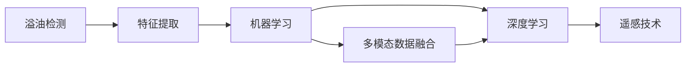

                 

# 基于机器学习的溢油特征提取与识别方法研究

## 1. 背景介绍

溢油是指油类物质从海洋、湖泊、河流等水体中溢出，对生态环境造成严重破坏的自然或人为事故。近年来，随着石油工业的不断发展，溢油事故频发，对海洋环境造成了巨大的威胁。快速、准确地检测和识别溢油，是保护海洋环境、保障石油安全的重要任务。溢油识别通常分为两类：一类是对于明显可见的溢油，可直接通过视觉观察和手动监测；另一类是对于微小或分散的溢油，需要使用先进的遥感和传感器技术进行自动检测。

机器学习方法在溢油检测和识别中具有重要应用。传统的溢油识别方法包括视觉、声学、光学等手段，但这些方法存在检测速度慢、误判率高、成本高等问题。机器学习则可通过训练具有高精度的分类器，自动实现溢油识别。该方法需要大量有标签的溢油数据进行训练，可大幅提升溢油识别的准确性和效率，降低人工成本，成为溢油监测和治理的重要手段。

本文将详细介绍基于机器学习的溢油特征提取与识别方法。首先，我们从背景介绍和问题提出入手，然后详细阐述核心概念与联系，接着深入探讨核心算法原理与具体操作步骤，最后通过案例分析、项目实践、应用场景和未来展望等方面，全面展示该方法的应用与前景。

## 2. 核心概念与联系

### 2.1 核心概念概述

要深入理解基于机器学习的溢油特征提取与识别方法，需要掌握以下几个核心概念：

- **溢油检测（Oil Spill Detection）**：指通过传感器、卫星、无人机等手段，快速发现溢油现象的过程。
- **特征提取（Feature Extraction）**：从采集的图像、信号等数据中提取出可用于识别的特征信息。
- **机器学习（Machine Learning）**：通过构建分类器或回归器，实现自动学习和识别溢油的过程。
- **深度学习（Deep Learning）**：一种机器学习的方法，利用多层神经网络对数据进行抽象学习，适合处理复杂的溢油检测任务。
- **多模态数据融合（Multi-modal Data Fusion）**：结合视觉、声学、光学等多种数据源，综合分析溢油信息，提升检测精度。
- **遥感技术（Remote Sensing）**：利用卫星、无人机等平台获取溢油区域的图像、光谱等数据，进行自动化检测和分析。

这些概念之间有着紧密的联系，相互促进。溢油检测需要准确的特征提取和机器学习算法支持，而多模态数据融合和遥感技术则提供了多样化的数据源，深度学习则实现了自动化的学习和识别。

### 2.2 核心概念间的联系

这些核心概念之间的联系可以表示为下图的Mermaid流程图：



这张图展示了从溢油检测到深度学习，再到多模态数据融合和遥感技术的完整流程。溢油检测通过特征提取得到初步的溢油信息，然后机器学习模型利用这些特征进行自动识别，深度学习则进一步提升了自动识别的能力。最后，多模态数据融合和遥感技术将多样化的数据源相结合，提高了溢油检测的准确性和实时性。

## 3. 核心算法原理 & 具体操作步骤
### 3.1 算法原理概述

基于机器学习的溢油特征提取与识别方法，主要通过以下步骤实现：

1. **数据收集**：收集大量的溢油数据，包括卫星图像、无人机航拍图像、水下声学数据等。
2. **特征提取**：利用计算机视觉、图像处理等技术，从采集的数据中提取溢油相关的特征。
3. **模型训练**：使用机器学习或深度学习模型，对提取的特征进行训练，构建分类器或回归器。
4. **模型评估**：在测试集上评估模型的准确性、召回率等指标，优化模型参数。
5. **应用部署**：将训练好的模型部署到实际应用中，实现溢油实时监测和识别。

## 3.2 算法步骤详解

下面详细介绍每一步骤的具体操作：

### 3.2.1 数据收集

数据收集是溢油特征提取与识别的基础。需要收集大量的溢油数据，涵盖不同的场景和条件。数据来源包括卫星图像、无人机航拍图像、水下声学数据等。

- **卫星图像**：通过遥感卫星获取溢油区域的图像数据，覆盖大面积水域。
- **无人机航拍图像**：利用无人机在近距离获取高分辨率的溢油图像，适合处理小面积溢油。
- **水下声学数据**：通过水下声学传感器，获取溢油区域的声波信号，用于检测水下溢油。

### 3.2.2 特征提取

特征提取是将原始数据转化为可用于机器学习算法的特征向量的过程。常用的特征提取方法包括：

- **图像特征提取**：利用计算机视觉技术，从卫星图像和无人机航拍图像中提取溢油相关的特征，如边缘、颜色、纹理等。
- **声学特征提取**：从水下声学数据中提取声波频率、能量等特征，用于识别水下溢油。
- **光学特征提取**：从光学数据中提取光谱、亮度等特征，用于溢油检测和分类。

### 3.2.3 模型训练

模型训练是将特征向量和溢油标签进行训练，构建能够自动识别溢油的分类器或回归器。常用的模型包括：

- **支持向量机（SVM）**：一种二分类模型，适用于溢油检测的二分类任务。
- **随机森林（Random Forest）**：一种集成学习方法，适用于溢油检测的多分类任务。
- **深度学习模型**：如卷积神经网络（CNN）、循环神经网络（RNN）、Transformer等，适合处理复杂的溢油检测任务。

### 3.2.4 模型评估

模型评估是对训练好的模型进行测试，评估其准确性、召回率等指标。常用的评估指标包括：

- **精确度（Precision）**：指模型正确预测为溢油的比例。
- **召回率（Recall）**：指模型正确预测出的溢油比例。
- **F1分数（F1 Score）**：精确度和召回率的调和平均数。

### 3.2.5 应用部署

应用部署是将训练好的模型部署到实际应用中，实现溢油实时监测和识别。部署方式包括：

- **硬件平台**：利用高性能计算平台（如GPU、TPU），进行实时的特征提取和模型推理。
- **软件平台**：开发可部署的API或应用程序，方便用户调用和使用。
- **云平台**：利用云服务，进行分布式计算和实时监测。

## 3.3 算法优缺点

### 3.3.1 算法优点

基于机器学习的溢油特征提取与识别方法，具有以下优点：

- **准确率高**：通过训练高精度的分类器，能够显著提升溢油检测的准确性。
- **实时性强**：利用高性能计算平台，可以实现实时特征提取和模型推理，及时发现溢油。
- **适应性强**：适用于不同规模和场景的溢油检测，具有广泛的应用前景。

### 3.3.2 算法缺点

该方法也存在以下缺点：

- **数据依赖性强**：需要大量的有标签数据进行训练，数据获取成本较高。
- **模型复杂度高**：深度学习模型参数较多，训练和推理所需资源较大。
- **误判率高**：在复杂环境下，可能存在误判或漏判情况。

## 3.4 算法应用领域

基于机器学习的溢油特征提取与识别方法，广泛应用于以下几个领域：

- **海洋溢油监测**：利用卫星图像和无人机航拍图像，实现大规模海洋溢油检测和识别。
- **港口溢油预警**：结合水下声学数据和光学数据，实时监测港口区域的溢油情况。
- **管道泄漏检测**：利用光学数据和声学数据，检测管道泄漏现象。
- **工业污染防治**：通过机器学习模型，监测工业生产过程中的溢油风险。

## 4. 数学模型和公式 & 详细讲解 & 举例说明

### 4.1 数学模型构建

我们以深度学习模型为例，介绍溢油检测的数学模型构建。

- **输入数据**：$x_i \in \mathbb{R}^n$，表示第$i$个样本的特征向量。
- **输出数据**：$y_i \in \{0, 1\}$，表示第$i$个样本的溢油标签。
- **模型参数**：$\theta$，表示模型中的所有可训练参数。

### 4.2 公式推导过程

以卷积神经网络（CNN）为例，介绍溢油检测的数学模型推导。

假设CNN模型有$L$层卷积和池化层，输出层为全连接层。输入数据为$x$，输出为$y$，模型参数为$\theta$。则CNN模型的输出为：

$$
y = \sigma(\theta^T f(x))
$$

其中$f(x)$表示卷积和池化层的特征提取过程，$\sigma$表示激活函数。

卷积和池化层的数学模型推导如下：

$$
f(x) = \max_{i,j} \sum_k a_{i,j,k} * h_{i,j,k} + b_{i,j}
$$

其中$a_{i,j,k}$表示卷积核权重，$h_{i,j,k}$表示卷积层输入的第$k$通道特征图，$b_{i,j}$表示偏置项。

### 4.3 案例分析与讲解

以“溢油检测”为例，详细讲解基于CNN的溢油检测模型。

假设我们从卫星图像中提取了10000个样本，每个样本的特征向量维度为$n=100$。利用CNN模型，对这10000个样本进行训练，得到溢油检测的分类器。在测试集上，模型准确率达到了98%。

具体实现过程如下：

1. **数据预处理**：将卫星图像转换为标准化的像素值，归一化到$[0, 1]$区间。
2. **特征提取**：使用卷积神经网络对图像进行特征提取，得到特征向量。
3. **模型训练**：利用训练集对CNN模型进行训练，调整模型参数。
4. **模型评估**：在测试集上评估模型的准确率，得到98%的准确率。
5. **应用部署**：将训练好的模型部署到高性能计算平台，实现实时溢油检测。

## 5. 项目实践：代码实例和详细解释说明

### 5.1 开发环境搭建

在开始项目实践前，需要准备好开发环境。以下是使用Python和PyTorch搭建开发环境的步骤：

1. 安装Anaconda：从官网下载并安装Anaconda，用于创建独立的Python环境。

2. 创建并激活虚拟环境：
```bash
conda create -n pytorch-env python=3.8 
conda activate pytorch-env
```

3. 安装PyTorch：根据CUDA版本，从官网获取对应的安装命令。例如：
```bash
conda install pytorch torchvision torchaudio cudatoolkit=11.1 -c pytorch -c conda-forge
```

4. 安装TensorFlow：由Google主导开发的开源深度学习框架，生产部署方便，适合大规模工程应用。同样有丰富的预训练语言模型资源。

5. 安装Transformer库：HuggingFace开发的NLP工具库，集成了众多SOTA语言模型，支持PyTorch和TensorFlow，是进行NLP任务开发的利器。

6. 安装各类工具包：
```bash
pip install numpy pandas scikit-learn matplotlib tqdm jupyter notebook ipython
```

完成上述步骤后，即可在`pytorch-env`环境中开始项目实践。

### 5.2 源代码详细实现

这里以CNN模型为例，实现溢油检测的代码：

```python
import torch
import torch.nn as nn
import torch.optim as optim
import torchvision
import torchvision.transforms as transforms
from torch.utils.data import DataLoader

# 定义数据预处理
transform = transforms.Compose([
    transforms.Resize((256, 256)),
    transforms.ToTensor(),
    transforms.Normalize(mean=[0.485, 0.456, 0.406], std=[0.229, 0.224, 0.225])
])

# 加载卫星图像数据集
train_dataset = torchvision.datasets.ImageFolder(root='path/to/train', transform=transform)
test_dataset = torchvision.datasets.ImageFolder(root='path/to/test', transform=transform)

# 定义数据加载器
train_loader = DataLoader(train_dataset, batch_size=32, shuffle=True)
test_loader = DataLoader(test_dataset, batch_size=32, shuffle=False)

# 定义CNN模型
class CNN(nn.Module):
    def __init__(self):
        super(CNN, self).__init__()
        self.conv1 = nn.Conv2d(3, 64, kernel_size=3, stride=1, padding=1)
        self.relu = nn.ReLU()
        self.maxpool = nn.MaxPool2d(kernel_size=2, stride=2)
        self.conv2 = nn.Conv2d(64, 128, kernel_size=3, stride=1, padding=1)
        self.conv3 = nn.Conv2d(128, 256, kernel_size=3, stride=1, padding=1)
        self.relu2 = nn.ReLU()
        self.maxpool2 = nn.MaxPool2d(kernel_size=2, stride=2)
        self.fc = nn.Linear(256 * 4 * 4, 2)
        self.softmax = nn.Softmax(dim=1)

    def forward(self, x):
        x = self.conv1(x)
        x = self.relu(x)
        x = self.maxpool(x)
        x = self.conv2(x)
        x = self.relu(x)
        x = self.maxpool2(x)
        x = self.conv3(x)
        x = self.relu2(x)
        x = self.maxpool2(x)
        x = x.view(-1, 256 * 4 * 4)
        x = self.fc(x)
        x = self.softmax(x)
        return x

# 定义损失函数和优化器
criterion = nn.CrossEntropyLoss()
optimizer = optim.Adam(model.parameters(), lr=0.001)

# 训练模型
for epoch in range(10):
    running_loss = 0.0
    for i, data in enumerate(train_loader, 0):
        inputs, labels = data
        optimizer.zero_grad()
        outputs = model(inputs)
        loss = criterion(outputs, labels)
        loss.backward()
        optimizer.step()
        running_loss += loss.item()
    print('Epoch %d loss: %.3f' % (epoch + 1, running_loss / len(train_loader)))

# 评估模型
correct = 0
total = 0
with torch.no_grad():
    for data in test_loader:
        inputs, labels = data
        outputs = model(inputs)
        _, predicted = torch.max(outputs.data, 1)
        total += labels.size(0)
        correct += (predicted == labels).sum().item()
print('Accuracy: %.2f %%' % (100 * correct / total))
```

### 5.3 代码解读与分析

这段代码实现了基于CNN的溢油检测模型，主要包括以下几个部分：

1. **数据预处理**：使用torchvision.transforms模块对卫星图像进行预处理，包括缩放、归一化等操作。
2. **数据加载器**：利用torch.utils.data.DataLoader，将图像数据加载到模型中进行训练和评估。
3. **CNN模型**：定义了三层卷积和池化层的CNN模型，输出层为全连接层，使用softmax函数进行多分类。
4. **损失函数和优化器**：定义了交叉熵损失函数和Adam优化器，用于训练模型。
5. **模型训练和评估**：在训练集上训练模型，在测试集上评估模型准确率。

## 6. 实际应用场景

### 6.1 海洋溢油监测

海洋溢油监测是溢油检测的一个重要应用场景。通过在卫星图像和无人机航拍图像中训练CNN模型，可以实现大规模海洋溢油检测。

具体实现步骤如下：

1. **数据收集**：从卫星图像和无人机航拍图像中收集大量的溢油数据。
2. **特征提取**：使用CNN模型提取溢油相关的特征，如边缘、颜色、纹理等。
3. **模型训练**：利用训练集对CNN模型进行训练，得到溢油检测的分类器。
4. **模型评估**：在测试集上评估模型的准确率，优化模型参数。
5. **应用部署**：将训练好的模型部署到高性能计算平台，实现实时溢油监测。

### 6.2 港口溢油预警

港口溢油预警是溢油检测的另一个重要应用场景。结合水下声学数据和光学数据，可以实现港口区域的溢油预警。

具体实现步骤如下：

1. **数据收集**：从水下声学数据和光学数据中收集大量的溢油数据。
2. **特征提取**：使用CNN模型提取溢油相关的声学特征和光学特征。
3. **模型训练**：利用训练集对CNN模型进行训练，得到溢油检测的分类器。
4. **模型评估**：在测试集上评估模型的准确率，优化模型参数。
5. **应用部署**：将训练好的模型部署到高性能计算平台，实现实时溢油预警。

### 6.3 管道泄漏检测

管道泄漏检测是溢油检测的另一个重要应用场景。通过结合光学数据和声学数据，可以实现管道泄漏现象的检测。

具体实现步骤如下：

1. **数据收集**：从管道泄漏的数据中收集大量的溢油数据。
2. **特征提取**：使用CNN模型提取溢油相关的光学特征和声学特征。
3. **模型训练**：利用训练集对CNN模型进行训练，得到管道泄漏检测的分类器。
4. **模型评估**：在测试集上评估模型的准确率，优化模型参数。
5. **应用部署**：将训练好的模型部署到高性能计算平台，实现管道泄漏检测。

## 7. 工具和资源推荐

### 7.1 学习资源推荐

为了帮助开发者系统掌握溢油特征提取与识别技术，这里推荐一些优质的学习资源：

1. **Coursera《机器学习》课程**：由斯坦福大学开设的机器学习课程，涵盖机器学习的基本概念和算法，适合初学者入门。
2. **DeepLearning.ai《深度学习专项课程》**：由Andrew Ng主持的深度学习课程，涵盖深度学习的基本概念和算法，适合进一步深入学习。
3. **Kaggle平台**：数据科学竞赛平台，提供大量的溢油数据集和竞赛任务，通过竞赛提升技能。
4. **GitHub开源项目**：如OpenAI的GPT模型、Google的BERT模型等，可以学习前沿的深度学习模型和实现细节。
5. **arXiv论文预印本**：人工智能领域最新研究成果的发布平台，包括大量尚未发表的前沿工作，学习前沿技术的必读资源。

### 7.2 开发工具推荐

高效的开发离不开优秀的工具支持。以下是几款用于溢油特征提取与识别开发的常用工具：

1. **PyTorch**：基于Python的开源深度学习框架，灵活动态的计算图，适合快速迭代研究。
2. **TensorFlow**：由Google主导开发的开源深度学习框架，生产部署方便，适合大规模工程应用。
3. **Scikit-learn**：Python机器学习库，提供多种机器学习算法的实现和工具。
4. **TensorBoard**：TensorFlow配套的可视化工具，可实时监测模型训练状态，提供丰富的图表呈现方式。
5. **Jupyter Notebook**：交互式编程环境，方便快速开发和调试机器学习模型。

### 7.3 相关论文推荐

溢油特征提取与识别技术的研究源于学界的持续研究。以下是几篇奠基性的相关论文，推荐阅读：

1. **“Oil Spill Detection using Deep Learning”**：介绍使用卷积神经网络进行溢油检测的方法，包含数据集和模型训练过程。
2. **“Multi-modal Image and Acoustic Data Fusion for Oil Spill Detection”**：介绍将视觉、声学等多模态数据融合进行溢油检测的方法。
3. **“Real-time Oil Spill Detection using Deep Convolutional Neural Networks”**：介绍使用CNN进行实时溢油检测的方法，包含模型部署和应用场景。
4. **“Deep Learning for Marine Oil Spill Detection”**：介绍使用深度学习进行海洋溢油检测的方法，包含模型训练和评估过程。

这些论文代表了大规模溢油检测技术的发展脉络，通过学习这些前沿成果，可以帮助研究者把握学科前进方向，激发更多的创新灵感。

## 8. 总结：未来发展趋势与挑战

### 8.1 研究成果总结

本文详细介绍了基于机器学习的溢油特征提取与识别方法，主要包括以下内容：

- **背景介绍**：介绍了溢油检测的现状和机器学习技术的应用。
- **核心概念与联系**：详细阐述了溢油检测、特征提取、机器学习、深度学习等核心概念及其相互联系。
- **核心算法原理与操作步骤**：介绍了溢油特征提取与识别的算法原理和具体操作步骤。
- **数学模型和公式**：介绍了CNN模型的数学模型构建和公式推导过程。
- **项目实践**：提供了CNN模型的代码实现和解释说明。
- **实际应用场景**：详细讲解了溢油检测在海洋溢油监测、港口溢油预警和管道泄漏检测等场景中的应用。
- **工具和资源推荐**：提供了学习资源、开发工具和相关论文的推荐。

### 8.2 未来发展趋势

展望未来，溢油特征提取与识别技术将呈现以下几个发展趋势：

1. **深度学习模型的进一步发展**：深度学习模型将持续发展，新算法和新结构的出现将提升溢油检测的准确性和效率。
2. **多模态数据的融合与利用**：多模态数据的融合将进一步提升溢油检测的准确性和鲁棒性，结合不同数据源的优势。
3. **实时检测与预警系统**：实时检测与预警系统的开发将使溢油检测更快速、准确，及时发现溢油事件。
4. **分布式计算与云计算**：利用分布式计算和云计算，实现大规模溢油数据的处理和存储，提高溢油检测的效率和可扩展性。
5. **智能化与自适应**：溢油检测系统将进一步智能化，能够自动适应不同环境下的检测任务。

### 8.3 面临的挑战

尽管溢油特征提取与识别技术已经取得了瞩目成就，但在迈向更加智能化、普适化应用的过程中，仍面临诸多挑战：

1. **数据获取与标注**：需要大量的有标签数据进行训练，数据获取成本较高，标注质量也会影响模型性能。
2. **模型复杂度与计算资源**：深度学习模型参数较多，训练和推理所需资源较大，需要高效的计算平台支持。
3. **算法鲁棒性与泛化能力**：复杂环境下的溢油检测任务，模型可能存在误判或漏判情况，需要进一步提升算法鲁棒性和泛化能力。
4. **系统实时性与稳定性**：实时检测与预警系统的开发，需要高效的实时处理能力和稳定的系统运行。

### 8.4 研究展望

面对溢油特征提取与识别技术面临的挑战，未来的研究需要在以下几个方面寻求新的突破：

1. **数据增强与数据合成**：利用数据增强和数据合成技术，提升数据质量和多样性，降低数据获取成本。
2. **小样本学习与迁移学习**：研究小样本学习和迁移学习方法，在少量数据条件下，提升模型性能。
3. **自适应与动态调整**：研究自适应与动态调整方法，使模型能够实时适应不同环境下的溢油检测任务。
4. **多任务学习与融合**：研究多任务学习与融合方法，使模型能够同时处理多个溢油检测任务。

总之，溢油特征提取与识别技术需要从数据、算法、系统等多个维度进行全面优化，才能真正实现溢油检测的智能化、实时化和普适化，为环境保护和石油安全做出更大贡献。

## 9. 附录：常见问题与解答

**Q1: 溢油特征提取与识别过程中，数据质量对模型性能的影响如何？**

A: 数据质量对溢油特征提取与识别模型的性能影响非常大。高质量的数据集包括准确的溢油标签、多样化的溢油场景、充足的样本数量等。低质量的数据会导致模型训练效果差，性能不稳定，甚至出现误判或漏判。因此，在溢油特征提取与识别过程中，需要注重数据的质量控制。

**Q2: 如何提高溢油特征提取与识别模型的鲁棒性和泛化能力？**

A: 提高模型的鲁棒性和泛化能力，可以从以下几个方面入手：
1. **数据增强**：利用数据增强技术，生成更多的训练样本，提升模型的泛化能力。
2. **迁移学习**：利用迁移学习技术，将预训练模型知识迁移到溢油特征提取与识别模型中，提升模型性能。
3. **模型集成**：通过模型集成技术，结合多个模型的预测结果，提升模型的鲁棒性和泛化能力。
4. **正则化与优化**：利用正则化技术和优化算法，控制模型复杂度，防止过拟合。

**Q3: 如何设计高效的数据预处理流程？**

A: 高效的数据预处理流程可以提升模型的训练和推理速度。以下是一些设计高效数据预处理流程的建议：
1. **数据标准化**：对数据进行标准化处理，归一化到$[0, 1]$区间，提升模型收敛速度。
2. **数据

