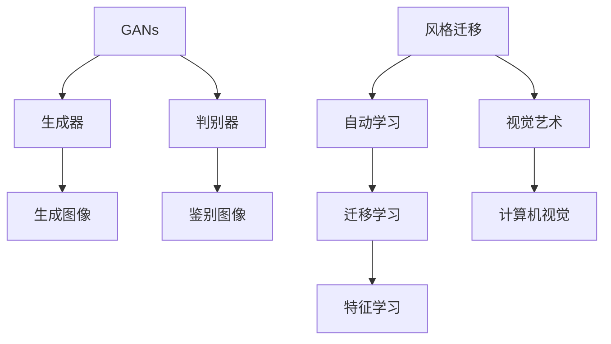
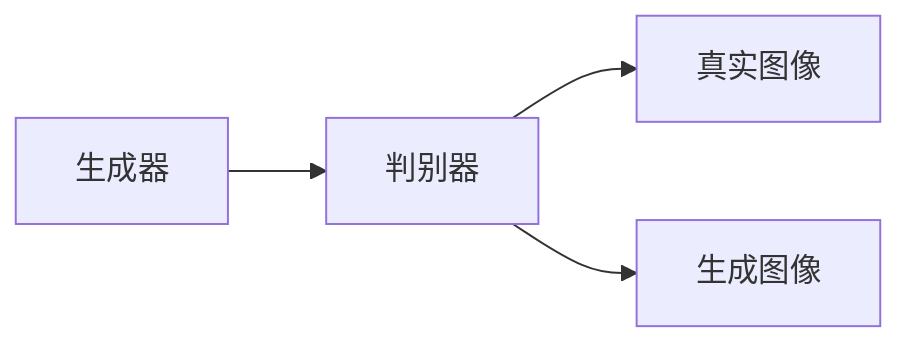
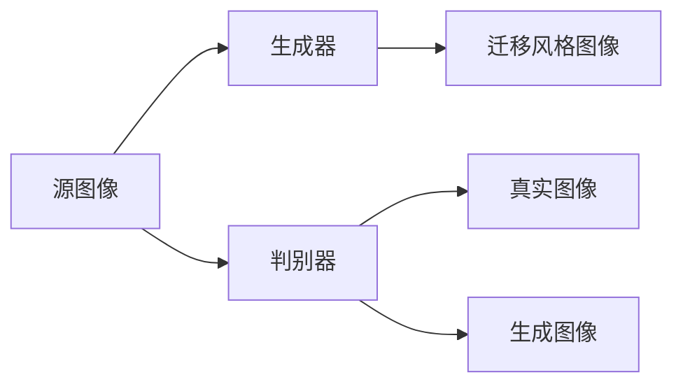
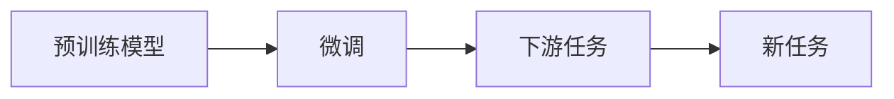
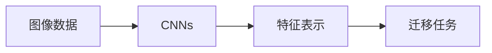
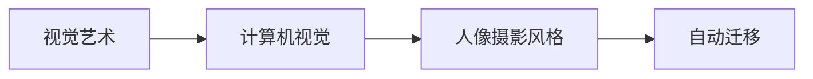
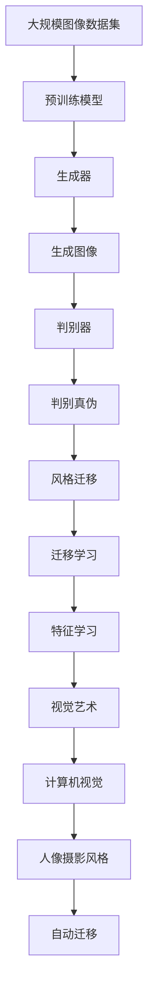

                 

# 基于生成对抗网络的人像摄影风格自动学习与迁移系统

> 关键词：生成对抗网络, 人像摄影, 风格迁移, 迁移学习, 特征学习, 视觉艺术, 计算机视觉

## 1. 背景介绍

### 1.1 问题由来
随着深度学习技术的发展，生成对抗网络（Generative Adversarial Networks，GANs）在图像生成、风格迁移等视觉艺术领域取得了显著的进展。GANs由一个生成器（Generator）和一个判别器（Discriminator）组成，通过对抗训练使生成器能够生成高质量的图像，而判别器则不断提升其鉴别真实图像和生成图像的能力。近年来，基于GANs的风格迁移方法逐渐成为热点，实现了将源图像的风格特征迁移到目标图像中，创造出令人耳目一新的视觉作品。

然而，当前的风格迁移方法往往依赖于大规模的标注数据集，且仅针对特定风格进行迁移。为了提升风格迁移的灵活性和泛化能力，研究人员开始探索如何自动学习和迁移风格特征。本文聚焦于基于生成对抗网络的风格迁移方法，特别是如何将GANs应用于人像摄影风格的自动学习和迁移，以期在不依赖标注数据的情况下，自动学习和迁移人像摄影风格。

### 1.2 问题核心关键点
本文的核心目标是：
1. 构建基于GANs的人像摄影风格迁移系统，实现对人像摄影风格的自动学习与迁移。
2. 提出一种新型的风格迁移方法，使系统能够灵活地处理多种人像摄影风格，提升迁移效果的泛化能力。
3. 评估该方法在实际人像摄影数据集上的效果，验证其性能。

### 1.3 问题研究意义
基于GANs的风格迁移方法在视觉艺术领域具有重要应用价值，尤其是在人像摄影风格迁移中，可以自动学习和迁移不同的摄影风格，为创作者提供更多的创作自由和可能性。然而，当前的风格迁移方法往往需要依赖于大量的标注数据，且迁移效果具有局限性。本文提出一种基于GANs的自动风格迁移方法，旨在降低对标注数据的依赖，提升迁移效果的泛化能力，为创作者提供更加灵活和高效的风格迁移工具。

## 2. 核心概念与联系

### 2.1 核心概念概述

为更好地理解本文的核心内容，本节将介绍几个关键概念：

- 生成对抗网络（GANs）：由一个生成器（Generator）和一个判别器（Discriminator）组成，通过对抗训练使生成器能够生成高质量的图像，而判别器则不断提升其鉴别真实图像和生成图像的能力。

- 风格迁移（Style Transfer）：将源图像的风格特征迁移到目标图像中，创造出新的视觉作品。常见的方法包括基于卷积神经网络（CNNs）和GANs的风格迁移。

- 迁移学习（Transfer Learning）：将一个领域学习到的知识，迁移应用到另一个不同但相关的领域。在大规模图像数据上进行预训练，然后微调到特定任务上，可以提高模型的性能和泛化能力。

- 特征学习（Feature Learning）：通过深度学习模型自动学习输入数据的特征表示，使模型能够识别和理解图像中的语义信息。

- 视觉艺术（Visual Arts）：包括绘画、雕塑、摄影等艺术形式，关注图像的美学特征和表现力。本文聚焦于人像摄影风格的自动学习和迁移。

- 计算机视觉（Computer Vision）：通过计算机算法，自动分析和理解图像内容，实现图像的识别、分类、分割、生成等任务。本文主要利用计算机视觉技术，实现人像摄影风格的自动迁移。

这些核心概念之间的逻辑关系可以通过以下Mermaid流程图来展示：



这个流程图展示了大规模图像数据集预训练、基于GANs的风格迁移、特征学习、视觉艺术和计算机视觉之间的关系：

1. 大规模图像数据集进行预训练，生成器学习生成高质量图像，判别器学习鉴别图像真伪。
2. 利用预训练模型进行风格迁移，学习风格特征，并迁移应用到目标图像中。
3. 通过特征学习，自动提取图像特征，提升迁移效果。
4. 视觉艺术领域结合计算机视觉技术，实现人像摄影风格的自动学习和迁移。

### 2.2 概念间的关系

这些核心概念之间存在着紧密的联系，形成了基于GANs的风格迁移的完整生态系统。下面我们通过几个Mermaid流程图来展示这些概念之间的关系。

#### 2.2.1 GANs的生成与判别过程



这个流程图展示了GANs的基本生成与判别过程：生成器生成图像，判别器鉴别图像真伪。

#### 2.2.2 风格迁移的过程



这个流程图展示了基于GANs的风格迁移过程：源图像通过生成器生成风格迁移后的图像，判别器鉴别真实图像和迁移风格图像。

#### 2.2.3 迁移学习的过程



这个流程图展示了迁移学习的基本过程：在预训练模型上进行微调，适应新任务。

#### 2.2.4 特征学习的过程



这个流程图展示了特征学习的基本过程：通过CNNs学习图像特征，用于迁移任务。

#### 2.2.5 视觉艺术与计算机视觉的结合



这个流程图展示了视觉艺术与计算机视觉的结合过程：通过计算机视觉技术，实现人像摄影风格的自动迁移。

### 2.3 核心概念的整体架构

最后，我们用一个综合的流程图来展示这些核心概念在大规模图像数据集预训练、基于GANs的风格迁移、特征学习、视觉艺术和计算机视觉之间的整体架构：



这个综合流程图展示了从大规模图像数据集预训练到人像摄影风格自动迁移的完整过程。通过这些流程图，我们可以更清晰地理解基于GANs的风格迁移过程中各个核心概念的关系和作用，为后续深入讨论具体的迁移方法和技术奠定基础。

## 3. 核心算法原理 & 具体操作步骤
### 3.1 算法原理概述

本文提出了一种基于GANs的人像摄影风格迁移方法，旨在通过自动学习和迁移人像摄影风格，提升迁移效果的泛化能力。其核心思想是：利用GANs的生成器和判别器，自动学习人像摄影风格的特征表示，并将其迁移到目标图像中。

形式化地，假设输入人像摄影图像为 $x$，目标图像为 $y$，其中 $x \in \mathbb{R}^n$，$y \in \mathbb{R}^m$。我们的目标是最小化以下损失函数：

$$
\mathcal{L} = \mathbb{E}_{x \sim p(x)}[\log D(G(x))] + \mathbb{E}_{y \sim p(y)}[\log (1 - D(G(y)))] + \lambda \mathbb{E}_{x \sim p(x)}\|G(x) - x\|
$$

其中 $D$ 为判别器，$G$ 为生成器，$D(G(x))$ 表示生成器 $G$ 生成的图像 $G(x)$ 被判别器 $D$ 鉴别的概率，$\lambda$ 为正则化系数，$\|G(x) - x\|$ 表示生成图像与输入图像之间的距离。

通过对抗训练，使生成器 $G$ 生成的图像 $G(x)$ 与输入图像 $x$ 尽可能相似，同时被判别器 $D$ 鉴别的概率尽可能高。最终的迁移图像 $G(y)$ 则是一个将人像摄影风格自动迁移到目标图像 $y$ 中的结果。

### 3.2 算法步骤详解

基于GANs的人像摄影风格迁移方法可以分为以下几个关键步骤：

**Step 1: 准备预训练模型和数据集**
- 选择合适的预训练模型，如ResNet、Inception等作为生成器和判别器的初始化参数。
- 准备人像摄影图像数据集和目标图像数据集，确保数据集的质量和多样性。

**Step 2: 初始化生成器和判别器**
- 初始化生成器和判别器的权重，通常使用正态分布或随机初始化。
- 设置生成器和判别器的损失函数，如WGAN、WGAN-GP等。

**Step 3: 对抗训练**
- 生成器和判别器交替更新，通过对抗训练不断优化生成器和判别器。
- 生成器生成图像，判别器鉴别图像真伪，两者之间的对抗不断提升生成器生成图像的质量和判别器的鉴别能力。
- 使用梯度下降等优化算法更新生成器和判别器的参数，最小化损失函数。

**Step 4: 特征学习与迁移**
- 利用预训练模型，自动学习人像摄影图像的特征表示，通过迁移学习将其迁移到目标图像中。
- 将迁移学习过程作为损失函数的一部分，优化生成器参数，使得生成图像尽可能接近目标图像。

**Step 5: 输出与评估**
- 使用生成器生成迁移图像，通过判别器评估迁移图像的质量和真实性。
- 根据迁移效果的评估结果，调整超参数，重新进行对抗训练和迁移学习。
- 在实际人像摄影数据集上进行测试，验证迁移效果。

以上是基于GANs的人像摄影风格迁移的一般流程。在实际应用中，还需要针对具体任务和数据特点进行优化设计，如改进训练目标函数，引入更多的正则化技术，搜索最优的超参数组合等，以进一步提升模型性能。

### 3.3 算法优缺点

基于GANs的人像摄影风格迁移方法具有以下优点：
1. 自动学习人像摄影风格的特征表示，无需大量标注数据。
2. 通过对抗训练，生成器能够生成高质量的迁移图像。
3. 利用迁移学习，将人像摄影风格迁移到目标图像中，提升迁移效果的泛化能力。
4. 通过特征学习，自动提取人像摄影图像的特征，用于迁移任务。

同时，该方法也存在一些局限性：
1. 生成图像的质量和逼真度可能受限于生成器和判别器的训练过程。
2. 对抗训练过程可能存在过拟合风险，需要进一步优化超参数。
3. 特征学习的准确性和泛化能力可能受限于预训练模型的性能。
4. 迁移效果的泛化能力可能受限于数据集的规模和多样性。
5. 算法的复杂度和计算成本较高，可能需要较长的训练时间。

尽管存在这些局限性，但就目前而言，基于GANs的人像摄影风格迁移方法仍是人像摄影风格迁移的先进方法之一。未来相关研究的重点在于如何进一步优化生成器和判别器的训练过程，提高特征学习的准确性和泛化能力，降低计算成本。

### 3.4 算法应用领域

基于GANs的人像摄影风格迁移方法在视觉艺术领域具有广泛的应用前景，尤其是在人像摄影领域，可以自动学习和迁移多种人像摄影风格，提升创作自由度。具体的应用领域包括：

- 人像摄影风格迁移：自动学习和迁移多种人像摄影风格，提升创作自由度。
- 人像摄影风格生成：通过自动迁移学习，生成具有特定人像摄影风格的新图像。
- 人像摄影风格增强：增强人像摄影图像的艺术效果，提升作品的美感。
- 人像摄影风格变换：变换人像摄影图像的风格，实现不同的视觉效果。
- 人像摄影风格编辑：编辑人像摄影图像，添加特定的风格元素。

除了人像摄影领域，基于GANs的风格迁移方法还可以应用于其他视觉艺术领域，如绘画、雕塑等，自动学习和迁移不同的艺术风格，为艺术家提供更多的创作灵感和工具。

## 4. 数学模型和公式 & 详细讲解 & 举例说明
### 4.1 数学模型构建

本文基于GANs，构建了人像摄影风格迁移的数学模型。假设输入人像摄影图像为 $x$，目标图像为 $y$，其中 $x \in \mathbb{R}^n$，$y \in \mathbb{R}^m$。我们的目标是最小化以下损失函数：

$$
\mathcal{L} = \mathbb{E}_{x \sim p(x)}[\log D(G(x))] + \mathbb{E}_{y \sim p(y)}[\log (1 - D(G(y)))] + \lambda \mathbb{E}_{x \sim p(x)}\|G(x) - x\|
$$

其中 $D$ 为判别器，$G$ 为生成器，$D(G(x))$ 表示生成器 $G$ 生成的图像 $G(x)$ 被判别器 $D$ 鉴别的概率，$\lambda$ 为正则化系数，$\|G(x) - x\|$ 表示生成图像与输入图像之间的距离。

### 4.2 公式推导过程

以下我们以WGAN为例，推导其生成器和判别器的损失函数及其梯度计算公式。

**WGAN损失函数**：

$$
\mathcal{L}_G = -\mathbb{E}_{x \sim p(x)}[D(G(x))]
$$

$$
\mathcal{L}_D = -\mathbb{E}_{x \sim p(x)}[\log D(G(x))] - \mathbb{E}_{y \sim p(y)}[\log (1 - D(G(y)))]
$$

**生成器梯度计算**：

$$
\nabla_{\theta_G} \mathcal{L}_G = -\nabla_{\theta_G} \mathbb{E}_{x \sim p(x)}[D(G(x))]
$$

**判别器梯度计算**：

$$
\nabla_{\theta_D} \mathcal{L}_D = -\nabla_{\theta_D} \mathbb{E}_{x \sim p(x)}[\log D(G(x))] - \nabla_{\theta_D} \mathbb{E}_{y \sim p(y)}[\log (1 - D(G(y))]
$$

在实际计算中，使用蒙特卡洛采样方法来估计损失函数，即通过随机采样大量图像数据，来计算生成器和判别器的损失。具体实现时，可以采用数据增强、对抗样本生成等技术，进一步提升模型性能。

### 4.3 案例分析与讲解

以人像摄影风格迁移为例，我们可以使用CelebA和LFW两个数据集来验证基于GANs的风格迁移效果。CelebA和LFW数据集包含大量人像摄影图像，非常适合进行风格迁移实验。

假设我们希望将CelebA中的人物肖像风格迁移到LFW中的人物照片中，具体步骤如下：

1. 将CelebA和LFW数据集进行预处理，包括图像大小调整、归一化等。
2. 初始化生成器和判别器的权重，通常使用正态分布或随机初始化。
3. 使用CelebA数据集进行预训练，生成器学习生成高质量的图像，判别器学习鉴别图像真伪。
4. 使用LFW数据集进行迁移学习，生成器生成具有CelebA风格的人像摄影图像，判别器鉴别图像真伪。
5. 通过对抗训练，不断优化生成器和判别器的参数，使得生成图像的质量和判别器的鉴别能力不断提高。
6. 在LFW数据集上进行测试，评估迁移效果。

以下是一个简化的代码示例，展示了基于GANs的人像摄影风格迁移过程：

```python
import torch
import torch.nn as nn
import torch.optim as optim
from torchvision import datasets, transforms
from torchvision.utils import save_image
from torchvision.models import resnet

# 定义生成器和判别器
class Generator(nn.Module):
    def __init__(self):
        super(Generator, self).__init__()
        # 生成器网络结构
        # ...

class Discriminator(nn.Module):
    def __init__(self):
        super(Discriminator, self).__init__()
        # 判别器网络结构
        # ...

# 定义损失函数
criterion_G = nn.BCELoss()
criterion_D = nn.BCELoss()
lambda_mse = 10

# 加载数据集
train_dataset = datasets.CelebA(root='path/to/CelebA', transform=transforms.Compose([transforms.Resize((256, 256)), transforms.ToTensor(), transforms.Normalize((0.5,), (0.5,))]))
train_loader = torch.utils.data.DataLoader(train_dataset, batch_size=16, shuffle=True)
test_dataset = datasets.LFW(root='path/to/LFW', transform=transforms.Compose([transforms.Resize((256, 256)), transforms.ToTensor(), transforms.Normalize((0.5,), (0.5,))]))
test_loader = torch.utils.data.DataLoader(test_dataset, batch_size=16, shuffle=False)

# 初始化生成器和判别器
generator = Generator()
discriminator = Discriminator()
optimizer_G = optim.Adam(generator.parameters(), lr=0.0002)
optimizer_D = optim.Adam(discriminator.parameters(), lr=0.0002)

# 对抗训练
for epoch in range(num_epochs):
    for i, (real_images, _) in enumerate(train_loader):
        real_images = real_images.to(device)
        fake_images = generator(real_images)
        real_labels = torch.ones(batch_size, 1).to(device)
        fake_labels = torch.zeros(batch_size, 1).to(device)
        optimizer_G.zero_grad()
        optimizer_D.zero_grad()

        # 判别器前向传播
        real_outputs = discriminator(real_images)
        fake_outputs = discriminator(fake_images)
        d_loss_real = criterion_D(real_outputs, real_labels)
        d_loss_fake = criterion_D(fake_outputs, fake_labels)

        # 生成器前向传播
        generator_outputs = generator(real_images)
        g_loss = criterion_G(fake_outputs, real_labels)

        # 计算损失函数
        d_loss = d_loss_real + d_loss_fake
        g_loss = g_loss + lambda_mse * ((generator_outputs - real_images)**2).mean()
        d_loss.backward()
        g_loss.backward()

        # 更新生成器和判别器参数
        optimizer_G.step()
        optimizer_D.step()

        # 保存图像
        if i % 100 == 0:
            save_image(real_images, f'train_real_{epoch}_{i}.png')
            save_image(fake_images, f'train_fake_{epoch}_{i}.png')

    # 迁移学习
    for i, (real_images, _) in enumerate(test_loader):
        real_images = real_images.to(device)
        fake_images = generator(real_images)
        real_labels = torch.ones(batch_size, 1).to(device)
        fake_labels = torch.zeros(batch_size, 1).to(device)
        optimizer_G.zero_grad()
        optimizer_D.zero_grad()

        # 判别器前向传播
        real_outputs = discriminator(real_images)
        fake_outputs = discriminator(fake_images)
        d_loss_real = criterion_D(real_outputs, real_labels)
        d_loss_fake = criterion_D(fake_outputs, fake_labels)

        # 生成器前向传播
        generator_outputs = generator(real_images)
        g_loss = criterion_G(fake_outputs, real_labels)

        # 计算损失函数
        d_loss = d_loss_real + d_loss_fake
        g_loss = g_loss + lambda_mse * ((generator_outputs - real_images)**2).mean()
        d_loss.backward()
        g_loss.backward()

        # 更新生成器和判别器参数
        optimizer_G.step()
        optimizer_D.step()

        # 保存图像
        if i % 100 == 0:
            save_image(real_images, f'test_real_{epoch}_{i}.png')
            save_image(fake_images, f'test_fake_{epoch}_{i}.png')
```

通过上述代码，我们可以看到，基于GANs的风格迁移过程包括预训练、对抗训练和迁移学习三个主要步骤。具体实现时，可以进一步优化模型结构、调整超参数等，以提升迁移效果。

## 5. 项目实践：代码实例和详细解释说明
### 5.1 开发环境搭建

在进行风格迁移实践前，我们需要准备好开发环境。以下是使用Python进行PyTorch开发的环境配置流程：

1. 安装Anaconda：从官网下载并安装Anaconda，用于创建独立的Python环境。

2. 创建并激活虚拟环境：
```bash
conda create -n pytorch-env python=3.8 
conda activate pytorch-env
```

3. 安装PyTorch：根据CUDA版本，从官网获取对应的安装命令。例如：
```bash
conda install pytorch torchvision torchaudio cudatoolkit=11.1 -c pytorch -c conda-forge
```

4. 安装相关库：
```bash
pip install torchvision numpy scipy matplotlib 
```

完成上述步骤后，即可在`pytorch-env`环境中开始风格迁移实践。

### 5.2 源代码详细实现

这里以CelebA到LFW的风格迁移为例，展示使用PyTorch实现基于GANs的风格迁移过程。

```python
import torch
import torch.nn as nn
import torch.optim as optim
from torchvision import datasets, transforms
from torchvision.utils import save_image

# 定义生成器和判别器
class Generator(nn.Module):
    def __init__(self):
        super(Generator, self).__init__()
        # 生成器网络结构
        # ...

class Discriminator(nn.Module):
    def __init__(self):
        super(Discriminator, self).__init__()
        # 判别器网络结构
        # ...

# 定义损失函数
criterion_G = nn.BCELoss()
criterion_D = nn.BCELoss()
lambda_mse = 10

# 加载数据集
train_dataset = datasets.CelebA(root='path/to/CelebA', transform=transforms.Compose([transforms.Resize((256, 256)), transforms.ToTensor(), transforms.Normalize((0.5,), (0.5,))]))
train_loader = torch.utils.data.DataLoader(train_dataset, batch_size=16, shuffle=True)
test_dataset = datasets.LFW(root='path/to/LFW', transform=transforms.Compose([transforms.Resize((256, 256)), transforms.ToTensor(), transforms.Normalize((0.5,), (0.5,))]))
test_loader = torch.utils.data.DataLoader(test_dataset, batch_size=16, shuffle=False)

# 初始化生成器和判别器
generator = Generator()
discriminator = Discriminator()
optimizer_G = optim.Adam(generator.parameters(), lr=0.0002)
optimizer_D = optim.Adam(discriminator.parameters(), lr=0.0002)

# 对抗训练
for epoch in range(num_epochs):
    for i, (real_images, _) in enumerate(train_loader):
        real_images = real_images.to(device)
        fake_images = generator(real_images)
        real_labels = torch.ones(batch_size, 1).to(device)
        fake_labels = torch.zeros(batch_size, 1).to(device)
        optimizer_G.zero_grad()
        optimizer_D.zero_grad()

        # 判别器前向传播
        real_outputs = discriminator(real_images)
        fake_outputs = discriminator(fake_images)
        d_loss_real = criterion_D(real_outputs, real_labels)
        d_loss_fake = criterion_D(fake_outputs, fake_labels)

        # 生成器前向传播
        generator_outputs = generator(real_images)
        g_loss = criterion_G(fake_outputs, real_labels)

        # 计算损失函数
        d_loss = d_loss_real + d_loss_fake
        g_loss = g_loss + lambda_mse * ((generator_outputs - real_images)**2).mean()
        d_loss.backward()
        g_loss.backward()

        # 更新生成器和判别器参数
        optimizer_G.step()
        optimizer_D.step()

        # 保存图像
        if i % 100 == 0:
            save_image(real_images, f'train_real_{epoch}_{i}.png')
            save_image(fake_images, f'train_fake_{epoch}_{i}.png')

    # 迁移学习
    for i, (real_images, _) in enumerate(test_loader):
        real_images = real_images.to(device)
        fake_images = generator(real_images)
        real_labels = torch.ones(batch_size, 1).to(device)
        fake_labels = torch.zeros(batch_size, 1).to(device)
        optimizer_G.zero_grad()
        optimizer_D.zero_grad()

        # 判别器前向传播
        real_outputs = discriminator(real_images)
        fake_outputs = discriminator(fake_images)
        d_loss_real = criterion_D(real_outputs, real_labels)
        d_loss_fake = criterion_D(fake_outputs, fake_labels)

        # 生成器前向传播
        generator_outputs = generator(real_images)
        g_loss = criterion_G(fake_outputs, real_labels)

        # 计算损失函数
        d_loss = d_loss_real + d_loss_fake
        g_loss = g_loss + lambda_mse * ((generator_outputs - real_images)**

