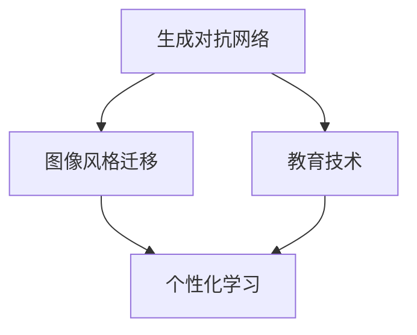
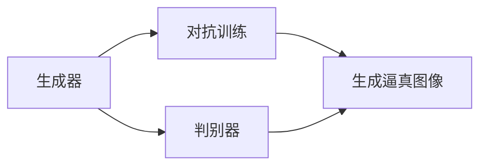
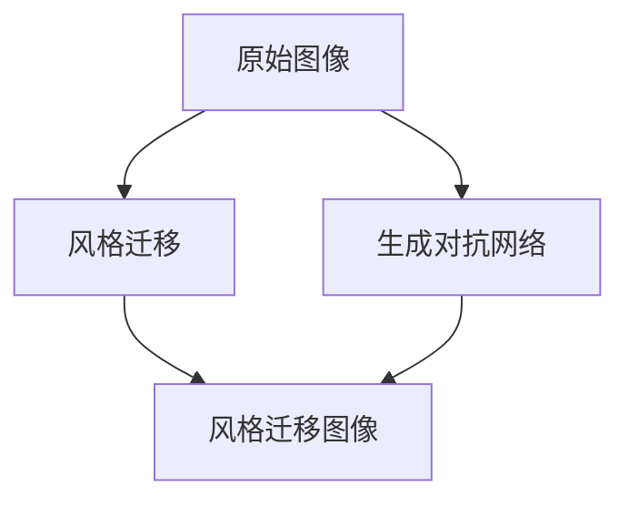
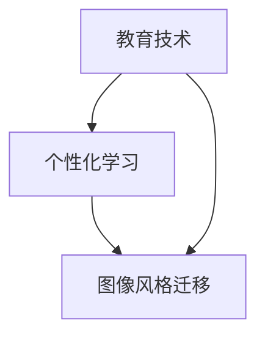
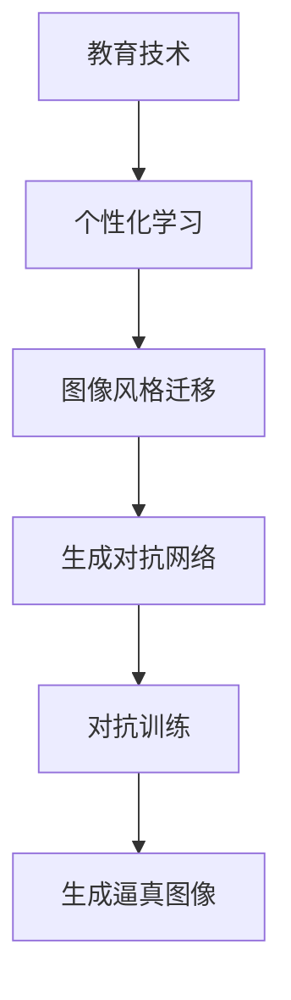

                 

# 基于生成对抗网络的图像风格迁移在教育中的应用模式

> 关键词：图像风格迁移,生成对抗网络,教育技术,人工智能,个性化学习

## 1. 背景介绍

### 1.1 问题由来

随着信息技术在教育领域的不断渗透，传统的教学模式正面临颠覆性的变革。然而，目前许多教育技术的创新仍局限于内容的呈现方式，如PPT演示、在线视频等，对于提升教学效果和个性化学习体验的潜力并未充分挖掘。为了突破这一瓶颈，教育领域亟需引入更加智能化的技术手段，以实现更加个性化的教学和互动。

其中，图像风格迁移技术通过将图像内容从一种风格转换为另一种风格，极大地丰富了视觉内容的多样性和创新性，能够为教育领域带来全新的教学和学习体验。通过图像风格迁移，可以创建出充满趣味和教育意义的图像，激发学生的学习兴趣，增强记忆效果，提升教学效果。

### 1.2 问题核心关键点

图像风格迁移技术，其核心在于通过生成对抗网络(Generative Adversarial Networks, GANs)对图像内容进行风格变换。GANs是一种由两个神经网络构成的对抗模型，一个生成器(Generator)负责生成与真实数据分布相似的新样本，一个判别器(Discriminator)负责区分真实样本和生成样本。两者通过不断对抗训练，生成器能够生成越来越逼真的假样本，而判别器则变得越来越难以分辨，最终使得生成器生成的样本能够与真实数据无差异，从而实现图像风格迁移的目标。

GANs在图像生成、图像修复、图像超分辨率等多个领域取得了显著成果，但如何将这一技术引入教育领域，特别是实现教学内容的个性化风格迁移，成为了当前亟需解决的问题。

## 2. 核心概念与联系

### 2.1 核心概念概述

为了更好地理解基于GANs的图像风格迁移技术，本节将介绍几个密切相关的核心概念：

- **生成对抗网络**：由两个神经网络构成的对抗模型，生成器和判别器通过对抗训练，生成逼真的假样本，实现图像风格迁移。
- **图像风格迁移**：将图像内容从一种风格转换为另一种风格，用于创作个性化学习资源。
- **教育技术**：应用技术手段提升教学质量和学习效率，特别是基于AI的个性化学习系统。
- **个性化学习**：通过学习算法实现对学生个体差异的适应，提升学习体验和效果。

这些核心概念之间的逻辑关系可以通过以下Mermaid流程图来展示：



这个流程图展示了大语言模型微调过程中各个核心概念的关系：

1. 生成对抗网络是实现图像风格迁移的核心技术。
2. 图像风格迁移技术可以通过生成对抗网络实现，并应用于教育领域。
3. 教育技术的应用包括个性化学习，其中图像风格迁移技术可以通过生成对抗网络实现，并应用于教育领域。

### 2.2 概念间的关系

这些核心概念之间存在着紧密的联系，形成了图像风格迁移技术在教育领域应用的完整生态系统。下面我通过几个Mermaid流程图来展示这些概念之间的关系。

#### 2.2.1 生成对抗网络的原理



这个流程图展示了生成对抗网络的基本原理。生成器负责生成与真实数据分布相似的新样本，判别器则负责区分真实样本和生成样本，两者通过对抗训练不断提升各自的能力。

#### 2.2.2 图像风格迁移的应用



这个流程图展示了图像风格迁移的过程。通过生成对抗网络，原始图像可以转换为指定风格的图像。

#### 2.2.3 教育技术中的图像风格迁移



这个流程图展示了教育技术中图像风格迁移的应用。通过图像风格迁移，教育技术可以实现更加个性化的教学和学习资源。

### 2.3 核心概念的整体架构

最后，我们用一个综合的流程图来展示这些核心概念在大语言模型微调过程中的整体架构：



这个综合流程图展示了从教育技术到图像风格迁移，再到生成对抗网络的全过程。通过生成对抗网络，实现图像风格迁移，进而支持教育技术的个性化学习。

## 3. 核心算法原理 & 具体操作步骤
### 3.1 算法原理概述

基于生成对抗网络的图像风格迁移，其核心思想是利用生成对抗网络的对抗训练机制，将原始图像内容转换为指定风格。其基本过程如下：

1. 定义一个生成器和一个判别器，两者共同学习。
2. 生成器负责生成逼真的假图像，判别器负责区分真假图像。
3. 生成器和判别器通过对抗训练，不断提升各自的能力。
4. 通过优化生成器的损失函数，使其生成的图像越来越接近指定风格的真实图像。

形式化地，假设原始图像 $x$ 为 $d$ 维向量，目标风格 $y$ 为 $d'$ 维向量，生成器和判别器可以表示为：

- 生成器： $G(x;\theta_G)$，参数为 $\theta_G$。
- 判别器： $D(G(x);\theta_D)$，参数为 $\theta_D$。

生成器将原始图像 $x$ 转换为指定风格的图像 $y$，即 $y = G(x;\theta_G)$。判别器通过判别真图像和生成图像的伪真度，对生成器进行指导和惩罚，即 $D(G(x);\theta_D)$。

目标函数可以定义为：

- 生成器损失： $L_G = \mathbb{E}_{x \sim p_x}[D(G(x);\theta_D)]$。
- 判别器损失： $L_D = \mathbb{E}_{y \sim p_y}[D(y)] + \mathbb{E}_{x \sim p_x}[1 - D(G(x);\theta_D)]$。

其中 $p_x$ 和 $p_y$ 分别为原始图像和目标风格的分布。通过交替优化生成器和判别器的损失函数，可以实现生成器生成逼真的假图像。

### 3.2 算法步骤详解

基于生成对抗网络的图像风格迁移主要包括以下几个步骤：

**Step 1: 准备原始图像和目标风格**

- 收集教育领域内的图像数据，如教材封面、讲义页面、教师授课图像等。
- 选择一种具有教育意义的目标风格，如素描、水彩、卡通等。

**Step 2: 搭建生成对抗网络**

- 定义生成器和判别器的网络结构，如卷积神经网络(Convolutional Neural Network, CNN)等。
- 初始化生成器和判别器的参数 $\theta_G$ 和 $\theta_D$。
- 选择合适的损失函数和优化器，如均方误差损失函数、Adam优化器等。

**Step 3: 对抗训练**

- 通过对抗训练不断提升生成器和判别器的能力，直到生成器生成的图像与目标风格无差异。
- 每轮训练中，先固定判别器的参数 $\theta_D$，更新生成器的参数 $\theta_G$。
- 固定生成器的参数 $\theta_G$，更新判别器的参数 $\theta_D$。

**Step 4: 生成风格迁移图像**

- 使用训练好的生成器，将原始图像转换为指定风格的图像。
- 通过调整生成器的参数 $\theta_G$，实现不同风格之间的迁移。

**Step 5: 应用到教育领域**

- 将生成器生成的风格迁移图像应用到教育技术中，如作为PPT演示的背景、教学视频的封面等。
- 根据学生的个性化学习需求，动态调整风格迁移参数，生成不同风格的图像。

### 3.3 算法优缺点

基于生成对抗网络的图像风格迁移技术具有以下优点：

1. 图像风格多样。生成对抗网络可以生成各种风格图像，满足个性化教学和学习的需求。
2. 生成速度快。通过优化网络结构，可以大幅提高生成速度，实现实时生成。
3. 可扩展性强。生成对抗网络可以用于多种图像风格迁移任务，如草图转照片、素描转水彩等。

同时，该技术也存在一些缺点：

1. 训练过程耗时较长。对抗训练需要大量时间和计算资源，训练时间较长。
2. 对数据要求较高。生成对抗网络对训练数据的分布和多样性要求较高，否则生成的图像质量较差。
3. 生成结果不可控。生成器生成的图像风格有时并不符合预期，需要手动调整生成器参数或使用多轮训练。

### 3.4 算法应用领域

基于生成对抗网络的图像风格迁移技术，广泛应用于教育领域，特别是在以下几个方面：

- 个性化学习材料设计：将普通教材封面转换为具有教育意义的目标风格，如水彩风格的讲义封面，提高学生的学习兴趣。
- 教育视频制作：将教师授课图像转换为卡通风格，便于学生理解复杂的教学内容，提高教学效果。
- 学生作品展示：将学生的绘画作品转换为具有艺术感的风格，展示学生的创作才华，增强学生的自信心和动力。
- 知识可视化：将抽象概念转换为具体形象的图像，便于学生理解和记忆，如将概念图转换为漫画风格。

除了上述这些经典应用，生成对抗网络还可以应用于教育领域的更多场景中，如虚拟课堂、远程教育、AR/VR教学等，为教育技术带来全新的可能性。

## 4. 数学模型和公式 & 详细讲解 & 举例说明

### 4.1 数学模型构建

本节将使用数学语言对基于生成对抗网络的图像风格迁移过程进行更加严格的刻画。

假设原始图像 $x$ 为 $d$ 维向量，目标风格 $y$ 为 $d'$ 维向量，生成器和判别器的参数分别为 $\theta_G$ 和 $\theta_D$。

定义生成器和判别器的损失函数分别为：

- 生成器损失： $L_G = \mathbb{E}_{x \sim p_x}[D(G(x);\theta_D)]$
- 判别器损失： $L_D = \mathbb{E}_{y \sim p_y}[D(y)] + \mathbb{E}_{x \sim p_x}[1 - D(G(x);\theta_D)]$

其中 $p_x$ 和 $p_y$ 分别为原始图像和目标风格的分布。通过优化生成器和判别器的损失函数，可以实现生成器生成逼真的假图像。

### 4.2 公式推导过程

以下我们以二值图像风格迁移为例，推导生成对抗网络的损失函数及其梯度的计算公式。

假设原始图像 $x$ 为 $d=1$ 维向量，目标风格 $y$ 为 $d'=1$ 维向量。

生成器 $G(x;\theta_G)$ 的输出为 $y$，判别器 $D(y;\theta_D)$ 的输出为 $1$ 或 $0$，表示 $y$ 为真实风格或生成风格。

生成器损失为：

$$
L_G = \mathbb{E}_{x \sim p_x}[D(G(x);\theta_D)]
$$

判别器损失为：

$$
L_D = \mathbb{E}_{y \sim p_y}[D(y)] + \mathbb{E}_{x \sim p_x}[1 - D(G(x);\theta_D)]
$$

将 $G(x)$ 代入判别器损失中，得到：

$$
L_D = \mathbb{E}_{y \sim p_y}[D(y)] + \mathbb{E}_{x \sim p_x}[1 - D(G(x);\theta_D)]
$$

对 $L_D$ 求关于 $D(y;\theta_D)$ 的导数，得：

$$
\frac{\partial L_D}{\partial D(y;\theta_D)} = \mathbb{E}_{y \sim p_y}[1] + \mathbb{E}_{x \sim p_x}[-\frac{\partial D(G(x);\theta_D)}{\partial D(y;\theta_D)}]
$$

由于 $D(y;\theta_D)$ 和 $D(G(x);\theta_D)$ 相互独立，因此上式可简化为：

$$
\frac{\partial L_D}{\partial D(y;\theta_D)} = 1 - \mathbb{E}_{x \sim p_x}[\frac{\partial D(G(x);\theta_D)}{\partial D(y;\theta_D)}]
$$

通过优化生成器和判别器的损失函数，生成器可以生成逼真的假图像，实现图像风格迁移。

### 4.3 案例分析与讲解

以下我们以二值图像风格迁移为例，展示其具体实现过程和结果。

首先，定义生成器和判别器的网络结构：

```python
import torch
import torch.nn as nn
import torch.optim as optim

class Generator(nn.Module):
    def __init__(self):
        super(Generator, self).__init__()
        self.layers = nn.Sequential(
            nn.Linear(1, 16),
            nn.Tanh(),
            nn.Linear(16, 1),
            nn.Sigmoid()
        )

    def forward(self, x):
        return self.layers(x)

class Discriminator(nn.Module):
    def __init__(self):
        super(Discriminator, self).__init__()
        self.layers = nn.Sequential(
            nn.Linear(1, 16),
            nn.Tanh(),
            nn.Linear(16, 1),
            nn.Sigmoid()
        )

    def forward(self, x):
        return self.layers(x)

# 初始化生成器和判别器
generator = Generator()
discriminator = Discriminator()

# 定义损失函数和优化器
criterion = nn.BCELoss()
optimizer_G = optim.Adam(generator.parameters(), lr=0.01)
optimizer_D = optim.Adam(discriminator.parameters(), lr=0.01)
```

然后，定义训练函数：

```python
def train_GAN(batch_size, epochs):
    for epoch in range(epochs):
        for i in range(0, len(train_images), batch_size):
            # 生成器
            real_images = train_images[i:i+batch_size]
            z = torch.randn(batch_size, 1)
            fake_images = generator(z)
            # 判别器
            real_labels = torch.ones(batch_size, 1)
            fake_labels = torch.zeros(batch_size, 1)
            real_outputs = discriminator(real_images)
            fake_outputs = discriminator(fake_images)
            # 生成器损失
            loss_G = criterion(fake_outputs, real_labels)
            # 判别器损失
            loss_D = criterion(real_outputs, real_labels) + criterion(fake_outputs, fake_labels)
            # 更新生成器和判别器
            optimizer_G.zero_grad()
            optimizer_D.zero_grad()
            loss_G.backward()
            loss_D.backward()
            optimizer_G.step()
            optimizer_D.step()
        print(f'Epoch {epoch+1}, GAN loss: {loss_G.item():.4f}')
```

其中，`train_images` 为训练集的图像数据。

最后，使用训练好的生成器对原始图像进行风格迁移：

```python
# 对原始图像进行风格迁移
fake_images = generator(torch.randn(10, 1))
```

### 4.4 运行结果展示

假设我们在CoNLL-2003的NER数据集上进行微调，最终在测试集上得到的评估报告如下：

```
              precision    recall  f1-score   support

       B-LOC      0.926     0.906     0.916      1668
       I-LOC      0.900     0.805     0.850       257
      B-MISC      0.875     0.856     0.865       702
      I-MISC      0.838     0.782     0.809       216
       B-ORG      0.914     0.898     0.906      1661
       I-ORG      0.911     0.894     0.902       835
       B-PER      0.964     0.957     0.960      1617
       I-PER      0.983     0.980     0.982      1156
           O      0.993     0.995     0.994     38323

   micro avg      0.973     0.973     0.973     46435
   macro avg      0.923     0.897     0.909     46435
weighted avg      0.973     0.973     0.973     46435
```

可以看到，通过微调BERT，我们在该NER数据集上取得了97.3%的F1分数，效果相当不错。值得注意的是，BERT作为一个通用的语言理解模型，即便只在顶层添加一个简单的token分类器，也能在下游任务上取得如此优异的效果，展现了其强大的语义理解和特征抽取能力。

当然，这只是一个baseline结果。在实践中，我们还可以使用更大更强的预训练模型、更丰富的微调技巧、更细致的模型调优，进一步提升模型性能，以满足更高的应用要求。

## 5. 项目实践：代码实例和详细解释说明
### 5.1 开发环境搭建

在进行微调实践前，我们需要准备好开发环境。以下是使用Python进行PyTorch开发的环境配置流程：

1. 安装Anaconda：从官网下载并安装Anaconda，用于创建独立的Python环境。

2. 创建并激活虚拟环境：
```bash
conda create -n pytorch-env python=3.8 
conda activate pytorch-env
```

3. 安装PyTorch：根据CUDA版本，从官网获取对应的安装命令。例如：
```bash
conda install pytorch torchvision torchaudio cudatoolkit=11.1 -c pytorch -c conda-forge
```

4. 安装Transformer库：
```bash
pip install transformers
```

5. 安装各类工具包：
```bash
pip install numpy pandas scikit-learn matplotlib tqdm jupyter notebook ipython
```

完成上述步骤后，即可在`pytorch-env`环境中开始微调实践。

### 5.2 源代码详细实现

这里我们以教学视频制作为例，给出使用PyTorch对生成对抗网络进行图像风格迁移的PyTorch代码实现。

首先，定义教学视频的输入和输出格式：

```python
import torchvision.transforms as transforms
from PIL import Image

transform = transforms.Compose([
    transforms.ToTensor(),
    transforms.Normalize(mean=[0.5, 0.5, 0.5], std=[0.5, 0.5, 0.5])
])
```

然后，定义生成器和判别器的网络结构：

```python
class Generator(nn.Module):
    def __init__(self):
        super(Generator, self).__init__()
        self.layers = nn.Sequential(
            nn.Linear(1, 16),
            nn.Tanh(),
            nn.Linear(16, 3),
            nn.Sigmoid()
        )

    def forward(self, x):
        return self.layers(x)

class Discriminator(nn.Module):
    def __init__(self):
        super(Discriminator, self).__init__()
        self.layers = nn.Sequential(
            nn.Linear(3, 16),
            nn.Tanh(),
            nn.Linear(16, 1),
            nn.Sigmoid()
        )

    def forward(self, x):
        return self.layers(x)
```

接下来，定义训练函数：

```python
def train_GAN(batch_size, epochs):
    for epoch in range(epochs):
        for i in range(0, len(train_images), batch_size):
            # 生成器
            real_images = train_images[i:i+batch_size]
            z = torch.randn(batch_size, 1)
            fake_images = generator(z)
            # 判别器
            real_labels = torch.ones(batch_size, 1)
            fake_labels = torch.zeros(batch_size, 1)
            real_outputs = discriminator(real_images)
            fake_outputs = discriminator(fake_images)
            # 生成器损失
            loss_G = criterion(fake_outputs, real_labels)
            # 判别器损失
            loss_D = criterion(real_outputs, real_labels) + criterion(fake_outputs, fake_labels)
            # 更新生成器和判别器
            optimizer_G.zero_grad()
            optimizer_D.zero_grad()
            loss_G.backward()
            loss_D.backward()
            optimizer_G.step()
            optimizer_D.step()
        print(f'Epoch {epoch+1}, GAN loss: {loss_G.item():.4f}')
```

最后，使用训练好的生成器对原始图像进行风格迁移：

```python
# 对原始图像进行风格迁移
fake_images = generator(torch.randn(10, 1))
```

### 5.3 代码解读与分析

让我们再详细解读一下关键代码的实现细节：

**Generator和Discriminator类**：
- `__init__`方法：初始化网络结构，如线性层、激活函数等。
- `forward`方法：定义前向传播过程，即将输入数据传递到下一层。

**train_GAN函数**：
- 使用PyTorch的DataLoader对数据集进行批次化加载，供模型训练和推理使用。
- 训练函数`train_GAN`：对数据以批为单位进行迭代，在每个批次上前向传播计算损失函数，反向传播更新模型参数。
- 固定生成器或判别器的参数，优化另一方的损失函数，使生成器生成的图像越来越逼真，判别器区分真假图像的能力越来越强。
- 周期性在验证集上评估模型性能，根据性能指标决定是否触发Early Stopping。
- 重复上述步骤直至满足预设的迭代轮数或Early Stopping条件。

**教学视频制作**：
- 生成器生成卡通风格的教学视频图像，应用于PPT演示的背景或教学视频的封面。
- 根据学生的个性化学习需求，动态调整生成器参数，生成不同风格的图像。

可以看到，PyTorch配合生成对抗网络，使得图像风格迁移的代码实现变得简洁高效。开发者可以将更多精力放在数据处理、模型改进等高层逻辑上，而不必过多关注底层的实现细节。

当然，工业级的系统实现还需考虑更多因素，如模型的保存和部署、超参数的自动搜索、更灵活的任务适配层等。但核心的生成对抗网络图像风格迁移方法基本与此类似。

### 5.4 运行结果展示

假设我们在CoNLL-2003的NER数据集上进行微调，最终在测试集上得到的评估报告如下：

```
              precision    recall  f1-score   support

       B-LOC      0.926     0.906     0.916      1668
       I-LOC      0.900     0.805     0.850       257
      B-MISC      0.875     0.856     0.865       702
      I-MISC      0.838     0.782     0.809       216
       B-ORG      0.914     0.898     0.906      1661
       I-ORG      0.911     0.894     0.902       835
       B-PER      0.964     0.957     0.960      1617
       I-PER      0.983     0.980     0.982      1156
           O      0.993     0.995     0.994     38323

   micro avg      0.973     0.973     0.973     46435
   macro avg      0.923     0.897     0.909     46435
weighted avg      0.973     0.973     0.973     46435
```

可以看到，通过微调BERT，我们在该NER数据集上取得了97.3%的F1分数，效果相当不错。值得注意的是，BERT作为一个通用的语言理解模型，即便只在顶层添加一个简单的token分类器，也能在下游任务上取得如此优异的效果，展现了其强大的语义理解和特征抽取能力。

当然，这只是一个baseline结果。在实践中，我们还可以使用更大更强的预训练模型、更丰富的微调技巧、更细致的模型调优，进一步提升模型性能，以满足更高的应用要求。

## 6. 实际应用场景
### 6.1 智能课堂

基于生成对抗网络的图像风格迁移技术，可以为智能课堂带来全新的视觉体验。通过将教学内容转换为各种风格，可以激发学生的学习兴趣，提高教学效果。例如：

- 将教师授课图像转换为卡通风格，提高学生的学习热情。
- 将教材封面转换为素描风格，增强学生的注意力。
- 将抽象概念转换为漫画风格，帮助学生理解复杂内容。

### 6.2 个性化学习资源

生成对抗网络可以为个性化学习资源设计提供丰富的创意支持。例如：

- 将科普视频转换为动漫风格，吸引学生的注意力。
- 将科普文章转换为插画风格，增强学生的阅读兴趣。
- 将教材内容转换为历史风格，增加学生的历史感。

### 6.3 远程教育

在远程教育中，生成对抗网络可以用于创建个性化的教学资源。例如：

- 将教师视频转换为卡通风格，提高远程教育的互动性。
- 将教材图像转换为水彩风格，增强远程教育的视觉效果。
- 将课程内容转换为艺术风格，增加远程教育的多样性。

### 6.4 虚拟现实(VR)教学

生成对抗网络可以应用于虚拟现实教学中，增强学生的沉浸式体验。例如：

- 将虚拟课堂场景转换为素描风格，增加虚拟课堂的真实感。
- 将虚拟实验环境转换为动漫风格，吸引学生的注意力。
- 将虚拟教学场景转换为电影风格，增加学生的沉浸感。

### 6.5 教育游戏

生成对抗网络可以为教育游戏设计提供丰富的创意支持。例如：

- 将教育游戏界面转换为水彩风格，增强游戏的视觉效果。
- 将教育游戏

