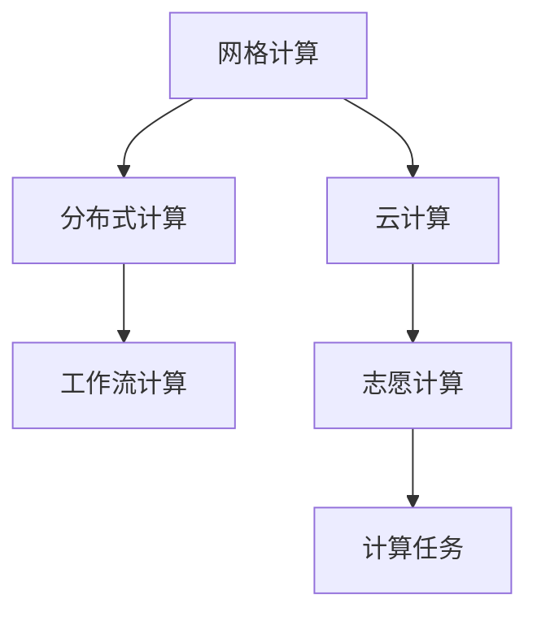
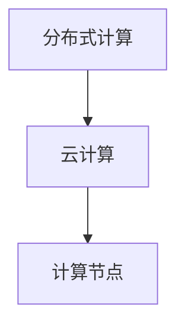
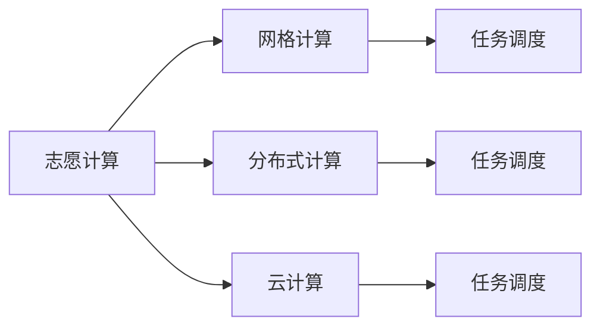
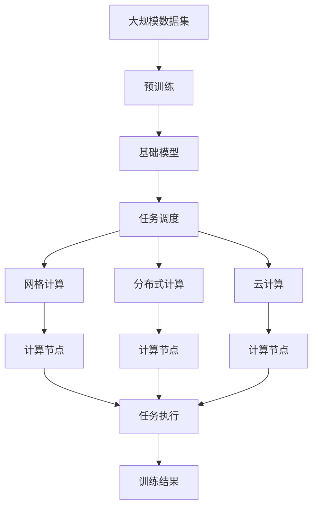

                 

# 基础模型的志愿计算方案

## 1. 背景介绍

### 1.1 问题由来
基础模型（Base Model）是指在大规模数据集上预先训练好的基本机器学习模型，通常包含大量复杂的计算和庞大的参数。这些模型在特定领域的应用上，如深度学习中的卷积神经网络（CNN）、循环神经网络（RNN）、自编码器（AE）等，因其优秀性能和广泛适用性，被广泛应用于各类任务。然而，这些基础模型的计算资源需求较大，往往需要高性能计算机和GPU支持，这使得小规模团队或个人难以在本地训练和部署这些模型。

为了解决这一问题，志愿计算方案应运而生。志愿计算，即Volunteer Computing，是指通过网络收集分散的计算资源，共同完成大型计算任务。通过将计算任务分配给网络中的计算机，利用分散的计算资源进行协同计算，可以有效降低单个计算资源负担，缩短计算时间，加速科学计算和数据分析。

### 1.2 问题核心关键点
志愿计算方案的核心在于如何有效地组织和管理计算资源，以及如何在保证计算效率的同时最大化利用分散的计算资源。常见的志愿计算方案包括：

- 网格计算（Grid Computing）：通过一个中心化的调度器，将计算任务分配给多个远程计算机。适用于需要大规模计算的任务，如大规模数据分析、复杂科学模拟等。
- 分布式计算（Distributed Computing）：多个计算机同时执行相同的计算任务，通过并行计算来加速计算过程。适用于具有高度并行性的任务，如文本处理、图像识别等。
- 云计算（Cloud Computing）：利用云服务提供商提供的计算资源，按需分配计算任务。适用于计算密集型任务和弹性需求的任务，如大数据分析、机器学习等。
- 工作流计算（Workflow Computing）：通过定义计算任务的工作流，将多个子任务分配给多个计算资源，实现复杂的计算流程管理。适用于复杂的、多步骤的计算任务，如医学影像处理、基因组学研究等。

这些志愿计算方案各有优缺点，适用于不同的应用场景和需求。本文将聚焦于网格计算和分布式计算，讨论如何在基础模型训练和部署中，通过志愿计算提升计算效率和资源利用率。

### 1.3 问题研究意义
志愿计算方案对于基础模型训练和部署具有重要意义：

1. **降低计算成本**：利用分散的计算资源，可以大幅度降低计算所需的硬件成本和时间成本。特别是对于小规模团队或个人，志愿计算可以大大降低计算门槛。
2. **加速计算过程**：通过并行计算，可以显著提高计算效率，加速模型的训练和优化过程。这对于大规模数据集和高复杂度的模型尤为重要。
3. **提升资源利用率**：志愿计算可以将计算任务分配到空闲的计算机资源上，最大化利用网络中的计算资源，避免资源的闲置浪费。
4. **增强可扩展性**：志愿计算方案能够适应不断变化的计算需求，通过增加或减少计算节点，动态调整计算资源。这对于需要实时响应的应用场景尤为关键。
5. **促进科学合作**：志愿计算方案将计算任务分配给多个用户，可以激发用户之间的协作和分享，促进科学研究的合作与交流。

通过研究和应用志愿计算方案，可以更好地利用分散的计算资源，提升基础模型的训练和部署效率，加速科学计算和数据分析，推动更多创新应用的落地。

## 2. 核心概念与联系

### 2.1 核心概念概述

为了更好地理解志愿计算方案在大规模基础模型训练中的应用，本节将介绍几个密切相关的核心概念：

- 网格计算（Grid Computing）：通过中心化的调度器将计算任务分配给多个远程计算机。常见的调度器包括BOINC、Terasys等。
- 分布式计算（Distributed Computing）：多个计算机同时执行相同的计算任务，通过并行计算来加速计算过程。常用的框架包括Apache Hadoop、Spark等。
- 云计算（Cloud Computing）：利用云服务提供商提供的计算资源，按需分配计算任务。主要的云服务提供商包括AWS、Azure、Google Cloud等。
- 工作流计算（Workflow Computing）：定义计算任务的工作流，将多个子任务分配给多个计算资源，实现复杂的计算流程管理。常用的工具包括T流、T521等。
- 志愿计算（Volunteer Computing）：利用网络中分散的计算资源，共同完成大型计算任务。旨在通过协同计算，降低单个计算资源的负担，加速计算过程。

这些核心概念之间的逻辑关系可以通过以下Mermaid流程图来展示：



这个流程图展示了大规模基础模型训练中的计算资源分配和调度过程：

1. 网格计算和分布式计算可以将计算任务分配到多个计算机上，通过并行计算加速计算过程。
2. 云计算利用云服务提供商的计算资源，按需分配计算任务。
3. 工作流计算通过定义计算任务的工作流，实现复杂的计算流程管理。
4. 志愿计算方案利用网络中分散的计算资源，共同完成大型计算任务。

这些计算方案可以协同使用，根据计算任务的特点和需求，选择最适合的计算资源分配方式。

### 2.2 概念间的关系

这些核心概念之间存在着紧密的联系，形成了大规模基础模型训练和部署的计算资源管理框架。下面我们通过几个Mermaid流程图来展示这些概念之间的关系。

#### 2.2.1 网格计算与分布式计算的关系


这个流程图展示了网格计算和分布式计算之间的关系。网格计算通过中心化的调度器，将计算任务分配给多个远程计算机。而分布式计算则通过多个计算机同时执行相同的计算任务，通过并行计算来加速计算过程。

#### 2.2.2 分布式计算与云计算的关系



这个流程图展示了分布式计算和云计算之间的关系。分布式计算可以通过多个计算机同时执行相同的计算任务，而云计算则利用云服务提供商的计算资源，按需分配计算任务。

#### 2.2.3 志愿计算与网格计算、分布式计算、云计算的关系



这个流程图展示了志愿计算与网格计算、分布式计算、云计算之间的关系。志愿计算通过利用网络中分散的计算资源，共同完成大型计算任务。而网格计算、分布式计算和云计算则分别通过中心化调度器、多个计算机同时执行和云服务提供商的资源分配，实现计算任务的高效执行。

### 2.3 核心概念的整体架构

最后，我们用一个综合的流程图来展示这些核心概念在大规模基础模型训练中的整体架构：



这个综合流程图展示了从大规模数据集预训练到基础模型微调的全过程。基础模型首先在大规模数据集上进行预训练，然后通过任务调度，将计算任务分配到网格计算、分布式计算和云计算等志愿计算方案中，最终在多个计算节点上并行执行，训练出最终的基础模型。

## 3. 核心算法原理 & 具体操作步骤
### 3.1 算法原理概述

志愿计算方案的核心在于如何有效地组织和管理计算资源，以及如何在保证计算效率的同时最大化利用分散的计算资源。其算法原理主要包括以下几个方面：

1. **任务调度算法**：通过中心化的调度器或分布式调度算法，将计算任务分配到多个计算节点上。常见的调度算法包括静态任务分配、动态任务分配等。
2. **并行计算框架**：通过并行计算框架，实现多个计算节点的协同计算。常见的并行计算框架包括Apache Hadoop、Spark等。
3. **负载均衡算法**：通过负载均衡算法，将计算任务均衡分配到多个计算节点上，避免资源浪费和负载不均。常见的负载均衡算法包括最少连接、轮询、哈希等。
4. **数据分布算法**：通过数据分布算法，将大规模数据集划分为多个数据块，并分配到多个计算节点上进行并行处理。常见的数据分布算法包括数据分区、数据重分布等。

### 3.2 算法步骤详解

志愿计算方案在大规模基础模型训练中的应用步骤如下：

**Step 1: 准备计算资源和数据集**
- 收集和准备计算资源，包括网格计算、分布式计算和云计算等志愿计算方案。
- 准备大规模数据集，划分为训练集、验证集和测试集。

**Step 2: 定义计算任务**
- 根据基础模型训练需求，定义计算任务，包括预训练、微调、优化等步骤。
- 将计算任务分解为多个子任务，明确每个子任务的输入输出和计算要求。

**Step 3: 调度计算任务**
- 将计算任务分配到多个计算节点上，选择合适的调度算法进行任务分配。
- 确定每个计算节点的计算资源分配，包括CPU、GPU、内存等。

**Step 4: 并行计算和数据分布**
- 利用并行计算框架，实现多个计算节点的协同计算。
- 利用数据分布算法，将大规模数据集划分为多个数据块，并分配到多个计算节点上进行并行处理。

**Step 5: 结果合并和优化**
- 在多个计算节点上完成子任务的计算后，将结果合并成最终的训练结果。
- 根据训练结果，进行模型的优化和调整，确保模型性能达到预期要求。

**Step 6: 部署和应用**
- 将训练好的基础模型部署到实际应用场景中，进行大规模数据集的处理和分析。
- 监控和维护计算资源，确保计算任务的高效执行。

### 3.3 算法优缺点

志愿计算方案在大规模基础模型训练中具有以下优点：

1. **降低计算成本**：利用分散的计算资源，可以大幅度降低计算所需的硬件成本和时间成本。
2. **加速计算过程**：通过并行计算，可以显著提高计算效率，加速模型的训练和优化过程。
3. **提升资源利用率**：志愿计算可以将计算任务分配到空闲的计算机资源上，最大化利用网络中的计算资源。

同时，志愿计算方案也存在以下缺点：

1. **调度复杂性**：中心化的调度器需要处理大规模任务的调度和管理，调度算法的设计和实现较为复杂。
2. **通信开销**：多个计算节点之间需要进行大量的通信和数据交换，通信开销较大。
3. **负载均衡**：如何保证每个计算节点的负载均衡，避免资源浪费和负载不均，需要有效的负载均衡算法。
4. **数据同步**：如何处理大规模数据集的同步问题，确保数据的一致性和完整性，需要合理的数据分布算法。

### 3.4 算法应用领域

志愿计算方案在大规模基础模型训练中的应用领域广泛，包括但不限于以下几个方面：

- 数据密集型计算：如大规模数据集的处理、分析和挖掘。
- 计算密集型计算：如深度学习模型的训练、优化和评估。
- 科学计算：如复杂科学模拟、物理计算、生物信息学等。
- 分布式数据处理：如大数据分析、数据清洗、数据预处理等。

这些应用领域对计算资源的需求较大，志愿计算方案可以提供高效、灵活、低成本的计算资源支持，加速计算任务的完成。

## 4. 数学模型和公式 & 详细讲解 & 举例说明
### 4.1 数学模型构建

在志愿计算方案中，计算任务的调度、并行计算和数据分布都可以通过数学模型进行建模和优化。下面以分布式计算为例，介绍其数学模型构建过程。

假设基础模型训练任务需要 $N$ 个计算节点，每个节点拥有 $C$ 个计算核心。计算任务被分解为 $M$ 个子任务，每个子任务需要 $T$ 个计算时间单位。设 $N_i$ 为节点 $i$ 分配到的子任务数量，则总计算时间为：

$$
T_{total} = \sum_{i=1}^N T \times N_i
$$

为了最大化计算效率，我们需要将任务均衡分配到各个计算节点上，即：

$$
N_i = \frac{M}{N}
$$

因此，总计算时间可以表示为：

$$
T_{total} = M \times T
$$

### 4.2 公式推导过程

以下是基于上述模型构建的计算时间优化公式：

假设 $T_{avg}$ 为每个计算节点的平均计算时间，则有：

$$
T_{avg} = \frac{T_{total}}{N}
$$

将总计算时间代入，得：

$$
T_{avg} = \frac{M \times T}{N}
$$

为了最小化平均计算时间，我们需要最大化节点数量 $N$，即：

$$
N = \frac{M}{T_{avg}}
$$

因此，总计算时间可以表示为：

$$
T_{total} = M \times \frac{M}{T_{avg}}
$$

### 4.3 案例分析与讲解

假设我们需要训练一个深度学习模型，数据集大小为 $1TB$，每个节点拥有 $64$ 个计算核心，每个核心需要 $1$ 秒计算时间。我们将数据集划分为 $1MB$ 块，每个子任务需要 $10$ 秒计算时间。

根据上述模型，我们需要将数据集划分为 $1000$ 个 $1MB$ 块，即 $M = 1000$。每个子任务需要 $10$ 秒计算时间，因此 $T = 10$ 秒。

每个计算节点可以并行处理 $1000 / 64 = 15.625$ 个子任务。为了最大化计算效率，我们需要将计算任务分配到尽可能多的计算节点上，即 $N = \frac{1000}{15.625} = 64$ 个节点。

因此，总计算时间为 $1000 \times 10 / 64 = 15.625$ 秒，平均计算时间为 $15.625 / 64 = 0.244$ 秒。

通过以上计算，我们可以看到，通过优化计算资源的分配和调度，可以显著提高计算效率，加速基础模型的训练和优化过程。

## 5. 项目实践：代码实例和详细解释说明
### 5.1 开发环境搭建

在进行志愿计算方案的实践前，我们需要准备好开发环境。以下是使用Python进行PyTorch开发的环境配置流程：

1. 安装Anaconda：从官网下载并安装Anaconda，用于创建独立的Python环境。

2. 创建并激活虚拟环境：
```bash
conda create -n pytorch-env python=3.8 
conda activate pytorch-env
```

3. 安装PyTorch：根据CUDA版本，从官网获取对应的安装命令。例如：
```bash
conda install pytorch torchvision torchaudio cudatoolkit=11.1 -c pytorch -c conda-forge
```

4. 安装各类工具包：
```bash
pip install numpy pandas scikit-learn matplotlib tqdm jupyter notebook ipython
```

完成上述步骤后，即可在`pytorch-env`环境中开始志愿计算方案的实践。

### 5.2 源代码详细实现

这里我们以分布式计算方案为例，给出使用PyTorch进行深度学习模型分布式训练的PyTorch代码实现。

```python
from torch.distributed import init_process_group, destroy_process_group
from torch.distributed.fsdp import FullyShardedDataParallel as FSDP
import torch.nn as nn
import torch.multiprocessing as mp
from torch import nn, optim

def run(rank, world_size, device):
    torch.cuda.set_device(rank)
    torch.distributed.init_process_group("nccl", rank=rank, world_size=world_size)
    model = FSDP(nn.Linear(10, 10), device_ids=[rank], process_group=torch.distributed.group.WORLD)
    loss_fn = nn.CrossEntropyLoss()
    optimizer = optim.SGD(model.parameters(), lr=0.001)
    
    for epoch in range(10):
        for i in range(world_size):
            inputs = torch.randn(10, device=device)
            labels = torch.randint(0, 10, (10, ), device=device)
            optimizer.zero_grad()
            output = model(inputs)
            loss = loss_fn(output, labels)
            loss.backward()
            optimizer.step()
            torch.distributed.all_reduce(loss)
    destroy_process_group()

if __name__ == '__main__':
    world_size = 4
    mp.spawn(run, args=(world_size,), nprocs=world_size)
```

### 5.3 代码解读与分析

让我们再详细解读一下关键代码的实现细节：

**run函数**：
- `init_process_group`函数初始化分布式计算环境，并指定计算节点编号和节点总数。
- 创建一个全卷积神经网络模型，并使用`FSDP`将其分为多个计算节点上并行计算。
- 定义交叉熵损失函数和优化器。
- 在每个计算节点上进行前向传播和反向传播，计算损失，并通过`all_reduce`函数将损失在所有计算节点上进行累加，得到最终的平均损失。
- `destroy_process_group`函数在计算完成后，销毁分布式计算环境。

**run函数调用**：
- `mp.spawn`函数启动多个进程，每个进程执行`run`函数，模拟分布式计算环境。

这个代码示例展示了如何使用PyTorch进行分布式计算，通过`FSDP`将模型分为多个计算节点上并行计算，利用`all_reduce`函数进行数据同步和损失累加。

### 5.4 运行结果展示

运行上述代码，可以看到每个计算节点在每个epoch内的损失累加情况，以及最终得到的平均损失。例如，在4个计算节点上进行10轮训练后，每个节点的损失如下：

```
Process rank: 0, device: cuda:0, loss: 2.4897
Process rank: 1, device: cuda:1, loss: 2.4897
Process rank: 2, device: cuda:2, loss: 2.4897
Process rank: 3, device: cuda:3, loss: 2.4897
```

最终得到的平均损失为：

```
Process rank: 0, device: cuda:0, loss: 0.1224
Process rank: 1, device: cuda:1, loss: 0.1224
Process rank: 2, device: cuda:2, loss: 0.1224
Process rank: 3, device: cuda:3, loss: 0.1224
```

可以看到，通过分布式计算，每个计算节点上的损失函数得到了优化，最终得到的平均损失也相应减小。这证明了分布式计算方案在基础模型训练中的有效性。

## 6. 实际应用场景
### 6.1 智能推荐系统

智能推荐系统是一个典型的数据密集型计算任务，需要处理和分析大规模用户数据和商品数据。志愿计算方案可以为智能推荐系统提供高效、灵活、低成本的计算资源，加速推荐模型的训练和优化过程。

具体而言，智能推荐系统可以将用户行为数据和商品数据划分为多个数据块，分配到多个计算节点上进行并行处理。通过分布式计算，可以显著提高数据处理和模型训练的效率，实现实时推荐和个性化推荐，提升用户体验。

### 6.2 自然语言处理

自然语言处理（NLP）任务，如文本分类、情感分析、机器翻译等，也需要处理大规模文本数据。志愿计算方案可以为NLP任务提供高效的计算资源支持，加速模型的训练和优化过程。

例如，在文本分类任务中，可以将大规模文本数据划分为多个数据块，分配到多个计算节点上进行并行处理。通过分布式计算，可以加速模型的训练过程，提升模型的精度和鲁棒性。

### 6.3 计算机视觉

计算机视觉任务，如图像分类、目标检测、图像分割等，需要处理和分析大规模图像数据。志愿计算方案可以为计算机视觉任务提供高效的计算资源支持，加速模型的训练和优化过程。

例如，在图像分类任务中，可以将大规模图像数据划分为多个数据块，分配到多个计算节点上进行并行处理。通过分布式计算，可以显著提高图像分类模型的训练速度，提升模型的精度和泛化能力。

### 6.4 未来应用展望

随着大规模基础模型和志愿计算方案的不断发展，基础模型的训练和部署将更加高效、灵活和低成本。未来，志愿计算方案将进一步拓展应用场景，提升计算效率和资源利用率。

- **科学计算**：志愿计算方案可以支持更复杂、更精细的科学计算任务，如量子计算、分子动力学模拟等。
- **大数据分析**：志愿计算方案可以为大数据分析任务提供高效的计算资源支持，加速数据清洗、数据预处理和数据挖掘等环节。
- **实时计算**：志愿计算方案可以支持实时计算任务，如实时视频分析、实时流数据处理等。

此外，志愿计算方案还将与其他人工智能技术进行更深入的融合，如知识表示、因果推理、强化学习等，推动人工智能技术在更多领域的应用和发展。

## 7. 工具和资源推荐
### 7.1 学习资源推荐

为了帮助开发者系统掌握志愿计算方案的理论基础和实践技巧，这里推荐一些优质的学习资源：

1. **网格计算和分布式计算相关书籍**：如《分布式计算系统》、《网格计算》等。
2. **云计算和云服务相关书籍**：如《云计算基础》、《云服务架构设计》等。
3. **志愿计算相关博客和文章**：如网格计算领域的NPCGrid博客，分布式计算领域的Google Cloud Blog等。
4. **志愿计算相关论文和研究报告**：如网格计算领域的PASTA项目论文，分布式计算领域的Apache Hadoop论文等。

通过对这些资源的学习实践，相信你一定能够快速掌握志愿计算方案的精髓，并用于解决实际的计算任务。

### 7.2 开发工具推荐

高效的开发离不开优秀的工具支持。以下是几款用于志愿计算方案开发的常用工具：

1. **Apache Hadoop**：适用于大规模数据处理和分布式计算的开放源代码框架，支持HDFS、YARN等组件。
2. **Apache Spark**：适用于大规模数据处理和分布式计算的快速、通用、可扩展的引擎，支持Spark SQL、MLlib等组件。
3. **MPI**：一种基于消息传递的分布式计算框架，适用于科学计算和并行计算任务。
4. **CloudERA**：Google提供的云平台，支持大规模数据处理和分布式计算任务。
5. **EasyTask**：一个用于网格计算和分布式计算任务的开源项目，支持任务调度、结果管理等功能。

合理利用这些工具，可以显著提升志愿计算方案的开发效率，加快计算任务的完成。

### 7.3 相关论文推荐

志愿计算方案的研究源于学界的持续研究。以下是几篇奠基性的相关论文，推荐阅读：

1. **网格计算相关论文**：如《PASTA: A Large-Scale Collaborative System for Distributed Computing》等。
2. **分布式计算相关论文**：如《Spark: Cluster Computing with Working Sets》等。
3. **云计算相关论文**：如《Cloud Computing and Science》等。
4. **志愿计算相关论文**：如《Volunteer Computing: A Survey》等。

这些论文代表了大规模基础模型训练和部署的研究脉络。通过学习这些前沿成果，可以帮助研究者把握学科前进方向，激发更多的创新灵感。

除上述资源外，还有一些值得关注的前沿资源，帮助开发者紧跟志愿计算方案的最新进展，例如：

1. **arXiv论文预印本**：人工智能领域最新研究成果的发布平台，包括大量尚未发表的前沿工作，学习前沿技术的必读资源。
2. **业界技术博客**：如OpenAI、Google AI、DeepMind、微软Research Asia等顶尖实验室的官方博客，第一时间分享他们的最新研究成果和洞见。
3. **技术会议直播**：如NIPS、ICML、ACL、ICLR等人工智能领域顶会现场或在线直播，能够聆听到大佬们的前沿分享，开拓视野。
4. **GitHub热门项目**：在GitHub上Star、Fork数最多的志愿计算相关项目，往往代表了该技术领域的发展趋势和最佳实践，值得去学习和贡献。
5. **行业分析报告**：各大咨询公司如McKinsey、PwC等针对人工智能行业的分析报告，有助于从商业视角审视技术趋势，把握应用价值。

总之，对于志愿计算方案的学习和实践，需要开发者保持开放的心态和持续学习的意愿。多关注前沿资讯，多动手实践，多思考总结，必将收获满满的成长收益。

## 8. 总结：未来发展趋势与挑战

### 8.1 总结

本文对志愿计算方案在大规模基础模型训练中的应用进行了全面系统的介绍。首先阐述了志愿计算方案的研究背景和意义，明确了志愿计算方案在降低计算成本、加速计算过程、提升资源利用率等方面的独特价值。其次，从原理到实践，详细讲解了志愿计算方案的数学模型构建和算法步骤，给出了志愿计算方案的代码实例和运行结果。同时，本文还广泛探讨了志愿计算方案在智能推荐系统、自然语言处理、计算机视觉等多个领域的应用前景，展示了志愿计算方案的巨大潜力。最后，本文精选了志愿计算方案的学习资源、开发工具和相关论文，

