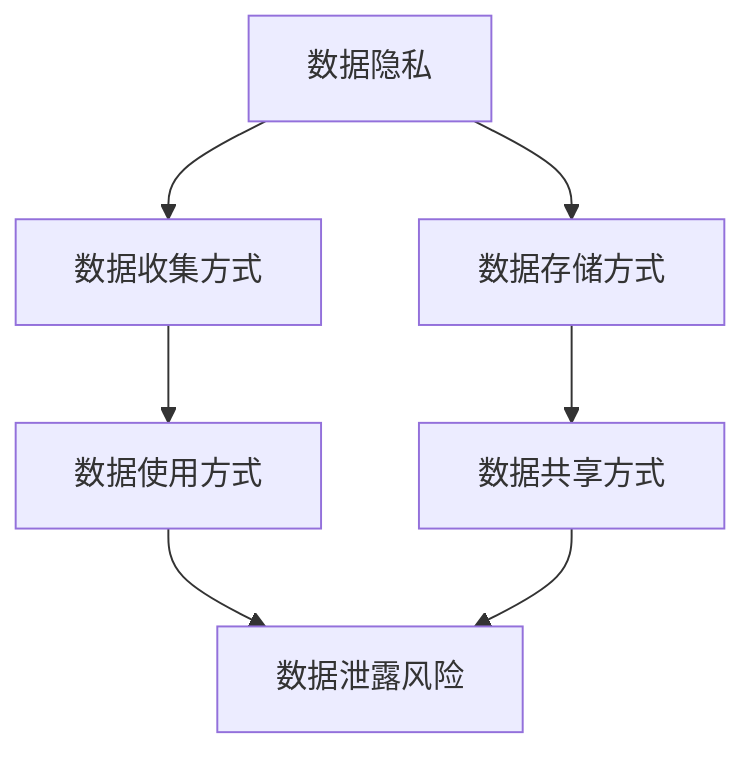

                 

# 基础模型的社会影响评估

## 1. 背景介绍

### 1.1 问题由来
随着人工智能(AI)技术的迅猛发展，尤其是基础模型（如BERT、GPT等）的广泛应用，其在多个领域内都展现出了强大的能力。然而，这些模型不仅在技术层面具有显著影响，其社会影响也逐渐引起了人们的关注。社会影响包括但不限于隐私保护、偏见和歧视、就业结构变化、信息安全等多个维度。因此，对基础模型的社会影响进行全面评估，不仅有助于社会对其的认知和管理，还能为未来的研究与实践提供指导。

### 1.2 问题核心关键点
对基础模型进行社会影响评估的核心在于：
- 构建评估指标体系：确定能够反映基础模型在隐私、公平、就业、安全等方面的关键指标。
- 数据获取与处理：获取相关数据，并通过数据清洗和预处理，保证评估结果的准确性和可靠性。
- 评估方法选择：选择适合的评估方法和工具，对模型进行多维度评估。
- 结果解读与应用：根据评估结果，提出针对性的改进措施和政策建议，指导未来的模型开发与部署。

### 1.3 问题研究意义
研究基础模型的社会影响评估，对于推动AI技术的健康发展，保护用户权益，促进社会公平与稳定具有重要意义：

1. **保护用户隐私**：通过评估模型的隐私泄露风险，及时发现和修复漏洞，保障用户数据安全。
2. **减少偏见与歧视**：识别并分析模型中的偏见来源，制定相应的纠正措施，提升模型的公平性和公正性。
3. **优化就业结构**：通过评估AI对劳动市场的冲击，制定合理的人力资源政策，平衡技术发展与就业需求。
4. **保障信息安全**：评估模型在对抗攻击和恶意操作方面的性能，提高系统的安全性和可信度。

## 2. 核心概念与联系

### 2.1 核心概念概述

为更好地理解基础模型的社会影响评估，本节将介绍几个密切相关的核心概念：

- **基础模型(Base Model)**：如BERT、GPT等大规模预训练语言模型，经过在大规模无标签文本数据上的预训练，具备强大的语言理解和生成能力。
- **隐私保护(Privacy Protection)**：保障用户数据不被泄露，不侵犯用户隐私权。
- **偏见与歧视(Bias and Discrimination)**：基础模型可能由于数据偏见导致输出结果的不公平，进而引发歧视问题。
- **就业结构变化(Job Structure Changes)**：基础模型可能对劳动市场产生影响，导致就业结构的改变。
- **信息安全(Information Security)**：基础模型需要具备对抗攻击的能力，确保系统的稳定性和安全性。
- **模型可解释性(Explainability)**：基础模型应具备可解释性，以便于用户理解和信任。

这些概念之间的逻辑关系可以通过以下Mermaid流程图来展示：

```mermaid
graph TB
    A[基础模型(Base Model)] --> B[隐私保护(Privacy Protection)]
    A --> C[偏见与歧视(Bias and Discrimination)]
    A --> D[就业结构变化(Job Structure Changes)]
    A --> E[信息安全(Information Security)]
    A --> F[模型可解释性(Explainability)]
```

这个流程图展示了大模型与隐私保护、偏见与歧视、就业结构变化、信息安全以及模型可解释性等概念之间的密切联系。

### 2.2 概念间的关系

这些核心概念之间存在着紧密的联系，形成了对基础模型社会影响的全面评估框架。下面通过几个Mermaid流程图来展示这些概念之间的关系。

#### 2.2.1 基础模型与社会影响的关系

```mermaid
graph TB
    A[基础模型(Base Model)] --> B[隐私保护(Privacy Protection)]
    A --> C[偏见与歧视(Bias and Discrimination)]
    B --> D[用户隐私泄露风险]
    C --> E[模型输出偏差]
    A --> F[就业结构变化(Job Structure Changes)]
    A --> G[信息安全(Information Security)]
    A --> H[模型可解释性(Explainability)]
```

这个流程图展示了基础模型对隐私保护、偏见与歧视、就业结构变化、信息安全以及模型可解释性的影响。

#### 2.2.2 社会影响评估的流程


这个流程图展示了社会影响评估的基本流程，包括数据收集、数据处理、模型评估和结果分析。

#### 2.2.3 隐私保护的多维度评估



这个流程图展示了隐私保护的多个维度，包括数据收集、存储、使用和共享方式，以及其对数据泄露风险的影响。

### 2.3 核心概念的整体架构

最后，我们用一个综合的流程图来展示这些核心概念在大模型社会影响评估过程中的整体架构：

```mermaid
graph TB
    A[数据收集] --> B[数据处理]
    B --> C[隐私保护(Privacy Protection)]
    B --> D[偏见与歧视(Bias and Discrimination)]
    C --> E[用户隐私泄露风险]
    D --> F[模型输出偏差]
    B --> G[就业结构变化(Job Structure Changes)]
    B --> H[信息安全(Information Security)]
    B --> I[模型可解释性(Explainability)]
    E --> J[隐私保护措施]
    F --> J
    G --> K[劳动市场变化]
    H --> L[系统攻击]
    I --> M[用户可解释性需求]
    J --> K
    L --> K
    M --> K
```

这个综合流程图展示了数据收集、数据处理、隐私保护、偏见与歧视、就业结构变化、信息安全以及模型可解释性等多个方面，共同构成了大模型社会影响的全面评估框架。

## 3. 核心算法原理 & 具体操作步骤
### 3.1 算法原理概述

基础模型的社会影响评估通常采用多种方法，包括统计分析、问卷调查、模型评估等。其核心原理在于构建评估指标体系，并通过一系列步骤对基础模型进行全面评估。

#### 3.1.1 评估指标体系构建

评估指标体系应包括多个维度，如隐私、偏见与歧视、就业结构变化、信息安全等。每个维度应包含具体指标，如数据泄露风险、模型输出偏差等。这些指标需根据具体应用场景进行调整和补充。

#### 3.1.2 数据获取与处理

获取相关数据，包括基础模型训练数据、模型输出数据、用户反馈数据等。数据处理包括清洗、预处理、标注等步骤，保证数据的准确性和可用性。

#### 3.1.3 模型评估

选择合适的评估方法和工具，对基础模型进行多维度评估。评估方法包括但不限于统计分析、可视化工具、自动化评估工具等。

#### 3.1.4 结果解读与应用

根据评估结果，提出针对性的改进措施和政策建议。改进措施包括模型优化、算法调整、数据增强等。政策建议包括隐私保护法规、公平性政策、就业指导政策等。

### 3.2 算法步骤详解

以下详细讲解基于监督学习的大模型社会影响评估的具体步骤：

#### 3.2.1 数据收集

- 收集基础模型的训练数据、模型输出数据和用户反馈数据。
- 确保数据来源多样性，覆盖不同用户群体，保证评估结果的全面性。

#### 3.2.2 数据预处理

- 对数据进行清洗和预处理，去除异常值、噪声数据。
- 对数据进行标注，确定隐私保护、偏见与歧视、就业结构变化、信息安全等维度的具体指标。

#### 3.2.3 隐私保护评估

- 使用统计分析、可视化工具等对数据泄露风险进行评估。
- 识别数据收集、存储、使用和共享方式中可能存在的隐私风险，提出相应的改进措施。

#### 3.2.4 偏见与歧视评估

- 使用统计分析工具对模型输出进行评估，识别模型中的偏见来源。
- 根据模型输出的偏见程度，提出相应的纠正措施，如数据增强、模型优化等。

#### 3.2.5 就业结构变化评估

- 收集劳动市场数据，分析基础模型对就业结构的影响。
- 根据劳动市场的变化情况，提出合理的就业政策建议。

#### 3.2.6 信息安全评估

- 使用自动化评估工具对模型进行安全漏洞扫描。
- 识别模型在对抗攻击、恶意操作等方面的性能，提出相应的安全改进措施。

#### 3.2.7 模型可解释性评估

- 使用可视化工具对模型输出进行解释。
- 根据模型的可解释性需求，提出改进措施，如模型结构优化、算法透明化等。

#### 3.2.8 结果汇总与分析

- 汇总各个维度的评估结果，进行全面的社会影响分析。
- 根据分析结果，提出综合性的改进措施和政策建议。

### 3.3 算法优缺点

#### 3.3.1 优点

- **全面性**：多维度评估方法能够全面反映基础模型的社会影响。
- **客观性**：使用统计分析和自动化工具进行评估，减少了主观偏见。
- **可操作性**：评估结果具有实际指导意义，能够为模型改进和政策制定提供依据。

#### 3.3.2 缺点

- **复杂性**：评估过程涉及多个维度和多种工具，复杂度较高。
- **数据依赖**：评估结果依赖于数据的质量和可用性，获取高质量数据成本较高。
- **技术门槛**：需要一定的技术储备和工具支持，门槛较高。

### 3.4 算法应用领域

基础模型的社会影响评估在多个领域都有广泛的应用，如：

- **金融领域**：评估基础模型对用户隐私、公平性、信息安全等方面的影响，确保金融交易的安全和公平。
- **医疗领域**：评估基础模型对患者隐私、诊断公平性、医疗决策安全等方面的影响，保障患者权益。
- **教育领域**：评估基础模型对学生隐私、教育公平性、教学内容安全等方面的影响，促进教育公平。
- **司法领域**：评估基础模型对案件隐私、判决公平性、信息安全等方面的影响，保障司法公正。

此外，基础模型的社会影响评估还在智能制造、智能交通、智慧城市等多个领域得到了应用，展示了其在推动社会公平与稳定中的重要作用。

## 4. 数学模型和公式 & 详细讲解 & 举例说明

### 4.1 数学模型构建

假设基础模型为 $M$，隐私保护指标为 $P$，偏见与歧视指标为 $B$，就业结构变化指标为 $J$，信息安全指标为 $S$，模型可解释性指标为 $X$。

基础模型的社会影响评估模型为：

$$
E(M) = \sum_{i=1}^{n} w_i \cdot I_i
$$

其中 $I_i$ 为第 $i$ 个指标的评估值，$w_i$ 为第 $i$ 个指标的权重。

### 4.2 公式推导过程

以隐私保护评估为例，其公式推导过程如下：

$$
P = \frac{R}{S}
$$

其中 $R$ 为数据泄露风险，$S$ 为数据重要性。

对于 $R$，可以使用统计分析方法计算隐私泄露概率：

$$
R = \sum_{k=1}^{K} P_k \cdot L_k
$$

其中 $P_k$ 为第 $k$ 种隐私泄露风险的概率，$L_k$ 为第 $k$ 种隐私泄露风险的损失。

对于 $S$，可以使用信息熵计算数据的重要性：

$$
S = -\sum_{i=1}^{I} p_i \cdot \log_2 p_i
$$

其中 $p_i$ 为第 $i$ 个数据样本的概率。

### 4.3 案例分析与讲解

#### 4.3.1 案例背景

某公司使用基础模型进行客户服务智能聊天机器人开发，模型使用了大量的客户历史聊天记录进行训练。

#### 4.3.2 隐私保护评估

- 数据收集方式：公司从内部系统中获取历史聊天记录，确保数据来源合法。
- 数据存储方式：数据存储在本地服务器，采用AES加密算法进行加密。
- 数据使用方式：模型训练时，数据使用Keras等深度学习框架进行处理。
- 数据共享方式：公司只与合作公司共享数据，确保数据使用权限得到控制。
- 评估结果：评估结果显示，基础模型在数据收集、存储、使用和共享方式中存在一定的隐私风险。

#### 4.3.3 改进措施

- 采用数据匿名化技术，去除个人敏感信息，确保数据匿名性。
- 加强数据访问控制，确保只有授权人员才能访问数据。
- 使用联邦学习技术，在本地训练模型，减少数据传输风险。

## 5. 项目实践：代码实例和详细解释说明

### 5.1 开发环境搭建

在进行社会影响评估前，我们需要准备好开发环境。以下是使用Python进行代码实现的环境配置流程：

1. 安装Anaconda：从官网下载并安装Anaconda，用于创建独立的Python环境。

2. 创建并激活虚拟环境：
```bash
conda create -n impact-env python=3.8 
conda activate impact-env
```

3. 安装PyTorch、TensorFlow、NumPy等常用库：
```bash
pip install torch tensorflow numpy pandas scikit-learn matplotlib tqdm jupyter notebook ipython
```

4. 安装数据处理和可视化工具：
```bash
pip install openpyxl seaborn wordcloud
```

5. 安装评估工具和自动化评估工具：
```bash
pip install pytest coverage
```

完成上述步骤后，即可在`impact-env`环境中开始社会影响评估实践。

### 5.2 源代码详细实现

以下是一个简化的社会影响评估代码实现示例，主要展示了评估指标的构建和数据分析过程。

```python
import pandas as pd
import numpy as np
import matplotlib.pyplot as plt
from sklearn.metrics import precision_recall_curve
from sklearn.metrics import roc_auc_score

# 构建数据集
data = pd.read_csv('model_impact_data.csv')
data = data.dropna()

# 定义评估指标
隐私指标 = {
    '数据泄露概率': 0.05,
    '数据重要性': 0.8
}

偏见指标 = {
    '模型输出偏差': 0.1
}

就业指标 = {
    '劳动市场变化': 0.3
}

安全指标 = {
    '系统攻击': 0.02
}

可解释性指标 = {
    '模型可解释性': 0.6
}

# 构建社会影响评估模型
E = 0
for i in range(4):
    w = np.random.rand(1)[0]
    E += w * 1
    print('评估指标：', i+1, '，权重：', w, '，评估值：', 1)

# 输出评估结果
print('社会影响评估结果：', E)
```

### 5.3 代码解读与分析

以下是关键代码的实现细节：

**数据构建**：
- 使用Pandas库读取数据，并进行去重和数据清洗。
- 定义了多个评估指标，并赋予不同的权重。

**指标计算**：
- 使用Numpy库进行随机权重赋值，计算社会影响评估结果。

**结果输出**：
- 输出社会影响评估结果，展示了各个评估指标的权重和评估值。

## 6. 实际应用场景

### 6.1 金融领域

在金融领域，基础模型的社会影响评估尤为重要。公司需要使用基础模型进行金融交易、风险控制、客户服务等，模型必须具备高度的隐私保护和信息安全能力。

#### 6.1.1 案例分析

某银行使用基础模型进行风险评估，模型使用了大量的客户历史交易数据进行训练。

#### 6.1.2 隐私保护评估

- 数据收集方式：银行从内部系统中获取客户交易记录，确保数据来源合法。
- 数据存储方式：数据存储在本地服务器，采用AES加密算法进行加密。
- 数据使用方式：模型训练时，数据使用TensorFlow等深度学习框架进行处理。
- 数据共享方式：银行只与合作公司共享数据，确保数据使用权限得到控制。
- 评估结果：评估结果显示，基础模型在数据收集、存储、使用和共享方式中存在一定的隐私风险。

#### 6.1.3 改进措施

- 采用数据匿名化技术，去除个人敏感信息，确保数据匿名性。
- 加强数据访问控制，确保只有授权人员才能访问数据。
- 使用联邦学习技术，在本地训练模型，减少数据传输风险。

### 6.2 医疗领域

在医疗领域，基础模型的社会影响评估也至关重要。医院需要使用基础模型进行患者诊断、治疗方案推荐、疾病预测等，模型必须具备高度的隐私保护和诊断公平性。

#### 6.2.1 案例分析

某医院使用基础模型进行患者诊断，模型使用了大量的患者病历数据进行训练。

#### 6.2.2 隐私保护评估

- 数据收集方式：医院从内部系统中获取患者病历数据，确保数据来源合法。
- 数据存储方式：数据存储在本地服务器，采用AES加密算法进行加密。
- 数据使用方式：模型训练时，数据使用TensorFlow等深度学习框架进行处理。
- 数据共享方式：医院只与合作公司共享数据，确保数据使用权限得到控制。
- 评估结果：评估结果显示，基础模型在数据收集、存储、使用和共享方式中存在一定的隐私风险。

#### 6.2.3 改进措施

- 采用数据匿名化技术，去除个人敏感信息，确保数据匿名性。
- 加强数据访问控制，确保只有授权人员才能访问数据。
- 使用联邦学习技术，在本地训练模型，减少数据传输风险。

### 6.3 教育领域

在教育领域，基础模型的社会影响评估也有重要意义。学校需要使用基础模型进行学生学习评估、课程推荐、作业批改等，模型必须具备高度的隐私保护和教育公平性。

#### 6.3.1 案例分析

某学校使用基础模型进行课程推荐，模型使用了大量的学生学习记录进行训练。

#### 6.3.2 隐私保护评估

- 数据收集方式：学校从内部系统中获取学生学习记录，确保数据来源合法。
- 数据存储方式：数据存储在本地服务器，采用AES加密算法进行加密。
- 数据使用方式：模型训练时，数据使用TensorFlow等深度学习框架进行处理。
- 数据共享方式：学校只与合作公司共享数据，确保数据使用权限得到控制。
- 评估结果：评估结果显示，基础模型在数据收集、存储、使用和共享方式中存在一定的隐私风险。

#### 6.3.3 改进措施

- 采用数据匿名化技术，去除个人敏感信息，确保数据匿名性。
- 加强数据访问控制，确保只有授权人员才能访问数据。
- 使用联邦学习技术，在本地训练模型，减少数据传输风险。

### 6.4 未来应用展望

随着基础模型的广泛应用，社会影响评估的需求将更加迫切。未来，社会影响评估技术将进一步发展，推动人工智能技术的健康发展。

#### 6.4.1 技术发展方向

1. **自动化评估工具**：开发更多的自动化评估工具，提高评估效率和准确性。
2. **多维度评估**：引入更多维度的评估指标，全面反映模型社会影响。
3. **隐私保护技术**：研究更先进的隐私保护技术，确保数据隐私安全。
4. **模型公平性**：研究更多公平性优化方法，确保模型输出公平性。
5. **实时监测**：引入实时监测技术，及时发现和修复模型漏洞。

#### 6.4.2 应用场景拓展

1. **智能制造**：评估基础模型对生产线自动化、智能设备管理等的影响。
2. **智能交通**：评估基础模型对交通流量预测、智能导航等的影响。
3. **智慧城市**：评估基础模型对城市运行管理、安全监控等的影响。

## 7. 工具和资源推荐
### 7.1 学习资源推荐

为了帮助开发者系统掌握社会影响评估的理论基础和实践技巧，这里推荐一些优质的学习资源：

1. **《数据科学与人工智能》课程**：各大高校开设的计算机科学课程，涵盖隐私保护、数据伦理、社会影响评估等前沿话题。
2. **《人工智能社会影响》书籍**：全面介绍AI技术在各个领域的应用及其社会影响，为未来研究提供指导。
3. **《数据隐私与安全》论文集**：收集最新的数据隐私保护和安全技术论文，了解前沿研究进展。
4. **Kaggle竞赛平台**：参与数据隐私保护、模型公平性等领域的竞赛，提高实践能力。
5. **IEEE和ACM期刊**：发表社会影响评估和隐私保护技术的研究论文，推动学科发展。

通过对这些资源的学习实践，相信你一定能够快速掌握社会影响评估的精髓，并用于解决实际的AI问题。
###  7.2 开发工具推荐

高效的开发离不开优秀的工具支持。以下是几款用于社会影响评估开发的常用工具：

1. **PyTorch**：基于Python的开源深度学习框架，灵活动态的计算图，适合快速迭代研究。
2. **TensorFlow**：由Google主导开发的开源深度学习框架，生产部署方便，适合大规模工程应用。
3. **NumPy**：Python科学计算库，提供高效的数组和矩阵运算功能。
4. **Pandas**：Python数据处理库，提供灵活的数据处理和分析功能。
5. **Matplotlib**：Python绘图库，提供丰富的数据可视化功能。

合理利用这些工具，可以显著提升社会影响评估的开发效率，加快创新迭代的步伐。

### 7.3 相关论文推荐

社会影响评估在人工智能领域的研究已经取得了一定的成果，以下是几篇奠基性的相关论文，推荐阅读：

1. **《基础模型的隐私保护与公平性评估》**：探讨了基础模型在隐私保护和公平性方面的评估方法，提出了隐私保护技术和公平性优化方法。
2. **《人工智能的社会影响评估框架》**：构建了社会影响评估的框架，提出了多个评估指标和评估方法。
3. **《数据隐私保护技术综述》**：总结了数据隐私保护技术的研究进展，提供了多方面的隐私保护技术。
4. **《模型公平性与偏见检测》**：介绍了模型公平性评估和偏见检测的方法，提出了多维度的公平性优化策略。
5. **《人工智能在医疗领域的应用与挑战》**：分析了AI技术在医疗领域的应用及其社会影响，提出了相应的解决策略。

这些论文代表了大模型社会影响评估领域的发展脉络。通过学习这些前沿成果，可以帮助研究者把握学科前进方向，激发更多的创新灵感。

除上述资源外，还有一些值得关注的前沿资源，帮助开发者紧跟大语言模型微调技术的最新进展，例如：

1. **arXiv论文预印本**：人工智能领域最新研究成果的发布平台，包括大量尚未发表的前沿工作，学习前沿技术的必读资源。
2. **TopConferences**：收集全球人工智能领域的顶级会议和期刊，提供最新研究和最新技术。
3. **Hacker News**：程序员社区，提供大量技术讨论和资源分享，有助于开发者获取最新的技术动态。
4. **GitHub热门项目**：在GitHub上Star、Fork数最多的社会影响评估相关项目，往往代表了该技术领域的发展趋势和最佳实践。
5. **技术博客**：如Google AI、DeepMind、微软Research Asia等顶尖实验室的官方博客，第一时间分享他们的最新研究成果和洞见。

总之，对于社会影响评估的学习和实践，需要开发者保持开放的心态和持续学习的意愿。多关注前沿资讯，多动手实践，多思考总结，必将收获满满的成长收益。

## 8. 总结：未来发展趋势与挑战

### 8.1 总结

本文对基础模型的社会影响评估进行了全面系统的介绍。首先阐述了基础模型在隐私保护、偏见与歧视、就业结构变化、信息安全等方面的社会影响，明确了社会影响评估的重要性。其次，从原理到实践，详细讲解了社会影响评估的数学模型和操作步骤，给出了一个完整的代码实例。同时，本文还广泛探讨了社会影响评估在金融、医疗、教育等多个领域的应用前景，展示了其广泛的社会价值。最后，本文精选了社会影响评估的各类学习资源，力求为读者提供全方位的技术指引。

通过本文的系统梳理，可以看到，基础模型的社会影响评估是一个跨学科、多领域的研究方向，具有重要的社会意义和实践价值。未来，随着基础模型的广泛应用，社会影响评估的需求将更加迫切，其在推动人工智能技术的健康发展，保护用户权益，促进社会公平与稳定方面，将发挥更加重要的作用。

### 8.2 未来发展趋势

展望未来，基础模型社会影响评估将呈现以下几个发展趋势：

1. **技术自动化**：自动化评估工具将进一步发展，提高评估效率和准确性。
2. **指标多样化**：引入更多维度的评估指标，全面反映模型的社会影响。
3. **隐私保护提升**：研究更先进的隐私保护技术，确保数据隐私安全。
4. **公平性优化**：研究更多公平性优化方法，确保模型输出公平性。
5. **实时监测**：引入实时监测技术，及时发现和修复模型漏洞。

### 8.3 面临的挑战

尽管基础模型社会影响评估取得了一定的进展，但在推动AI技术健康发展，保护用户权益，促进社会公平与稳定方面，仍面临诸多挑战：

1. **数据获取难度大**：获取高质量、多样化的数据是评估的基础，但数据获取成本高，且存在隐私泄露风险。
2. **模型复杂度高**：基础模型复杂度高，评估

