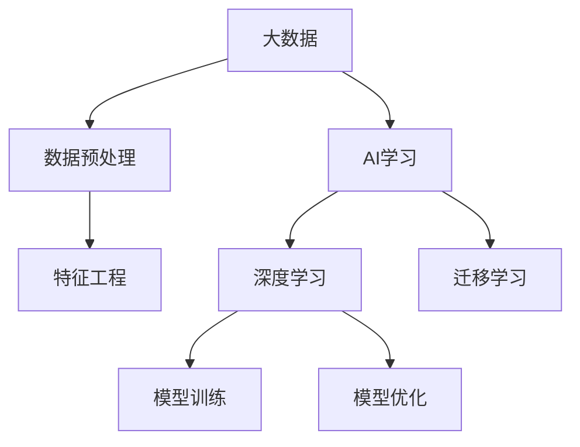
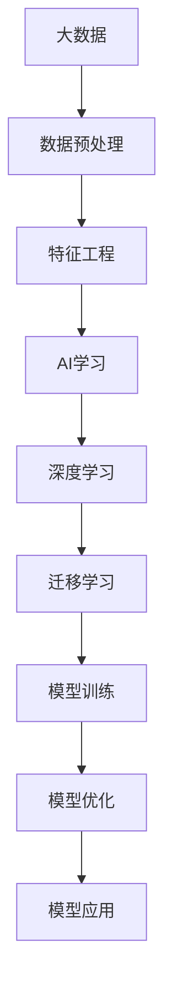

                 

## 1. 背景介绍

### 1.1 问题由来
在人工智能（AI）的快速发展中，数据的重要性不言而喻。大数据时代下，数据量呈指数级增长，为AI技术的进步提供了充足的养分。AI学习，即通过算法模型从数据中提取知识和技能的过程，也在这一背景下得到了空前的发展。然而，大数据对AI学习的影响并不仅限于数据量本身，更在于如何利用这些数据进行更高效的模型训练和优化。本文将探讨大数据在AI学习中的多方面影响，包括数据获取、数据处理、模型训练和优化，以及未来发展趋势。

### 1.2 问题核心关键点
大数据对AI学习的影响涉及数据获取的渠道和质量、数据处理的技术和算法、模型训练的效率和效果，以及优化方法的多样性和创新性。通过深入理解这些关键点，可以更全面地把握大数据在AI学习中的应用和前景。

### 1.3 问题研究意义
研究大数据对AI学习的影响，不仅有助于提高AI模型的性能和效果，还可以促进数据驱动的智能决策、增强AI系统的可解释性和透明度，并为未来的AI技术发展提供理论指导和实践经验。

## 2. 核心概念与联系

### 2.1 核心概念概述

为更好地理解大数据对AI学习的影响，我们首先介绍几个关键概念：

- 大数据（Big Data）：指体量巨大、类型多样、速度快、价值密度低的数据集，通常需要特殊的处理技术来管理和分析。
- 人工智能（Artificial Intelligence, AI）：涉及计算机科学、数学、统计学等多个领域，旨在让机器具有人类智能的行为。
- AI学习（Machine Learning, ML）：通过训练模型，使计算机从数据中学习规律和模式，从而提高预测和决策能力。
- 数据预处理（Data Preprocessing）：包括数据清洗、数据转换、数据归一化等步骤，提高数据质量，便于后续分析。
- 特征工程（Feature Engineering）：从原始数据中提取和构造有意义特征的过程，直接影响模型性能。
- 深度学习（Deep Learning）：一种特殊的AI学习范式，通过多层神经网络进行特征提取和模式识别。
- 迁移学习（Transfer Learning）：利用预训练模型在不同任务间的知识迁移，减少从头训练的时间和数据需求。

### 2.2 概念间的关系

这些核心概念之间存在着紧密的联系，形成了大数据在AI学习中的整体生态系统。以下是通过一个综合的流程图来展示这些概念之间的关系：



这个流程图展示了大数据在AI学习中的应用流程：

1. 大数据通过预处理和特征工程得到高质量的数据集。
2. AI学习通过深度学习模型进行特征提取和模式识别。
3. 迁移学习利用预训练模型在不同任务间的知识迁移。
4. 模型训练和优化使模型在数据集上达到最佳性能。

这些概念共同构成了大数据在AI学习中的完整生态系统，为高效、准确的模型训练和优化提供了必要条件。

### 2.3 核心概念的整体架构

最后，我们用一个综合的流程图来展示这些核心概念在大数据应用中的整体架构：



这个综合流程图展示了大数据在AI学习中的完整应用流程：

1. 大数据通过预处理和特征工程得到高质量的数据集。
2. AI学习通过深度学习模型进行特征提取和模式识别。
3. 迁移学习利用预训练模型在不同任务间的知识迁移。
4. 模型训练和优化使模型在数据集上达到最佳性能。
5. 应用场景下，模型进行推理和预测，输出结果。

通过这个综合流程图，我们可以更清晰地理解大数据在AI学习中的各个环节的应用和作用。

## 3. 核心算法原理 & 具体操作步骤
### 3.1 算法原理概述

大数据在AI学习中的应用，主要通过以下步骤实现：

1. 数据预处理：清洗、转换、归一化原始数据，提高数据质量。
2. 特征工程：提取和构造有用的特征，增加模型表达能力。
3. 模型训练：利用优化算法最小化损失函数，调整模型参数。
4. 模型优化：通过正则化、dropout等技术，避免过拟合，提升模型泛化能力。
5. 迁移学习：利用预训练模型在不同任务间的知识迁移，减少从头训练的时间和数据需求。

### 3.2 算法步骤详解

以下是这些步骤的详细说明：

**Step 1: 数据预处理**

数据预处理是大数据应用的基础。通过以下步骤进行数据清洗和转换：

- 数据清洗：去除缺失值、异常值和噪声，确保数据完整性。
- 数据转换：对不同格式的数据进行统一，如将时间序列数据转换为标准格式。
- 数据归一化：将数据缩放到0到1之间，避免不同特征之间数值差异过大，影响模型性能。

**Step 2: 特征工程**

特征工程是提高模型性能的关键步骤。以下步骤可以进行特征提取和构造：

- 特征选择：从原始数据中选出最具代表性的特征。
- 特征构造：通过组合、变换原始特征，构造新的特征。
- 特征编码：将特征转换为模型可以接受的数值类型，如将分类特征转换为one-hot编码。

**Step 3: 模型训练**

模型训练是通过优化算法调整模型参数的过程。以下步骤进行模型训练：

- 选择模型：根据任务特点选择合适的模型，如线性回归、决策树、神经网络等。
- 数据划分：将数据划分为训练集、验证集和测试集。
- 模型训练：在训练集上通过梯度下降等优化算法，最小化损失函数。
- 参数调整：根据验证集上的性能调整模型参数，避免过拟合。

**Step 4: 模型优化**

模型优化是通过正则化、dropout等技术提高模型泛化能力。以下步骤进行模型优化：

- 正则化：通过L1、L2正则化等方法，避免模型复杂度过高，提高泛化能力。
- Dropout：通过随机删除部分神经元，防止过拟合，提高模型稳定性。
- 早停法：通过验证集上的性能，决定模型训练何时停止。

**Step 5: 迁移学习**

迁移学习是通过预训练模型在不同任务间的知识迁移。以下步骤进行迁移学习：

- 预训练模型：在大规模数据集上训练通用模型，如BERT、GPT等。
- 微调模型：在新任务数据集上，利用预训练模型进行微调，适应新任务。
- 特征融合：将预训练模型的特征提取部分与新任务模型结合，提升模型性能。

### 3.3 算法优缺点

大数据对AI学习的优点：

1. 提高模型性能：大数据提供了更多训练数据，有助于模型学习和提取更复杂的特征。
2. 减少计算成本：通过迁移学习，利用预训练模型在不同任务间的知识迁移，减少了从头训练的时间和数据需求。
3. 促进模型创新：大数据的应用推动了深度学习等新型算法的发展，促进了AI技术的进步。

大数据对AI学习的缺点：

1. 数据质量问题：大数据质量参差不齐，需要大量数据预处理工作。
2. 计算资源需求高：大数据应用需要高性能计算资源，如GPU、TPU等。
3. 数据隐私和安全问题：大数据应用涉及大量敏感信息，需要严格的隐私保护措施。

### 3.4 算法应用领域

大数据在AI学习中的应用领域广泛，以下列举几个典型应用：

- 金融风控：通过大数据分析客户行为，预测违约风险，进行风险控制。
- 医疗诊断：利用医疗数据训练模型，辅助医生进行疾病诊断和治疗方案制定。
- 电商推荐：通过用户行为数据，进行个性化推荐，提高用户满意度和转化率。
- 智能交通：通过交通大数据分析交通流量和模式，优化交通管理，减少拥堵。
- 自然语言处理：通过文本大数据训练语言模型，提高自然语言理解和生成能力。

## 4. 数学模型和公式 & 详细讲解 & 举例说明

### 4.1 数学模型构建

在AI学习中，数学模型是不可或缺的工具。以下是大数据在AI学习中常用的数学模型：

- 线性回归：通过最小二乘法，建立自变量和因变量之间的关系。
- 决策树：通过树形结构，对数据进行分类和回归。
- 神经网络：通过多层神经元，学习数据中的复杂关系。

### 4.2 公式推导过程

以线性回归模型为例，推导其公式：

设自变量为 $x_1, x_2, ..., x_n$，因变量为 $y$，线性回归模型为：

$$
y = \theta_0 + \theta_1 x_1 + \theta_2 x_2 + ... + \theta_n x_n + \epsilon
$$

其中，$\theta_0, \theta_1, \theta_2, ..., \theta_n$ 为模型参数，$\epsilon$ 为误差项。

利用最小二乘法，求解模型参数：

$$
\hat{\theta} = \arg\min_{\theta} \sum_{i=1}^n (y_i - (\theta_0 + \theta_1 x_{1,i} + \theta_2 x_{2,i} + ... + \theta_n x_{n,i}))^2
$$

将上述公式展开，得：

$$
\hat{\theta} = \arg\min_{\theta} \sum_{i=1}^n (y_i - \theta_0 - \sum_{j=1}^n \theta_j x_{j,i})^2
$$

将误差项平方和分解为两部分，分别求偏导数：

$$
\frac{\partial}{\partial \theta_0} = -2\sum_{i=1}^n (y_i - \theta_0 - \sum_{j=1}^n \theta_j x_{j,i})
$$

$$
\frac{\partial}{\partial \theta_j} = -2\sum_{i=1}^n (y_i - \theta_0 - \sum_{k=1}^n \theta_k x_{k,i}) x_{j,i}
$$

求解上述偏导数，得：

$$
\hat{\theta} = (X^T X)^{-1} X^T y
$$

其中，$X = [x_{1,1}, x_{1,2}, ..., x_{1,n}, x_{2,1}, x_{2,2}, ..., x_{2,n}, ..., x_{n,1}, x_{n,2}, ..., x_{n,n}]^T$。

### 4.3 案例分析与讲解

以下以金融风控为例，分析大数据在其中的应用：

**数据预处理**

- 数据清洗：去除缺失值和异常值，确保数据完整性。
- 数据转换：将客户历史交易数据转换为标准格式。
- 数据归一化：将交易金额归一化到0到1之间。

**特征工程**

- 特征选择：选择客户年龄、性别、职业、交易频率等特征。
- 特征构造：构造客户行为指标，如日均消费、消费时间等。
- 特征编码：将分类特征（如职业）转换为one-hot编码。

**模型训练**

- 选择模型：选择线性回归模型。
- 数据划分：将数据划分为训练集、验证集和测试集。
- 模型训练：在训练集上通过梯度下降算法，最小化损失函数。
- 参数调整：根据验证集上的性能调整模型参数。

**模型优化**

- 正则化：通过L2正则化，避免模型复杂度过高。
- Dropout：通过随机删除部分神经元，防止过拟合。
- 早停法：根据验证集上的性能，决定模型训练何时停止。

**迁移学习**

- 预训练模型：在大规模客户交易数据上训练线性回归模型。
- 微调模型：在新客户交易数据上，利用预训练模型进行微调，适应新任务。
- 特征融合：将预训练模型的特征提取部分与新任务模型结合，提升模型性能。

## 5. 项目实践：代码实例和详细解释说明

### 5.1 开发环境搭建

在进行大数据应用实践前，需要先准备好开发环境。以下是使用Python进行PyTorch开发的环境配置流程：

1. 安装Anaconda：从官网下载并安装Anaconda，用于创建独立的Python环境。

2. 创建并激活虚拟环境：
```bash
conda create -n pytorch-env python=3.8 
conda activate pytorch-env
```

3. 安装PyTorch：根据CUDA版本，从官网获取对应的安装命令。例如：
```bash
conda install pytorch torchvision torchaudio cudatoolkit=11.1 -c pytorch -c conda-forge
```

4. 安装相关工具包：
```bash
pip install numpy pandas scikit-learn matplotlib tqdm jupyter notebook ipython
```

完成上述步骤后，即可在`pytorch-env`环境中开始大数据应用实践。

### 5.2 源代码详细实现

以下是使用PyTorch对大数据进行金融风控微调的PyTorch代码实现：

```python
import pandas as pd
import numpy as np
from sklearn.model_selection import train_test_split
from sklearn.linear_model import LinearRegression
from sklearn.preprocessing import StandardScaler
from torch.utils.data import Dataset
from torch.utils.data import DataLoader
import torch
import torch.nn as nn
import torch.optim as optim

# 读取数据
data = pd.read_csv('client_data.csv')

# 数据清洗
data = data.dropna()
data = data.drop(['customer_id'], axis=1)

# 特征选择
features = data[['age', 'gender', 'occupation', 'monthly_income', 'transaction_frequency']]
targets = data['default']

# 数据标准化
scaler = StandardScaler()
features = scaler.fit_transform(features)

# 划分数据集
X_train, X_test, y_train, y_test = train_test_split(features, targets, test_size=0.2, random_state=42)

# 定义模型
class ClientPrediction(nn.Module):
    def __init__(self):
        super(ClientPrediction, self).__init__()
        self.fc1 = nn.Linear(5, 10)
        self.fc2 = nn.Linear(10, 1)

    def forward(self, x):
        x = torch.relu(self.fc1(x))
        x = self.fc2(x)
        return x

# 定义损失函数和优化器
criterion = nn.MSELoss()
optimizer = optim.Adam(model.parameters(), lr=0.001)

# 定义数据集
class ClientDataset(Dataset):
    def __init__(self, X, y):
        self.X = X
        self.y = y

    def __len__(self):
        return len(self.X)

    def __getitem__(self, idx):
        return torch.tensor(self.X[idx], dtype=torch.float), torch.tensor(self.y[idx], dtype=torch.float)

# 定义数据加载器
train_loader = DataLoader(ClientDataset(X_train, y_train), batch_size=32)
test_loader = DataLoader(ClientDataset(X_test, y_test), batch_size=32)

# 训练模型
model.train()
for epoch in range(100):
    for X, y in train_loader:
        optimizer.zero_grad()
        output = model(X)
        loss = criterion(output, y)
        loss.backward()
        optimizer.step()

# 评估模型
model.eval()
with torch.no_grad():
    y_pred = model(X_test)
    mse = criterion(y_pred, y_test)
    print('Test MSE:', mse.item())

```

### 5.3 代码解读与分析

让我们再详细解读一下关键代码的实现细节：

**数据预处理**

- 读取数据：通过`pd.read_csv`读取原始数据文件。
- 数据清洗：使用`dropna`去除缺失值，使用`drop`删除无关特征。
- 特征选择：选取与预测目标相关的特征。
- 数据标准化：使用`StandardScaler`对特征进行标准化处理。

**模型训练**

- 定义模型：使用`nn.Linear`定义线性回归模型。
- 定义损失函数和优化器：使用`nn.MSELoss`作为损失函数，使用`optim.Adam`进行参数优化。
- 划分数据集：使用`train_test_split`划分训练集和测试集。
- 定义数据集和数据加载器：使用`torch.utils.data.Dataset`和`torch.utils.data.DataLoader`进行数据加载。

**模型优化**

- 训练模型：使用`model.train()`进入训练模式，通过循环迭代进行模型训练。
- 评估模型：使用`model.eval()`进入评估模式，计算模型在测试集上的均方误差（MSE）。

**代码解读与分析**

以上代码实现了大数据在金融风控中的应用。通过数据预处理、模型训练和优化，实现了对客户违约风险的预测。在实际应用中，还可以加入更多的特征和更复杂的模型，以提高预测精度。

## 6. 实际应用场景

### 6.1 智能推荐系统

在大数据时代，智能推荐系统已成为电商、视频、社交媒体等平台的核心功能之一。通过分析用户行为数据，智能推荐系统能够为用户推荐个性化的商品、内容或好友，提高用户满意度和平台粘性。

在推荐系统的设计中，大数据的应用主要体现在以下几个方面：

- 用户画像：通过分析用户历史行为数据，构建用户画像，了解用户的兴趣和需求。
- 商品特征：利用大数据分析商品属性、销售数据等，提取商品特征，提高推荐准确性。
- 协同过滤：通过分析用户行为和商品特征，构建用户-商品矩阵，进行协同过滤推荐。

### 6.2 医疗影像分析

医疗影像分析是大数据在医疗领域的重要应用之一。通过分析大量的医疗影像数据，可以辅助医生进行疾病诊断和治疗方案制定。

在大数据应用中，医疗影像分析主要涉及以下几个步骤：

- 数据采集：收集各类医疗影像数据，包括CT、MRI、X光等。
- 数据预处理：进行图像增强、分割、去噪等预处理，提高数据质量。
- 特征提取：利用卷积神经网络（CNN）等模型，提取影像特征，建立影像-疾病关系。
- 模型训练：在大量医疗影像数据上训练模型，进行疾病诊断和治疗方案制定。

### 6.3 智能交通管理

智能交通管理是大数据在交通领域的重要应用之一。通过分析交通大数据，可以优化交通管理，减少交通拥堵，提高交通效率。

在大数据应用中，智能交通管理主要涉及以下几个步骤：

- 数据采集：收集各类交通数据，包括车辆位置、速度、流量等。
- 数据预处理：进行数据清洗、归一化等预处理，提高数据质量。
- 特征提取：利用深度学习等模型，提取交通流量、道路状况等特征。
- 模型训练：在大量交通数据上训练模型，进行交通流量预测和优化。

### 6.4 未来应用展望

随着大数据技术的不断进步，未来将有更多领域受益于大数据在AI学习中的应用。以下是一些未来应用展望：

- 自动驾驶：通过分析交通大数据和车辆传感器数据，实现自动驾驶。
- 智慧城市：通过分析各类数据，优化城市管理，提高城市运行效率。
- 智能制造：通过分析生产数据，优化生产流程，提高生产效率。
- 个性化教育：通过分析学生数据，进行个性化教育，提高学习效果。
- 智能客服：通过分析客户数据，优化客服流程，提高客户满意度。

## 7. 工具和资源推荐

### 7.1 学习资源推荐

为了帮助开发者系统掌握大数据在AI学习中的应用，以下是一些优质的学习资源：

1. 《大数据与人工智能》系列博文：由大数据和AI领域的专家撰写，深入浅出地介绍了大数据与AI学习的相关内容。
2. Coursera《大数据与人工智能》课程：由顶尖大学和机构开设的在线课程，提供系统化的大数据与AI学习内容。
3. 《机器学习实战》书籍：全面介绍了机器学习的基本原理和实战技巧，包括数据预处理、模型训练等。
4. Kaggle数据集：包含大量开源数据集，用于机器学习模型的训练和验证。
5. TensorFlow官方文档：提供了丰富的机器学习算法和工具，适合初学者和进阶开发者使用。

通过这些学习资源，可以帮助开发者系统掌握大数据在AI学习中的应用，快速上手实现大数据驱动的AI系统。

### 7.2 开发工具推荐

高效的开发离不开优秀的工具支持。以下是几款用于大数据应用开发的常用工具：

1. Python：作为AI学习的主流语言，Python生态系统丰富，易于使用。
2. PyTorch：基于Python的深度学习框架，灵活高效，适合进行模型训练和优化。
3. TensorFlow：由Google主导开发的深度学习框架，支持分布式计算，适合大规模数据集处理。
4. Apache Spark：基于内存计算的分布式大数据处理框架，支持各类数据源和数据处理技术。
5. Hadoop：分布式计算框架，支持大规模数据处理和分布式存储。
6. Jupyter Notebook：交互式编程环境，适合进行数据探索和算法验证。

合理利用这些工具，可以显著提升大数据在AI学习中的应用效率，加速创新迭代的步伐。

### 7.3 相关论文推荐

大数据在AI学习中的应用涉及多个研究方向，以下是几篇代表性的论文，推荐阅读：

1. 《Data-Driven Machine Learning: A Comprehensive Review》：总结了数据驱动的机器学习发展历程和应用场景。
2. 《Deep Learning with Big Data》：探讨了大数据在深度学习中的应用和前景。
3. 《Big Data Analytics in AI and Machine Learning》：介绍了大数据在AI和机器学习中的应用和挑战。
4. 《Big Data and AI: A Guide to Integrating Data with Machine Learning》：提供了大数据与AI整合的实用指南。
5. 《Large-Scale Data Mining and Statistical Learning》：介绍了大数据下的统计学习算法和应用。

这些论文代表了大数据在AI学习中的最新进展，有助于深入理解相关技术的应用和前沿研究。

除上述资源外，还有一些值得关注的前沿资源，帮助开发者紧跟大数据在AI学习中的应用趋势，例如：

1. arXiv论文预印本：人工智能领域最新研究成果的发布平台，包括大数据与AI相关的前沿工作。
2. 业界技术博客：如Google AI、DeepMind、微软Research Asia等顶尖实验室的官方博客，第一时间分享最新的技术进展和应用案例。
3. 技术会议直播：如NIPS、ICML、ACL、ICLR等人工智能领域顶会现场或在线直播，能够聆听到领域专家的前沿分享，开拓视野。
4. GitHub热门项目：在GitHub上Star、Fork数最多的AI和数据科学相关项目，往往代表了该技术领域的发展趋势和最佳实践。
5. 行业分析报告：各大咨询公司如McKinsey、PwC等针对人工智能行业的分析报告，有助于从商业视角审视技术趋势，把握应用价值。

总之，对于大数据在AI学习中的应用，需要开发者保持开放的心态和持续学习的意愿。多关注前沿资讯，多动手实践，多思考总结，必将收获满满的成长收益。

## 8. 总结：未来发展趋势与挑战

### 8.1 总结

本文对大数据在AI学习中的应用进行了全面系统的介绍。首先阐述了大数据在AI学习中的重要性，明确了大数据和AI学习之间的紧密联系。其次，从原理到实践，详细讲解了大数据在数据预处理、特征工程、模型训练和优化等方面的应用，给出了大数据在金融风控、智能推荐、医疗影像、智能交通等实际应用场景中的案例分析。同时，本文还提供了相关学习资源、开发工具和研究论文，帮助开发者系统掌握大数据在AI学习中的应用。

通过本文的系统梳理，可以看到，大数据在AI学习中的应用极大地拓展了AI技术的性能和应用范围，为各行各业提供了强大的数据支持。未来，随着大数据和AI技术的进一步融合，人工智能必将在更多领域大放异彩，带来深远的影响。

### 8.2 未来发展趋势

展望未来，大数据在AI学习中的应用将呈现以下几个发展趋势：

1. 数据量的持续增长：随着物联网、移动互联网等技术的发展，数据量将呈指数级增长，大数据在AI学习中的重要性将进一步凸显。
2. 数据类型的多样化：大数据不仅包括结构化数据，还包括非结构化数据、半结构化数据等多种类型，数据处理和分析技术将不断进化，以适应新类型数据的需求。
3. 模型算法的深度融合：大数据与深度学习、迁移学习等算法的深度融合，将推动AI学习技术的不断创新和进步。
4. 实时数据处理能力：随着实时数据采集技术的进步，实时数据分析和处理将成为大数据应用的新方向，实现更快速的决策和响应。
5. 跨领域数据融合：大数据在金融、医疗、交通等多个领域的应用将更加紧密，跨领域数据融合将成为大数据应用的重要趋势。

### 8.3 面临的挑战

尽管大数据在AI学习中的应用前景广阔，但也面临着诸多挑战：

1. 数据隐私和安全问题：大数据应用涉及大量敏感信息，需要严格的数据隐私保护和安全措施。
2. 数据质量和标注问题：大数据质量参差不齐，需要大量的数据预处理和标注工作。
3. 计算资源需求高：大数据应用需要高性能计算资源，如GPU、TPU等，高昂的计算成本可能成为应用瓶颈。
4. 数据复杂性问题：大数据类型多样，数据处理和分析技术需要不断优化，以应对复杂的数据结构。
5. 算法透明度问题

