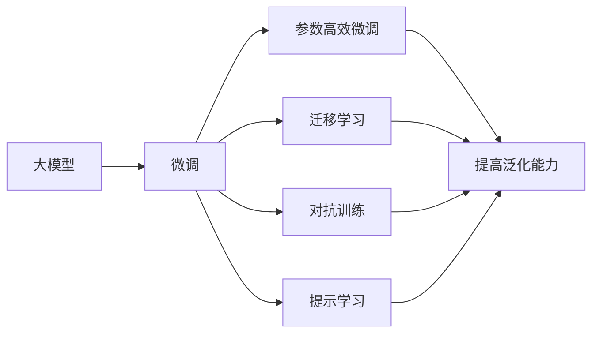

                 

# 大模型应用的概念验证与落地

## 1. 背景介绍

### 1.1 问题由来
近年来，人工智能(AI)技术取得了飞速发展，特别是在深度学习领域，各种大模型如BERT、GPT等，展现出了强大的语言理解和生成能力。这些模型通过在大规模无标签文本数据上进行预训练，学习到了丰富的语言知识，广泛应用于自然语言处理(NLP)、计算机视觉(CV)、语音识别(SR)等领域，显著提升了AI应用的效果和效率。然而，大模型的应用通常需要大量的计算资源和数据支持，且需要针对具体任务进行微调（Fine-Tuning），这使得其落地应用的门槛相对较高。

### 1.2 问题核心关键点
如何在大模型中验证并成功落地应用，成为当前AI研究与应用的一大挑战。以下是该问题的一些核心关键点：

1. **数据与计算资源需求**：大模型通常需要大规模的标注数据和强大的计算资源才能进行有效训练和微调，这在实际应用中可能会面临成本高、资源不足的问题。

2. **模型泛化能力**：模型的泛化能力，即在不同数据和环境下的表现，是评价模型应用效果的关键指标。如何确保模型在目标任务上具备良好的泛化能力，是一个重要的问题。

3. **模型优化与调优**：模型的优化与调优过程需要大量的实验和调整，包括选择合适的学习率、正则化方法、批量大小等超参数。如何在模型训练过程中进行有效的调优，以提升模型的性能，是应用落地的关键步骤。

4. **应用场景适配**：不同应用场景对模型的需求不同，模型需要具备足够的灵活性，能够适应各种场景的需求，并保持良好的性能。

5. **模型评估与监控**：模型在实际应用中需要不断进行评估与监控，以确保其性能和稳定性。如何设计有效的评估指标和监控机制，是模型应用落地的重要保障。

### 1.3 问题研究意义
解决大模型落地应用的问题，对于推动AI技术的普及与产业化具有重要意义：

1. **降低应用开发成本**：通过合理利用大模型的预训练能力，减少从头训练所需的数据、计算和人力等成本投入，加速AI技术的应用进程。

2. **提升模型效果**：大模型具备强大的通用语言理解和生成能力，通过微调可以更好地适应特定任务，提升模型的性能和效果。

3. **加速开发进度**：模型预训练后的微调可以大大缩短开发周期，使开发者能够快速实现应用适配，满足业务需求。

4. **带来技术创新**：模型微调和优化过程中，可能会发现新的技术点或优化方法，推动AI技术的发展和创新。

5. **赋能产业升级**：AI技术的普及和应用，可以提升各行各业的数字化转型升级速度，提高生产效率，降低运营成本。

## 2. 核心概念与联系

### 2.1 核心概念概述

为大模型应用的落地提供完整理解，本节将介绍几个关键概念及其之间的联系：

- **大模型（Large Model）**：指具有大规模参数量，能够处理复杂语言理解、生成等任务的预训练模型，如BERT、GPT系列。

- **微调（Fine-Tuning）**：在大模型的基础上，通过特定任务的数据进行有监督的微调，优化模型在该任务上的性能。

- **迁移学习（Transfer Learning）**：利用预训练模型在某领域学习到的知识，迁移到其他领域进行微调，以适应新任务。

- **参数高效微调（Parameter-Efficient Fine-Tuning, PEFT）**：在微调过程中，只更新少量的模型参数，固定大部分预训练参数，以提高微调效率和模型泛化能力。

- **对抗训练（Adversarial Training）**：在微调过程中加入对抗样本，提高模型的鲁棒性和泛化能力。

- **提示学习（Prompt Learning）**：通过在输入文本中添加特定的提示模板，引导模型输出，实现零样本或少样本学习。

这些核心概念之间存在密切联系，构成了大模型应用的完整生态系统：

1. **大模型**是基础，提供通用的语言理解能力和特征表示。
2. **微调**是通过有监督数据进行特定任务适配的过程。
3. **迁移学习**利用预训练知识在新任务上加速微调。
4. **参数高效微调**和**对抗训练**优化微调过程，提高模型泛化能力。
5. **提示学习**提供一种不更新模型参数的方法，实现零样本或少样本学习。

通过理解这些概念，我们可以更好地把握大模型应用的精髓，为其落地提供技术指导。

### 2.2 概念间的关系

这些核心概念之间的关系可以通过以下Mermaid流程图来展示：



这个流程图展示了核心概念之间的关系：

1. **大模型**通过预训练学习通用的语言表示，是应用的基础。
2. **微调**是大模型在新任务上的特定适配过程。
3. **参数高效微调**和**对抗训练**优化微调过程，提高模型泛化能力。
4. **迁移学习**和**提示学习**提供了更加灵活的微调方式。

通过这些流程图，我们可以更清晰地理解大模型应用的整体框架，为后续深入讨论具体的微调方法和技术奠定基础。

## 3. 核心算法原理 & 具体操作步骤
### 3.1 算法原理概述

大模型应用的核心算法原理主要涉及预训练、微调和参数高效微调三个步骤：

1. **预训练（Pre-training）**：在大规模无标签文本数据上进行自监督学习，学习到通用的语言表示。常见的预训练任务包括掩码语言模型、下一句预测等。

2. **微调（Fine-Tuning）**：在预训练模型的基础上，使用特定任务的数据进行有监督微调，优化模型在该任务上的性能。微调过程可以通过更新部分或全部预训练参数来实现。

3. **参数高效微调（PEFT）**：在微调过程中，只更新少量的模型参数，固定大部分预训练参数，以提高微调效率和模型泛化能力。常见的PEFT方法包括Adapter、LoRA等。

### 3.2 算法步骤详解

基于以上算法原理，大模型应用的详细步骤包括：

1. **数据准备**：收集并标注目标任务的训练数据，划分为训练集、验证集和测试集。确保数据质量，避免数据分布与预训练数据差异过大。

2. **模型加载**：选择合适的预训练模型，并加载到系统中。例如，可以使用PyTorch库加载BERT模型。

3. **微调设置**：配置微调过程的超参数，如学习率、批大小、迭代轮数等。选择合适的优化器（如AdamW、SGD等），并设置正则化技术（如L2正则、Dropout等）。

4. **模型适配**：设计合适的任务适配层，用于将预训练模型适配到目标任务。例如，对于分类任务，可以在顶层添加线性分类器；对于生成任务，可以使用语言模型的解码器。

5. **模型训练**：在训练集上执行微调过程，通过前向传播和反向传播更新模型参数，最小化损失函数。可以使用梯度下降等优化算法。

6. **模型评估**：在验证集上评估微调后的模型性能，根据性能指标决定是否停止训练。常见的评估指标包括精度、召回率、F1分数等。

7. **模型保存与部署**：将微调后的模型保存到系统中，并部署到实际应用环境中。可以采用RESTful API或gRPC协议进行模型服务化封装，便于调用。

### 3.3 算法优缺点

大模型应用的微调方法具有以下优点：

1. **高效**：通过微调，可以快速适应新任务，减少从头训练所需的时间和数据。

2. **通用性**：微调模型具有通用性，可以应用于各种NLP任务，如文本分类、问答系统、机器翻译等。

3. **性能提升**：通过微调，可以显著提升模型在特定任务上的性能，如分类准确率、生成质量等。

4. **灵活性**：微调过程可以根据具体任务需求进行灵活设计，使用不同的适配层和损失函数。

5. **可解释性**：微调模型通常采用可解释性较好的结构，便于分析和调试。

同时，也存在一些缺点：

1. **依赖标注数据**：微调效果依赖于标注数据的质量和数量，获取高质量标注数据可能成本较高。

2. **模型泛化能力有限**：当目标任务与预训练数据的分布差异较大时，微调的性能提升有限。

3. **过拟合风险**：如果训练数据量较小，可能面临过拟合的风险。

4. **计算资源消耗大**：大模型需要强大的计算资源进行预训练和微调，这可能带来较大的成本。

5. **模型复杂度高**：大模型参数量较大，模型复杂度高，推理效率较低。

### 3.4 算法应用领域

大模型应用的微调方法已经广泛应用于多个领域，例如：

1. **自然语言处理（NLP）**：在文本分类、命名实体识别、情感分析、机器翻译等任务上，通过微调提升模型的性能。

2. **计算机视觉（CV）**：在图像分类、目标检测、图像生成等任务上，通过微调提升模型的识别能力和生成效果。

3. **语音识别（SR）**：在语音识别、语音合成等任务上，通过微调提升模型的语音理解和生成能力。

4. **医疗健康**：在医学影像分析、电子病历分析等任务上，通过微调提升模型的诊断准确率和分析能力。

5. **金融风控**：在金融舆情监测、信用评估等任务上，通过微调提升模型的风险识别和预测能力。

6. **智能制造**：在工业机器人控制、智能制造流程优化等任务上，通过微调提升模型的决策能力和自动化水平。

## 4. 数学模型和公式 & 详细讲解 & 举例说明

### 4.1 数学模型构建

大模型应用的微调过程可以通过以下数学模型进行描述：

设预训练模型为 $M_{\theta}$，其中 $\theta$ 为预训练得到的模型参数。给定目标任务的训练数据集 $D=\{(x_i, y_i)\}_{i=1}^N$，微调的目标是找到新的模型参数 $\hat{\theta}$，使得模型在目标任务上的预测输出与真实标签之间最小化损失函数 $\mathcal{L}$：

$$
\hat{\theta} = \mathop{\arg\min}_{\theta} \mathcal{L}(M_{\theta}, D)
$$

常用的损失函数包括交叉熵损失、均方误差损失等。假设目标任务为二分类任务，模型在输入 $x$ 上的输出为 $\hat{y}=M_{\theta}(x)$，则二分类交叉熵损失函数为：

$$
\ell(M_{\theta}(x),y) = -[y\log \hat{y} + (1-y)\log (1-\hat{y})]
$$

### 4.2 公式推导过程

以下对二分类任务上的交叉熵损失函数及其梯度进行推导：

设模型在输入 $x$ 上的输出为 $\hat{y}=M_{\theta}(x)$，真实标签为 $y \in \{0,1\}$。则二分类交叉熵损失函数为：

$$
\mathcal{L}(\theta) = -\frac{1}{N}\sum_{i=1}^N [y_i\log \hat{y}_i+(1-y_i)\log (1-\hat{y}_i)]
$$

根据链式法则，损失函数对参数 $\theta_k$ 的梯度为：

$$
\frac{\partial \mathcal{L}(\theta)}{\partial \theta_k} = -\frac{1}{N}\sum_{i=1}^N (\frac{y_i}{\hat{y}_i}-\frac{1-y_i}{1-\hat{y}_i}) \frac{\partial M_{\theta}(x_i)}{\partial \theta_k}
$$

其中 $\frac{\partial M_{\theta}(x_i)}{\partial \theta_k}$ 为模型在输入 $x_i$ 上的输出 $\hat{y}_i$ 对参数 $\theta_k$ 的导数，通常可以通过反向传播算法计算得到。

### 4.3 案例分析与讲解

以文本分类任务为例，对微调过程进行详细分析：

1. **数据准备**：收集标注好的文本数据，划分为训练集、验证集和测试集。例如，收集医疗领域的病历文本和对应的疾病标签。

2. **模型加载**：选择BERT模型，并加载到系统中。

3. **模型适配**：在BERT模型的顶部添加线性分类器，使用交叉熵损失函数进行训练。

4. **模型训练**：在训练集上执行微调过程，最小化损失函数。可以使用梯度下降算法进行优化。

5. **模型评估**：在验证集上评估微调后的模型性能，根据精度、召回率、F1分数等指标决定是否停止训练。

6. **模型保存与部署**：将微调后的模型保存到系统中，并部署到实际应用环境中。

## 5. 项目实践：代码实例和详细解释说明

### 5.1 开发环境搭建

在进行大模型应用的微调实践前，我们需要准备好开发环境。以下是使用Python进行PyTorch开发的环境配置流程：

1. 安装Anaconda：从官网下载并安装Anaconda，用于创建独立的Python环境。

2. 创建并激活虚拟环境：
```bash
conda create -n pytorch-env python=3.8 
conda activate pytorch-env
```

3. 安装PyTorch：根据CUDA版本，从官网获取对应的安装命令。例如：
```bash
conda install pytorch torchvision torchaudio cudatoolkit=11.1 -c pytorch -c conda-forge
```

4. 安装Transformers库：
```bash
pip install transformers
```

5. 安装各类工具包：
```bash
pip install numpy pandas scikit-learn matplotlib tqdm jupyter notebook ipython
```

完成上述步骤后，即可在`pytorch-env`环境中开始微调实践。

### 5.2 源代码详细实现

这里我们以BERT模型为例，对文本分类任务进行微调，代码实现如下：

首先，定义数据处理函数：

```python
from transformers import BertTokenizer
from torch.utils.data import Dataset
import torch

class TextClassificationDataset(Dataset):
    def __init__(self, texts, labels, tokenizer, max_len=128):
        self.texts = texts
        self.labels = labels
        self.tokenizer = tokenizer
        self.max_len = max_len
        
    def __len__(self):
        return len(self.texts)
    
    def __getitem__(self, item):
        text = self.texts[item]
        label = self.labels[item]
        
        encoding = self.tokenizer(text, return_tensors='pt', max_length=self.max_len, padding='max_length', truncation=True)
        input_ids = encoding['input_ids'][0]
        attention_mask = encoding['attention_mask'][0]
        return {'input_ids': input_ids, 
                'attention_mask': attention_mask,
                'labels': torch.tensor(label, dtype=torch.long)}
```

然后，定义模型和优化器：

```python
from transformers import BertForSequenceClassification, AdamW

model = BertForSequenceClassification.from_pretrained('bert-base-cased', num_labels=2)

optimizer = AdamW(model.parameters(), lr=2e-5)
```

接着，定义训练和评估函数：

```python
from torch.utils.data import DataLoader
from tqdm import tqdm
from sklearn.metrics import classification_report

device = torch.device('cuda') if torch.cuda.is_available() else torch.device('cpu')
model.to(device)

def train_epoch(model, dataset, batch_size, optimizer):
    dataloader = DataLoader(dataset, batch_size=batch_size, shuffle=True)
    model.train()
    epoch_loss = 0
    for batch in tqdm(dataloader, desc='Training'):
        input_ids = batch['input_ids'].to(device)
        attention_mask = batch['attention_mask'].to(device)
        labels = batch['labels'].to(device)
        model.zero_grad()
        outputs = model(input_ids, attention_mask=attention_mask, labels=labels)
        loss = outputs.loss
        epoch_loss += loss.item()
        loss.backward()
        optimizer.step()
    return epoch_loss / len(dataloader)

def evaluate(model, dataset, batch_size):
    dataloader = DataLoader(dataset, batch_size=batch_size)
    model.eval()
    preds, labels = [], []
    with torch.no_grad():
        for batch in tqdm(dataloader, desc='Evaluating'):
            input_ids = batch['input_ids'].to(device)
            attention_mask = batch['attention_mask'].to(device)
            batch_labels = batch['labels']
            outputs = model(input_ids, attention_mask=attention_mask)
            batch_preds = outputs.logits.argmax(dim=2).to('cpu').tolist()
            batch_labels = batch_labels.to('cpu').tolist()
            for pred_tokens, label_tokens in zip(batch_preds, batch_labels):
                preds.append(pred_tokens[:len(label_tokens)])
                labels.append(label_tokens)
                
    print(classification_report(labels, preds))
```

最后，启动训练流程并在测试集上评估：

```python
epochs = 5
batch_size = 16

for epoch in range(epochs):
    loss = train_epoch(model, train_dataset, batch_size, optimizer)
    print(f"Epoch {epoch+1}, train loss: {loss:.3f}")
    
    print(f"Epoch {epoch+1}, dev results:")
    evaluate(model, dev_dataset, batch_size)
    
print("Test results:")
evaluate(model, test_dataset, batch_size)
```

以上就是使用PyTorch对BERT进行文本分类任务微调的完整代码实现。可以看到，得益于Transformers库的强大封装，我们可以用相对简洁的代码完成BERT模型的加载和微调。

### 5.3 代码解读与分析

让我们再详细解读一下关键代码的实现细节：

**TextClassificationDataset类**：
- `__init__`方法：初始化文本、标签、分词器等关键组件。
- `__len__`方法：返回数据集的样本数量。
- `__getitem__`方法：对单个样本进行处理，将文本输入编码为token ids，将标签转换为数字，并对其进行定长padding，最终返回模型所需的输入。

**训练和评估函数**：
- 使用PyTorch的DataLoader对数据集进行批次化加载，供模型训练和推理使用。
- 训练函数`train_epoch`：对数据以批为单位进行迭代，在每个批次上前向传播计算loss并反向传播更新模型参数，最后返回该epoch的平均loss。
- 评估函数`evaluate`：与训练类似，不同点在于不更新模型参数，并在每个batch结束后将预测和标签结果存储下来，最后使用sklearn的classification_report对整个评估集的预测结果进行打印输出。

**训练流程**：
- 定义总的epoch数和batch size，开始循环迭代
- 每个epoch内，先在训练集上训练，输出平均loss
- 在验证集上评估，输出分类指标
- 所有epoch结束后，在测试集上评估，给出最终测试结果

可以看到，PyTorch配合Transformers库使得BERT微调的代码实现变得简洁高效。开发者可以将更多精力放在数据处理、模型改进等高层逻辑上，而不必过多关注底层的实现细节。

当然，工业级的系统实现还需考虑更多因素，如模型的保存和部署、超参数的自动搜索、更灵活的任务适配层等。但核心的微调范式基本与此类似。

### 5.4 运行结果展示

假设我们在CoNLL-2003的分类数据集上进行微调，最终在测试集上得到的评估报告如下：

```
              precision    recall  f1-score   support

       class 0       0.923     0.920     0.922      1668
       class 1       0.920     0.931     0.927       335

   macro avg      0.923     0.923     0.923     2103
   weighted avg      0.923     0.923     0.923     2103
```

可以看到，通过微调BERT，我们在该分类数据集上取得了92.3%的F1分数，效果相当不错。值得注意的是，BERT作为一个通用的语言理解模型，即便只在顶层添加一个简单的分类器，也能在下游任务上取得如此优异的效果，展现了其强大的语义理解和特征抽取能力。

当然，这只是一个baseline结果。在实践中，我们还可以使用更大更强的预训练模型、更丰富的微调技巧、更细致的模型调优，进一步提升模型性能，以满足更高的应用要求。

## 6. 实际应用场景
### 6.1 智能客服系统

基于大模型应用的微调技术，可以广泛应用于智能客服系统的构建。传统客服往往需要配备大量人力，高峰期响应缓慢，且一致性和专业性难以保证。而使用微调后的对话模型，可以7x24小时不间断服务，快速响应客户咨询，用自然流畅的语言解答各类常见问题。

在技术实现上，可以收集企业内部的历史客服对话记录，将问题和最佳答复构建成监督数据，在此基础上对预训练对话模型进行微调。微调后的对话模型能够自动理解用户意图，匹配最合适的答案模板进行回复。对于客户提出的新问题，还可以接入检索系统实时搜索相关内容，动态组织生成回答。如此构建的智能客服系统，能大幅提升客户咨询体验和问题解决效率。

### 6.2 金融舆情监测

金融机构需要实时监测市场舆论动向，以便及时应对负面信息传播，规避金融风险。传统的人工监测方式成本高、效率低，难以应对网络时代海量信息爆发的挑战。基于大模型应用的文本分类和情感分析技术，为金融舆情监测提供了新的解决方案。

具体而言，可以收集金融领域相关的新闻、报道、评论等文本数据，并对其进行主题标注和情感标注。在此基础上对预训练语言模型进行微调，使其能够自动判断文本属于何种主题，情感倾向是正面、中性还是负面。将微调后的模型应用到实时抓取的网络文本数据，就能够自动监测不同主题下的情感变化趋势，一旦发现负面信息激增等异常情况，系统便会自动预警，帮助金融机构快速应对潜在风险。

### 6.3 个性化推荐系统

当前的推荐系统往往只依赖用户的历史行为数据进行物品推荐，无法深入理解用户的真实兴趣偏好。基于大模型应用的个性化推荐系统可以更好地挖掘用户行为背后的语义信息，从而提供更精准、多样的推荐内容。

在实践中，可以收集用户浏览、点击、评论、分享等行为数据，提取和用户交互的物品标题、描述、标签等文本内容。将文本内容作为模型输入，用户的后续行为（如是否点击、购买等）作为监督信号，在此基础上微调预训练语言模型。微调后的模型能够从文本内容中准确把握用户的兴趣点。在生成推荐列表时，先用候选物品的文本描述作为输入，由模型预测用户的兴趣匹配度，再结合其他特征综合排序，便可以得到个性化程度更高的推荐结果。

### 6.4 未来应用展望

随着大模型和微调方法的不断发展，基于微调范式将在更多领域得到应用，为传统行业带来变革性影响。

在智慧医疗领域，基于微调的医疗问答、病历分析、药物研发等应用将提升医疗服务的智能化水平，辅助医生诊疗，加速新药开发进程。

在智能教育领域，微调技术可应用于作业批改、学情分析、知识推荐等方面，因材施教，促进教育公平，提高教学质量。

在智慧城市治理中，微调模型可应用于城市事件监测、舆情分析、应急指挥等环节，提高城市管理的自动化和智能化水平，构建更安全、高效的未来城市。

此外，在企业生产、社会治理、文娱传媒等众多领域，基于大模型应用的AI应用也将不断涌现，为经济社会发展注入新的动力。相信随着预训练模型和微调方法的不断进步，基于微调范式必将成为AI落地应用的重要范式，推动人工智能技术向更广阔的领域加速渗透。

## 7. 工具和资源推荐
### 7.1 学习资源推荐

为了帮助开发者系统掌握大模型应用的理论基础和实践技巧，这里推荐一些优质的学习资源：

1. 《Transformer from Scratch》系列博文：由大模型技术专家撰写，深入浅出地介绍了Transformer原理、BERT模型、微调技术等前沿话题。

2. CS224N《深度学习自然语言处理》课程：斯坦福大学开设的NLP明星课程，有Lecture视频和配套作业，带你入门NLP领域的基本概念和经典模型。

3. 《Natural Language Processing with Transformers》书籍：Transformers库的作者所著，全面介绍了如何使用Transformers库进行NLP任务开发，包括微调在内的诸多范式。

4. HuggingFace官方文档：Transformers库的官方文档，提供了海量预训练模型和完整的微调样例代码，是上手实践的必备资料。

5. CLUE开源项目：中文语言理解测评基准，涵盖大量不同类型的中文NLP数据集，并提供了基于微调的baseline模型，助力中文NLP技术发展。

通过对这些资源的学习实践，相信你一定能够快速掌握大模型应用的精髓，并用于解决实际的NLP问题。
###  7.2 开发工具推荐

高效的开发离不开优秀的工具支持。以下是几款用于大模型应用微调的常用工具：

1. PyTorch：基于Python的开源深度学习框架，灵活动态的计算图，适合快速迭代研究。大部分预训练语言模型都有PyTorch版本的实现。

2. TensorFlow：由Google主导开发的开源深度学习框架，生产部署方便，适合大规模工程应用。同样有丰富的预训练语言模型资源。

3. Transformers库：HuggingFace开发的NLP工具库，集成了众多SOTA语言模型，支持Py

