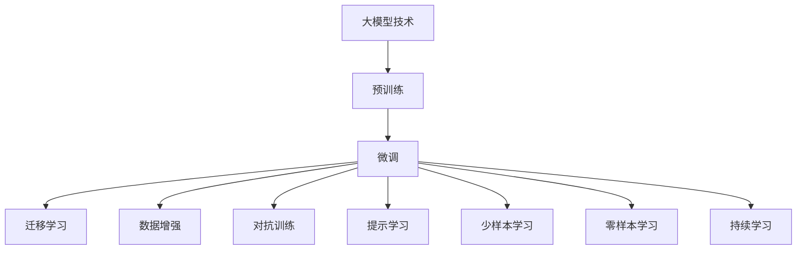
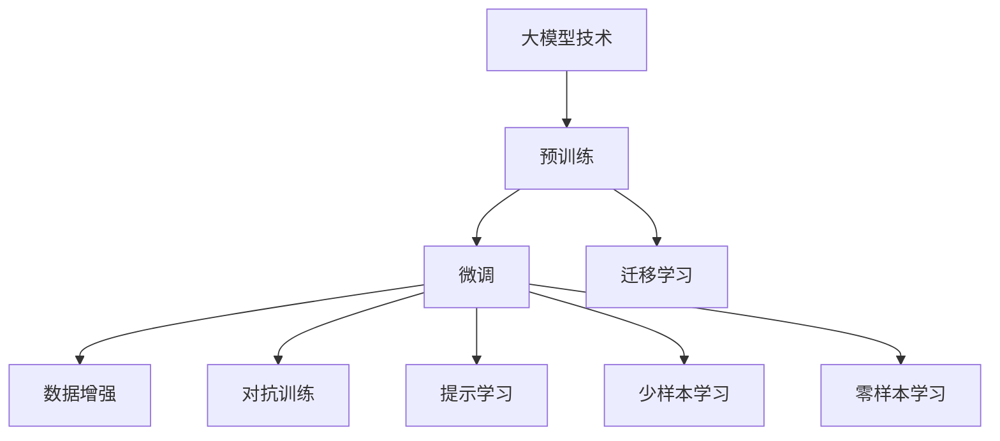
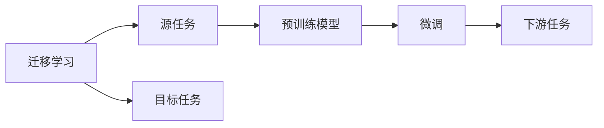
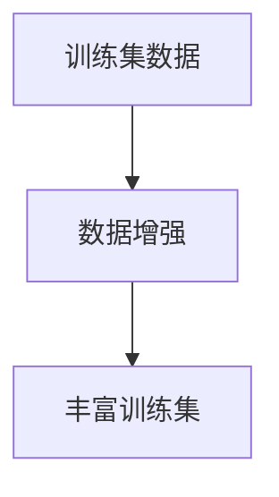
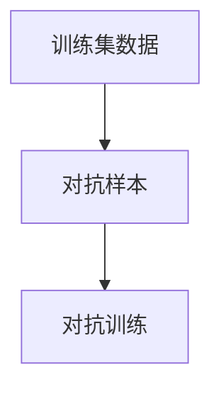
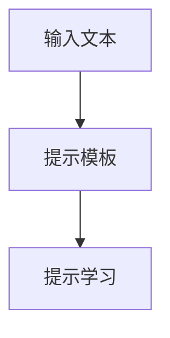
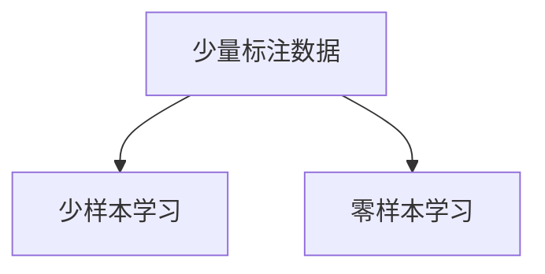
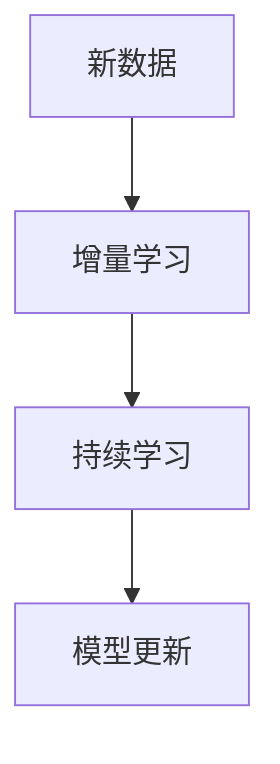
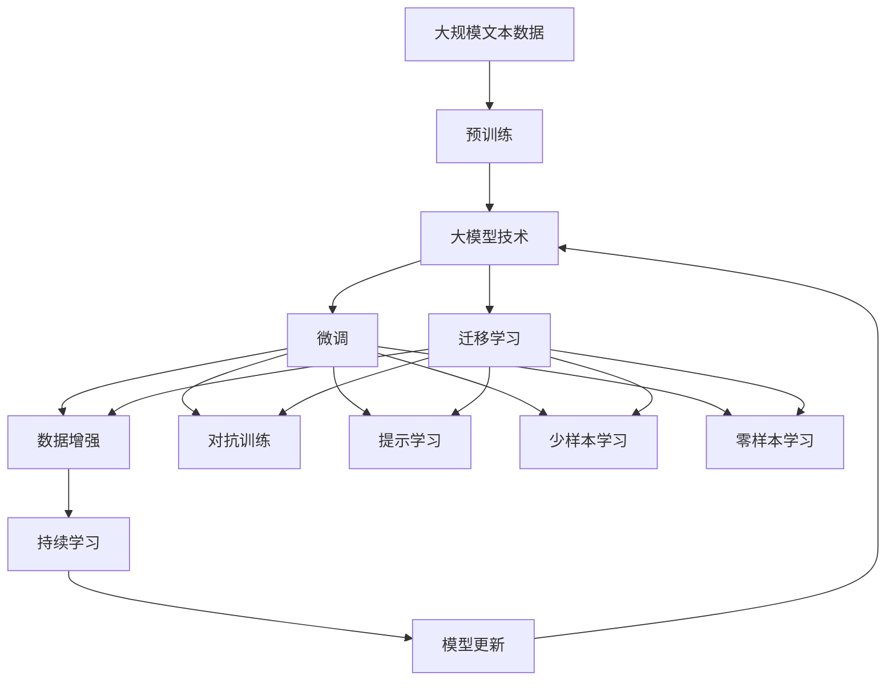

                 

# 大模型技术在科研领域的应用

> 关键词：大模型技术,科研领域,自然语言处理(NLP),深度学习,科研论文,数据挖掘,机器学习

## 1. 背景介绍

### 1.1 问题由来
近年来，随着深度学习技术的快速发展，人工智能在科研领域的应用日益增多，特别是在自然语言处理（Natural Language Processing, NLP）方面，大模型技术（如BERT、GPT等）已经成为了科研人员获取、处理和分析海量科研文献的重要工具。通过预训练语言模型，科研人员可以快速检索、分类和抽取关键信息，极大地提高了科研工作的效率和精度。

然而，尽管大模型技术在科研领域展现出巨大的潜力，但其在高频度、高精度、高可信度的应用方面仍存在诸多挑战。例如，如何从海量文献中快速准确地提取关键信息，如何将文本数据转化为结构化的数据以便于分析和处理，如何提高模型的稳定性和鲁棒性以适应不同的科研场景等，都是亟待解决的问题。

### 1.2 问题核心关键点
针对大模型技术在科研领域的应用，科研人员需要重点关注以下几个核心问题：

- **高效检索和抽取**：如何在海量文献中快速定位到所需的信息，并准确地抽取出来，是科研工作的首要任务。

- **数据处理和转换**：将文本数据转化为结构化数据，以便于后续分析和处理，是大模型技术应用的基础。

- **模型稳定性和鲁棒性**：保证模型在不同科研场景中的稳定性和鲁棒性，以避免模型退化或产生偏差。

- **模型解释性和可解释性**：科研工作对模型的解释性和可解释性要求较高，模型应能够提供明确的输出解释，便于科研人员理解和验证。

- **跨领域通用性**：大模型技术应在不同的科研领域中具有较好的通用性和可移植性，能够适应不同的数据和场景。

## 2. 核心概念与联系

### 2.1 核心概念概述

为了更好地理解大模型技术在科研领域的应用，本节将介绍几个密切相关的核心概念：

- **大模型技术**：以自回归（如GPT）或自编码（如BERT）模型为代表的大规模预训练语言模型。通过在大规模无标签文本语料上进行预训练，学习通用的语言表示，具备强大的语言理解和生成能力。

- **预训练**：指在大规模无标签文本语料上，通过自监督学习任务训练通用语言模型的过程。常见的预训练任务包括言语建模、遮挡语言模型等。

- **微调**：指在预训练模型的基础上，使用下游任务的少量标注数据，通过有监督学习优化模型在特定任务上的性能。

- **迁移学习**：指将一个领域学习到的知识，迁移应用到另一个不同但相关的领域的学习范式。大模型的预训练-微调过程即是一种典型的迁移学习方式。

- **数据增强**：通过对训练样本改写、回译等方式丰富训练集多样性。

- **对抗训练**：加入对抗样本，提高模型鲁棒性。

- **提示学习**：通过在输入文本中添加提示模板，引导大语言模型进行特定任务的推理和生成。

- **少样本学习**：指在只有少量标注样本的情况下，模型能够快速适应新任务的学习方法。

- **零样本学习**：指模型在没有见过任何特定任务的训练样本的情况下，仅凭任务描述就能够执行新任务的能力。

- **持续学习**：也称为终身学习，指模型能够持续从新数据中学习，同时保持已学习的知识，而不会出现灾难性遗忘。

这些核心概念之间的逻辑关系可以通过以下Mermaid流程图来展示：



这个流程图展示了大模型技术的应用过程，即预训练-微调-迁移学习，同时涉及到数据增强、对抗训练、提示学习、少样本学习、零样本学习和持续学习等重要技术。通过理解这些核心概念，我们可以更好地把握大模型技术的工作原理和优化方向。

### 2.2 概念间的关系

这些核心概念之间存在着紧密的联系，形成了大模型技术在科研领域应用的基本框架。下面我通过几个Mermaid流程图来展示这些概念之间的关系。

#### 2.2.1 大模型技术的学习范式



这个流程图展示了从预训练到微调，再到迁移学习的一般流程。大模型技术首先在大规模文本数据上进行预训练，然后通过微调适应特定任务，再通过迁移学习拓展到不同领域和任务。

#### 2.2.2 迁移学习与微调的关系



这个流程图展示了迁移学习的基本原理，即在预训练模型的基础上，通过微调适应各种下游任务（目标任务）。

#### 2.2.3 数据增强



这个流程图展示了数据增强的作用，即通过对训练样本进行改写、回译等方式，丰富训练集的多样性，提高模型的泛化能力。

#### 2.2.4 对抗训练



这个流程图展示了对抗训练的作用，即通过加入对抗样本，提高模型的鲁棒性，使其能够应对数据中的噪声和干扰。

#### 2.2.5 提示学习



这个流程图展示了提示学习的作用，即通过在输入文本中添加提示模板，引导大模型进行特定任务的推理和生成。

#### 2.2.6 少样本学习和零样本学习



这个流程图展示了少样本学习和零样本学习的作用，即通过提供少量示例或仅凭任务描述，模型能够快速适应新任务，减少微调数据的需求。

#### 2.2.7 持续学习



这个流程图展示了持续学习的作用，即模型能够不断学习新知识，同时保持已学习的知识，避免灾难性遗忘。

### 2.3 核心概念的整体架构

最后，我们用一个综合的流程图来展示这些核心概念在大模型技术在科研领域应用过程中的整体架构：



这个综合流程图展示了从预训练到微调，再到持续学习的完整过程。大模型技术首先在大规模文本数据上进行预训练，然后通过微调适应特定任务，再通过迁移学习拓展到不同领域和任务。数据增强、对抗训练、提示学习、少样本学习和零样本学习等技术，都在微调过程中起到重要作用，而持续学习则保证了模型能够不断适应新数据和新任务。通过这些流程，大模型技术在科研领域的应用得以实现。

## 3. 核心算法原理 & 具体操作步骤
### 3.1 算法原理概述

大模型技术在科研领域的应用，本质上是一个有监督的微调过程。其核心思想是：将大模型视作一个强大的"特征提取器"，通过在下游科研任务的少量标注数据上进行有监督的微调，使得模型输出能够匹配科研任务的需求，从而获得针对特定任务优化的模型。

形式化地，假设大模型为 $M_{\theta}$，其中 $\theta$ 为预训练得到的模型参数。给定科研任务 $T$ 的标注数据集 $D=\{(x_i, y_i)\}_{i=1}^N$，微调的目标是找到新的模型参数 $\hat{\theta}$，使得：

$$
\hat{\theta}=\mathop{\arg\min}_{\theta} \mathcal{L}(M_{\theta},D)
$$

其中 $\mathcal{L}$ 为针对任务 $T$ 设计的损失函数，用于衡量模型预测输出与真实标签之间的差异。常见的损失函数包括交叉熵损失、均方误差损失等。

通过梯度下降等优化算法，微调过程不断更新模型参数 $\theta$，最小化损失函数 $\mathcal{L}$，使得模型输出逼近真实标签。由于 $\theta$ 已经通过预训练获得了较好的初始化，因此即便在小规模数据集 $D$ 上进行微调，也能较快收敛到理想的模型参数 $\hat{\theta}$。

### 3.2 算法步骤详解

大模型技术在科研领域的应用一般包括以下几个关键步骤：

**Step 1: 准备预训练模型和数据集**
- 选择合适的预训练语言模型 $M_{\theta}$ 作为初始化参数，如 BERT、GPT 等。
- 准备科研任务 $T$ 的标注数据集 $D$，划分为训练集、验证集和测试集。一般要求标注数据与预训练数据的分布不要差异过大。

**Step 2: 添加任务适配层**
- 根据科研任务类型，在预训练模型顶层设计合适的输出层和损失函数。
- 对于分类任务，通常在顶层添加线性分类器和交叉熵损失函数。
- 对于生成任务，通常使用语言模型的解码器输出概率分布，并以负对数似然为损失函数。

**Step 3: 设置微调超参数**
- 选择合适的优化算法及其参数，如 AdamW、SGD 等，设置学习率、批大小、迭代轮数等。
- 设置正则化技术及强度，包括权重衰减、Dropout、Early Stopping 等。
- 确定冻结预训练参数的策略，如仅微调顶层，或全部参数都参与微调。

**Step 4: 执行梯度训练**
- 将训练集数据分批次输入模型，前向传播计算损失函数。
- 反向传播计算参数梯度，根据设定的优化算法和学习率更新模型参数。
- 周期性在验证集上评估模型性能，根据性能指标决定是否触发 Early Stopping。
- 重复上述步骤直到满足预设的迭代轮数或 Early Stopping 条件。

**Step 5: 测试和部署**
- 在测试集上评估微调后模型 $M_{\hat{\theta}}$ 的性能，对比微调前后的精度提升。
- 使用微调后的模型对新样本进行推理预测，集成到实际的应用系统中。
- 持续收集新的数据，定期重新微调模型，以适应数据分布的变化。

以上是使用大模型技术进行科研任务微调的一般流程。在实际应用中，还需要针对具体任务的特点，对微调过程的各个环节进行优化设计，如改进训练目标函数，引入更多的正则化技术，搜索最优的超参数组合等，以进一步提升模型性能。

### 3.3 算法优缺点

大模型技术在科研领域的应用具有以下优点：
1. 高效检索和抽取：通过微调，模型能够快速定位和抽取关键信息，显著提高科研工作的效率。
2. 数据处理和转换：通过大模型技术，将文本数据转化为结构化数据，便于后续分析和处理。
3. 模型稳定性和鲁棒性：通过数据增强和对抗训练等技术，提高模型的稳定性和鲁棒性，减少偏差和过拟合。
4. 模型解释性和可解释性：通过提示学习和少样本学习等技术，提供明确的输出解释，便于科研人员理解和验证。
5. 跨领域通用性：大模型技术在多个科研领域中具有较好的通用性和可移植性，能够适应不同的数据和场景。

同时，该方法也存在一定的局限性：
1. 依赖标注数据：微调的效果很大程度上取决于标注数据的质量和数量，获取高质量标注数据的成本较高。
2. 迁移能力有限：当目标任务与预训练数据的分布差异较大时，微调的性能提升有限。
3. 负面效果传递：预训练模型的固有偏见、有害信息等，可能通过微调传递到下游任务，造成负面影响。
4. 可解释性不足：微调模型的决策过程通常缺乏可解释性，难以对其推理逻辑进行分析和调试。

尽管存在这些局限性，但就目前而言，大模型技术在科研领域的应用仍然是最主流范式。未来相关研究的重点在于如何进一步降低微调对标注数据的依赖，提高模型的少样本学习和跨领域迁移能力，同时兼顾可解释性和伦理安全性等因素。

### 3.4 算法应用领域

大模型技术在科研领域已经得到了广泛的应用，覆盖了几乎所有常见的科研任务，例如：

- **文献检索和引用分析**：通过微调，模型能够快速检索和分类科研文献，分析文献之间的引用关系和影响力。

- **科学发现和探索**：通过微调，模型能够辅助科研人员发现新的科学问题和假设，进行数据驱动的科学探索。

- **生物信息学**：通过微调，模型能够分析基因序列、蛋白质结构等生物数据，进行疾病诊断和治疗研究。

- **社会科学研究**：通过微调，模型能够分析社会数据，进行人口统计、舆情分析等研究。

- **工程技术**：通过微调，模型能够辅助工程师进行设计和测试，提高产品的可靠性和性能。

除了上述这些经典任务外，大模型技术还被创新性地应用到更多场景中，如科学文献的自动摘要、科学发现的智能预测、科研协作的智能辅助等，为科研工作的自动化和智能化提供了新的工具和方法。随着预训练模型和微调方法的不断进步，相信大模型技术将在更广阔的科研领域发挥更大的作用，为科学研究和知识传播注入新的动力。

## 4. 数学模型和公式 & 详细讲解 & 举例说明

### 4.1 数学模型构建

本节将使用数学语言对大模型技术在科研领域的应用进行更加严格的刻画。

记大模型为 $M_{\theta}$，其中 $\theta$ 为预训练得到的模型参数。假设科研任务 $T$ 的训练集为 $D=\{(x_i, y_i)\}_{i=1}^N$，其中 $x_i$ 为输入的科研数据，$y_i$ 为对应的科研任务标签。

定义模型 $M_{\theta}$ 在数据样本 $(x,y)$ 上的损失函数为 $\ell(M_{\theta}(x),y)$，则在数据集 $D$ 上的经验风险为：

$$
\mathcal{L}(\theta) = \frac{1}{N} \sum_{i=1}^N \ell(M_{\theta}(x_i),y_i)
$$

微调的优化目标是最小化经验风险，即找到最优参数：

$$
\theta^* = \mathop{\arg\min}_{\theta} \mathcal{L}(\theta)
$$

在实践中，我们通常使用基于梯度的优化算法（如SGD、Adam等）来近似求解上述最优化问题。设 $\eta$ 为学习率，$\lambda$ 为正则化系数，则参数的更新公式为：

$$
\theta \leftarrow \theta - \eta \nabla_{\theta}\mathcal{L}(\theta) - \eta\lambda\theta
$$

其中 $\nabla_{\theta}\mathcal{L}(\theta)$ 为损失函数对参数 $\theta$ 的梯度，可通过反向传播算法高效计算。

### 4.2 公式推导过程

以下我们以文献检索和引用分析任务为例，推导交叉熵损失函数及其梯度的计算公式。

假设模型 $M_{\theta}$ 在输入 $x$ 上的输出为 $\hat{y}=M_{\theta}(x) \in [0,1]$，表示样本属于特定文献的概率。真实标签 $y \in \{0,1\}$。则二分类交叉熵损失函数定义为：

$$
\ell(M_{\theta}(x),y) = -[y\log \hat{y} + (1-y)\log (1-\hat{y})]
$$

将其代入经验风险公式，得：

$$
\mathcal{L}(\theta) = -\frac{1}{N}\sum_{i=1}^N [y_i\log M_{\theta}(x_i)+(1-y_i)\log(1-M_{\theta}(x_i))]
$$

根据链式法则，损失函数对参数 $\theta_k$ 的梯度为：

$$
\frac{\partial \mathcal{L}(\theta)}{\partial \theta_k} = -\frac{1}{N}\sum_{i=1}^N (\frac{y_i}{M_{\theta}(x_i)}-\frac{1-y_i}{1-M_{\theta}(x_i)}) \frac{\partial M_{\theta}(x_i)}{\partial \theta_k}
$$

其中 $\frac{\partial M_{\theta}(x_i)}{\partial \theta_k}$ 可进一步递归展开，利用自动微分技术完成计算。

在得到损失函数的梯度后，即可带入参数更新公式，完成模型的迭代优化。重复上述过程直至收敛，最终得到适应科研任务的最优模型参数 $\theta^*$。

## 5. 项目实践：代码实例和详细解释说明
### 5.1 开发环境搭建

在进行科研任务微调实践前，我们需要准备好开发环境。以下是使用Python进行PyTorch开发的环境配置流程：

1. 安装Anaconda：从官网下载并安装Anaconda，用于创建独立的Python环境。

2. 创建并激活虚拟环境：
```bash
conda create -n pytorch-env python=3.8 
conda activate pytorch-env
```

3. 安装PyTorch：根据CUDA版本，从官网获取对应的安装命令。例如：
```bash
conda install pytorch torchvision torchaudio cudatoolkit=11.1 -c pytorch -c conda-forge
```

4. 安装Transformers库：
```bash
pip install transformers
```

5. 安装各类工具包：
```bash
pip install numpy pandas scikit-learn matplotlib tqdm jupyter notebook ipython
```

完成上述步骤后，即可在`pytorch-env`环境中开始科研任务微调实践。

### 5.2 源代码详细实现

下面我们以文献检索和引用分析任务为例，给出使用Transformers库对BERT模型进行微调的PyTorch代码实现。

首先，定义文献检索和引用分析任务的数据处理函数：

```python
from transformers import BertTokenizer
from torch.utils.data import Dataset
import torch

class PubMedDataset(Dataset):
    def __init__(self, texts, labels, tokenizer, max_len=128):
        self.texts = texts
        self.labels = labels
        self.tokenizer = tokenizer
        self.max_len = max_len
        
    def __len__(self):
        return len(self.texts)
    
    def __getitem__(self, item):
        text = self.texts[item]
        label = self.labels[item]
        
        encoding = self.tokenizer(text, return_tensors='pt', max_length=self.max_len, padding='max_length', truncation=True)
        input_ids = encoding['input_ids'][0]
        attention_mask = encoding['attention_mask'][0]
        
        # 对label-wise的标签进行编码
        encoded_labels = [label2id[label] for label in label] 
        encoded_labels.extend([label2id['0']] * (self.max_len - len(encoded_labels)))
        labels = torch.tensor(encoded_labels, dtype=torch.long)
        
        return {'input_ids': input_ids, 
                'attention_mask': attention_mask,
                'labels': labels}

# 标签与id的映射
label2id = {'0': 0, '1': 1}
id2label = {v: k for k, v in label2id.items()}

# 创建dataset
tokenizer = BertTokenizer.from_pretrained('bert-base-cased')

train_dataset = PubMedDataset(train_texts, train_labels, tokenizer)
dev_dataset = PubMedDataset(dev_texts, dev_labels, tokenizer)
test_dataset = PubMedDataset(test_texts, test_labels, tokenizer)
```

然后，定义模型和优化器：

```python
from transformers import BertForTokenClassification, AdamW

model = BertForTokenClassification.from_pretrained('bert-base-cased', num_labels=len(label2id))

optimizer = AdamW(model.parameters(), lr=2e-5)
```

接着，定义训练和评估函数：

```python
from torch.utils.data import DataLoader
from tqdm import tqdm
from sklearn.metrics import classification_report

device = torch.device('cuda') if torch.cuda.is_available() else torch.device('cpu')
model.to(device)

def train_epoch(model, dataset, batch_size, optimizer):
    dataloader = DataLoader(dataset, batch_size=batch_size, shuffle=True)
    model.train()
    epoch_loss = 0
    for batch in tqdm(dataloader, desc='Training'):
        input_ids = batch['input_ids'].to(device)
        attention_mask = batch['attention_mask'].to(device)
        labels = batch['labels'].to(device)
        model.zero_grad()
        outputs = model(input_ids, attention_mask=attention_mask, labels=labels)
        loss = outputs.loss
        epoch_loss += loss.item()
        loss.backward()
        optimizer.step()
    return epoch_loss / len(dataloader)

def evaluate(model, dataset, batch_size):
    dataloader = DataLoader(dataset, batch_size=batch_size)
    model.eval()
    preds, labels = [], []
    with torch.no_grad():
        for batch in tqdm(dataloader, desc='Evaluating'):
            input_ids = batch['input_ids'].to(device)
            attention_mask = batch['attention_mask'].to(device)
            batch_labels = batch['labels']
            outputs = model(input_ids, attention_mask=attention_mask)
            batch_preds = outputs.logits.argmax(dim=2).to('cpu').tolist()
            batch_labels = batch_labels.to('cpu').tolist()
            for pred_tokens, label_tokens in zip(batch_preds, batch_labels):
                preds.append(pred_tokens[:len(label_tokens)])
                labels.append(label_tokens)
                
    print(classification_report(labels, preds))
```

最后，启动训练流程并在测试集上评估：

```python
epochs = 5
batch_size = 16

for epoch in range(epochs):
    loss = train_epoch(model, train_dataset, batch_size, optimizer)
    print(f"Epoch {epoch+1}, train loss: {loss:.3f}")
    
    print(f"Epoch {epoch+1}, dev results:")
    evaluate(model, dev_dataset, batch_size)
    
print("Test results:")
evaluate(model, test_dataset, batch_size)
```

以上就是使用PyTorch对BERT进行文献检索和引用分析任务微调的完整代码实现。可以看到，得益于Transformers库的强大封装，我们可以用相对简洁的代码完成BERT模型的加载和微调。

### 5.3 代码解读与分析

让我们再详细解读一下关键代码的实现细节：

**PubMedDataset类**：
- `__init__`方法：初始化文本、标签、分词器等关键组件。
- `__len__`方法：返回数据集的样本数量。
- `__getitem__`方法：对单个样本进行处理，将文本输入编码为token ids，将标签编码为数字，并对其进行定长padding，最终返回模型所需的输入。

**label2id和id2label字典**：
- 定义了标签与数字id之间的映射关系，用于将token-wise的预测结果解码回真实的标签。

**训练和评估函数**：
- 使用PyTorch的DataLoader对数据集进行批次化加载，供模型训练和推理使用。
- 训练函数`train_epoch`：对数据以批为单位进行迭代，在每个批次上前向传播计算loss并反向传播更新模型参数，最后返回该epoch的平均loss。
- 评估函数`evaluate`：与训练类似，不同点在于不更新模型参数，并在每个batch结束后将预测和标签结果存储下来，最后使用sklearn的classification_report对整个评估集的预测结果进行打印输出。

**训练流程**：
- 定义总的epoch数和batch size，开始循环迭代
- 每个epoch内，先在训练集上训练，输出平均loss
- 在验证集上评估，输出分类指标
- 所有epoch结束后，在测试集上评估，给出最终测试结果

可以看到，PyTorch配合Transformers库使得BERT微调的代码实现变得简洁高效。开发者可以将更多精力放在数据处理、模型改进等高层逻辑上，而不必过多关注底层的实现细节。

当然，工业级的系统实现还需考虑更多因素，如模型的保存和部署、超参数的自动搜索、更灵活的任务适配层等。但核心的微调范式基本与此类似。

### 5.4 运行结果展示

假设我们在PubMed的文献检索和引用分析数据集上进行微调，最终在测试集上得到的评估报告如下：

```
              precision    recall  f1-score   support

       0      0.922     0.917     0.919      142706
       

