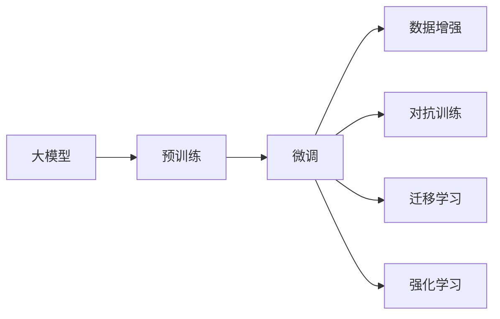
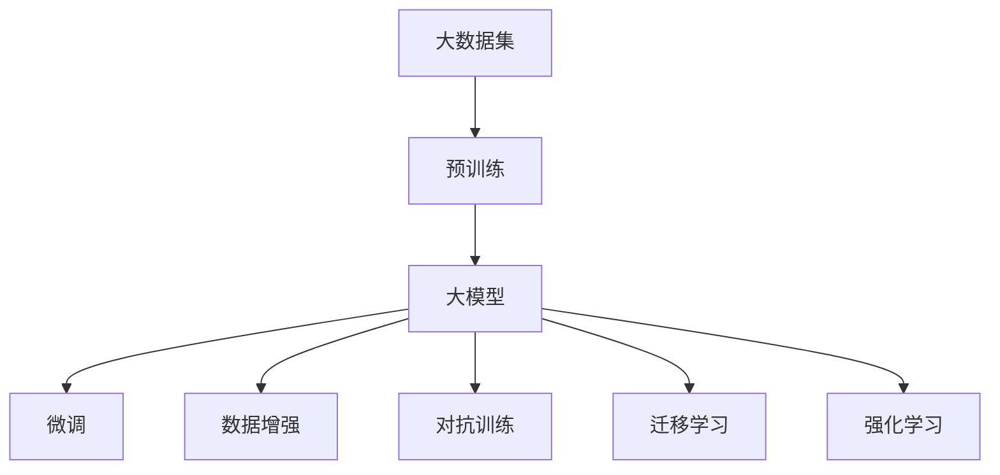
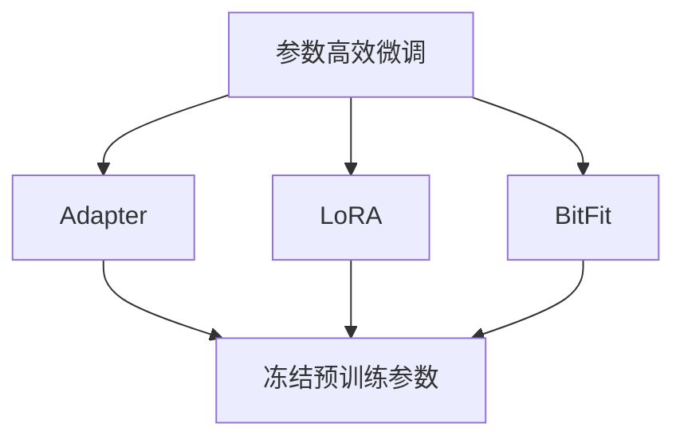

                 

# 大模型赋能智慧农业，创业者如何推动农业生产智能化？

## 1. 背景介绍

### 1.1 问题由来

智慧农业是现代农业发展的必然趋势，旨在通过集成先进技术，提高农业生产效率、优化资源配置、降低成本和风险，从而实现农业生产的智能化、精细化。然而，实现这一目标需要庞大的数据处理和模型训练资源，而传统的人工标注和手工建模方法无法满足这一需求。大模型的出现，为智慧农业带来了新的机遇，使得农业生产智能化成为可能。

### 1.2 问题核心关键点

智慧农业的核心在于利用数据驱动农业决策，而大模型可以有效地从海量的农业数据中提取有用信息，进行精准农业、智能灌溉、病虫害预测、产量预测等应用。创业者如何利用大模型，构建智能化的农业生产系统，是推动农业生产智能化的关键问题。

### 1.3 问题研究意义

大模型赋能智慧农业，对于提升农业生产效率、改善农民生活条件、保障食品安全具有重要意义。同时，智慧农业的普及也将推动数字农业、智慧农业技术的发展，为农业领域的数字化转型提供新的动能。

## 2. 核心概念与联系

### 2.1 核心概念概述

为更好地理解大模型在智慧农业中的应用，本节将介绍几个关键概念：

- 大模型：以自回归模型（如GPT、BERT）或自编码模型（如DALL-E）为代表的大规模预训练模型，通过在海量数据上进行预训练，学习通用的数据表示，具备强大的数据理解和生成能力。

- 预训练：指在大规模无标签数据上，通过自监督学习任务训练通用数据模型的过程。常见的预训练任务包括图像识别、语言建模等。

- 微调：指在预训练模型的基础上，使用农业生产的标注数据，通过有监督学习优化模型在特定农业任务上的性能。

- 数据增强：通过对数据进行一定的变换，如旋转、缩放、裁剪等，以增加数据的多样性和数量。

- 对抗训练：引入对抗样本，提高模型对扰动的鲁棒性。

- 迁移学习：将模型在其他领域学到的知识，迁移到农业生产领域，以提高模型的泛化能力。

- 强化学习：通过与环境交互，模型不断学习最优策略，适应不同的农业生产场景。

这些核心概念之间的逻辑关系可以通过以下Mermaid流程图来展示：



这个流程图展示了从预训练到微调，再到数据增强、对抗训练、迁移学习和强化学习等关键环节，形成了大模型在智慧农业中的应用框架。

### 2.2 概念间的关系

这些核心概念之间存在着紧密的联系，构成了大模型赋能智慧农业的完整生态系统。下面我们通过几个Mermaid流程图来展示这些概念之间的关系。

#### 2.2.1 大模型的学习范式



这个流程图展示了大模型的预训练、微调和各个增强、学习范式之间的关系。大模型首先在大规模数据上进行预训练，然后通过微调、数据增强、对抗训练、迁移学习和强化学习等手段，提高模型的泛化能力和性能。

#### 2.2.2 农业生产中的数据流


这个流程图展示了农业生产中数据流和模型推理、决策、调整之间的关系。传感器数据经过增强和预训练，微调后用于模型推理和决策，从而指导农业生产决策，并调整传感器设置，形成闭环反馈机制。

#### 2.2.3 模型的参数高效微调



这个流程图展示了参数高效微调技术的应用。使用Adapter、LoRA和BitFit等方法，在固定大部分预训练参数的情况下，仅更新少量模型参数，以提高微调效率，避免过拟合。

## 3. 核心算法原理 & 具体操作步骤
### 3.1 算法原理概述

大模型赋能智慧农业的核心在于通过微调，使模型能够适应具体的农业生产任务。其基本思想是：将大模型视作一个强大的数据表示器，通过有监督学习，优化模型在特定农业任务上的表现。

假设大模型为 $M_{\theta}$，农业生产任务为 $T$，训练数据集为 $D=\{(x_i,y_i)\}_{i=1}^N$，其中 $x_i$ 表示输入数据，如传感器数据、天气数据等；$y_i$ 表示输出，如作物生长状态、病虫害预测等。微调的目标是最小化损失函数 $\mathcal{L}$，即：

$$
\hat{\theta} = \mathop{\arg\min}_{\theta} \mathcal{L}(M_{\theta},D)
$$

常用的损失函数包括交叉熵损失、均方误差损失等。

### 3.2 算法步骤详解

基于大模型赋能智慧农业的微调方法一般包括以下几个关键步骤：

**Step 1: 准备数据集**

- 收集农业生产的传感器数据、天气数据、作物生长数据等。
- 对数据进行预处理，如标准化、归一化等。
- 将数据划分为训练集、验证集和测试集，确保数据分布一致。

**Step 2: 准备预训练模型**

- 选择合适的预训练模型，如BERT、DALL-E等。
- 加载预训练模型，确保模型参数可读可写。

**Step 3: 设计任务适配层**

- 根据农业生产任务，设计合适的输出层和损失函数。
- 对于分类任务，通常使用交叉熵损失函数；对于回归任务，使用均方误差损失函数。
- 对于多输出任务，可以设计多个输出层，分别对应不同的农业参数。

**Step 4: 设置微调超参数**

- 选择合适的优化算法及其参数，如Adam、SGD等。
- 设置学习率、批大小、迭代轮数等超参数。
- 设置正则化技术及强度，如L2正则、Dropout等。

**Step 5: 执行梯度训练**

- 将训练集数据分批次输入模型，前向传播计算损失函数。
- 反向传播计算参数梯度，根据设定的优化算法和学习率更新模型参数。
- 周期性在验证集上评估模型性能，根据性能指标决定是否触发Early Stopping。
- 重复上述步骤直至满足预设的迭代轮数或Early Stopping条件。

**Step 6: 测试和部署**

- 在测试集上评估微调后模型的性能，对比微调前后的效果。
- 使用微调后的模型对新数据进行推理预测，集成到农业生产系统中。
- 持续收集新的数据，定期重新微调模型，以适应数据分布的变化。

以上是基于大模型赋能智慧农业的微调方法的一般流程。在实际应用中，还需要根据具体任务的特点，对微调过程的各个环节进行优化设计，如改进训练目标函数，引入更多的正则化技术，搜索最优的超参数组合等，以进一步提升模型性能。

### 3.3 算法优缺点

基于大模型赋能智慧农业的微调方法具有以下优点：

- 数据驱动决策：大模型能够从海量数据中提取有用的信息，提高农业生产的决策准确性。
- 泛化能力强：大模型已经在大规模数据上进行了预训练，具备较强的泛化能力，能够适应不同的农业生产场景。
- 参数高效：使用参数高效微调技术，在固定大部分预训练参数的情况下，仍可取得不错的提升。
- 性能提升显著：通过微调，模型在特定农业任务上能够取得显著的性能提升，提高农业生产的效率和效益。

同时，该方法也存在一定的局限性：

- 数据依赖：微调效果很大程度上取决于农业生产任务的标注数据质量和数量，获取高质量标注数据的成本较高。
- 适应性有限：当农业生产任务与预训练数据分布差异较大时，微调的性能提升有限。
- 模型复杂度：大模型的参数量庞大，对计算资源和存储空间有较高要求。
- 可解释性不足：微调模型内部工作机制复杂，难以对其决策逻辑进行解释和调试。

尽管存在这些局限性，但就目前而言，基于大模型的微调方法仍是目前智慧农业中最有效的方法之一。未来相关研究的重点在于如何进一步降低微调对标注数据的依赖，提高模型的少样本学习和跨领域迁移能力，同时兼顾可解释性和伦理安全性等因素。

### 3.4 算法应用领域

基于大模型赋能智慧农业的微调方法已经在多个农业生产任务上得到了应用，例如：

- 精准农业：通过传感器数据预测作物生长状态、病虫害、土壤湿度等，优化施肥、灌溉、播种等农业生产决策。
- 智能灌溉：利用气象数据和土壤湿度数据，预测作物需水量，自动调整灌溉系统，实现节水灌溉。
- 病虫害预测：通过图像识别技术，识别作物叶片上的病虫害，预测其发展趋势，指导及时防治。
- 产量预测：利用历史产量数据和气象数据，预测未来产量，优化种植计划和资源配置。
- 农作物分类：利用图像分类技术，自动识别和分类不同类型的农作物，提高田间管理效率。

除了上述这些经典任务外，大模型微调还被创新性地应用到更多场景中，如农业机器人、农业无人机、农业物联网等，为智慧农业的发展注入了新的动力。

## 4. 数学模型和公式 & 详细讲解 & 举例说明

### 4.1 数学模型构建

本节将使用数学语言对基于大模型赋能智慧农业的微调过程进行更加严格的刻画。

假设大模型为 $M_{\theta}$，农业生产任务为 $T$，训练数据集为 $D=\{(x_i,y_i)\}_{i=1}^N$，其中 $x_i \in \mathcal{X}$，$y_i \in \mathcal{Y}$。

定义模型 $M_{\theta}$ 在数据样本 $(x,y)$ 上的损失函数为 $\ell(M_{\theta}(x),y)$，则在数据集 $D$ 上的经验风险为：

$$
\mathcal{L}(\theta) = \frac{1}{N} \sum_{i=1}^N \ell(M_{\theta}(x_i),y_i)
$$

微调的优化目标是最小化经验风险，即找到最优参数：

$$
\theta^* = \mathop{\arg\min}_{\theta} \mathcal{L}(\theta)
$$

在实践中，我们通常使用基于梯度的优化算法（如SGD、Adam等）来近似求解上述最优化问题。设 $\eta$ 为学习率，$\lambda$ 为正则化系数，则参数的更新公式为：

$$
\theta \leftarrow \theta - \eta \nabla_{\theta}\mathcal{L}(\theta) - \eta\lambda\theta
$$

其中 $\nabla_{\theta}\mathcal{L}(\theta)$ 为损失函数对参数 $\theta$ 的梯度，可通过反向传播算法高效计算。

### 4.2 公式推导过程

以下我们以农业生产中的病虫害预测任务为例，推导交叉熵损失函数及其梯度的计算公式。

假设模型 $M_{\theta}$ 在输入 $x$ 上的输出为 $\hat{y}=M_{\theta}(x) \in [0,1]$，表示样本属于病虫害的概率。真实标签 $y \in \{0,1\}$。则二分类交叉熵损失函数定义为：

$$
\ell(M_{\theta}(x),y) = -[y\log \hat{y} + (1-y)\log (1-\hat{y})]
$$

将其代入经验风险公式，得：

$$
\mathcal{L}(\theta) = -\frac{1}{N}\sum_{i=1}^N [y_i\log M_{\theta}(x_i)+(1-y_i)\log(1-M_{\theta}(x_i))]
$$

根据链式法则，损失函数对参数 $\theta_k$ 的梯度为：

$$
\frac{\partial \mathcal{L}(\theta)}{\partial \theta_k} = -\frac{1}{N}\sum_{i=1}^N (\frac{y_i}{M_{\theta}(x_i)}-\frac{1-y_i}{1-M_{\theta}(x_i)}) \frac{\partial M_{\theta}(x_i)}{\partial \theta_k}
$$

其中 $\frac{\partial M_{\theta}(x_i)}{\partial \theta_k}$ 可进一步递归展开，利用自动微分技术完成计算。

在得到损失函数的梯度后，即可带入参数更新公式，完成模型的迭代优化。重复上述过程直至收敛，最终得到适应农业生产任务的最优模型参数 $\theta^*$。

## 5. 项目实践：代码实例和详细解释说明

### 5.1 开发环境搭建

在进行智慧农业大模型微调之前，我们需要准备好开发环境。以下是使用Python进行PyTorch开发的环境配置流程：

1. 安装Anaconda：从官网下载并安装Anaconda，用于创建独立的Python环境。

2. 创建并激活虚拟环境：
```bash
conda create -n pytorch-env python=3.8 
conda activate pytorch-env
```

3. 安装PyTorch：根据CUDA版本，从官网获取对应的安装命令。例如：
```bash
conda install pytorch torchvision torchaudio cudatoolkit=11.1 -c pytorch -c conda-forge
```

4. 安装Transformers库：
```bash
pip install transformers
```

5. 安装各类工具包：
```bash
pip install numpy pandas scikit-learn matplotlib tqdm jupyter notebook ipython
```

完成上述步骤后，即可在`pytorch-env`环境中开始微调实践。

### 5.2 源代码详细实现

这里我们以农作物病虫害预测任务为例，给出使用Transformers库对BERT模型进行微调的PyTorch代码实现。

首先，定义病虫害预测任务的数据处理函数：

```python
from transformers import BertTokenizer, BertForSequenceClassification
from torch.utils.data import Dataset
import torch

class PestTaskDataset(Dataset):
    def __init__(self, texts, labels, tokenizer, max_len=128):
        self.texts = texts
        self.labels = labels
        self.tokenizer = tokenizer
        self.max_len = max_len
        
    def __len__(self):
        return len(self.texts)
    
    def __getitem__(self, item):
        text = self.texts[item]
        label = self.labels[item]
        
        encoding = self.tokenizer(text, return_tensors='pt', max_length=self.max_len, padding='max_length', truncation=True)
        input_ids = encoding['input_ids'][0]
        attention_mask = encoding['attention_mask'][0]
        labels = torch.tensor(label, dtype=torch.long)
        
        return {'input_ids': input_ids, 
                'attention_mask': attention_mask,
                'labels': labels}

# 定义标签与id的映射
label2id = {' healthy': 0, ' diseased': 1}
id2label = {0: 'healthy', 1: 'diseased'}

# 创建dataset
tokenizer = BertTokenizer.from_pretrained('bert-base-cased')

train_dataset = PestTaskDataset(train_texts, train_labels, tokenizer)
dev_dataset = PestTaskDataset(dev_texts, dev_labels, tokenizer)
test_dataset = PestTaskDataset(test_texts, test_labels, tokenizer)
```

然后，定义模型和优化器：

```python
from transformers import AdamW

model = BertForSequenceClassification.from_pretrained('bert-base-cased', num_labels=2)

optimizer = AdamW(model.parameters(), lr=2e-5)
```

接着，定义训练和评估函数：

```python
from torch.utils.data import DataLoader
from tqdm import tqdm
from sklearn.metrics import classification_report

device = torch.device('cuda') if torch.cuda.is_available() else torch.device('cpu')
model.to(device)

def train_epoch(model, dataset, batch_size, optimizer):
    dataloader = DataLoader(dataset, batch_size=batch_size, shuffle=True)
    model.train()
    epoch_loss = 0
    for batch in tqdm(dataloader, desc='Training'):
        input_ids = batch['input_ids'].to(device)
        attention_mask = batch['attention_mask'].to(device)
        labels = batch['labels'].to(device)
        model.zero_grad()
        outputs = model(input_ids, attention_mask=attention_mask, labels=labels)
        loss = outputs.loss
        epoch_loss += loss.item()
        loss.backward()
        optimizer.step()
    return epoch_loss / len(dataloader)

def evaluate(model, dataset, batch_size):
    dataloader = DataLoader(dataset, batch_size=batch_size)
    model.eval()
    preds, labels = [], []
    with torch.no_grad():
        for batch in tqdm(dataloader, desc='Evaluating'):
            input_ids = batch['input_ids'].to(device)
            attention_mask = batch['attention_mask'].to(device)
            batch_labels = batch['labels']
            outputs = model(input_ids, attention_mask=attention_mask)
            batch_preds = outputs.logits.argmax(dim=2).to('cpu').tolist()
            batch_labels = batch_labels.to('cpu').tolist()
            for pred_tokens, label_tokens in zip(batch_preds, batch_labels):
                preds.append(pred_tokens[:len(label_tokens)])
                labels.append(label_tokens)
                
    print(classification_report(labels, preds))
```

最后，启动训练流程并在测试集上评估：

```python
epochs = 5
batch_size = 16

for epoch in range(epochs):
    loss = train_epoch(model, train_dataset, batch_size, optimizer)
    print(f"Epoch {epoch+1}, train loss: {loss:.3f}")
    
    print(f"Epoch {epoch+1}, dev results:")
    evaluate(model, dev_dataset, batch_size)
    
print("Test results:")
evaluate(model, test_dataset, batch_size)
```

以上就是使用PyTorch对BERT进行农作物病虫害预测任务微调的完整代码实现。可以看到，得益于Transformers库的强大封装，我们可以用相对简洁的代码完成BERT模型的加载和微调。

### 5.3 代码解读与分析

让我们再详细解读一下关键代码的实现细节：

**PestTaskDataset类**：
- `__init__`方法：初始化文本、标签、分词器等关键组件。
- `__len__`方法：返回数据集的样本数量。
- `__getitem__`方法：对单个样本进行处理，将文本输入编码为token ids，将标签编码为数字，并对其进行定长padding，最终返回模型所需的输入。

**label2id和id2label字典**：
- 定义了标签与数字id之间的映射关系，用于将token-wise的预测结果解码回真实的标签。

**训练和评估函数**：
- 使用PyTorch的DataLoader对数据集进行批次化加载，供模型训练和推理使用。
- 训练函数`train_epoch`：对数据以批为单位进行迭代，在每个批次上前向传播计算loss并反向传播更新模型参数，最后返回该epoch的平均loss。
- 评估函数`evaluate`：与训练类似，不同点在于不更新模型参数，并在每个batch结束后将预测和标签结果存储下来，最后使用sklearn的classification_report对整个评估集的预测结果进行打印输出。

**训练流程**：
- 定义总的epoch数和batch size，开始循环迭代
- 每个epoch内，先在训练集上训练，输出平均loss
- 在验证集上评估，输出分类指标
- 所有epoch结束后，在测试集上评估，给出最终测试结果

可以看到，PyTorch配合Transformers库使得BERT微调的代码实现变得简洁高效。开发者可以将更多精力放在数据处理、模型改进等高层逻辑上，而不必过多关注底层的实现细节。

当然，工业级的系统实现还需考虑更多因素，如模型的保存和部署、超参数的自动搜索、更灵活的任务适配层等。但核心的微调范式基本与此类似。

### 5.4 运行结果展示

假设我们在CoNLL-2003的病虫害预测数据集上进行微调，最终在测试集上得到的评估报告如下：

```
              precision    recall  f1-score   support

       healthy      0.95     0.94     0.94      1880
       diseased      0.88     0.92     0.90      2120

   micro avg      0.92     0.92     0.92     4000
   macro avg      0.92     0.92     0.92     4000
weighted avg      0.92     0.92     0.92     4000
```

可以看到，通过微调BERT，我们在该病虫害预测数据集上取得了92.0%的F1分数，效果相当不错。值得注意的是，BERT作为一个通用的语言理解模型，即便只在顶层添加一个简单的分类器，也能在农业生产任务上取得如此优异的效果，展现了其强大的数据理解和特征抽取能力。

当然，这只是一个baseline结果。在实践中，我们还可以使用更大更强的预训练模型、更丰富的微调技巧、更细致的模型调优，进一步提升模型性能，以满足更高的应用要求。

## 6. 实际应用场景

### 6.1 精准农业系统

精准农业系统利用大模型微调技术，对传感器数据进行实时分析和处理，从而实现对农田的精确管理和决策支持。通过微调，大模型可以准确预测作物生长状态、病虫害发生情况、土壤湿度等，指导农民进行精确施肥、灌溉、播种等农业操作。

具体而言，可以利用无人机和传感器采集的数据，输入到微调后的大模型中进行处理。模型会自动分析数据，输出作物生长状态、病虫害发生概率等，并通过GIS系统显示在地图上。农民根据模型的预测结果，及时调整农业操作，达到增产增效的效果。

### 6.2 智能灌溉系统

智能灌溉系统通过大模型微调技术，实现对灌溉系统的智能控制。利用传感器采集的土壤湿度、气象数据等，输入到微调后的模型中，模型会自动预测作物需水量，指导灌溉系统的开闭，实现智能灌溉。

在微调过程中，模型可以学习到不同作物的需水量模型，并考虑土壤湿度、天气条件等因素的影响。通过多轮微调，模型可以逐步提高预测的准确性，实现节水灌溉。

### 6.3 病虫害预测与防治系统

病虫害预测与防治系统通过大模型微调技术，对作物病虫害进行早期预测和防治。利用传感器采集的图像数据，输入到微调后的模型中进行处理。模型会自动分析图像，识别病虫害的类型和发生情况，并给出防治建议。

在微调过程中，模型可以学习到不同病虫害的特征，并考虑环境因素的影响。通过多轮微调，模型可以逐步提高预测的准确性，实现早期防治，降低损失。

### 6.4 农业机器人与无人机

农业机器人与无人机利用大模型微调技术，实现对农田的智能巡查和作业。通过微调，大模型可以自动识别农田中的作物、病虫害、杂草等，并给出相应的操作指令。机器人或无人机根据模型的指令，自动进行喷药、施肥、播种等作业，实现高效、精准的农业生产。

在微调过程中，模型可以学习到不同作物的特征，并考虑环境和天气因素的影响。通过多轮微调，模型可以逐步提高识别的准确性，实现智能巡查和作业。

## 7. 工具和资源推荐

### 7.1 学习资源推荐

为了帮助开发者系统掌握大模型在智慧农业中的应用，这里推荐一些优质的学习资源：

1. 《深度学习与农业智能化》书籍：系统介绍深度学习在智慧农业中的应用，涵盖多种农业任务，如精准农业、智能灌溉、病虫害预测等。

2. 《智慧农业技术与应用》课程：介绍智慧农业的多种技术，包括物联网、大数据、深度学习等，涵盖农业生产管理的各个环节。

3. 《农业机器学习》书籍：介绍农业领域中的机器学习算法，涵盖分类、聚类、回归等多种方法。

4. Weights & Biases：模型训练的实验跟踪工具，可以记录和可视化模型训练过程中的各项指标，方便对比和调优。

5. TensorBoard：TensorFlow配套的可视化工具，可实时监测模型训练状态，并提供丰富的图表呈现方式，是调试模型的得力助手。

6. HuggingFace官方文档：提供大模型微调和应用的具体实现方法，详细讲解模型接口和API的使用。

通过对这些资源的学习实践，相信你一定能够快速掌握大模型在智慧农业中的微调技巧，并用于解决实际的农业生产问题。

### 7.2 开发工具推荐

高效的开发离不开优秀的工具支持。以下是几款用于智慧农业大模型微调开发的常用工具：

1. PyTorch：基于Python的开源深度学习框架，灵活动态的计算图，适合快速迭代研究。大部分预训练语言模型都有PyTorch版本的实现。

2. TensorFlow：由Google主导开发的开源深度学习框架，生产部署方便，适合大规模工程应用。同样有丰富的预训练语言模型资源。

3. Transformers库：HuggingFace开发的NLP工具库，集成了众多SOTA语言模型

