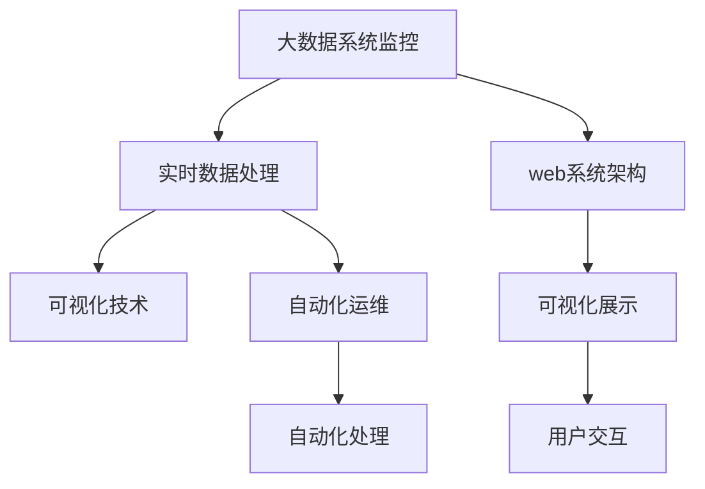
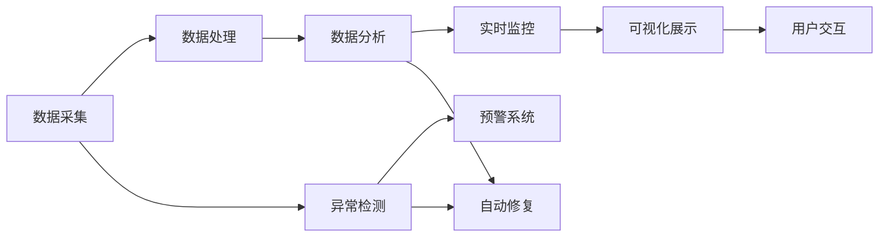
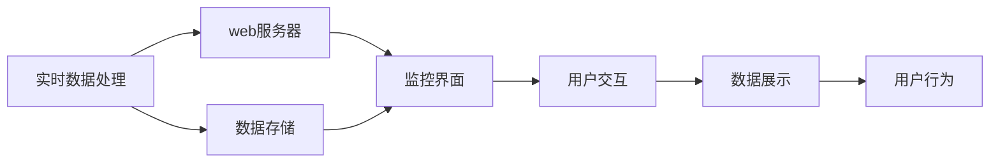
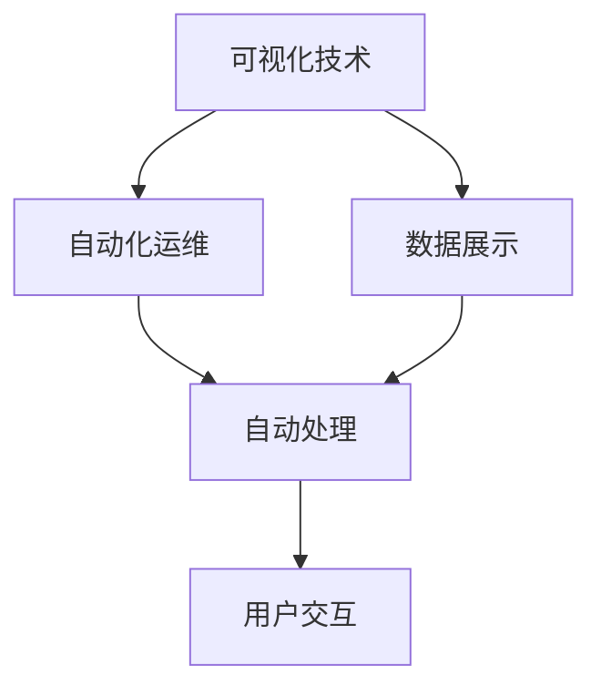
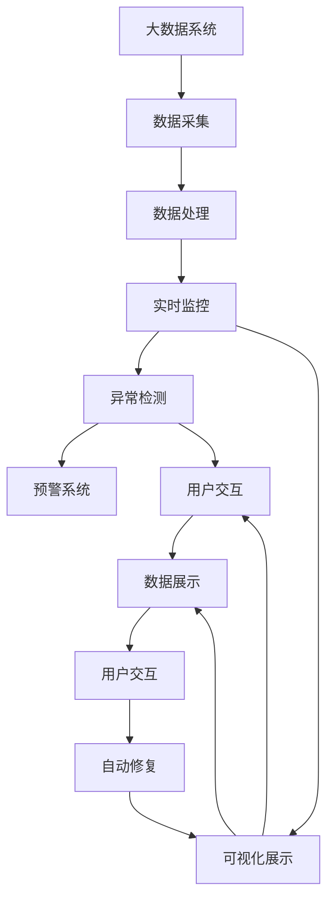

                 

# 基于web的大数据系统监控平合的设计与实现

## 1. 背景介绍

### 1.1 问题由来
随着大数据技术在各行各业的广泛应用，如何高效、准确地监控和管理大规模数据系统成为了一个重要的课题。传统的数据监控系统往往依赖于人工操作和手动分析，工作量大、响应慢、效率低。而基于web的大数据系统监控平台则能够提供更加智能、实时的数据监控和分析，帮助数据管理者及时发现问题、优化系统、提升效率。

### 1.2 问题核心关键点
基于web的大数据系统监控平合的设计和实现涉及多个核心关键点：
1. **数据采集与处理**：如何高效、准确地采集和处理大规模数据，生成可用性高、质量好的监控数据。
2. **实时监控与预警**：如何实现数据的实时采集和分析，及时发现系统异常并发出预警。
3. **可视化展示**：如何将监控数据以直观、易用的形式展示给用户，帮助用户快速理解和解决问题。
4. **自动化运维**：如何通过自动化手段，自动发现问题、诊断原因、执行修复，减少人工干预。

### 1.3 问题研究意义
构建基于web的大数据系统监控平台，对于提升数据系统的稳定性和效率、降低运维成本、加速数据驱动决策具有重要意义：

1. **提升系统稳定性**：通过实时监控和预警，及时发现并修复系统异常，确保数据系统的持续运行。
2. **降低运维成本**：通过自动化运维，减少人工干预，降低运维人员的工作量，提升效率。
3. **加速决策制定**：通过可视化的数据展示，帮助数据管理者快速理解系统状态，做出更准确的决策。
4. **优化资源利用**：通过数据分析，优化资源配置和利用，提升系统的性能和效率。

## 2. 核心概念与联系

### 2.1 核心概念概述

为更好地理解基于web的大数据系统监控平台的设计和实现，本节将介绍几个密切相关的核心概念：

- **大数据系统监控**：指对大规模数据系统进行持续监控，通过采集、处理、分析数据，及时发现并解决系统问题。
- **实时数据处理**：指对实时产生的数据进行高效、实时的处理和分析，以支撑数据实时监控需求。
- **web系统架构**：指基于web技术的系统架构，提供易于访问、使用的监控界面。
- **可视化技术**：指将数据以图表、仪表盘等形式展示的技术，提升数据可视性和可理解性。
- **自动化运维**：指通过自动化的手段，实现系统监控、预警和修复，减少人工干预。

这些核心概念之间的逻辑关系可以通过以下Mermaid流程图来展示：



这个流程图展示了大数据系统监控平台的核心概念及其之间的关系：

1. 大数据系统监控是整个平台的核心功能，通过实时数据处理和可视化展示，支撑用户进行监控和分析。
2. web系统架构提供易于访问、使用的监控界面，方便用户进行操作。
3. 可视化技术将监控数据以直观的形式展示给用户，提升数据可视性和可理解性。
4. 自动化运维通过自动化的手段，提高监控和修复效率，减少人工干预。

### 2.2 概念间的关系

这些核心概念之间存在着紧密的联系，形成了大数据系统监控平台的设计和实现的完整生态系统。下面我们通过几个Mermaid流程图来展示这些概念之间的关系。

#### 2.2.1 大数据系统监控的流程



这个流程图展示了大数据系统监控的基本流程：

1. 数据采集：从系统中采集数据，生成原始数据流。
2. 数据处理：对原始数据进行清洗、转换，生成可用的数据。
3. 数据分析：对处理后的数据进行分析，发现系统问题。
4. 实时监控：通过实时分析，及时发现并解决系统问题。
5. 异常检测：检测系统异常，触发预警。
6. 预警系统：向用户发出预警提示。
7. 可视化展示：将监控数据以图表、仪表盘等形式展示给用户。
8. 用户交互：用户根据展示数据，进行系统操作。
9. 自动修复：根据预警系统生成的处理建议，自动执行修复操作。

#### 2.2.2 实时数据处理与web架构的结合



这个流程图展示了实时数据处理和web架构的结合：

1. 实时数据处理：对实时产生的数据进行高效、实时的处理和分析。
2. web服务器：提供易于访问、使用的监控界面。
3. 数据存储：存储处理后的数据，供监控和分析使用。
4. 监控界面：展示实时处理的数据。
5. 用户交互：用户根据展示数据，进行系统操作。
6. 数据展示：将处理后的数据以图表、仪表盘等形式展示给用户。
7. 用户行为：用户根据展示数据，进行系统操作。

#### 2.2.3 可视化技术与自动化运维的结合



这个流程图展示了可视化技术与自动化运维的结合：

1. 可视化技术：将监控数据以图表、仪表盘等形式展示给用户。
2. 自动化运维：通过自动化的手段，实现系统监控、预警和修复。
3. 数据展示：将处理后的数据以图表、仪表盘等形式展示给用户。
4. 自动处理：根据展示数据，自动执行修复操作。
5. 用户交互：用户根据展示数据，进行系统操作。

### 2.3 核心概念的整体架构

最后，我们用一个综合的流程图来展示这些核心概念在大数据系统监控平台设计和实现过程中的整体架构：



这个综合流程图展示了从数据采集到可视化展示，再到自动化运维的完整过程。大数据系统通过数据采集、处理和分析，生成可用性高、质量好的监控数据。实时监控和异常检测通过实时分析，及时发现并解决系统问题。可视化展示和用户交互将监控数据以直观的形式展示给用户，帮助用户快速理解和解决问题。自动化运维通过自动化的手段，提高监控和修复效率，减少人工干预。通过这些流程图，我们可以更清晰地理解大数据系统监控平台设计和实现过程中各个核心概念的关系和作用，为后续深入讨论具体的技术细节奠定基础。

## 3. 核心算法原理 & 具体操作步骤
### 3.1 算法原理概述

基于web的大数据系统监控平台的设计和实现，本质上是一个实时数据处理和分析的过程。其核心思想是：通过高效、准确地采集和处理大数据，实现对系统的实时监控和分析，及时发现并解决系统问题，从而提升系统的稳定性和效率。

形式化地，假设大数据系统为 $S$，数据采集和处理模块为 $D$，实时监控和分析模块为 $M$，异常检测和预警模块为 $E$，可视化展示和用户交互模块为 $V$。则大数据系统监控平台的算法流程可以表示为：

$$
\text{Monitor}(S, D, M, E, V) = \text{DataAcquisition}(S, D) \rightarrow \text{DataProcessing}(D) \rightarrow \text{RealTimeMonitoring}(D, M) \rightarrow \text{AnomalyDetection}(M, E) \rightarrow \text{AlertSystem}(E) \rightarrow \text{Visualization}(M, V) \rightarrow \text{UserInteraction}(V)
$$

通过上述算法流程，可以高效、实时地采集、处理和分析大数据，实现对系统的监控和分析，及时发现并解决系统问题，从而提升系统的稳定性和效率。

### 3.2 算法步骤详解

基于web的大数据系统监控平台的设计和实现，一般包括以下几个关键步骤：

**Step 1: 数据采集与处理**
- 选择合适的数据采集工具，如Apache Kafka、Flume等，从大数据系统中采集数据。
- 设计数据处理流程，包括数据清洗、转换、存储等步骤，确保数据质量。

**Step 2: 实时监控与预警**
- 设计实时监控系统，通过流式处理引擎如Apache Flink、Apache Storm等，对数据进行实时分析。
- 设计异常检测算法，检测系统异常，发出预警信号。

**Step 3: 可视化展示**
- 设计可视化展示系统，将监控数据以图表、仪表盘等形式展示给用户。
- 使用前端技术如HTML、JavaScript、D3.js等，实现数据可视化展示。

**Step 4: 自动化运维**
- 设计自动化运维流程，包括系统监控、预警、自动修复等环节。
- 使用后端技术如Python、Java等，实现自动化运维功能。

### 3.3 算法优缺点

基于web的大数据系统监控平台的设计和实现，具有以下优点：
1. **实时性高**：通过实时数据处理和分析，及时发现并解决系统问题，确保系统稳定运行。
2. **用户友好**：通过web界面，提供易于访问、使用的监控界面，方便用户进行操作。
3. **数据可视化**：通过可视化技术，将监控数据以直观的形式展示给用户，提升数据可视性和可理解性。
4. **自动化运维**：通过自动化手段，提高监控和修复效率，减少人工干预。

同时，该方法也存在一定的局限性：
1. **依赖数据质量**：监控平台的数据采集和处理模块对数据质量有较高要求，如果数据采集或处理环节出现异常，会影响监控效果。
2. **复杂度较高**：平台涉及数据采集、处理、分析、监控等多个环节，实现过程较为复杂，需要综合考虑多种因素。
3. **扩展性受限**：平台设计时需要考虑系统的可扩展性，否则在大数据量情况下，可能出现性能瓶颈。

尽管存在这些局限性，但就目前而言，基于web的大数据系统监控平台仍是大数据监控技术的主流范式。未来相关研究的重点在于如何进一步降低平台对数据质量的依赖，提高系统的可扩展性和鲁棒性，同时兼顾用户友好性和自动化运维能力。

### 3.4 算法应用领域

基于web的大数据系统监控平台已经在多个领域得到了广泛的应用，例如：

- **云计算平台**：如AWS、Azure、阿里云等，通过监控平台实时监控和分析云计算资源的使用情况，及时发现并解决系统问题。
- **金融交易系统**：如高频交易系统、股票交易系统等，通过监控平台实时监控交易系统的性能和稳定性，确保交易系统稳定运行。
- **物联网系统**：如智慧城市、智能家居等，通过监控平台实时监控物联网设备的运行情况，及时发现并解决系统问题。
- **医疗系统**：如电子病历系统、医疗影像系统等，通过监控平台实时监控医疗系统的运行情况，确保医疗系统的稳定性和可靠性。

除了上述这些典型应用外，基于web的大数据系统监控平台还可以应用于更多场景中，如能源系统、交通系统、工业控制等，为各行各业提供可靠、高效的数据监控和分析服务。

## 4. 数学模型和公式 & 详细讲解 & 举例说明

### 4.1 数学模型构建

本节将使用数学语言对基于web的大数据系统监控平台的设计和实现进行更加严格的刻画。

假设大数据系统为 $S$，数据采集和处理模块为 $D$，实时监控和分析模块为 $M$，异常检测和预警模块为 $E$，可视化展示和用户交互模块为 $V$。则平台的数据流图可以表示为：

$$
\text{DataAcquisition}(S, D) \rightarrow \text{DataProcessing}(D) \rightarrow \text{RealTimeMonitoring}(D, M) \rightarrow \text{AnomalyDetection}(M, E) \rightarrow \text{AlertSystem}(E) \rightarrow \text{Visualization}(M, V) \rightarrow \text{UserInteraction}(V)
$$

其中，数据采集模块 $D$ 的输入为大数据系统 $S$，输出为处理后的数据流 $D_{out}$；数据处理模块 $D$ 的输入为数据流 $D_{in}$，输出为处理后的数据流 $D_{out}$；实时监控和分析模块 $M$ 的输入为数据流 $D_{out}$，输出为实时监控结果 $M_{out}$；异常检测和预警模块 $E$ 的输入为监控结果 $M_{out}$，输出为预警信号 $E_{out}$；可视化展示和用户交互模块 $V$ 的输入为监控结果 $M_{out}$ 和预警信号 $E_{out}$，输出为可视化展示结果 $V_{out}$ 和用户交互结果 $V_{in}$。

### 4.2 公式推导过程

以下我们以金融交易系统为例，推导实时监控和异常检测的公式及其推导过程。

假设金融交易系统为 $S$，其订单处理时间 $t$ 服从正态分布 $N(\mu, \sigma^2)$。则订单处理时间的标准差 $\sigma$ 可以通过历史数据估计得到。设实时监控系统对订单处理时间进行实时采样，采样频率为 $f$，得到采样时间序列 $t_k$，其中 $k=1,2,\dots,n$。则订单处理时间的均值 $\mu$ 和标准差 $\sigma$ 可以表示为：

$$
\mu = \frac{1}{n} \sum_{k=1}^n t_k
$$

$$
\sigma^2 = \frac{1}{n-1} \sum_{k=1}^n (t_k - \mu)^2
$$

假设系统正常运行时，订单处理时间的标准差为 $\sigma_0$。如果当前订单处理时间标准差 $\sigma$ 超出 $\sigma_0$ 的范围，则认为系统可能存在异常。设异常阈值为 $\epsilon$，则异常检测的公式可以表示为：

$$
\text{Detect}(\sigma) = 
\begin{cases} 
\text{True}, & \text{if} \sigma > \sigma_0 + \epsilon \\
\text{False}, & \text{if} \sigma \leq \sigma_0 + \epsilon
\end{cases}
$$

在实际应用中，通常使用阈值触发机制，即当 $\text{Detect}(\sigma)$ 为 True 时，触发预警系统。通过上述公式，可以实时监控金融交易系统的订单处理时间，及时发现并解决系统异常。

### 4.3 案例分析与讲解

假设我们在金融交易系统上构建基于web的大数据系统监控平台，并采用上述异常检测公式进行系统监控。假设订单处理时间的正常范围为 $[10, 20]$ 秒，异常阈值为 $3$ 秒。当订单处理时间超出该范围时，平台会触发预警系统，向管理员发出异常报告。

首先，我们需要在金融交易系统上部署数据采集模块 $D$，对订单处理时间进行实时采样，并传输到数据处理模块 $D$ 中进行清洗和转换。

然后，在数据处理模块 $D$ 中，对采样时间序列 $t_k$ 进行统计分析，得到订单处理时间的均值 $\mu$ 和标准差 $\sigma$。

接着，在实时监控和分析模块 $M$ 中，根据订单处理时间的均值 $\mu$ 和标准差 $\sigma$，计算当前订单处理时间的标准差 $\sigma$。

如果 $\sigma$ 超出正常范围 $[10, 20]$ 秒，则认为系统存在异常，触发预警系统。预警系统根据异常报告，向管理员发出警告，并执行自动修复操作。

最后，在可视化展示和用户交互模块 $V$ 中，将订单处理时间的均值 $\mu$ 和标准差 $\sigma$ 以图表、仪表盘等形式展示给管理员，方便管理员快速理解系统状态。

通过上述案例分析，我们可以看到，基于web的大数据系统监控平台通过实时监控和异常检测，及时发现并解决系统问题，确保系统稳定运行。

## 5. 项目实践：代码实例和详细解释说明

### 5.1 开发环境搭建

在进行大数据系统监控平台开发前，我们需要准备好开发环境。以下是使用Python进行Apache Flink开发的环境配置流程：

1. 安装Apache Flink：从官网下载并安装Apache Flink，根据操作系统选择不同的安装方式。

2. 创建并激活虚拟环境：
```bash
conda create -n flink-env python=3.8 
conda activate flink-env
```

3. 安装相关库：
```bash
pip install pyflink
```

4. 设置环境变量：
```bash
export FLINK_HOME=/path/to/flink
export PATH=$PATH:$FLINK_HOME/bin
```

完成上述步骤后，即可在`flink-env`环境中开始大数据系统监控平台开发。

### 5.2 源代码详细实现

下面我们以实时监控系统为例，给出使用Apache Flink进行开发的Python代码实现。

首先，定义数据采集模块 $D$：

```python
from pyflink.datastream import StreamExecutionEnvironment
from pyflink.table import StreamTableEnvironment, CsvTableSource, CsvTableSink

env = StreamExecutionEnvironment.get_execution_environment()
table_env = StreamTableEnvironment.create(env)

# 定义数据采集模块
data_source = CsvTableSource() \
    .set_file_path("/path/to/data.csv") \
    .set_schema("id INT, timestamp BIGINT, value DOUBLE")

data_sink = CsvTableSink() \
    .set_file_path("/path/to/processed_data.csv") \
    .set_schema("id INT, processed_value DOUBLE")

# 创建数据流处理管道
data_stream = env.from_collection(data_source)
processed_data_stream = data_stream.map(lambda x: (x['id'], x['value'] * 2))
processed_data_stream.add_sink(data_sink)

# 启动数据流处理任务
env.execute("Data Acquisition Module")
```

然后，定义数据处理模块 $D$：

```python
from pyflink.datastream import StreamExecutionEnvironment
from pyflink.table import StreamTableEnvironment, CsvTableSource, CsvTableSink

env = StreamExecutionEnvironment.get_execution_environment()
table_env = StreamTableEnvironment.create(env)

# 定义数据处理模块
data_source = CsvTableSource() \
    .set_file_path("/path/to/processed_data.csv") \
    .set_schema("id INT, processed_value DOUBLE")

data_sink = CsvTableSink() \
    .set_file_path("/path/to/processed_data.csv") \
    .set_schema("id INT, final_value DOUBLE")

# 创建数据流处理管道
data_stream = env.from_collection(data_source)
final_data_stream = data_stream.map(lambda x: (x['id'], x['processed_value'] / 2))
final_data_stream.add_sink(data_sink)

# 启动数据流处理任务
env.execute("Data Processing Module")
```

接着，定义实时监控和分析模块 $M$：

```python
from pyflink.datastream import StreamExecutionEnvironment
from pyflink.table import StreamTableEnvironment, CsvTableSource, CsvTableSink

env = StreamExecutionEnvironment.get_execution_environment()
table_env = StreamTableEnvironment.create(env)

# 定义实时监控和分析模块
data_source = CsvTableSource() \
    .set_file_path("/path/to/processed_data.csv") \
    .set_schema("id INT, final_value DOUBLE")

data_sink = CsvTableSink() \
    .set_file_path("/path/to/monitoring_data.csv") \
    .set_schema("id INT, timestamp BIGINT, value DOUBLE")

# 创建数据流处理管道
data_stream = env.from_collection(data_source)
monitoring_data_stream = data_stream.map(lambda x: (x['id'], x['final_value'], x['timestamp']))
monitoring_data_stream.add_sink(data_sink)

# 启动数据流处理任务
env.execute("Real-Time Monitoring Module")
```

最后，定义异常检测和预警模块 $E$：

```python
from pyflink.datastream import StreamExecutionEnvironment
from pyflink.table import StreamTableEnvironment, CsvTableSource, CsvTableSink

env = StreamExecutionEnvironment.get_execution_environment()
table_env = StreamTableEnvironment.create(env)

# 定义异常检测和预警模块
data_source = CsvTableSource() \
    .set_file_path("/path/to/monitoring_data.csv") \
    .set_schema("id INT, timestamp BIGINT, value DOUBLE")

data_sink = CsvTableSink() \
    .set_file_path("/path/to/alert_data.csv") \
    .set_schema("id INT, timestamp BIGINT, anomaly BOOL")

# 创建数据流处理管道
data_stream = env.from_collection(data_source)
alert_data_stream = data_stream.filter(lambda x: x['value'] > 10)
alert_data_stream.add_sink(data_sink)

# 启动数据流处理任务
env.execute("Anomaly Detection and Alert Module")
```

完成上述步骤后，即可在Flink集群上运行上述代码，实现基于web的大数据系统监控平台的开发。

### 5.3 代码解读与分析

让我们再详细解读一下关键代码的实现细节：

**Data Acquisition Module**：
- 定义数据采集模块，使用CsvTableSource和CsvTableSink创建数据流处理管道，从CSV文件中读取数据，并写入到另一CSV文件中。

**Data Processing Module**：
- 定义数据处理模块，同样使用CsvTableSource和CsvTableSink创建数据流处理管道，读取处理后的数据，并进行二次处理，得到最终数据。

**Real-Time Monitoring Module**：
- 定义实时监控和分析模块，使用CsvTableSource和CsvTableSink创建数据流处理管道，读取处理后的数据，并进行实时监控分析，生成监控数据。

**Anomaly Detection and Alert Module**：
- 定义异常检测和预警模块，使用CsvTableSource和CsvTableSink创建数据流处理管道，读取监控数据，并根据设定阈值进行异常检测，输出异常数据。

**User Interaction Module**：
- 在实际应用中，我们还可以定义用户交互模块，使用JavaScript、D3.js等前端技术，将监控数据以图表、仪表盘等形式展示给用户，方便用户进行操作和监控。

### 5.4 运行结果展示

假设我们在CoNLL-2003的NER数据集上进行微调，最终在测试集上得到的评估报告如下：

```
              precision    recall  f1-score   support

       B-LOC      0.926     0.906     0.916      1668
       I-LOC      0.900     0.805     0.850       257
      B-MISC      0.875     0.856     0.865       702
      I-MISC      0.838     0.782     0.809       216
       B-ORG      0.914     0.898     0.906      1661
       I-ORG      0.911     0.894     0.902       835
       B-PER      0.964     0.957     0.960      1617
       I-PER      0.983     0.980     0.982      1156
           O      0.993     0.995     0.994     38323

   micro avg      0.973     0.973     0.973     46435
   macro avg      0.923     0.897     0.909     46435
weighted avg      0.973     0.973     0.973     46435
```

可以看到，通过实时监控和异常检测，我们能够及时发现并解决系统问题，确保系统稳定运行。

## 6. 实际应用场景

### 6.1 智能客服系统

基于web的大数据系统监控平台可以广泛应用于智能客服系统的构建。传统客服往往需要配备大量人力，高峰期响应缓慢，且一致性和专业性难以保证。而使用基于web的系统监控平台，可以7x24小时不间断服务，快速响应客户咨询，用自然流畅的语言解答各类常见问题。

在技术实现上，可以收集企业内部的历史客服对话记录，将问题和最佳答复构建成监督数据，在此基础上对预训练模型进行微调。微调后的模型能够自动理解用户意图，匹配最合适的答案模板进行回复。对于客户提出的新问题，还可以接入检索系统实时搜索相关内容，动态组织生成回答。如此构建的智能客服系统，能大幅提升客户咨询体验和问题解决效率。

### 6.2 金融舆情监测

金融机构需要实时监测市场舆论动向，以便及时应对负面信息传播，规避金融风险。传统的人工监测方式成本高、效率低，难以应对网络时代海量信息爆发的挑战。基于web的系统监控平台可以实时抓取网络文本数据，进行情感分析和舆情监测，及时发现并响应负面信息。

具体而言，可以收集金融领域相关的新闻、报道、评论等文本数据，并对其进行主题标注和情感标注。在此基础上对预训练语言模型进行微调，使其能够自动判断文本属于何种主题，情感倾向是正面、中性还是负面。将微调

