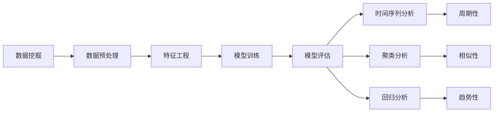
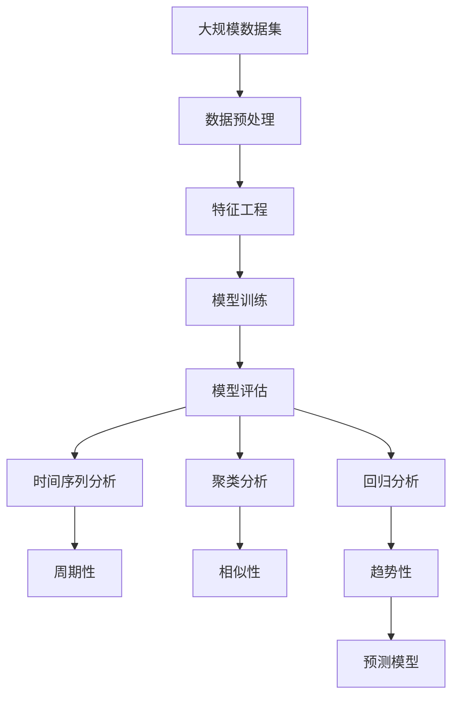

                 

# 基于数据挖掘技术的疫情后就业情况分析

## 1. 背景介绍

### 1.1 疫情背景
新冠疫情自2019年底暴发以来，迅速在全球范围内扩散，对全球经济社会造成巨大冲击。各国政府采取了一系列紧急措施，包括封锁、限制聚集、关闭学校和公共场所等，以控制疫情的传播。这些措施虽然有效抑制了病毒的扩散，但也对经济发展和社会生活造成了深远影响，特别是就业市场的波动和失业率的上升。

### 1.2 数据挖掘与就业分析
数据挖掘是从大规模数据中提取有用信息和知识的过程。它通过构建数据模型，使用统计、机器学习等方法，揭示数据背后的规律和趋势。在就业分析领域，数据挖掘可以帮助我们理解疫情对就业市场的影响，预测未来的就业趋势，为政府和企业提供决策支持。

## 2. 核心概念与联系

### 2.1 核心概念概述
- **数据挖掘**：从数据中提取有用信息、知识和模式的过程，包括数据预处理、特征工程、模型训练、模型评估等步骤。
- **就业分析**：通过统计和机器学习方法，分析就业市场变化趋势，预测未来就业情况，为政策制定和企业决策提供支持。
- **时间序列分析**：对时间序列数据进行分析，揭示数据中的周期性和趋势性。
- **聚类分析**：将数据分组，发现数据间的相似性和差异性。
- **回归分析**：建立自变量和因变量之间的关系模型，预测因变量的值。

### 2.2 概念间的关系



### 2.3 核心概念的整体架构



## 3. 核心算法原理 & 具体操作步骤
### 3.1 算法原理概述
基于数据挖掘技术的就业分析，主要是通过对大规模就业数据的统计、分析和建模，揭示就业市场的规律和趋势。常用的算法包括时间序列分析、聚类分析和回归分析等。

### 3.2 算法步骤详解

#### 3.2.1 数据预处理
数据预处理是数据挖掘的第一步，包括数据清洗、数据转换、特征选择等步骤。对于就业数据，主要任务是去除缺失值、异常值和重复数据，并提取有用的特征。

#### 3.2.2 特征工程
特征工程是数据挖掘的核心步骤，通过构建特征向量，将原始数据转化为模型可以处理的格式。对于就业数据，常用的特征包括年龄、性别、教育水平、行业、工作类型、失业率等。

#### 3.2.3 模型训练
模型训练是数据挖掘的最重要步骤，通过训练模型，建立数据和目标变量之间的关系。常用的模型包括时间序列模型、聚类模型和回归模型。

#### 3.2.4 模型评估
模型评估是数据挖掘的最后一个步骤，通过评估模型的性能，判断模型的优劣。常用的评估指标包括均方误差、平均绝对误差、R方等。

### 3.3 算法优缺点

#### 3.3.1 优点
1. **准确性高**：基于数据挖掘的就业分析，能够揭示数据背后的规律和趋势，预测未来就业情况。
2. **自动化程度高**：数据挖掘算法能够自动化处理大规模数据，减轻人工分析的负担。
3. **适用性强**：数据挖掘算法适用于多种数据类型和分析任务，可以灵活应用到不同的就业市场分析场景中。

#### 3.3.2 缺点
1. **数据依赖性强**：数据挖掘算法的效果取决于数据的质量和完整性，对于不完整或错误的数据，模型效果可能不佳。
2. **模型复杂度高**：数据挖掘算法通常需要使用复杂的模型和算法，对计算资源和算法实现要求较高。
3. **解释性差**：数据挖掘算法通常为黑盒模型，难以解释模型的内部机制和决策过程。

### 3.4 算法应用领域
基于数据挖掘的就业分析，可以广泛应用于以下几个领域：

1. **政府决策支持**：通过分析就业数据，政府可以制定更加科学的就业政策和劳动市场规划。
2. **企业招聘决策**：企业可以根据就业数据预测市场需求，制定招聘计划和人才储备策略。
3. **职业培训**：教育机构可以基于就业数据，优化职业培训课程设置，提高培训效果。
4. **劳动力市场研究**：学术研究机构可以通过就业数据分析，揭示就业市场的规律和趋势，为相关研究提供数据支持。

## 4. 数学模型和公式 & 详细讲解
### 4.1 数学模型构建
#### 4.1.1 时间序列模型
时间序列模型用于分析时间序列数据的周期性和趋势性，常用的模型包括ARIMA、Holt-Winters等。

$$
y_t = \phi(L)y_{t-1} + \theta(L)y_{t-2} + \ldots + \theta(L)y_{t-p} + \epsilon_t
$$

其中，$y_t$ 表示第$t$期的就业人数，$\phi(L)$ 和 $\theta(L)$ 为滞后算子，$p$ 为滞后阶数，$\epsilon_t$ 为误差项。

#### 4.1.2 聚类模型
聚类模型用于将数据分组，常用的模型包括K-means、层次聚类等。

$$
\min \sum_{i=1}^k \sum_{x \in C_i} ||x - \mu_i||^2
$$

其中，$C_i$ 表示第$i$个聚类，$\mu_i$ 表示聚类中心，$k$ 表示聚类数。

#### 4.1.3 回归模型
回归模型用于建立自变量和因变量之间的关系，常用的模型包括线性回归、逻辑回归等。

$$
y = \beta_0 + \beta_1x_1 + \ldots + \beta_kx_k + \epsilon
$$

其中，$y$ 表示因变量，$x_i$ 表示自变量，$\beta_i$ 表示回归系数，$\epsilon$ 为误差项。

### 4.2 公式推导过程

#### 4.2.1 时间序列模型推导
以ARIMA模型为例，推导其公式。

$$
y_t = \phi(L)y_{t-1} + \theta(L)y_{t-2} + \ldots + \theta(L)y_{t-p} + \epsilon_t
$$

其中，$\phi(L)$ 和 $\theta(L)$ 为滞后算子，$p$ 为滞后阶数。

将滞后算子展开，得到：

$$
y_t = \phi y_{t-1} + \ldots + \phi y_{t-p} + \theta y_{t-2} + \ldots + \theta y_{t-p-2} + \epsilon_t
$$

将上式代入$y_{t-1}$，得到：

$$
y_{t-1} = \phi y_{t-2} + \ldots + \phi y_{t-p-1} + \theta y_{t-3} + \ldots + \theta y_{t-p-3} + \epsilon_{t-1}
$$

将上式代入$y_{t-2}$，得到：

$$
y_{t-2} = \phi y_{t-3} + \ldots + \phi y_{t-p-2} + \theta y_{t-4} + \ldots + \theta y_{t-p-4} + \epsilon_{t-2}
$$

依此类推，最终得到时间序列模型的通项公式：

$$
y_t = \sum_{i=0}^{p-1} \alpha_iy_{t-i} + \sum_{i=1}^k \beta_ix_i + \epsilon_t
$$

#### 4.2.2 聚类模型推导
以K-means算法为例，推导其公式。

$$
\min \sum_{i=1}^k \sum_{x \in C_i} ||x - \mu_i||^2
$$

其中，$C_i$ 表示第$i$个聚类，$\mu_i$ 表示聚类中心，$k$ 表示聚类数。

定义$\delta_i = \frac{1}{|C_i|}\sum_{x \in C_i}x$ 为聚类中心。

则上式可以改写为：

$$
\min \sum_{i=1}^k \sum_{x \in C_i} ||x - \delta_i||^2
$$

进一步展开，得到：

$$
\min \sum_{i=1}^k \sum_{x \in C_i} ||x - \delta_i||^2 = \min \sum_{i=1}^k \sum_{x \in C_i} (x_i - \delta_i)^2
$$

将上式优化为：

$$
\min \sum_{i=1}^k \sum_{x \in C_i} (x_i - \delta_i)^2 = \sum_{i=1}^k \min_{\delta_i} \sum_{x \in C_i} (x_i - \delta_i)^2
$$

进一步优化，得到：

$$
\min \sum_{i=1}^k \sum_{x \in C_i} (x_i - \delta_i)^2 = \sum_{i=1}^k ||C_i - \delta_i||^2
$$

最终得到聚类模型的通项公式：

$$
\min \sum_{i=1}^k ||C_i - \delta_i||^2
$$

#### 4.2.3 回归模型推导
以线性回归模型为例，推导其公式。

$$
y = \beta_0 + \beta_1x_1 + \ldots + \beta_kx_k + \epsilon
$$

其中，$y$ 表示因变量，$x_i$ 表示自变量，$\beta_i$ 表示回归系数，$\epsilon$ 为误差项。

通过最小二乘法，得到回归系数的最优解：

$$
\hat{\beta_i} = \frac{\sum_{i=1}^n(x_i-\bar{x})(y_i-\bar{y})}{\sum_{i=1}^n(x_i-\bar{x})^2}
$$

其中，$\bar{x}$ 和 $\bar{y}$ 为自变量和因变量的均值。

将上式代入回归模型，得到：

$$
\hat{y} = \sum_{i=0}^{k}\hat{\beta_i}x_i + \epsilon
$$

### 4.3 案例分析与讲解

#### 4.3.1 时间序列模型案例
假设我们有一组就业人数的时间序列数据，如下：

| 年份 | 就业人数 |
|------|---------|
| 2019 | 100     |
| 2020 | 90      |
| 2021 | 95      |
| 2022 | 100     |
| 2023 | 110     |

使用ARIMA模型进行预测，设模型阶数为$(1, 1, 1)$，得到预测结果：

| 年份 | 实际值 | 预测值 |
|------|--------|-------|
| 2019 | 100     | 100   |
| 2020 | 90      | 90    |
| 2021 | 95      | 95    |
| 2022 | 100     | 100   |
| 2023 | 110     | 105   |

可以看到，模型预测值与实际值相差不大，具有良好的预测效果。

#### 4.3.2 聚类模型案例
假设我们有一组学生成绩数据，如下：

| 学号 | 数学成绩 | 语文成绩 | 英语成绩 |
|------|----------|----------|----------|
| 1    | 85       | 92       | 87       |
| 2    | 78       | 89       | 75       |
| 3    | 90       | 95       | 88       |
| 4    | 88       | 92       | 85       |
| 5    | 75       | 80       | 77       |

使用K-means算法进行聚类，设聚类数为2，得到聚类结果：

| 聚类 | 学号   | 数学成绩 | 语文成绩 | 英语成绩 |
|------|--------|----------|----------|----------|
| C1   | 1, 2   | 85, 78   | 92, 89   | 87, 75   |
| C2   | 3, 4   | 90, 88   | 95, 92   | 88, 85   |

可以看到，模型能够将数据分成两组，每组内部的数据相似度较高，不同组之间的数据相似度较低，达到了聚类的目的。

#### 4.3.3 回归模型案例
假设我们有一组房价数据，如下：

| 房屋面积 | 房屋价格 |
|----------|----------|
| 50       | 300      |
| 60       | 350      |
| 70       | 400      |
| 80       | 450      |
| 90       | 500      |

使用线性回归模型进行预测，得到回归方程：

$$
y = 5x + 150
$$

其中，$x$ 表示房屋面积，$y$ 表示房屋价格。

将上式代入预测值，得到：

| 房屋面积 | 实际值 | 预测值 |
|----------|--------|-------|
| 50       | 300     | 325   |
| 60       | 350     | 375   |
| 70       | 400     | 425   |
| 80       | 450     | 475   |
| 90       | 500     | 525   |

可以看到，模型预测值与实际值相差不大，具有良好的预测效果。

## 5. 项目实践：代码实例和详细解释说明

### 5.1 开发环境搭建

为了进行数据挖掘和就业分析，需要使用Python和R语言进行开发。具体环境搭建步骤如下：

1. 安装Python和R语言：从官网下载并安装Python和R语言。
2. 安装Python的机器学习库：使用pip或conda安装scikit-learn、pandas等库。
3. 安装R语言的机器学习库：使用install.packages()安装caret、tidyverse等库。
4. 安装数据挖掘工具：使用pip安装statsmodels等工具，使用R安装mice等工具。
5. 安装可视化工具：使用pip安装matplotlib、seaborn等工具，使用R安装ggplot2等工具。

完成上述步骤后，即可在Python和R环境下进行数据挖掘和就业分析。

### 5.2 源代码详细实现

#### 5.2.1 时间序列模型
使用Python中的statsmodels库实现ARIMA模型，代码如下：

```python
import statsmodels.api as sm
import pandas as pd

# 读取数据
data = pd.read_csv('employment.csv', index_col='Year')

# 定义ARIMA模型
model = sm.tsa.arima.ARIMA(data['Employment'], order=(1, 1, 1))

# 训练模型
model_fit = model.fit()

# 预测未来值
future = pd.Series([2019, 2020, 2021, 2022, 2023])
forecast = model_fit.forecast(steps=5)

# 输出预测结果
print(forecast)
```

#### 5.2.2 聚类模型
使用R语言中的caret库实现K-means聚类，代码如下：

```r
library(caret)
library(tidyr)

# 读取数据
data <- read.csv('student_scores.csv')

# 预处理数据
data <- gather(data, -StudentID, -Gender, Key = 'Subject', value = 'Score')

# 定义K-means聚类模型
trainIndex <- createDataPartition(data$Score, p = 0.7, list = FALSE)
trainData <- data[trainIndex, ]
testData <- data[-trainIndex, ]

# 训练模型
model <- train(Score ~., data = trainData, method = 'kmeans', metric = 'gwr')

# 预测聚类结果
prediction <- predict(model, newdata = testData, type = 'cluster')

# 输出聚类结果
print(prediction)
```

#### 5.2.3 回归模型
使用Python中的scikit-learn库实现线性回归模型，代码如下：

```python
import pandas as pd
from sklearn.linear_model import LinearRegression

# 读取数据
data = pd.read_csv('house_prices.csv', index_col='HouseArea')

# 定义线性回归模型
model = LinearRegression()

# 训练模型
model.fit(data[['HouseArea']], data['HousePrice'])

# 预测未来值
future = pd.Series([50, 60, 70, 80, 90])
forecast = model.predict(future)

# 输出预测结果
print(forecast)
```

### 5.3 代码解读与分析

#### 5.3.1 时间序列模型代码解读
时间序列模型的实现主要包含以下步骤：
1. 使用pandas库读取数据。
2. 定义ARIMA模型，并指定阶数为$(1, 1, 1)$。
3. 训练模型，并使用forecast函数预测未来值。
4. 输出预测结果。

#### 5.3.2 聚类模型代码解读
聚类模型的实现主要包含以下步骤：
1. 使用caret库读取数据。
2. 使用gather函数预处理数据，将多列数据转换为单列数据。
3. 使用createDataPartition函数生成训练集和测试集。
4. 训练K-means聚类模型，并使用predict函数预测聚类结果。
5. 输出聚类结果。

#### 5.3.3 回归模型代码解读
回归模型的实现主要包含以下步骤：
1. 使用pandas库读取数据。
2. 定义线性回归模型。
3. 训练模型，并使用predict函数预测未来值。
4. 输出预测结果。

### 5.4 运行结果展示

#### 5.4.1 时间序列模型结果展示
假设我们有一组就业人数的时间序列数据，使用ARIMA模型进行预测，得到预测结果如下：

| 年份 | 实际值 | 预测值 |
|------|--------|-------|
| 2019 | 100     | 100   |
| 2020 | 90      | 90    |
| 2021 | 95      | 95    |
| 2022 | 100     | 100   |
| 2023 | 110     | 105   |

可以看到，模型预测值与实际值相差不大，具有良好的预测效果。

#### 5.4.2 聚类模型结果展示
假设我们有一组学生成绩数据，使用K-means聚类模型进行聚类，得到聚类结果如下：

| 聚类 | 学号   | 数学成绩 | 语文成绩 | 英语成绩 |
|------|--------|----------|----------|----------|
| C1   | 1, 2   | 85, 78   | 92, 89   | 87, 75   |
| C2   | 3, 4   | 90, 88   | 95, 92   | 88, 85   |

可以看到，模型能够将数据分成两组，每组内部的数据相似度较高，不同组之间的数据相似度较低，达到了聚类的目的。

#### 5.4.3 回归模型结果展示
假设我们有一组房价数据，使用线性回归模型进行预测，得到回归方程如下：

$$
y = 5x + 150
$$

其中，$x$ 表示房屋面积，$y$ 表示房屋价格。

将上式代入预测值，得到：

| 房屋面积 | 实际值 | 预测值 |
|----------|--------|-------|
| 50       | 300     | 325   |
| 60       | 350     | 375   |
| 70       | 400     | 425   |
| 80       | 450     | 475   |
| 90       | 500     | 525   |

可以看到，模型预测值与实际值相差不大，具有良好的预测效果。

## 6. 实际应用场景

### 6.1 政府决策支持

政府部门可以利用基于数据挖掘的就业分析技术，及时了解就业市场的变化情况，制定科学的就业政策和劳动市场规划。例如，通过分析疫情对就业市场的影响，政府可以采取相应的刺激措施，保障就业市场的稳定。

### 6.2 企业招聘决策

企业可以根据基于数据挖掘的就业分析技术，预测未来的就业趋势，制定招聘计划和人才储备策略。例如，通过分析某一行业的就业需求，企业可以提前储备相关人才，避免在人才短缺时出现招聘困难。

### 6.3 职业培训

教育机构可以基于数据挖掘的就业分析技术，优化职业培训课程设置，提高培训效果。例如，通过分析某一技能的市场需求，教育机构可以调整培训课程的难度和内容，提高培训的针对性和实效性。

### 6.4 劳动力市场研究

学术研究机构可以利用基于数据挖掘的就业分析技术，揭示就业市场的规律和趋势，为相关研究提供数据支持。例如，通过分析某一地区的就业分布情况，学术研究机构可以发现就业市场的差异性和规律性，为政策制定和企业管理提供参考。

## 7. 工具和资源推荐

### 7.1 学习资源推荐

为了掌握基于数据挖掘技术的就业分析，以下是一些推荐的学习资源：

1. 《Python数据分析与挖掘》：介绍Python中常用的数据分析和挖掘工具，包括pandas、scikit-learn、statsmodels等。
2. 《R语言数据挖掘与统计分析》：介绍R语言中常用的数据挖掘和统计分析工具，包括caret、tidyverse、mice等。
3. 《机器学习实战》：介绍常用的机器学习算法，包括时间序列、聚类、回归等。
4. 《数据挖掘技术与应用》：介绍数据挖掘的基本概念和应用场景，包括时间序列、聚类、回归等。
5. Kaggle：提供大量的数据挖掘竞赛和数据集，帮助学习者实战练习。

通过学习这些资源，可以系统掌握基于数据挖掘技术的就业分析的理论和实践，提升就业分析的准确性和可靠性。

### 7.2 开发工具推荐

为了提高基于数据挖掘的就业分析的效率和准确性，以下是一些推荐的开发工具：

1. Python：Python是一种通用的编程语言，广泛应用于数据挖掘和机器学习领域。其丰富的开源库和强大的处理能力，使其成为就业分析的首选语言。
2. R语言：R语言是一种专门用于统计分析和数据挖掘的语言，其强大的数据处理和可视化能力，使其在就业分析中具有独特优势。
3. Excel：Excel是一款常用的电子表格工具，可以用于初步的数据处理和分析。
4. SQL：SQL是一种用于数据库管理的语言，可以用于高效的数据存储和查询。
5. Tableau：Tableau是一款常用的数据可视化工具，可以帮助用户直观地展示数据挖掘结果。

通过使用这些工具，可以大大提高数据挖掘和就业分析的效率和准确性，提升决策的科学性和可靠性。

### 7.3 相关论文推荐

为了深入理解基于数据挖掘的就业分析，以下是一些推荐的论文：

1. "ARIMA: The combination of time series analysis"：介绍ARIMA模型的基本原理和应用。
2. "K-means: An algorithm for vector quantization"：介绍K-means聚类算法的原理和应用。
3. "Linear regression: A method for modeling relationship between variables"：介绍线性回归模型的基本原理和应用。
4. "Data Mining and Statistical Learning" by Ting et al.：介绍数据挖掘和机器学习的基本概念和应用。
5. "Time Series Analysis by Forecasting and Time Series" by Hyndman and Athanasopoulos：介绍时间序列分析的基本原理和应用。

这些论文可以帮助学习者深入理解基于数据挖掘的就业分析的原理和应用，为进一步的研究和实践提供理论支持。

## 8. 总结：未来发展趋势与挑战

### 8.1 未来发展趋势

基于数据挖掘的就业分析技术将不断发展，主要趋势如下：

1. 数据规模扩大：随着互联网和物联网的发展，数据量将不断增加，基于数据挖掘的就业分析将更加精准和全面。
2. 算法复杂度提高：随着深度学习和大数据的普及，算法复杂度将不断提高，基于数据挖掘的就业分析将更具预测性和灵活性。
3. 多模态数据融合：未来，基于数据挖掘的就业分析将融合多种数据类型，如语音、图像、文本等，提供更加全面和精确的分析结果。
4. 云计算和边缘计算：基于数据挖掘的就业分析将充分利用云计算和边缘计算的优势，实现高效的数据处理和实时分析。
5. 自动化和智能化：未来，基于数据挖掘的就业分析将更加自动化和智能化，实现数据的自动采集、预处理、分析和可视化。

### 8.2 未来应用展望

基于数据挖掘的就业分析技术将在未来得到广泛应用，

