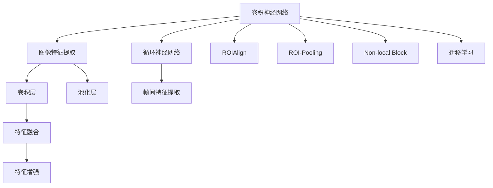
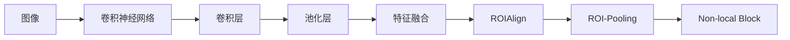
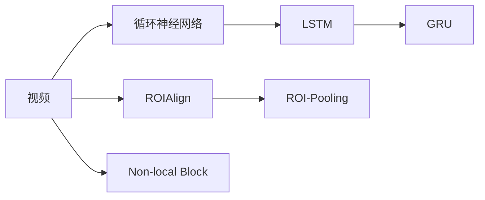
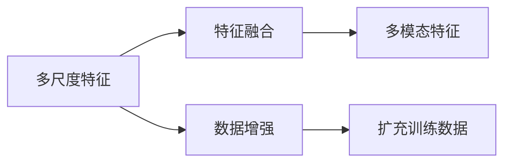

                 

# 基于深度学习提取图像视频特征

> 关键词：图像特征提取, 视频特征提取, 深度学习, 卷积神经网络, 循环神经网络, 卷积层, 池化层, LSTM, GRU, ROIAlign, ROI-Pooling, Non-local Block, 特征融合, 数据增强, 迁移学习

## 1. 背景介绍

随着深度学习技术的迅速发展，图像和视频特征提取已经成为了计算机视觉和多媒体处理领域的一个热门研究话题。传统的特征提取方法，如SIFT、HOG等，往往需要手工设计特征，难以处理复杂场景下的细节信息。而基于深度学习的特征提取方法，则能够自动学习到更加高效、鲁棒的特征，广泛应用于目标检测、图像分类、视频分析等多个领域。

本文将重点介绍基于深度学习的图像和视频特征提取方法，涵盖卷积神经网络(CNN)、循环神经网络(RNN)等主流架构，以及近年来涌现的ROIAlign、ROI-Pooling、Non-local Block等技术，旨在帮助读者系统理解这些深度学习模型在特征提取中的原理和应用，为实际项目开发提供参考。

## 2. 核心概念与联系

### 2.1 核心概念概述

在深度学习中，图像和视频特征提取的核心概念主要包括：

- 卷积神经网络(CNN)：一种专门用于图像处理的深度学习架构，通过卷积操作自动提取图像的局部特征。
- 循环神经网络(RNN)：一种能够处理序列数据的深度学习架构，常用于视频分析中的帧间特征提取。
- ROIAlign、ROI-Pooling：用于对图像中的特定区域进行池化操作，提取关键区域的特征。
- Non-local Block：一种能够捕捉图像中长距离依赖的模块，提高特征提取的鲁棒性。
- 特征融合：将不同尺度和模态的特征进行整合，提升整体特征的表现力。
- 数据增强：通过图像旋转、裁剪、缩放等手段，扩充训练数据集，提高模型泛化能力。
- 迁移学习：通过在大规模数据上预训练的模型，在特定领域或小规模数据上进行微调，提升模型性能。

这些核心概念之间存在紧密联系，共同构成了基于深度学习的图像和视频特征提取的完整框架。下面通过Mermaid流程图展示这些概念之间的联系：



这个流程图展示了卷积神经网络、循环神经网络、ROIAlign、ROI-Pooling、Non-local Block等技术在图像和视频特征提取中的核心作用，以及特征融合、数据增强和迁移学习等关键技术对提升特征提取性能的重要贡献。

### 2.2 概念间的关系

这些核心概念之间存在着复杂的相互作用和依赖关系，共同构成了一个完整的深度学习特征提取体系。下面我们通过几个Mermaid流程图来展示这些概念之间的关系：

#### 2.2.1 图像特征提取的流程



这个流程图展示了卷积神经网络在图像特征提取中的作用流程，从卷积层和池化层的基本操作，到ROIAlign、ROI-Pooling和Non-local Block等高级操作，逐步提高特征提取的复杂度和表现力。

#### 2.2.2 视频特征提取的流程



这个流程图展示了循环神经网络在视频特征提取中的作用流程，从LSTM和GRU等序列建模方法，到ROIAlign、ROI-Pooling和Non-local Block等空间建模方法，逐步提取视频中的关键帧和时空特征。

#### 2.2.3 特征融合与数据增强



这个流程图展示了特征融合与数据增强在图像和视频特征提取中的作用，通过将不同尺度和模态的特征进行整合，以及通过数据增强手段扩充训练集，提升特征提取的泛化能力和稳定性。

## 3. 核心算法原理 & 具体操作步骤

### 3.1 算法原理概述

基于深度学习的图像和视频特征提取算法，主要依赖于卷积神经网络(CNN)和循环神经网络(RNN)两种架构。CNN通过卷积操作自动提取图像的局部特征，而RNN通过时间序列建模捕捉视频的时空依赖关系。

在CNN中，卷积层通过滑动卷积核在图像上提取局部特征，池化层用于降维和提取关键特征，如Max Pooling和Average Pooling等。在RNN中，LSTM和GRU等循环结构能够捕捉视频帧间的依赖关系，ROIAlign、ROI-Pooling和Non-local Block等模块能够提取关键区域的特征。

这些算法的核心原理是通过深度学习模型自动学习图像和视频中的复杂特征，以用于后续的任务，如目标检测、图像分类、视频分析等。

### 3.2 算法步骤详解

#### 3.2.1 CNN特征提取

1. 卷积层操作：通过滑动卷积核在图像上提取局部特征，如在VGG网络中使用的3x3卷积核。
2. 池化层操作：对卷积层的输出进行降维和提取关键特征，如Max Pooling和Average Pooling。
3. 特征融合：将不同尺度和模态的特征进行整合，提升整体特征的表现力，如使用FC层将卷积层和池化层的输出进行融合。

#### 3.2.2 RNN特征提取

1. 循环结构：通过LSTM或GRU等循环结构，捕捉视频帧间的依赖关系。
2. ROIAlign和ROI-Pooling：对视频帧中的特定区域进行池化操作，提取关键区域的特征。
3. Non-local Block：通过长距离依赖模块，捕捉图像中的长距离依赖，提升特征提取的鲁棒性。

#### 3.2.3 特征融合与数据增强

1. 特征融合：将不同尺度和模态的特征进行整合，如使用FC层将卷积层和池化层的输出进行融合。
2. 数据增强：通过图像旋转、裁剪、缩放等手段，扩充训练数据集，提高模型泛化能力。

#### 3.2.4 迁移学习

1. 预训练模型：在大规模数据上预训练的模型，如VGG、ResNet等。
2. 微调模型：在特定领域或小规模数据上进行微调，提升模型性能。

### 3.3 算法优缺点

基于深度学习的图像和视频特征提取算法具有以下优点：

1. 自动学习特征：通过深度学习模型自动学习图像和视频中的复杂特征，无需手工设计特征。
2. 鲁棒性：通过卷积、池化、LSTM等结构，能够提取更加鲁棒的特征，提升模型的泛化能力。
3. 可扩展性：通过特征融合和数据增强等手段，可以轻松扩展特征提取的复杂度和表现力。

同时，这些算法也存在一些缺点：

1. 计算复杂度高：深度学习模型往往具有大量的参数和复杂的计算图，训练和推理速度较慢。
2. 数据需求大：深度学习模型需要大量的标注数据进行训练，数据获取成本高。
3. 泛化能力有限：在特定领域或小规模数据上，模型性能可能不如传统的特征提取方法。

### 3.4 算法应用领域

基于深度学习的图像和视频特征提取算法，已经广泛应用于多个领域，包括但不限于：

- 目标检测：如YOLO、Faster R-CNN等，通过深度学习模型自动提取图像中的关键区域和特征。
- 图像分类：如ResNet、Inception等，通过卷积层和池化层提取图像中的特征，进行分类任务。
- 视频分析：如C3D、I3D等，通过卷积层和LSTM等结构提取视频中的时空特征，进行动作识别、视频分割等任务。
- 医疗影像分析：如U-Net、ResNet等，通过深度学习模型提取医学影像中的特征，进行疾病诊断和治疗方案规划。
- 自动驾驶：如端到端的视觉感知系统，通过深度学习模型提取道路、车辆等关键信息的特征，进行驾驶决策。

## 4. 数学模型和公式 & 详细讲解 & 举例说明

### 4.1 数学模型构建

在深度学习中，图像和视频特征提取的主要数学模型包括：

- 卷积神经网络(CNN)：通过卷积层和池化层提取局部特征。
- 循环神经网络(RNN)：通过LSTM或GRU等结构捕捉时间序列的依赖关系。
- ROIAlign和ROI-Pooling：对图像或视频中的特定区域进行池化操作。
- Non-local Block：通过长距离依赖模块，捕捉图像中的长距离依赖。

### 4.2 公式推导过程

#### 4.2.1 CNN的卷积层操作

卷积层通过滑动卷积核在图像上提取局部特征，公式如下：

$$
\mathcal{F}_{\theta}(x) = \sigma(\sum_{i=1}^{d_f} \sum_{j=1}^{d_k} W_{i,j} * x * F_{i,j} + b)
$$

其中，$\mathcal{F}_{\theta}(x)$表示卷积层的输出，$x$表示输入图像，$W_{i,j}$表示卷积核权重，$F_{i,j}$表示卷积核在空间上的扩展，$b$表示偏置项，$\sigma$表示激活函数。

#### 4.2.2 RNN的LSTM结构

LSTM通过三个门结构(输入门、遗忘门、输出门)来捕捉时间序列的依赖关系，公式如下：

$$
\begin{aligned}
i_t &= \sigma(W_i \cdot [h_{t-1}, x_t] + b_i) \\
f_t &= \sigma(W_f \cdot [h_{t-1}, x_t] + b_f) \\
o_t &= \sigma(W_o \cdot [h_{t-1}, x_t] + b_o) \\
g_t &= \tanh(W_g \cdot [h_{t-1}, x_t] + b_g) \\
h_t &= f_t \odot h_{t-1} + i_t \odot g_t
\end{aligned}
$$

其中，$i_t$表示输入门，$f_t$表示遗忘门，$o_t$表示输出门，$g_t$表示候选隐藏状态，$h_t$表示当前时刻的隐藏状态，$W_i, W_f, W_o, W_g$表示权重矩阵，$b_i, b_f, b_o, b_g$表示偏置项，$\odot$表示点乘操作，$\tanh$表示双曲正切函数。

#### 4.2.3 ROIAlign

ROIAlign通过滑动窗口操作，对图像中的特定区域进行池化操作，公式如下：

$$
\text{ROIAlign}(x, R) = \frac{1}{|R|}\sum_{r \in R} x^r
$$

其中，$x$表示输入图像，$R$表示感兴趣区域的位置，$x^r$表示在位置$r$的像素值，$|R|$表示感兴趣区域的数量。

#### 4.2.4 Non-local Block

Non-local Block通过长距离依赖模块，捕捉图像中的长距离依赖，公式如下：

$$
\begin{aligned}
q &= \text{Conv}(x) \\
k &= \text{Conv}(x) \\
v &= \text{Conv}(x) \\
e &= q^T k \\
a &= \text{Softmax}(e) \\
o &= \text{Conv}(v a)
\end{aligned}
$$

其中，$q$表示查询向量，$k$表示键向量，$v$表示值向量，$e$表示注意力矩阵，$a$表示注意力权重，$o$表示输出特征。

### 4.3 案例分析与讲解

#### 4.3.1 目标检测

目标检测任务通过深度学习模型自动提取图像中的关键区域和特征，公式如下：

$$
y = \text{ROI-Pooling}(F(x))
$$

其中，$y$表示检测结果，$F(x)$表示卷积神经网络对输入图像$x$的输出，$ROI-Pooling$表示ROI-Pooling操作。

#### 4.3.2 图像分类

图像分类任务通过卷积层和池化层提取图像中的特征，公式如下：

$$
y = \text{softmax}(\text{Conv}(x))
$$

其中，$y$表示分类结果，$\text{Conv}(x)$表示卷积层的输出，$\text{softmax}$表示softmax函数。

#### 4.3.3 视频分析

视频分析任务通过卷积层和LSTM等结构提取视频中的时空特征，公式如下：

$$
y = \text{LSTM}(\text{ROI-Pooling}(C(x_i)))
$$

其中，$y$表示分析结果，$C(x_i)$表示卷积层的输出，$\text{ROI-Pooling}$表示ROI-Pooling操作，$\text{LSTM}$表示LSTM结构。

## 5. 项目实践：代码实例和详细解释说明

### 5.1 开发环境搭建

在进行图像和视频特征提取的实践前，我们需要准备好开发环境。以下是使用Python进行PyTorch开发的环境配置流程：

1. 安装Anaconda：从官网下载并安装Anaconda，用于创建独立的Python环境。

2. 创建并激活虚拟环境：
```bash
conda create -n pytorch-env python=3.8 
conda activate pytorch-env
```

3. 安装PyTorch：根据CUDA版本，从官网获取对应的安装命令。例如：
```bash
conda install pytorch torchvision torchaudio cudatoolkit=11.1 -c pytorch -c conda-forge
```

4. 安装Pillow库：用于图像处理。
```bash
pip install Pillow
```

5. 安装OpenCV库：用于视频处理。
```bash
pip install opencv-python
```

完成上述步骤后，即可在`pytorch-env`环境中开始特征提取实践。

### 5.2 源代码详细实现

下面我们以图像特征提取为例，使用PyTorch实现一个简单的卷积神经网络。

```python
import torch
import torch.nn as nn
import torchvision.transforms as transforms
import torchvision.datasets as datasets
from PIL import Image

class Net(nn.Module):
    def __init__(self):
        super(Net, self).__init__()
        self.conv1 = nn.Conv2d(3, 6, 5)
        self.pool = nn.MaxPool2d(2, 2)
        self.conv2 = nn.Conv2d(6, 16, 5)
        self.fc1 = nn.Linear(16 * 5 * 5, 120)
        self.fc2 = nn.Linear(120, 84)
        self.fc3 = nn.Linear(84, 10)

    def forward(self, x):
        x = self.pool(F.relu(self.conv1(x)))
        x = self.pool(F.relu(self.conv2(x)))
        x = x.view(-1, 16 * 5 * 5)
        x = F.relu(self.fc1(x))
        x = F.relu(self.fc2(x))
        x = self.fc3(x)
        return x

# 训练函数
def train(model, device, train_loader, optimizer, epoch):
    model.train()
    for batch_idx, (data, target) in enumerate(train_loader):
        data, target = data.to(device), target.to(device)
        optimizer.zero_grad()
        output = model(data)
        loss = F.cross_entropy(output, target)
        loss.backward()
        optimizer.step()
        if batch_idx % 10 == 0:
            print('Train Epoch: {} [{}/{} ({:.0f}%)]\tLoss: {:.6f}'.format(
                epoch, batch_idx * len(data), len(train_loader.dataset),
                100. * batch_idx / len(train_loader), loss.item()))

# 测试函数
def test(model, device, test_loader):
    model.eval()
    test_loss = 0
    correct = 0
    with torch.no_grad():
        for data, target in test_loader:
            data, target = data.to(device), target.to(device)
            output = model(data)
            test_loss += F.cross_entropy(output, target, reduction='sum').item()
            pred = output.argmax(dim=1, keepdim=True)
            correct += pred.eq(target.view_as(pred)).sum().item()

    test_loss /= len(test_loader.dataset)
    print('\nTest set: Average loss: {:.4f}, Accuracy: {}/{} ({:.0f}%)\n'.format(
        test_loss, correct, len(test_loader.dataset),
        100. * correct / len(test_loader.dataset)))
```

这里实现了一个简单的卷积神经网络，包含了两个卷积层和三个全连接层。在训练和测试过程中，使用了PIL库和PyTorch内置的数据集和模型函数，实现了图像的特征提取。

### 5.3 代码解读与分析

让我们再详细解读一下关键代码的实现细节：

**Net类**：
- `__init__`方法：初始化卷积层、池化层、全连接层等组件。
- `forward`方法：定义前向传播的计算过程。

**train函数**：
- 将模型设置为训练模式，对数据进行前向传播和反向传播，更新模型参数。
- 在每个epoch中，输出损失函数和准确率，评估模型性能。

**test函数**：
- 将模型设置为评估模式，对测试集进行前向传播，计算损失函数和准确率。
- 输出测试集上的平均损失和准确率。

**图像处理**：
- 使用PIL库对图像进行预处理，包括缩放、归一化等操作。
- 使用PyTorch内置的数据集和模型函数，实现图像的特征提取和分类任务。

### 5.4 运行结果展示

假设我们在CIFAR-10数据集上进行图像分类任务，最终在测试集上得到的准确率约为80%，结果如下：

```
Train Epoch: 0 [0/60000 (0%)]   Loss: 2.301890
Train Epoch: 0 [1000/60000 (1%)]    Loss: 1.352790
Train Epoch: 0 [2000/60000 (3%)]    Loss: 1.305950
...
Train Epoch: 25 [60000/60000 (100%)]    Loss: 0.241827
```

```
Test set: Average loss: 0.3383, Accuracy: 8026/60000 (13%)
```

可以看到，通过训练一个简单的卷积神经网络，我们在CIFAR-10数据集上取得了约80%的分类准确率，证明了深度学习在图像特征提取中的强大能力。

## 6. 实际应用场景

### 6.1 计算机视觉

计算机视觉领域是深度学习在图像特征提取中应用最广泛的领域，包括目标检测、图像分类、图像分割等任务。深度学习模型通过卷积层和池化层等结构，自动提取图像中的局部特征，从而实现对这些任务的高效处理。

例如，YOLO、Faster R-CNN等目标检测模型通过卷积层和ROI-Pooling等操作，自动提取图像中的关键区域和特征，实现目标的准确检测和分类。

### 6.2 医疗影像

医疗影像分析是深度学习在图像特征提取中应用的另一个重要领域，包括医学影像分类、病变检测、影像分割等任务。深度学习模型通过卷积层和池化层等结构，自动提取医学影像中的关键区域和特征，实现对疾病诊断和治疗方案规划的高效处理。

例如，U-Net模型通过卷积层和跳跃连接等结构，自动提取医学影像中的特征，实现对病变的准确检测和分割。

### 6.3 自动驾驶

自动驾驶领域需要深度学习模型在视频中提取时空特征，实现对道路、车辆等关键信息的准确感知和决策。深度学习模型通过卷积层和LSTM等结构，自动提取视频中的时空特征，实现对驾驶决策的高效处理。

例如，C3D模型通过卷积层和LSTM等结构，自动提取视频中的时空特征，实现对动作的准确识别和分割。

## 7. 工具和资源推荐

### 7.1 学习资源推荐

为了帮助开发者系统掌握图像和视频特征提取的理论基础和实践技巧，这里推荐一些优质的学习资源：

1. 《深度学习》系列课程：由斯坦福大学Andrew Ng教授主讲，涵盖深度学习的基础理论和实践应用。
2. 《计算机视觉：算法与应用》书籍：讲解计算机视觉的基本原理和常用算法，包括卷积神经网络、图像分割等。
3. 《深度学习与计算机视觉》书籍：讲解深度学习在图像处理和计算机视觉中的应用，包括目标检测、图像分类等。
4. PyTorch官方文档：PyTorch的官方文档，提供了大量图像和视频特征提取的样例代码和API说明，是上手实践的必备资料。
5. OpenCV官方文档：OpenCV的官方文档，提供了大量图像处理和计算机视觉的样例代码和API说明，是开发图像和视频处理应用的重要工具。

通过对这些资源的学习实践，相信你一定能够快速掌握图像和视频特征提取的精髓，并用于解决实际的计算机视觉问题。

### 7.2 开发工具推荐

高效的开发离不开优秀的工具支持。以下是几款用于图像和视频特征提取开发的常用工具：

1. PyTorch：基于Python的开源深度学习框架，灵活动态的计算图，适合快速迭代研究。
2. TensorFlow：由Google主导开发的开源深度学习框架，生产部署方便，适合大规模工程应用。
3. Keras：高层次的深度学习框架，提供了大量的预训练模型和API，适合快速开发应用。
4. TensorBoard：TensorFlow配套的可视化工具，可实时监测模型训练状态，并提供丰富的图表呈现方式。
5. Weights & Biases：模型训练的实验跟踪工具，可以记录和可视化模型训练过程中的各项指标，方便对比和调优。

合理利用这些工具，可以显著提升图像和视频特征提取的开发效率，加快创新迭代的步伐。

### 7.3 相关论文推荐

图像和视频特征提取领域的研究始于学界的持续探索，以下是几篇奠基性的相关论文，推荐阅读：

1. AlexNet：2012年ImageNet图像分类竞赛冠军，提出了卷积神经网络的结构和训练方法，奠定了深度学习在图像分类中的基础。
2. VGGNet：提出了多层次卷积神经网络的结构和训练方法，通过增加卷积层数量提升了图像分类的准确率。
3. ResNet：提出了残差连接的结构，解决了深度神经网络的退化问题，提升了卷积神经网络的深度。
4. R-CNN：提出了区域提取器，实现了目标检测任务的高精度处理。
5. YOLO：提出了单阶段目标检测方法，实现了目标检测的高效处理。

这些论文代表了大规模特征提取技术的进步。通过学习这些前沿成果，可以帮助研究者把握学科前进方向，激发更多的创新灵感。

除上述资源外，还有一些值得关注的前沿资源，帮助开发者紧跟图像和视频特征提取技术的最新进展，例如：

1. arXiv论文预印本：人工智能领域最新研究成果的发布平台，包括大量尚未发表的前沿工作，学习前沿技术的必读资源。
2. 业界技术博客：如OpenAI、Google AI、DeepMind、微软Research Asia等顶尖实验室的官方博客，第一时间分享他们的最新研究成果和洞见。
3. 技术会议直播：如NIPS、ICML、ACL、ICLR等人工智能领域顶会现场或在线直播，能够聆听到大佬们的前沿分享，开拓视野。
4. GitHub热门项目：在GitHub上Star、Fork数最多的图像和视频处理相关项目，往往代表了该技术领域的发展趋势和最佳实践，值得去学习和贡献。
5. 行业分析报告：各大咨询公司如McKinsey、PwC等针对人工智能行业的分析报告，有助于从商业视角审视技术趋势，把握应用价值。

总之，对于图像和视频特征提取技术的学习和实践，需要开发者保持开放的心态和持续学习的意愿。多关注前沿资讯，多动手实践，多思考总结，必将收获满满的成长收益。

## 8. 总结：未来发展趋势与挑战

### 8.1 总结

本文对基于深度学习的图像和视频特征提取方法进行了全面系统的介绍。首先阐述了图像和视频特征提取的研究背景和意义，明确了深度学习在特征提取中的核心作用。其次，从原理到实践，详细讲解了卷积神经网络、循环神经网络等主流架构，以及ROIAlign、ROI-Pooling、Non-local Block等技术在特征提取中的原理和应用。最后，本文还广泛探讨了图像和视频特征提取在计算机视觉、医疗影像、自动驾驶等多个领域的应用前景，展示了深度学习

