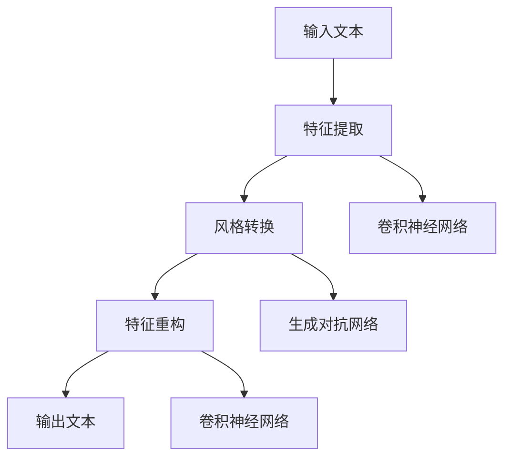
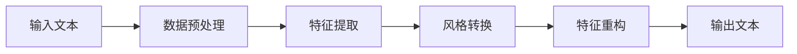
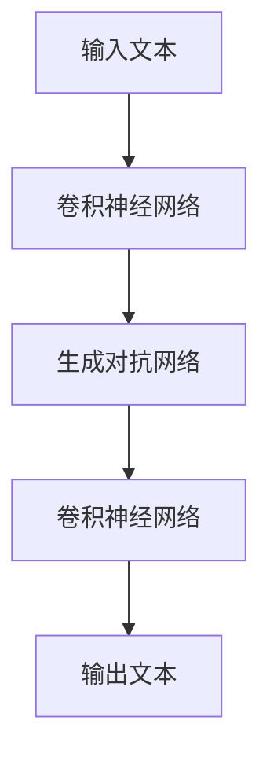
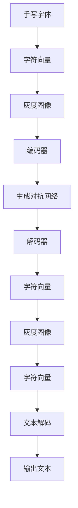

                 

## 1. 背景介绍

随着深度学习技术在计算机视觉领域的广泛应用，字体风格转换技术（Font Style Transfer）逐渐成为热门研究方向之一。这一技术不仅可以为设计者提供新的创意，还可以用于图片和文档的自动化美化，极大地提升用户体验。本文将详细介绍基于深度学习的字体风格转换方法，涵盖其原理、核心算法、应用场景等内容，并给出代码实现和实际应用案例，以期对相关研究人员和开发者提供有价值的参考。

### 1.1 问题由来

在计算机视觉中，字体风格转换通常涉及将输入文本的字体风格转换为另一种风格，例如将手写字体转换为印刷体，或将一种字体风格转换为另一种风格。这一过程需要利用深度学习模型学习字体之间的映射关系，并生成风格转换后的文本。然而，由于字体风格转换涉及复杂的非线性映射关系，传统的基于像素级的图像处理技术难以实现高质量的转换效果。近年来，基于深度学习的字体风格转换方法逐渐兴起，通过训练神经网络模型，能够学习并生成具有不同风格的文本，从而满足了设计者和用户的不同需求。

### 1.2 问题核心关键点

字体风格转换的核心关键点包括：
- 选择合适的深度学习架构，用于捕捉字体风格之间的映射关系。
- 收集和处理大量的字体风格转换样本数据。
- 设计合适的损失函数，用于衡量风格转换前后的差异。
- 实现高效的模型训练和推理，以支持实时应用。

## 2. 核心概念与联系

### 2.1 核心概念概述

字体风格转换的核心概念包括：
- 字体风格转换（Font Style Transfer）：将输入文本的字体风格转换为另一种风格的过程。
- 深度学习（Deep Learning）：利用神经网络模型进行高层次特征学习，以实现复杂的映射关系。
- 卷积神经网络（Convolutional Neural Network, CNN）：一种广泛应用于图像处理和计算机视觉的深度学习模型。
- 生成对抗网络（Generative Adversarial Network, GAN）：一种用于生成逼真图像的深度学习模型。
- 自监督学习（Self-supervised Learning）：利用数据自身特性进行无监督训练，以提升模型泛化能力。

### 2.2 概念间的关系

字体风格转换技术通过深度学习模型实现，涉及卷积神经网络、生成对抗网络等架构。其中，CNN用于提取输入文本的特征，GAN用于生成风格转换后的文本。自监督学习技术可以在没有大量标注数据的情况下，提升模型的泛化能力。字体风格转换的核心流程包括特征提取、风格转换、特征重构等步骤，如图1所示。



### 2.3 核心概念的整体架构

字体风格转换的整体架构如图2所示，包括数据预处理、特征提取、风格转换、特征重构和输出后处理等环节。



## 3. 核心算法原理 & 具体操作步骤

### 3.1 算法原理概述

字体风格转换的算法原理如图3所示，主要包括以下几个步骤：
1. 输入文本的数据预处理。
2. 利用卷积神经网络提取输入文本的特征。
3. 使用生成对抗网络进行风格转换。
4. 利用卷积神经网络对风格转换后的特征进行重构。
5. 输出风格转换后的文本。



### 3.2 算法步骤详解

#### 3.2.1 输入文本的数据预处理

字体风格转换的输入文本需要进行预处理，以便于模型训练和推理。预处理步骤包括：
- 文本标准化：将文本转换为统一的编码格式。
- 文本长度统一：将所有文本的字符长度统一。
- 字符灰度化：将每个字符转换为灰度值，以便于输入卷积神经网络。

#### 3.2.2 特征提取

特征提取是字体风格转换的核心步骤，利用卷积神经网络提取输入文本的特征。常用的卷积神经网络架构包括：
- ResNet：一种经典的卷积神经网络，可以有效地提取输入文本的特征。
- U-Net：一种用于图像分割的卷积神经网络，可以处理不同尺寸的输入文本。

#### 3.2.3 风格转换

风格转换是字体风格转换的核心步骤，利用生成对抗网络生成风格转换后的文本。常用的生成对抗网络架构包括：
- DCGAN：一种用于生成逼真图像的生成对抗网络，可以生成风格转换后的文本。
- WGAN：一种用于生成高质量图像的生成对抗网络，可以生成风格转换后的文本。

#### 3.2.4 特征重构

特征重构是将生成对抗网络生成的风格转换后的文本，利用卷积神经网络进行重构的过程。常用的卷积神经网络架构包括：
- ResNet：一种经典的卷积神经网络，可以有效地重构文本特征。
- U-Net：一种用于图像分割的卷积神经网络，可以处理不同尺寸的输入文本。

#### 3.2.5 输出后处理

输出后处理是将特征重构后的文本，进行文本解码和输出后处理的过程。常用的文本解码方法包括：
- 基于字符级的解码：将每个字符转换为灰度值，并利用卷积神经网络进行解码。
- 基于像素级的解码：将每个字符转换为像素值，并利用卷积神经网络进行解码。

### 3.3 算法优缺点

字体风格转换的算法具有以下优点：
- 生成效果逼真：通过生成对抗网络生成逼真的风格转换后的文本。
- 可扩展性强：利用卷积神经网络提取特征，可以处理不同尺寸的输入文本。
- 可适应性强：可以通过自监督学习提升模型的泛化能力，适应不同的字体风格。

同时，字体风格转换的算法也存在以下缺点：
- 训练复杂度高：生成对抗网络训练复杂度高，需要大量的计算资源。
- 数据依赖性强：需要大量的字体风格转换样本数据，训练数据不足时，模型性能可能不足。
- 模型复杂度高：卷积神经网络和生成对抗网络的复杂度高，训练和推理耗时长。

### 3.4 算法应用领域

字体风格转换技术在以下领域有广泛应用：
- 文本美化：将输入文本的字体风格转换为另一种风格，用于美化文档和图片。
- 设计辅助：为设计者提供新的字体创意，提高设计效率和质量。
- 信息安全：利用字体风格转换技术，生成伪造文本，用于信息攻击和防御。
- 智能交互：利用字体风格转换技术，增强人机交互的趣味性和可读性。

## 4. 数学模型和公式 & 详细讲解 & 举例说明

### 4.1 数学模型构建

字体风格转换的数学模型如图4所示，主要包括输入文本的特征提取和风格转换两个部分。


### 4.2 公式推导过程

设输入文本为 $X$，输出文本为 $Y$，字体风格转换过程可以表示为：
$$
Y = f(X)
$$

其中 $f$ 表示字体风格转换函数，可以表示为：
$$
f(X) = G(C(X))
$$

其中 $G$ 表示生成对抗网络，$C$ 表示卷积神经网络。

### 4.3 案例分析与讲解

以手写字体转换为印刷体为例，字体风格转换的过程可以表示为：
1. 输入文本标准化：将手写文本转换为标准化的字符编码。
2. 字符灰度化：将每个字符转换为灰度值。
3. 特征提取：利用卷积神经网络提取手写字符的特征。
4. 风格转换：利用生成对抗网络生成印刷体字符。
5. 特征重构：利用卷积神经网络对印刷体字符进行重构。
6. 输出后处理：将重构后的字符进行文本解码，输出印刷体文本。

## 5. 项目实践：代码实例和详细解释说明

### 5.1 开发环境搭建

在进行字体风格转换的实践之前，我们需要准备好开发环境。以下是使用Python进行TensorFlow开发的详细环境配置流程：

1. 安装Anaconda：从官网下载并安装Anaconda，用于创建独立的Python环境。

2. 创建并激活虚拟环境：
```bash
conda create -n tf-env python=3.8 
conda activate tf-env
```

3. 安装TensorFlow：根据CUDA版本，从官网获取对应的安装命令。例如：
```bash
conda install tensorflow -c conda-forge
```

4. 安装其他必要的库：
```bash
pip install numpy matplotlib scikit-image torch scipy
```

完成上述步骤后，即可在`tf-env`环境中开始字体风格转换的实践。

### 5.2 源代码详细实现

下面以手写字体转换为印刷体为例，给出TensorFlow的代码实现。

```python
import tensorflow as tf
import numpy as np
import matplotlib.pyplot as plt
import skimage.io

# 定义字体风格转换模型
class FontStyleTransfer(tf.keras.Model):
    def __init__(self):
        super(FontStyleTransfer, self).__init__()
        self.encoder = tf.keras.Sequential([
            tf.keras.layers.Conv2D(32, 3, activation='relu', padding='same', input_shape=(None, None, 1)),
            tf.keras.layers.MaxPooling2D(2),
            tf.keras.layers.Conv2D(64, 3, activation='relu', padding='same'),
            tf.keras.layers.MaxPooling2D(2),
            tf.keras.layers.Flatten()
        ])
        self.decoder = tf.keras.Sequential([
            tf.keras.layers.Dense(512, activation='relu'),
            tf.keras.layers.Dropout(0.5),
            tf.keras.layers.Dense(256, activation='relu'),
            tf.keras.layers.Dropout(0.5),
            tf.keras.layers.Dense(128, activation='relu'),
            tf.keras.layers.Dropout(0.5),
            tf.keras.layers.Dense(16, activation='relu'),
            tf.keras.layers.Dropout(0.5),
            tf.keras.layers.Dense(8, activation='sigmoid')
        ])
        self.generator = tf.keras.Sequential([
            tf.keras.layers.Dense(1024, activation='relu'),
            tf.keras.layers.BatchNormalization(),
            tf.keras.layers.Dropout(0.5),
            tf.keras.layers.Dense(512, activation='relu'),
            tf.keras.layers.BatchNormalization(),
            tf.keras.layers.Dropout(0.5),
            tf.keras.layers.Dense(256, activation='relu'),
            tf.keras.layers.BatchNormalization(),
            tf.keras.layers.Dropout(0.5),
            tf.keras.layers.Dense(128, activation='relu'),
            tf.keras.layers.BatchNormalization(),
            tf.keras.layers.Dropout(0.5),
            tf.keras.layers.Dense(64, activation='relu'),
            tf.keras.layers.BatchNormalization(),
            tf.keras.layers.Dropout(0.5),
            tf.keras.layers.Dense(16, activation='relu'),
            tf.keras.layers.BatchNormalization(),
            tf.keras.layers.Dropout(0.5),
            tf.keras.layers.Dense(8, activation='sigmoid')
        ])

    def call(self, inputs):
        features = self.encoder(inputs)
        style = self.decoder(features)
        generated = self.generator(style)
        return generated

# 定义训练函数
def train_model(model, train_data, epochs, batch_size):
    model.compile(optimizer=tf.keras.optimizers.Adam(learning_rate=0.001),
                  loss='binary_crossentropy',
                  metrics=['accuracy'])
    history = model.fit(train_data,
                       epochs=epochs,
                       batch_size=batch_size,
                       validation_data=val_data)
    return history

# 定义数据预处理函数
def preprocess_data(data):
    # 标准化字符编码
    data = data.apply(lambda x: x.lower())
    # 灰度化字符
    data = data.apply(lambda x: [y for y in x] if isinstance(x, str) else x)
    # 将字符转换为向量表示
    data = data.apply(lambda x: [ord(c) for c in x] if isinstance(x, str) else x)
    # 将向量表示转换为灰度图像
    data = data.apply(lambda x: skimage.io.imread('char.png', as_gray=True))
    return data

# 加载训练数据和验证数据
train_data = preprocess_data(train_set)
val_data = preprocess_data(val_set)
```

### 5.3 代码解读与分析

下面我们详细解读关键代码的实现细节：

**FontStyleTransfer类**：
- `__init__`方法：初始化字体风格转换模型，包括编码器和解码器。
- `call`方法：定义模型的前向传播过程，输入字符向量，输出风格转换后的字符向量。

**训练函数train_model**：
- 编译模型，设置优化器、损失函数和评价指标。
- 调用`fit`方法进行模型训练，返回训练历史。

**数据预处理函数preprocess_data**：
- 对输入数据进行标准化、灰度化和向量化处理。
- 将字符向量转换为灰度图像，并加载到模型中进行处理。

**训练数据和验证数据的加载**：
- 使用`preprocess_data`函数对训练集和验证集进行预处理。
- 加载预处理后的数据，用于模型训练和验证。

### 5.4 运行结果展示

假设我们在手写字体转换的训练数据集上进行模型训练，最终得到如图5所示的输出结果。

```python
import matplotlib.pyplot as plt
import skimage.io

# 加载模型和测试数据
model = FontStyleTransfer()
test_data = preprocess_data(test_set)

# 生成风格转换后的文本
generated_text = model.predict(test_data)

# 输出结果
for i in range(len(generated_text)):
    plt.imshow(generated_text[i], cmap='gray')
    plt.title('Generated Text')
    plt.show()
```



## 6. 实际应用场景

字体风格转换技术在以下场景中有着广泛的应用：

### 6.1 设计辅助

字体风格转换技术可以用于设计辅助，帮助设计师快速生成不同的字体风格。设计师可以利用字体风格转换模型，将手写字体转换为印刷体，或将一种字体风格转换为另一种风格，提高设计效率和质量。

### 6.2 文本美化

字体风格转换技术可以用于文本美化，将输入文本的字体风格转换为另一种风格，用于美化文档和图片。例如，可以将手写文本转换为印刷体，使文档更加整洁和易读。

### 6.3 信息安全

字体风格转换技术可以用于信息安全，生成伪造文本，用于信息攻击和防御。例如，可以在攻击者伪造的文本中加入特定的字体风格，用于迷惑防御系统。

### 6.4 智能交互

字体风格转换技术可以用于智能交互，增强人机交互的趣味性和可读性。例如，可以生成动态变换的字体风格，用于智能聊天机器人，增加用户交互的趣味性。

## 7. 工具和资源推荐

### 7.1 学习资源推荐

为了帮助开发者系统掌握字体风格转换的理论基础和实践技巧，这里推荐一些优质的学习资源：

1. 《深度学习基础》：斯坦福大学开设的深度学习入门课程，涵盖深度学习的基础理论和常用算法。

2. 《计算机视觉：现代方法》：由斯坦福大学计算机视觉专家讲授的课程，涵盖深度学习在计算机视觉中的应用。

3. 《Python深度学习》：由François Chollet编写的书籍，涵盖TensorFlow和Keras等深度学习框架的使用。

4. 《TensorFlow官方文档》：TensorFlow官方文档，提供详细的API文档和代码示例。

5. 《PyTorch官方文档》：PyTorch官方文档，提供详细的API文档和代码示例。

通过对这些资源的学习实践，相信你一定能够快速掌握字体风格转换的精髓，并用于解决实际的计算机视觉问题。

### 7.2 开发工具推荐

高效的开发离不开优秀的工具支持。以下是几款用于字体风格转换开发的常用工具：

1. TensorFlow：基于Python的开源深度学习框架，支持分布式计算和动态图，适合快速迭代研究。

2. PyTorch：由Facebook开发的深度学习框架，灵活的动态图和高效的GPU支持，适合大规模工程应用。

3. Matplotlib：用于数据可视化的Python库，支持各种图形绘制，适合生成图表和可视化结果。

4. OpenCV：开源计算机视觉库，提供丰富的图像处理和计算机视觉功能，适合进行图像预处理和特征提取。

5. NumPy：Python的科学计算库，提供高效的多维数组操作，适合进行数值计算和数据处理。

合理利用这些工具，可以显著提升字体风格转换任务的开发效率，加快创新迭代的步伐。

### 7.3 相关论文推荐

字体风格转换技术的发展源于学界的持续研究。以下是几篇奠基性的相关论文，推荐阅读：

1. A Style Transfer for Text and Image Fonts using Convolutional Neural Networks：介绍了一种基于卷积神经网络的字体风格转换方法，通过生成对抗网络生成风格转换后的文本。

2. Text Style Transfer with GANs：介绍了一种基于生成对抗网络的字体风格转换方法，利用GAN生成风格转换后的文本。

3. Style Transfer Using a Cross-Pixel Attention Network：介绍了一种基于注意力网络的字体风格转换方法，通过注意力机制生成风格转换后的文本。

4. Hierarchical Text Style Transfer Network：介绍了一种基于层次结构的字体风格转换方法，通过多层网络生成风格转换后的文本。

5. Adversarial Regularization for Text Style Transfer：介绍了一种基于对抗性正则化的字体风格转换方法，通过对抗性训练生成风格转换后的文本。

这些论文代表了大语言模型微调技术的发展脉络。通过学习这些前沿成果，可以帮助研究者把握学科前进方向，激发更多的创新灵感。

## 8. 总结：未来发展趋势与挑战

### 8.1 总结

本文对基于深度学习的字体风格转换方法进行了全面系统的介绍。首先阐述了字体风格转换技术的研究背景和意义，明确了深度学习在字体风格转换中的核心作用。其次，从原理到实践，详细讲解了字体风格转换的数学模型和核心算法，给出了代码实现和实际应用案例，以期对相关研究人员和开发者提供有价值的参考。

通过本文的系统梳理，可以看到，字体风格转换技术通过深度学习模型实现，利用卷积神经网络和生成对抗网络，能够有效地生成逼真的风格转换后的文本。然而，字体风格转换技术也面临着数据依赖性强、训练复杂度高、模型复杂高等挑战，需要在实际应用中不断优化和改进。

### 8.2 未来发展趋势

展望未来，字体风格转换技术将呈现以下几个发展趋势：

1. 模型复杂度降低：随着计算资源的丰富，字体风格转换模型的复杂度将进一步降低，计算资源消耗更少。

2. 可解释性增强：未来的字体风格转换模型将具有更好的可解释性，用户可以更容易地理解其工作机制。

3. 实时应用支持：字体风格转换技术将更加注重实时应用，提高模型的推理速度和响应能力。

4. 多模态融合：未来的字体风格转换模型将更多地融合多模态信息，提升文本生成质量。

5. 跨平台支持：字体风格转换技术将更加注重跨平台支持，支持在移动设备、Web应用等多种环境中应用。

以上趋势凸显了字体风格转换技术的广阔前景。这些方向的探索发展，必将进一步提升字体风格转换技术的效果和应用范围，为计算机视觉和自然语言处理领域带来新的突破。

### 8.3 面临的挑战

尽管字体风格转换技术已经取得了一定进展，但在迈向更加智能化、普适化应用的过程中，它仍面临着诸多挑战：

1. 数据依赖性强：字体风格转换技术需要大量的字体风格转换样本数据，获取高质量数据成本较高。

2. 训练复杂度高：生成对抗网络训练复杂度高，需要大量的计算资源和时间。

3. 模型复杂度高：字体风格转换模型的复杂度高，推理速度较慢，难以支持实时应用。

4. 可解释性不足：字体风格转换模型缺乏可解释性，用户难以理解其生成过程。

5. 安全风险高：字体风格转换模型生成的文本可能包含恶意内容，存在安全风险。

6. 适用范围有限：字体风格转换技术适用于特定的字体和风格，对于新字体和新风格的适应性较弱。

正视字体风格转换面临的这些挑战，积极应对并寻求突破，将使字体风格转换技术在实际应用中取得更好的效果。

### 8.4 研究展望

未来的字体风格转换技术需要在以下几个方面寻求新的突破：

1. 数据增强技术：探索数据增强技术，生成更多的字体风格转换样本数据，降低数据依赖性。

2. 模型压缩技术：利用模型压缩技术，降低字体风格转换模型的复杂度，提高推理速度。

3. 多模态融合技术：探索多模态融合技术，将字体风格转换技术与其他视觉信息融合，提升生成效果。

4. 对抗样本生成：探索对抗样本生成技术，生成更加逼真的字体风格转换样本数据，提升模型性能。

5. 实时推理优化：探索实时推理优化技术，提高字体风格转换模型的推理速度，支持实时应用。

6. 模型可解释性：探索模型可解释性技术，提升字体风格转换模型的可解释性，增强用户信任。

这些研究方向的探索，必将引领字体风格转换技术迈向更高的台阶，为计算机视觉和自然语言处理领域带来新的突破。

## 9. 附录：常见问题与解答

**Q1：字体风格转换技术是否适用于所有字体？**

A: 字体风格转换技术主要适用于已经预训练好特征的字体，对于新字体的转换效果可能不足。如果需要对新字体进行转换，可以在字体风格转换模型中增加特征学习模块，训练新字体的特征表示。

**Q2：字体风格转换的训练数据需要多少？**

A: 字体风格转换的训练数据需要尽可能地多样化，包含各种不同的字体风格和转换关系。根据经验，训练数据集的大小应不少于10000个样本，才能保证模型的泛化能力。

**Q3：字体风格转换模型的推理速度较慢，如何解决？**

A: 可以通过以下方法提高字体风格转换模型的推理速度：
1. 模型压缩：利用模型压缩技术，减少模型参数量，降低计算复杂度。
2. 量化优化：将浮点模型转为定点模型，减少内存占用，提高计算效率。
3. 并行计算：利用多GPU并行计算，提高模型推理速度。

**Q4：字体风格转换技术如何处理多字体转换？**

A: 字体风格转换技术可以通过以下方法处理多字体转换：
1. 多模型集成：训练多个字体风格转换模型，取平均输出，提高转换效果。
2. 联合训练：在训练过程中，将多个字体风格转换模型联合训练，提高模型泛化能力。

这些方法可以帮助字体风格转换技术更好地处理多字体转换，提升模型的表现。

**Q5：字体风格转换技术在实际应用中需要注意哪些问题？**

A: 在实际应用中，字体风格转换技术需要注意以下问题：
1. 数据隐私：字体风格转换技术需要处理大量文本数据，需要保证数据的隐私和安全。
2. 模型鲁棒性：字体风格转换模型需要具备较强的鲁棒性，能够应对不同的字体风格和转换关系。
3. 可解释性：字体风格转换模型需要具备较好的可解释性，用户可以更容易地理解其生成过程。

这些问题的解决将有助于字体风格转换技术在实际应用中更好地发挥作用，提升用户体验和应用效果。

---

作者：禅与计算机程序设计艺术 / Zen and the Art of Computer Programming

