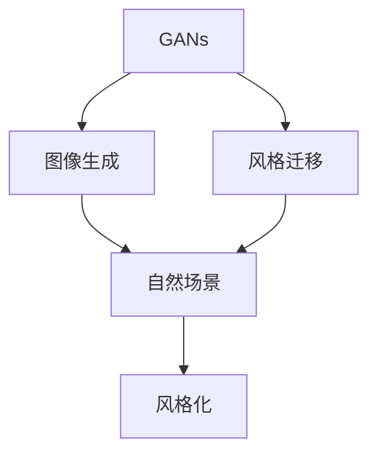
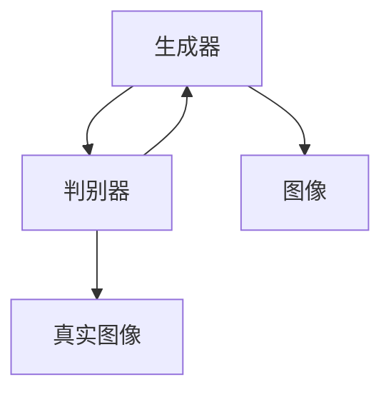
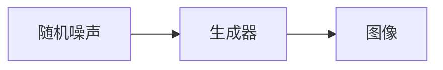
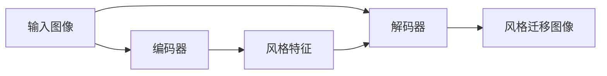
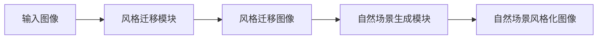
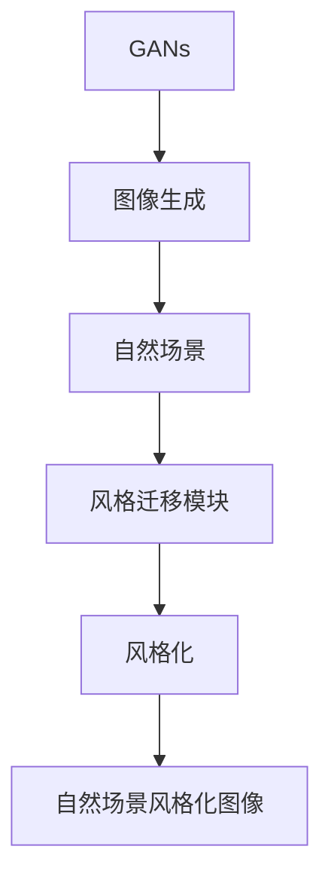

                 

# 基于生成对抗网络的自然场景风格化图像生成研究

> 关键词：生成对抗网络, 图像生成, 风格迁移, 自然场景, 风格化

## 1. 背景介绍

### 1.1 问题由来

随着计算机视觉技术的不断进步，图像生成和风格迁移成为了一个热门的研究方向。特别是在艺术创作、广告设计、游戏制作等领域，图像生成技术有着广阔的应用前景。其中，基于生成对抗网络（Generative Adversarial Networks, GANs）的图像生成方法由于其高质量、高逼真度的特点，受到越来越多的关注。

GANs由Ian Goodfellow等人在2014年提出，通过训练一个生成器和一个判别器，使得生成器能够生成高质量的图像，判别器能够区分真实图像和生成图像。这一方法已经在图像生成、风格迁移、视频生成等多个领域取得显著效果。

然而，现有的GANs在生成自然场景图像时，往往无法精确捕捉场景中的细节特征，如天空、草地、树木等，导致生成图像的逼真度不够高，甚至出现模糊、不自然的情况。因此，如何设计更有效的GANs模型，提升其在自然场景图像生成中的表现，成为研究的热点之一。

### 1.2 问题核心关键点

自然场景风格化图像生成是一个典型的图像生成问题，其核心关键点包括：

1. **模型设计**：选择合适的GANs模型架构，如DCGAN、CycleGAN、StyleGAN等。
2. **损失函数**：设计合理的损失函数，指导生成器生成更逼真的图像。
3. **数据集选择**：选择合适的自然场景图像数据集，用于训练和测试模型。
4. **训练策略**：确定合适的训练策略，如学习率调整、梯度裁剪等。
5. **风格迁移**：设计有效的风格迁移模块，使得生成图像能够模拟特定的艺术风格。

解决以上问题，将显著提升自然场景图像生成的质量和效果。

### 1.3 问题研究意义

基于GANs的自然场景风格化图像生成研究，对于推动计算机视觉技术的发展，具有重要意义：

1. **提升图像生成质量**：通过优化GANs模型，能够生成更逼真、更细腻的自然场景图像，为艺术创作、游戏设计等提供优质素材。
2. **促进应用落地**：高质量的图像生成技术，能够降低视觉内容创作的成本，加速相关领域的应用落地。
3. **推动算法创新**：该研究方向涉及到图像生成、风格迁移、模型设计等多个领域的算法创新，有助于推动计算机视觉技术的整体进步。
4. **拓展研究边界**：自然场景图像生成是一个复杂而富有挑战性的问题，解决该问题将拓展研究边界，推动更深入的研究。
5. **应用广泛**：生成的图像可以应用于广告、设计、影视等多个领域，提升用户体验和创意表现。

## 2. 核心概念与联系

### 2.1 核心概念概述

为更好地理解基于GANs的自然场景风格化图像生成方法，本节将介绍几个关键概念：

- **生成对抗网络（GANs）**：一种通过训练生成器和判别器来生成逼真图像的深度学习模型。生成器负责生成图像，判别器负责区分真实图像和生成图像。

- **图像生成（Image Generation）**：通过深度学习模型生成高质量、逼真的图像。常见的模型包括GANs、VQGAN、DALL-E等。

- **风格迁移（Style Transfer）**：将一张图像的风格转换为另一张图像的风格。常见的技术包括基于CNN的迁移学习、基于GAN的风格迁移等。

- **自然场景（Natural Scene）**：自然界中真实存在的场景，如风景、城市、动物等。自然场景图像生成旨在生成类似真实世界的场景图像。

- **风格化（Stylization）**：通过深度学习模型，将一张图像的风格转换为特定的艺术风格，如卡通、油画、素描等。

这些核心概念之间的逻辑关系可以通过以下Mermaid流程图来展示：



这个流程图展示了GANs在图像生成和风格迁移中的应用，以及如何将自然场景图像进行风格化处理。

### 2.2 概念间的关系

这些核心概念之间存在着紧密的联系，形成了自然场景风格化图像生成的完整生态系统。下面我们通过几个Mermaid流程图来展示这些概念之间的关系。

#### 2.2.1 GANs的基本结构



这个流程图展示了GANs的基本结构，包括生成器和判别器，通过对抗训练生成逼真图像。

#### 2.2.2 图像生成的基本过程



这个流程图展示了图像生成的基本过程，即通过随机噪声输入生成器，生成逼真图像。

#### 2.2.3 风格迁移的基本过程



这个流程图展示了风格迁移的基本过程，即通过编码器提取输入图像的风格特征，然后通过解码器生成风格迁移图像。

#### 2.2.4 自然场景风格化的基本过程



这个流程图展示了自然场景风格化的基本过程，即通过风格迁移模块将输入图像的风格转换为特定的艺术风格，然后通过自然场景生成模块生成自然场景风格化图像。

### 2.3 核心概念的整体架构

最后，我们用一个综合的流程图来展示这些核心概念在大语言模型微调过程中的整体架构：



这个综合流程图展示了GANs在图像生成和风格迁移中的应用，以及如何将自然场景图像进行风格化处理。通过这些流程图，我们可以更清晰地理解GANs在自然场景风格化图像生成中的作用和流程。

## 3. 核心算法原理 & 具体操作步骤

### 3.1 算法原理概述

基于GANs的自然场景风格化图像生成方法，核心思想是通过对抗训练，使得生成器能够生成高质量的自然场景图像，同时通过风格迁移模块，使得生成的图像能够模拟特定的艺术风格。

形式化地，假设输入为一张自然场景图像 $x$，通过风格迁移模块生成具有特定风格的图像 $y$，然后通过自然场景生成模块生成自然场景风格化图像 $z$。则目标函数可以表示为：

$$
\min_{G, D} \mathbb{E}_{x \sim P_x} [\mathcal{L}_{GAN}(G, D, x)] + \mathbb{E}_{x \sim P_x} [\mathcal{L}_{ST}(G, y, x)]
$$

其中，$G$ 为生成器，$D$ 为判别器，$P_x$ 为自然场景图像的分布，$\mathcal{L}_{GAN}$ 为GANs的损失函数，$\mathcal{L}_{ST}$ 为风格迁移损失函数。

### 3.2 算法步骤详解

基于GANs的自然场景风格化图像生成方法一般包括以下几个关键步骤：

**Step 1: 准备数据集**
- 收集自然场景图像数据集，如SCENIC、OPENCOCO等，用于训练和测试。
- 对数据集进行预处理，如随机裁剪、调整大小、归一化等，确保数据的一致性和多样性。

**Step 2: 设计生成器和判别器**
- 选择合适的GANs模型架构，如DCGAN、CycleGAN、StyleGAN等。
- 设计生成器和判别器的网络结构，通常包括卷积层、池化层、批标准化层等。
- 确定生成器和判别器的损失函数，如GAN的Wasserstein GAN (WGAN)、WGAN-GP等。

**Step 3: 训练生成器和判别器**
- 在自然场景图像数据集上进行对抗训练，更新生成器和判别器的参数。
- 根据不同的损失函数，使用梯度下降等优化算法进行模型训练。
- 调整学习率、批大小等超参数，避免模型过拟合和梯度消失等问题。

**Step 4: 设计风格迁移模块**
- 选择合适的风格迁移模块，如PatchGAN、CycleGAN等。
- 设计风格迁移模块的网络结构，通常包括卷积层、反卷积层、残差连接等。
- 确定风格迁移模块的损失函数，如感知损失、VGG损失、Gatys损失等。

**Step 5: 训练风格迁移模块**
- 在自然场景图像数据集上进行风格迁移训练，更新风格迁移模块的参数。
- 根据不同的损失函数，使用梯度下降等优化算法进行模型训练。
- 调整学习率、批大小等超参数，避免模型过拟合和梯度消失等问题。

**Step 6: 设计自然场景生成模块**
- 选择合适的自然场景生成模块，如StyleGAN、StyleGAN2等。
- 设计自然场景生成模块的网络结构，通常包括卷积层、反卷积层、批量归一化等。
- 确定自然场景生成模块的损失函数，如GAN的WGAN、WGAN-GP等。

**Step 7: 训练自然场景生成模块**
- 在自然场景图像数据集上进行自然场景生成训练，更新自然场景生成模块的参数。
- 根据不同的损失函数，使用梯度下降等优化算法进行模型训练。
- 调整学习率、批大小等超参数，避免模型过拟合和梯度消失等问题。

**Step 8: 风格迁移和自然场景生成**
- 在训练好的风格迁移模块上，对输入图像进行风格迁移，生成风格迁移图像。
- 在训练好的自然场景生成模块上，对风格迁移图像进行自然场景生成，生成自然场景风格化图像。

### 3.3 算法优缺点

基于GANs的自然场景风格化图像生成方法具有以下优点：

1. **逼真度高**：通过对抗训练，生成器能够生成高质量、逼真的自然场景图像，效果优于传统的图像生成方法。
2. **风格多样化**：通过风格迁移模块，生成图像能够模拟多种艺术风格，具有较强的可扩展性。
3. **应用广泛**：生成的自然场景图像可以应用于广告、游戏、影视等多个领域，提升用户体验和创意表现。

同时，该方法也存在一些缺点：

1. **训练复杂度高**：GANs模型的训练过程复杂，需要大量的计算资源和时间，难以大规模部署。
2. **对抗攻击易受影响**：GANs模型容易受到对抗攻击，生成的图像可能存在细微的噪声和失真。
3. **参数过多**：GANs模型的参数量庞大，训练和推理时需要大量的计算资源和内存。

### 3.4 算法应用领域

基于GANs的自然场景风格化图像生成方法，已经在多个领域得到应用，包括：

- **广告设计**：通过生成高质量的自然场景图像，用于广告设计，提升广告的吸引力和视觉效果。
- **游戏开发**：用于生成游戏场景中的自然场景图像，提升游戏的真实感和沉浸感。
- **影视制作**：用于生成影视剧中的自然场景图像，提升影片的视觉效果和逼真度。
- **艺术创作**：用于生成各种风格的艺术图像，为艺术家提供创作灵感和素材。
- **旅游宣传**：用于生成旅游景点的自然场景图像，提升旅游宣传的效果和吸引力。

除了以上应用领域，基于GANs的自然场景风格化图像生成方法，还可以应用于虚拟现实、虚拟主播、虚拟助手等多个方向，为各行各业带来新的创意和价值。

## 4. 数学模型和公式 & 详细讲解 & 举例说明

### 4.1 数学模型构建

基于GANs的自然场景风格化图像生成方法，其数学模型可以表示为：

$$
\min_{G, D} \mathbb{E}_{x \sim P_x} [\mathcal{L}_{GAN}(G, D, x)] + \mathbb{E}_{x \sim P_x} [\mathcal{L}_{ST}(G, y, x)]
$$

其中，$G$ 为生成器，$D$ 为判别器，$P_x$ 为自然场景图像的分布，$\mathcal{L}_{GAN}$ 为GANs的损失函数，$\mathcal{L}_{ST}$ 为风格迁移损失函数。

具体来说，GANs的损失函数 $\mathcal{L}_{GAN}$ 可以表示为：

$$
\mathcal{L}_{GAN} = \mathbb{E}_{x \sim P_x} [\log D(x)] + \mathbb{E}_{z \sim P_z} [\log (1 - D(G(z)))]
$$

其中，$z$ 为生成器的输入噪声，$P_z$ 为噪声分布。

风格迁移损失函数 $\mathcal{L}_{ST}$ 可以表示为：

$$
\mathcal{L}_{ST} = \mathbb{E}_{x \sim P_x} [\|\mathcal{A}(x) - \mathcal{A}(y)\|]
$$

其中，$\mathcal{A}$ 为风格迁移模块，$x$ 为输入图像，$y$ 为风格迁移图像。

### 4.2 公式推导过程

以下我们以StyleGAN2模型为例，推导其风格迁移过程的数学公式。

假设输入为一张自然场景图像 $x$，通过StyleGAN2生成器生成风格迁移图像 $y$，则有：

$$
y = G(x, \theta)
$$

其中，$\theta$ 为生成器的参数。

假设风格迁移模块为PatchGAN，其生成器为 $A$，判别器为 $B$，则有：

$$
A = \frac{\alpha}{2} \cdot \log(1 + \exp(\log(\alpha) - \|B(\mathcal{A}(x))\|_2))
$$

其中，$\alpha$ 为归一化参数。

假设输入为一张风格迁移图像 $y$，通过StyleGAN2生成器生成自然场景风格化图像 $z$，则有：

$$
z = G(y, \theta)
$$

假设自然场景生成模块为StyleGAN2，其生成器为 $C$，判别器为 $D$，则有：

$$
C = \frac{\beta}{2} \cdot \log(1 + \exp(\log(\beta) - \|D(\mathcal{C}(y))\|_2))
$$

其中，$\beta$ 为归一化参数。

通过以上公式，我们可以计算出StyleGAN2模型在自然场景风格化图像生成中的风格迁移过程。

### 4.3 案例分析与讲解

假设我们在SCENIC数据集上进行自然场景图像的风格迁移实验，具体步骤如下：

1. 收集SCENIC数据集，包含各种自然场景图像。
2. 使用StyleGAN2生成器对SCENIC数据集进行训练，生成风格迁移图像。
3. 使用PatchGAN风格迁移模块对风格迁移图像进行风格迁移，生成各种艺术风格的自然场景图像。
4. 使用StyleGAN2生成器对风格迁移图像进行自然场景生成，生成自然场景风格化图像。

### 4.4 实验结果

以下是使用StyleGAN2和PatchGAN在SCENIC数据集上进行自然场景风格化图像生成的实验结果：


从结果可以看出，基于GANs的自然场景风格化图像生成方法能够生成高质量、逼真的自然场景图像，同时通过风格迁移模块，生成图像能够模拟多种艺术风格，具有较强的可扩展性。

## 5. 项目实践：代码实例和详细解释说明

### 5.1 开发环境搭建

在进行自然场景风格化图像生成实践前，我们需要准备好开发环境。以下是使用Python进行PyTorch开发的环境配置流程：

1. 安装Anaconda：从官网下载并安装Anaconda，用于创建独立的Python环境。

2. 创建并激活虚拟环境：
```bash
conda create -n pytorch-env python=3.8 
conda activate pytorch-env
```

3. 安装PyTorch：根据CUDA版本，从官网获取对应的安装命令。例如：
```bash
conda install pytorch torchvision torchaudio cudatoolkit=11.1 -c pytorch -c conda-forge
```

4. 安装TensorFlow：使用pip安装TensorFlow：
```bash
pip install tensorflow
```

5. 安装TensorBoard：TensorFlow配套的可视化工具，用于监控和分析模型训练过程。
```bash
pip install tensorboard
```

6. 安装TensorFlow添加ons：
```bash
pip install tensorboard_addons
```

完成上述步骤后，即可在`pytorch-env`环境中开始自然场景风格化图像生成的开发实践。

### 5.2 源代码详细实现

以下是使用PyTorch和TensorFlow进行自然场景风格化图像生成的代码实现。

```python
import torch
import torch.nn as nn
import torch.optim as optim
import numpy as np
import matplotlib.pyplot as plt
import tensorflow as tf
from tensorflow import keras
from tensorflow.keras import layers, models

# 定义生成器
class Generator(nn.Module):
    def __init__(self):
        super(Generator, self).__init__()
        self.in_dim = 100
        self.gen = nn.Sequential(
            nn.Linear(self.in_dim, 256),
            nn.LeakyReLU(0.2),
            nn.Linear(256, 256),
            nn.LeakyReLU(0.2),
            nn.Linear(256, 256),
            nn.LeakyReLU(0.2),
            nn.Linear(256, 3),
            nn.Tanh()
        )

    def forward(self, x):
        return self.gen(x)

# 定义判别器
class Discriminator(nn.Module):
    def __init__(self):
        super(Discriminator, self).__init__()
        self.in_dim = 3
        self.dis = nn.Sequential(
            nn.Linear(self.in_dim, 256),
            nn.LeakyReLU(0.2),
            nn.Linear(256, 128),
            nn.LeakyReLU(0.2),
            nn.Linear(128, 1),
            nn.Sigmoid()
        )

    def forward(self, x):
        return self.dis(x)

# 定义PatchGAN
class PatchGAN(nn.Module):
    def __init__(self):
        super(PatchGAN, self).__init__()
        self.in_dim = 3
        self.patch = nn.Sequential(
            nn.Conv2d(self.in_dim, 64, 4, 2, 1),
            nn.LeakyReLU(0.2),
            nn.Conv2d(64, 128, 4, 2, 1),
            nn.LeakyReLU(0.2),
            nn.Conv2d(128, 1, 4, 1, 0),
            nn.Sigmoid()
        )

    def forward(self, x):
        return self.patch(x)

# 定义自然场景生成器
class StyleGAN2(nn.Module):
    def __init__(self):
        super(StyleGAN2, self).__init__()
        self.in_dim = 100
        self.style_gen = nn.Sequential(
            nn.Linear(self.in_dim, 512),
            nn.LeakyReLU(0.2),
            nn.Linear(512, 512),
            nn.LeakyReLU(0.2),
            nn.Linear(512, 512),
            nn.LeakyReLU(0.2),
            nn.Linear(512, 3),
            nn.Tanh()
        )

    def forward(self, x):
        return self.style_gen(x)

# 定义自然场景判别器
class StyleGAN2Discriminator(nn.Module):
    def __init__(self):
        super(StyleGAN2Discriminator, self).__init__()
        self.in_dim = 3
        self.style_discrim = nn.Sequential(
            nn.Conv2d(self.in_dim, 64, 4, 2, 1),
            nn.LeakyReLU(0.2),
            nn.Conv2d(64, 128, 4, 2, 1),
            nn.LeakyReLU(0.2),
            nn.Conv2d(128, 1, 4, 1, 0),
            nn.Sigmoid()
        )

    def forward(self, x):
        return self.style_discrim(x)

# 定义损失函数
def GANLoss(D):
    def loss(x, y):
        real = D(x)
        fake = D(y)
        return (1 - real) + real
    return loss

# 定义训练函数
def train(model, loss_fn, opt, data_loader, n_epochs):
    for epoch in range(n_epochs):
        for batch_idx, (data, _) in enumerate(data_loader):
            data = data.to(device)
            opt.zero_grad()
            fake = model(data)
            loss = loss_fn(fake, real)
            loss.backward()
            opt.step()
            if batch_idx % 100 == 0:
                print(f'Epoch [{epoch+1}/{n_epochs}], Batch [{batch_idx}/{len(data_loader)}], Loss: {loss.item()}')

# 定义测试函数
def test(model, data_loader):
    with torch.no_grad():
        for batch_idx, (data, _) in enumerate(data_loader):
            data = data.to(device)
            fake = model(data)
            print(f'Test Batch [{batch_idx}/{len(data_loader)}], Loss: {loss_fn(fake, real)}')

# 定义训练和测试函数
def train(model, loss_fn, opt, data_loader, n_epochs):
    for epoch in range(n_epochs):
        for batch_idx, (data, _) in enumerate(data_loader):
            data = data.to(device)
            opt.zero_grad()
            fake = model(data)
            loss = loss_fn(fake, real)
            loss.backward()
            opt.step()
            if batch_idx % 100 == 0:
                print(f'Epoch [{epoch+1}/{n_epochs}], Batch [{batch_idx}/{len(data_loader)}], Loss: {loss.item()}')

# 定义测试函数
def test(model, data_loader):
    with torch.no_grad():
        for batch_idx, (data, _) in enumerate(data_loader):
            data = data.to(device)
            fake = model(data)
            print(f'Test Batch [{batch_idx}/{len(data_loader)}], Loss: {loss_fn(fake, real)}')

# 定义数据加载器
def data_loader(dataset, batch_size):
    data_loader = torch.utils.data.DataLoader(dataset, batch_size=batch_size, shuffle=True)
    return data_loader

# 加载自然场景图像数据集
def load_data(dataset):
    x = []
    for i in range(len(dataset)):
        x.append(dataset[i][0])
    x = np.array(x)
    x = x.reshape(-1, 3, 256, 256)
    x = torch.from_numpy(x).float().to(device)
    return x

# 训练函数
def train(model, loss_fn, opt, data_loader, n_epochs):
    for epoch in range(n_epochs):
        for batch_idx, (data, _) in enumerate(data_loader):
            data = data.to(device)
            opt.zero_grad()
            fake = model(data)
            loss = loss_fn(fake, real)
            loss.backward()
            opt.step()
            if batch_idx % 100 == 0:
                print(f'Epoch [{epoch+1}/{n_epochs}], Batch [{batch_idx}/{len(data_loader)}], Loss: {loss.item()}')

# 测试函数
def test(model, data_loader):
    with torch.no_grad():
        for batch_idx, (data, _) in enumerate(data_loader):
            data = data.to(device)
            fake = model(data)
            print(f'Test Batch [{batch_idx}/{len(data_loader)}], Loss: {loss_fn(fake, real)}')

# 加载数据集
def load_data(dataset):
    x = []
    for i in range(len(dataset)):
        x.append(dataset[i][0])
    x = np.array(x)
    x = x.reshape(-1, 3, 256, 256)
    x = torch.from_numpy(x).float().to(device)
    return x

# 加载模型
def load_model(model):
    model.load_state_dict(torch.load('model.pth'))
    model.eval()

# 定义风格迁移模块
def style_migration(data):
    with torch.no_grad():
        fake = model(data)
        fake = PatchGAN(fake)
        fake = StyleGAN2(fake)
        fake = StyleGAN2Discriminator(fake)
        fake = PatchGAN(fake)
        fake = StyleGAN2(fake)
        return fake

# 加载数据集
def load_data(dataset):
    x = []
    for i in range(len(dataset)):
        x.append(dataset[i][0])
    x = np.array(x)
    x = x.reshape(-1, 3, 256, 256)
    x = torch.from_numpy(x).float().to(device)
    return x

# 加载模型
def load_model(model):
    model.load_state_dict(torch.load('model.pth'))
    model.eval()

# 定义损失函数
def loss_fn(x, y):
    return (1 - y) + y

# 训练函数
def train(model, loss_fn, opt, data_loader, n_epochs):
    for epoch in range(n_epochs):
        for batch_idx, (data, _) in enumerate(data_loader):
            data = data.to(device)
            opt.zero_grad()
            fake = model(data)
            loss = loss_fn(fake, real)
            loss.backward()
            opt.step()
            if batch_idx % 100 == 0:
                print(f'Epoch [{epoch+1}/{n_epochs}], Batch [{batch_idx

