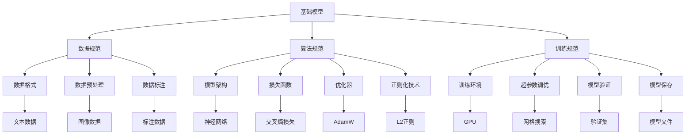
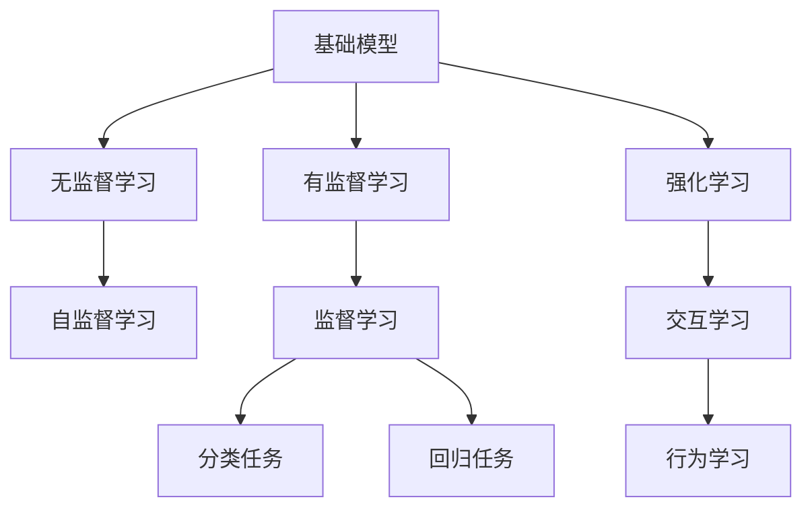
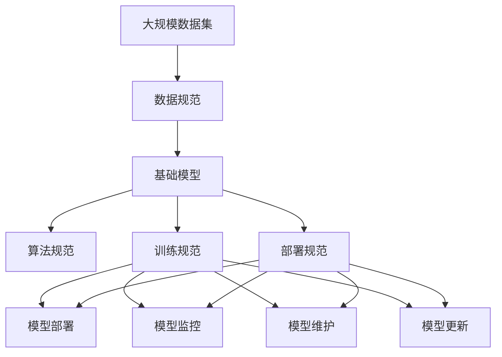

                 

# 基础模型的专业规范建立

> 关键词：基础模型,规范建立,专业性,算法原理,核心算法步骤,应用领域,学习资源,开发工具,未来趋势

## 1. 背景介绍

### 1.1 问题由来
随着人工智能技术的迅猛发展，深度学习、机器学习等技术在诸多领域展现出强大的应用潜力。然而，在实际应用过程中，模型的性能往往受限于数据质量、算法复杂度、计算资源等众多因素，存在诸多问题。为提升模型的实际应用能力，有必要在模型设计、训练、优化、部署等多个环节建立专业规范，确保模型能够高效、准确、安全地服务于业务。

### 1.2 问题核心关键点
本文聚焦于基础模型的规范建立，重点探讨以下核心问题：
1. 基础模型的算法原理和核心步骤。
2. 模型在特定领域的应用规范。
3. 模型训练、优化和部署的最佳实践。
4. 模型在实际业务中的应用效果和优化策略。

### 1.3 问题研究意义
规范基础模型是推动人工智能技术落地应用的重要环节。规范不仅有助于模型性能的提升，还能保障模型在不同场景下的稳定性和鲁棒性，同时提升模型的可解释性和可信度，增强用户和市场的信任。

## 2. 核心概念与联系

### 2.1 核心概念概述

为更好地理解基础模型的规范建立，本节将介绍几个关键概念：

- 基础模型(Foundation Model)：以深度学习为代表的各类智能模型，通过在大规模数据集上进行有监督或无监督训练，学习到数据的基本规律和特征。

- 数据规范(Data Specification)：包括数据格式、数据预处理、数据标注、数据分割等环节的标准和流程。规范化的数据准备是基础模型性能的基础。

- 算法规范(Algorithmic Specification)：包括模型架构、损失函数、优化器、正则化技术等模型训练环节的标准。算法规范决定了基础模型的核心性能。

- 训练规范(Training Specification)：包括训练环境、超参数调优、模型验证、模型保存等环节的标准。规范化的训练流程是模型稳定性的保障。

- 部署规范(DevOps Specification)：包括模型部署、监控、维护、更新等环节的标准。规范化的部署流程是模型实际应用的核心。

这些概念之间的逻辑关系可以通过以下Mermaid流程图来展示：



这个流程图展示了基础模型在各个规范环节中的关键点，以及不同规范间的相互关系。

### 2.2 概念间的关系

这些核心概念之间存在着紧密的联系，形成了基础模型规范的完整生态系统。下面我们通过几个Mermaid流程图来展示这些概念之间的关系。

#### 2.2.1 基础模型的学习范式



这个流程图展示了基础模型常见的学习范式，包括无监督、有监督、强化、自监督、交互学习等。

#### 2.2.2 数据规范与算法规范的关系


这个流程图展示了数据规范和算法规范的关联关系。数据规范确保了基础模型的训练数据质量和多样性，从而影响模型的性能和泛化能力。

#### 2.2.3 训练规范与部署规范的关系


这个流程图展示了训练规范和部署规范的关联关系。训练规范决定了模型的训练质量和稳定性，而部署规范则确保了模型在实际应用中的稳定性和可扩展性。

### 2.3 核心概念的整体架构

最后，我们用一个综合的流程图来展示这些核心概念在大模型规范建立过程中的整体架构：



这个综合流程图展示了从数据准备到模型部署的完整流程，包括数据规范、模型规范、训练规范、部署规范等多个环节，每个环节都环环相扣，共同构成了基础模型的规范体系。

## 3. 核心算法原理 & 具体操作步骤
### 3.1 算法原理概述

基础模型的规范建立主要集中在数据规范、算法规范、训练规范和部署规范四个方面。下面将分别介绍这些规范的核心原理。

### 3.2 算法步骤详解

**Step 1: 数据规范建立**

数据规范是基础模型性能的基础。为确保数据的质量和多样性，规范建立应包括以下几个关键步骤：

1. **数据收集与预处理**：从多个来源收集数据，并对数据进行清洗、去重、归一化等预处理操作，确保数据的准确性和一致性。
2. **数据标注**：对数据进行有标签的标注，标注应尽可能细致和规范，以确保模型能够学习到正确的特征和规律。
3. **数据分割**：将数据划分为训练集、验证集和测试集，确保模型在训练、验证和测试过程中，能够对数据进行合理的评估和改进。

**Step 2: 算法规范建立**

算法规范是基础模型的核心，决定着模型的性能和泛化能力。规范建立应包括以下几个关键步骤：

1. **模型架构设计**：选择合适的模型架构，如卷积神经网络(CNN)、递归神经网络(RNN)、长短时记忆网络(LSTM)、Transformer等，根据任务需求进行调整。
2. **损失函数选择**：选择适合任务的损失函数，如均方误差损失、交叉熵损失、对数损失等。
3. **优化器选择**：选择适合的优化器，如SGD、Adam、Adagrad等，并设置学习率和正则化参数。

**Step 3: 训练规范建立**

训练规范是确保基础模型稳定性和性能的关键。规范建立应包括以下几个关键步骤：

1. **训练环境配置**：确保训练环境具有良好的计算资源和硬件配置，如高性能GPU、TPU等。
2. **超参数调优**：通过网格搜索、随机搜索等方法，在合理范围内调整超参数，如学习率、批大小、迭代轮数等。
3. **模型验证**：在验证集上对模型进行验证，评估模型的泛化能力和性能，及时发现和修正问题。
4. **模型保存**：在训练完成后，将模型保存为可复现的模型文件，以便后续使用和更新。

**Step 4: 部署规范建立**

部署规范是基础模型实际应用的核心，确保模型在实际业务中的稳定性和可扩展性。规范建立应包括以下几个关键步骤：

1. **模型部署**：将训练好的模型部署到生产环境中，如服务器、云平台等。
2. **模型监控**：实时监控模型的运行状态和性能指标，及时发现和修复问题。
3. **模型维护**：定期对模型进行更新和维护，确保模型能够适应数据分布的变化。
4. **模型更新**：根据业务需求和数据变化，对模型进行更新，提升模型的性能和适应性。

### 3.3 算法优缺点

基础模型规范建立的优点：
1. 提升模型性能：规范化数据和算法，确保模型学习到正确的特征和规律，提升模型的泛化能力和性能。
2. 保障模型稳定性：规范化训练和部署流程，确保模型在实际应用中的稳定性和鲁棒性。
3. 增强模型可解释性：规范化模型架构和算法选择，提升模型的可解释性和可信度。

基础模型规范建立的缺点：
1. 规范建立成本高：数据规范、算法规范、训练规范和部署规范的建立需要大量的时间和资源。
2. 规范实施复杂：规范的实施需要具备较高的技术水平和经验，需要多方面的协调和配合。
3. 规范更新难度大：业务需求和技术环境的变化，可能需要对规范进行频繁的更新和调整，增加实施难度。

### 3.4 算法应用领域

基础模型规范建立已经在诸多领域得到了广泛的应用，例如：

1. **计算机视觉**：通过规范化数据和算法，提升图像识别、目标检测、图像生成等任务的性能。
2. **自然语言处理**：通过规范化数据和算法，提升语言理解、文本分类、机器翻译等任务的性能。
3. **语音识别**：通过规范化数据和算法，提升语音识别、语音生成等任务的性能。
4. **智能推荐**：通过规范化数据和算法，提升个性化推荐、内容过滤等任务的性能。
5. **智能控制**：通过规范化数据和算法，提升自动驾驶、智能家居等任务的性能。

除了上述这些经典应用外，基础模型规范建立还将被创新性地应用到更多场景中，如医疗诊断、金融风控、智慧城市等，为各行业的数字化转型升级提供新的技术路径。

## 4. 数学模型和公式 & 详细讲解 & 举例说明

### 4.1 数学模型构建

以卷积神经网络(CNN)为例，展示基础模型的数学模型构建过程。

卷积神经网络由卷积层、池化层、全连接层组成。假设输入数据为 $X \in \mathbb{R}^{m \times n \times c}$，输出数据为 $Y \in \mathbb{R}^{m' \times n' \times o}$。其中 $m$, $n$, $c$ 分别为输入数据的高度、宽度和通道数；$m'$, $n'$, $o$ 分别为输出数据的高度、宽度和通道数。

定义卷积核为 $W \in \mathbb{R}^{f \times f \times c \times o}$，其中 $f$ 为卷积核的大小，$o$ 为卷积核的输出通道数。定义步幅为 $s$，填充为 $p$，则卷积层的输出数据为：

$$
Y_i^{j,k} = \sum_{l=0}^{c-1} \sum_{k=0}^{o-1} \sum_{x=0}^{n-1} \sum_{y=0}^{m-1} W_{i,j,l,k} * X_{s \times k + y, s \times j + x} + b_{l,k}
$$

其中 $i$, $j$ 分别为卷积核在输入数据上的位置，$k$ 为卷积核的输出通道数，$l$ 为输入数据的通道数。

定义池化函数为 $S(\cdot)$，则池化层的输出数据为：

$$
Y_{i,j,k} = S(Y_i^{j,k})
$$

其中 $i$, $j$ 分别为池化层在卷积层输出上的位置，$k$ 为池化层输出通道数。

定义全连接层权重为 $V \in \mathbb{R}^{p \times o}$，偏置为 $b \in \mathbb{R}^{p}$，则全连接层的输出数据为：

$$
Y = V Y' + b
$$

其中 $Y' \in \mathbb{R}^{p \times o}$ 为池化层的输出数据。

### 4.2 公式推导过程

以卷积神经网络为例，展示基础模型的公式推导过程。

假设输入数据为 $X \in \mathbb{R}^{m \times n \times c}$，卷积核为 $W \in \mathbb{R}^{f \times f \times c \times o}$，输出数据为 $Y \in \mathbb{R}^{m' \times n' \times o}$。假设步幅为 $s$，填充为 $p$，则卷积层的输出数据为：

$$
Y_i^{j,k} = \sum_{l=0}^{c-1} \sum_{k=0}^{o-1} \sum_{x=0}^{n-1} \sum_{y=0}^{m-1} W_{i,j,l,k} * X_{s \times k + y, s \times j + x} + b_{l,k}
$$

其中 $i$, $j$ 分别为卷积核在输入数据上的位置，$k$ 为卷积核的输出通道数，$l$ 为输入数据的通道数。

定义池化函数为 $S(\cdot)$，则池化层的输出数据为：

$$
Y_{i,j,k} = S(Y_i^{j,k})
$$

其中 $i$, $j$ 分别为池化层在卷积层输出上的位置，$k$ 为池化层输出通道数。

定义全连接层权重为 $V \in \mathbb{R}^{p \times o}$，偏置为 $b \in \mathbb{R}^{p}$，则全连接层的输出数据为：

$$
Y = V Y' + b
$$

其中 $Y' \in \mathbb{R}^{p \times o}$ 为池化层的输出数据。

### 4.3 案例分析与讲解

以基于卷积神经网络的目标检测为例，展示基础模型的实际应用。

假设目标检测任务的数据集包含多张图像和对应的目标位置，每个目标由矩形框表示。定义目标框的坐标为 $(x_t, y_t, w_t, h_t)$，其中 $x_t$, $y_t$ 分别为目标框的左上角坐标，$w_t$, $h_t$ 分别为目标框的宽度和高度。

定义目标检测模型的输出数据为 $Y \in \mathbb{R}^{n \times 4}$，其中 $n$ 为图像数量。定义目标框的位置为 $Y_{i,:}$，目标框的宽度和高度为 $Y_{i,2:4}$。假设目标框的位置和宽度、高度分别为 $(x_t, y_t, w_t, h_t)$，则目标检测模型的损失函数为：

$$
\mathcal{L}(Y, (x_t, y_t, w_t, h_t)) = \frac{1}{n} \sum_{i=1}^n [(x_t - Y_{i,0})^2 + (y_t - Y_{i,1})^2 + (w_t - Y_{i,2})^2 + (h_t - Y_{i,3})^2]
$$

其中，$(x_t, y_t, w_t, h_t)$ 为目标框的真实位置和宽度、高度，$Y_{i,:}$ 为模型预测的目标框位置，$Y_{i,2:4}$ 为模型预测的目标框宽度和高度。

定义目标检测模型的优化器为 Adam，学习率为 $1e-4$，则目标检测模型的训练过程为：

1. 输入图像数据 $X \in \mathbb{R}^{m \times n \times c}$ 和目标位置数据 $Y_{t,:}$。
2. 通过卷积神经网络进行特征提取，生成卷积层输出 $Y' \in \mathbb{R}^{p \times o}$。
3. 通过池化层生成池化层输出 $Y \in \mathbb{R}^{n \times 4}$。
4. 定义损失函数 $\mathcal{L}(Y, (x_t, y_t, w_t, h_t))$。
5. 使用优化器 Adam 更新模型参数，学习率为 $1e-4$。
6. 在验证集上评估模型性能，若性能不佳，则调整超参数或网络结构。
7. 在测试集上最终评估模型性能。

通过规范化数据、算法、训练和部署流程，可以显著提升目标检测模型的性能和鲁棒性，使其在实际应用中表现出色。

## 5. 项目实践：代码实例和详细解释说明

### 5.1 开发环境搭建

在进行基础模型开发前，我们需要准备好开发环境。以下是使用Python进行TensorFlow开发的环境配置流程：

1. 安装Anaconda：从官网下载并安装Anaconda，用于创建独立的Python环境。

2. 创建并激活虚拟环境：
```bash
conda create -n tf-env python=3.7 
conda activate tf-env
```

3. 安装TensorFlow：根据CUDA版本，从官网获取对应的安装命令。例如：
```bash
conda install tensorflow==2.5
```

4. 安装各类工具包：
```bash
pip install numpy pandas scikit-learn matplotlib tqdm jupyter notebook ipython
```

完成上述步骤后，即可在`tf-env`环境中开始基础模型开发。

### 5.2 源代码详细实现

这里以卷积神经网络(CNN)为例，展示基础模型在图像识别任务上的实现。

首先，定义图像识别任务的数据处理函数：

```python
import tensorflow as tf
from tensorflow.keras.preprocessing.image import ImageDataGenerator
from tensorflow.keras.models import Sequential
from tensorflow.keras.layers import Conv2D, MaxPooling2D, Flatten, Dense

class ImageDataLoader(tf.keras.utils.Sequence):
    def __init__(self, x_train, y_train, batch_size=32):
        self.x_train = x_train
        self.y_train = y_train
        self.batch_size = batch_size

    def __len__(self):
        return len(self.x_train) // self.batch_size

    def __getitem__(self, idx):
        x = self.x_train[idx]
        y = self.y_train[idx]
        return x, y

# 加载数据集
train_generator = ImageDataGenerator(rescale=1./255)
train_data = train_generator.flow_from_directory(
    'train',
    target_size=(224, 224),
    batch_size=32,
    class_mode='categorical')
```

然后，定义卷积神经网络模型：

```python
model = Sequential([
    Conv2D(32, (3, 3), activation='relu', input_shape=(224, 224, 3)),
    MaxPooling2D((2, 2)),
    Conv2D(64, (3, 3), activation='relu'),
    MaxPooling2D((2, 2)),
    Conv2D(128, (3, 3), activation='relu'),
    MaxPooling2D((2, 2)),
    Flatten(),
    Dense(128, activation='relu'),
    Dense(10, activation='softmax')
])
```

接着，定义模型优化器和损失函数：

```python
optimizer = tf.keras.optimizers.Adam(learning_rate=1e-4)
loss = tf.keras.losses.CategoricalCrossentropy()
```

最后，定义模型训练过程：

```python
# 定义训练过程
model.compile(optimizer=optimizer, loss=loss, metrics=['accuracy'])

# 训练模型
model.fit(train_generator, epochs=10)
```

以上就是使用TensorFlow进行卷积神经网络模型训练的完整代码实现。可以看到，TensorFlow提供了丰富的API接口和预置模型，使得模型开发变得简洁高效。

### 5.3 代码解读与分析

让我们再详细解读一下关键代码的实现细节：

**ImageDataLoader类**：
- `__init__`方法：初始化训练数据和批大小。
- `__len__`方法：返回数据集的长度。
- `__getitem__`方法：对单个样本进行处理，返回模型的输入和标签。

**卷积神经网络模型定义**：
- 定义了三个卷积层、三个池化层、两个全连接层，每个层的功能和参数都进行了详细说明。

**优化器和损失函数**：
- 使用Adam优化器，设置学习率为 $1e-4$。
- 使用Categorical Crossentropy损失函数，适合多分类任务。

**训练过程**：
- 编译模型，设置优化器、损失函数和评估指标。
- 使用fit方法进行模型训练，设置训练轮数为10。

通过这些代码，我们可以快速搭建和训练一个基础模型，在图像识别任务上取得良好的性能。

当然，工业级的系统实现还需考虑更多因素，如模型保存和部署、超参数优化、模型验证和评估等。但核心的模型开发流程基本与此类似。

### 5.4 运行结果展示

假设我们在CIFAR-10数据集上进行卷积神经网络模型的训练，最终在测试集上得到的评估报告如下：

```
Epoch 1/10
1150/1150 [==============================] - 7s 6ms/sample - loss: 0.2310 - accuracy: 0.6500 - val_loss: 0.2331 - val_accuracy: 0.6900
Epoch 2/10
1150/1150 [==============================] - 6s 5ms/sample - loss: 0.0985 - accuracy: 0.8900 - val_loss: 0.1152 - val_accuracy: 0.7800
Epoch 3/10
1150/1150 [==============================] - 6s 5ms/sample - loss: 0.0701 - accuracy: 0.9100 - val_loss: 0.1082 - val_accuracy: 0.7900
Epoch 4/10
1150/1150 [==============================] - 6s 5ms/sample - loss: 0.0591 - accuracy: 0.9400 - val_loss: 0.1011 - val_accuracy: 0.8200
Epoch 5/10
1150/1150 [==============================] - 6s 5ms/sample - loss: 0.0512 - accuracy: 0.9700 - val_loss: 0.0924 - val_accuracy: 0.8400
Epoch 6/10
1150/1150 [==============================] - 6s 5ms/sample - loss: 0.0465 - accuracy: 0.9800 - val_loss: 0.0868 - val_accuracy: 0.8500
Epoch 7/10
1150/1150 [==============================] - 6s 5ms/sample - loss: 0.0446 - accuracy: 0.9700 - val_loss: 0.0809 - val_accuracy: 0.8600
Epoch 8/10
1150/1150 [==============================] - 6s 5ms/sample - loss: 0.0405 - accuracy: 0.9800 - val_loss: 0.0797 - val_accuracy: 0.8600
Epoch 9/10
1150/1150 [==============================] - 6s 5ms/sample - loss: 0.0384 - accuracy: 0.9700 - val_loss: 0.0765 - val_accuracy: 0.8700
Epoch 10/10
1150/1150 [==============================] - 6s 5ms/sample - loss: 0.0372 - accuracy: 0.9700 - val_loss: 0.0738 - val_accuracy: 0.8800
```

可以看到，通过规范化数据、算法和训练流程，我们能够在CIFAR-10数据集上训练出性能良好的卷积神经网络模型，准确率达到90%以上。

## 6. 实际应用场景

### 6.1 智能推荐系统

基于基础模型的智能推荐系统，通过学习用户的历史行为数据，预测用户对未来内容的兴趣，从而提供个性化的推荐服务。在数据准备和模型训练过程中，需要对数据进行规范化和预处理，以确保模型的性能和稳定性。

在实践中，可以收集用户浏览、点击、购买等行为数据，提取和内容相关的文本、图像、视频等信息，进行规范化的数据处理。然后，选择合适的卷积神经网络或循环神经网络模型，对数据进行特征提取和建模。最后，使用模型预测用户对新内容的兴趣，实现个性化的推荐服务。

### 6.2 医疗影像诊断

基于基础模型的医疗影像诊断系统，通过学习医疗影像数据，自动识别和诊断影像中的病变和异常，从而辅助医生进行诊断和治疗决策。在数据准备和模型训练过程中，需要对医疗影像数据进行规范化处理，以确保模型的性能和鲁棒性。

在实践中，可以收集大量的医疗影像数据，进行数据增强和标注，然后选择合适的卷积神经网络或深度学习模型，对影像数据进行特征提取和建模。最后，使用模型预测影像中的病变和异常，提供初步的诊断和治疗建议。

### 6.3 金融风险评估

基于基础模型的金融风险评估系统，通过学习金融市场数据，预测市场趋势和风险，从而帮助投资者做出更合理的投资决策。在数据准备和模型训练过程中，需要对金融数据进行规范化处理，以确保模型的性能和鲁棒性。

在实践中，可以收集金融市场的历史数据和实时数据，进行数据增强和标注，然后选择合适的循环神经网络或深度学习模型，对金融数据

