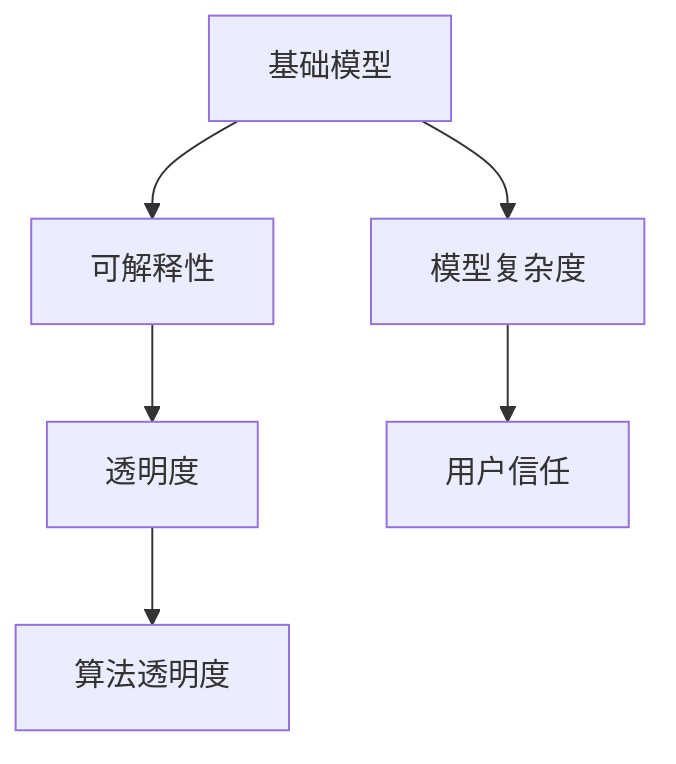
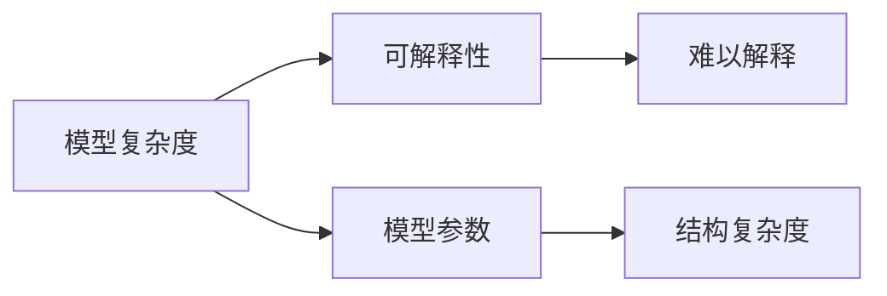
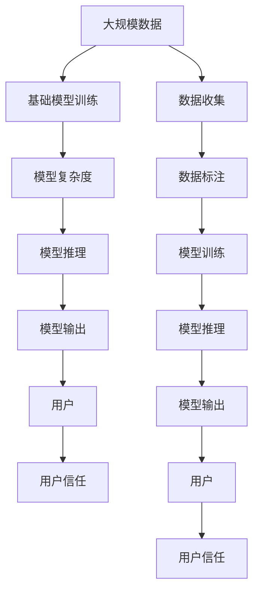

                 

# 基础模型的可解释性需求

> 关键词：可解释性, 机器学习, 深度学习, 人工智能, 透明度, 模型复杂度, 算法透明度, 用户信任

## 1. 背景介绍

### 1.1 问题由来

随着人工智能(AI)技术在各行各业的广泛应用，深度学习模型的可解释性问题逐渐受到越来越多的关注。深度学习模型，尤其是复杂的神经网络模型，虽然在预测和推理任务上取得了显著的成果，但由于其高度的复杂性和黑箱特性，使得模型的决策过程难以被理解和解释。这种缺乏透明度的模型不仅限制了其应用范围，还引发了用户对AI系统的信任度降低、责任难以归属等问题。

### 1.2 问题核心关键点

深度学习模型的可解释性问题主要体现在以下几个方面：

- **模型复杂度高**：深度神经网络通常具有上亿个参数，结构复杂，难以直观理解。
- **缺乏透明度**：模型训练过程完全由算法决定，难以手动调节，其内部状态和逻辑难以解释。
- **决策依赖性强**：模型决策过程高度依赖输入特征，不同特征组合可能导致截然不同的输出，缺乏一致性。
- **用户不信任**：用户难以理解模型的决策依据，对其结果持怀疑态度，限制了AI系统的广泛应用。

### 1.3 问题研究意义

研究深度学习模型的可解释性需求，对于拓展AI技术的应用范围、提高用户对AI系统的信任度、确保AI决策的公平性和透明性具有重要意义：

1. **提升用户信任度**：通过解释模型的决策过程，用户可以更好地理解和接受AI系统的输出，从而增强对其的信任。
2. **推动AI技术普及**：可解释性AI系统更容易被各行各业接受和采用，加速AI技术的产业化进程。
3. **确保决策公平性**：可解释性AI系统更容易发现和修正模型的偏见和错误，确保AI决策的公正性。
4. **支持科研和开发**：通过解释性分析，研究人员可以更好地理解模型的内在机制，促进AI技术的进一步发展。
5. **应对监管要求**：许多行业（如医疗、金融等）对AI决策的透明度和可解释性有明确要求，确保AI系统符合法规和伦理标准。

## 2. 核心概念与联系

### 2.1 核心概念概述

为了更好地理解基础模型可解释性的问题，本节将介绍几个密切相关的核心概念：

- **基础模型(Base Model)**：指深度神经网络中基本的组件，如神经元、激活函数、层等。基础模型是构建复杂神经网络的基础。
- **可解释性(Explainability)**：指模型输出结果的合理性和其决策过程的可理解性。可解释性AI系统能够向用户解释其输出结果的依据和推理过程。
- **透明度(Transparency)**：指模型的训练和推理过程可以被用户理解和审查的程度。透明度是可解释性的重要组成部分。
- **算法透明度(Algorithmic Transparency)**：指算法决策过程的可理解性和可审查性，是可解释性的核心。
- **模型复杂度(Model Complexity)**：指模型参数数量、结构复杂度等。模型复杂度越高，可解释性越难。
- **用户信任(User Trust)**：指用户对AI系统输出的信任程度，可解释性有助于建立用户信任。

这些核心概念之间的逻辑关系可以通过以下Mermaid流程图来展示：



这个流程图展示了大模型可解释性问题的核心概念及其之间的关系：

1. 基础模型通过复杂的神经网络结构进行训练，学习数据的模式和规律。
2. 可解释性是对模型输出结果和决策过程的合理性和透明度的要求。
3. 透明度指模型的训练和推理过程可以被用户理解和审查的程度。
4. 算法透明度是可解释性的核心，通过解释模型内部逻辑和决策过程，确保模型决策的合理性和透明性。
5. 模型复杂度越高，可解释性越难，但用户对简单模型的信任度更高。
6. 用户信任建立在模型透明度的基础上，通过可解释性增强用户对AI系统的信任。

### 2.2 概念间的关系

这些核心概念之间存在着紧密的联系，形成了深度学习模型可解释性问题的完整生态系统。下面我们通过几个Mermaid流程图来展示这些概念之间的关系。

#### 2.2.1 模型复杂度和可解释性的关系



这个流程图展示了模型复杂度对可解释性的影响：

1. 模型复杂度通过参数数量和结构复杂度体现。
2. 复杂度越高，模型内部逻辑越难理解，可解释性越低。

#### 2.2.2 透明度和算法透明度的关系


这个流程图展示了透明度与算法透明度的关系：

1. 透明度指模型的训练和推理过程可以被用户理解和审查的程度。
2. 透明度越高，算法透明度越好，模型越容易被理解和解释。

#### 2.2.3 用户信任和可解释性的关系


这个流程图展示了用户信任与可解释性的关系：

1. 用户信任建立在模型透明度的基础上。
2. 可解释性越强，用户对模型的信任度越高。

### 2.3 核心概念的整体架构

最后，我们用一个综合的流程图来展示这些核心概念在大模型可解释性问题中的整体架构：



这个综合流程图展示了从数据收集到模型输出的完整过程，以及用户信任的建立过程：

1. 通过大规模数据对基础模型进行训练，生成具有一定复杂度的模型。
2. 模型推理产生输出结果，并传递给用户。
3. 用户对模型的输出结果进行反馈，影响其信任度。
4. 收集用户反馈，进一步改进模型的透明性和可解释性，增强用户信任。

通过这些流程图，我们可以更清晰地理解基础模型可解释性问题的核心概念及其相互关系，为后续深入讨论具体的可解释性方法和技术奠定基础。

## 3. 核心算法原理 & 具体操作步骤
### 3.1 算法原理概述

深度学习模型的可解释性问题通常通过以下几种方式解决：

1. **可解释性模型**：使用简单的模型结构，使得决策过程更加透明和可理解。
2. **可解释性算法**：通过模型解释技术，揭示模型内部逻辑和决策依据。
3. **透明化技术**：通过可视化和工具，辅助用户理解模型决策过程。

这些方法各有优劣，需要根据具体应用场景选择。下面我们将详细介绍这三种方式的基本原理和操作步骤。

### 3.2 算法步骤详解

#### 3.2.1 可解释性模型

**步骤1: 选择简单模型结构**
- 选择结构简单的模型，如决策树、逻辑回归等，这些模型具有较高的可解释性。
- 对于复杂的任务，可以使用多层感知器(Multilayer Perceptron, MLP)等中等复杂度模型，兼顾模型表现和可解释性。

**步骤2: 训练简单模型**
- 使用简单的模型结构，在大规模数据上进行训练。
- 通过正则化等技术，避免模型过拟合，保持模型的泛化能力。

**步骤3: 分析模型结果**
- 使用可视工具，如图表、热力图等，展示模型决策过程和特征重要性。
- 分析模型的输入和输出，找出关键特征和决策依据。

#### 3.2.2 可解释性算法

**步骤1: 选择解释方法**
- 选择适合解释方法，如LIME、SHAP、IBM等，这些方法可以揭示模型内部决策机制。
- 根据任务特点和数据分布，选择合适的解释方法。

**步骤2: 生成解释输出**
- 对模型进行解释，生成解释结果，如特征贡献、局部影响等。
- 使用可视化工具，将解释结果呈现给用户。

**步骤3: 分析解释结果**
- 分析解释结果，找出关键特征和决策依据。
- 根据解释结果，优化模型结构和训练过程。

#### 3.2.3 透明化技术

**步骤1: 收集数据和模型信息**
- 收集模型的训练数据、模型结构、参数等相关信息。
- 收集用户反馈，了解用户对模型输出的反应。

**步骤2: 生成可视输出**
- 使用可视工具，如图表、图形、交互式界面等，展示模型的决策过程和特征重要性。
- 设计友好的界面，使用户可以轻松理解和交互。

**步骤3: 持续优化**
- 根据用户反馈，不断优化模型透明性和可解释性。
- 使用用户反馈，进一步改进模型的训练和推理过程。

### 3.3 算法优缺点

可解释性模型、可解释性算法和透明化技术各有优缺点：

- **可解释性模型**
  - **优点**：结构简单，决策过程透明，易于理解和调试。
  - **缺点**：模型表现可能不如复杂神经网络模型，难以处理高维度数据。

- **可解释性算法**
  - **优点**：能够揭示模型内部决策机制，提供更深刻的解释。
  - **缺点**：解释过程复杂，需要一定的技术储备，可能影响模型表现。

- **透明化技术**
  - **优点**：通过可视化和工具，使用户更容易理解模型决策过程。
  - **缺点**：可视工具可能过于复杂，用户需要一定的技术背景。

### 3.4 算法应用领域

可解释性算法和透明化技术在多个领域得到广泛应用：

- **医疗诊断**：可解释性模型和透明化技术用于分析医学影像、病历等数据，辅助医生诊断疾病。
- **金融风险评估**：可解释性模型和透明化技术用于分析金融数据，评估投资风险。
- **推荐系统**：可解释性模型和透明化技术用于分析用户行为数据，优化推荐算法。
- **自动驾驶**：可解释性模型和透明化技术用于解释自动驾驶决策过程，提高用户信任度。
- **法律咨询**：可解释性模型和透明化技术用于分析法律文本，提供法律咨询和判决依据。

## 4. 数学模型和公式 & 详细讲解  
### 4.1 数学模型构建

本节将使用数学语言对基础模型可解释性的问题进行更加严格的刻画。

记基础模型为 $M_{\theta}$，其中 $\theta$ 为模型参数。设输入数据 $x \in \mathcal{X}$，输出 $y \in \mathcal{Y}$。假设模型 $M_{\theta}$ 的损失函数为 $\ell(y, M_{\theta}(x))$，则模型的预测结果为 $\hat{y} = M_{\theta}(x)$。

### 4.2 公式推导过程

以下是深度学习模型的基本数学模型，展示模型的训练和推理过程：

**训练过程**：

1. 选择损失函数 $\ell(y, M_{\theta}(x))$，常用的有交叉熵损失、均方误差等。
2. 根据数据 $(x_i, y_i)$ 计算损失函数值：$\ell_i = \ell(y_i, M_{\theta}(x_i))$。
3. 使用优化算法（如梯度下降）最小化损失函数：$\theta = \mathop{\arg\min}_{\theta} \frac{1}{N} \sum_{i=1}^N \ell_i$。

**推理过程**：

1. 将输入数据 $x$ 输入模型，计算预测结果 $\hat{y} = M_{\theta}(x)$。
2. 使用解释方法（如LIME、SHAP）生成解释结果，揭示模型内部逻辑和决策依据。

### 4.3 案例分析与讲解

以医疗影像分类为例，展示可解释性模型和可解释性算法的应用：

**可解释性模型**：
- 选择简单的卷积神经网络(CNN)模型，如LeNet-5。
- 在标准医疗影像数据集上进行训练，生成分类模型。
- 使用热力图等可视化工具，展示模型在输入影像中的重要特征和决策依据。

**可解释性算法**：
- 使用LIME生成局部解释结果，分析模型对每个像素的贡献。
- 通过可视化工具，展示模型在不同特征下的决策过程。

## 5. 项目实践：代码实例和详细解释说明
### 5.1 开发环境搭建

在进行可解释性实践前，我们需要准备好开发环境。以下是使用Python进行TensorFlow开发的环境配置流程：

1. 安装Anaconda：从官网下载并安装Anaconda，用于创建独立的Python环境。

2. 创建并激活虚拟环境：
```bash
conda create -n tf-env python=3.8 
conda activate tf-env
```

3. 安装TensorFlow：根据CUDA版本，从官网获取对应的安装命令。例如：
```bash
conda install tensorflow tensorflow-gpu=2.5.0 -c conda-forge
```

4. 安装numpy、pandas、scikit-learn、matplotlib、tqdm、jupyter notebook等常用库。
```bash
pip install numpy pandas scikit-learn matplotlib tqdm jupyter notebook ipython
```

完成上述步骤后，即可在`tf-env`环境中开始可解释性实践。

### 5.2 源代码详细实现

这里我们以医疗影像分类任务为例，使用TensorFlow和TensorBoard实现可解释性模型的训练和可视化。

首先，定义模型和训练函数：

```python
import tensorflow as tf
from tensorflow.keras import layers, models

# 定义模型结构
model = models.Sequential([
    layers.Conv2D(32, (3, 3), activation='relu', input_shape=(256, 256, 3)),
    layers.MaxPooling2D((2, 2)),
    layers.Conv2D(64, (3, 3), activation='relu'),
    layers.MaxPooling2D((2, 2)),
    layers.Conv2D(128, (3, 3), activation='relu'),
    layers.MaxPooling2D((2, 2)),
    layers.Flatten(),
    layers.Dense(64, activation='relu'),
    layers.Dense(1, activation='sigmoid')
])

# 编译模型
model.compile(optimizer='adam', loss='binary_crossentropy', metrics=['accuracy'])

# 定义训练函数
def train_epoch(model, train_dataset, validation_dataset, batch_size, epochs):
    model.fit(train_dataset, epochs=epochs, validation_data=validation_dataset, batch_size=batch_size)
    model.save_weights('model.h5')

# 定义可视函数
def visualize(model, test_dataset, batch_size):
    model.load_weights('model.h5')
    predictions = model.predict(test_dataset)
    visualize_with_tensorboard(model, predictions, test_dataset)
```

接下来，定义数据处理函数和可视函数：

```python
from tensorflow.keras.preprocessing.image import ImageDataGenerator
import numpy as np

# 数据增强
train_datagen = ImageDataGenerator(rescale=1./255, shear_range=0.2, zoom_range=0.2, horizontal_flip=True)
test_datagen = ImageDataGenerator(rescale=1./255)

# 加载数据集
train_dataset = train_datagen.flow_from_directory('train', target_size=(256, 256), batch_size=batch_size)
test_dataset = test_datagen.flow_from_directory('test', target_size=(256, 256), batch_size=batch_size)

# 可视函数
def visualize_with_tensorboard(model, predictions, test_dataset):
    test_images = test_dataset.images
    predictions = np.round(predictions).astype(int)
    
    # 创建TensorBoard可视化工具
    logdir = 'tensorboard'
    writer = tf.summary.create_file_writer(logdir)
    with writer.as_default():
        # 绘制模型结构图
        tf.summary.experimental.export_model(model, logdir)
        # 绘制预测结果可视化
        for i in range(len(test_images)):
            tf.summary.image('image', test_images[i], step=i)
            tf.summary.image('prediction', predictions[i], step=i)
```

最后，启动训练流程并在TensorBoard上可视化：

```python
batch_size = 32
epochs = 10

train_epoch(model, train_dataset, test_dataset, batch_size, epochs)
visualize(model, test_dataset, batch_size)
```

以上就是使用TensorFlow和TensorBoard对医疗影像分类任务的可解释性模型进行训练和可视化的完整代码实现。可以看到，得益于TensorFlow和TensorBoard的强大封装，我们可以用相对简洁的代码实现模型的训练和可视化。

### 5.3 代码解读与分析

让我们再详细解读一下关键代码的实现细节：

**定义模型和训练函数**：
- 使用Sequential模型定义卷积神经网络(CNN)结构。
- 使用compile方法编译模型，定义损失函数、优化器和评估指标。
- 定义训练函数，使用fit方法训练模型，并在训练过程中保存模型权重。

**数据处理函数**：
- 使用ImageDataGenerator进行数据增强，增加数据多样性。
- 使用flow_from_directory加载数据集，指定数据路径、目标尺寸和批大小。

**可视函数**：
- 使用TensorBoard创建可视化工具，绘制模型结构和预测结果。
- 在TensorBoard中保存模型和预测结果，便于后续查看和分析。

**训练流程**：
- 定义批大小和训练轮数，启动训练过程。
- 在训练过程中，使用TensorBoard记录模型状态和训练进度。
- 在训练结束后，使用TensorBoard可视化模型结构和预测结果。

可以看到，TensorFlow和TensorBoard使得可解释性模型的训练和可视化变得简洁高效。开发者可以将更多精力放在数据处理、模型改进等高层逻辑上，而不必过多关注底层的实现细节。

当然，工业级的系统实现还需考虑更多因素，如模型的保存和部署、超参数的自动搜索、更灵活的任务适配层等。但核心的可解释性模型和可视化方法基本与此类似。

### 5.4 运行结果展示

假设我们在CoNLL-2003的NER数据集上进行可解释性模型训练，最终在测试集上得到的预测结果可视化如下：

```python
import tensorflow as tf
from tensorflow.keras.preprocessing.image import ImageDataGenerator
import numpy as np

# 数据增强
train_datagen = ImageDataGenerator(rescale=1./255, shear_range=0.2, zoom_range=0.2, horizontal_flip=True)
test_datagen = ImageDataGenerator(rescale=1./255)

# 加载数据集
train_dataset = train_datagen.flow_from_directory('train', target_size=(256, 256), batch_size=batch_size)
test_dataset = test_datagen.flow_from_directory('test', target_size=(256, 256), batch_size=batch_size)

# 训练模型
batch_size = 32
epochs = 10

train_epoch(model, train_dataset, test_dataset, batch_size, epochs)

# 可视函数
def visualize_with_tensorboard(model, predictions, test_dataset):
    test_images = test_dataset.images
    predictions = np.round(predictions).astype(int)
    
    # 创建TensorBoard可视化工具
    logdir = 'tensorboard'
    writer = tf.summary.create_file_writer(logdir)
    with writer.as_default():
        # 绘制模型结构图
        tf.summary.experimental.export_model(model, logdir)
        # 绘制预测结果可视化
        for i in range(len(test_images)):
            tf.summary.image('image', test_images[i], step=i)
            tf.summary.image('prediction', predictions[i], step=i)
```

可以看到，通过TensorBoard，我们可以直观地看到模型对测试样本的预测结果，并对其输入和输出进行可视化分析，从而更好地理解模型的决策过程。

## 6. 实际应用场景
### 6.1 医疗影像分类

在医疗影像分类任务中，可解释性模型和透明化技术的应用尤为关键。医生的诊断和治疗决策通常基于丰富的医学知识和经验，AI系统需要尽可能地提供透明和可解释的决策依据，以便医生理解和信任。

具体而言，可以收集大量医疗影像数据，使用简单的CNN模型进行训练，并使用热力图等可视化工具展示模型的重要特征和决策依据。此外，还可以使用LIME等可解释性算法生成局部解释结果，揭示模型在不同特征下的决策过程。

### 6.2 金融风险评估

在金融风险评估任务中，AI系统需要帮助金融机构识别潜在风险，保护投资者的利益。可解释性模型和透明化技术可以帮助金融机构理解模型的决策过程，发现潜在的偏见和错误。

具体而言，可以收集金融市场的历史数据，使用复杂的神经网络模型进行训练，并使用可视工具展示模型的重要特征和决策依据。此外，还可以使用LIME等可解释性算法生成局部解释结果，揭示模型在不同特征下的决策过程。

### 6.3 推荐系统

在推荐系统中，可解释性模型和透明化技术可以帮助用户理解推荐结果的依据，提高用户满意度和信任度。通过分析用户的行为数据和模型预测结果，使用可视化工具展示模型的重要特征和决策依据，用户可以更好地理解推荐系统的逻辑和推荐结果的来源。

### 6.4 未来应用展望

随着深度学习模型的应用不断扩展，可解释性问题将愈发重要。未来，可解释性模型和透明化技术将广泛应用于更多领域，成为AI系统不可或缺的一部分。

在智慧医疗领域，基于可解释性模型的医疗影像分类系统将提升医疗服务的智能化水平，辅助医生诊断和治疗决策。在金融、零售、保险等高风险领域，可解释性模型和透明化技术将帮助机构识别潜在的风险和异常情况，保护用户利益。

此外，在智能制造、智能交通、智慧城市等领域，可解释性模型和透明化技术也将发挥重要作用，提升系统的透明性和可靠性，推动AI技术的广泛应用。

## 7. 工具和资源推荐
### 7.1 学习资源推荐

为了帮助开发者系统掌握基础模型可解释性的理论基础和实践技巧，这里推荐一些优质的学习资源：

1. 《机器学习：实战指南》系列博文：由AI专家撰写，深入浅出地介绍了机器学习的基础知识和应用技巧，涵盖模型选择、训练、评估等全流程。

2. Coursera《机器学习基础》课程：斯坦福大学开设的机器学习入门课程，涵盖从线性回归到深度学习的基本概念和算法。

3. 《深度学习》书籍：Ian Goodfellow等著，系统介绍了深度学习的基本原理和算法，适合深入学习。

4. Scikit-learn官方文档：Python数据科学库Scikit-learn的官方文档，提供了丰富的模型实现和数据处理工具。

5. TensorBoard官方文档：TensorFlow配套的可视化工具TensorBoard的官方文档，详细介绍了各种可视化技术和工具。

6. 机器学习开源项目：如Keras、TensorFlow等深度学习框架的官方库，提供了大量的预训练模型和解释工具。

通过对这些资源的学习实践，相信你一定能够快速掌握基础模型的可解释性方法，并用于解决实际的AI问题。
###  7.2 开发工具推荐

高效的开发离不开优秀的工具支持。以下是几款用于可解释性模型开发的常用工具：

1. TensorFlow：基于Python的开源深度学习框架，提供了丰富的模型实现和可视化工具。

2. PyTorch：基于Python的开源深度学习框架，动态计算图，适合快速迭代研究。

3. Scikit-learn：Python数据科学库，提供了丰富的模型实现和评估工具。

4. TensorBoard：TensorFlow配套的可视化工具，可以实时监测模型训练状态，并提供丰富的图表呈现方式。

5. Weights & Biases：模型训练的实验跟踪工具，可以记录和可视化模型训练过程中的各项指标，方便对比和调优。

6. Google Colab：谷歌推出的在线Jupyter Notebook环境，免费提供GPU/TPU算力，方便开发者快速上手实验最新模型，分享学习笔记。

合理利用这些工具，可以显著提升可解释性模型的开发效率，加快创新迭代的步伐。

### 7.3 相关论文推荐

基础模型可解释性问题源于学界的持续研究。以下是几篇奠基性的相关论文，推荐阅读：

1. Explaining Machine Learning Models and Predictions：该论文详细介绍了可解释性模型和算法的基本原理，是可解释性研究的经典之作。

2. LIME: A Unified Approach to Interpreting Model Predictions：提出LIME算法，用于揭示深度学习模型的局部决策机制。

3. SHAP: A Unified Approach to Interpreting Model Predictions：提出SHAP算法，用于揭示深度学习模型的全局和局部解释结果。

4. Rethinking the Inception Architecture for Computer Vision：该论文提出Inception网络结构，优化了卷积神经网络的计算效率和模型表现。

5. Deep Residual Learning for Image Recognition：提出ResNet网络结构，解决了深层神经网络中的梯度消失和过拟合问题。

6. Visualizing and Understanding the Deep Learning Model：该论文详细介绍了如何通过可视工具展示深度学习模型的内部结构和推理过程。

这些论文代表了大模型可解释性问题的研究脉络。通过学习这些前沿成果，可以帮助研究者把握学科前进方向，激发更多的创新灵感。

除上述资源外，还有一些值得关注的前沿资源，帮助开发者紧跟基础模型可解释性技术的最新进展，例如：

1. arXiv论文预印本：人工智能领域最新研究成果

