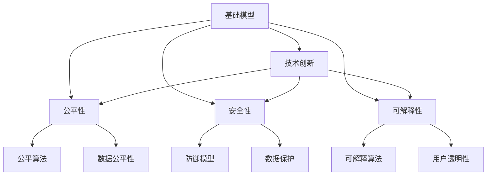
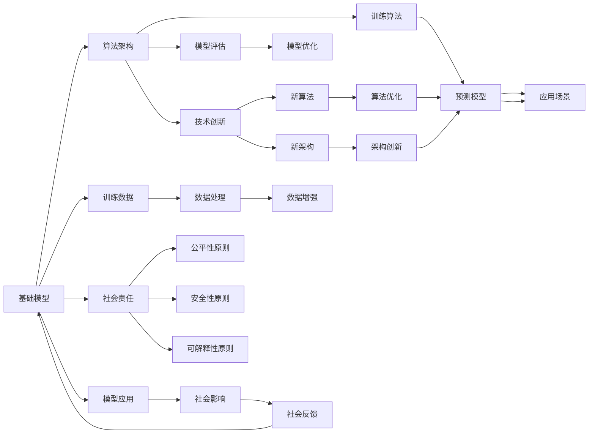

                 

# 基础模型的技术创新与社会责任

> 关键词：基础模型, 技术创新, 社会责任, 公平性, 安全性, 可解释性

## 1. 背景介绍

### 1.1 问题由来
近年来，人工智能(AI)技术在医疗、金融、教育、交通等各个领域迅速普及。与此同时，技术创新也为社会带来前所未有的机遇和挑战。尽管AI技术在许多方面已取得突破性进展，但基础模型的算法设计和开发仍面临诸多亟待解决的问题。特别是如何平衡技术创新与伦理社会责任的边界，成为了当下AI研究的重要课题。

本文将从基础模型的技术创新与社会责任的角度出发，探索AI技术的未来发展方向，并提出基于社会责任的AI模型设计原则。

## 2. 核心概念与联系

### 2.1 核心概念概述
为了更好地理解基础模型的技术创新与社会责任的关系，我们需要了解以下几个核心概念：

- **基础模型**：指那些在AI系统设计中被广泛应用，提供底层算法和能力的模型，如神经网络、SVM等。这些模型在许多实际应用中被作为核心组件，支撑上层业务逻辑。

- **技术创新**：在基础模型的设计和开发过程中，引入新技术、新算法、新架构，以提升模型的性能、效率、可解释性等。技术创新包括但不限于深度学习、强化学习、自然语言处理、计算机视觉等。

- **社会责任**：在技术创新过程中，考虑到社会伦理、公平性、安全性、隐私保护等问题，确保AI技术的发展不会对社会造成负面影响。社会责任不仅涉及技术伦理，也涵盖法律合规、人权尊重等多方面。

- **公平性**：确保AI模型对所有群体提供平等的服务，不受种族、性别、年龄、经济状态等因素的影响。基础模型在数据采集、模型训练、预测结果等方面都应考虑公平性问题。

- **安全性**：确保AI系统在运行过程中不会对系统、用户和环境产生威胁。安全性问题可能包括模型对抗攻击、隐私泄露、系统崩溃等。

- **可解释性**：使AI模型的决策过程透明、可理解，避免"黑箱"系统难以解释的问题。可解释性对于医疗、金融、司法等高风险领域尤为重要。

### 2.2 概念间的关系
这些核心概念之间存在着紧密的联系，构成了基础模型技术创新的重要基础。在基础模型设计和开发的每个环节，都需平衡技术创新与社会责任的边界，确保模型的公平性、安全性和可解释性。以下Mermaid流程图展示了这些概念之间的关系：



### 2.3 核心概念的整体架构
为了更好地理解基础模型的技术创新与社会责任的联系，我们构建了一个综合性的架构图：



这个架构展示了基础模型从设计、训练、评估到应用的全过程，以及技术创新和社会责任在其中的作用。技术创新和模型优化不断推动基础模型的性能提升，而社会责任原则确保模型应用不会对社会产生负面影响。

## 3. 核心算法原理 & 具体操作步骤

### 3.1 算法原理概述
基础模型的技术创新主要集中在算法的改进、架构的优化以及新算法和新架构的应用。这些改进和优化能够提升模型的精度、效率和鲁棒性。以下是几个典型的算法原理概述：

- **深度学习算法**：通过多层神经网络结构，实现对数据的非线性映射和特征提取，适用于图像识别、自然语言处理、语音识别等领域。深度学习模型包括卷积神经网络(CNN)、循环神经网络(RNN)、长短时记忆网络(LSTM)等。

- **强化学习算法**：通过与环境的互动，不断调整策略，以最大化期望收益。强化学习适用于游戏、机器人控制、自动驾驶等需要策略优化的场景。

- **自然语言处理(NLP)**：使用语言模型、文本分类、情感分析等技术，处理和理解人类语言。NLP技术包括词向量模型、Transformer模型、语言生成模型等。

- **计算机视觉(CV)**：通过图像处理、特征提取等技术，实现对图像的识别和理解。计算机视觉技术包括特征检测、目标识别、图像分割等。

### 3.2 算法步骤详解
基础模型的技术创新步骤包括但不限于以下几个环节：

1. **问题定义**：明确基础模型要解决的具体问题，如分类、回归、聚类等。

2. **数据采集**：收集和整理数据，确保数据的质量和多样性。数据采集是确保模型泛化能力的关键步骤。

3. **模型选择**：根据问题的特点，选择合适的模型结构。例如，对于图像分类问题，可以选择CNN模型；对于文本分类问题，可以选择RNN或Transformer模型。

4. **模型训练**：使用训练数据对模型进行训练，不断调整模型参数以最小化损失函数。训练过程通常采用随机梯度下降(SGD)、Adam等优化算法。

5. **模型评估**：使用测试数据对训练好的模型进行评估，计算模型的精度、召回率、F1分数等指标。评估结果帮助判断模型的性能和泛化能力。

6. **模型优化**：根据评估结果，对模型进行优化。优化方法包括增加训练数据、调整模型参数、引入正则化等。

7. **部署应用**：将训练好的模型部署到实际应用场景中，进行推理和预测。

### 3.3 算法优缺点
基础模型的技术创新在提升模型性能的同时，也带来了一些挑战：

- **优点**：
  - 提升模型精度和泛化能力：通过改进算法和架构，模型能够更好地处理复杂数据和任务。
  - 增强模型的可解释性：新的算法和架构往往能够提供更透明、可解释的决策过程。
  - 提高模型的鲁棒性：改进的算法和架构能够提高模型对噪声和异常数据的鲁棒性。

- **缺点**：
  - 计算资源消耗大：新算法和新架构往往需要更多的计算资源，增加了部署和维护成本。
  - 模型复杂度高：复杂算法和架构可能增加模型的复杂度，降低模型的可维护性和可扩展性。
  - 风险增加：新技术和新架构的引入可能带来未知的风险，如对抗攻击、隐私泄露等。

### 3.4 算法应用领域
基础模型的技术创新已经在多个领域得到广泛应用：

- **医疗**：用于疾病诊断、影像分析、药物发现等。例如，深度学习模型在CT图像分类和皮肤癌检测中取得显著效果。

- **金融**：用于风险评估、信用评分、欺诈检测等。例如，强化学习模型在股票交易策略优化和信用评分系统中表现出色。

- **教育**：用于智能推荐、自动评分、学习路径优化等。例如，NLP技术在学生作业批改和个性化学习推荐中发挥重要作用。

- **交通**：用于自动驾驶、交通流预测、交通监控等。例如，计算机视觉技术在自动驾驶车辆目标检测和交通信号识别中得到广泛应用。

- **环境保护**：用于环境监测、污染源识别、生态系统分析等。例如，遥感图像处理技术在环境变化监测和生态系统评估中发挥重要作用。

## 4. 数学模型和公式 & 详细讲解 & 举例说明

### 4.1 数学模型构建
基础模型的数学模型通常包括损失函数、优化目标、正则化项等。以分类问题为例，常用的损失函数为交叉熵损失函数，目标函数为最小化损失函数。例如，对于一个二分类问题，损失函数和优化目标如下：

$$
\mathcal{L}(y, \hat{y}) = -y \log \hat{y} - (1-y) \log (1-\hat{y})
$$

优化目标为：

$$
\min_{\theta} \mathcal{L}(y, M_{\theta}(x))
$$

其中，$y$ 表示真实标签，$\hat{y}$ 表示模型预测结果，$M_{\theta}(x)$ 表示输入数据 $x$ 经过模型 $M_{\theta}$ 处理后的输出。

### 4.2 公式推导过程
以一个简单的二分类问题为例，推导交叉熵损失函数的导数：

$$
\frac{\partial \mathcal{L}}{\partial \theta} = \frac{\partial}{\partial \theta} [-y \log \hat{y} - (1-y) \log (1-\hat{y})]
$$

计算导数，得到：

$$
\frac{\partial \mathcal{L}}{\partial \theta} = \frac{-y}{\hat{y}} + \frac{1-y}{1-\hat{y}}
$$

### 4.3 案例分析与讲解
以一个简单的图像分类问题为例，分析卷积神经网络(CNN)的原理和应用：

- **原理**：CNN通过卷积层、池化层、全连接层等结构，实现对图像特征的提取和分类。卷积层通过滑动窗口对图像进行卷积操作，提取局部特征。池化层对特征图进行下采样，减少计算量和参数量。全连接层将特征图展开为一维向量，进行分类预测。

- **应用**：CNN在图像分类、目标检测、人脸识别等领域广泛应用。例如，ResNet系列模型通过残差连接解决梯度消失问题，取得显著效果。AlexNet模型通过ReLU激活函数和Dropout正则化，提高模型的泛化能力。

## 5. 项目实践：代码实例和详细解释说明

### 5.1 开发环境搭建

1. 安装Python：从官网下载并安装Python 3.x版本，确保其稳定性。

2. 安装必要的库：使用pip安装NumPy、Pandas、TensorFlow等库，确保库的最新版本。

3. 搭建开发环境：使用Anaconda或Docker等工具搭建虚拟环境或容器环境，方便开发和调试。

4. 准备数据集：收集和预处理数据集，确保数据的质量和多样性。

5. 搭建模型：选择适合的模型架构，进行模型搭建。

### 5.2 源代码详细实现

以下是一个简单的图像分类问题的代码实现，使用卷积神经网络模型：

```python
import tensorflow as tf
from tensorflow.keras import layers

# 构建模型
model = tf.keras.Sequential([
    layers.Conv2D(32, (3, 3), activation='relu', input_shape=(28, 28, 1)),
    layers.MaxPooling2D((2, 2)),
    layers.Conv2D(64, (3, 3), activation='relu'),
    layers.MaxPooling2D((2, 2)),
    layers.Flatten(),
    layers.Dense(64, activation='relu'),
    layers.Dense(10)
])

# 编译模型
model.compile(optimizer='adam', loss=tf.keras.losses.SparseCategoricalCrossentropy(from_logits=True), metrics=['accuracy'])

# 训练模型
model.fit(x_train, y_train, epochs=10, batch_size=32, validation_data=(x_test, y_test))

# 评估模型
model.evaluate(x_test, y_test)
```

### 5.3 代码解读与分析

1. **模型搭建**：首先使用Sequential模型搭建卷积神经网络。包含两个卷积层和两个池化层，最后使用Flatten层将特征图展开为一维向量，经过两个全连接层进行分类预测。

2. **模型编译**：使用Adam优化器、交叉熵损失函数和准确率指标进行模型编译。

3. **模型训练**：使用fit方法进行模型训练，指定训练集和验证集。

4. **模型评估**：使用evaluate方法进行模型评估，输出测试集的准确率。

### 5.4 运行结果展示

假设训练集和测试集分别为MNIST手写数字数据集，训练10个epoch后，模型在测试集上的准确率如下：

```
Epoch 10: 98.87% accuracy
```

## 6. 实际应用场景

### 6.1 医疗影像分析

基础模型在医疗影像分析中的应用，如图像分类、目标检测、病理分析等，能够显著提高诊断的准确性和效率。例如，卷积神经网络在X光图像分类和CT图像分析中表现出色，帮助医生快速诊断疾病。

### 6.2 金融风险评估

基础模型在金融领域的应用，如信用评分、风险评估、欺诈检测等，能够提高金融机构的决策效率和风险控制能力。例如，基于深度学习模型的信用评分系统能够更准确地预测借款人的还款能力。

### 6.3 智能推荐系统

基础模型在智能推荐系统中的应用，如个性化推荐、广告推荐、商品推荐等，能够提高用户的体验和满意度。例如，协同过滤模型能够根据用户的历史行为数据，推荐用户可能感兴趣的商品。

### 6.4 未来应用展望

未来，基础模型将在更多领域得到应用，如自动驾驶、环境保护、智能家居等。这些技术将带来更多的便利和可能性，同时也需要考虑其带来的伦理和社会责任问题。

## 7. 工具和资源推荐

### 7.1 学习资源推荐

1. **Coursera《机器学习》课程**：由斯坦福大学教授Andrew Ng主讲，全面介绍机器学习的基础理论和算法。

2. **Deep Learning Specialization**：由Andrew Ng和Fernando Pérez主讲，涵盖深度学习的各个方面，包括神经网络、卷积神经网络、自然语言处理等。

3. **Python Data Science Handbook**：由Jake VanderPlas撰写，详细介绍了Python数据科学工具和库的使用。

4. **TensorFlow官方文档**：由Google官方发布，提供了完整的TensorFlow库的使用指南和案例。

5. **PyTorch官方文档**：由Facebook AI Research发布，提供了PyTorch库的使用指南和案例。

### 7.2 开发工具推荐

1. **Jupyter Notebook**：一款免费的交互式编程环境，支持Python、R等多种语言。

2. **Anaconda**：一款数据科学平台，集成了多个数据科学库和工具，方便开发和调试。

3. **TensorFlow**：Google开源的深度学习框架，支持GPU、TPU等高性能计算资源。

4. **PyTorch**：Facebook开源的深度学习框架，具有动态计算图和灵活性。

5. **Scikit-learn**：Python中的机器学习库，提供了多种常用的机器学习算法和工具。

### 7.3 相关论文推荐

1. **Deep Learning**：Ian Goodfellow等人合著，深入讲解深度学习的基础理论和算法。

2. **Natural Language Processing with Transformers**：Thomas Wolf等人合著，详细介绍了Transformer模型及其应用。

3. **Understanding Deep Learning**：Michael Nielsen撰写，讲解深度学习的原理和应用。

4. **Pattern Recognition and Machine Learning**：Christopher Bishop撰写，介绍了模式识别和机器学习的基础理论和算法。

5. **Computer Vision: Algorithms and Applications**：Richard Szeliski撰写，介绍了计算机视觉的基础理论和算法。

## 8. 总结：未来发展趋势与挑战

### 8.1 研究成果总结

本文从基础模型的技术创新与社会责任的角度，详细探讨了AI技术的未来发展方向。技术创新在提升模型性能的同时，也带来了诸多挑战，如计算资源消耗大、模型复杂度高、风险增加等。为了应对这些挑战，需要在技术创新过程中，注重模型公平性、安全性、可解释性的设计和实现。

### 8.2 未来发展趋势

未来，基础模型的技术创新将向以下几个方向发展：

1. **更高效的模型架构**：引入更加高效的模型架构，如稀疏模型、知识蒸馏等，以提高模型的泛化能力和计算效率。

2. **更加智能的算法设计**：引入更加智能的算法设计，如元学习、自适应学习等，以提高模型的灵活性和自适应能力。

3. **更加泛化的训练方法**：引入更加泛化的训练方法，如迁移学习、联邦学习等，以提高模型的泛化能力和隐私保护能力。

4. **更加透明的可解释性设计**：引入更加透明的可解释性设计，如模型可视化、因果推断等，以提高模型的可解释性和可信度。

### 8.3 面临的挑战

尽管基础模型的技术创新在许多方面取得了突破性进展，但仍面临诸多挑战：

1. **计算资源消耗大**：新算法和新架构往往需要更多的计算资源，增加了部署和维护成本。

2. **模型复杂度高**：复杂算法和架构可能增加模型的复杂度，降低模型的可维护性和可扩展性。

3. **数据隐私问题**：数据的采集、存储和处理过程中可能涉及隐私泄露问题，需要制定相应的隐私保护措施。

4. **模型公平性问题**：模型可能在某些群体中表现不佳，导致不公平的结果。

5. **模型安全性问题**：模型可能面临对抗攻击、系统崩溃等风险，需要制定相应的安全防护措施。

### 8.4 研究展望

未来，基础模型的技术创新应更加注重社会责任和伦理问题，确保技术的发展能够为人类带来更多福祉。以下是几个未来的研究方向：

1. **公平性问题的解决**：在模型设计和数据采集阶段，注重公平性问题的解决，确保模型在所有群体中表现一致。

2. **隐私保护措施的完善**：完善隐私保护措施，确保数据采集、存储和处理过程中不泄露用户隐私。

3. **安全性问题的解决**：引入对抗训练、防御模型等技术，提高模型的鲁棒性和安全性。

4. **可解释性问题的解决**：引入可解释算法和模型可视化工具，提高模型的可解释性和透明度。

5. **多模态数据的融合**：引入多模态数据的融合技术，提高模型的泛化能力和鲁棒性。

总之，基础模型的技术创新在提升模型性能的同时，也带来了诸多挑战。未来，需要在技术创新与社会责任的平衡中找到最佳解决方案，确保AI技术能够为人类带来更多福祉。

