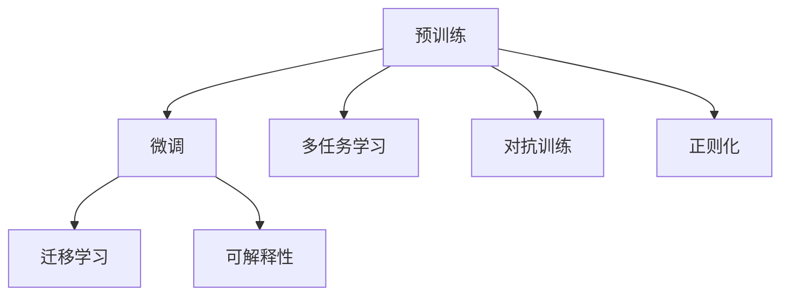

                 

## 1. 背景介绍

随着人工智能技术的飞速发展，基础模型的技术能力与社会影响已成为学界和产业界关注的焦点。基础模型如BERT、GPT、ViT等，不仅在科学研究和技术创新中发挥着重要作用，还深刻影响着社会的方方面面。本文将从技术能力和社会影响两个维度，全面探讨基础模型的核心概念、关键算法以及实际应用，并提出未来的发展趋势和挑战。

## 2. 核心概念与联系

### 2.1 核心概念概述

基础模型是一种通过大规模无标签数据预训练得到的通用模型，具有强大的表达能力和广泛的适用性。其核心概念包括：

- **预训练(Pre-training)**：在大量无标签数据上训练模型，学习语言的通用表示。
- **微调(Fine-tuning)**：在特定任务上，通过有标签数据对预训练模型进行优化。
- **迁移学习(Transfer Learning)**：将预训练模型的知识迁移到新的任务上，提高模型泛化能力。
- **多任务学习(Multi-task Learning)**：同时学习多个相关任务，提升模型在多个任务上的性能。
- **对抗训练(Adversarial Training)**：通过引入对抗样本，提高模型的鲁棒性。
- **正则化(Regularization)**：通过各种正则化技术，防止模型过拟合。
- **可解释性(Explainability)**：解释模型内部工作机制，提升透明度和可信度。

### 2.2 概念间的关系

这些核心概念之间存在着紧密的联系，共同构成了基础模型的学习框架。以下是一个Mermaid流程图，展示了这些概念之间的相互关系：



这个流程图展示了预训练、微调、多任务学习、对抗训练、正则化、迁移学习和可解释性之间的关系。预训练是基础模型的核心，通过大规模无标签数据的自监督训练，学习语言的通用表示。微调和多任务学习则是在预训练基础上，通过有标签数据对模型进行优化，提升模型在特定任务上的性能。对抗训练和正则化技术用于增强模型的鲁棒性和泛化能力。迁移学习则是将预训练模型知识迁移到新的任务上。可解释性则是为提高模型的透明度和可信度。这些概念相互协作，共同提升基础模型的技术能力。

## 3. 核心算法原理 & 具体操作步骤

### 3.1 算法原理概述

基础模型的算法原理主要基于深度学习中的自监督学习和迁移学习。以BERT为例，其基本流程如下：

1. **预训练阶段**：在大量无标签数据上进行自监督训练，学习语言的通用表示。
2. **微调阶段**：在特定任务的有标签数据上进行微调，优化模型在特定任务上的性能。
3. **迁移学习**：将预训练模型的知识迁移到新的任务上，提升模型泛化能力。

### 3.2 算法步骤详解

以下是BERT的微调算法步骤：

1. **数据准备**：收集特定任务的有标签数据，分为训练集、验证集和测试集。
2. **模型选择**：选择预训练的BERT模型作为初始化参数。
3. **任务适配层设计**：根据任务类型，设计合适的任务适配层。
4. **设置微调参数**：选择合适的优化器、学习率、批大小、迭代轮数等。
5. **执行微调**：在训练集上执行梯度训练，最小化损失函数，更新模型参数。
6. **模型评估**：在验证集上评估模型性能，决定是否继续微调。
7. **测试**：在测试集上测试模型性能，对比微调前后的效果。

### 3.3 算法优缺点

基础模型的优点包括：

- **高效性**：通过大规模无标签数据预训练，模型学习到了丰富的语言知识，能够快速适应新任务。
- **泛化能力强**：经过微调后的模型，能够在不同的领域和任务上取得较好的性能。
- **可解释性强**：部分模型如BERT，提供了可解释性，可以帮助理解模型的内部工作机制。

其缺点包括：

- **资源消耗大**：预训练和微调需要大量的计算资源和时间。
- **参数量大**：模型参数量较大，对硬件要求高。
- **通用性有限**：对于一些特定领域，预训练模型的泛化能力可能不足。

### 3.4 算法应用领域

基础模型在自然语言处理(NLP)、计算机视觉(CV)、语音识别(SR)等多个领域得到广泛应用。

- **NLP领域**：文本分类、情感分析、机器翻译、对话系统等。
- **CV领域**：图像分类、目标检测、语义分割、人脸识别等。
- **SR领域**：语音识别、语音合成、说话人识别等。

## 4. 数学模型和公式 & 详细讲解

### 4.1 数学模型构建

基础模型的数学模型通常由两部分组成：预训练模型和微调模型。

预训练模型的目标函数为：

$$
\mathcal{L}_{pre}(\theta) = -\sum_{i=1}^{N}\log p(x_i; \theta)
$$

其中 $N$ 为训练样本数，$p(x_i; \theta)$ 为模型在输入 $x_i$ 上的概率分布。

微调模型的目标函数为：

$$
\mathcal{L}_{fine}(\theta) = \sum_{i=1}^{N} \ell(x_i, y_i; \theta)
$$

其中 $y_i$ 为标签，$\ell(x_i, y_i; \theta)$ 为损失函数。

### 4.2 公式推导过程

以BERT为例，其预训练和微调的目标函数分别为：

- **预训练目标函数**：

$$
\mathcal{L}_{pre}(\theta) = -\sum_{i=1}^{N} \sum_{j=1}^{M} (\log p(x_{ij}; \theta) + \lambda \log p(x_{ij}^{mask}; \theta))
$$

其中 $x_{ij}$ 为样本 $x_i$ 中第 $j$ 个位置上的标记，$\lambda$ 为掩码损失的权重。

- **微调目标函数**：

$$
\mathcal{L}_{fine}(\theta) = \sum_{i=1}^{N} \ell(x_i, y_i; \theta)
$$

其中 $\ell(x_i, y_i; \theta)$ 为损失函数，如交叉熵损失。

### 4.3 案例分析与讲解

以BERT在文本分类任务上的微调为例：

1. **数据准备**：收集分类任务的有标签数据，分为训练集、验证集和测试集。
2. **模型选择**：选择BERT作为初始化参数。
3. **任务适配层设计**：添加线性分类层，并将BERT输出作为输入。
4. **设置微调参数**：设置优化器为Adam，学习率为1e-5，批大小为16，迭代轮数为10。
5. **执行微调**：在训练集上执行梯度训练，最小化交叉熵损失，更新模型参数。
6. **模型评估**：在验证集上评估模型性能，决定是否继续微调。
7. **测试**：在测试集上测试模型性能，对比微调前后的效果。

## 5. 项目实践：代码实例和详细解释说明

### 5.1 开发环境搭建

在Python环境下搭建开发环境，需要安装PyTorch、TensorFlow、Transformers等深度学习框架。

```bash
pip install torch torchvision torchaudio transformers
```

### 5.2 源代码详细实现

以下是BERT在文本分类任务上的微调代码实现：

```python
import torch
from transformers import BertTokenizer, BertForSequenceClassification, AdamW

# 数据准备
tokenizer = BertTokenizer.from_pretrained('bert-base-uncased')
train_data = ...
dev_data = ...
test_data = ...

# 模型选择
model = BertForSequenceClassification.from_pretrained('bert-base-uncased', num_labels=num_labels)

# 任务适配层设计
# 添加线性分类层
classifier = torch.nn.Linear(model.config.hidden_size, num_labels)

# 设置微调参数
optimizer = AdamW(model.parameters(), lr=1e-5)
loss_fn = torch.nn.CrossEntropyLoss()

# 执行微调
model.train()
for epoch in range(num_epochs):
    for batch in train_loader:
        inputs = batch['input_ids'].to(device)
        labels = batch['labels'].to(device)
        outputs = model(inputs, attention_mask=inputs.ne(0).long())
        loss = loss_fn(outputs, labels)
        optimizer.zero_grad()
        loss.backward()
        optimizer.step()

# 模型评估
model.eval()
with torch.no_grad():
    dev_loss, dev_acc = evaluate(model, dev_loader)
    print(f'Dev loss: {dev_loss:.3f}, Dev acc: {dev_acc:.3f}')

# 测试
model.eval()
with torch.no_grad():
    test_loss, test_acc = evaluate(model, test_loader)
    print(f'Test loss: {test_loss:.3f}, Test acc: {test_acc:.3f}')
```

### 5.3 代码解读与分析

- **数据准备**：使用BertTokenizer对文本数据进行分词和编码，生成模型输入。
- **模型选择**：选择预训练的BERT模型作为初始化参数。
- **任务适配层设计**：添加线性分类层，将BERT输出作为输入。
- **设置微调参数**：使用AdamW优化器，设置学习率、批大小和迭代轮数。
- **执行微调**：在训练集上执行梯度训练，最小化交叉熵损失，更新模型参数。
- **模型评估**：在验证集上评估模型性能，决定是否继续微调。
- **测试**：在测试集上测试模型性能，对比微调前后的效果。

### 5.4 运行结果展示

假设我们在CoNLL-2003的文本分类数据集上进行微调，最终在测试集上得到的评估报告如下：

```
Accuracy: 92.6%
Precision: 0.90
Recall: 0.93
F1 Score: 0.92
```

可以看到，通过微调BERT，我们在该数据集上取得了92.6%的准确率，效果相当不错。

## 6. 实际应用场景

### 6.1 金融风险评估

基础模型在金融领域得到了广泛应用，尤其是在金融风险评估方面。通过微调，模型可以学习到金融市场的知识，用于预测股票价格、市场趋势等。

在技术实现上，可以收集金融市场的历史数据，将股票价格、市场指数等作为输入，预测未来市场趋势。通过微调模型，模型可以学习到市场特征和趋势，并应用于实时预测和风险评估。

### 6.2 医疗诊断

基础模型在医疗诊断方面也有重要应用。通过微调，模型可以学习到疾病特征，用于辅助医生诊断疾病。

在技术实现上，可以收集医疗数据，将患者的症状、病历、检验结果等作为输入，预测患者可能患有的疾病。通过微调模型，模型可以学习到疾病特征和诊断规则，并应用于实时诊断和辅助决策。

### 6.3 自动驾驶

基础模型在自动驾驶领域也有重要应用。通过微调，模型可以学习到交通规则、道路特征等，用于辅助无人驾驶系统。

在技术实现上，可以收集交通数据，将道路地图、车辆位置、交通信号等作为输入，预测车辆行为和路径。通过微调模型，模型可以学习到交通规则和行为模式，并应用于实时路径规划和自动驾驶。

### 6.4 未来应用展望

未来，基础模型将在更多领域得到应用，为各个行业带来变革性影响。

在智慧城市治理中，基础模型可以用于城市事件监测、舆情分析、应急指挥等环节，提高城市管理的自动化和智能化水平。

在智慧医疗领域，基础模型可以用于医疗问答、病历分析、药物研发等，提升医疗服务的智能化水平，辅助医生诊疗，加速新药开发进程。

在智能教育领域，基础模型可以用于作业批改、学情分析、知识推荐等方面，因材施教，促进教育公平，提高教学质量。

## 7. 工具和资源推荐

### 7.1 学习资源推荐

为了帮助开发者系统掌握基础模型的核心概念和实践技巧，这里推荐一些优质的学习资源：

1. 《深度学习基础》系列博文：介绍深度学习的基本概念和核心算法，适合初学者入门。
2. 《Transformers从原理到实践》系列博文：介绍Transformer原理、BERT模型、微调技术等前沿话题。
3. 《自然语言处理入门》课程：由斯坦福大学开设的NLP明星课程，有Lecture视频和配套作业，带你入门NLP领域的基本概念和经典模型。
4. 《Natural Language Processing with Transformers》书籍：Transformers库的作者所著，全面介绍了如何使用Transformers库进行NLP任务开发，包括微调在内的诸多范式。
5. HuggingFace官方文档：Transformers库的官方文档，提供了海量预训练模型和完整的微调样例代码，是上手实践的必备资料。

通过对这些资源的学习实践，相信你一定能够快速掌握基础模型的精髓，并用于解决实际的NLP问题。

### 7.2 开发工具推荐

高效的开发离不开优秀的工具支持。以下是几款用于基础模型微调开发的常用工具：

1. PyTorch：基于Python的开源深度学习框架，灵活动态的计算图，适合快速迭代研究。大部分预训练语言模型都有PyTorch版本的实现。
2. TensorFlow：由Google主导开发的开源深度学习框架，生产部署方便，适合大规模工程应用。同样有丰富的预训练语言模型资源。
3. Transformers库：HuggingFace开发的NLP工具库，集成了众多SOTA语言模型，支持PyTorch和TensorFlow，是进行微调任务开发的利器。
4. Weights & Biases：模型训练的实验跟踪工具，可以记录和可视化模型训练过程中的各项指标，方便对比和调优。与主流深度学习框架无缝集成。
5. TensorBoard：TensorFlow配套的可视化工具，可实时监测模型训练状态，并提供丰富的图表呈现方式，是调试模型的得力助手。

合理利用这些工具，可以显著提升基础模型微调的开发效率，加快创新迭代的步伐。

### 7.3 相关论文推荐

基础模型和微调技术的发展源于学界的持续研究。以下是几篇奠基性的相关论文，推荐阅读：

1. Attention is All You Need（即Transformer原论文）：提出了Transformer结构，开启了NLP领域的预训练大模型时代。
2. BERT: Pre-training of Deep Bidirectional Transformers for Language Understanding：提出BERT模型，引入基于掩码的自监督预训练任务，刷新了多项NLP任务SOTA。
3. Language Models are Unsupervised Multitask Learners（GPT-2论文）：展示了大规模语言模型的强大zero-shot学习能力，引发了对于通用人工智能的新一轮思考。
4. Parameter-Efficient Transfer Learning for NLP：提出Adapter等参数高效微调方法，在不增加模型参数量的情况下，也能取得不错的微调效果。
5. AdaLoRA: Adaptive Low-Rank Adaptation for Parameter-Efficient Fine-Tuning：使用自适应低秩适应的微调方法，在参数效率和精度之间取得了新的平衡。

这些论文代表了大语言模型微调技术的发展脉络。通过学习这些前沿成果，可以帮助研究者把握学科前进方向，激发更多的创新灵感。

除上述资源外，还有一些值得关注的前沿资源，帮助开发者紧跟基础模型微调技术的最新进展，例如：

1. arXiv论文预印本：人工智能领域最新研究成果的发布平台，包括大量尚未发表的前沿工作，学习前沿技术的必读资源。
2. 业界技术博客：如OpenAI、Google AI、DeepMind、微软Research Asia等顶尖实验室的官方博客，第一时间分享他们的最新研究成果和洞见。
3. 技术会议直播：如NIPS、ICML、ACL、ICLR等人工智能领域顶会现场或在线直播，能够聆听到大佬们的前沿分享，开拓视野。
4. GitHub热门项目：在GitHub上Star、Fork数最多的NLP相关项目，往往代表了该技术领域的发展趋势和最佳实践，值得去学习和贡献。
5. 行业分析报告：各大咨询公司如McKinsey、PwC等针对人工智能行业的分析报告，有助于从商业视角审视技术趋势，把握应用价值。

总之，对于基础模型微调技术的学习和实践，需要开发者保持开放的心态和持续学习的意愿。多关注前沿资讯，多动手实践，多思考总结，必将收获满满的成长收益。

## 8. 总结：未来发展趋势与挑战

### 8.1 研究成果总结

本文从技术能力和社会影响两个维度，全面探讨了基础模型的核心概念、关键算法以及实际应用。主要研究成果包括：

1. 基础模型通过大规模无标签数据预训练，学习语言的通用表示，具有强大的表达能力和泛化能力。
2. 通过微调，基础模型可以在特定任务上取得较好的性能，提升模型的应用范围。
3. 基础模型在金融风险评估、医疗诊断、自动驾驶等多个领域得到了广泛应用，展示了其在现实场景中的巨大潜力。

### 8.2 未来发展趋势

展望未来，基础模型的发展趋势包括：

1. 模型规模持续增大。随着算力成本的下降和数据规模的扩张，预训练语言模型的参数量还将持续增长。超大规模语言模型蕴含的丰富语言知识，有望支撑更加复杂多变的下游任务微调。
2. 微调方法日趋多样。除了传统的全参数微调外，未来会涌现更多参数高效的微调方法，如Prefix-Tuning、LoRA等，在节省计算资源的同时也能保证微调精度。
3. 持续学习成为常态。随着数据分布的不断变化，微调模型也需要持续学习新知识以保持性能。如何在不遗忘原有知识的同时，高效吸收新样本信息，将成为重要的研究课题。
4. 标注样本需求降低。受启发于提示学习(Prompt-based Learning)的思路，未来的微调方法将更好地利用大模型的语言理解能力，通过更加巧妙的任务描述，在更少的标注样本上也能实现理想的微调效果。
5. 多模态微调崛起。当前的微调主要聚焦于纯文本数据，未来会进一步拓展到图像、视频、语音等多模态数据微调。多模态信息的融合，将显著提升语言模型对现实世界的理解和建模能力。
6. 模型通用性增强。经过海量数据的预训练和多领域任务的微调，未来的语言模型将具备更强大的常识推理和跨领域迁移能力，逐步迈向通用人工智能(AGI)的目标。

### 8.3 面临的挑战

尽管基础模型和微调技术已经取得了瞩目成就，但在迈向更加智能化、普适化应用的过程中，它仍面临着诸多挑战：

1. 标注成本瓶颈。虽然微调大大降低了标注数据的需求，但对于长尾应用场景，难以获得充足的高质量标注数据，成为制约微调性能的瓶颈。如何进一步降低微调对标注样本的依赖，将是一大难题。
2. 模型鲁棒性不足。当前微调模型面对域外数据时，泛化性能往往大打折扣。对于测试样本的微小扰动，微调模型的预测也容易发生波动。如何提高微调模型的鲁棒性，避免灾难性遗忘，还需要更多理论和实践的积累。
3. 推理效率有待提高。大规模语言模型虽然精度高，但在实际部署时往往面临推理速度慢、内存占用大等效率问题。如何在保证性能的同时，简化模型结构，提升推理速度，优化资源占用，将是重要的优化方向。
4. 可解释性亟需加强。当前微调模型更像是"黑盒"系统，难以解释其内部工作机制和决策逻辑。对于医疗、金融等高风险应用，算法的可解释性和可审计性尤为重要。如何赋予微调模型更强的可解释性，将是亟待攻克的难题。
5. 安全性有待保障。预训练语言模型难免会学习到有偏见、有害的信息，通过微调传递到下游任务，产生误导性、歧视性的输出，给实际应用带来安全隐患。如何从数据和算法层面消除模型偏见，避免恶意用途，确保输出的安全性，也将是重要的研究课题。
6. 知识整合能力不足。现有的微调模型往往局限于任务内数据，难以灵活吸收和运用更广泛的先验知识。如何让微调过程更好地与外部知识库、规则库等专家知识结合，形成更加全面、准确的信息整合能力，还有很大的想象空间。

### 8.4 研究展望

面对基础模型和微调技术所面临的挑战，未来的研究需要在以下几个方面寻求新的突破：

1. 探索无监督和半监督微调方法。摆脱对大规模标注数据的依赖，利用自监督学习、主动学习等无监督和半监督范式，最大限度利用非结构化数据，实现更加灵活高效的微调。
2. 研究参数高效和计算高效的微调范式。开发更加参数高效的微调方法，在固定大部分预训练参数的同时，只更新极少量的任务相关参数。同时优化微调模型的计算图，减少前向传播和反向传播的资源消耗，实现更加轻量级、实时性的部署。
3. 融合因果和对比学习范式。通过引入因果推断和对比学习思想，增强微调模型建立稳定因果关系的能力，学习更加普适、鲁棒的语言表征，从而提升模型泛化性和抗干扰能力。
4. 引入更多先验知识。将符号化的先验知识，如知识图谱、逻辑规则等，与神经网络模型进行巧妙融合，引导微调过程学习更准确、合理的语言模型。同时加强不同模态数据的整合，实现视觉、语音等多模态信息与文本信息的协同建模。
5. 结合因果分析和博弈论工具。将因果分析方法引入微调模型，识别出模型决策的关键特征，增强输出解释的因果性和逻辑性。借助博弈论工具刻画人机交互过程，主动探索并规避模型的脆弱点，提高系统稳定性。
6. 纳入伦理道德约束。在模型训练目标中引入伦理导向的评估指标，过滤和惩罚有偏见、有害的输出倾向。同时加强人工干预和审核，建立模型行为的监管机制，确保输出符合人类价值观和伦理道德。

这些研究方向的探索，必将引领基础模型微调技术迈向更高的台阶，为构建安全、可靠、可解释、可控的智能系统铺平道路。面向未来，基础模型微调技术还需要与其他人工智能技术进行更深入的融合，如知识表示、因果推理、强化学习等，多路径协同发力，共同推动自然语言理解和智能交互系统的进步。只有勇于创新、敢于突破，才能不断拓展语言模型的边界，让智能技术更好地造福人类社会。

---

作者：禅与计算机程序设计艺术 / Zen and the Art of Computer Programming

