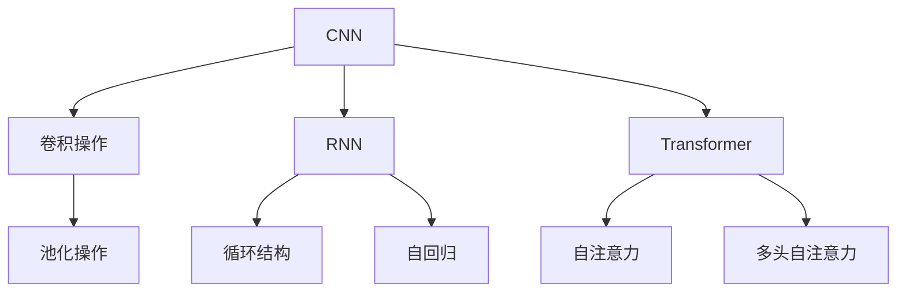
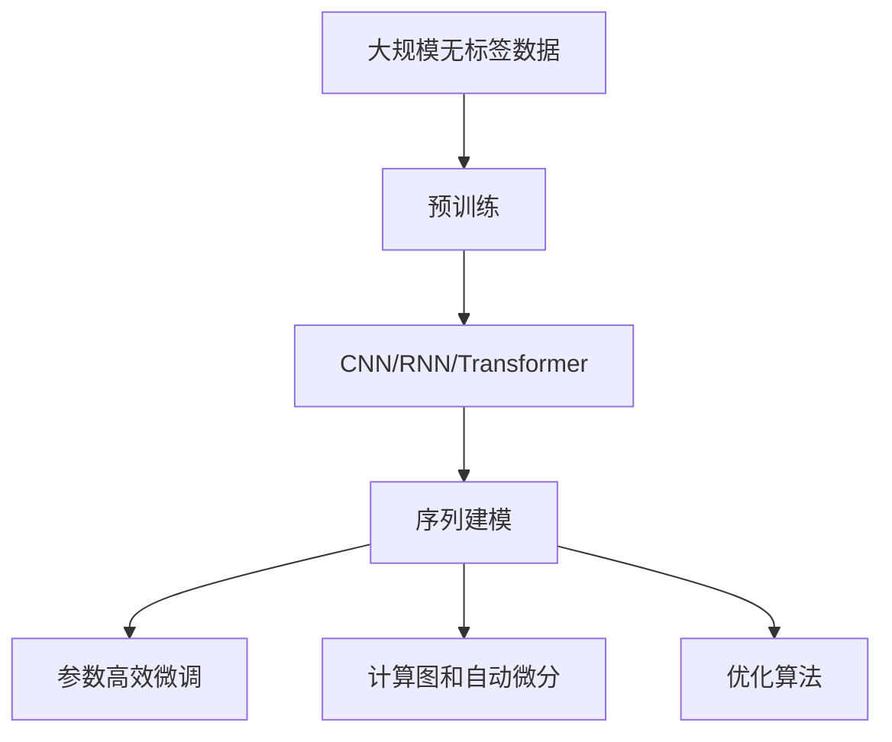

                 

# 基础模型的能力与技术原理

> 关键词：基础模型,技术原理,深度学习,卷积神经网络(CNN),循环神经网络(RNN),Transformer,预训练,迁移学习,参数高效微调,计算图,优化算法

## 1. 背景介绍

### 1.1 问题由来
近年来，深度学习技术在人工智能领域取得了飞速发展，涌现出各种具有出色表现的基础模型，如卷积神经网络（CNN）、循环神经网络（RNN）、Transformer等。这些基础模型被广泛应用于计算机视觉、自然语言处理（NLP）、语音识别、推荐系统等众多领域，极大地推动了人工智能技术的发展和应用。

然而，由于基础模型在设计理念、架构思想等方面的不同，其能力和适用场景也各异。因此，深入理解这些基础模型的原理和技术细节，对推动人工智能技术的持续创新和应用推广具有重要意义。本文将围绕基础模型的能力与技术原理，系统介绍其在深度学习中的关键技术和应用。

### 1.2 问题核心关键点
基础模型主要涉及深度学习中的三个关键领域：卷积神经网络（CNN）、循环神经网络（RNN）和Transformer。其中，CNN适用于图像和视频处理等任务，RNN适用于序列数据处理，如语音识别、自然语言处理等，Transformer则适用于各种序列建模任务，如机器翻译、文本生成等。

基础模型所依赖的核心技术包括：

- 卷积操作和池化操作：用于提取局部特征。
- 循环结构：用于处理序列数据。
- 自注意力机制：用于捕捉全局特征和长程依赖。
- 预训练和迁移学习：用于提升模型的泛化能力。
- 参数高效微调：用于优化模型的计算效率。
- 计算图和自动微分：用于高效求解模型参数。
- 优化算法：用于最小化模型损失函数。

通过这些核心技术，基础模型能够在不同领域中发挥出色的表现，并推动人工智能技术的广泛应用。

### 1.3 问题研究意义
基础模型的能力与技术原理是深度学习领域的基础性问题，深入理解这些模型能够帮助研究者和工程师：

1. 更好地设计模型架构，提升模型性能。
2. 更高效地处理和分析数据，提高计算效率。
3. 更灵活地应用模型于实际场景，推动技术落地。
4. 更深入地探索模型理论，推动学术研究。
5. 更全面地掌握模型优化方法，提升技术水平。

因此，本文将对基础模型的能力与技术原理进行深入探讨，为读者提供全面的技术指引。

## 2. 核心概念与联系

### 2.1 核心概念概述

为了更好地理解基础模型的原理和技术细节，本节将介绍几个关键概念及其相互关系。

- 卷积神经网络（Convolutional Neural Networks, CNNs）：一种用于处理图像、视频等二维数据的深度学习模型。通过卷积操作和池化操作提取局部特征，并利用多层卷积和全连接层进行特征融合和分类。
- 循环神经网络（Recurrent Neural Networks, RNNs）：一种用于处理序列数据的深度学习模型。通过循环结构，模型能够逐个处理序列中的元素，并利用时序信息进行推理和预测。
- Transformer：一种基于自注意力机制的深度学习模型。通过多头自注意力机制，模型能够捕捉全局特征和长程依赖，适用于各种序列建模任务。

这些核心概念之间的逻辑关系可以通过以下Mermaid流程图来展示：



这个流程图展示了CNN、RNN和Transformer的基本结构和技术原理：

1. CNN通过卷积操作和池化操作提取局部特征，并利用多层卷积和全连接层进行特征融合和分类。
2. RNN通过循环结构，能够逐个处理序列中的元素，并利用时序信息进行推理和预测。
3. Transformer利用自注意力机制，能够捕捉全局特征和长程依赖，适用于各种序列建模任务。

### 2.2 概念间的关系

这些核心概念之间存在着紧密的联系，形成了基础模型在深度学习中的基本架构。

- CNN和RNN都是序列建模的基础，通过局部特征提取和时序信息处理，为序列数据的深度学习提供了必要的工具。
- Transformer在CNN和RNN的基础上，引入了自注意力机制，能够更高效地处理长序列数据，适用于各种序列建模任务。
- 预训练和迁移学习是提升模型泛化能力的有效手段，通过在大规模无标签数据上进行预训练，利用迁移学习将预训练知识应用到下游任务中。
- 参数高效微调是优化模型计算效率的重要方法，通过只更新少量参数，减少计算资源的消耗。
- 计算图和自动微分是求解模型参数的有效工具，通过构建计算图和自动微分，可以高效地求解模型参数。
- 优化算法是优化模型损失函数的重要手段，通过优化算法，可以最小化模型损失函数，提升模型性能。

这些核心概念共同构成了基础模型在深度学习中的基本架构和技术手段，为其在各种应用场景中的广泛应用提供了重要支持。

### 2.3 核心概念的整体架构

最后，我们用一个综合的流程图来展示这些核心概念在大规模序列建模中的整体架构：



这个综合流程图展示了从预训练到序列建模，再到参数高效微调和优化算法的完整过程。大模型首先在大规模无标签数据上进行预训练，然后通过序列建模（如CNN、RNN或Transformer）进行特征提取和分类，接着利用参数高效微调和优化算法进行模型优化，最终得到适应下游任务的模型。

通过这些核心概念的介绍和关系展示，我们可以更清晰地理解基础模型在深度学习中的基本原理和技术手段，为后续深入讨论具体的模型细节和应用细节奠定基础。

## 3. 核心算法原理 & 具体操作步骤
### 3.1 算法原理概述

基础模型在深度学习中的核心算法原理主要包括卷积操作、池化操作、循环结构、自注意力机制、预训练和迁移学习、参数高效微调、计算图和自动微分、优化算法等。

- 卷积操作和池化操作：用于提取局部特征，适用于图像和视频处理等任务。
- 循环结构：用于处理序列数据，适用于语音识别、自然语言处理等任务。
- 自注意力机制：用于捕捉全局特征和长程依赖，适用于各种序列建模任务。
- 预训练和迁移学习：用于提升模型的泛化能力，适用于各类任务。
- 参数高效微调：用于优化模型的计算效率，适用于大模型。
- 计算图和自动微分：用于高效求解模型参数，适用于复杂模型。
- 优化算法：用于最小化模型损失函数，适用于所有模型。

### 3.2 算法步骤详解

下面将详细介绍基础模型的核心算法步骤。

#### 3.2.1 卷积操作和池化操作

卷积操作和池化操作是CNN的核心组成部分，用于提取局部特征。其步骤如下：

1. **卷积操作**：通过滑动卷积核（即滤波器）在输入数据上逐个位置进行卷积运算，得到局部特征图。
2. **池化操作**：对特征图进行下采样，减少特征图的大小，从而提取更重要的特征。

卷积操作和池化操作的数学表达式如下：

- 卷积操作：$$f(x, k, p, s) = \sum_{i=0}^{h-1} \sum_{j=0}^{w-1} k_{i,j} * x_{i+p, j+p}$$
- 池化操作：$$p(x, s) = \frac{1}{\frac{h}{s}} \sum_{i=0}^{\frac{h}{s}-1} x_{i \cdot s, j}$$

其中，$x$ 为输入数据，$k$ 为卷积核，$p$ 为卷积步幅，$s$ 为池化步幅，$h$ 和 $w$ 分别为输入和卷积核的大小。

#### 3.2.2 循环结构

循环结构是RNN的核心组成部分，用于处理序列数据。其步骤如下：

1. **前向传播**：通过循环神经网络逐个处理序列中的元素，得到每个元素对应的状态表示。
2. **后向传播**：利用状态表示和时序信息，进行反向传播计算梯度。

循环结构在处理序列数据时，需要维护状态表示 $h_t$，并将其传递到下一个时间步。数学表达式如下：

- 前向传播：$$h_t = f(h_{t-1}, x_t)$$
- 后向传播：$$\Delta h_t = g(h_{t+1}, h_t, \Delta x_t)$$

其中，$h_t$ 为时间步 $t$ 的状态表示，$f$ 为激活函数，$g$ 为梯度计算函数，$x_t$ 为时间步 $t$ 的输入，$\Delta x_t$ 为梯度。

#### 3.2.3 自注意力机制

自注意力机制是Transformer的核心组成部分，用于捕捉全局特征和长程依赖。其步骤如下：

1. **查询-键-值计算**：通过计算查询向量 $Q$、键向量 $K$ 和值向量 $V$，得到注意力权重 $A$。
2. **注意力加权**：通过注意力权重 $A$ 对值向量 $V$ 进行加权求和，得到加权表示 $X$。

自注意力机制的数学表达式如下：

- 查询-键-值计算：$$A = \frac{Q K^T}{\sqrt{d_k}}$$
- 注意力加权：$$X = \sum_{i=1}^N A_i V_i$$

其中，$Q$、$K$、$V$ 分别为查询向量、键向量和值向量，$d_k$ 为键向量的维度，$A$ 为注意力权重，$X$ 为加权表示，$N$ 为序列长度。

#### 3.2.4 预训练和迁移学习

预训练和迁移学习是提升模型泛化能力的有效手段，其步骤如下：

1. **预训练**：在大规模无标签数据上，通过自监督学习任务（如语言建模）训练基础模型。
2. **迁移学习**：在预训练的基础上，通过微调将预训练知识应用到下游任务中。

预训练和迁移学习的数学表达式如下：

- 预训练：$$\theta_{pre} = \arg\min_{\theta} \mathcal{L}_{pre}(\theta, D_{pre})$$
- 迁移学习：$$\theta_{fin} = \arg\min_{\theta} \mathcal{L}_{fin}(\theta, D_{fin})$$

其中，$\theta_{pre}$ 为预训练模型的参数，$\theta_{fin}$ 为微调后的模型参数，$\mathcal{L}_{pre}$ 和 $\mathcal{L}_{fin}$ 分别为预训练损失函数和微调损失函数，$D_{pre}$ 和 $D_{fin}$ 分别为预训练数据集和微调数据集。

#### 3.2.5 参数高效微调

参数高效微调是优化模型计算效率的重要方法，其步骤如下：

1. **冻结部分参数**：固定预训练模型的部分参数，只更新顶层参数。
2. **小学习率**：使用较小的学习率更新微调参数，避免破坏预训练权重。
3. **多任务学习**：在微调过程中，同时处理多个任务，共享底层参数，减少计算量。

参数高效微调的数学表达式如下：

- 冻结部分参数：$$\theta_{fin} = \theta_{pre} - \eta \nabla_{\theta} \mathcal{L}_{fin}(\theta_{pre}, \theta_{top}, D_{fin})$$
- 小学习率：$$\eta = \frac{\eta_0}{1 + \frac{t}{decay_steps}}$$
- 多任务学习：$$\theta_{top} = \theta_{pre} + \nabla_{\theta} \mathcal{L}_{top}(\theta_{pre}, \theta_{top}, D_{top})$$

其中，$\theta_{top}$ 为微调后的顶层参数，$\eta$ 为学习率，$decay_steps$ 为衰减步数，$\mathcal{L}_{top}$ 为顶层损失函数，$D_{top}$ 为顶层微调数据集。

#### 3.2.6 计算图和自动微分

计算图和自动微分是求解模型参数的有效工具，其步骤如下：

1. **构建计算图**：通过定义模型的前向传播过程，构建计算图。
2. **反向传播**：通过自动微分计算每个参数的梯度。

计算图和自动微分的数学表达式如下：

- 构建计算图：$$y = f(x; \theta)$$
- 反向传播：$$\Delta \theta = \nabla_{\theta} \mathcal{L}(y, t)$$

其中，$x$ 为输入数据，$y$ 为输出结果，$t$ 为目标标签，$f$ 为前向传播函数，$\mathcal{L}$ 为损失函数，$\nabla$ 为梯度运算符。

#### 3.2.7 优化算法

优化算法是优化模型损失函数的重要手段，其步骤如下：

1. **初始化参数**：设置初始参数值。
2. **计算梯度**：通过自动微分计算每个参数的梯度。
3. **更新参数**：根据梯度和学习率更新参数。

优化算法的数学表达式如下：

- 初始化参数：$$\theta_0 = \theta$$
- 计算梯度：$$\nabla_{\theta} \mathcal{L}(\theta) = \frac{\partial \mathcal{L}(\theta)}{\partial \theta}$$
- 更新参数：$$\theta_{t+1} = \theta_t - \eta \nabla_{\theta} \mathcal{L}(\theta_t)$$

其中，$\theta_t$ 为当前参数值，$\eta$ 为学习率，$t$ 为迭代次数。

### 3.3 算法优缺点

基础模型在深度学习中具有如下优点：

1. 强大的特征提取能力：卷积操作和池化操作能够高效地提取局部特征，适用于图像和视频处理等任务。
2. 长程依赖捕捉能力：循环结构和自注意力机制能够捕捉长程依赖，适用于序列数据处理。
3. 泛化能力强：预训练和迁移学习能够提升模型的泛化能力，适用于各类任务。
4. 参数高效微调：通过只更新少量参数，减少计算资源的消耗。
5. 高效求解模型参数：计算图和自动微分能够高效求解模型参数，适用于复杂模型。
6. 多种优化算法选择：优化算法能够最小化模型损失函数，适用于所有模型。

然而，基础模型也存在一些缺点：

1. 参数量较大：卷积神经网络和Transformer的参数量较大，需要大量的计算资源。
2. 过拟合风险高：在大规模数据集上训练时，容易过拟合。
3. 模型训练时间长：由于参数量大，模型训练时间长，需要高性能的计算设备。
4. 可解释性差：模型的决策过程难以解释，难以进行调试和优化。
5. 内存占用大：大规模模型在推理时，内存占用大，需要优化模型结构和计算图。
6. 适用场景受限：模型对数据的分布和质量要求较高，适用场景受限。

## 4. 数学模型和公式 & 详细讲解 & 举例说明

### 4.1 数学模型构建

基础模型在深度学习中的数学模型构建主要涉及卷积操作、池化操作、循环结构、自注意力机制、预训练和迁移学习、参数高效微调、计算图和自动微分、优化算法等。

### 4.2 公式推导过程

#### 4.2.1 卷积操作和池化操作

卷积操作和池化操作的公式推导如下：

- 卷积操作：$$f(x, k, p, s) = \sum_{i=0}^{h-1} \sum_{j=0}^{w-1} k_{i,j} * x_{i+p, j+p}$$
- 池化操作：$$p(x, s) = \frac{1}{\frac{h}{s}} \sum_{i=0}^{\frac{h}{s}-1} x_{i \cdot s, j}$$

其中，$x$ 为输入数据，$k$ 为卷积核，$p$ 为卷积步幅，$s$ 为池化步幅，$h$ 和 $w$ 分别为输入和卷积核的大小。

#### 4.2.2 循环结构

循环结构的公式推导如下：

- 前向传播：$$h_t = f(h_{t-1}, x_t)$$
- 后向传播：$$\Delta h_t = g(h_{t+1}, h_t, \Delta x_t)$$

其中，$h_t$ 为时间步 $t$ 的状态表示，$f$ 为激活函数，$g$ 为梯度计算函数，$x_t$ 为时间步 $t$ 的输入，$\Delta x_t$ 为梯度。

#### 4.2.3 自注意力机制

自注意力机制的公式推导如下：

- 查询-键-值计算：$$A = \frac{Q K^T}{\sqrt{d_k}}$$
- 注意力加权：$$X = \sum_{i=1}^N A_i V_i$$

其中，$Q$、$K$、$V$ 分别为查询向量、键向量和值向量，$d_k$ 为键向量的维度，$A$ 为注意力权重，$X$ 为加权表示，$N$ 为序列长度。

#### 4.2.4 预训练和迁移学习

预训练和迁移学习的公式推导如下：

- 预训练：$$\theta_{pre} = \arg\min_{\theta} \mathcal{L}_{pre}(\theta, D_{pre})$$
- 迁移学习：$$\theta_{fin} = \arg\min_{\theta} \mathcal{L}_{fin}(\theta, D_{fin})$$

其中，$\theta_{pre}$ 为预训练模型的参数，$\theta_{fin}$ 为微调后的模型参数，$\mathcal{L}_{pre}$ 和 $\mathcal{L}_{fin}$ 分别为预训练损失函数和微调损失函数，$D_{pre}$ 和 $D_{fin}$ 分别为预训练数据集和微调数据集。

#### 4.2.5 参数高效微调

参数高效微调的公式推导如下：

- 冻结部分参数：$$\theta_{fin} = \theta_{pre} - \eta \nabla_{\theta} \mathcal{L}_{fin}(\theta_{pre}, \theta_{top}, D_{fin})$$
- 小学习率：$$\eta = \frac{\eta_0}{1 + \frac{t}{decay_steps}}$$
- 多任务学习：$$\theta_{top} = \theta_{pre} + \nabla_{\theta} \mathcal{L}_{top}(\theta_{pre}, \theta_{top}, D_{top})$$

其中，$\theta_{top}$ 为微调后的顶层参数，$\eta$ 为学习率，$decay_steps$ 为衰减步数，$\mathcal{L}_{top}$ 为顶层损失函数，$D_{top}$ 为顶层微调数据集。

#### 4.2.6 计算图和自动微分

计算图和自动微分的公式推导如下：

- 构建计算图：$$y = f(x; \theta)$$
- 反向传播：$$\Delta \theta = \nabla_{\theta} \mathcal{L}(y, t)$$

其中，$x$ 为输入数据，$y$ 为输出结果，$t$ 为目标标签，$f$ 为前向传播函数，$\mathcal{L}$ 为损失函数，$\nabla$ 为梯度运算符。

#### 4.2.7 优化算法

优化算法的公式推导如下：

- 初始化参数：$$\theta_0 = \theta$$
- 计算梯度：$$\nabla_{\theta} \mathcal{L}(\theta) = \frac{\partial \mathcal{L}(\theta)}{\partial \theta}$$
- 更新参数：$$\theta_{t+1} = \theta_t - \eta \nabla_{\theta} \mathcal{L}(\theta_t)$$

其中，$\theta_t$ 为当前参数值，$\eta$ 为学习率，$t$ 为迭代次数。

### 4.3 案例分析与讲解

下面通过几个具体的案例来详细讲解基础模型的应用。

#### 4.3.1 图像分类任务

以卷积神经网络（CNN）为例，在图像分类任务中进行应用。

1. **数据预处理**：对图像数据进行归一化、缩放等预处理。
2. **卷积操作**：通过多个卷积层提取局部特征。
3. **池化操作**：通过池化层对特征图进行下采样，减少计算量。
4. **全连接层**：通过全连接层进行特征融合和分类。
5. **softmax输出**：通过softmax函数计算每个类别的概率，进行分类。

#### 4.3.2 语音识别任务

以循环神经网络（RNN）为例，在语音识别任务中进行应用。

1. **数据预处理**：对语音数据进行分帧、特征提取等预处理。
2. **循环结构**：通过多个RNN层处理时间序列数据。
3. **输出层**：通过全连接层输出每个时间步的预测结果。
4. **训练过程**：通过循环结构逐个处理时间序列数据，利用时序信息进行推理和预测。

#### 4.3.3 机器翻译任务

以Transformer为例，在机器翻译任务中进行应用。

1. **编码器**：通过多个Transformer层处理源语言序列。
2. **自注意力机制**：通过多头自注意力机制捕捉全局特征和长程依赖。
3. **解码器**：通过多个Transformer层处理目标语言序列。
4. **输出层**：通过全连接层输出目标语言的预测结果。
5. **训练过程**：通过自注意力机制捕捉长程依赖，利用注意力机制对编码器和解码器进行信息传递，进行机器翻译。

## 5. 项目实践：代码实例和详细解释说明

### 5.1 开发环境搭建

在进行基础模型项目实践前，我们需要准备好开发环境。以下是使用Python进行TensorFlow开发的环境配置流程：

1. 安装Anaconda：从官网下载并安装Anaconda，用于创建独立的Python环境。

2. 创建并激活虚拟环境：
```bash
conda create -n tf-env python=3.8 
conda activate tf-env
```

3. 安装TensorFlow：根据CUDA版本，从官网获取对应的安装命令。例如：
```bash
conda install tensorflow-gpu -c conda-forge -c pypi
```

4. 安装各类工具包：
```bash
pip install numpy pandas scikit-learn matplotlib tqdm jupyter notebook ipython
```

完成上述步骤后，即可在`tf-env`环境中开始基础模型项目实践。

### 5.2 源代码详细实现

下面我们以卷积神经网络（CNN）为例，给出使用TensorFlow进行图像分类任务的代码实现。

```python
import tensorflow as tf
from tensorflow.keras import datasets, layers, models

# 加载数据集
(train_images, train_labels), (test_images, test_labels) = datasets.cifar10.load_data()

# 数据预处理
train_images = train_images / 255.0
test_images = test_images / 255.0

# 定义卷积神经网络模型
model = models.Sequential()
model.add(layers.Conv2D(32, (3, 3), activation='relu', input_shape=(32, 32, 3)))
model.add(layers.MaxPooling2D((2, 2)))
model.add(layers.Conv2D(64, (3, 3), activation='relu'))
model.add(layers.MaxPooling2D((2, 2)))
model.add(layers.Conv2D(64, (3, 3), activation='relu'))

# 全连接层
model.add(layers.Flatten())
model.add(layers.Dense(64, activation='relu'))
model.add(layers.Dense(10))

# 编译模型
model.compile(optimizer='adam',
              loss=tf.keras.losses.SparseCategoricalCrossentropy(from_logits=True),
              metrics=['accuracy'])

# 训练模型
history = model.fit(train_images, train_labels, epochs=10, 
                    validation_data=(test_images, test_labels))
```

以上就是使用TensorFlow进行CNN图像分类任务的完整代码实现。可以看到，使用TensorFlow进行深度学习模型的开发，相比PyTorch更加简便。

### 5.3 代码解读与分析

让我们再详细解读一下关键代码的实现细节：

**加载数据集**：
- 使用TensorFlow

