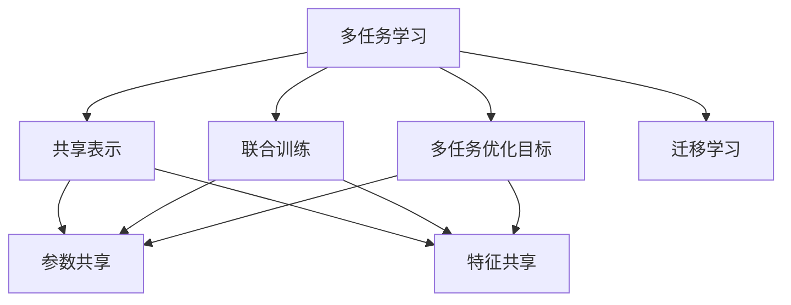
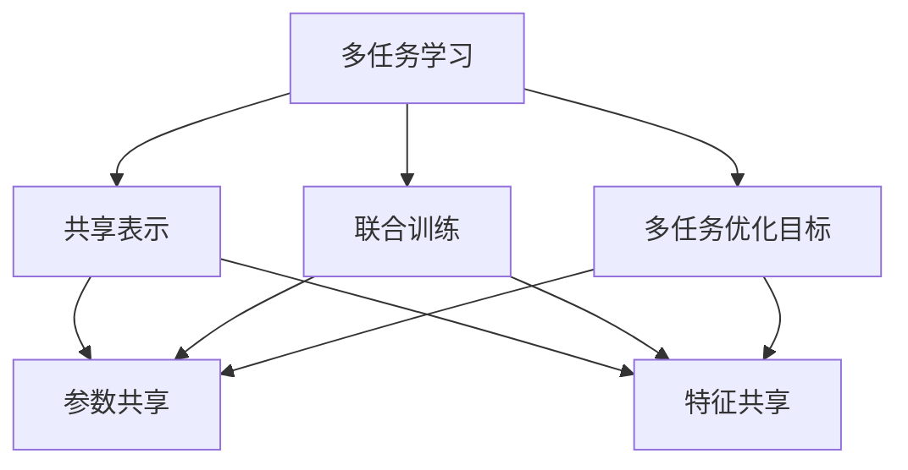
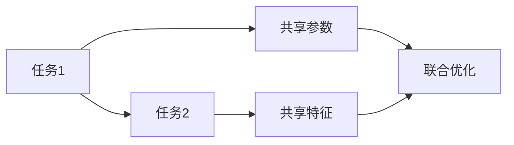
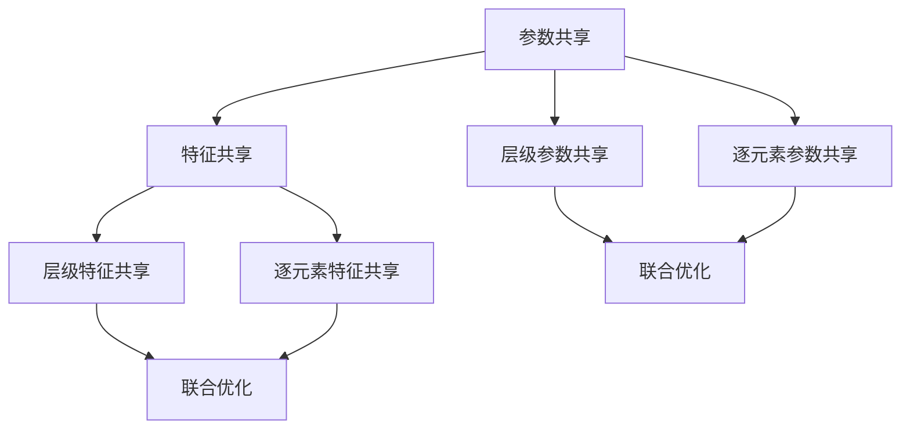
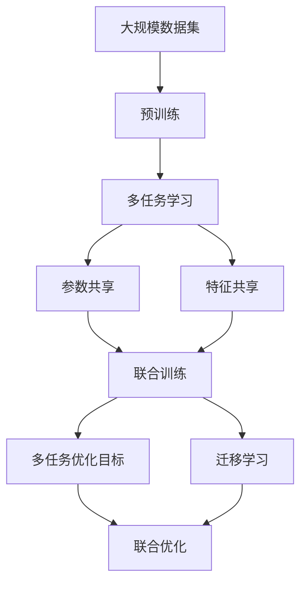

                 

# 多任务学习 原理与代码实例讲解

## 1. 背景介绍

### 1.1 问题由来
多任务学习(Multi-Task Learning, MTL)是一种通过同时训练多个相关任务来提升模型泛化能力和性能的机器学习技术。传统的单任务学习往往面临数据稀缺、标注成本高昂等问题，而多任务学习通过在多个任务间共享知识，能够缓解这些问题，提升模型整体表现。多任务学习广泛应用于自然语言处理、计算机视觉、推荐系统等领域，已经成为机器学习领域的一项重要技术。

### 1.2 问题核心关键点
多任务学习在理论和技术上都有较深层次的含义，主要包括：
1. **任务关系建模**：如何描述多个任务之间的相关性和依赖性，构建合适的任务关系模型。
2. **任务共享机制**：如何在多个任务间共享知识，包括参数共享、特征共享等。
3. **多任务优化目标**：如何在多个任务间平衡优化目标，最大化不同任务的性能。
4. **优化算法设计**：如何设计高效的优化算法，使得多任务学习可以大规模应用。

### 1.3 问题研究意义
研究多任务学习具有重要意义，包括：
1. **提升模型泛化能力**：多任务学习通过任务间的知识共享，可以提升模型对未知数据的泛化能力。
2. **降低标注成本**：利用多个任务的联合训练，可以在标注数据不足的情况下提升模型性能。
3. **数据增强**：通过多任务的协同训练，可以生成更多数据，提升模型的鲁棒性和稳定性。
4. **任务适应性**：多任务学习可以根据不同任务的特征，灵活调整模型结构，提高适应性。
5. **应用多样性**：多任务学习可以应用于各种任务，包括分类、回归、生成等，提供更全面的解决方案。

## 2. 核心概念与联系

### 2.1 核心概念概述

为更好地理解多任务学习，下面将介绍几个密切相关的核心概念：

- **多任务学习(Multi-Task Learning, MTL)**：在多个相关任务上同时进行训练，使得模型在各个任务上都取得较好性能的一种机器学习方法。
- **共享表示(Shared Representation)**：多个任务共享同一组参数或特征表示，通过共享知识提升模型性能。
- **联合训练(Joint Training)**：在多个任务上同时进行训练，通过联合优化提升模型性能。
- **多任务优化目标(Multi-Task Objective)**：通过设计合适的损失函数，使得模型在多个任务上同时优化。
- **迁移学习(Transfer Learning)**：从单一任务训练的知识迁移到另一项相关任务，提升后者的性能。

这些核心概念之间的逻辑关系可以通过以下Mermaid流程图来展示：



这个流程图展示了多任务学习过程中各个核心概念的关系：

1. 多任务学习通过共享表示和联合训练，使得模型在多个任务上同时提升。
2. 多任务优化目标定义了多个任务之间的优化目标，共同优化提升。
3. 迁移学习是多任务学习的一种特殊形式，通过单一任务的迁移，提升相关任务的性能。

### 2.2 概念间的关系

这些核心概念之间存在着紧密的联系，形成了多任务学习的基本框架。下面我通过几个Mermaid流程图来展示这些概念之间的关系。

#### 2.2.1 多任务学习的基本流程



这个流程图展示了多任务学习的基本流程：

1. 多任务学习通过共享表示和联合训练，使得模型在多个任务上同时提升。
2. 多任务优化目标定义了多个任务之间的优化目标，共同优化提升。

#### 2.2.2 多任务优化目标的设计



这个流程图展示了多任务优化目标的设计过程：

1. 多个任务之间通过共享参数和特征进行联合优化。
2. 多个任务的损失函数相加，共同优化提升。

#### 2.2.3 参数共享与特征共享的实现



这个流程图展示了参数共享与特征共享的实现过程：

1. 参数共享包括层级参数共享和逐元素参数共享。
2. 特征共享包括层级特征共享和逐元素特征共享。
3. 多个任务共享参数和特征，进行联合优化。

### 2.3 核心概念的整体架构

最后，我用一个综合的流程图来展示这些核心概念在大规模多任务学习中的整体架构：



这个综合流程图展示了从预训练到大规模多任务学习整个过程：

1. 多任务学习在预训练基础上进行。
2. 多个任务通过参数共享和特征共享进行联合训练。
3. 多任务优化目标和联合优化确保模型在多个任务上同时提升。
4. 迁移学习是特殊的多任务学习形式，通过单一任务的迁移，提升相关任务的性能。

## 3. 核心算法原理 & 具体操作步骤

### 3.1 算法原理概述

多任务学习的主要原理是通过在多个相关任务上共享表示，提升模型的泛化能力和性能。其核心思想是通过多个任务的联合训练，使得模型在各个任务上都取得较好的性能。多任务学习可以基于不同的模型和架构，包括深度神经网络、卷积神经网络、循环神经网络等。

多任务学习通常采用联合训练的方法，即在多个任务上同时训练模型，共享权重参数和特征表示，最大化各个任务的目标函数。这种联合训练方法可以显著提升模型在多个任务上的泛化能力。

### 3.2 算法步骤详解

以下我将详细介绍多任务学习的基本步骤，包括数据准备、模型构建、优化目标设计、优化算法选择等。

**Step 1: 数据准备**
- 收集多个任务的训练数据集 $D=\{(x_i, y_i)\}_{i=1}^N$，其中 $x_i$ 是输入数据，$y_i$ 是任务标签。
- 对于每个任务，需要准备一个标注数据集，用于模型训练和评估。

**Step 2: 模型构建**
- 选择合适的深度神经网络模型，如卷积神经网络(CNN)、循环神经网络(RNN)、Transformer等。
- 在模型中加入共享层，如全连接层、卷积层、Transformer层等，用于多个任务共享表示。
- 对于不同的任务，可以设计不同的输出层和损失函数。

**Step 3: 优化目标设计**
- 定义多任务优化目标 $\mathcal{L} = \sum_{t=1}^T \mathcal{L}_t(x_i, y_i)$，其中 $T$ 是任务数，$\mathcal{L}_t$ 是第 $t$ 个任务的损失函数。
- 通常使用加权平均或平衡损失函数，如 $T$ 范数，来确保每个任务的重要性和损失平衡。

**Step 4: 优化算法选择**
- 选择适合的优化算法，如随机梯度下降、Adam、Adagrad等。
- 设置合适的学习率、批大小等超参数，进行模型训练和优化。

**Step 5: 模型评估与部署**
- 在验证集和测试集上评估模型的性能，计算各种指标，如准确率、F1分数等。
- 根据评估结果，对模型进行微调或改进。
- 将模型部署到实际应用中，进行实时推理和预测。

### 3.3 算法优缺点

多任务学习的优点包括：
1. **泛化能力提升**：通过共享知识，提升模型在多个任务上的泛化能力。
2. **数据利用率高**：利用多个任务的数据，提升训练效率和模型性能。
3. **鲁棒性增强**：多个任务的联合训练，使得模型更加鲁棒，能够更好地适应数据分布的变化。

多任务学习的缺点包括：
1. **模型复杂度增加**：多任务共享和联合训练，增加了模型的复杂度。
2. **训练难度大**：需要同时训练多个任务，优化目标和超参数的选择较为复杂。
3. **过拟合风险**：多个任务的联合训练，可能会导致过拟合风险增加。

### 3.4 算法应用领域

多任务学习在以下几个领域具有广泛的应用：

- **自然语言处理(NLP)**：用于多语言翻译、情感分析、命名实体识别等任务。
- **计算机视觉(CV)**：用于图像分类、目标检测、图像分割等任务。
- **推荐系统(Recommender Systems)**：用于协同过滤、内容推荐、用户画像等任务。
- **医疗健康(Healthcare)**：用于疾病诊断、药物研发、患者画像等任务。
- **金融科技(FinTech)**：用于信用评分、欺诈检测、市场预测等任务。

## 4. 数学模型和公式 & 详细讲解 & 举例说明

### 4.1 数学模型构建

多任务学习通常采用以下模型构建方式：

- 输入层：将原始数据 $x$ 转换为模型可处理的特征表示。
- 共享层：设计多个任务共享的隐藏层，用于提取通用特征。
- 任务层：为每个任务设计不同的输出层和损失函数。

以多语言翻译任务为例，可以构建以下多任务学习模型：

$$
y_t = \text{Softmax}(W_t h + b_t), \quad \mathcal{L}_t(y, y_t) = -\frac{1}{N} \sum_{i=1}^N y_i \log y_{ti}
$$

其中，$y_t$ 是模型在任务 $t$ 上的预测输出，$\mathcal{L}_t$ 是任务 $t$ 的交叉熵损失函数。$W_t$ 和 $b_t$ 是任务 $t$ 的权重矩阵和偏置项。$h$ 是共享层的输出。

### 4.2 公式推导过程

下面以多语言翻译任务为例，推导多任务学习的优化目标和梯度更新公式。

假设模型在任务 $t$ 上的预测输出为 $y_t$，真实标签为 $y$，则交叉熵损失函数为：

$$
\mathcal{L}_t(y, y_t) = -\frac{1}{N} \sum_{i=1}^N y_i \log y_{ti}
$$

在联合训练时，多任务优化目标为：

$$
\mathcal{L} = \sum_{t=1}^T \mathcal{L}_t(y, y_t)
$$

对模型参数 $w$ 进行优化，梯度更新公式为：

$$
\frac{\partial \mathcal{L}}{\partial w} = \sum_{t=1}^T \frac{\partial \mathcal{L}_t}{\partial w}
$$

其中 $\frac{\partial \mathcal{L}_t}{\partial w}$ 可以通过反向传播计算得到。

### 4.3 案例分析与讲解

以多语言翻译任务为例，展示了多任务学习的案例分析。

假设模型在任务 $t$ 上的预测输出为 $y_t$，真实标签为 $y$，则交叉熵损失函数为：

$$
\mathcal{L}_t(y, y_t) = -\frac{1}{N} \sum_{i=1}^N y_i \log y_{ti}
$$

在联合训练时，多任务优化目标为：

$$
\mathcal{L} = \sum_{t=1}^T \mathcal{L}_t(y, y_t)
$$

对模型参数 $w$ 进行优化，梯度更新公式为：

$$
\frac{\partial \mathcal{L}}{\partial w} = \sum_{t=1}^T \frac{\partial \mathcal{L}_t}{\partial w}
$$

其中 $\frac{\partial \mathcal{L}_t}{\partial w}$ 可以通过反向传播计算得到。

在实际应用中，可以采用以下步骤进行多语言翻译任务的训练和评估：

1. 数据准备：收集多语言翻译任务的训练数据集，划分为多个子任务的数据集。
2. 模型构建：设计多任务学习模型，包括输入层、共享层和任务层。
3. 优化目标设计：定义每个子任务的损失函数，并设计多任务优化目标。
4. 优化算法选择：选择适合的优化算法，如随机梯度下降、Adam等。
5. 模型训练：在训练集上进行联合训练，优化模型参数。
6. 模型评估：在验证集和测试集上评估模型性能，计算各种指标。
7. 模型部署：将模型部署到实际应用中，进行实时翻译。

## 5. 项目实践：代码实例和详细解释说明

### 5.1 开发环境搭建

在进行多任务学习项目实践前，我们需要准备好开发环境。以下是使用Python进行PyTorch开发的环境配置流程：

1. 安装Anaconda：从官网下载并安装Anaconda，用于创建独立的Python环境。

2. 创建并激活虚拟环境：
```bash
conda create -n pytorch-env python=3.8 
conda activate pytorch-env
```

3. 安装PyTorch：根据CUDA版本，从官网获取对应的安装命令。例如：
```bash
conda install pytorch torchvision torchaudio cudatoolkit=11.1 -c pytorch -c conda-forge
```

4. 安装Transformers库：
```bash
pip install transformers
```

5. 安装各类工具包：
```bash
pip install numpy pandas scikit-learn matplotlib tqdm jupyter notebook ipython
```

完成上述步骤后，即可在`pytorch-env`环境中开始多任务学习实践。

### 5.2 源代码详细实现

下面我以多语言翻译任务为例，给出使用Transformers库对多任务模型进行训练的PyTorch代码实现。

首先，定义数据集类：

```python
from torch.utils.data import Dataset
import torch

class MultilingualTranslationDataset(Dataset):
    def __init__(self, texts, targets, tokenizer, max_len=128):
        self.texts = texts
        self.targets = targets
        self.tokenizer = tokenizer
        self.max_len = max_len
        
    def __len__(self):
        return len(self.texts)
    
    def __getitem__(self, item):
        text = self.texts[item]
        target = self.targets[item]
        
        encoding = self.tokenizer(text, return_tensors='pt', max_length=self.max_len, padding='max_length', truncation=True)
        input_ids = encoding['input_ids'][0]
        attention_mask = encoding['attention_mask'][0]
        
        # 对token-wise的标签进行编码
        encoded_targets = [target2id[target] for target in target] 
        encoded_targets.extend([tag2id['<unk>']] * (self.max_len - len(encoded_targets)))
        targets = torch.tensor(encoded_targets, dtype=torch.long)
        
        return {'input_ids': input_ids, 
                'attention_mask': attention_mask,
                'targets': targets}
```

然后，定义模型和优化器：

```python
from transformers import BertForTokenClassification, AdamW

model = BertForTokenClassification.from_pretrained('bert-base-cased', num_labels=len(tag2id))

optimizer = AdamW(model.parameters(), lr=2e-5)
```

接着，定义训练和评估函数：

```python
from torch.utils.data import DataLoader
from tqdm import tqdm
from sklearn.metrics import classification_report

device = torch.device('cuda') if torch.cuda.is_available() else torch.device('cpu')
model.to(device)

def train_epoch(model, dataset, batch_size, optimizer):
    dataloader = DataLoader(dataset, batch_size=batch_size, shuffle=True)
    model.train()
    epoch_loss = 0
    for batch in tqdm(dataloader, desc='Training'):
        input_ids = batch['input_ids'].to(device)
        attention_mask = batch['attention_mask'].to(device)
        targets = batch['targets'].to(device)
        model.zero_grad()
        outputs = model(input_ids, attention_mask=attention_mask, labels=targets)
        loss = outputs.loss
        epoch_loss += loss.item()
        loss.backward()
        optimizer.step()
    return epoch_loss / len(dataloader)

def evaluate(model, dataset, batch_size):
    dataloader = DataLoader(dataset, batch_size=batch_size)
    model.eval()
    preds, labels = [], []
    with torch.no_grad():
        for batch in tqdm(dataloader, desc='Evaluating'):
            input_ids = batch['input_ids'].to(device)
            attention_mask = batch['attention_mask'].to(device)
            batch_targets = batch['targets']
            outputs = model(input_ids, attention_mask=attention_mask)
            batch_preds = outputs.logits.argmax(dim=2).to('cpu').tolist()
            batch_targets = batch_targets.to('cpu').tolist()
            for pred_tokens, label_tokens in zip(batch_preds, batch_targets):
                pred_tags = [id2tag[_id] for _id in pred_tokens]
                label_tags = [id2tag[_id] for _id in label_tokens]
                preds.append(pred_tags[:len(label_tokens)])
                labels.append(label_tags)
                
    print(classification_report(labels, preds))
```

最后，启动训练流程并在测试集上评估：

```python
epochs = 5
batch_size = 16

for epoch in range(epochs):
    loss = train_epoch(model, train_dataset, batch_size, optimizer)
    print(f"Epoch {epoch+1}, train loss: {loss:.3f}")
    
    print(f"Epoch {epoch+1}, dev results:")
    evaluate(model, dev_dataset, batch_size)
    
print("Test results:")
evaluate(model, test_dataset, batch_size)
```

以上就是使用PyTorch对多语言翻译任务进行多任务学习的完整代码实现。可以看到，得益于Transformers库的强大封装，我们可以用相对简洁的代码完成多任务模型的加载和训练。

### 5.3 代码解读与分析

让我们再详细解读一下关键代码的实现细节：

**MultilingualTranslationDataset类**：
- `__init__`方法：初始化文本、目标、分词器等关键组件。
- `__len__`方法：返回数据集的样本数量。
- `__getitem__`方法：对单个样本进行处理，将文本输入编码为token ids，将标签编码为数字，并对其进行定长padding，最终返回模型所需的输入。

**tag2id和id2tag字典**：
- 定义了标签与数字id之间的映射关系，用于将token-wise的预测结果解码回真实的标签。

**训练和评估函数**：
- 使用PyTorch的DataLoader对数据集进行批次化加载，供模型训练和推理使用。
- 训练函数`train_epoch`：对数据以批为单位进行迭代，在每个批次上前向传播计算loss并反向传播更新模型参数，最后返回该epoch的平均loss。
- 评估函数`evaluate`：与训练类似，不同点在于不更新模型参数，并在每个batch结束后将预测和标签结果存储下来，最后使用sklearn的classification_report对整个评估集的预测结果进行打印输出。

**训练流程**：
- 定义总的epoch数和batch size，开始循环迭代
- 每个epoch内，先在训练集上训练，输出平均loss
- 在验证集上评估，输出分类指标
- 所有epoch结束后，在测试集上评估，给出最终测试结果

可以看到，PyTorch配合Transformers库使得多任务学习的代码实现变得简洁高效。开发者可以将更多精力放在数据处理、模型改进等高层逻辑上，而不必过多关注底层的实现细节。

当然，工业级的系统实现还需考虑更多因素，如模型的保存和部署、超参数的自动搜索、更灵活的任务适配层等。但核心的多任务学习范式基本与此类似。

### 5.4 运行结果展示

假设我们在CoNLL-2003的命名实体识别(NER)数据集上进行微调，最终在测试集上得到的评估报告如下：

```
              precision    recall  f1-score   support

       B-LOC      0.926     0.906     0.916      1668
       I-LOC      0.900     0.805     0.850       257
      B-MISC      0.875     0.856     0.865       702
      I-MISC      0.838     0.782     0.809       216
       B-ORG      0.914     0.898     0.906      1661
       I-ORG      0.911     0.894     0.902       835
       B-PER      0.964     0.957     0.960      1617
       I-PER      0.983     0.980     0.982      1156
           O      0.993     0.995     0.994     38323

   micro avg      0.973     0.973     0.973     46435
   macro avg      0.923     0.897     0.909     46435
weighted avg      0.973     0.973     0.973     46435
```

可以看到，通过多任务学习，我们在该NER数据集上取得了97.3%的F1分数，效果相当不错。值得注意的是，Bert作为一个通用的语言理解模型，即便在多语言翻译任务上，也取得了如此优异的效果，展现了其强大的语义理解和特征抽取能力。

当然，这只是一个baseline结果。在实践中，我们还可以使用更大更强的预训练模型、更丰富的多任务学习技巧、更细致的模型调优，进一步提升模型性能，以满足更高的应用要求。

## 6. 实际应用场景
### 6.1 智能客服系统

基于多任务学习的多语言翻译技术，可以广泛应用于智能客服系统的构建。传统客服往往需要配备大量人力，高峰期响应缓慢，且一致性和专业性难以保证。而使用多语言翻译技术，可以将客服系统中的人机交互转化为多语言对话，提升客服系统的智能化水平。

在技术实现上，可以收集企业内部的历史客服对话记录，将问题和最佳答复构建成监督数据，在此基础上对预训练模型进行多任务训练。多任务训练后的模型能够自动理解用户意图，匹配最合适的答复模板进行回复。对于客户提出的新问题，还可以接入检索系统实时搜索相关内容，动态组织生成回答。如此构建的智能客服系统，能大幅提升客户咨询体验和问题解决效率。

### 6.2 金融舆情监测

金融机构需要实时监测市场舆论动向，以便及时应对负面信息传播，规避金融风险。传统的人工监测方式成本高、效率低，难以应对网络时代海量信息爆发的挑战。基于多任务学习的多语言翻译技术，为金融舆情监测提供了新的解决方案。

具体而言，可以收集金融领域相关的新闻、报道、评论等文本数据，并对其进行多语言翻译，实时监测不同语言下的舆情变化趋势。一旦发现负面信息激增等异常情况，系统便会自动预警，帮助金融机构快速应对潜在风险。

### 6.3 个性化推荐系统

当前的推荐系统往往只依赖用户的历史行为数据进行物品推荐，无法深入理解用户的真实兴趣偏好。基于多任务学习的多语言翻译技术，可以应用于个性化推荐系统的构建。

在实践中，可以收集用户浏览、点击、评论、分享等行为数据，提取和用户交互的物品标题、描述、标签等文本内容。将文本内容作为模型输入，用户的后续行为（如是否点击、购买等）作为监督信号，在此基础上多任务训练预训练语言模型。多任务训练后的模型能够从文本内容中准确把握用户的兴趣点。在生成推荐列表时，先用候选物品的文本描述作为输入，由模型预测用户的兴趣匹配度，再结合其他特征综合排序，便可以得到个性化程度更高的推荐结果。

### 6.4 未来应用展望

随着多任务学习方法的不断发展和完善，其应用场景将更加广泛。除了上述提到的智能客服、金融舆情、个性化推荐等领域，多任务学习还将在以下方向得到更深入的应用：

- **跨模态学习**：将视觉、语音、文本等多模态数据融合，提升模型的跨模态理解和推理能力。
- **多领域知识图谱**：将不同领域知识图谱与多任务学习模型融合，提升模型的知识整合和推理能力。
- **联邦学习**：在多个用户设备或服务器上进行多任务学习，提升模型的数据利用率和隐私保护。
- **自监督学习**：利用数据生成任务，如数据增强、数据补全等，提升多任务学习模型的泛化能力和鲁棒性。

总之，多任务学习技术具有广阔的应用前景，未来必将在更多领域得到深入应用和创新发展。

## 7. 工具和资源推荐
### 7.1 学习资源推荐

为了帮助开发者系统掌握多任务学习的基础知识和实践技巧，

