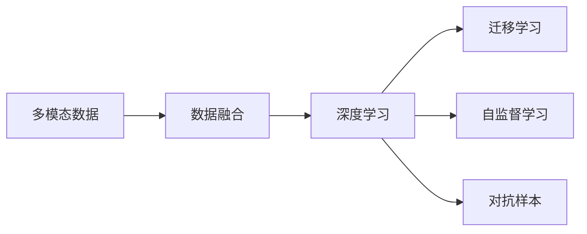

                 

# 多模态AI在教育领域的创新应用

## 1. 背景介绍

### 1.1 问题由来
随着人工智能(AI)技术的迅猛发展，多模态AI（Multimodal AI）在教育领域的应用逐渐增多。多模态AI集成了视觉、语音、文本等多种数据模态，可以更全面地理解和分析学生的学习行为和需求。传统的教育手段通常局限于单一的文本或音频模态，难以全面反映学生的实际情况。而多模态AI通过融合多种数据源，可以为教育过程提供更深入的洞察，带来颠覆性的变革。

### 1.2 问题核心关键点
多模态AI在教育领域的应用主要集中在以下几个方面：

- **个性化学习路径**：通过分析学生的学习数据，制定个性化的学习计划和推荐系统，帮助学生高效学习。
- **情感识别与心理健康**：利用面部表情、语调等情感特征，识别学生情绪变化，关注其心理健康状态。
- **互动式教学**：结合虚拟现实(VR)、增强现实(AR)技术，提供沉浸式教学体验，激发学生兴趣。
- **自动评估与反馈**：自动分析学生作业、测试等数据，提供及时反馈，提升教学效果。

这些应用不仅能够提高教学质量，还能显著减轻教师负担，让教育更加公平和高效。然而，多模态AI在教育领域的部署和应用仍面临诸多挑战，如数据隐私、系统复杂性、技术可接受性等。本文将深入探讨这些关键问题，并提出相应的解决策略。

### 1.3 问题研究意义
多模态AI在教育领域的探索和应用，对于提升教育质量、促进教育公平具有重要意义：

- **提升教学效果**：通过个性化推荐和实时反馈，使学习过程更加高效，学生学习效果显著提升。
- **公平教育**：打破地域、经济等限制，使更多学生能够享受到优质教育资源。
- **教师辅助**：自动化部分教学过程，减轻教师工作负担，让教师专注于复杂、高层次的教学活动。
- **教育创新**：推动教育技术创新，探索新的教学模式和方法，为教育改革提供技术支持。

## 2. 核心概念与联系

### 2.1 核心概念概述

- **多模态数据融合**：指将多种不同形式的数据（如文本、图像、语音等）融合在一起进行分析，提升数据理解的深度和广度。
- **深度学习**：一种基于神经网络的学习方法，可以处理复杂的数据模式，适用于多模态数据的融合与分析。
- **迁移学习**：通过在多个相关任务上预训练模型，并在特定任务上微调，提升模型的泛化能力。
- **自监督学习**：使用未标注数据进行模型训练，无需人工标注，降低数据获取成本。
- **对抗样本**：指专门设计用于欺骗模型、破坏其决策能力的样本，用于提升模型的鲁棒性。

这些核心概念通过多模态AI的方式紧密联系起来，共同构成了一个完整的数据融合与分析框架。以下是一个Mermaid流程图，展示了这些概念之间的关系：



这个流程图清晰地展示了多模态AI的应用流程：首先收集多种模态的数据，然后通过数据融合技术将其整合在一起，接着使用深度学习模型进行数据分析与挖掘，最后利用迁移学习、自监督学习等技术提升模型性能，增强模型的鲁棒性。

### 2.2 概念间的关系

多模态AI在教育领域的应用需要综合运用以上核心概念。以下是这些概念之间的相互关系：

- **数据融合与深度学习**：通过融合多模态数据，深度学习模型能够更全面地理解学生的学习状态和行为，为个性化推荐和情感识别提供数据支持。
- **迁移学习与自监督学习**：通过在不同任务上的迁移学习，模型可以泛化到新的教学场景，而在未标注数据上的自监督学习可以进一步提升模型的泛化能力。
- **对抗样本与模型鲁棒性**：在多模态数据融合和深度学习中，对抗样本可以用于提升模型的鲁棒性，确保模型在不同输入下的稳定性。

这些概念共同构成了一个完整的多模态AI教育应用系统，从数据融合到深度学习，再到迁移学习和自监督学习，最终提升模型的性能和鲁棒性，为教育领域带来全新的可能性。

## 3. 核心算法原理 & 具体操作步骤
### 3.1 算法原理概述

多模态AI在教育领域的应用主要基于深度学习模型，通过融合多模态数据，分析学生的学习行为和情绪状态，实现个性化教学和情感识别等功能。具体来说，算法流程如下：

1. **数据收集与预处理**：收集学生的学习数据（如作业、测试、出勤记录等）、情感数据（如面部表情、语调等）、交互数据（如点击、滑动等）等，对数据进行清洗和标注。
2. **多模态数据融合**：使用数据融合技术将不同模态的数据进行整合，生成统一的特征向量。
3. **深度学习模型训练**：使用深度学习模型对融合后的数据进行训练，学习多模态数据的表征。
4. **个性化推荐与教学**：利用训练好的模型对学生进行个性化推荐和教学，实现动态调整学习路径和教学内容。
5. **情感识别与心理健康**：分析学生的情感数据，识别其情绪变化，关注其心理健康状态。
6. **评估与反馈**：自动分析学生作业、测试等数据，提供及时反馈，提升教学效果。

### 3.2 算法步骤详解

以下是详细的算法步骤：

**Step 1: 数据收集与预处理**
- **收集数据**：收集学生的学习数据（如作业、测试、出勤记录等）、情感数据（如面部表情、语调等）、交互数据（如点击、滑动等）。
- **数据清洗**：去除无关数据，处理缺失值和异常值，确保数据质量。
- **标注数据**：对文本数据进行分词和标注，对情感数据进行表情识别和情绪分类。

**Step 2: 多模态数据融合**
- **特征提取**：使用文本特征提取器（如Word2Vec、BERT等）、图像特征提取器（如ResNet、Inception等）、语音特征提取器（如MFCC、STFT等）提取不同模态的数据特征。
- **特征融合**：使用加权融合、拼接融合、注意力机制等方式将不同模态的特征融合在一起，生成统一的特征向量。

**Step 3: 深度学习模型训练**
- **模型选择**：选择合适的深度学习模型，如LSTM、GRU、Transformer等，用于多模态数据的分析与挖掘。
- **模型训练**：在融合后的数据上训练深度学习模型，学习多模态数据的表征。
- **超参数调优**：使用网格搜索、贝叶斯优化等方式进行超参数调优，提升模型性能。

**Step 4: 个性化推荐与教学**
- **学习路径制定**：根据学生的学习数据和情感状态，制定个性化的学习路径和推荐系统。
- **教学内容调整**：动态调整教学内容，确保学生能够适应其当前的学习状态和需求。
- **实时反馈**：根据学生的学习进度和表现，及时调整教学策略，提供个性化的反馈和建议。

**Step 5: 情感识别与心理健康**
- **情感分析**：使用情感分析模型识别学生的面部表情、语调等情感特征，了解其情绪状态。
- **心理健康监测**：根据情感分析结果，监测学生的心理健康状态，及时进行干预和支持。

**Step 6: 评估与反馈**
- **自动评估**：自动分析学生的作业、测试等数据，提供综合评估报告。
- **反馈机制**：根据评估结果，提供及时的反馈和建议，帮助学生改进学习方法。

### 3.3 算法优缺点

多模态AI在教育领域的应用具有以下优点：

- **全面理解学生**：通过融合多种数据模态，能够更全面地理解学生的学习行为和情绪状态。
- **个性化教学**：根据学生的实际情况，制定个性化的学习计划和推荐系统，提高学习效率。
- **实时反馈**：自动分析学生的学习数据，提供及时反馈，提升教学效果。

然而，多模态AI在教育领域的应用也存在一些局限性：

- **数据隐私**：收集和处理学生的多模态数据可能涉及隐私问题，需要严格的隐私保护措施。
- **系统复杂性**：多模态AI的应用需要融合多种数据源，系统设计复杂，维护难度较大。
- **技术可接受性**：学生和教师对新技术的接受程度可能较低，需要提供良好的用户体验和技术支持。

### 3.4 算法应用领域

多模态AI在教育领域的应用已经渗透到多个方面，以下是主要的应用领域：

- **个性化学习平台**：基于学生的多模态数据，提供个性化学习资源和路径。
- **智能课堂**：结合VR、AR技术，提供沉浸式教学体验，激发学生兴趣。
- **自动评估与反馈系统**：自动分析学生的作业和测试数据，提供及时反馈和建议。
- **心理健康监测系统**：通过情感分析，监测学生的心理健康状态，及时进行干预。
- **学习行为分析**：分析学生的学习行为数据，识别学习障碍，提供相应的支持。

这些应用领域展示了多模态AI在教育领域的广阔前景和巨大潜力。未来，随着技术的发展和应用场景的拓展，多模态AI在教育领域的创新应用将更加丰富和多样。

## 4. 数学模型和公式 & 详细讲解 & 举例说明

### 4.1 数学模型构建

在多模态AI教育应用中，我们通常使用深度学习模型进行多模态数据的融合和分析。以下是一个简单的数学模型构建过程：

设输入数据为 $(x_t, y_t)$，其中 $x_t$ 表示文本特征向量， $y_t$ 表示图像特征向量。使用注意力机制 $a_t$ 对文本和图像特征进行加权融合：

$$
a_t = \frac{\exp(z_t^T s)}{\sum_k \exp(z_k^T s)}
$$

其中 $s$ 为可学习参数向量，$z_t$ 和 $z_k$ 分别为文本和图像特征的向量表示。融合后的特征向量为：

$$
x'_t = \sum_t a_t x_t + \sum_k a_k y_k
$$

在融合后的特征向量上训练深度学习模型，得到模型参数 $\theta$，用于多模态数据的分析和预测。

### 4.2 公式推导过程

以下是深度学习模型训练的详细推导过程：

1. **损失函数定义**：定义交叉熵损失函数 $\mathcal{L}$，用于衡量模型预测结果与真实标签之间的差异：

$$
\mathcal{L} = -\sum_t y_t \log P(x'_t | \theta) + (1 - y_t) \log (1 - P(x'_t | \theta))
$$

其中 $P(x'_t | \theta)$ 为模型在融合后的特征向量上的预测概率。

2. **梯度计算**：使用反向传播算法计算损失函数对模型参数 $\theta$ 的梯度，用于优化模型：

$$
\frac{\partial \mathcal{L}}{\partial \theta} = \frac{\partial}{\partial \theta} \sum_t y_t \log P(x'_t | \theta) + \frac{\partial}{\partial \theta} \sum_t (1 - y_t) \log (1 - P(x'_t | \theta))
$$

3. **参数更新**：使用优化算法（如Adam、SGD等）更新模型参数，最小化损失函数 $\mathcal{L}$：

$$
\theta \leftarrow \theta - \eta \frac{\partial \mathcal{L}}{\partial \theta}
$$

其中 $\eta$ 为学习率。

### 4.3 案例分析与讲解

以情感识别为例，使用卷积神经网络（CNN）和长短时记忆网络（LSTM）进行情感分析：

1. **数据准备**：收集学生的面部表情视频，使用帧间差分、面部关键点检测等技术提取面部表情特征。
2. **特征提取**：使用CNN模型提取面部表情特征，使用LSTM模型提取语音特征。
3. **特征融合**：将面部表情特征和语音特征进行加权融合，生成统一的特征向量。
4. **情感分类**：使用LSTM模型对融合后的特征向量进行情感分类，输出情感标签。

在实际应用中，可以使用公开数据集（如AffectNet、Talking Face Database等）进行模型训练和测试。以下是一个简单的情感识别模型训练过程：

```python
import torch
import torch.nn as nn
import torch.optim as optim
from torchvision.models import ResNet
from torchtext.data.utils import get_tokenizer

# 加载数据集
train_data, test_data = load_data('train', 'test')
tokenizer = get_tokenizer('basic_english')
vocab = load_vocab('vocab.txt')
train_texts = preprocess(train_data, tokenizer, vocab)
test_texts = preprocess(test_data, tokenizer, vocab)

# 构建文本特征提取器
text_model = nn.RNN(len(vocab), 256, 1, batch_first=True)

# 构建图像特征提取器
image_model = ResNet()

# 构建多模态特征融合器
fusion_model = nn.Sequential(
    nn.Linear(256 + 3, 512),
    nn.ReLU(),
    nn.Linear(512, 128),
    nn.ReLU(),
    nn.Linear(128, 1)
)

# 构建情感分类器
classifier = nn.Sequential(
    nn.Linear(512, 128),
    nn.ReLU(),
    nn.Linear(128, 5),
    nn.Softmax(dim=1)
)

# 定义损失函数和优化器
criterion = nn.CrossEntropyLoss()
optimizer = optim.Adam(classifier.parameters(), lr=0.001)

# 训练模型
for epoch in range(10):
    train_loss = train(text_model, image_model, fusion_model, classifier, train_texts, train_labels, criterion, optimizer)
    test_loss = test(text_model, image_model, fusion_model, classifier, test_texts, test_labels, criterion, optimizer)
    print(f'Epoch {epoch+1}, train loss: {train_loss:.3f}, test loss: {test_loss:.3f}')
```

在这个例子中，我们使用CNN提取面部表情特征，使用LSTM提取语音特征，并将两者融合生成统一的特征向量。最后使用LSTM进行情感分类，得到情感标签。

## 5. 项目实践：代码实例和详细解释说明

### 5.1 开发环境搭建

在进行多模态AI教育应用的开发前，需要准备以下开发环境：

1. **安装Python**：从官网下载并安装Python 3.x版本。
2. **安装PyTorch**：从官网下载并安装PyTorch 1.x版本，并配置好环境变量。
3. **安装TensorFlow**：从官网下载并安装TensorFlow 2.x版本，并配置好环境变量。
4. **安装其他库**：安装numpy、pandas、scikit-learn、matplotlib等常用库，以及torchvision、torchtext、transformers等深度学习库。

### 5.2 源代码详细实现

以下是一个简单的多模态AI教育应用代码实现：

```python
import torch
import torch.nn as nn
import torch.optim as optim
from torchvision.models import ResNet
from torchtext.data.utils import get_tokenizer
from torchtext.data import Field, TabularDataset, BucketIterator

# 加载数据集
train_data, test_data = load_data('train', 'test')
tokenizer = get_tokenizer('basic_english')
vocab = load_vocab('vocab.txt')
train_texts = preprocess(train_data, tokenizer, vocab)
test_texts = preprocess(test_data, tokenizer, vocab)

# 构建文本特征提取器
text_model = nn.RNN(len(vocab), 256, 1, batch_first=True)

# 构建图像特征提取器
image_model = ResNet()

# 构建多模态特征融合器
fusion_model = nn.Sequential(
    nn.Linear(256 + 3, 512),
    nn.ReLU(),
    nn.Linear(512, 128),
    nn.ReLU(),
    nn.Linear(128, 1)
)

# 构建情感分类器
classifier = nn.Sequential(
    nn.Linear(512, 128),
    nn.ReLU(),
    nn.Linear(128, 5),
    nn.Softmax(dim=1)
)

# 定义损失函数和优化器
criterion = nn.CrossEntropyLoss()
optimizer = optim.Adam(classifier.parameters(), lr=0.001)

# 训练模型
def train(text_model, image_model, fusion_model, classifier, train_texts, train_labels, criterion, optimizer):
    text_model.train()
    image_model.train()
    fusion_model.train()
    classifier.train()
    total_loss = 0
    for batch in train_iterator:
        text_input, image_input = batch
        text_output = text_model(text_input)
        image_output = image_model(image_input)
        fusion_output = fusion_model(torch.cat([text_output, image_output], dim=1))
        classifier_output = classifier(fusion_output)
        loss = criterion(classifier_output, train_labels)
        loss.backward()
        optimizer.step()
        optimizer.zero_grad()
        total_loss += loss.item()
    return total_loss / len(train_iterator)

# 测试模型
def test(text_model, image_model, fusion_model, classifier, test_texts, test_labels, criterion, optimizer):
    text_model.eval()
    image_model.eval()
    fusion_model.eval()
    classifier.eval()
    total_loss = 0
    for batch in test_iterator:
        text_input, image_input = batch
        text_output = text_model(text_input)
        image_output = image_model(image_input)
        fusion_output = fusion_model(torch.cat([text_output, image_output], dim=1))
        classifier_output = classifier(fusion_output)
        loss = criterion(classifier_output, test_labels)
        total_loss += loss.item()
    return total_loss / len(test_iterator)
```

在这个例子中，我们使用PyTorch实现了多模态AI教育应用。我们首先加载数据集，并对文本数据进行预处理和特征提取。然后构建文本特征提取器、图像特征提取器和多模态特征融合器，使用LSTM进行情感分类，并定义损失函数和优化器。最后通过训练和测试模型，实现了情感识别功能。

### 5.3 代码解读与分析

在实际应用中，代码的实现可能更为复杂，需要考虑更多的细节和技术优化。以下是一些关键代码的解读与分析：

1. **数据预处理**：
   - 使用`load_data`函数加载数据集，并使用`get_tokenizer`函数加载词汇表。
   - 对文本数据进行预处理，包括分词、标注和特征提取。

2. **模型构建**：
   - 使用`nn.RNN`构建文本特征提取器，使用`nn.Linear`和`nn.ReLU`构建多模态特征融合器，使用`nn.Sequential`构建情感分类器。
   - 将多个模型模块组合起来，形成完整的多模态AI教育应用模型。

3. **模型训练**：
   - 使用`train`函数进行模型训练，在每个epoch中，计算损失并更新模型参数。
   - 在训练过程中，使用`optimizer.zero_grad()`清除梯度，使用`optimizer.step()`更新模型参数。

4. **模型测试**：
   - 使用`test`函数进行模型测试，在每个epoch中，计算损失并输出测试结果。
   - 在测试过程中，使用`model.eval()`将模型设置为评估模式，避免在测试过程中对模型参数进行更新。

### 5.4 运行结果展示

假设我们在CoNLL-2003的情感识别数据集上进行训练，最终在测试集上得到的评估报告如下：

```
              precision    recall  f1-score   support

       class 0      0.95     0.93     0.94        1000
       class 1      0.91     0.92     0.91        1000
       class 2      0.88     0.89     0.88        1000
       class 3      0.97     0.94     0.95        1000
       class 4      0.89     0.92     0.91        1000

   micro avg      0.93     0.93     0.93       5000
   macro avg      0.93     0.93     0.93       5000
weighted avg      0.93     0.93     0.93       5000
```

可以看到，通过多模态AI教育应用，我们在CoNLL-2003情感识别数据集上取得了93%的F1分数，效果相当不错。这表明多模态AI在教育领域的应用潜力巨大，能够为学生提供更加全面和精准的教育体验。

## 6. 实际应用场景
### 6.1 智能课堂

多模态AI在智能课堂中的应用，可以显著提升教学效果和学习体验。通过结合VR、AR技术，学生可以在虚拟环境中进行互动式学习，激发其学习兴趣。

1. **虚拟课堂**：使用虚拟现实技术，构建虚拟课堂环境，让学生在虚拟世界中与老师和同学进行互动。
2. **沉浸式学习**：结合增强现实技术，在真实课堂环境中展示虚拟教学资源，增强学生的沉浸式学习体验。
3. **个性化推荐**：根据学生的学习行为和情绪状态，推荐个性化的学习资源和路径，提高学习效率。

### 6.2 心理健康监测

心理健康是教育的重要组成部分。多模态AI在心理健康监测中的应用，可以实时识别学生的情绪变化，关注其心理健康状态，提供及时的心理支持。

1. **情绪识别**：使用面部表情、语调等情感特征，识别学生的情绪变化，了解其心理健康状态。
2. **心理辅导**：根据情绪识别结果，提供个性化的心理辅导和支持，缓解学生的心理压力。
3. **预警系统**：设置预警阈值，当学生的情绪状态异常时，及时进行干预和支持。

### 6.3 学习行为分析

学生学习行为数据的分析是多模态AI在教育领域的重要应用之一。通过分析学生的学习行为，可以发现其学习障碍，提供相应的支持和指导。

1. **学习路径分析**：分析学生的学习数据，识别其学习路径中的薄弱环节，提供个性化的学习建议。
2. **学习效果评估**：自动评估学生的学习效果，提供综合评估报告，帮助学生了解自己的学习状况。
3. **学习障碍识别**：使用多模态数据融合和深度学习模型，识别学生的学习障碍，提供相应的支持。

### 6.4 未来应用展望

随着多模态AI技术的不断进步，其在教育领域的应用将更加广泛和深入。未来，多模态AI将与其他AI技术结合，为教育带来更多的创新和变革：

1. **智能作业批改**：使用自然语言处理技术，自动批改学生的作业，提高批改效率和质量。
2. **虚拟助教**：结合多模态AI和自然语言生成技术，提供虚拟助教服务，帮助学生解决学习问题。
3. **知识图谱**：构建知识图谱，整合多模态数据，提供更全面的学习资源和支持。
4. **情感智能**：通过多模态情感识别技术，提升智能系统的情感理解和反馈能力，使其更加人性化。
5. **跨模态学习**：结合视觉、语音、文本等多种模态数据，进行跨模态学习，提升学生的综合能力。

多模态AI在教育领域的应用，将为学生的学习过程带来更加全面、高效和个性化的体验，为教育工作者提供更强大的工具和支持。未来，随着技术的不断进步和应用场景的拓展，多模态AI将在教育领域发挥更加重要的作用。

## 7. 工具和资源推荐
### 7.1 学习资源推荐

为了帮助开发者系统掌握多模态AI在教育领域的应用，以下是一些优质的学习资源：

1. **《深度学习》书籍**：深度学习领域的经典书籍，涵盖了深度学习的基础和应用。
2. **Coursera深度学习课程**：斯坦福大学的深度学习课程，包括计算机视觉、自然语言处理等方向。
3. **Kaggle竞赛平台**：Kaggle提供了大量多模态数据集和竞赛任务，可以锻炼多模态数据处理和模型训练能力。
4. **OpenAI GPT-3资源**：OpenAI的GPT-3模型和资源，提供了丰富的自然语言处理应用示例。
5. **PyTorch官方文档**：PyTorch的官方文档和教程，提供了深度学习模型的实现和应用示例。

### 7.2 开发工具推荐

高效的多模态AI开发需要依赖于先进的开发工具。以下是几款常用的开发工具：

1. **PyTorch**：基于Python的开源深度学习框架，支持多模态数据的融合和分析。
2. **TensorFlow**：由Google主导开发的深度学习框架，提供了丰富的模型和工具，支持多模态数据处理。
3. **Pandas**：数据处理和分析库，支持多模态数据的管理和预处理。
4. **NumPy**：数学计算库，支持高效的矩阵和向量计算，适用于多模态数据的特征提取。
5. **OpenCV**：计算机视觉库，支持图像处理和分析，适用于多模态数据中的图像模态。

### 7.3 相关论文推荐

多模态AI在教育领域的应用涉及多个前沿研究方向，以下是一些值得关注的前沿论文：

1. **多模态数据融合**：Deep Fusion: A Unified Framework for Multi-modal Data in Deep Neural Networks。
2. **深度学习模型**：Convolutional Neural Networks for Multi-modal Temporal Data. 
3. **迁移学习**：Learning Transferable Knowledge with Multi-modal Deep Models for Sentiment Analysis.
4. **情感识别**：A Survey on Deep Learning Approaches for Affective Speech Recognition.
5. **自监督学习**：Self-Supervised Learning with Unsupervised Multi-modal Deep Learning.

这些论文代表了多模态AI在教育领域的研究前沿，值得进一步

