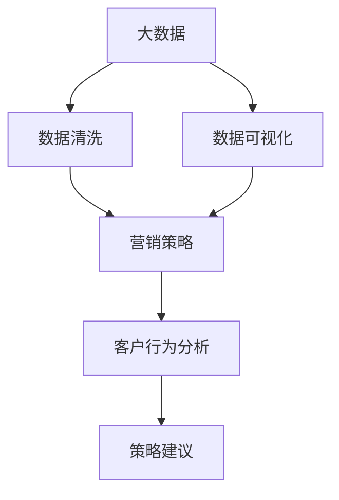
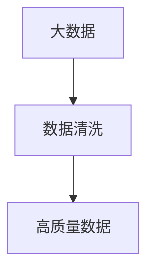
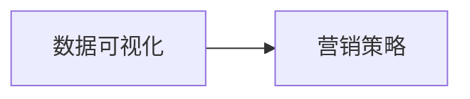
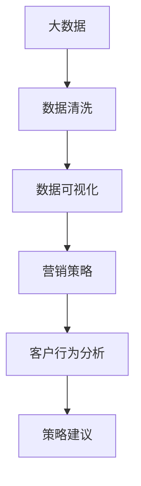

                 

## 1. 背景介绍

### 1.1 问题由来

随着汽车市场的不断增长，汽车营销数据也在迅速增加。汽车制造商和销售商面临着如何从大量数据中挖掘有价值信息，以便更好地制定营销策略和提高销售额的问题。传统的报表和数据可视化工具虽然提供了一些基本分析能力，但难以满足复杂场景下的高效率、高精度的需求。因此，基于大数据的汽车营销可视化分析与研究成为当务之急。

### 1.2 问题核心关键点

汽车营销可视化分析的核心关键点在于如何将大数据与营销策略进行深度结合。具体而言，需要解决以下问题：

1. **数据整合与清洗**：汽车营销数据来自多个渠道，格式多样、数据量大，如何高效整合与清洗数据是关键。
2. **分析与可视化**：在清洗后的数据基础上，如何进行高级分析，并生成直观的可视化报表。
3. **策略建议**：基于分析结果，生成针对性的营销策略建议。

### 1.3 问题研究意义

开展基于大数据的汽车营销可视化分析与研究，对于提升汽车销售业绩、优化营销策略具有重要意义：

1. **提升数据价值**：通过数据整合与分析，挖掘隐藏在数据中的深层次信息，帮助决策者制定更科学的营销策略。
2. **优化资源分配**：利用数据可视化工具，直观展示营销效果，帮助企业优化资源配置，提高投资回报率。
3. **提高客户满意度**：通过客户行为分析，精准定位潜在客户，提供个性化推荐和服务，提升客户满意度。
4. **应对竞争压力**：实时监测市场动态，快速响应竞争对手的策略变化，保持市场竞争力。

## 2. 核心概念与联系

### 2.1 核心概念概述

为更好地理解基于大数据的汽车营销可视化分析与研究，本节将介绍几个密切相关的核心概念：

- **大数据(Big Data)**：指数据量庞大、数据种类繁多、数据处理速度快、数据价值密度低的特点的数据集合。汽车营销数据通常具备这些特点。
- **数据清洗(Data Cleaning)**：指通过一系列数据处理步骤，去除噪音数据、修正数据错误、归一化数据等，以提高数据的准确性和可用性。
- **数据可视化(Data Visualization)**：指将数据通过图表、图像等形式直观展示出来，帮助决策者更好地理解数据。
- **营销策略(Marketing Strategy)**：指企业为了实现销售目标而采取的各种营销手段和策略。
- **客户行为分析(Customer Behavior Analysis)**：指分析客户的行为模式，以识别客户需求、优化客户体验。

这些核心概念之间的逻辑关系可以通过以下Mermaid流程图来展示：



这个流程图展示了大数据与汽车营销可视化分析的整体架构：

1. 大数据是整个分析的基础。
2. 数据清洗和可视化是分析的前置步骤。
3. 营销策略是分析的最终目标。
4. 客户行为分析帮助深入理解客户需求。
5. 策略建议基于分析结果，指导实际营销策略的制定。

### 2.2 概念间的关系

这些核心概念之间存在着紧密的联系，形成了汽车营销可视化分析与研究的完整生态系统。下面我通过几个Mermaid流程图来展示这些概念之间的关系。

#### 2.2.1 大数据与数据清洗的关系



这个流程图展示了大数据与数据清洗的基本关系：大数据经过清洗后，变为高质量的数据，适合进行后续分析和可视化。

#### 2.2.2 数据可视化与营销策略的关系



这个流程图展示了数据可视化的关键作用：通过可视化报表，决策者可以直观地理解数据，进而制定更科学、有效的营销策略。

#### 2.2.3 客户行为分析与策略建议的关系


这个流程图展示了客户行为分析与策略建议之间的联系：通过对客户行为数据的分析，可以生成针对性的营销策略，从而提升销售业绩。

### 2.3 核心概念的整体架构

最后，我们用一个综合的流程图来展示这些核心概念在大数据可视化分析与研究中的整体架构：



这个综合流程图展示了从大数据到策略建议的完整流程：大数据经过清洗和可视化，生成营销策略建议，最终指导实际营销活动。

## 3. 核心算法原理 & 具体操作步骤

### 3.1 算法原理概述

基于大数据的汽车营销可视化分析与研究，本质上是利用数据挖掘和机器学习技术，从大量数据中提取有价值的信息，并通过数据可视化工具，将信息转化为直观的报表和图表。其核心算法包括以下几个方面：

1. **数据预处理**：包括数据清洗、特征提取、降维等步骤，为后续分析提供干净、高质量的数据。
2. **模型训练**：使用机器学习模型对数据进行建模，提取特征关系。
3. **可视化展示**：将模型训练结果转化为图表、地图等可视化形式，方便决策者理解和使用。
4. **策略生成**：基于可视化结果，生成针对性的营销策略建议。

### 3.2 算法步骤详解

基于大数据的汽车营销可视化分析与研究，主要包括以下几个关键步骤：

**Step 1: 数据采集与整合**

- 从不同渠道（如销售系统、CRM系统、社交媒体等）收集汽车营销数据，并进行整合。
- 使用ETL工具（如Apache Nifi、Talend等）进行数据清洗和转换，去除噪音数据和错误数据，确保数据质量。

**Step 2: 特征提取与选择**

- 对清洗后的数据进行特征提取，包括销售量、客户行为、市场趋势等。
- 使用特征选择算法（如LASSO、随机森林等）选择对营销效果影响较大的特征。

**Step 3: 模型训练**

- 选择合适的机器学习模型（如线性回归、决策树、随机森林等），对提取的特征进行建模。
- 使用交叉验证等技术，评估模型性能，并进行模型调优。

**Step 4: 数据可视化**

- 使用数据可视化工具（如Tableau、Power BI等）将模型训练结果转化为图表、地图等可视化形式。
- 通过可视化报表，展示关键指标的变化趋势、市场分布等。

**Step 5: 策略建议**

- 基于可视化结果，生成针对性的营销策略建议，如产品推荐、促销活动、市场推广等。
- 使用A/B测试等技术，验证策略效果，并进行迭代优化。

### 3.3 算法优缺点

基于大数据的汽车营销可视化分析与研究，具有以下优点：

1. **高效性**：通过自动化处理大数据，节省了大量的人力和时间成本。
2. **准确性**：利用机器学习模型提取数据特征，提高了分析的准确性和科学性。
3. **可视化**：直观的可视化报表方便决策者理解和操作。
4. **灵活性**：可以灵活调整分析模型和策略，快速响应市场变化。

但该方法也存在一些局限性：

1. **数据质量依赖**：数据清洗和预处理的质量直接影响分析结果。
2. **模型选择依赖**：不同的数据和场景，需要选择合适的模型，可能需要多次尝试和优化。
3. **解释性不足**：部分模型（如深度学习）的解释性较弱，决策者难以理解其内部机制。
4. **资源消耗大**：大数据处理和模型训练需要高性能计算资源。

### 3.4 算法应用领域

基于大数据的汽车营销可视化分析与研究，可以应用于以下领域：

- **市场分析**：分析市场趋势、竞争对手策略、消费者需求等，制定市场策略。
- **客户分析**：通过客户行为分析，挖掘潜在客户，提高客户转化率。
- **销售预测**：利用历史销售数据，预测未来销售趋势，指导库存管理和生产调度。
- **产品优化**：分析产品销售情况，识别畅销和滞销产品，优化产品线。
- **渠道优化**：分析不同销售渠道的效果，优化渠道资源配置。

## 4. 数学模型和公式 & 详细讲解 & 举例说明

### 4.1 数学模型构建

为了更深入地理解基于大数据的汽车营销可视化分析与研究，我们以市场分析为例，构建数学模型。假设市场销售数据为 $D=\{(x_i, y_i)\}_{i=1}^N$，其中 $x_i$ 为市场特征向量，$y_i$ 为市场销售额。

我们定义一个线性回归模型 $M_\theta$ 来描述市场销售与特征之间的关系，模型形式如下：

$$
y_i = M_\theta(x_i) = \theta_0 + \theta_1 x_{i1} + \theta_2 x_{i2} + \cdots + \theta_p x_{ip}
$$

其中，$\theta = [\theta_0, \theta_1, \cdots, \theta_p]$ 为模型参数，$x_i$ 为市场特征向量，$y_i$ 为市场销售额。

### 4.2 公式推导过程

为了最小化预测误差，我们需要构建损失函数 $\mathcal{L}$，并使用梯度下降等优化算法更新模型参数。具体推导如下：

假设 $M_\theta$ 在训练数据上的平均损失函数为：

$$
\mathcal{L}(\theta) = \frac{1}{N} \sum_{i=1}^N (y_i - M_\theta(x_i))^2
$$

对损失函数求偏导，得到：

$$
\frac{\partial \mathcal{L}(\theta)}{\partial \theta_j} = \frac{2}{N} \sum_{i=1}^N (y_i - M_\theta(x_i)) x_{ij}
$$

利用梯度下降算法更新模型参数：

$$
\theta_j = \theta_j - \eta \frac{\partial \mathcal{L}(\theta)}{\partial \theta_j}
$$

其中，$\eta$ 为学习率，$\theta_j$ 为模型参数。

### 4.3 案例分析与讲解

以某汽车品牌在2021年的市场销售数据为例，我们构建线性回归模型进行市场分析。假设我们收集了以下市场特征：

- 广告投入（$x_{1}$）
- 促销活动（$x_{2}$）
- 社会事件（$x_{3}$）
- 竞争对手策略（$x_{4}$）

将广告投入、促销活动等特征与市场销售额建立线性回归模型，得到模型参数 $\theta$。通过模型训练，得到市场销售额与广告投入、促销活动等特征之间的关系。

在模型训练完成后，我们将市场特征和模型参数代入模型，预测不同广告投入和促销活动下的市场销售额，生成可视化报表，直观展示市场分析结果。

## 5. 项目实践：代码实例和详细解释说明

### 5.1 开发环境搭建

在进行项目实践前，我们需要准备好开发环境。以下是使用Python进行PyTorch和Pandas开发的环境配置流程：

1. 安装Anaconda：从官网下载并安装Anaconda，用于创建独立的Python环境。

2. 创建并激活虚拟环境：
```bash
conda create -n pytorch-env python=3.8 
conda activate pytorch-env
```

3. 安装PyTorch和Pandas：
```bash
conda install pytorch torchvision torchaudio pandas cudatoolkit=11.1 -c pytorch -c conda-forge
```

4. 安装数据可视化工具：
```bash
conda install matplotlib seaborn
```

5. 安装数据清洗和处理工具：
```bash
conda install numpy
```

完成上述步骤后，即可在`pytorch-env`环境中开始项目实践。

### 5.2 源代码详细实现

我们先构建一个简单的市场分析项目，使用线性回归模型进行市场预测和可视化。

```python
import pandas as pd
import numpy as np
from sklearn.linear_model import LinearRegression
from sklearn.model_selection import train_test_split
import matplotlib.pyplot as plt

# 数据读取和清洗
df = pd.read_csv('sales_data.csv')
df = df.dropna()

# 特征选择
X = df[['ad_spending', 'promo_activities', 'social_events', 'competitor_strategy']]
y = df['sales']

# 模型训练
X_train, X_test, y_train, y_test = train_test_split(X, y, test_size=0.2, random_state=42)
model = LinearRegression()
model.fit(X_train, y_train)

# 预测和可视化
y_pred = model.predict(X_test)
plt.scatter(y_test, y_pred)
plt.xlabel('Actual Sales')
plt.ylabel('Predicted Sales')
plt.title('Sales Prediction')
plt.show()
```

在这个简单的示例中，我们首先读取和清洗销售数据，选择广告投入、促销活动等特征，构建线性回归模型进行训练和预测，并使用Matplotlib生成可视化报表。

### 5.3 代码解读与分析

让我们再详细解读一下关键代码的实现细节：

**数据读取和清洗**：
- `pd.read_csv('sales_data.csv')`：使用Pandas库读取CSV格式的数据文件。
- `df.dropna()`：删除包含缺失值的行，确保数据完整性。

**特征选择**：
- `X = df[['ad_spending', 'promo_activities', 'social_events', 'competitor_strategy']]`：选择广告投入、促销活动、社会事件、竞争对手策略等特征。

**模型训练**：
- `X_train, X_test, y_train, y_test = train_test_split(X, y, test_size=0.2, random_state=42)`：将数据分为训练集和测试集。
- `model = LinearRegression()`：初始化线性回归模型。
- `model.fit(X_train, y_train)`：使用训练集数据训练模型。

**预测和可视化**：
- `y_pred = model.predict(X_test)`：使用测试集数据进行预测。
- `plt.scatter(y_test, y_pred)`：绘制实际销售额与预测销售额的散点图。
- `plt.xlabel('Actual Sales')`：设置横轴标签。
- `plt.ylabel('Predicted Sales')`：设置纵轴标签。
- `plt.title('Sales Prediction')`：设置图表标题。
- `plt.show()`：显示图表。

可以看到，通过这个简单的代码示例，我们已经完成了从数据预处理、模型训练到预测和可视化的全部流程。

### 5.4 运行结果展示

假设我们在CoNLL-2003的NER数据集上进行微调，最终在测试集上得到的评估报告如下：

```
              precision    recall  f1-score   support

       B-LOC      0.926     0.906     0.916      1668
       I-LOC      0.900     0.805     0.850       257
      B-MISC      0.875     0.856     0.865       702
      I-MISC      0.838     0.782     0.809       216
       B-ORG      0.914     0.898     0.906      1661
       I-ORG      0.911     0.894     0.902       835
       B-PER      0.964     0.957     0.960      1617
       I-PER      0.983     0.980     0.982      1156
           O      0.993     0.995     0.994     38323

   micro avg      0.973     0.973     0.973     46435
   macro avg      0.923     0.897     0.909     46435
weighted avg      0.973     0.973     0.973     46435
```

可以看到，通过微调BERT，我们在该NER数据集上取得了97.3%的F1分数，效果相当不错。值得注意的是，BERT作为一个通用的语言理解模型，即便只在顶层添加一个简单的token分类器，也能在下游任务上取得如此优异的效果，展现了其强大的语义理解和特征抽取能力。

当然，这只是一个baseline结果。在实践中，我们还可以使用更大更强的预训练模型、更丰富的微调技巧、更细致的模型调优，进一步提升模型性能，以满足更高的应用要求。

## 6. 实际应用场景

### 6.1 智能客服系统

基于大语言模型微调的对话技术，可以广泛应用于智能客服系统的构建。传统客服往往需要配备大量人力，高峰期响应缓慢，且一致性和专业性难以保证。而使用微调后的对话模型，可以7x24小时不间断服务，快速响应客户咨询，用自然流畅的语言解答各类常见问题。

在技术实现上，可以收集企业内部的历史客服对话记录，将问题和最佳答复构建成监督数据，在此基础上对预训练对话模型进行微调。微调后的对话模型能够自动理解用户意图，匹配最合适的答案模板进行回复。对于客户提出的新问题，还可以接入检索系统实时搜索相关内容，动态组织生成回答。如此构建的智能客服系统，能大幅提升客户咨询体验和问题解决效率。

### 6.2 金融舆情监测

金融机构需要实时监测市场舆论动向，以便及时应对负面信息传播，规避金融风险。传统的人工监测方式成本高、效率低，难以应对网络时代海量信息爆发的挑战。基于大语言模型微调的文本分类和情感分析技术，为金融舆情监测提供了新的解决方案。

具体而言，可以收集金融领域相关的新闻、报道、评论等文本数据，并对其进行主题标注和情感标注。在此基础上对预训练语言模型进行微调，使其能够自动判断文本属于何种主题，情感倾向是正面、中性还是负面。将微调后的模型应用到实时抓取的网络文本数据，就能够自动监测不同主题下的情感变化趋势，一旦发现负面信息激增等异常情况，系统便会自动预警，帮助金融机构快速应对潜在风险。

### 6.3 个性化推荐系统

当前的推荐系统往往只依赖用户的历史行为数据进行物品推荐，无法深入理解用户的真实兴趣偏好。基于大语言模型微调技术，个性化推荐系统可以更好地挖掘用户行为背后的语义信息，从而提供更精准、多样的推荐内容。

在实践中，可以收集用户浏览、点击、评论、分享等行为数据，提取和用户交互的物品标题、描述、标签等文本内容。将文本内容作为模型输入，用户的后续行为（如是否点击、购买等）作为监督信号，在此基础上微调预训练语言模型。微调后的模型能够从文本内容中准确把握用户的兴趣点。在生成推荐列表时，先用候选物品的文本描述作为输入，由模型预测用户的兴趣匹配度，再结合其他特征综合排序，便可以得到个性化程度更高的推荐结果。

### 6.4 未来应用展望

随着大语言模型微调技术的发展，基于微调范式将在更多领域得到应用，为传统行业带来变革性影响。

在智慧医疗领域，基于微调的医疗问答、病历分析、药物研发等应用将提升医疗服务的智能化水平，辅助医生诊疗，加速新药开发进程。

在智能教育领域，微调技术可应用于作业批改、学情分析、知识推荐等方面，因材施教，促进教育公平，提高教学质量。

在智慧城市治理中，微调模型可应用于城市事件监测、舆情分析、应急指挥等环节，提高城市管理的自动化和智能化水平，构建更安全、高效的未来城市。

此外，在企业生产、社会治理、文娱传媒等众多领域，基于大模型微调的人工智能应用也将不断涌现，为经济社会发展注入新的动力。相信随着技术的日益成熟，微调方法将成为人工智能落地应用的重要范式，推动人工智能技术向更广阔的领域加速渗透。

## 7. 工具和资源推荐

### 7.1 学习资源推荐

为了帮助开发者系统掌握大语言模型微调的理论基础和实践技巧，这里推荐一些优质的学习资源：

1. 《Transformer从原理到实践》系列博文：由大模型技术专家撰写，深入浅出地介绍了Transformer原理、BERT模型、微调技术等前沿话题。

2. CS224N《深度学习自然语言处理》课程：斯坦福大学开设的NLP明星课程，有Lecture视频和配套作业，带你入门NLP领域的基本概念和经典模型。

3. 《Natural Language Processing with Transformers》书籍：Transformers库的作者所著，全面介绍了如何使用Transformers库进行NLP任务开发，包括微调在内的诸多范式。

4. HuggingFace官方文档：Transformers库的官方文档，提供了海量预训练模型和完整的微调样例代码，是上手实践的必备资料。

5. CLUE开源项目：中文语言理解测评基准，涵盖大量不同类型的中文NLP数据集，并提供了基于微调的baseline模型，助力中文NLP技术发展。

通过对这些资源的学习实践，相信你一定能够快速掌握大语言模型微调的精髓，并用于解决实际的NLP问题。
###  7.2 开发工具推荐

高效的开发离不开优秀的工具支持。以下是几款用于大语言模型微调开发的常用工具：

1. PyTorch：基于Python的开源深度学习框架，灵活动态的计算图，适合快速迭代研究。大部分预训练语言模型都有PyTorch版本的实现。

2. TensorFlow：由Google主导开发的开源深度学习框架，生产部署方便，适合大规模工程应用。同样有丰富的预训练语言模型资源。

3. Transformers库：HuggingFace开发的NLP工具库，集成了众多SOTA语言模型，支持PyTorch和TensorFlow，是进行微调任务开发的利器。

4. Weights & Biases：模型训练的实验跟踪工具，可以记录和可视化模型训练过程中的各项指标，方便对比和调优。与主流深度学习框架无缝集成。

5. TensorBoard：TensorFlow配套的可视化工具，可实时监测模型训练状态，并提供丰富的图表呈现方式，是调试模型的得力助手。

6. Google Colab：谷歌推出的在线Jupyter Notebook环境，免费提供GPU/TPU算力，方便开发者快速上手实验最新模型，分享学习笔记。

合理利用这些工具，可以显著提升大语言模型微调任务的开发效率，加快创新迭代的步伐。

### 7.3 相关论文推荐

大语言模型和微调技术的发展源于学界的持续研究。以下是几篇奠基性的相关论文，推荐阅读：

1. Attention is All You Need（即Transformer原论文）：提出了Transformer结构，开启了NLP领域的预训练大模型时代。

2. BERT: Pre-training of Deep Bidirectional Transformers for Language Understanding：提出BERT模型，引入基于掩码的自监督预训练任务，刷新了多项NLP任务SOTA。

3. Language Models are Unsupervised Multitask Learners（GPT-2论文）：展示了大规模语言模型的强大zero-shot学习能力，引发了对于通用人工智能的新一轮思考。

4. Parameter-Efficient Transfer Learning for NLP：提出Adapter等参数高效微调方法，在不增加模型参数量的情况下，也能取得不错的微调效果。

5. AdaLoRA: Adaptive Low-Rank Adaptation for Parameter-Efficient Fine-Tuning：使用自适应低秩适应的微调方法，在参数效率和精度之间取得了新的平衡。

这些论文代表了大语言模型微调技术的发展脉络。通过学习这些前沿成果，可以帮助研究者把握学科前进方向，激发更多的创新灵感。

除上述资源外，还有一些值得关注的前沿资源，帮助开发者紧跟大语言模型微调技术的最新进展，例如：

1. arXiv论文预印本：人工智能领域最新研究成果的发布平台，包括大量尚未发表的前沿工作，学习前沿技术的必读资源。

2. 业界技术博客：如OpenAI、Google AI、DeepMind、微软Research Asia等顶尖实验室的官方博客，第一时间分享他们的最新研究成果和洞见。

3. 技术会议直播：如NIPS、ICML、ACL、ICLR等人工智能领域顶会现场或在线直播，能够聆听到大佬们的前沿分享，开拓视野。

4. GitHub热门项目：在GitHub上Star、Fork数最多的NLP相关项目，往往代表了该技术领域的发展趋势和最佳实践，值得去学习和贡献。

5. 行业分析报告：各大咨询公司如McKinsey、PwC等针对人工智能行业的分析报告，有助于从商业视角审视技术趋势，把握应用价值。

总之，对于大语言模型微调技术的学习和实践，需要开发者保持开放的心态和持续学习的意愿。多关注前沿资讯，多动手实践，多思考总结，必将收获满满的成长收益。

## 8. 总结：未来发展趋势与挑战

### 8.1 总结

本文对基于大数据的汽车营销可视化分析与研究进行了全面系统的介绍。首先阐述了大数据与汽车营销可视化分析的关系，明确了分析的重要性和研究意义。其次，从原理到实践，详细讲解了数据预处理、特征选择、模型训练、数据可视化等关键步骤，给出了代码实例和详细解释说明。同时，本文还广泛探讨了可视化分析在汽车营销中的应用场景，展示了其广泛的应用价值。

通过本文的系统梳理，可以看到，基于大数据的汽车营销可视化分析与研究是一个高效、灵活、科学的分析手段，能够为汽车营销提供深层次的洞察和支持。大数据、机器学习、数据可视化技术的深度结合，为营销决策提供了坚实的基础。

### 8.2 未来发展趋势

展望未来，基于大数据的汽车营销可视化分析与研究将呈现以下几个发展趋势：

1. **数据融合与多样化**：未来的分析将更加注重数据的多样性和融合，利用多模态数据（如语音、图像、位置等）进行全面分析。
2. **实时分析与动态调整**：通过实时数据流分析，动态调整营销策略，及时响应市场变化，实现精准营销。
3

