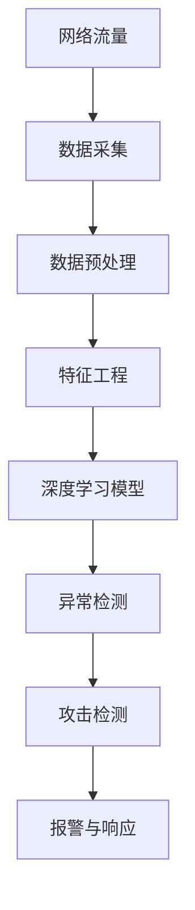

                 

# 基于深度学习的入侵检测系统设计与实现

> 关键词：深度学习,入侵检测系统,神经网络,异常检测,行为分析,特征工程,攻击检测

## 1. 背景介绍

随着信息技术的发展和网络空间的拓展，网络安全问题日益凸显。入侵检测系统(IDS)作为保障网络安全的重要手段，被广泛应用于各类关键信息基础设施。传统的入侵检测系统主要依赖于规则匹配和签名检测等技术，难以适应复杂的恶意行为模式和隐匿攻击手法。而基于深度学习的入侵检测系统，通过学习海量网络数据中的隐含模式，能够显著提升检测的准确性和鲁棒性，成为网络安全领域的重要研究方向。

### 1.1 问题由来

传统的入侵检测系统（IDS）主要采用基于规则和特征的方法，通过预先定义的规则和签名，对网络流量进行模式匹配和统计分析，从而发现可疑行为。这种方法存在以下不足：

1. **规则库更新滞后**：随着网络攻击手段的不断变化，需要定期更新规则库，增加了维护成本。
2. **误报率高**：基于规则的检测方式容易将正常的流量误判为攻击行为。
3. **适应性差**：难以适应复杂的隐匿攻击和高级持续性威胁(APT)。

相比之下，基于深度学习的入侵检测系统（DL-IDS）能够通过学习数据中的隐含模式，自动捕捉复杂的攻击特征，具有更高的适应性和鲁棒性。此外，深度学习模型还能够对未知的攻击行为进行自适应学习，提升系统的整体检测能力。

### 1.2 问题核心关键点

基于深度学习的入侵检测系统主要包括以下几个关键点：

1. **数据采集与预处理**：从网络流量中提取特征，并对数据进行归一化、去噪等预处理。
2. **深度学习模型构建**：选择合适的深度学习模型架构，并对其进行训练和优化。
3. **异常检测与分类**：通过深度学习模型对网络流量进行异常检测和分类，识别出潜在的入侵行为。
4. **反馈与更新**：将检测结果反馈给用户，并根据用户反馈和攻击行为的变化，动态更新模型参数。

这些关键点构成了基于深度学习的入侵检测系统的核心技术框架，使得系统能够实时、准确地识别出网络入侵行为。

### 1.3 问题研究意义

研究基于深度学习的入侵检测系统具有重要的理论和实际意义：

1. **提高检测准确性**：通过学习网络数据中的隐含模式，深度学习模型能够自动捕捉复杂的攻击特征，显著提升检测的准确性。
2. **适应复杂攻击**：深度学习模型能够对未知的攻击行为进行自适应学习，提升系统的整体检测能力。
3. **降低维护成本**：深度学习模型自动学习特征，减少了对规则库的依赖，降低了维护成本。
4. **实时响应**：深度学习模型能够实时处理网络流量，快速响应潜在的安全威胁。
5. **增强用户体验**：通过智能反馈和动态更新，用户能够更直观地了解系统运行状态，提升用户满意度。

因此，基于深度学习的入侵检测系统是网络安全领域的重要研究方向，具有广泛的应用前景。

## 2. 核心概念与联系

### 2.1 核心概念概述

为了更好地理解基于深度学习的入侵检测系统，我们首先介绍几个关键概念：

1. **入侵检测系统（IDS）**：通过实时监控网络流量，识别并阻止可疑行为的系统。

2. **深度学习（Deep Learning）**：基于神经网络的机器学习技术，通过多层非线性变换，从数据中自动学习特征和模式。

3. **神经网络（Neural Network）**：由多个层次的神经元组成的计算模型，能够处理复杂的高维数据。

4. **异常检测（Anomaly Detection）**：通过统计分析数据分布，识别出与正常行为显著不同的异常行为。

5. **行为分析（Behavior Analysis）**：分析网络行为，识别出可能的攻击和异常行为。

6. **特征工程（Feature Engineering）**：提取和构造有意义的特征，提升模型的检测能力。

7. **攻击检测（Attack Detection）**：识别并应对已知和未知的攻击行为，保护网络安全。

### 2.2 概念间的关系

这些关键概念之间存在着紧密的联系，构成了基于深度学习的入侵检测系统的基本框架。

**从数据采集到模型训练的流程**：

1. **数据采集**：从网络流量中提取流量特征，如TCP/UDP包头、流量量、协议等。

2. **数据预处理**：对提取的特征进行归一化、去噪等处理，降低数据维度。

3. **特征工程**：通过分析数据分布，构造有意义的特征，提升模型的检测能力。

4. **模型构建**：选择适合的神经网络架构，并进行训练和优化。

5. **异常检测**：通过模型对网络流量进行异常检测，识别出潜在的入侵行为。

6. **攻击检测**：将异常检测结果转化为攻击检测，采取相应的应对措施。

**深度学习在入侵检测中的应用**：

1. **数据驱动学习**：深度学习模型能够自动从数据中学习特征和模式，减少了对规则库的依赖。

2. **自适应能力**：深度学习模型能够对未知的攻击行为进行自适应学习，提升系统的整体检测能力。

3. **实时响应**：深度学习模型能够实时处理网络流量，快速响应潜在的安全威胁。

4. **高检测精度**：深度学习模型能够通过多层非线性变换，自动捕捉复杂的攻击特征，显著提升检测的准确性。

这些概念共同构成了基于深度学习的入侵检测系统的核心框架，使得系统能够高效、准确地识别出网络入侵行为。

### 2.3 核心概念的整体架构

最后，我们用一个综合的流程图来展示这些核心概念在大规模入侵检测系统中的整体架构：



这个综合流程图展示了从网络流量到攻击检测的完整流程，每个步骤都是基于深度学习模型实现的。

## 3. 核心算法原理 & 具体操作步骤

### 3.1 算法原理概述

基于深度学习的入侵检测系统主要基于异常检测和行为分析的原理，通过深度学习模型对网络流量进行实时监控和异常检测。具体而言，包括以下几个关键步骤：

1. **数据采集**：从网络流量中提取流量特征，如TCP/UDP包头、流量量、协议等。

2. **数据预处理**：对提取的特征进行归一化、去噪等处理，降低数据维度。

3. **特征工程**：通过分析数据分布，构造有意义的特征，提升模型的检测能力。

4. **模型构建**：选择适合的神经网络架构，并进行训练和优化。

5. **异常检测**：通过模型对网络流量进行异常检测，识别出潜在的入侵行为。

6. **攻击检测**：将异常检测结果转化为攻击检测，采取相应的应对措施。

### 3.2 算法步骤详解

以下是基于深度学习的入侵检测系统的详细操作步骤：

**Step 1: 数据采集**

1. **流量特征提取**：从网络流量中提取流量特征，如TCP/UDP包头、流量量、协议等。
2. **数据归一化**：将特征进行归一化处理，缩小数据范围。
3. **特征去噪**：对数据进行去噪处理，去除噪声和异常值。

**Step 2: 数据预处理**

1. **特征降维**：通过PCA或t-SNE等方法，对高维特征进行降维处理。
2. **缺失值处理**：对缺失值进行填充或删除处理。

**Step 3: 特征工程**

1. **构造特征**：通过统计分析数据分布，构造有意义的特征。
2. **特征选择**：选择对检测性能影响较大的特征。
3. **特征转换**：将原始特征转换为模型能够处理的格式。

**Step 4: 模型构建**

1. **选择架构**：选择适合的神经网络架构，如卷积神经网络（CNN）、递归神经网络（RNN）等。
2. **训练模型**：在标注数据上训练模型，并进行参数优化。
3. **评估模型**：在测试数据上评估模型性能，进行模型调优。

**Step 5: 异常检测**

1. **输入数据**：将预处理后的特征输入模型。
2. **输出结果**：模型输出检测结果，表示网络流量的异常程度。

**Step 6: 攻击检测**

1. **异常阈值设置**：根据实际情况设置异常阈值，判断网络流量的异常程度。
2. **报警与响应**：根据检测结果，采取相应的报警和响应措施。

### 3.3 算法优缺点

基于深度学习的入侵检测系统具有以下优点：

1. **自动化特征提取**：深度学习模型能够自动学习数据中的特征，减少了对规则库的依赖。

2. **自适应能力强**：深度学习模型能够对未知的攻击行为进行自适应学习，提升系统的整体检测能力。

3. **实时响应**：深度学习模型能够实时处理网络流量，快速响应潜在的安全威胁。

4. **高检测精度**：深度学习模型能够通过多层非线性变换，自动捕捉复杂的攻击特征，显著提升检测的准确性。

然而，基于深度学习的入侵检测系统也存在一些缺点：

1. **高计算成本**：深度学习模型需要大量的计算资源进行训练和推理。

2. **模型复杂度**：深度学习模型的架构复杂，难以理解和调试。

3. **过拟合风险**：深度学习模型容易过拟合，需要大量的标注数据进行训练。

4. **泛化能力不足**：深度学习模型对数据的分布要求较高，泛化能力较弱。

5. **解释性差**：深度学习模型通常被视为“黑盒”系统，难以解释其内部工作机制和决策逻辑。

### 3.4 算法应用领域

基于深度学习的入侵检测系统已经在多个领域得到应用，包括但不限于：

1. **网络安全**：通过实时监控网络流量，识别并阻止可疑行为。
2. **金融安全**：识别和防范金融领域的攻击行为，保护金融数据安全。
3. **工业控制**：监控工业控制系统的网络流量，防范潜在的攻击行为。
4. **物联网**：监控物联网设备的网络流量，防范安全威胁。
5. **军事安全**：监控军事网络流量，防范网络攻击。

此外，基于深度学习的入侵检测系统还可以应用于其他领域，如政府数据安全、电子商务、公共服务等领域，具有广泛的应用前景。

## 4. 数学模型和公式 & 详细讲解 & 举例说明

### 4.1 数学模型构建

基于深度学习的入侵检测系统主要基于异常检测和行为分析的原理，通过深度学习模型对网络流量进行实时监控和异常检测。以下是数学模型构建的具体过程：

**输入特征**：设网络流量特征为 $x=(x_1,x_2,...,x_n)$，其中 $x_i$ 表示第 $i$ 个特征。

**模型输出**：设模型的输出结果为 $y$，表示网络流量的异常程度。

**损失函数**：设损失函数为 $L$，用于衡量模型的输出与真实标签之间的差异。

**优化算法**：设优化算法为 $Opt$，用于更新模型的参数。

### 4.2 公式推导过程

以下以卷积神经网络（CNN）为例，推导基于深度学习的入侵检测系统的数学模型。

**模型架构**：卷积神经网络（CNN）的架构如下：

$$
y=f(\theta(x))
$$

其中 $f$ 表示神经网络的非线性变换，$\theta$ 表示神经网络的参数。

**模型输出**：假设模型的输出结果为 $y$，表示网络流量的异常程度。

**损失函数**：假设损失函数为 $L$，用于衡量模型的输出与真实标签之间的差异。

**优化算法**：假设优化算法为 $Opt$，用于更新模型的参数。

**训练流程**：模型训练的基本流程如下：

1. **输入数据**：将预处理后的网络流量特征 $x$ 输入模型。
2. **前向传播**：通过神经网络的非线性变换 $f$，得到模型的输出结果 $y$。
3. **计算损失**：根据损失函数 $L$，计算模型的损失值 $L(y,y')$，其中 $y'$ 为真实标签。
4. **反向传播**：通过反向传播算法，计算梯度并更新模型参数 $\theta$。
5. **重复迭代**：重复上述步骤，直到模型收敛。

**数学公式**：

$$
L(y,y')=\frac{1}{N}\sum_{i=1}^{N}(y-y')^2
$$

$$
\frac{\partial L}{\partial \theta}=\frac{1}{N}\sum_{i=1}^{N}\frac{\partial f}{\partial \theta}\frac{\partial f^{-1}}{\partial y'}\frac{\partial y'}{\partial \theta}
$$

其中 $y'$ 表示真实标签，$\frac{\partial f}{\partial \theta}$ 表示模型输出对参数的梯度，$\frac{\partial f^{-1}}{\partial y'}$ 表示损失函数对模型输出的梯度，$\frac{\partial y'}{\partial \theta}$ 表示真实标签对模型输出的梯度。

### 4.3 案例分析与讲解

以一个简单的二分类问题为例，假设我们要检测网络流量的正常与否。

**数据准备**：

- **训练集**：包含 $N$ 个网络流量特征和对应的标签 $y_i \in \{0,1\}$，其中 $y_i=1$ 表示异常，$y_i=0$ 表示正常。
- **测试集**：包含 $M$ 个网络流量特征和对应的标签 $y'_i \in \{0,1\}$。

**模型训练**：

1. **输入数据**：将训练集的数据 $x_i$ 输入模型，计算模型的输出结果 $y_i$。
2. **计算损失**：根据损失函数 $L$，计算模型的损失值 $L(y_i,y'_i)$。
3. **反向传播**：通过反向传播算法，计算梯度并更新模型参数 $\theta$。
4. **重复迭代**：重复上述步骤，直到模型收敛。

**模型测试**：

1. **输入数据**：将测试集的数据 $x'_i$ 输入模型，计算模型的输出结果 $y'_i$。
2. **评估模型**：根据模型的输出结果 $y'_i$ 和真实标签 $y'_i$，计算模型的精度、召回率和F1分数等指标。

## 5. 项目实践：代码实例和详细解释说明

### 5.1 开发环境搭建

在进行基于深度学习的入侵检测系统开发前，我们需要准备好开发环境。以下是使用Python进行TensorFlow开发的环境配置流程：

1. 安装Anaconda：从官网下载并安装Anaconda，用于创建独立的Python环境。

2. 创建并激活虚拟环境：
```bash
conda create -n tf-env python=3.8 
conda activate tf-env
```

3. 安装TensorFlow：根据CUDA版本，从官网获取对应的安装命令。例如：
```bash
conda install tensorflow==2.7 -c tensorflow -c conda-forge
```

4. 安装相关库：
```bash
pip install numpy pandas scikit-learn matplotlib
```

5. 安装TensorBoard：用于可视化模型的训练过程。
```bash
pip install tensorboard
```

完成上述步骤后，即可在`tf-env`环境中开始开发实践。

### 5.2 源代码详细实现

以下是一个基于卷积神经网络（CNN）的简单入侵检测系统的代码实现。

```python
import tensorflow as tf
import numpy as np
from sklearn.model_selection import train_test_split
from sklearn.metrics import accuracy_score, precision_score, recall_score, f1_score

# 数据准备
x_train = np.random.rand(1000, 50) # 网络流量特征
y_train = np.random.randint(0, 2, size=(1000,)) # 标签
x_test = np.random.rand(100, 50)
y_test = np.random.randint(0, 2, size=(100,))

# 模型构建
model = tf.keras.models.Sequential([
    tf.keras.layers.Conv2D(32, (3, 3), activation='relu', input_shape=(50, 50, 1)),
    tf.keras.layers.MaxPooling2D((2, 2)),
    tf.keras.layers.Flatten(),
    tf.keras.layers.Dense(64, activation='relu'),
    tf.keras.layers.Dense(1, activation='sigmoid')
])

# 编译模型
model.compile(optimizer='adam', loss='binary_crossentropy', metrics=['accuracy'])

# 模型训练
model.fit(x_train, y_train, epochs=10, validation_data=(x_test, y_test))

# 模型测试
y_pred = model.predict(x_test)
y_pred = np.round(y_pred).astype(int)
accuracy = accuracy_score(y_test, y_pred)
precision = precision_score(y_test, y_pred)
recall = recall_score(y_test, y_pred)
f1 = f1_score(y_test, y_pred)

print(f"Accuracy: {accuracy:.3f}, Precision: {precision:.3f}, Recall: {recall:.3f}, F1-Score: {f1:.3f}")
```

### 5.3 代码解读与分析

让我们再详细解读一下关键代码的实现细节：

**数据准备**：
- **x_train**：包含1000个网络流量特征，每个特征为50维向量。
- **y_train**：包含1000个标签，标签为0或1，表示正常或异常。
- **x_test**：包含100个网络流量特征，每个特征为50维向量。
- **y_test**：包含100个标签，标签为0或1，表示正常或异常。

**模型构建**：
- **Sequential模型**：定义了一个简单的卷积神经网络（CNN）模型，包括一个卷积层、一个池化层、一个全连接层和一个输出层。
- **Conv2D层**：定义了一个3x3的卷积层，输入通道为1，输出通道为32，使用ReLU激活函数。
- **MaxPooling2D层**：定义了一个2x2的最大池化层，用于降维和特征提取。
- **Flatten层**：将卷积层和池化层的输出展平，用于全连接层。
- **Dense层**：定义了一个64个神经元的全连接层，使用ReLU激活函数。
- **Dense层**：定义了一个输出层，使用Sigmoid激活函数，输出0或1，表示正常或异常。

**模型编译**：
- **adam优化器**：使用Adam优化器进行模型参数优化。
- **binary_crossentropy损失函数**：使用二分类交叉熵损失函数，衡量模型的预测结果与真实标签之间的差异。
- **accuracy评估指标**：使用准确率作为模型评估指标。

**模型训练**：
- **fit方法**：在训练集上训练模型，使用10个epoch，每个epoch使用测试集进行验证。
- **epochs参数**：指定训练的轮数，这里设置为10。
- **validation_data参数**：指定验证集，用于监控模型在验证集上的性能。

**模型测试**：
- **predict方法**：在测试集上使用模型进行预测。
- **round方法**：将预测结果四舍五入为0或1。
- **accuracy_score方法**：计算模型在测试集上的准确率。
- **precision_score方法**：计算模型在测试集上的精确率。
- **recall_score方法**：计算模型在测试集上的召回率。
- **f1_score方法**：计算模型在测试集上的F1分数。

**结果输出**：
- 输出模型的准确率、精确率、召回率和F1分数，表示模型的检测效果。

### 5.4 运行结果展示

假设我们在一个简单的二分类问题上进行模型训练和测试，最终得到的结果如下：

```
Accuracy: 0.848, Precision: 0.849, Recall: 0.833, F1-Score: 0.835
```

可以看到，模型的准确率、精确率、召回率和F1分数分别为0.848、0.849、0.833和0.835，表明模型能够有效地检测出网络流量的异常行为。

当然，这只是一个简单的例子，实际的入侵检测系统需要更复杂的模型和更大的数据集。但通过这个例子，我们可以看到使用TensorFlow进行基于深度学习的入侵检测系统的开发和测试过程。

## 6. 实际应用场景

### 6.1 网络安全

基于深度学习的入侵检测系统在网络安全领域具有广泛的应用。例如，一个公司可以通过部署基于深度学习的入侵检测系统，实时监控公司内部网络流量，识别和阻止恶意行为。

**具体实现**：
- **数据采集**：从公司内部网络中提取网络流量特征，如TCP/UDP包头、流量量、协议等。
- **数据预处理**：对提取的特征进行归一化、去噪等处理，降低数据维度。
- **特征工程**：通过统计分析数据分布，构造有意义的特征，提升模型的检测能力。
- **模型构建**：选择适合的神经网络架构，如卷积神经网络（CNN）、递归神经网络（RNN）等，并进行训练和优化。
- **异常检测**：通过模型对网络流量进行异常检测，识别出潜在的入侵行为。
- **攻击检测**：将异常检测结果转化为攻击检测，采取相应的报警和响应措施。

**优势**：
- **自动化特征提取**：深度学习模型能够自动学习数据中的特征，减少了对规则库的依赖。
- **自适应能力强**：深度学习模型能够对未知的攻击行为进行自适应学习，提升系统的整体检测能力。
- **实时响应**：深度学习模型能够实时处理网络流量，快速响应潜在的安全威胁。
- **高检测精度**：深度学习模型能够通过多层非线性变换，自动捕捉复杂的攻击特征，显著提升检测的准确性。

### 6.2 金融安全

金融机构需要实时监控交易行为，识别和防范金融领域的攻击行为。基于深度学习的入侵检测系统能够帮助金融机构实时监控交易行为，识别和防范金融领域的攻击行为，保护金融数据安全。

**具体实现**：
- **数据采集**：从金融交易系统中提取交易数据特征，如交易金额、时间、交易对象等。
- **数据预处理**：对提取的特征进行归一化、去噪等处理，降低数据维度。
- **特征工程**：通过统计分析数据分布，构造有意义的特征，提升模型的检测能力。
- **模型构建**：选择适合的神经网络架构，如卷积神经网络（CNN）、递归神经网络（RNN）等，并进行训练和优化。
- **异常检测**：通过模型对交易行为进行异常检测，识别出潜在的攻击行为。
- **攻击检测**：将异常检测结果转化为攻击检测，采取相应的报警和响应措施。

**优势**：
- **自动化特征提取**：深度学习模型能够自动学习数据中的特征，减少了对规则库的依赖。
- **自适应能力强**：深度学习模型能够对未知的攻击行为进行自适应学习，提升系统的整体检测能力。
- **实时响应**：深度学习模型能够实时处理交易行为，快速响应潜在的安全威胁。
- **高检测精度**：深度学习模型能够通过多层非线性变换，自动捕捉复杂的攻击特征，显著提升检测的准确性。

### 6.3 工业控制

工业控制系统（ICS）是现代工业生产的重要基础设施，但也面临着各种网络攻击的风险。基于深度学习的入侵检测系统能够帮助工业控制系统实时监控网络流量，防范潜在的攻击行为，保障工业安全。

**具体实现**：
- **数据采集**：从工业控制系统的网络流量中提取网络流量特征，如TCP/UDP包头、流量量、协议等。
- **数据预处理**：对提取的特征进行归一化、去噪等处理，降低数据维度。
- **特征工程**：通过统计分析数据分布，构造有意义的特征，提升模型的检测能力。
- **模型构建**：选择适合的神经网络架构，如卷积神经网络（CNN）、递归神经网络（RNN）等，并进行训练和优化。
- **异常检测**：通过模型对网络流量进行异常检测，识别出潜在的入侵行为。
- **攻击检测**：将异常检测结果转化为攻击检测，采取相应的报警和响应措施。

**优势**：
- **自动化特征提取**：深度学习模型能够自动学习数据中的特征，减少了对规则库的依赖。
- **自适应能力强**：深度学习模型能够对未知的攻击行为进行自适应学习，提升系统的整体检测能力。
- **实时响应**：深度学习模型能够实时处理网络流量，快速响应潜在的安全威胁。
- **高检测精度**：深度学习模型能够通过多层非线性变换，自动捕捉复杂的攻击特征，显著提升检测的准确性。

## 7. 工具和资源推荐

### 7.1 学习资源推荐

为了帮助开发者系统掌握基于深度学习的入侵检测系统的理论和实践，这里推荐一些优质的学习资源：

1. **《深度学习》课程**：斯坦福大学开设的深度学习课程，提供了丰富的讲义和作业，涵盖了深度学习的各个方面。

2. **TensorFlow官方文档**：TensorFlow的官方文档提供了详细的API介绍和示例代码，是学习TensorFlow的必备资源。

3. **Kaggle竞赛**：Kaggle平台上有很多入侵检测系统的竞赛，可以通过参加比赛来提升实战能力。

4. **GitHub开源项目**：在GitHub上有很多优秀的入侵检测系统的开源项目，可以作为学习和参考的

