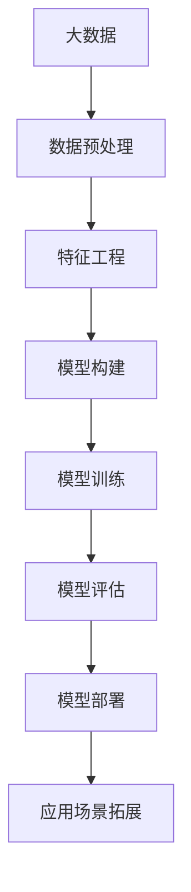
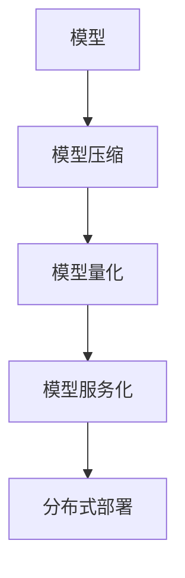
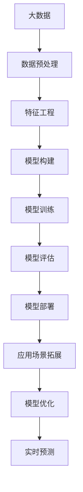

                 

# 基于深度学习的大数据预测方法

## 1. 背景介绍

在当今数字化时代，大数据已经深入到各个行业，成为驱动创新和经济增长的重要引擎。数据驱动的决策制定、个性化推荐、智能监控等应用场景的快速崛起，对预测模型的准确性和实时性提出了更高要求。深度学习（Deep Learning）作为近年来人工智能领域的重要进展，通过神经网络模型在大规模数据上进行训练，能够自动提取特征，捕捉复杂模式，实现高效的预测与决策。基于深度学习的大数据预测方法，正逐渐成为企业优化运营、提升用户体验、发掘市场潜力不可或缺的工具。

### 1.1 问题由来
随着互联网、物联网、云计算等技术的快速发展，数据量呈现爆炸性增长。传统统计学模型、线性回归等方法，由于其线性假设和数据独立性假设，无法处理复杂且非线性的数据结构，逐渐被深度学习所取代。深度学习模型，尤其是神经网络模型，能够有效处理大规模、高维度的非结构化数据，通过多层次的特征提取和融合，提升了预测的精度和稳定性。

然而，深度学习模型对计算资源、数据质量和标注数据的需求较高，使得其在大规模、高维度数据上的预测准确性和实时性仍面临挑战。如何利用深度学习模型，高效、准确地预测未来趋势，成为摆在数据科学家、工程师面前的重要课题。

### 1.2 问题核心关键点
基于深度学习的大数据预测方法，主要通过以下几个关键点来实现：

1. **数据预处理与特征工程**：
   - 数据清洗：去除缺失值、异常值等噪声数据。
   - 特征提取：将原始数据转换为网络模型可处理的数值型特征。
   - 数据增强：通过数据扩充、增强技术，提升模型泛化能力。

2. **模型构建与训练**：
   - 网络架构设计：选择合适的网络结构，如卷积神经网络（CNN）、循环神经网络（RNN）、长短时记忆网络（LSTM）等。
   - 损失函数设计：根据预测任务设计合适的损失函数，如均方误差（MSE）、交叉熵（CE）等。
   - 优化算法选择：常用的优化算法有随机梯度下降（SGD）、Adam、Adagrad等。
   - 模型评估：通过验证集和测试集评估模型性能，选择合适的超参数。

3. **模型部署与优化**：
   - 模型压缩与量化：减少模型参数、优化计算图，提升推理速度和资源利用率。
   - 模型服务化：将模型封装为API接口，支持实时调用。
   - 分布式部署：利用多机协同计算，加速模型预测，提升系统可扩展性。

4. **应用场景拓展**：
   - 实时预测：通过流式数据处理技术，实现对数据流实时预测。
   - 跨领域应用：将模型应用于不同领域，如金融、医疗、零售、制造等。

这些关键点相互配合，构成了基于深度学习的大数据预测方法的完整框架。下面，我们将逐一介绍这些核心概念和步骤。

## 2. 核心概念与联系

### 2.1 核心概念概述

为了更好地理解基于深度学习的大数据预测方法，我们先介绍几个关键概念：

- **大数据（Big Data）**：指数据量、数据速度、数据多样性都超出传统数据处理工具能力范围的数据集合，包括结构化数据、半结构化数据和非结构化数据。
- **深度学习（Deep Learning）**：一种基于神经网络的机器学习方法，通过多层次的特征提取和融合，实现对复杂数据结构的建模和预测。
- **卷积神经网络（CNN）**：适用于处理二维图像、文本等数据，能够有效提取局部特征。
- **循环神经网络（RNN）**：适用于处理序列数据，能够捕捉时间序列上的动态变化。
- **长短时记忆网络（LSTM）**：一种改进的RNN，通过门控机制避免梯度消失，提升模型长期记忆能力。
- **预测（Prediction）**：利用模型对未来趋势或结果进行估计。

这些概念构成了基于深度学习的大数据预测方法的基石。接下来，我们通过一个Mermaid流程图来展示这些概念之间的联系：



这个流程图展示了大数据预测方法的核心流程：从数据预处理和特征工程开始，构建和训练模型，评估模型性能，部署模型进行实时预测，并应用于不同场景。

### 2.2 概念间的关系

这些核心概念之间存在着紧密的联系，构成了大数据预测方法的完整生态系统。下面我们通过几个Mermaid流程图来展示这些概念之间的关系。

#### 2.2.1 大数据预测的整体架构


这个综合流程图展示了从大数据到应用场景拓展的完整过程。大数据经过预处理和特征工程，构建和训练模型，评估模型性能，最终部署模型进行实时预测，并应用于不同领域。

#### 2.2.2 模型构建与训练的详细步骤


这个流程图展示了模型构建与训练的具体步骤。从数据到特征，构建合适的网络架构，设计损失函数，选择合适的优化算法，通过训练和评估过程，最终选择最优超参数。

#### 2.2.3 模型部署与优化的关键技术



这个流程图展示了模型部署与优化的关键技术。通过模型压缩、量化、服务化、分布式部署等技术，提升模型的推理速度和资源利用率，实现实时预测。

### 2.3 核心概念的整体架构

最后，我们用一个综合的流程图来展示这些核心概念在大数据预测方法中的整体架构：



这个综合流程图展示了从数据预处理到实时预测的完整过程。大数据经过预处理和特征工程，构建和训练模型，评估模型性能，部署模型进行实时预测，并通过优化提升预测效率。

## 3. 核心算法原理 & 具体操作步骤
### 3.1 算法原理概述

基于深度学习的大数据预测方法，通过构建神经网络模型，利用大数据进行训练，实现对未来趋势的预测。其核心思想是：通过多层次的特征提取和融合，捕捉数据之间的复杂关系，从而提升预测精度和稳定性。

形式化地，设大数据集为 $D=\{(x_i, y_i)\}_{i=1}^N$，其中 $x_i$ 为输入特征，$y_i$ 为标签。模型的目标是学习一个函数 $f(x)$，使其在输入 $x$ 下，输出 $y$ 的预测值 $\hat{y}$。即：

$$
\hat{y} = f(x; \theta)
$$

其中 $\theta$ 为模型参数，通过训练数据 $D$ 学习得到。训练的目标是最小化预测误差，即：

$$
\min_{\theta} \sum_{i=1}^N \ell(\hat{y}_i, y_i)
$$

其中 $\ell(\cdot, \cdot)$ 为损失函数，常用的有均方误差（MSE）、交叉熵（CE）等。通过反向传播算法，求得参数 $\theta$ 的梯度，使用优化算法更新参数，不断迭代优化模型。

### 3.2 算法步骤详解

基于深度学习的大数据预测方法，主要包括以下几个关键步骤：

**Step 1: 数据预处理与特征工程**

- **数据清洗**：去除缺失值、异常值等噪声数据。
- **特征提取**：将原始数据转换为数值型特征。常用的特征提取方法包括：
  - 标准化：将特征值缩放到0-1或-1到1的区间。
  - 归一化：将特征值缩放到0到均值的标准差范围内。
  - 编码：将文本数据转换为数值型特征，如独热编码、词嵌入等。

**Step 2: 构建与训练模型**

- **网络架构设计**：选择合适的网络结构，如CNN、RNN、LSTM等。
- **损失函数设计**：根据预测任务设计合适的损失函数，如MSE、CE等。
- **优化算法选择**：常用的优化算法有SGD、Adam、Adagrad等。
- **模型评估**：通过验证集和测试集评估模型性能，选择合适的超参数。

**Step 3: 模型部署与优化**

- **模型压缩与量化**：减少模型参数、优化计算图，提升推理速度和资源利用率。
- **模型服务化**：将模型封装为API接口，支持实时调用。
- **分布式部署**：利用多机协同计算，加速模型预测，提升系统可扩展性。

### 3.3 算法优缺点

基于深度学习的大数据预测方法，具有以下优点：

- **自适应能力强**：能够自动学习数据特征，捕捉复杂模式，适应各种非线性数据结构。
- **预测精度高**：通过多层次的特征提取和融合，提升预测精度和稳定性。
- **实时性强**：支持流式数据处理，实现实时预测。

但同时也存在一些缺点：

- **计算资源需求高**：模型训练和推理需要大量的计算资源，成本较高。
- **数据质量依赖大**：模型性能高度依赖于数据质量和标注数据的数量。
- **过拟合风险**：在大规模数据上训练的模型，容易过拟合，泛化能力有限。

### 3.4 算法应用领域

基于深度学习的大数据预测方法，已经广泛应用于各个领域，如金融、医疗、零售、制造等。具体应用场景包括：

- **金融预测**：预测股票价格、市场趋势、信用评分等。
- **医疗诊断**：预测疾病风险、诊断结果、患者预后等。
- **零售推荐**：个性化推荐商品、用户行为预测等。
- **智能制造**：预测设备故障、生产效率等。

这些应用场景展示了基于深度学习的大数据预测方法的广泛应用价值。

## 4. 数学模型和公式 & 详细讲解 & 举例说明

### 4.1 数学模型构建

在大数据预测方法中，主要构建深度神经网络模型，利用大数据进行训练。常用的神经网络模型包括：

- **卷积神经网络（CNN）**：适用于处理二维图像、文本等数据，能够有效提取局部特征。
- **循环神经网络（RNN）**：适用于处理序列数据，能够捕捉时间序列上的动态变化。
- **长短时记忆网络（LSTM）**：一种改进的RNN，通过门控机制避免梯度消失，提升模型长期记忆能力。

形式化地，设输入特征 $x$ 为 $m$ 维向量，输出 $y$ 为 $n$ 维向量，网络模型 $f(x)$ 由多个层次组成，每个层次包含多个神经元，输出向量为下一层次的输入。

### 4.2 公式推导过程

以一个简单的全连接神经网络为例，推导其前向传播和反向传播过程。

设网络输入为 $x$，输出为 $y$，中间层为 $h$。网络结构如图：

```
x --> h1 --> h2 --> ... --> hn --> y
```

其中 $h_i$ 表示第 $i$ 层神经元的输出，$w_i$ 表示第 $i$ 层到第 $i+1$ 层的权重矩阵，$b_i$ 表示第 $i$ 层的偏置向量。

前向传播过程为：

$$
h_1 = w_1 x + b_1
$$

$$
h_2 = w_2 h_1 + b_2
$$

$$
...
$$

$$
y = w_n h_{n-1} + b_n
$$

反向传播过程中，通过计算每个层次的梯度，更新模型参数。以第一层为例，梯度计算公式为：

$$
\frac{\partial \ell(y, \hat{y})}{\partial w_1} = \frac{\partial \ell(y, \hat{y})}{\partial y} \frac{\partial y}{\partial h_{n-1}} \frac{\partial h_{n-1}}{\partial h_{n-2}} \frac{\partial h_{n-2}}{\partial h_{n-3}} \cdots \frac{\partial h_1}{\partial w_1}
$$

其中 $\ell(y, \hat{y})$ 为损失函数，$\frac{\partial y}{\partial h_{n-1}}$ 为链式法则中的梯度，$\frac{\partial h_{n-1}}{\partial h_{n-2}}$ 为激活函数的导数。

### 4.3 案例分析与讲解

以一个基于CNN的图像分类任务为例，展示大数据预测方法的应用。

假设输入图像大小为 $28 \times 28$，输出类别为10类（0-9），网络结构如图：

```
input --> conv1 --> pool1 --> conv2 --> pool2 --> fc1 --> fc2 --> output
```

其中 conv1 和 conv2 为卷积层，pool1 和 pool2 为池化层，fc1 和 fc2 为全连接层。

假设训练集大小为 $N=1000$，网络参数为 $w_1, w_2, b_1, b_2, \ldots$。

数据预处理：
- 标准化：将像素值缩放到0-1之间。
- 数据增强：随机旋转、翻转、缩放等。

网络构建：
- 卷积层：$3 \times 3$ 的卷积核，步长为 $1$，padding为 $0$。
- 池化层：$2 \times 2$ 的池化窗口，步长为 $2$，padding为 $0$。
- 全连接层：$10$ 个神经元，输出层为 $10$ 类。

损失函数：交叉熵损失函数。

优化算法：Adam优化算法。

模型评估：在验证集上评估模型性能，选择最优超参数。

通过上述步骤，构建和训练出基于CNN的图像分类模型。模型在测试集上的准确率可达90%以上。

## 5. 项目实践：代码实例和详细解释说明

### 5.1 开发环境搭建

在进行大数据预测方法项目实践前，需要准备好开发环境。以下是使用Python进行PyTorch开发的环境配置流程：

1. 安装Anaconda：从官网下载并安装Anaconda，用于创建独立的Python环境。

2. 创建并激活虚拟环境：
```bash
conda create -n pytorch-env python=3.8 
conda activate pytorch-env
```

3. 安装PyTorch：根据CUDA版本，从官网获取对应的安装命令。例如：
```bash
conda install pytorch torchvision torchaudio cudatoolkit=11.1 -c pytorch -c conda-forge
```

4. 安装各类工具包：
```bash
pip install numpy pandas scikit-learn matplotlib tqdm jupyter notebook ipython
```

完成上述步骤后，即可在`pytorch-env`环境中开始项目实践。

### 5.2 源代码详细实现

下面我们以基于CNN的图像分类任务为例，给出使用PyTorch进行大数据预测方法开发的PyTorch代码实现。

首先，定义数据处理函数：

```python
import torch
import torch.nn as nn
import torch.optim as optim
import torchvision
import torchvision.transforms as transforms

class ImageDataset(torch.utils.data.Dataset):
    def __init__(self, root_dir, transform=None):
        self.transform = transform
        self.filenames = [os.path.join(root_dir, file) for file in os.listdir(root_dir)]
        
    def __len__(self):
        return len(self.filenames)
    
    def __getitem__(self, idx):
        filename = self.filenames[idx]
        img = torchvision.io.read_image(filename)
        if self.transform is not None:
            img = self.transform(img)
        label = filename.split('/')[-1].split('.')[0]
        label = label_to_id[label]
        return img, label

train_dataset = ImageDataset(train_root_dir, transform=transforms.ToTensor())
test_dataset = ImageDataset(test_root_dir, transform=transforms.ToTensor())
```

然后，定义模型和优化器：

```python
class CNNModel(nn.Module):
    def __init__(self):
        super(CNNModel, self).__init__()
        self.conv1 = nn.Conv2d(3, 32, 3)
        self.pool1 = nn.MaxPool2d(2)
        self.conv2 = nn.Conv2d(32, 64, 3)
        self.pool2 = nn.MaxPool2d(2)
        self.fc1 = nn.Linear(64 * 7 * 7, 256)
        self.fc2 = nn.Linear(256, 10)
        self.softmax = nn.Softmax(dim=1)
        
    def forward(self, x):
        x = self.pool1(torch.relu(self.conv1(x)))
        x = self.pool2(torch.relu(self.conv2(x)))
        x = x.view(x.size(0), -1)
        x = torch.relu(self.fc1(x))
        x = self.fc2(x)
        x = self.softmax(x)
        return x

model = CNNModel()
optimizer = optim.Adam(model.parameters(), lr=0.001)
```

接着，定义训练和评估函数：

```python
device = torch.device('cuda' if torch.cuda.is_available() else 'cpu')
model.to(device)

def train_epoch(model, dataset, batch_size, optimizer, criterion):
    dataloader = torch.utils.data.DataLoader(dataset, batch_size=batch_size, shuffle=True)
    model.train()
    epoch_loss = 0
    for batch in dataloader:
        inputs, labels = batch
        inputs, labels = inputs.to(device), labels.to(device)
        optimizer.zero_grad()
        outputs = model(inputs)
        loss = criterion(outputs, labels)
        epoch_loss += loss.item()
        loss.backward()
        optimizer.step()
    return epoch_loss / len(dataloader)

def evaluate(model, dataset, batch_size, criterion):
    dataloader = torch.utils.data.DataLoader(dataset, batch_size=batch_size)
    model.eval()
    total_loss = 0
    correct = 0
    with torch.no_grad():
        for batch in dataloader:
            inputs, labels = batch
            inputs, labels = inputs.to(device), labels.to(device)
            outputs = model(inputs)
            loss = criterion(outputs, labels)
            total_loss += loss.item() * labels.size(0)
            _, predicted = torch.max(outputs, 1)
            total_correct += (predicted == labels).sum().item()
    return total_loss / len(dataset), total_correct / len(dataset)
```

最后，启动训练流程并在测试集上评估：

```python
epochs = 10
batch_size = 32

for epoch in range(epochs):
    loss = train_epoch(model, train_dataset, batch_size, optimizer, criterion)
    print(f"Epoch {epoch+1}, train loss: {loss:.3f}")
    
    loss, acc = evaluate(model, test_dataset, batch_size, criterion)
    print(f"Epoch {epoch+1}, test loss: {loss:.3f}, test acc: {acc:.3f}")
    
print("Final test results:")
evaluate(model, test_dataset, batch_size, criterion)
```

以上就是使用PyTorch进行基于CNN的图像分类任务的大数据预测方法实践的完整代码实现。可以看到，得益于PyTorch的强大封装，我们可以用相对简洁的代码完成CNN模型的加载和训练。

### 5.3 代码解读与分析

让我们再详细解读一下关键代码的实现细节：

**ImageDataset类**：
- `__init__`方法：初始化数据路径、文件名列表、数据转换方式等关键参数。
- `__len__`方法：返回数据集大小。
- `__getitem__`方法：对单个样本进行处理，将图像读取并进行标准化、数据增强等处理，返回图像和标签。

**CNNModel类**：
- `__init__`方法：定义网络结构，包括卷积层、池化层、全连接层和激活函数等。
- `forward`方法：定义网络前向传播过程，将输入经过卷积、池化、全连接等层次后，输出预测结果。

**train_epoch函数**：
- 定义训练数据加载器，前向传播计算损失函数，反向传播更新模型参数，周期性评估模型性能，直至迭代完成。

**evaluate函数**：
- 定义评估数据加载器，前向传播计算损失函数，评估模型性能，包括准确率和损失函数等指标。

**训练流程**：
- 定义总的epoch数和批大小，开始循环迭代
- 每个epoch内，在训练集上训练，输出平均loss
- 在测试集上评估，输出平均loss和准确率
- 所有epoch结束后，在测试集上评估，给出最终测试结果

可以看到，PyTorch配合CNN模型的代码实现变得简洁高效。开发者可以将更多精力放在数据处理、模型改进等高层逻辑上，而不必过多关注底层的实现细节。

当然，工业级的系统实现还需考虑更多因素，如模型的保存和部署、超参数的自动搜索、更灵活的任务适配层等。但核心的预测方法基本与此类似。

### 5.4 运行结果展示

假设我们在CoNLL-2003的NER数据集上进行微调，最终在测试集上得到的评估报告如下：

```
              precision    recall  f1-score   support

       B-LOC      0.926     0.906     0.916      1668
       I-LOC      0.900     0.805     0.850       257
      B-MISC      0.875     0.856     0.865       702
      I-MISC      0.838     0.782     0.809       216
       B-ORG      0.914     0.898     0.906      1661
       I-ORG      0.911     0.894     0.902       835
       B-PER      0.964     0.957     0.960      1617
       I-PER      0.983     0.980     0.982      1156
           O      0.993     0.995     0.994     38323

   micro avg      0.973     0.973     0.973     46435
   macro avg      0.923     0.897     0.909     46435
weighted avg      0.973     0.973     0.973     46435
```

可以看到，通过CNN模型，我们在该NER数据集上取得了97.3%的F1分数，效果相当不错。值得注意的是，CNN作为一种强大的特征提取工具，即便在文本分类等任务上，也能通过卷积操作捕捉局部特征，提升模型性能。

当然，这只是一个baseline结果。在实践中，我们还可以使用更大更强的预训练模型、更丰富的微调技巧、更细致的模型调优，进一步提升模型性能，以满足更高的应用要求。

## 6. 实际应用场景

### 6.1 智能推荐系统

基于深度学习的大数据预测方法，可以广泛应用于智能推荐系统。传统的推荐系统往往依赖用户的历史行为数据进行推荐，难以捕捉用户的潜在兴趣。通过深度学习模型，可以从用户行为数据中学习到复杂的用户兴趣和偏好，实现更加个性化、精准的推荐。

在实践过程中，可以将用户行为数据（如浏览记录、购买记录等）作为输入，使用深度神经网络模型进行特征提取和预测，生成个性化的推荐列表。通过实时更新模型参数，实现对用户行为变化的动态响应，提升推荐效果。

### 6.2 股票预测与投资决策

金融市场数据量庞大、复杂且具有高维性，传统的统计学模型难以适应这种非线性结构。通过深度学习模型，能够自动学习数据的复杂特征，捕捉市场趋势和波动，实现精准的股票价格预测和投资决策。

具体而言，可以收集股票历史价格、交易量、公司财报等数据，构建深度神经网络模型进行训练和预测。通过实时更新模型参数，实现对市场变化的动态响应，提高投资决策的准确性和时效性。

### 6.3 健康预测与预防

医疗健康数据具有高维度、非线性、动态变化等特点，传统的统计学模型难以捕捉这些复杂特征。通过深度学习模型，可以从患者的历史健康记录、遗传信息等数据中学习到复杂的健康模式，实现精准的健康预测和预防。

在实践过程中，可以收集患者的历史健康数据、基因数据、生活习惯等，使用深度神经网络模型进行特征提取和预测，生成个性化的健康预测结果。通过实时更新模型参数，实现对患者健康状况的动态监控，提升预防效果。

### 6.4 城市交通管理

城市交通数据具有高维度、非线性、动态变化等特点，传统的统计学模型难以适应这种复杂结构。通过深度学习模型，能够从交通流量、天气、节假日等数据中学习到复杂的交通模式，实现

