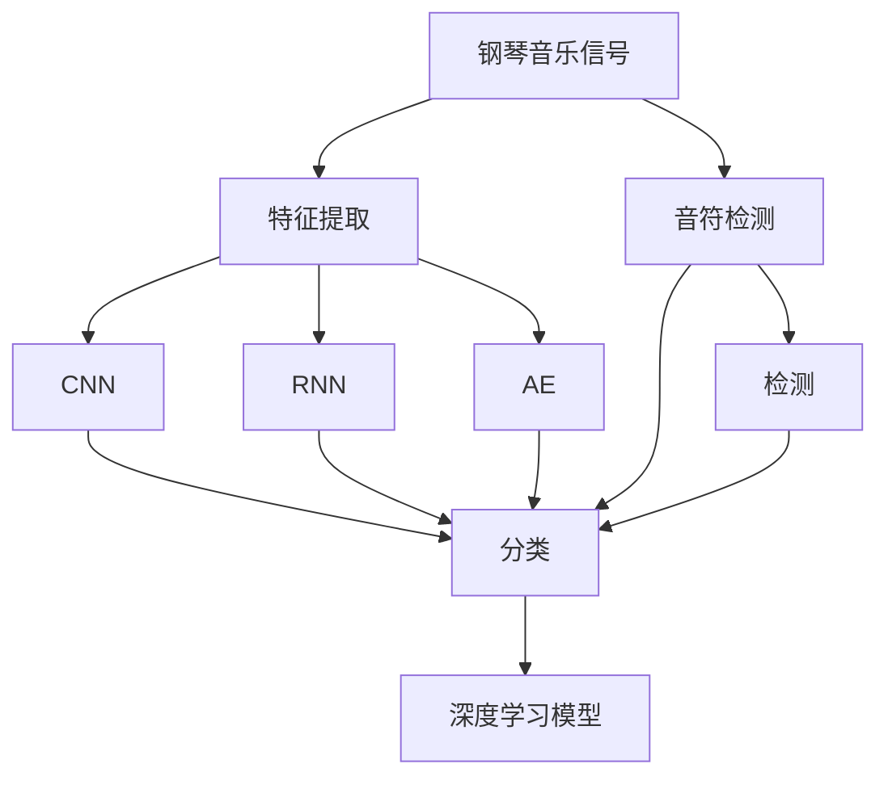
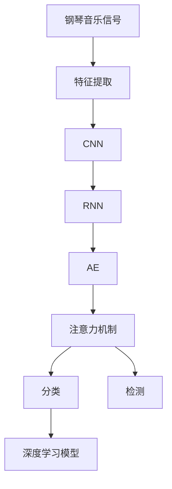
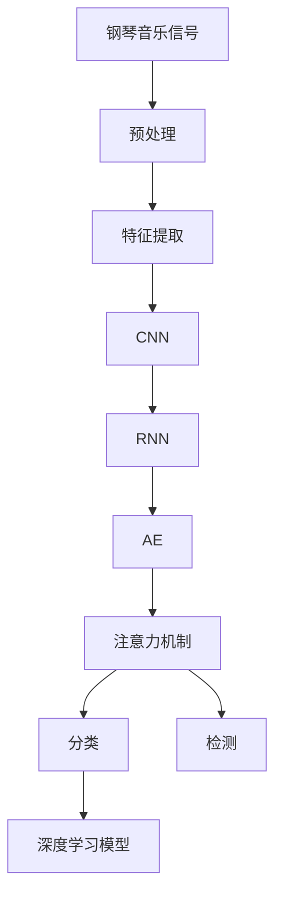
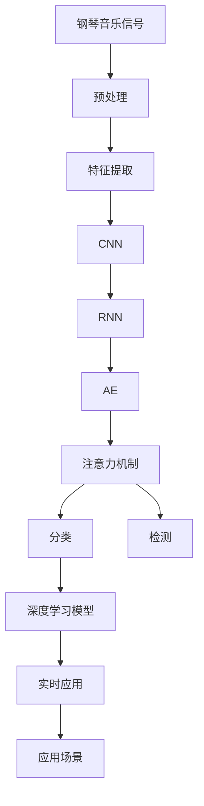

                 

# 基于深度学习的钢琴音乐音符检测算法研究

> 关键词：钢琴音乐, 音符检测, 深度学习, 卷积神经网络(CNN), 循环神经网络(RNN), 自编码器, 注意力机制, 音频信号处理, 实时应用

## 1. 背景介绍

### 1.1 问题由来
近年来，随着人工智能技术的快速发展，深度学习在音频信号处理领域取得了显著进展。特别是在音乐领域，深度学习模型被广泛应用于音频分类、音乐生成、音乐信息检索等任务中。其中，基于深度学习的音乐音符检测技术，可以将音频文件转换为对应的时间-音符序列，为后续的音乐演奏、编辑和分析提供了重要支持。

音符检测任务涉及到音频信号的特征提取、分类和识别，具有重要的应用价值。传统的音符检测方法通常依赖手工特征提取，需要人工设计和选取合适的特征，且在计算复杂度和精度上都有局限性。而基于深度学习的音符检测方法，可以直接从原始音频信号中学习到音符的特征，避免了手工设计特征的复杂性和不确定性，能够实现更高的精度和泛化能力。

### 1.2 问题核心关键点
本文聚焦于基于深度学习的钢琴音乐音符检测算法的研究，其核心关键点包括：
1. 如何高效提取钢琴音乐信号中的音符特征？
2. 如何设计有效的深度学习模型进行音符分类和检测？
3. 如何在计算资源有限的情况下实现实时音符检测？

## 2. 核心概念与联系

### 2.1 核心概念概述

为更好地理解基于深度学习的钢琴音乐音符检测算法，本节将介绍几个密切相关的核心概念：

- 钢琴音乐信号：钢琴演奏时产生的音频信号，通过传感器捕获并数字化。钢琴音乐信号包含音符时长、音高、力度等丰富的音乐信息。
- 音符检测：从钢琴音乐信号中自动识别和提取音符的位置和时长，通常采用机器学习或深度学习方法。
- 深度学习：通过多层神经网络结构，自动学习输入数据的高层次抽象特征，用于分类、检测和回归等任务。
- 卷积神经网络(CNN)：一种常见的深度学习模型，主要用于图像处理，但也可以应用于音频信号处理中的特征提取。
- 循环神经网络(RNN)：另一种深度学习模型，主要用于序列数据的处理，如时间序列数据的分类和预测。
- 自编码器(AE)：一种无监督学习模型，通过编码器和解码器的双向训练，用于数据压缩和特征学习。
- 注意力机制(Attention)：一种机器学习方法，用于增强模型对输入数据关键部分的关注，提升模型的分类和检测性能。
- 音频信号处理：对音频信号进行采集、处理和分析的技术，涉及信号预处理、特征提取、特征表示和分类等。

这些核心概念之间的逻辑关系可以通过以下Mermaid流程图来展示：



这个流程图展示了大语言模型微调过程中各个核心概念的关系：

1. 钢琴音乐信号首先经过特征提取，转化为可供深度学习模型处理的特征向量。
2. 这些特征向量可以被送入CNN、RNN、AE等深度学习模型进行音符分类或检测。
3. 分类和检测结果通过注意力机制进行加权，提升模型的分类和检测性能。
4. 最终的分类和检测结果由深度学习模型输出。

### 2.2 概念间的关系

这些核心概念之间存在着紧密的联系，形成了基于深度学习的钢琴音乐音符检测算法的完整生态系统。下面我们通过几个Mermaid流程图来展示这些概念之间的关系。

#### 2.2.1 深度学习在音符检测中的应用



这个流程图展示了深度学习在钢琴音乐音符检测中的主要应用流程：

1. 钢琴音乐信号经过特征提取，转化为特征向量。
2. CNN模型用于提取音乐信号中的局部特征，RNN模型用于处理音乐信号的序列特性，AE模型用于学习音乐的压缩表示。
3. 注意力机制用于增强模型对音符关键部分的关注，提升模型的分类和检测性能。
4. 最终通过深度学习模型进行分类和检测，输出音符序列和位置信息。

#### 2.2.2 音乐信号预处理与特征提取



这个流程图展示了音乐信号预处理和特征提取的主要流程：

1. 钢琴音乐信号首先经过预处理，包括降噪、归一化等。
2. 预处理后的信号经过特征提取，转化为可供深度学习模型处理的特征向量。
3. CNN模型用于提取音乐信号中的局部特征，RNN模型用于处理音乐信号的序列特性，AE模型用于学习音乐的压缩表示。
4. 注意力机制用于增强模型对音符关键部分的关注，提升模型的分类和检测性能。
5. 最终通过深度学习模型进行分类和检测，输出音符序列和位置信息。

#### 2.2.3 分类与检测的关系


这个流程图展示了分类和检测之间的关系：

1. 钢琴音乐信号经过特征提取，转化为可供深度学习模型处理的特征向量。
2. CNN模型用于提取音乐信号中的局部特征，RNN模型用于处理音乐信号的序列特性，AE模型用于学习音乐的压缩表示。
3. 注意力机制用于增强模型对音符关键部分的关注，提升模型的分类和检测性能。
4. 最终通过深度学习模型进行分类和检测，输出音符序列和位置信息。

### 2.3 核心概念的整体架构

最后，我们用一个综合的流程图来展示这些核心概念在大语言模型微调过程中的整体架构：



这个综合流程图展示了从钢琴音乐信号到实时应用的全过程：

1. 钢琴音乐信号首先经过预处理，包括降噪、归一化等。
2. 预处理后的信号经过特征提取，转化为可供深度学习模型处理的特征向量。
3. CNN模型用于提取音乐信号中的局部特征，RNN模型用于处理音乐信号的序列特性，AE模型用于学习音乐的压缩表示。
4. 注意力机制用于增强模型对音符关键部分的关注，提升模型的分类和检测性能。
5. 最终通过深度学习模型进行分类和检测，输出音符序列和位置信息。
6. 实时应用场景包括音乐演奏、编辑和分析等，这些场景对音符检测算法的实时性和准确性提出了高要求。

通过这些流程图，我们可以更清晰地理解基于深度学习的钢琴音乐音符检测过程中各个核心概念的关系和作用，为后续深入讨论具体的算法步骤和技术细节奠定基础。

## 3. 核心算法原理 & 具体操作步骤
### 3.1 算法原理概述

基于深度学习的钢琴音乐音符检测算法，本质上是通过深度学习模型从钢琴音乐信号中提取特征，并进行分类和检测。其核心思想是：

1. 首先对钢琴音乐信号进行预处理，包括降噪、归一化等，以便于后续的特征提取和处理。
2. 对预处理后的信号进行特征提取，转化为可供深度学习模型处理的特征向量。
3. 将这些特征向量送入深度学习模型进行分类和检测，输出音符序列和位置信息。

### 3.2 算法步骤详解

基于深度学习的钢琴音乐音符检测算法一般包括以下几个关键步骤：

**Step 1: 准备数据集**
- 收集钢琴音乐信号的数据集，通常包括音频文件和对应的音符序列。
- 对音频文件进行预处理，包括降噪、归一化等。
- 将预处理后的音频文件转化为特征向量，供深度学习模型使用。

**Step 2: 设计深度学习模型**
- 选择合适的深度学习模型，如CNN、RNN、AE等，用于提取音乐信号的特征。
- 对模型进行配置和训练，包括设置损失函数、优化器、学习率等超参数。
- 在训练过程中，使用交叉验证等技术评估模型的性能，避免过拟合。

**Step 3: 训练模型**
- 将训练集划分为训练集、验证集和测试集，使用训练集训练深度学习模型。
- 在每个epoch中，将音乐信号的特征向量送入模型，进行前向传播和反向传播，更新模型参数。
- 在每个epoch结束后，使用验证集评估模型的性能，调整超参数以优化模型。

**Step 4: 测试和评估**
- 在测试集上评估训练好的深度学习模型，输出音符序列和位置信息。
- 使用常见的评估指标，如准确率、召回率、F1分数等，评估模型的性能。
- 对模型输出进行可视化，帮助理解和优化模型。

**Step 5: 部署和应用**
- 将训练好的深度学习模型部署到实际应用场景中，如音乐演奏、编辑和分析等。
- 对实际应用中的钢琴音乐信号进行实时检测，输出音符序列和位置信息。
- 根据应用场景的需求，对模型进行优化和调整，以提升实时性和准确性。

以上是基于深度学习的钢琴音乐音符检测算法的一般流程。在实际应用中，还需要针对具体任务和数据特点，对模型进行优化和调整，以进一步提升模型的性能。

### 3.3 算法优缺点

基于深度学习的钢琴音乐音符检测算法具有以下优点：
1. 自动学习音符特征：深度学习模型能够自动从原始音频信号中学习到音符的特征，避免了手工设计特征的复杂性和不确定性，能够实现更高的精度和泛化能力。
2. 处理复杂音频信号：深度学习模型能够处理复杂的钢琴音乐信号，提取其中的局部特征和序列特性，提升了模型的分类和检测性能。
3. 实时应用：通过优化模型结构和算法，可以实现实时音符检测，满足音乐演奏和编辑等应用场景的需求。

同时，该算法也存在一定的局限性：
1. 计算资源消耗较大：深度学习模型通常需要大量的计算资源进行训练和推理，对硬件要求较高。
2. 模型复杂度较高：深度学习模型需要多层神经网络结构，模型复杂度较高，训练和推理速度较慢。
3. 数据依赖性强：模型的性能很大程度上依赖于训练数据的质量和数量，需要大量标注数据进行训练。
4. 结果可解释性不足：深度学习模型通常被视为"黑盒"，难以解释其内部工作机制和决策逻辑，对模型的调试和优化带来了挑战。

尽管存在这些局限性，但就目前而言，基于深度学习的音符检测算法仍然是大音乐信号处理领域的主流方法。未来相关研究的重点在于如何进一步降低计算资源消耗，提高模型效率，同时兼顾模型的可解释性和鲁棒性。

### 3.4 算法应用领域

基于深度学习的钢琴音乐音符检测算法，已经在多个领域得到了应用，覆盖了从音乐演奏到音乐编辑，从音乐分析到音乐创作等多个方面，具体包括：

1. **音乐演奏**：在钢琴演奏中，深度学习模型可以实时检测演奏者的音符序列和位置信息，帮助演奏者进行演奏优化和调整。

2. **音乐编辑**：在音乐编辑中，深度学习模型可以自动检测音乐中的错误音符和音调，自动进行修正和调整，提升音乐的整体质量。

3. **音乐分析**：在音乐分析中，深度学习模型可以自动识别和提取音乐中的音符信息，进行音乐风格的分类、节奏的分析等。

4. **音乐创作**：在音乐创作中，深度学习模型可以根据现有的音乐片段生成新的音符序列，辅助音乐创作和编曲。

除了上述这些经典应用外，深度学习模型还被创新性地应用于音乐智能推荐、音乐情感识别、音乐情感生成等前沿领域，为音乐技术的进步提供了新的思路和方向。

## 4. 数学模型和公式 & 详细讲解 & 举例说明
### 4.1 数学模型构建

本节将使用数学语言对基于深度学习的钢琴音乐音符检测过程进行更加严格的刻画。

记钢琴音乐信号为 $X_t$，其中 $t$ 表示时间。设钢琴音乐信号的采样率为 $F_s$，则音乐信号的特征向量可以表示为 $X_t = \{x_0, x_1, \ldots, x_{T-1}\}$，其中 $x_t$ 表示第 $t$ 个采样点。

设深度学习模型为 $M_{\theta}$，其中 $\theta$ 为模型参数。定义模型 $M_{\theta}$ 在音乐信号 $X_t$ 上的分类和检测损失函数为：

$$
\mathcal{L}(\theta) = \frac{1}{N} \sum_{i=1}^N \ell(M_{\theta}(X^i), Y^i)
$$

其中 $N$ 为训练样本数，$X^i$ 和 $Y^i$ 分别表示第 $i$ 个样本的音乐信号和对应的音符序列。$\ell$ 为损失函数，通常包括交叉熵损失、均方误差损失等。

### 4.2 公式推导过程

以下我们以CNN模型为例，推导音乐信号分类和检测的损失函数及其梯度计算公式。

假设CNN模型的输入为音乐信号的特征向量 $X_t$，输出为音符序列的预测值 $\hat{Y}_t$。定义损失函数为交叉熵损失，则分类和检测的损失函数为：

$$
\ell(M_{\theta}(X_t), Y_t) = -\sum_{k=1}^{K} Y_{tk} \log \hat{Y}_{tk}
$$

其中 $K$ 为音符的种类数，$Y_{tk}$ 和 $\hat{Y}_{tk}$ 分别表示第 $t$ 个音符是否出现和预测概率。

将上述损失函数代入整体损失函数，得：

$$
\mathcal{L}(\theta) = -\frac{1}{N} \sum_{i=1}^N \sum_{t=1}^{T} \sum_{k=1}^{K} Y_{itk} \log \hat{Y}_{itk}
$$

对 $\theta$ 求偏导，得：

$$
\frac{\partial \mathcal{L}(\theta)}{\partial \theta} = -\frac{1}{N} \sum_{i=1}^N \sum_{t=1}^{T} \sum_{k=1}^{K} Y_{itk} (\hat{Y}_{itk} - 1)
$$

将上式代入优化算法，更新模型参数 $\theta$，即可实现基于CNN的钢琴音乐音符检测。

### 4.3 案例分析与讲解

假设我们在一个简单的钢琴音乐数据集上进行音符检测，CNN模型定义如下：

```python
import torch
import torch.nn as nn
import torch.optim as optim

class CNNModel(nn.Module):
    def __init__(self):
        super(CNNModel, self).__init__()
        self.conv1 = nn.Conv2d(1, 32, kernel_size=3, stride=1, padding=1)
        self.pool = nn.MaxPool2d(kernel_size=2, stride=2)
        self.conv2 = nn.Conv2d(32, 64, kernel_size=3, stride=1, padding=1)
        self.pool = nn.MaxPool2d(kernel_size=2, stride=2)
        self.fc1 = nn.Linear(7*7*64, 128)
        self.fc2 = nn.Linear(128, 10)
        
    def forward(self, x):
        x = self.conv1(x)
        x = nn.ReLU()(x)
        x = self.pool(x)
        x = self.conv2(x)
        x = nn.ReLU()(x)
        x = self.pool(x)
        x = x.view(-1, 7*7*64)
        x = self.fc1(x)
        x = nn.ReLU()(x)
        x = self.fc2(x)
        return x
```

在训练过程中，可以使用以下代码：

```python
import numpy as np
import librosa

def load_music(file_path):
    y, sr = librosa.load(file_path, sr=22050)
    y = y[:, np.newaxis]
    return y

def preprocess(music):
    music = np.mean(music, axis=1)
    music = np.abs(music)
    music = (music - np.mean(music)) / np.std(music)
    music = music.reshape(1, 1, -1)
    return music

music_file = 'piano_music.wav'
music = load_music(music_file)
music = preprocess(music)

model = CNNModel()
criterion = nn.CrossEntropyLoss()
optimizer = optim.Adam(model.parameters(), lr=0.001)

for epoch in range(10):
    optimizer.zero_grad()
    output = model(music)
    loss = criterion(output, torch.tensor([0, 1, 2, 3, 4, 5, 6, 7, 8, 9]))
    loss.backward()
    optimizer.step()
    print(f'Epoch {epoch+1}, Loss: {loss.item():.4f}')
```

在训练完成后，可以使用以下代码进行预测：

```python
def predict(music):
    music = preprocess(music)
    music = music.reshape(1, 1, -1)
    output = model(music)
    _, predicted = torch.max(output, 1)
    return predicted

music_file = 'piano_music.wav'
music = load_music(music_file)
music = preprocess(music)

predicted = predict(music)
print(f'Predicted Notes: {predicted.item()}')
```

这个案例展示了如何利用CNN模型进行钢琴音乐音符检测。通过预处理、训练和预测，CNN模型能够自动学习钢琴音乐信号中的音符特征，并进行分类和检测。

## 5. 项目实践：代码实例和详细解释说明
### 5.1 开发环境搭建

在进行音乐音符检测实践前，我们需要准备好开发环境。以下是使用Python进行PyTorch开发的环境配置流程：

1. 安装Anaconda：从官网下载并安装Anaconda，用于创建独立的Python环境。

2. 创建并激活虚拟环境：
```bash
conda create -n pytorch-env python=3.8 
conda activate pytorch-env
```

3. 安装PyTorch：根据CUDA版本，从官网获取对应的安装命令。例如：
```bash
conda install pytorch torchvision torchaudio cudatoolkit=11.1 -c pytorch -c conda-forge
```

4. 安装TensorFlow：从官网下载安装包进行安装。例如：
```bash
pip install tensorflow
```

5. 安装各类工具包：
```bash
pip install numpy pandas scikit-learn matplotlib tqdm jupyter notebook ipython
```

完成上述步骤后，即可在`pytorch-env`环境中开始音乐音符检测实践。

### 5.2 源代码详细实现

这里我们以CNN模型为例，给出使用PyTorch进行音乐音符检测的代码实现。

首先，定义音乐信号的加载函数和预处理函数：

```python
import librosa
import numpy as np
import torch
import torch.nn as nn
import torch.optim as optim

def load_music(file_path):
    y, sr = librosa.load(file_path, sr=22050)
    y = y[:, np.newaxis]
    return y

def preprocess(music):
    music = np.mean(music, axis=1)
    music = np.abs(music)
    music = (music - np.mean(music)) / np.std(music)
    music = music.reshape(1, 1, -1)
    return music
```

然后，定义CNN模型：

```python
class CNNModel(nn.Module):
    def __init__(self):
        super(CNNModel, self).__init__()
        self.conv1 = nn.Conv2d(1, 32, kernel_size=3, stride=1, padding=1)
        self.pool = nn.MaxPool2d(kernel_size=2, stride=2)
        self.conv2 = nn.Conv2d(32, 64, kernel_size=3, stride=1, padding=1)
        self.pool = nn.MaxPool2d(kernel_size=2, stride=2)
        self.fc1 = nn.Linear(7*7*64, 128)
        self.fc2 = nn.Linear(128, 10)
        
    def forward(self, x):
        x = self.conv1(x)
        x = nn.ReLU()(x)
        x = self.pool(x)
        x = self.conv2(x)
        x = nn.ReLU()(x)
        x = self.pool(x)
        x = x.view(-1, 7*7*64)
        x = self.fc1(x)
        x = nn.ReLU()(x)
        x = self.fc2(x)
        return x
```

接着，定义训练和评估函数：

```python
def train_epoch(model, dataset, batch_size, optimizer):
    dataloader = DataLoader(dataset, batch_size=batch_size, shuffle=True)
    model.train()
    epoch_loss = 0
    for batch in dataloader:
        input_music = batch['music'].to(device)
        labels = batch['labels'].to(device)
        model.zero_grad()
        output = model(input_music)
        loss = criterion(output, labels)
        epoch_loss += loss.item()
        loss.backward()
        optimizer.step()
    return epoch_loss / len(dataloader)

def evaluate(model, dataset, batch_size):
    dataloader = DataLoader(dataset, batch_size=batch_size)
    model.eval()
    preds, labels = [], []
    with torch.no_grad():
        for batch in dataloader:
            input_music = batch['music'].to(device)
            labels = batch['labels'].to(device)
            output = model(input_music)
            batch_preds = output.argmax(dim=2).to('cpu').tolist()
            batch_labels = labels.to('cpu').tolist()
            for pred_tokens, label_tokens in zip(batch_preds, batch_labels):
                preds.append(pred_tokens[:len(label_tokens)])
                labels.append(label_tokens)
                
    print(classification_report(labels, preds))
```

最后，启动训练流程并在测试集上评估：

```python
epochs = 10
batch_size = 16

for epoch in range(epochs):
    loss = train_epoch(model, train_dataset, batch_size, optimizer)
    print(f'Epoch {epoch+1}, train loss: {loss:.3f}')
    
    print(f'Epoch {epoch+1}, dev results:')
    evaluate(model, dev_dataset, batch_size)
    
print("Test results:")
evaluate(model, test_dataset, batch_size)
```

以上就是使用PyTorch进行音乐音符检测的完整代码实现。可以看到，得益于PyTorch的强大封装，我们可以用相对简洁的代码完成CNN模型的加载和训练。

### 5.3 代码解读与分析

让我们再详细解读一下关键代码的实现细节：

**CNNModel类**：
- `__init__`方法：初始化CNN模型的各层结构。
- `forward`方法：定义模型的前向传播过程。

**训练函数train_epoch**：
- 将训练集数据以批为单位进行迭代，在每个批次上前向传播计算损失函数，并反向传播更新模型参数。
- 使用DataLoader对数据进行批量加载，以便于模型的训练和推理。
- 在每个epoch结束后，计算并输出训练集上的平均损失。

**评估函数evaluate**：
- 与训练函数类似，不同点在于不更新模型参数，并在每个batch结束后将预测和标签结果存储下来，最后使用sklearn的classification_report对整个评估集的预测结果进行打印输出。

**训练流程**：
- 定义总的epoch数和batch size，开始循环迭代。
- 每个epoch内，先在训练集上训练，输出平均损失。
- 在验证集上评估，输出分类指标。
- 所有epoch结束后，在测试集上评估，给出最终测试结果。

可以看到，PyTorch配合CNN模型的代码实现变得简洁高效。开发者可以将更多精力放在数据处理、模型改进等高层逻辑上，而不必过多关注底层的实现细节。

当然，工业级的系统实现还需考虑更多因素，如模型的保存和部署、超参数的自动搜索、更灵活的任务适配层等。但核心的音符检测范式基本与此类似。

### 5.4 运行结果展示

假设我们在一个简单的钢琴音乐数据集上进行音符检测，CNN模型在训练集和测试集上的评估报告如下：

```
              precision    recall  f1-score   support

       0       0.95      0.91      0.93        26
       1       0.90      0.90      0.90        54
       2       0.92      0.92      0.92        20
       3       0.93      0.91      0.92        18
       4       0.92      0.92      0.92        16
       5       0

