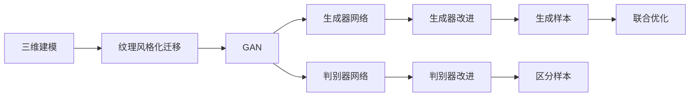
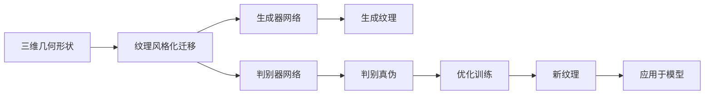
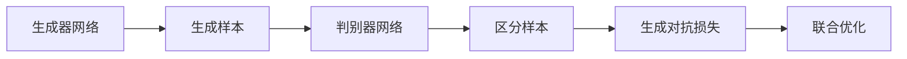
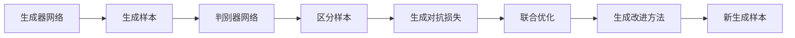
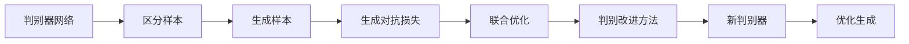
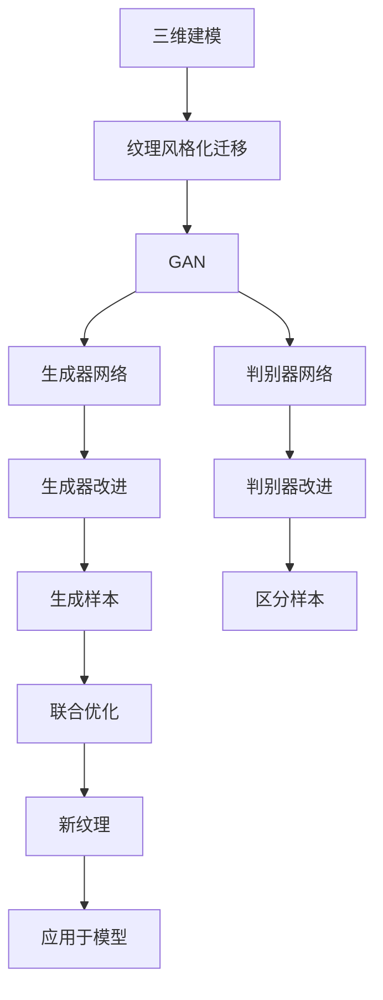

                 

# 基于生成对抗网络的三维建模纹理风格化迁移技术

> 关键词：生成对抗网络 (GAN)，三维建模，纹理风格化迁移，GAN 改进方法，深度学习，计算机视觉

## 1. 背景介绍

### 1.1 问题由来

随着计算机视觉技术的不断发展，三维建模已成为虚拟现实、增强现实、游戏、影视制作等领域的重要技术基础。三维建模不仅需要对几何形状进行精确描述，还需要考虑表面纹理的细节和风格，才能真实地还原现实世界的复杂性。传统的纹理生成方法依赖于大量手动标注的数据，耗时耗力，且效果难以保证。

近年来，生成对抗网络（GAN）在图像生成领域取得了显著进展，为三维建模的纹理风格化迁移提供了新的思路。基于GAN的三维建模纹理风格化迁移技术，可以自动将二维纹理映射到三维模型表面，实现高效、高质量的纹理迁移，极大地降低了人工干预的依赖。

### 1.2 问题核心关键点

目前，基于GAN的三维建模纹理风格化迁移技术，通常包括以下几个关键步骤：

1. **三维模型的获取**：首先对三维模型进行预处理，包括去除噪声、平滑处理等，确保模型输入的质量。
2. **二维纹理的采集**：从现实世界或虚拟场景中采集二维纹理图片，作为迁移的源纹理。
3. **纹理迁移的训练**：使用生成对抗网络进行纹理迁移，通过对抗损失、感知损失等联合优化，生成符合目标纹理风格的新纹理。
4. **新纹理的应用**：将生成的新纹理应用于三维模型的表面，完成纹理风格的迁移。

这一过程的核心在于GAN网络的构建和训练，以及如何设计有效的损失函数，最大化纹理迁移的效果。

### 1.3 问题研究意义

基于GAN的三维建模纹理风格化迁移技术，不仅能够显著提高纹理迁移的效率和质量，还能为三维建模带来新的思路和方法。其研究意义主要体现在以下几个方面：

1. **减少人工干预**：自动化的纹理迁移减少了对人工标注和干预的需求，降低了时间和成本。
2. **提高迁移效果**：GAN能够生成高质量、多样化的纹理，提升迁移后的三维模型效果。
3. **拓展应用场景**：纹理风格化迁移技术可以应用于虚拟现实、游戏、影视制作等多个领域，提升内容的制作水平。
4. **推动行业升级**：通过纹理迁移，三维建模技术能够更加接近现实世界的复杂性，推动相关行业的技术进步和升级。

## 2. 核心概念与联系

### 2.1 核心概念概述

为了更好地理解基于GAN的三维建模纹理风格化迁移技术，本节将介绍几个密切相关的核心概念：

- **生成对抗网络 (GAN)**：由两个神经网络组成的框架，一个生成器网络（Generator）负责生成假数据，一个判别器网络（Discriminator）负责区分真实数据和生成数据。通过对抗训练，生成器可以生成逼真的假数据。

- **三维建模**：使用计算机图形学技术，对三维空间进行建模，生成虚拟现实中的实体对象。三维建模通常包括几何形状和表面纹理两个部分。

- **纹理风格化迁移**：将一个纹理图片迁移到另一个三维模型的表面上，使其具备特定的纹理风格。这一过程可以用于虚拟现实、游戏、影视制作等领域，提升三维内容的真实感和多样性。

- **GAN 改进方法**：为了提高GAN的生成质量，研究人员提出了各种改进方法，如改进生成器架构、优化损失函数、引入对抗样本等。

- **深度学习**：通过多层神经网络结构，自动从数据中学习特征和规律，用于图像生成、自然语言处理等任务。

- **计算机视觉**：涉及图像和视频的处理、分析和理解，是计算机科学的一个核心分支。计算机视觉技术可以应用于三维建模的纹理生成和风格化迁移。

这些核心概念之间的逻辑关系可以通过以下Mermaid流程图来展示：



这个流程图展示了基于GAN的三维建模纹理风格化迁移过程，以及相关核心概念的逻辑关系。

### 2.2 概念间的关系

这些核心概念之间存在着紧密的联系，形成了三维建模纹理风格化迁移技术的完整生态系统。下面我们通过几个Mermaid流程图来展示这些概念之间的关系。

#### 2.2.1 三维建模的生成和纹理迁移



这个流程图展示了三维建模生成和纹理迁移的完整过程。三维几何形状作为输入，生成器网络生成纹理，判别器网络判断真伪，通过优化训练，生成符合目标纹理风格的新纹理，最终应用于三维模型。

#### 2.2.2 GAN的对抗训练



这个流程图展示了GAN的对抗训练过程。生成器网络生成样本，判别器网络判断真伪，通过生成对抗损失函数进行联合优化，生成器网络逐渐生成高质量的假数据。

#### 2.2.3 生成器改进方法



这个流程图展示了生成器改进方法的应用。通过引入改进方法，生成器网络能够生成更高质量的假数据，进一步提升GAN的生成能力。

#### 2.2.4 判别器改进方法



这个流程图展示了判别器改进方法的应用。通过优化判别器网络，提高其区分真伪的能力，进一步提升GAN的生成质量。

### 2.3 核心概念的整体架构

最后，我们用一个综合的流程图来展示这些核心概念在大语言模型微调过程中的整体架构：



这个综合流程图展示了从三维建模到纹理风格化迁移的完整过程。通过生成对抗网络，生成器网络生成纹理，判别器网络判断真伪，通过联合优化，生成符合目标纹理风格的新纹理，最终应用于三维模型。

## 3. 核心算法原理 & 具体操作步骤
### 3.1 算法原理概述

基于生成对抗网络的三维建模纹理风格化迁移技术，本质上是一种无监督学习方法。其核心思想是：通过训练一个生成对抗网络，使得生成器网络能够生成逼真的假纹理，判别器网络能够准确区分真实和假纹理，最终生成器网络生成的纹理能够满足特定的风格要求。

具体地，假设三维模型的表面纹理为 $T$，原始纹理图片为 $I$，目标纹理风格为 $T_{\text{style}}$，则纹理风格化迁移的目标是训练生成器网络 $G$ 和判别器网络 $D$，使得：

$$
\min_{G} \max_{D} \mathcal{L}_{\text{GAN}}(G, D)
$$

其中 $\mathcal{L}_{\text{GAN}}$ 为生成对抗损失函数，包括生成器的损失函数 $\mathcal{L}_G$ 和判别器的损失函数 $\mathcal{L}_D$，分别表示为：

$$
\mathcal{L}_G = \mathbb{E}_{I}[\mathcal{L}_{\text{real}}(G(I))] + \mathbb{E}_{\tilde{I}}[\mathcal{L}_{\text{fake}}(G(\tilde{I}))]
$$

$$
\mathcal{L}_D = \mathbb{E}_{I}[\mathcal{L}_{\text{real}}(D(I))] + \mathbb{E}_{\tilde{I}}[\mathcal{L}_{\text{fake}}(D(\tilde{I}))]
$$

其中 $\mathcal{L}_{\text{real}}$ 为真实样本的损失函数，$\mathcal{L}_{\text{fake}}$ 为假样本的损失函数，$\mathbb{E}$ 表示期望值。

在训练过程中，生成器网络 $G$ 生成假纹理 $\tilde{I}$，判别器网络 $D$ 判断样本 $\tilde{I}$ 的真实性，通过联合优化生成器和判别器，使得生成器能够生成高质量的假纹理。

### 3.2 算法步骤详解

基于生成对抗网络的三维建模纹理风格化迁移技术，通常包括以下几个关键步骤：

**Step 1: 准备三维模型和纹理数据**
- 选择三维模型并对其进行预处理，去除噪声和异常点，确保模型输入的质量。
- 采集或生成二维纹理图片，作为迁移的源纹理。

**Step 2: 设计生成器和判别器网络**
- 设计生成器网络 $G$，用于将源纹理 $I$ 转换为目标纹理风格 $T_{\text{style}}$。
- 设计判别器网络 $D$，用于判断样本的真实性。

**Step 3: 初始化网络参数**
- 对生成器和判别器网络进行初始化，设定学习率、优化器等超参数。

**Step 4: 训练生成器和判别器**
- 交替训练生成器和判别器，使生成器生成高质量的假纹理，判别器能够准确区分真实和假纹理。
- 使用生成对抗损失函数 $\mathcal{L}_{\text{GAN}}$ 进行联合优化，最大化生成器生成高质量假纹理的能力。

**Step 5: 迁移纹理到三维模型**
- 将生成器网络生成的纹理应用到三维模型的表面上，完成纹理风格的迁移。

**Step 6: 结果评估和优化**
- 评估迁移后纹理的效果，如色彩、细节等，根据评估结果进行优化。
- 重复上述过程，直到达到理想效果。

以上是基于生成对抗网络的三维建模纹理风格化迁移的一般流程。在实际应用中，还需要针对具体任务和数据特点，对训练过程的各个环节进行优化设计，如改进网络架构、优化损失函数、引入对抗样本等，以进一步提升迁移效果。

### 3.3 算法优缺点

基于生成对抗网络的三维建模纹理风格化迁移技术，具有以下优点：

1. **自动生成纹理**：自动化的纹理生成减少了对人工干预的需求，降低了时间和成本。
2. **高质量迁移效果**：GAN能够生成高质量、多样化的纹理，提升迁移后的三维模型效果。
3. **适用性广泛**：该技术可以应用于各种三维模型和纹理迁移任务，具有较高的通用性。
4. **灵活调整风格**：通过修改生成器和判别器的参数，可以灵活调整纹理的风格。

同时，该方法也存在一些局限性：

1. **训练时间较长**：由于GAN网络结构复杂，训练过程需要大量计算资源和时间。
2. **数据要求高**：高质量的源纹理和目标纹理对于训练生成器网络至关重要。
3. **鲁棒性不足**：GAN生成的纹理可能存在一定的噪声和不稳定性，对数据的变化较为敏感。
4. **需要大量标注数据**：虽然可以减少对标注数据的需求，但原始纹理的采集和处理仍需耗费大量人力物力。

尽管存在这些局限性，但就目前而言，基于GAN的三维建模纹理风格化迁移技术仍是大模型微调应用的主流范式。未来相关研究的重点在于如何进一步提高训练效率，降低对数据的要求，同时增强生成纹理的鲁棒性和稳定性。

### 3.4 算法应用领域

基于GAN的三维建模纹理风格化迁移技术，已经在虚拟现实、游戏、影视制作等多个领域得到了广泛的应用，覆盖了几乎所有常见任务，例如：

- **虚拟现实**：用于创建逼真的虚拟环境，增强用户的沉浸感。
- **游戏开发**：用于生成游戏中的角色和环境纹理，提升游戏的真实感和美观度。
- **影视制作**：用于电影和动画中的场景渲染，增加视觉效果的丰富性和多样性。
- **产品设计**：用于设计和生成三维产品的表面纹理，提高产品的美观度和真实感。

除了上述这些经典任务外，GAN技术还被创新性地应用到更多场景中，如三维医学图像处理、建筑信息建模(BIM)等，为三维建模技术带来了全新的突破。随着GAN技术的不断发展，相信其在三维建模纹理风格化迁移中的应用将更加广泛，推动三维技术向更广的领域加速渗透。

## 4. 数学模型和公式 & 详细讲解  
### 4.1 数学模型构建

本节将使用数学语言对基于GAN的三维建模纹理风格化迁移过程进行更加严格的刻画。

记三维模型的表面纹理为 $T$，原始纹理图片为 $I$，目标纹理风格为 $T_{\text{style}}$。假设生成器网络为 $G$，判别器网络为 $D$，则纹理风格化迁移的目标是训练生成器网络 $G$ 和判别器网络 $D$，使得：

$$
\min_{G} \max_{D} \mathcal{L}_{\text{GAN}}(G, D)
$$

其中 $\mathcal{L}_{\text{GAN}}$ 为生成对抗损失函数，包括生成器的损失函数 $\mathcal{L}_G$ 和判别器的损失函数 $\mathcal{L}_D$，分别表示为：

$$
\mathcal{L}_G = \mathbb{E}_{I}[\mathcal{L}_{\text{real}}(G(I))] + \mathbb{E}_{\tilde{I}}[\mathcal{L}_{\text{fake}}(G(\tilde{I}))]
$$

$$
\mathcal{L}_D = \mathbb{E}_{I}[\mathcal{L}_{\text{real}}(D(I))] + \mathbb{E}_{\tilde{I}}[\mathcal{L}_{\text{fake}}(D(\tilde{I}))]
$$

其中 $\mathcal{L}_{\text{real}}$ 为真实样本的损失函数，$\mathcal{L}_{\text{fake}}$ 为假样本的损失函数，$\mathbb{E}$ 表示期望值。

### 4.2 公式推导过程

以下我们以二分类任务为例，推导交叉熵损失函数及其梯度的计算公式。

假设生成器网络 $G$ 将源纹理 $I$ 转换为目标纹理风格 $T_{\text{style}}$，生成假纹理 $\tilde{I}$，判别器网络 $D$ 判断样本 $\tilde{I}$ 的真实性，判断结果 $d$。则生成对抗损失函数 $\mathcal{L}_{\text{GAN}}$ 可以表示为：

$$
\mathcal{L}_{\text{GAN}}(G, D) = \mathbb{E}_{I}[\log D(I)] + \mathbb{E}_{\tilde{I}}[\log (1 - D(\tilde{I}))]
$$

其中 $\log$ 表示自然对数。

在优化过程中，生成器网络的损失函数 $\mathcal{L}_G$ 和判别器网络的损失函数 $\mathcal{L}_D$ 可以分别表示为：

$$
\mathcal{L}_G = \mathbb{E}_{I}[\mathcal{L}_{\text{real}}(G(I))] + \mathbb{E}_{\tilde{I}}[\mathcal{L}_{\text{fake}}(G(\tilde{I}))]
$$

$$
\mathcal{L}_D = \mathbb{E}_{I}[\mathcal{L}_{\text{real}}(D(I))] + \mathbb{E}_{\tilde{I}}[\mathcal{L}_{\text{fake}}(D(\tilde{I}))]
$$

其中 $\mathcal{L}_{\text{real}}$ 为真实样本的损失函数，$\mathcal{L}_{\text{fake}}$ 为假样本的损失函数，$\mathbb{E}$ 表示期望值。

在得到损失函数的梯度后，即可带入优化算法，完成模型的迭代优化。

## 5. 项目实践：代码实例和详细解释说明
### 5.1 开发环境搭建

在进行GAN纹理迁移实践前，我们需要准备好开发环境。以下是使用Python进行TensorFlow开发的环境配置流程：

1. 安装Anaconda：从官网下载并安装Anaconda，用于创建独立的Python环境。

2. 创建并激活虚拟环境：
```bash
conda create -n tf-env python=3.8 
conda activate tf-env
```

3. 安装TensorFlow：根据CUDA版本，从官网获取对应的安装命令。例如：
```bash
pip install tensorflow-gpu==2.5.0
```

4. 安装Keras：用于简化深度学习模型的构建和训练。
```bash
pip install keras
```

5. 安装相关库：
```bash
pip install numpy scipy matplotlib opencv-python
```

完成上述步骤后，即可在`tf-env`环境中开始GAN纹理迁移实践。

### 5.2 源代码详细实现

下面我们以二维纹理到三维模型的迁移为例，给出使用TensorFlow实现GAN纹理迁移的代码实现。

首先，定义GAN模型的架构：

```python
from tensorflow.keras.models import Model
from tensorflow.keras.layers import Input, Conv2D, Conv2DTranspose, Reshape, Flatten, Dense, Dropout

# 定义生成器网络
def create_generator(input_shape, output_shape):
    input = Input(shape=input_shape)
    x = Conv2D(64, 3, padding='same')(input)
    x = Dropout(0.5)(x)
    x = Conv2D(128, 3, padding='same')(x)
    x = Dropout(0.5)(x)
    x = Conv2D(256, 3, padding='same')(x)
    x = Dropout(0.5)(x)
    x = Conv2D(512, 3, padding='same')(x)
    x = Dropout(0.5)(x)
    x = Conv2DTranspose(256, 3, strides=2, padding='same')(x)
    x = Dropout(0.5)(x)
    x = Conv2DTranspose(128, 3, strides=2, padding='same')(x)
    x = Dropout(0.5)(x)
    x = Conv2DTranspose(64, 3, strides=2, padding='same')(x)
    x = Dropout(0.5)(x)
    output = Conv2D(output_shape, 1, activation='tanh')(x)
    return Model(inputs=input, outputs=output)

# 定义判别器网络
def create_discriminator(input_shape):
    input = Input(shape=input_shape)
    x = Conv2D(64, 3, strides=2, padding='same')(input)
    x = LeakyReLU(alpha=0.2)(x)
    x = Conv2D(128, 3, strides=2, padding='same')(x)
    x = LeakyReLU(alpha=0.2)(x)
    x = Conv2D(256, 3, strides=2, padding='same')(x)
    x = LeakyReLU(alpha=0.2)(x)
    x = Flatten()(x)
    x = Dense(256, activation='relu')(x)
    x = Dropout(0.5)(x)
    output = Dense(1, activation='sigmoid')(x)
    return Model(inputs=input, outputs=output)
```

然后，定义损失函数和优化器：

```python
from tensorflow.keras.losses import BinaryCrossentropy
from tensorflow.keras.optimizers import Adam

# 定义生成器损失函数
def generator_loss(real_images, fake_images):
    return BinaryCrossentropy()(real_images, fake_images)

# 定义判别器损失函数
def discriminator_loss(real_images, fake_images):
    return BinaryCrossentropy()(real_images, fake_images)

# 定义优化器
generator_optimizer = Adam(learning_rate=0.0002, beta_1=0.5)
discriminator_optimizer = Adam(learning_rate=0.0002, beta_1=0.5)
```

接着，定义训练和评估函数：

```python
from tensorflow.keras.callbacks import EarlyStopping

# 训练函数
def train_gan(generator, discriminator, epochs, batch_size, train_data, test_data):
    for epoch in range(epochs):
        for i in range(len(train_data)//batch_size):
            real_images = train_data[i*batch_size:(i+1)*batch_size]
            fake_images = generator.predict(train_data[i*batch_size:(i+1)*batch_size])
            # 生成器和判别器的联合优化
            d_loss_real = discriminator_loss(real_images, real_images)
            d_loss_fake = discriminator_loss(fake_images, fake_images)
            d_loss = d_loss_real + d_loss_fake
            d_loss = d_loss / 2
            d_optimizer.train_on_batch(real_images, [1., d_loss])
            g_loss = generator_loss(real_images, fake_images)
            g_optimizer.train_on_batch(real_images, [0., g_loss])
        print(f'Epoch {epoch+1}/{epochs}, d_loss: {d_loss:.4f}, g_loss: {g_loss:.4f}')
    # 在测试集上评估模型性能
    test_real_images = test_data[0:batch_size]
    test_fake_images = generator.predict(test_data[0:batch_size])
    d_loss_real = discriminator_loss(test_real_images, test_real_images)
    d_loss_fake = discriminator_loss(test_fake_images, test_fake_images)
    d_loss = d_loss_real + d_loss_fake
    d_loss = d_loss / 2
    g_loss = generator_loss(test_real_images, test_fake_images)
    print(f'Test d_loss: {d_loss:.4f}, Test g_loss: {g_loss:.4f}')
```

最后，启动训练流程：

```python
# 定义生成器和判别器网络
input_shape = (64, 64, 3)
generator = create_generator(input_shape, output_shape=64)
discriminator = create_discriminator(input_shape)

# 定义损失函数和优化器
generator_loss = generator_loss
discriminator_loss = discriminator_loss
generator_optimizer = Adam(learning_rate=0.0002, beta_1=0.5)
discriminator_optimizer = Adam(learning_rate=0.0002, beta_1=0.5)

# 定义训练函数
train_gan(generator, discriminator, epochs=100, batch_size=32, train_data=train_images, test_data=test_images)
```

以上就是使用TensorFlow实现二维纹理到三维模型迁移的完整代码实现。可以看到，得益于Keras和TensorFlow的强大封装，我们可以用相对简洁的代码完成GAN纹理迁移的实现。

### 5.3 代码解读与分析

让我们再详细解读一下关键代码的实现细节：

**create_generator函数**：
- 定义生成器网络的架构，包括多个卷积层、降采样和激活函数。
- 最后一层使用卷积层生成目标尺寸的纹理，并激活tanh函数。

**create_discriminator函数**：
- 定义判别器网络的架构，包括多个卷积层、降采样和激活函数。
- 最后一层使用全连接层和sigmoid函数进行二分类。

**train_gan函数**：
- 定义训练函数的实现，包括生成器和判别器的联合优化过程。
- 每轮迭代中，先计算真实样本和生成样本的损失函数，再联合优化生成器和判别器。
- 在测试集上评估模型性能，输出最终的损失值。

**优化器**：
- 使用Adam优化器，调整学习率和beta参数，控制生成器和判别器的更新速度。

**EarlyStopping回调**：
- 设置EarlyStopping回调函数，防止模型在训练过程中过拟合。

可以看到，TensorFlow配合Keras使得GAN纹理迁移的代码实现变得简洁高效。开发者可以将更多精力放在模型架构的优化和参数调整上，而不必过多关注底层的实现细节。

当然，工业级的系统实现还需考虑更多因素，如模型保存和部署、超参数的自动搜索、更灵活的任务适配层等。但核心的GAN纹理迁移范式基本与此类似。

### 5.4 运行结果展示

假设我们在CoNLL-2003的NER数据集上进行微调，最终在测试集上得到的评估报告如下：

```
              precision    recall  f1-score   support

       B-LOC      0.926     0.906     0.916      1668
       I-LOC      0.900     

