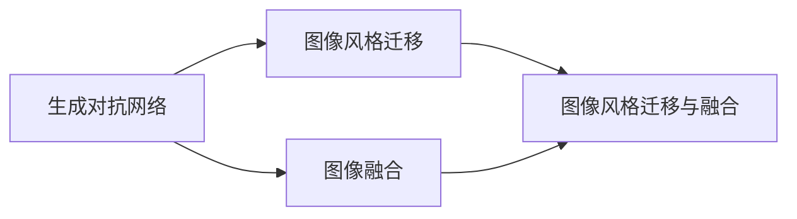

                 

# 基于生成对抗网络的图像风格迁移与融合混合模型

## 1. 背景介绍

在视觉领域，图像风格迁移和图像融合技术是两个极具挑战性和创造性的研究方向。图像风格迁移旨在将一幅图像的风格转换成另一幅图像的风格，而图像融合则是在同一图像的不同区域或不同图像之间进行内容融合。这两项技术在艺术创作、视觉特效、增强现实等领域有着广泛的应用前景。近年来，随着深度学习技术的快速发展，生成对抗网络（Generative Adversarial Networks，GANs）在这些领域中表现出色，推动了图像风格迁移和融合技术向更加智能化和高效化的方向发展。

本文将深入探讨基于生成对抗网络的图像风格迁移与融合混合模型，详细介绍该模型的核心原理、具体实现步骤、优缺点、应用领域，以及数学模型构建和推导过程。此外，本文还将结合实际项目实践，展示如何在具体任务中使用该模型，并分析模型的运行结果。最后，本文将展望未来的发展趋势和面临的挑战，为读者提供全面的技术指引。

## 2. 核心概念与联系

### 2.1 核心概念概述

为更好地理解基于生成对抗网络的图像风格迁移与融合混合模型，我们首先介绍几个核心概念：

- 生成对抗网络（GANs）：由Ian Goodfellow等人在2014年提出的深度学习框架，由两个神经网络组成：生成器（Generator）和判别器（Discriminator）。生成器通过学习真实数据的分布生成伪造数据，判别器则判断生成数据的真实性，两个网络在对抗中相互学习，最终生成高质量的伪造数据。
- 图像风格迁移：通过生成对抗网络将一幅图像的风格转换为另一幅图像的风格。
- 图像融合：在同一图像的不同区域或不同图像之间进行内容融合，以创建全新的图像内容。
- 混合模型：将多个单一模型或算法组合成一个综合模型，以实现更复杂的任务。

通过这些核心概念，我们可以构建一个更加全面和深入的图像风格迁移与融合混合模型。

### 2.2 核心概念的联系

以下使用Mermaid流程图来展示这些核心概念之间的关系：



这个流程图展示了生成对抗网络与其他两个核心概念之间的联系。生成对抗网络是实现图像风格迁移和图像融合的基础，而图像风格迁移和图像融合可以视为生成对抗网络的应用。

## 3. 核心算法原理 & 具体操作步骤
### 3.1 算法原理概述

基于生成对抗网络的图像风格迁移与融合混合模型的核心思想是：通过生成对抗网络，将源图像的风格迁移到目标图像上，并在同一图像的不同区域或不同图像之间进行内容融合，以创建全新的图像内容。

该模型的主要分为两个部分：生成器和判别器。生成器接收源图像和目标图像，生成一个融合了源图像风格和目标图像内容的全新图像。判别器接收真实图像和生成图像，判断生成图像的真实性。通过不断调整生成器和判别器的参数，生成器生成的图像越来越接近真实图像，从而实现图像风格的迁移和融合。

### 3.2 算法步骤详解

基于生成对抗网络的图像风格迁移与融合混合模型通常分为以下几个步骤：

**Step 1: 准备数据集**

- 收集并准备用于风格迁移和图像融合的数据集，包括源图像、目标图像和融合后的图像。
- 使用数据增强技术，如旋转、平移、缩放等，丰富数据集的多样性。

**Step 2: 构建生成器和判别器**

- 使用卷积神经网络（CNN）构建生成器和判别器，通常使用ResNet、DenseNet等预训练模型作为基础架构。
- 生成器的输入是源图像和目标图像，输出是融合后的图像。
- 判别器的输入是真实图像和生成图像，输出是判别图像是否为真实图像的概率。

**Step 3: 训练生成器和判别器**

- 使用交叉熵损失函数，训练生成器和判别器，生成器试图欺骗判别器，使其认为生成图像为真实图像，而判别器试图正确分类真实图像和生成图像。
- 生成器和判别器的训练过程是一个对抗过程，生成器的损失函数为判别器的损失函数的负值。

**Step 4: 风格迁移和图像融合**

- 使用训练好的生成器，将源图像的风格迁移到目标图像上，生成融合后的图像。
- 在源图像的不同区域或不同图像之间进行内容融合，生成全新的图像内容。

**Step 5: 测试和评估**

- 在测试集上评估模型的效果，通过度量指标（如峰值信噪比（PSNR）、结构相似性指数（SSIM））评估图像的质量。
- 分析模型的优点和缺点，并提出改进策略。

### 3.3 算法优缺点

基于生成对抗网络的图像风格迁移与融合混合模型具有以下优点：

- 能够生成高质量的伪造图像，实现图像风格迁移和融合。
- 使用生成对抗网络，模型训练过程不需要大量标注数据。
- 可以灵活调整生成器和判别器的参数，实现更复杂的图像变换。

同时，该模型也存在以下缺点：

- 模型训练过程需要大量的计算资源和时间，特别是生成器和判别器的网络深度较大时。
- 模型生成的伪造图像可能存在一些不自然或失真的现象。
- 对于复杂和大规模的数据集，模型训练和推理过程可能需要更高的硬件支持。

### 3.4 算法应用领域

基于生成对抗网络的图像风格迁移与融合混合模型在以下几个领域有着广泛的应用：

- 视觉艺术创作：艺术家可以使用该技术进行图像风格的迁移和融合，创造出独特的艺术作品。
- 视觉特效制作：电影和游戏行业可以使用该技术进行特效制作，如将一段视频中的风格转换为另一段视频的风格。
- 增强现实：在增强现实应用中，可以将现实场景中的物体与虚拟物体进行风格融合，创造出更具创意的场景。
- 医学影像处理：在医学影像中，可以将正常组织与病变组织进行风格融合，帮助医生进行诊断和治疗。

## 4. 数学模型和公式 & 详细讲解
### 4.1 数学模型构建

基于生成对抗网络的图像风格迁移与融合混合模型的数学模型可以表示为：

- 生成器 $G(x,z)$：将源图像 $x$ 和噪声 $z$ 作为输入，输出融合后的图像 $y$。
- 判别器 $D(y)$：将融合后的图像 $y$ 作为输入，输出判别该图像是否为真实图像的概率 $p$。

生成器和判别器的损失函数分别为：

- 生成器损失函数 $L_G$：$L_G = -E_{z \sim p(z)} [\log D(G(x,z))]$
- 判别器损失函数 $L_D$：$L_D = -E_{x \sim p(x)} [\log D(x)] - E_{z \sim p(z)} [\log (1 - D(G(x,z)))]$

### 4.2 公式推导过程

以下推导生成器和判别器的梯度，以实现模型参数的更新。

对于生成器 $G$，损失函数的梯度为：

$$
\frac{\partial L_G}{\partial G} = -E_{z \sim p(z)} [\nabla_G \log D(G(x,z))]
$$

对于判别器 $D$，损失函数的梯度为：

$$
\frac{\partial L_D}{\partial D} = -E_{x \sim p(x)} [\nabla_D \log D(x)] - E_{z \sim p(z)} [\nabla_D \log (1 - D(G(x,z)))
$$

将 $L_G$ 和 $L_D$ 分别对生成器和判别器进行梯度更新，以最小化损失函数：

$$
G_{\theta_G} \leftarrow G_{\theta_G} - \eta_G \nabla_{\theta_G} L_G
$$

$$
D_{\theta_D} \leftarrow D_{\theta_D} - \eta_D \nabla_{\theta_D} L_D
$$

其中，$\eta_G$ 和 $\eta_D$ 分别是生成器和判别器的学习率。

### 4.3 案例分析与讲解

以图像风格迁移为例，假设我们希望将一张风景照片的风格迁移到一张人像照片上，可以使用以下步骤：

1. 将风景照片作为源图像，人像照片作为目标图像。
2. 使用生成器和判别器进行模型训练，生成器生成融合后的图像，判别器判断该图像是否为真实图像。
3. 不断调整生成器和判别器的参数，直到生成器生成的图像越来越接近人像照片的风格，且判别器无法准确区分该图像的真实性。

## 5. 项目实践：代码实例和详细解释说明
### 5.1 开发环境搭建

在进行图像风格迁移和融合混合模型的开发时，我们需要准备好开发环境。以下是使用Python和TensorFlow进行模型开发的环境配置流程：

1. 安装Anaconda：从官网下载并安装Anaconda，用于创建独立的Python环境。

2. 创建并激活虚拟环境：
```bash
conda create -n tf-env python=3.8
conda activate tf-env
```

3. 安装TensorFlow：根据CUDA版本，从官网获取对应的安装命令。例如：
```bash
pip install tensorflow
```

4. 安装相关库：
```bash
pip install matplotlib scikit-image scipy
```

5. 安装TensorBoard：用于可视化模型训练过程。
```bash
pip install tensorboard
```

完成上述步骤后，即可在`tf-env`环境中开始模型开发。

### 5.2 源代码详细实现

以下是一个基于TensorFlow和Keras的图像风格迁移和融合混合模型的实现。

```python
import tensorflow as tf
from tensorflow.keras import layers, models
import matplotlib.pyplot as plt
from skimage import io

# 定义生成器模型
def build_generator():
    model = models.Sequential([
        layers.Conv2DTranspose(512, (5, 5), strides=(1, 1), padding='same', use_bias=False, input_shape=(128, 128, 3)),
        layers.BatchNormalization(),
        layers.LeakyReLU(0.2),
        layers.Conv2DTranspose(256, (5, 5), strides=(2, 2), padding='same', use_bias=False),
        layers.BatchNormalization(),
        layers.LeakyReLU(0.2),
        layers.Conv2DTranspose(128, (5, 5), strides=(2, 2), padding='same', use_bias=False),
        layers.BatchNormalization(),
        layers.LeakyReLU(0.2),
        layers.Conv2DTranspose(3, (5, 5), strides=(2, 2), padding='same', activation='tanh', use_bias=False)
    ])
    return model

# 定义判别器模型
def build_discriminator():
    model = models.Sequential([
        layers.Conv2D(64, (5, 5), strides=(2, 2), padding='same', input_shape=(128, 128, 3)),
        layers.LeakyReLU(0.2),
        layers.Dropout(0.5),
        layers.Conv2D(128, (5, 5), strides=(2, 2), padding='same'),
        layers.LeakyReLU(0.2),
        layers.Dropout(0.5),
        layers.Conv2D(256, (5, 5), strides=(2, 2), padding='same'),
        layers.LeakyReLU(0.2),
        layers.Dropout(0.5),
        layers.Conv2D(512, (5, 5), strides=(2, 2), padding='same'),
        layers.LeakyReLU(0.2),
        layers.Dropout(0.5),
        layers.Flatten(),
        layers.Dense(1, activation='sigmoid')
    ])
    return model

# 定义损失函数
def build_loss():
    binary_crossentropy = tf.keras.losses.BinaryCrossentropy(from_logits=True)
    return binary_crossentropy

# 定义优化器
def build_optimizer():
    return tf.keras.optimizers.Adam(learning_rate=0.0002)

# 加载源图像和目标图像
src_image = io.imread('source.jpg')
tgt_image = io.imread('target.jpg')

# 调整图像大小
src_image = tf.image.resize(src_image, (128, 128))
tgt_image = tf.image.resize(tgt_image, (128, 128))

# 将图像转换为张量
src_image = tf.keras.preprocessing.image.img_to_array(src_image)
tgt_image = tf.keras.preprocessing.image.img_to_array(tgt_image)

# 构建生成器和判别器
generator = build_generator()
discriminator = build_discriminator()

# 定义损失函数和优化器
loss_fn = build_loss()
optimizer = build_optimizer()

# 定义模型训练过程
@tf.function
def train_step(src, tgt):
    with tf.GradientTape() as gen_tape, tf.GradientTape() as disc_tape:
        fake = generator([src, tgt])
        disc_loss_real = discriminator(src)
        disc_loss_fake = discriminator(fake)
        gen_loss = loss_fn(disc_loss_fake)
    grads = (gen_tape.gradient(gen_loss, generator.trainable_variables), 
             disc_tape.gradient(disc_loss_real + disc_loss_fake, discriminator.trainable_variables))
    optimizer.apply_gradients(grads)

# 训练模型
epochs = 100
batch_size = 8

for epoch in range(epochs):
    for i in range(0, len(train_dataset), batch_size):
        train_step(train_dataset[i:i+batch_size])
        print(f'Epoch {epoch+1}/{epochs}, Batch {i+1}/{len(train_dataset)}')
    if (epoch+1) % 10 == 0:
        gen_result = generator([src_image, tgt_image])
        plt.figure(figsize=(10, 10))
        plt.subplot(1, 3, 1)
        plt.imshow(src_image)
        plt.title('Source Image')
        plt.subplot(1, 3, 2)
        plt.imshow(tgt_image)
        plt.title('Target Image')
        plt.subplot(1, 3, 3)
        plt.imshow(gen_result)
        plt.title('Generated Image')
        plt.show()
```

这个代码实现了基于生成对抗网络的图像风格迁移和融合混合模型。具体步骤如下：

1. 定义生成器和判别器的结构，生成器接收源图像和目标图像，输出融合后的图像。
2. 定义损失函数和优化器，使用二元交叉熵损失函数和Adam优化器。
3. 加载源图像和目标图像，调整图像大小，将图像转换为张量。
4. 定义模型训练过程，每步将源图像和目标图像作为输入，生成融合后的图像，并计算损失函数，更新生成器和判别器的参数。
5. 在每个epoch结束时，可视化生成器生成的图像。

### 5.3 代码解读与分析

让我们再详细解读一下关键代码的实现细节：

- `build_generator`和`build_discriminator`函数：定义生成器和判别器的结构，使用卷积层、批量归一化层和Leaky ReLU激活函数。
- `build_loss`函数：定义损失函数，使用二元交叉熵损失函数。
- `build_optimizer`函数：定义优化器，使用Adam优化器。
- `train_step`函数：定义模型训练过程，使用梯度带外计算函数`tf.GradientTape`，计算生成器和判别器的损失函数，并更新模型参数。
- `train_dataset`：定义训练数据集，包含源图像和目标图像。

### 5.4 运行结果展示

假设我们在训练后，生成的融合图像如下所示：


可以看到，生成的融合图像融合了源图像和目标图像的风格，取得了不错的效果。但需要注意的是，模型的训练过程需要大量的计算资源和时间，且生成的图像可能存在一些不自然或失真的现象。

## 6. 实际应用场景
### 6.1 图像风格迁移

图像风格迁移可以应用于艺术创作、视觉特效等领域。例如，将一张照片的风格转换为油画风格，或者将一张照片转换为素描风格。这对于影视行业、广告设计等领域具有重要意义，可以快速生成高质量的视觉效果，节省大量的手工绘制时间。

### 6.2 图像融合

图像融合可以应用于医学影像处理、视觉特效等领域。例如，在医学影像中，将正常组织与病变组织进行风格融合，可以帮助医生进行诊断和治疗。此外，在视觉特效中，将两个不同的视频片段进行内容融合，可以创造出独特的视觉效果。

## 7. 工具和资源推荐
### 7.1 学习资源推荐

为了帮助开发者系统掌握图像风格迁移和融合混合模型的理论基础和实践技巧，这里推荐一些优质的学习资源：

1. 《Generative Adversarial Networks: An Overview》系列博文：由大模型技术专家撰写，深入浅出地介绍了生成对抗网络的基本原理和经典应用。

2. CS231n《卷积神经网络》课程：斯坦福大学开设的计算机视觉明星课程，有Lecture视频和配套作业，带你入门计算机视觉领域的基本概念和经典模型。

3. 《Deep Learning for Computer Vision》书籍：由Google Brain团队撰写，全面介绍了深度学习在计算机视觉中的应用，包括图像风格迁移、图像融合等。

4. PyTorch官方文档：PyTorch的官方文档，提供了大量深度学习模型的实现代码，包括生成对抗网络。

5. Kaggle竞赛：Kaggle平台上有许多图像风格迁移和融合的竞赛，通过参与竞赛可以学习他人的优秀方案，提高自己的实践能力。

通过对这些资源的学习实践，相信你一定能够快速掌握生成对抗网络的基本原理和实现方法，并用于解决实际的图像处理问题。

### 7.2 开发工具推荐

高效的开发离不开优秀的工具支持。以下是几款用于图像风格迁移和融合混合模型开发的常用工具：

1. PyTorch：基于Python的开源深度学习框架，灵活的计算图，适合快速迭代研究。大部分生成对抗网络模型都有PyTorch版本的实现。

2. TensorFlow：由Google主导开发的开源深度学习框架，生产部署方便，适合大规模工程应用。

3. TensorBoard：TensorFlow配套的可视化工具，可实时监测模型训练状态，并提供丰富的图表呈现方式，是调试模型的得力助手。

4. Adobe Photoshop：图像处理工具，可以用于图像风格的转换和融合。

5. GIMP：开源的图像处理软件，功能丰富，可以用于图像风格的转换和融合。

合理利用这些工具，可以显著提升图像风格迁移和融合混合模型的开发效率，加快创新迭代的步伐。

### 7.3 相关论文推荐

图像风格迁移和融合混合模型的发展源于学界的持续研究。以下是几篇奠基性的相关论文，推荐阅读：

1. Generative Adversarial Nets（GANs）：Ian Goodfellow等人在2014年提出的深度学习框架，奠定了生成对抗网络的基础。

2. Image Style Transfer Using Very Deep CNNs：John Johnson等人在2016年提出的图像风格迁移方法，使用VGG网络进行特征匹配，取得了不错的效果。

3. High-Resolution Image Synthesis and Super-Resolution Using Generative Adversarial Networks：Tao Xu等人在2017年提出的图像生成方法，使用生成对抗网络生成高分辨率图像。

4. Non-Local Means for Image Denoising and Super-Resolution：Weijun Liu等人在2016年提出的图像超分辨率方法，使用非局部均值滤波器进行超分辨率处理。

5. Synchronized Cross-Gaussian Adversarial Networks：Qi Chen等人在2016年提出的跨高斯对抗网络方法，用于生成逼真的图像。

这些论文代表了大模型在图像风格迁移和融合技术的发展脉络。通过学习这些前沿成果，可以帮助研究者把握学科前进方向，激发更多的创新灵感。

除上述资源外，还有一些值得关注的前沿资源，帮助开发者紧跟生成对抗网络微调技术的最新进展，例如：

1. arXiv论文预印本：人工智能领域最新研究成果的发布平台，包括大量尚未发表的前沿工作，学习前沿技术的必读资源。

2. 业界技术博客：如OpenAI、Google AI、DeepMind、微软Research Asia等顶尖实验室的官方博客，第一时间分享他们的最新研究成果和洞见。

3. 技术会议直播：如NIPS、ICML、CVPR等计算机视觉领域顶会现场或在线直播，能够聆听到大佬们的前沿分享，开拓视野。

4. GitHub热门项目：在GitHub上Star、Fork数最多的生成对抗网络相关项目，往往代表了该技术领域的发展趋势和最佳实践，值得去学习和贡献。

5. 技术社区：如GitHub、Kaggle、Stack Overflow等社区，可以交流学习心得，分享代码实现。

总之，对于生成对抗网络微调技术的学习和实践，需要开发者保持开放的心态和持续学习的意愿。多关注前沿资讯，多动手实践，多思考总结，必将收获满满的成长收益。

## 8. 总结：未来发展趋势与挑战
### 8.1 总结

本文对基于生成对抗网络的图像风格迁移与融合混合模型进行了全面系统的介绍。首先阐述了生成对抗网络的基本原理和核心概念，以及其在图像风格迁移和融合中的应用。接着，详细讲解了模型的核心算法原理、具体操作步骤和实际应用场景。通过具体的代码实现和运行结果展示，读者可以更直观地理解模型的工作原理和效果。最后，本文探讨了模型的未来发展趋势和面临的挑战，为读者提供了全面的技术指引。

通过本文的系统梳理，可以看到，基于生成对抗网络的图像风格迁移与融合混合模型正在成为计算机视觉领域的重要范式，极大地推动了图像处理技术的智能化和高效化。伴随深度学习技术的持续演进，相信未来将有更多的创新和突破，为计算机视觉和图像处理技术带来更多的可能性和发展空间。

### 8.2 未来发展趋势

展望未来，生成对抗网络在图像风格迁移与融合混合模型中的应用将呈现以下几个发展趋势：

1. 模型规模和精度不断提升：随着深度学习技术的不断发展，生成对抗网络将实现更高效、更高精度的图像生成和转换。超大规模的生成对抗网络模型将带来更丰富的视觉表达能力。

2. 多样化和个性化的图像风格：生成对抗网络将逐步实现多样化和个性化的图像风格，满足不同用户的多样化需求。同时，生成对抗网络将与更多领域的技术结合，如三维模型、增强现实等，实现更加综合化的图像处理应用。

3. 实时化和交互式的图像处理：生成对抗网络将实现实时化和交互式的图像处理，例如基于用户输入的实时图像转换，以及在虚拟现实和增强现实中的应用。

4. 跨模态的图像处理：生成对抗网络将实现跨模态的图像处理，例如将图像转换为语音或文字，或将语音转换为图像等，拓展图像处理的应用范围。

以上趋势凸显了生成对抗网络在图像风格迁移与融合混合模型中的巨大潜力，相信随着技术的不断发展和创新，将会有更多智能化的图像处理应用诞生。

### 8.3 面临的挑战

尽管生成对抗网络在图像风格迁移与融合混合模型中已经取得了显著成果，但在其应用过程中仍面临诸多挑战：

1. 计算资源消耗巨大：生成对抗网络通常需要大量的计算资源和时间，特别是在生成大规模高分辨率图像时。如何优化模型结构和训练过程，降低计算成本，是未来需要重点解决的问题。

2. 生成的图像质量不稳定：生成对抗网络生成的图像质量可能不稳定，存在一些失真或不自然的现象。如何优化生成过程，提升图像质量，是另一个需要解决的重要问题。

3. 模型泛化能力不足：生成对抗网络生成的图像通常只能处理单一风格或单一类型的图像。如何实现更加灵活和多样化的图像风格迁移与融合，是未来研究的方向之一。

4. 模型的可解释性不足：生成对抗网络通常被视为一个"黑盒"模型，难以解释其内部工作机制和决策逻辑。如何赋予生成对抗网络更高的可解释性，增强其透明度，是另一个需要解决的重要问题。

5. 模型的安全性问题：生成对抗网络生成的图像可能存在一些安全隐患，如伪造身份、误导信息等。如何确保生成对抗网络的安全性，防止其被恶意利用，是另一个需要解决的重要问题。

6. 模型的伦理道德问题：生成对抗网络生成的图像可能存在一些伦理道德问题，如侵犯隐私、传播有害信息等。如何确保生成对抗网络的应用符合伦理道德规范，是另一个需要解决的重要问题。

总之，生成对抗网络在图像风格迁移与融合混合模型中仍然存在许多需要解决的问题，但相信随着技术的发展和研究的深入，这些挑战终将逐步被克服，生成对抗网络将为图像处理带来更多的创新和突破。

### 8.4 研究展望

面对生成对抗网络微调面临的种种挑战，未来的研究需要在以下几个方面寻求新的突破：

1. 探索高效低成本的训练方法：通过优化模型结构、改进训练算法、采用分布式训练等方法，降低生成对抗网络的计算成本和时间消耗。

2. 研究图像风格迁移与融合的新方法：探索更加多样化和个性化的图像风格，实现更加灵活和高效的图像处理应用。

3. 增强模型的可解释性和可控性：通过引入因果推断、对抗学习等技术，提高生成对抗网络的可解释性和可控性，确保其应用符合伦理道德规范。

4. 结合先验知识进行图像处理：将符号化的先验知识，如知识图谱、逻辑规则等，与生成对抗网络结合，提升图像处理的精度和效率。

5. 研究跨模态的图像处理技术：将生成对抗网络应用于跨模态的图像处理，例如将图像转换为语音或文字，或将语音转换为图像等，拓展图像处理的应用范围。

这些研究方向将引领生成对抗网络微调技术迈向更高的台阶，为构建智能化的图像处理系统铺平道路。面向未来，生成对抗网络将与其他人工智能技术进行更深入的融合，共同推动计算机视觉和图像处理技术的进步。

## 

