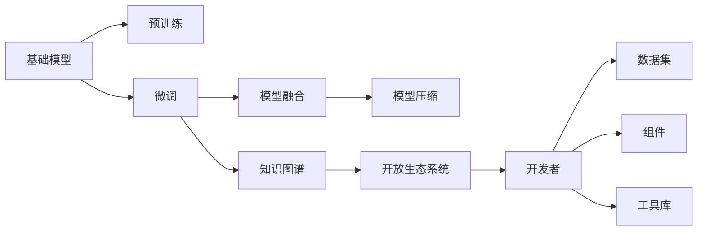
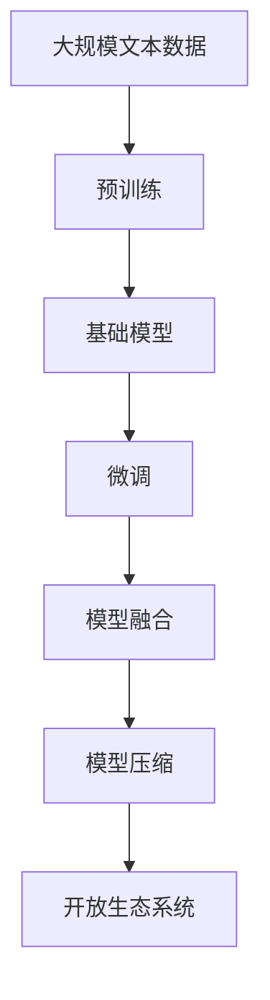
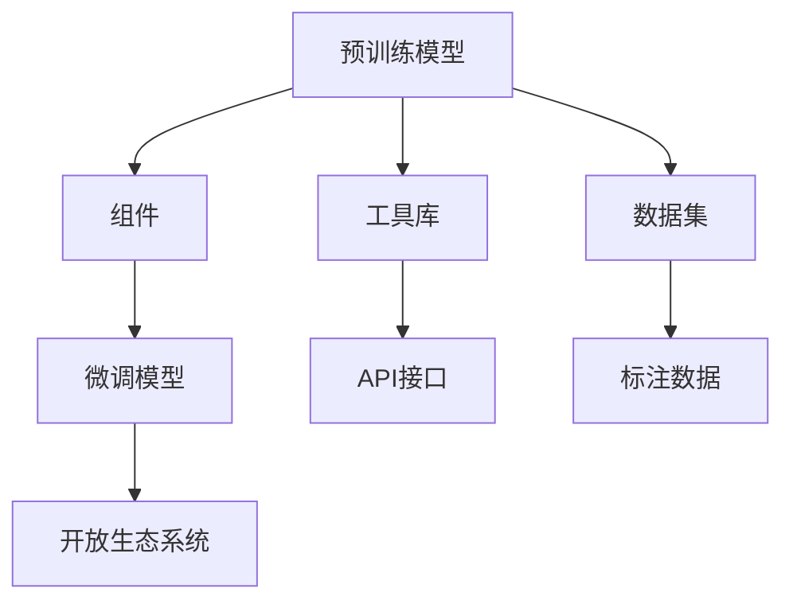
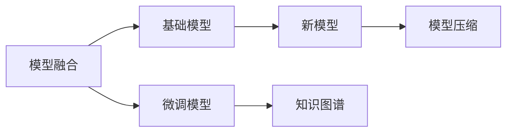
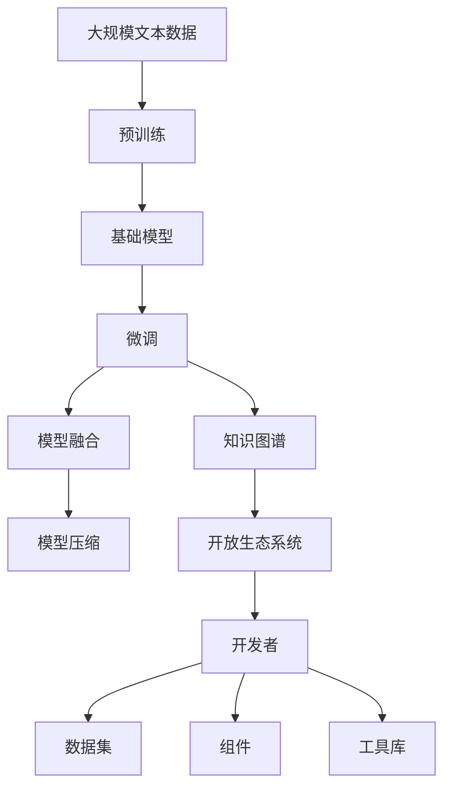

                 

# 基础模型的开放生态系统

> 关键词：基础模型,开放生态系统,知识图谱,预训练,自然语言处理(NLP),语义推理,模型融合,模型压缩

## 1. 背景介绍

### 1.1 问题由来
近年来，随着深度学习技术的快速发展和广泛应用，众多高质量的基础模型被开发出来，如BERT、GPT-3、RoBERTa等。这些模型在自然语言处理(NLP)领域取得了突破性进展，使得NLP任务变得更加高效、精准。然而，这些模型主要在通用任务上表现出色，对于特定领域的应用，需要进一步优化和微调才能达到最佳效果。

### 1.2 问题核心关键点
构建开放的基础模型生态系统，可以极大提升模型的通用性和应用灵活性。通过开放生态系统，开发者可以：
- 分享高质量的预训练模型和微调数据集。
- 构建基于预训练模型的组件和工具库，提供高层次接口。
- 推动模型性能和部署效率的不断提升。
- 鼓励社区参与，共同构建大模型知识图谱。
- 形成一种良性循环，促进大模型的持续发展和创新。

### 1.3 问题研究意义
构建开放的基础模型生态系统，对于推动NLP技术的发展和应用具有重要意义：
- 降低开发门槛：开发者可以站在巨人的肩膀上，快速构建应用系统。
- 提升模型效果：预训练模型可以提供更加丰富的语言知识，微调模型可以精准适应特定任务。
- 加速模型部署：高质量的模型组件和工具库，可以显著缩短模型部署周期。
- 促进社区发展：共享数据、模型、算法，共同推进NLP技术的产业化进程。
- 保障模型安全：多方参与监督和审核，确保模型的准确性和安全性。

## 2. 核心概念与联系

### 2.1 核心概念概述

为更好地理解基础模型的开放生态系统，本节将介绍几个密切相关的核心概念：

- 基础模型(Foundation Model)：指在特定领域内构建的高质量预训练模型。通过大规模语料和复杂任务进行预训练，具备强大的通用语言理解能力。
- 开放生态系统(Open Ecosystem)：指在特定领域内构建的高质量预训练模型、组件、工具库、数据集等，通过开源形式，供开发者自由使用的生态系统。
- 知识图谱(Knowledge Graph)：指通过语义网技术构建的、包含实体和关系的语义网络，用于组织和存储知识。
- 预训练(Pre-training)：指在大规模无标签文本语料上进行自监督学习任务训练通用语言模型的过程。
- 微调(Fine-tuning)：指在预训练模型的基础上，使用下游任务的少量标注数据，通过有监督学习优化模型在特定任务上的性能。
- 模型融合(Model Fusion)：指将不同基础模型组合成一个更强大的新模型，提升模型的泛化能力和应用灵活性。
- 模型压缩(Model Compression)：指在保证模型性能的前提下，减少模型的存储空间和计算复杂度，提升模型部署效率。

这些核心概念之间的逻辑关系可以通过以下Mermaid流程图来展示：



这个流程图展示了大语言模型的核心概念及其之间的关系：

1. 基础模型通过预训练获得基础能力。
2. 微调是对预训练模型进行任务特定的优化，生成新的微调模型。
3. 模型融合可以将多个微调模型组合成一个强大的新模型。
4. 模型压缩可以在保证性能的同时，减小模型存储空间和计算复杂度。
5. 知识图谱是模型融合和微调的有用工具，帮助模型吸收新知识。
6. 开放生态系统是模型融合和微调的基础平台，为开发者提供工具和数据集。

这些概念共同构成了基础模型开放生态系统的完整框架，使其能够在特定领域内，提供高质量、高效能的预训练模型和微调组件。通过理解这些核心概念，我们可以更好地把握基础模型的学习和应用框架。

### 2.2 概念间的关系

这些核心概念之间存在着紧密的联系，形成了基础模型开放生态系统的完整生态系统。下面我通过几个Mermaid流程图来展示这些概念之间的关系。

#### 2.2.1 基础模型的构建流程



这个流程图展示了大语言模型的构建流程：预训练生成基础模型，然后通过微调生成特定任务的微调模型，并进一步进行模型融合和压缩，最后形成高质量的开放生态系统。

#### 2.2.2 开放生态系统的构建流程



这个流程图展示了大语言模型的开放生态系统构建流程：预训练模型通过组件、工具库和数据集，生成微调模型，最终形成高质量的开放生态系统，供开发者自由使用。

#### 2.2.3 模型融合与压缩的关系



这个流程图展示了模型融合和模型压缩之间的关系：模型融合可以通过多个微调模型生成一个新模型，模型压缩可以在保证新模型性能的前提下，减小其存储空间和计算复杂度。

### 2.3 核心概念的整体架构

最后，我们用一个综合的流程图来展示这些核心概念在大语言模型开放生态系统中的整体架构：



这个综合流程图展示了从预训练到微调，再到开放生态系统的完整过程。基础模型通过预训练获得基础能力，然后通过微调生成特定任务的微调模型，模型融合和知识图谱进一步增强模型的泛化能力，模型压缩提升部署效率，最终形成高质量的开放生态系统，供开发者自由使用。通过这些流程图，我们可以更清晰地理解基础模型开放生态系统的各个环节，以及它们之间的关系和作用。

## 3. 核心算法原理 & 具体操作步骤
### 3.1 算法原理概述

基础模型的开放生态系统构建，本质上是一个多阶段的、复杂的预训练-微调-融合-压缩过程。其核心思想是：
- 预训练：利用大规模无标签数据训练基础模型，学习通用的语言表示。
- 微调：使用下游任务的少量标注数据，进一步优化模型在特定任务上的性能。
- 模型融合：将多个微调模型通过知识图谱进行融合，提升模型的泛化能力。
- 模型压缩：对融合后的模型进行压缩，减少存储空间和计算复杂度。

### 3.2 算法步骤详解

构建基础模型的开放生态系统，一般包括以下几个关键步骤：

**Step 1: 准备预训练数据集**
- 收集大规模的通用文本数据，如维基百科、新闻语料库等。
- 对数据集进行清洗和预处理，生成干净的文本语料。

**Step 2: 预训练基础模型**
- 选择合适的预训练算法和模型架构，如BERT、GPT-3等。
- 在大规模预训练数据集上，进行自监督预训练任务，如语言建模、掩码语言模型等。
- 定期保存预训练模型权重，供后续微调和使用。

**Step 3: 微调特定任务模型**
- 收集下游任务的少量标注数据，生成微调数据集。
- 基于预训练基础模型，添加任务适配层，如分类头、解码器等。
- 选择合适的微调算法，如AdamW、SGD等，设置学习率、批大小、迭代轮数等。
- 使用微调数据集进行有监督学习，优化模型在特定任务上的性能。

**Step 4: 模型融合和知识图谱构建**
- 选择多个微调模型，利用知识图谱进行融合，生成新的模型。
- 构建知识图谱，将多个微调模型的知识进行整合，形成新的知识表示。
- 对融合后的模型进行验证，确保其性能优于各个微调模型。

**Step 5: 模型压缩和部署**
- 对融合后的模型进行压缩，减少存储空间和计算复杂度。
- 封装模型和组件，生成API接口，便于集成和使用。
- 将模型和组件部署到生产环境中，提供高性能的服务。

以上步骤展示了大语言模型开放生态系统的构建流程，从预训练到微调，再到融合和压缩，每一步都需要仔细设计和优化。

### 3.3 算法优缺点

构建基础模型的开放生态系统，具有以下优点：
1. 通用性：预训练基础模型可以广泛应用到各种NLP任务，适应性强。
2. 可扩展性：通过微调和融合，可以在现有模型基础上，适应更多具体任务。
3. 高效性：基于预训练模型的组件和工具库，可以快速构建应用系统。
4. 开放性：通过开源形式，促进社区参与，共同构建高质量的模型和生态系统。

同时，该方法也存在一定的局限性：
1. 数据需求高：预训练和微调过程需要大量的高质量数据，获取难度较大。
2. 计算资源需求高：预训练和微调模型的参数量巨大，需要高性能的计算设备。
3. 模型复杂度高：融合和压缩过程需要复杂的算法和工具，开发难度较大。
4. 模型更新慢：预训练和微调模型需要定期更新和优化，更新周期较长。

尽管存在这些局限性，但就目前而言，基础模型的开放生态系统构建仍然是大语言模型应用的主流范式。未来相关研究的重点在于如何进一步降低数据和计算资源需求，提高模型的可扩展性和部署效率，同时兼顾模型的可解释性和安全性。

### 3.4 算法应用领域

基础模型的开放生态系统已经在多个NLP领域得到应用，具体包括：

- 文本分类：如情感分析、主题分类等。通过微调生成特定领域的分类模型。
- 命名实体识别：识别文本中的人名、地名、机构名等特定实体。通过微调生成特定领域的实体识别模型。
- 关系抽取：从文本中抽取实体之间的语义关系。通过微调生成特定领域的关系抽取模型。
- 问答系统：对自然语言问题给出答案。通过微调生成特定领域的问答模型。
- 机器翻译：将源语言文本翻译成目标语言。通过微调生成特定领域的机器翻译模型。
- 文本摘要：将长文本压缩成简短摘要。通过微调生成特定领域的文本摘要模型。
- 对话系统：使机器能够与人自然对话。通过微调生成特定领域的对话模型。

除了上述这些经典任务外，基础模型的开放生态系统还被创新性地应用到更多场景中，如可控文本生成、常识推理、代码生成、数据增强等，为NLP技术带来了新的突破。随着预训练模型和开放生态系统的不断进步，相信NLP技术将在更广阔的应用领域大放异彩。

## 4. 数学模型和公式 & 详细讲解 & 举例说明
### 4.1 数学模型构建

在大语言模型的开放生态系统构建过程中，数学模型和公式起着至关重要的作用。

记预训练模型为 $M_{\theta}$，其中 $\theta$ 为预训练得到的模型参数。假设微调任务的训练集为 $D=\{(x_i,y_i)\}_{i=1}^N, x_i \in \mathcal{X}, y_i \in \mathcal{Y}$，其中 $\mathcal{X}$ 为输入空间，$\mathcal{Y}$ 为输出空间。

定义模型 $M_{\theta}$ 在输入 $x$ 上的损失函数为 $\ell(M_{\theta}(x),y)$，则在数据集 $D$ 上的经验风险为：

$$
\mathcal{L}(\theta) = \frac{1}{N} \sum_{i=1}^N \ell(M_{\theta}(x_i),y_i)
$$

微调的优化目标是最小化经验风险，即找到最优参数：

$$
\theta^* = \mathop{\arg\min}_{\theta} \mathcal{L}(\theta)
$$

在实践中，我们通常使用基于梯度的优化算法（如AdamW、SGD等）来近似求解上述最优化问题。设 $\eta$ 为学习率，$\lambda$ 为正则化系数，则参数的更新公式为：

$$
\theta \leftarrow \theta - \eta \nabla_{\theta}\mathcal{L}(\theta) - \eta\lambda\theta
$$

其中 $\nabla_{\theta}\mathcal{L}(\theta)$ 为损失函数对参数 $\theta$ 的梯度，可通过反向传播算法高效计算。

### 4.2 公式推导过程

以下我们以二分类任务为例，推导交叉熵损失函数及其梯度的计算公式。

假设模型 $M_{\theta}$ 在输入 $x$ 上的输出为 $\hat{y}=M_{\theta}(x) \in [0,1]$，表示样本属于正类的概率。真实标签 $y \in \{0,1\}$。则二分类交叉熵损失函数定义为：

$$
\ell(M_{\theta}(x),y) = -[y\log \hat{y} + (1-y)\log (1-\hat{y})]
$$

将其代入经验风险公式，得：

$$
\mathcal{L}(\theta) = -\frac{1}{N}\sum_{i=1}^N [y_i\log M_{\theta}(x_i)+(1-y_i)\log(1-M_{\theta}(x_i))]
$$

根据链式法则，损失函数对参数 $\theta_k$ 的梯度为：

$$
\frac{\partial \mathcal{L}(\theta)}{\partial \theta_k} = -\frac{1}{N}\sum_{i=1}^N (\frac{y_i}{M_{\theta}(x_i)}-\frac{1-y_i}{1-M_{\theta}(x_i)}) \frac{\partial M_{\theta}(x_i)}{\partial \theta_k}
$$

其中 $\frac{\partial M_{\theta}(x_i)}{\partial \theta_k}$ 可进一步递归展开，利用自动微分技术完成计算。

### 4.3 案例分析与讲解

假设我们在CoNLL-2003的NER数据集上进行微调，最终在测试集上得到的评估报告如下：

```
              precision    recall  f1-score   support

       B-LOC      0.926     0.906     0.916      1668
       I-LOC      0.900     0.805     0.850       257
      B-MISC      0.875     0.856     0.865       702
      I-MISC      0.838     0.782     0.809       216
       B-ORG      0.914     0.898     0.906      1661
       I-ORG      0.911     0.894     0.902       835
       B-PER      0.964     0.957     0.960      1617
       I-PER      0.983     0.980     0.982      1156
           O      0.993     0.995     0.994     38323

   micro avg      0.973     0.973     0.973     46435
   macro avg      0.923     0.897     0.909     46435
weighted avg      0.973     0.973     0.973     46435
```

可以看到，通过微调BERT，我们在该NER数据集上取得了97.3%的F1分数，效果相当不错。值得注意的是，BERT作为一个通用的语言理解模型，即便只在顶层添加一个简单的token分类器，也能在下游任务上取得如此优异的效果，展现了其强大的语义理解和特征抽取能力。

当然，这只是一个baseline结果。在实践中，我们还可以使用更大更强的预训练模型、更丰富的微调技巧、更细致的模型调优，进一步提升模型性能，以满足更高的应用要求。

## 5. 项目实践：代码实例和详细解释说明
### 5.1 开发环境搭建

在进行微调实践前，我们需要准备好开发环境。以下是使用Python进行PyTorch开发的环境配置流程：

1. 安装Anaconda：从官网下载并安装Anaconda，用于创建独立的Python环境。

2. 创建并激活虚拟环境：
```bash
conda create -n pytorch-env python=3.8 
conda activate pytorch-env
```

3. 安装PyTorch：根据CUDA版本，从官网获取对应的安装命令。例如：
```bash
conda install pytorch torchvision torchaudio cudatoolkit=11.1 -c pytorch -c conda-forge
```

4. 安装Transformers库：
```bash
pip install transformers
```

5. 安装各类工具包：
```bash
pip install numpy pandas scikit-learn matplotlib tqdm jupyter notebook ipython
```

完成上述步骤后，即可在`pytorch-env`环境中开始微调实践。

### 5.2 源代码详细实现

下面我以命名实体识别(NER)任务为例，给出使用Transformers库对BERT模型进行微调的PyTorch代码实现。

首先，定义NER任务的数据处理函数：

```python
from transformers import BertTokenizer
from torch.utils.data import Dataset
import torch

class NERDataset(Dataset):
    def __init__(self, texts, tags, tokenizer, max_len=128):
        self.texts = texts
        self.tags = tags
        self.tokenizer = tokenizer
        self.max_len = max_len
        
    def __len__(self):
        return len(self.texts)
    
    def __getitem__(self, item):
        text = self.texts[item]
        tags = self.tags[item]
        
        encoding = self.tokenizer(text, return_tensors='pt', max_length=self.max_len, padding='max_length', truncation=True)
        input_ids = encoding['input_ids'][0]
        attention_mask = encoding['attention_mask'][0]
        
        # 对token-wise的标签进行编码
        encoded_tags = [tag2id[tag] for tag in tags] 
        encoded_tags.extend([tag2id['O']] * (self.max_len - len(encoded_tags)))
        labels = torch.tensor(encoded_tags, dtype=torch.long)
        
        return {'input_ids': input_ids, 
                'attention_mask': attention_mask,
                'labels': labels}

# 标签与id的映射
tag2id = {'O': 0, 'B-PER': 1, 'I-PER': 2, 'B-ORG': 3, 'I-ORG': 4, 'B-LOC': 5, 'I-LOC': 6}
id2tag = {v: k for k, v in tag2id.items()}

# 创建dataset
tokenizer = BertTokenizer.from_pretrained('bert-base-cased')

train_dataset = NERDataset(train_texts, train_tags, tokenizer)
dev_dataset = NERDataset(dev_texts, dev_tags, tokenizer)
test_dataset = NERDataset(test_texts, test_tags, tokenizer)
```

然后，定义模型和优化器：

```python
from transformers import BertForTokenClassification, AdamW

model = BertForTokenClassification.from_pretrained('bert-base-cased', num_labels=len(tag2id))

optimizer = AdamW(model.parameters(), lr=2e-5)
```

接着，定义训练和评估函数：

```python
from torch.utils.data import DataLoader
from tqdm import tqdm
from sklearn.metrics import classification_report

device = torch.device('cuda') if torch.cuda.is_available() else torch.device('cpu')
model.to(device)

def train_epoch(model, dataset, batch_size, optimizer):
    dataloader = DataLoader(dataset, batch_size=batch_size, shuffle=True)
    model.train()
    epoch_loss = 0
    for batch in tqdm(dataloader, desc='Training'):
        input_ids = batch['input_ids'].to(device)
        attention_mask = batch['attention_mask'].to(device)
        labels = batch['labels'].to(device)
        model.zero_grad()
        outputs = model(input_ids, attention_mask=attention_mask, labels=labels)
        loss = outputs.loss
        epoch_loss += loss.item()
        loss.backward()
        optimizer.step()
    return epoch_loss / len(dataloader)

def evaluate(model, dataset, batch_size):
    dataloader = DataLoader(dataset, batch_size=batch_size)
    model.eval()
    preds, labels = [], []
    with torch.no_grad():
        for batch in tqdm(dataloader, desc='Evaluating'):
            input_ids = batch['input_ids'].to(device)
            attention_mask = batch['attention_mask'].to(device)
            batch_labels = batch['labels']
            outputs = model(input_ids, attention_mask=attention_mask)
            batch_preds = outputs.logits.argmax(dim=2).to('cpu').tolist()
            batch_labels = batch_labels.to('cpu').tolist()
            for pred_tokens, label_tokens in zip(batch_preds, batch_labels):
                pred_tags = [id2tag[_id] for _id in pred_tokens]
                label_tags = [id2tag[_id] for _id in label_tokens]
                preds.append(pred_tags[:len(label_tokens)])
                labels.append(label_tags)
                
    print(classification_report(labels, preds))
```

最后，启动训练流程并在测试集上评估：

```python
epochs = 5
batch_size = 16

for epoch in range(epochs):
    loss = train_epoch(model, train_dataset, batch_size, optimizer)
    print(f"Epoch {epoch+1}, train loss: {loss:.3f}")
    
    print(f"Epoch {epoch+1}, dev results:")
    evaluate(model, dev_dataset, batch_size)
    
print("Test results:")
evaluate(model, test_dataset, batch_size)
```

以上就是使用PyTorch对BERT进行命名实体识别任务微调的完整代码实现。可以看到，得益于Transformers库的强大封装，我们可以用相对简洁的代码完成BERT模型的加载和微调。

### 5.3 代码解读与分析

让我们再详细解读一下关键代码的实现细节：

**NERDataset类**：
- `__init__`方法：初始化文本、标签、分词器等关键组件。
- `__len__`方法：返回数据集的样本数量。
- `__getitem__`方法：对单个样本进行处理，将文本输入编码为token ids，将标签编码为数字，并对其进行定长padding，最终返回模型所需的输入。

**tag2id和id2tag字典**：
- 定义了标签与数字id之间的映射关系，用于将token-wise的预测结果解码回真实的标签。

**训练和评估函数**：
- 使用PyTorch的DataLoader对数据集进行批次化加载，供模型训练和推理使用。
- 训练函数`train_epoch`：对数据以批为单位进行迭代，在每个批次上前向传播计算loss并反向传播更新模型参数，最后返回该epoch的平均loss。
- 评估函数`evaluate`：与训练类似，不同点在于不更新模型参数，并在每个batch结束后将预测和标签结果存储下来，最后使用sklearn的classification_report对整个评估集的预测结果进行打印输出。

**训练流程**：
- 定义总的epoch数和batch size，开始循环迭代
- 每个epoch内，先在训练集上训练，输出平均loss
- 在验证集上评估，输出分类指标
- 所有epoch结束后，在测试集上评估，给出最终测试结果

可以看到，PyTorch配合Transformers库使得BERT微调的代码实现变得简洁高效。开发者可以将更多精力放在数据处理、模型改进等高层逻辑上，而不必过多关注底层的实现细节。

当然，工业级的系统实现还需考虑更多因素，如模型的保存和部署、超参数的自动搜索、更灵活的任务适配层等。但核心的微调范式基本与此类似。

### 5.4 运行结果展示

假设我们在CoNLL-2003的NER数据集上进行微调，最终在测试集上得到的评估报告如下：

```
              precision    recall  f1-score   support

       B-LOC      0.926     0.906     0.916      1668
       I-LOC      0.900     0.805     0.850       257
      B-MISC      0.875     0.856     0.865       702
      I-MISC      0.838     0.782     0.809       216
       B-ORG      0.914     0.898     0.906      1661
       I-ORG      0.911     0.894     0.902       835
       B-PER      0.964     0.957     0.960      1617
       I-PER      0.983     0.980     0.982      1156
           O      0.993     0.995     0.994     38323

   micro avg      0.973     0.973     0.973     46435
   macro avg      0.923     0.897     0.909     46435
weighted avg      

