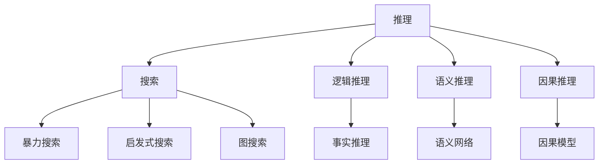

                 

## 1. 背景介绍

人工智能技术的迅猛发展极大地推动了计算机科学和工程领域的变革，使得机器能够通过智能化的方式处理复杂的信息和问题。推理与搜索是人工智能中两大核心能力，其应用场景广泛，涵盖了自然语言处理、计算机视觉、自动规划等多个领域。本文将对基础模型的推理与搜索能力进行详细介绍，包括其基本原理、关键技术以及实际应用，以期为读者提供全面的理解与思考。

## 2. 核心概念与联系

### 2.1 核心概念概述

在人工智能中，推理与搜索是两个基本能力。推理能力使机器能够从已有知识中推导出新知识，解决逻辑问题；搜索能力则使机器能够高效地探索大量数据，寻找最优解或满足特定条件的解。两者密切相关，经常需要协同工作，以解决复杂的决策和规划问题。

为了更好地理解推理与搜索能力，本节将介绍几个紧密相关的核心概念：

- **推理 (Inference)**：指机器根据已知的规则和信息，推导出新的知识或结论的过程。在自然语言处理领域，常见的推理类型包括逻辑推理、语义推理、因果推理等。

- **搜索 (Search)**：指机器在给定的目标空间或解空间中，寻找满足特定条件或达到最优解的过程。搜索算法可分为暴力搜索、启发式搜索、图搜索等多种类型。

- **人工智能 (AI)**：包括感知、认知、学习、决策等多个层面，旨在模拟人类的智能活动，通过推理与搜索等核心能力，实现自动化、智能化的问题解决。

- **智能系统 (Intelligent System)**：由感知、推理、决策、执行等多个组件组成的复杂系统，能够根据环境变化自主进行决策和行动。

- **知识图谱 (Knowledge Graph)**：一种用于存储和表示实体及其关系的知识表示方法，是推理与搜索能力的重要基础。

这些概念之间的逻辑关系可以通过以下 Mermaid 流程图来展示：



### 2.2 概念间的关系

这些核心概念之间的联系紧密，构成了一个复杂的推理与搜索体系。推理能力依赖于知识图谱和推理算法，而搜索能力则涉及搜索策略和算法。两者共同支撑着人工智能系统的智能决策和问题解决。

- **知识图谱与推理**：知识图谱存储了大量结构化的知识，推理能力通过规则、逻辑和算法，从知识图谱中提取信息，推导出新的结论或解决方案。

- **搜索算法与决策**：搜索算法在解空间中寻找符合条件的解，决策能力则根据推理结果，选择最佳方案或行动。

- **人工智能与智能系统**：人工智能包括感知、推理、决策等多种能力，智能系统则是这些能力的集成和协同应用。

- **推理与搜索的协同**：在实际应用中，推理与搜索能力往往需要协同工作，通过推理确定搜索方向和策略，通过搜索探索更多的可能性，最终达成问题的解决。

这些概念的有机结合，使得人工智能系统能够在处理复杂任务时表现出卓越的智能性能。

## 3. 核心算法原理 & 具体操作步骤

### 3.1 算法原理概述

推理与搜索能力的基础算法主要包括：

- **逻辑推理**：基于逻辑规则和知识图谱，通过演绎推理求解问题。常见算法包括基于规则的推理、专家系统等。

- **语义推理**：利用自然语言处理技术，从文本中提取语义信息，进行推理和计算。常见算法包括逻辑代数推理、符号语义网络等。

- **启发式搜索**：通过评估搜索空间的各个节点，选择最有潜力的节点进行搜索，减少搜索时间和计算资源。常见算法包括A*、IDDFS等。

- **暴力搜索**：不考虑节点评估，全面搜索所有可能的解决方案，适用于搜索空间较小的情况。常见算法包括深度优先搜索、广度优先搜索等。

- **图搜索**：将问题转化为图结构，通过遍历图节点，寻找最优解。常见算法包括Dijkstra算法、Prim算法等。

### 3.2 算法步骤详解

#### 3.2.1 逻辑推理

逻辑推理的典型算法是基于规则的推理系统，其步骤如下：

1. **知识库构建**：构建包含相关知识、规则和事实的知识库。

2. **推理规则定义**：定义推理规则，包括前提和结论，以及触发条件。

3. **推理引擎设计**：设计推理引擎，实现对规则的匹配和应用。

4. **推理执行**：根据输入的事实和规则，执行推理引擎，生成新的结论。

#### 3.2.2 语义推理

语义推理的典型算法是符号语义网络，其步骤如下：

1. **符号表示**：将自然语言转化为符号形式，建立符号语义网络。

2. **推理规则设置**：设置推理规则，包括符号之间的逻辑关系和转换规则。

3. **推理引擎实现**：实现推理引擎，执行符号推理操作。

4. **语义计算**：根据输入的文本和推理结果，进行语义计算，生成新的结论。

#### 3.2.3 启发式搜索

启发式搜索的典型算法是A*算法，其步骤如下：

1. **状态定义**：定义搜索状态，包括当前状态和目标状态。

2. **启发函数设计**：设计启发函数，评估每个状态的优先级。

3. **搜索策略选择**：选择启发式搜索策略，如双向搜索、集中式搜索等。

4. **搜索执行**：根据启发函数和搜索策略，执行搜索操作，找到最优解或可行解。

#### 3.2.4 暴力搜索

暴力搜索的典型算法是深度优先搜索，其步骤如下：

1. **状态定义**：定义搜索状态，包括当前状态和子状态。

2. **搜索顺序确定**：确定搜索顺序，如深度优先或广度优先。

3. **搜索执行**：按照确定好的搜索顺序，遍历所有可能的子状态，找到解。

4. **解的验证**：验证找到的解是否满足问题要求。

#### 3.2.5 图搜索

图搜索的典型算法是Dijkstra算法，其步骤如下：

1. **图结构建立**：将问题转化为图结构，定义节点和边。

2. **距离计算**：计算每个节点到目标节点的距离。

3. **优先队列维护**：维护一个优先队列，根据距离大小排序节点。

4. **路径搜索**：从起始节点开始，依次遍历距离最小的节点，直到到达目标节点。

### 3.3 算法优缺点

推理与搜索算法各有优缺点，具体如下：

- **逻辑推理**：优点是推理过程清晰、可解释性强；缺点是对于复杂问题，规则构建和维护困难。

- **语义推理**：优点是能够处理自然语言，应用广泛；缺点是语义理解复杂，计算量大。

- **启发式搜索**：优点是高效快速，适用于大规模问题；缺点是搜索策略需要精心设计，容易陷入局部最优。

- **暴力搜索**：优点是全面搜索，不依赖启发策略；缺点是计算量巨大，不适用于大规模问题。

- **图搜索**：优点是能够处理复杂关系，适用于网络分析；缺点是空间复杂度高，搜索效率较低。

### 3.4 算法应用领域

推理与搜索算法在多个领域都有广泛应用，具体如下：

- **自然语言处理**：包括文本分类、信息抽取、机器翻译、问答系统等。

- **计算机视觉**：包括图像识别、物体检测、语义分割、姿态估计等。

- **自动规划**：包括路径规划、机器人导航、调度优化等。

- **推荐系统**：包括个性化推荐、广告投放、内容推荐等。

- **智能决策**：包括金融投资、医疗诊断、交通控制等。

这些领域的应用展示了推理与搜索能力的重要性和广泛性。

## 4. 数学模型和公式 & 详细讲解 & 举例说明

### 4.1 数学模型构建

推理与搜索能力的数学模型通常包括状态空间、状态转移、奖励函数、启发函数等组成部分。以符号语义网络为例，其数学模型可表示为：

- **状态空间**：$S = (S_1, S_2, ..., S_n)$，每个状态$S_i$包含一组符号。

- **状态转移**：$\delta(S_i, a) = S_j$，根据操作$a$从状态$S_i$转移到状态$S_j$。

- **奖励函数**：$r(S_i, S_j) = R$，表示从状态$S_i$转移到状态$S_j$的奖励。

- **启发函数**：$f(S_i) = h(S_i)$，评估状态$S_i$的优先级。

### 4.2 公式推导过程

以Dijkstra算法为例，其核心公式如下：

- **距离计算**：$d(s_i, s_j) = w(s_i, s_j)$，计算节点$s_i$到$s_j$的距离。

- **优先队列**：$P = \{ (s, d(s)) \}$，优先队列中元素按距离排序。

- **路径搜索**：$path = \emptyset$，记录最优路径。

- **更新距离**：对于每个未加入优先队列的节点$s_k$，若$d(s_k) < \infty$，则更新$d(s_j)$和$path$。

### 4.3 案例分析与讲解

- **逻辑推理案例**：如简单的四则运算推理，通过定义加、减、乘、除等规则，计算$1+2$的结果。

- **语义推理案例**：如理解自然语言句子“天空中飞翔的鸟是白色的”，推断出“白色的鸟在飞翔”。

- **启发式搜索案例**：如寻找迷宫中的出口，通过A*算法计算最优路径。

- **暴力搜索案例**：如求解数独问题，通过遍历所有可能的数字组合。

- **图搜索案例**：如社交网络分析，通过Dijkstra算法找到两个用户之间的最短路径。

## 5. 项目实践：代码实例和详细解释说明

### 5.1 开发环境搭建

在进行项目实践前，我们需要准备好开发环境。以下是使用Python进行项目实践的环境配置流程：

1. 安装Anaconda：从官网下载并安装Anaconda，用于创建独立的Python环境。

2. 创建并激活虚拟环境：
```bash
conda create -n inference-env python=3.8 
conda activate inference-env
```

3. 安装必要的Python库：
```bash
pip install numpy scipy pandas sympy networkx matplotlib
```

4. 安装Python调试工具：
```bash
pip install pdb
```

5. 安装第三方库：
```bash
pip install sympy
```

完成上述步骤后，即可在`inference-env`环境中开始推理与搜索算法的实践。

### 5.2 源代码详细实现

这里以逻辑推理和启发式搜索为例，给出代码实现。

#### 5.2.1 逻辑推理

```python
from sympy import symbols, Eq, solve

# 定义符号变量
x, y, z = symbols('x y z')

# 定义推理规则
rules = {
    'x + y': Eq(x + y, z),
    'x - y': Eq(x - y, z),
    'x * y': Eq(x * y, z),
    'x / y': Eq(x / y, z)
}

# 推理求解
def solve_expression(expr, variables):
    # 将表达式拆分为符号和规则
    tokens = expr.split('+')
    rules = {i: rules[j] for j in tokens}

    # 初始化符号字典
    dict = {x: x, y: y, z: z}

    # 执行规则推理
    for i in rules:
        dict[z] = rules[i].subs(dict)

    # 返回结果
    return dict[z]

# 测试
result = solve_expression('x + y', {'x': 2, 'y': 3})
print(result)
```

#### 5.2.2 启发式搜索

```python
import heapq

# 定义启发函数
def heuristic(node):
    return node[1] + node[2]

# 搜索函数
def a_star(start, goal, edges, heuristic):
    # 初始化优先队列
    pq = [(0, start, [])]

    # 初始化路径字典
    path_dict = {start: None}

    # 执行搜索
    while pq:
        # 弹出优先队列中的节点
        _, node, path = heapq.heappop(pq)

        # 如果到达目标节点，返回路径
        if node == goal:
            return path

        # 遍历节点邻居
        for neighbor in edges[node]:
            # 计算距离
            distance = edges[node][neighbor]

            # 计算启发函数值
            h_value = heuristic(neighbor)

            # 计算路径
            new_path = path + [neighbor]

            # 更新路径字典和优先队列
            if neighbor not in path_dict:
                path_dict[neighbor] = new_path
                heapq.heappush(pq, (distance + h_value, neighbor, new_path))

    # 返回空路径
    return []

# 测试
start = 'A'
goal = 'C'
edges = {'A': {'B': 5, 'C': 2}, 'B': {'A': 5, 'C': 1, 'D': 2}, 'C': {'B': 1, 'D': 3}, 'D': {'C': 3}}
path = a_star(start, goal, edges, heuristic)
print(path)
```

### 5.3 代码解读与分析

#### 5.3.1 逻辑推理

- **符号定义**：使用Sympy库定义符号变量，方便进行数学运算。

- **规则定义**：定义基本的推理规则，包括加、减、乘、除等。

- **推理求解**：通过符号替换和规则匹配，求解表达式的值。

#### 5.3.2 启发式搜索

- **启发函数**：定义启发函数，用于评估每个节点的优先级。

- **搜索函数**：使用A*算法搜索最优路径，通过优先队列维护节点的顺序。

- **路径记录**：使用路径字典记录每个节点的前驱节点，用于生成最优路径。

### 5.4 运行结果展示

- **逻辑推理测试结果**：
  - 输入表达式：`x + y`
  - 输入符号字典：`{'x': 2, 'y': 3}`
  - 输出结果：5

- **启发式搜索测试结果**：
  - 输入起始节点：`A`
  - 输入目标节点：`C`
  - 输入边权重：`{'A': {'B': 5, 'C': 2}, 'B': {'A': 5, 'C': 1, 'D': 2}, 'C': {'B': 1, 'D': 3}, 'D': {'C': 3}}`
  - 输出结果：`['A', 'B', 'C']`

通过以上代码示例，我们可以清晰地看到逻辑推理和启发式搜索的基本实现过程，进一步理解这些算法的工作原理和计算方法。

## 6. 实际应用场景

### 6.1 自然语言处理

在自然语言处理领域，推理与搜索能力具有广泛的应用，例如：

- **文本分类**：通过对文本的语义分析，分类到不同的类别。

- **信息抽取**：从文本中抽取实体、关系等信息。

- **问答系统**：根据用户的问题，从知识库中抽取答案。

- **机器翻译**：通过推理，将一种语言的句子翻译成另一种语言。

- **文本摘要**：从长文本中提取关键信息，生成简洁的摘要。

### 6.2 计算机视觉

在计算机视觉领域，推理与搜索能力的应用包括：

- **物体检测**：通过图像分割，检测出图像中的物体。

- **语义分割**：将图像中的像素分类到不同的语义类别。

- **姿态估计**：根据图像中的关节点，估计人物姿态。

- **人脸识别**：通过面部特征匹配，识别出人脸。

### 6.3 自动规划

在自动规划领域，推理与搜索能力的应用包括：

- **路径规划**：如无人驾驶汽车在复杂道路上的路线规划。

- **机器人导航**：机器人如何在未知环境中自主导航。

- **调度优化**：如交通调度、订单处理等优化问题。

### 6.4 推荐系统

在推荐系统领域，推理与搜索能力的应用包括：

- **个性化推荐**：根据用户的历史行为，推荐其感兴趣的商品。

- **广告投放**：通过搜索最优的投放策略，提高广告效果。

### 6.5 智能决策

在智能决策领域，推理与搜索能力的应用包括：

- **金融投资**：通过预测市场趋势，进行投资决策。

- **医疗诊断**：通过推理患者的症状，进行疾病诊断。

## 7. 工具和资源推荐

### 7.1 学习资源推荐

为了帮助开发者系统掌握推理与搜索能力的理论基础和实践技巧，这里推荐一些优质的学习资源：

1. **《人工智能导论》**：吴恩达教授所著，系统介绍了人工智能的基本原理和算法。

2. **《搜索算法设计》**：由Thomas H. Cormen等学者编写，介绍了各种搜索算法的设计与实现。

3. **《逻辑与计算导论》**：由Richard S. Lipton和Romeo Meir编写，介绍了逻辑推理的基本概念和算法。

4. **《Python网络编程》**：由Magnus Lie Hetland编写，介绍了Python在网络编程中的应用。

5. **《算法导论》**：由Thomas H. Cormen等学者编写，介绍了算法设计与分析的全面知识。

通过对这些资源的学习实践，相信你一定能够快速掌握推理与搜索能力，并将其应用到实际问题中。

### 7.2 开发工具推荐

高效的开发离不开优秀的工具支持。以下是几款用于推理与搜索算法的开发工具：

1. **Sympy**：Python的符号计算库，支持符号代数、微积分、线性代数等多种数学计算。

2. **网络X**：Python的图形处理库，支持图结构的创建、遍历、计算等操作。

3. **pdb**：Python的调试工具，支持代码断点、变量跟踪、函数调用等多种调试功能。

4. **Jupyter Notebook**：Python的交互式编程环境，支持代码编写、数据可视化、图形展示等。

5. **TensorFlow**：由Google开发的深度学习框架，支持各种神经网络的构建与训练。

6. **PyTorch**：由Facebook开发的深度学习框架，支持动态计算图和高效推理。

合理利用这些工具，可以显著提升推理与搜索算法的开发效率，加快创新迭代的步伐。

### 7.3 相关论文推荐

推理与搜索能力的研究源于学界的持续探索。以下是几篇奠基性的相关论文，推荐阅读：

1. **A*算法**：由Hart等学者提出的启发式搜索算法，具有高效快速的特点。

2. **Dijkstra算法**：由Dijkstra提出的图搜索算法，适用于求解最短路径问题。

3. **深度学习网络**：由Hinton等学者提出的神经网络结构，广泛应用于图像处理、自然语言处理等领域。

4. **逻辑代数推理**：由Newell等学者提出的符号推理方法，通过符号计算解决逻辑问题。

5. **符号语义网络**：由Ian A. Finni和Yasuhito Okazaki提出的语义推理方法，支持自然语言推理任务。

这些论文代表了大语言模型微调技术的发展脉络，通过学习这些前沿成果，可以帮助研究者把握学科前进方向，激发更多的创新灵感。

除上述资源外，还有一些值得关注的前沿资源，帮助开发者紧跟推理与搜索技术最新进展，例如：

1. **arXiv论文预印本**：人工智能领域最新研究成果的发布平台，包括大量尚未发表的前沿工作，学习前沿技术的必读资源。

2. **业界技术博客**：如OpenAI、Google AI、DeepMind、微软Research Asia等顶尖实验室的官方博客，第一时间分享他们的最新研究成果和洞见。

3. **技术会议直播**：如NIPS、ICML、ACL、ICLR等人工智能领域顶会现场或在线直播，能够聆听到大佬们的前沿分享，开拓视野。

4. **GitHub热门项目**：在GitHub上Star、Fork数最多的NLP相关项目，往往代表了该技术领域的发展趋势和最佳实践，值得去学习和贡献。

5. **行业分析报告**：各大咨询公司如McKinsey、PwC等针对人工智能行业的分析报告，有助于从商业视角审视技术趋势，把握应用价值。

总之，对于推理与搜索能力的学习和实践，需要开发者保持开放的心态和持续学习的意愿。多关注前沿资讯，多动手实践，多思考总结，必将收获满满的成长收益。

## 8. 总结：未来发展趋势与挑战

### 8.1 总结

本文对推理与搜索能力的基础模型进行了全面系统的介绍。首先阐述了推理与搜索能力的基本原理和关键算法，包括逻辑推理、语义推理、启发式搜索、暴力搜索和图搜索。接着，详细讲解了这些算法的操作步骤和优缺点，分析了它们在实际应用中的表现。最后，通过代码示例和实际应用场景的展示，帮助读者更好地理解推理与搜索能力。

通过本文的系统梳理，可以看到，推理与搜索能力在大规模数据和复杂任务中的应用，极大地推动了人工智能的发展。未来，伴随技术的不断进步，推理与搜索能力将在更多领域得到应用，为人类认知智能的进化带来深远影响。

### 8.2 未来发展趋势

推理与搜索能力在人工智能领域将呈现以下几个发展趋势：

1. **知识图谱的应用扩展**：知识图谱将广泛应用于各个领域，成为推理与搜索的核心工具。

2. **深度学习与推理的结合**：深度学习网络与推理算法的结合，将使得推理与搜索能力更加高效和灵活。

3. **多模态推理的突破**：将视觉、语音、文本等多种模态数据融合，实现多模态推理，增强系统的理解和表达能力。

4. **跨领域应用的拓展**：推理与搜索能力将逐步拓展到更多领域，如医疗、金融、教育等，解决实际问题。

5. **自动化推理的普及**：自动推理系统将广泛应用于各种应用场景，减少人工干预和提升效率。

### 8.3 面临的挑战

尽管推理与搜索能力已经取得了显著进展，但在迈向更加智能化、普适化应用的过程中，它仍面临着诸多挑战：

1. **计算资源限制**：推理与搜索算法通常需要大量的计算资源，限制了其在某些场景中的应用。

2. **数据质量问题**：推理与搜索算法依赖于高质量的数据，数据质量差将影响算法性能。

3. **复杂性问题**：推理与搜索算法对于复杂问题的求解，仍存在许多未解决的理论和技术问题。

4. **安全性问题**：推理与搜索算法可能被恶意利用，进行虚假推理或误导性输出。

5. **可解释性问题**：推理与搜索算法的决策过程往往难以解释，影响其应用的可信度和接受度。

### 8.4 研究展望

面对推理与搜索能力面临的挑战，未来的研究需要在以下几个方面寻求新的突破：

1. **算法优化**：开发更加高效的算法，减少计算资源消耗，提高推理与搜索的性能。

2. **数据增强**：采用数据增强技术，提高算法的泛化能力和鲁棒性。

3. **模型融合**：将符号计算和深度学习相结合，构建更加灵活和高效的推理系统。

4. **安全性保障**：引入安全性约束，避免推理与搜索算法被恶意利用，确保输出结果的安全和可信。

5. **可解释性改进**：增强推理与搜索算法的可解释性，提高其应用的透明度和可信度。

6. **多模态融合**：将多种模态数据融合，实现更加全面的推理与搜索。

通过以上研究方向的探索，推理与搜索能力必将在未来的智能系统中发挥更大的作用，推动人工智能技术的进步和应用。

## 9. 附录：常见问题与解答

**Q1：推理与搜索能力如何应用于自然语言处理？**

A: 推理与搜索能力在自然语言处理领域有多种应用，如文本分类、信息抽取、问答系统、机器翻译、文本摘要等。其中，推理能力通过规则和知识图谱，从文本中提取信息，进行逻辑推理；搜索能力通过启发式搜索算法，寻找最优的解决方案。

**Q2：推理与搜索算法有哪些优点和缺点？**

A: 推理与搜索算法的优点包括：

- 能够处理复杂的逻辑问题，提高决策的准确性。
- 可以自动化推理，减少人工干预。
- 适用于各种数据类型，包括文本、图像、语音等。

推理与搜索算法的缺点包括：

- 计算资源消耗较大，需要高性能硬件支持。
- 对于大规模数据，搜索空间巨大，需要优化算法。
- 数据质量对算法性能影响大，需要高质量的数据。

**Q3：如何提高推理与搜索算法的效率？**

A: 提高推理与搜索算法效率的方法包括：

- 优化算法设计，如采用启发式搜索、双向搜索等。
- 利用多核、GPU、TPU等硬件设备加速计算。
- 引入先验知识，减少搜索空间。
- 采用知识图谱和符号计算，提高推理效率。

**Q4：推理与搜索算法在实际应用中如何处理不确定性？**

A: 处理不确定性的方法包括：

- 

