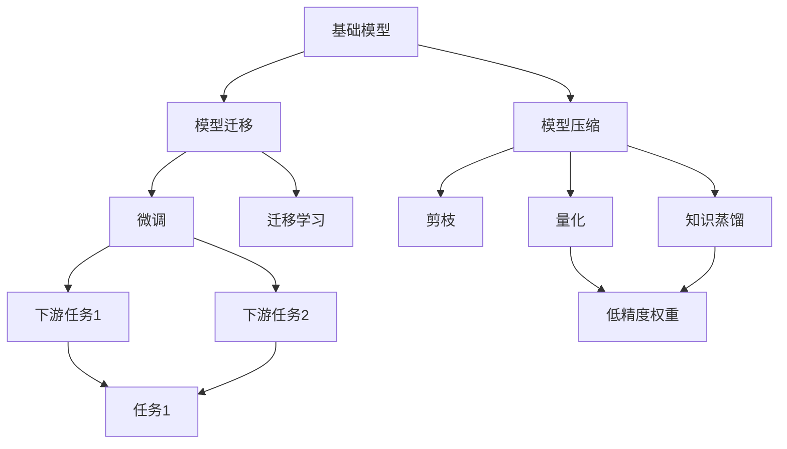

                 

# 基础模型的潜在下游应用

> 关键词：基础模型, 模型压缩, 模型迁移, 下游任务, 模型裁剪, 模型量化

## 1. 背景介绍

随着深度学习技术的迅速发展，深度神经网络已经广泛应用于图像处理、自然语言处理、语音识别等各个领域。然而，这些深度模型通常参数量巨大，计算和存储成本高昂。为了在实际应用中更好地部署和运行深度模型，模型压缩和模型迁移技术应运而生。本文将详细探讨基础模型在不同下游任务中的应用，包括模型压缩、模型迁移、模型裁剪和模型量化等。

## 2. 核心概念与联系

### 2.1 核心概念概述

- **基础模型**：在深度学习领域，基础模型通常指经过训练并用于特定任务的深度神经网络。这些模型通常具有较大的参数量和计算复杂度，但可以应用于各种下游任务。
- **模型压缩**：模型压缩是一种技术，旨在减小模型的参数量，同时保持或提高模型的性能。常用的模型压缩方法包括剪枝、量化和知识蒸馏等。
- **模型迁移**：模型迁移是将一个模型从一种任务迁移到另一种任务的过程。通常情况下，一个预训练的模型可以通过微调或者迁移学习来适应新的任务。
- **模型裁剪**：模型裁剪是通过移除模型中不必要的层或参数，减小模型尺寸，提高推理速度。
- **模型量化**：模型量化是将模型的权重从浮点精度降低到更低的比特精度，减少存储空间和计算量。

这些概念间存在紧密联系，共同构成了深度模型在实际应用中的重要技术手段。通过模型压缩和模型迁移，可以在保证模型性能的前提下，减小模型的规模，从而实现更高效的部署和运行。模型裁剪和模型量化则是进一步减小模型规模、提升运行效率的关键技术。

### 2.2 概念间的关系

我们可以使用Mermaid流程图来展示这些核心概念之间的关系：



这个流程图展示了基础模型在不同技术手段下的应用路径：

1. **基础模型**首先经过模型压缩技术，减小模型规模。
2. **模型压缩**包括剪枝、量化和知识蒸馏等方法，这些方法可以进一步减小模型尺寸，提升运行效率。
3. **模型迁移**通过微调或迁移学习，使模型适应新的下游任务。
4. **下游任务**可以是分类、回归、生成等各类NLP任务。
5. **模型量化**将浮点模型转换为低精度模型，减小存储空间和计算量。

这些概念通过技术手段紧密联系，形成了一个完整的模型应用链条，覆盖了从模型训练到任务部署的各个环节。

## 3. 核心算法原理 & 具体操作步骤

### 3.1 算法原理概述

模型压缩和模型迁移技术通常基于以下两个核心原理：

- **知识保留**：通过剪枝、量化等技术减小模型规模的同时，尽可能保留模型中重要的知识。
- **模型适配**：通过微调或迁移学习，使基础模型能够适应新的下游任务。

### 3.2 算法步骤详解

#### 3.2.1 模型压缩

1. **剪枝**：剪枝是指移除模型中对模型性能影响较小的参数。常见的剪枝方法包括权重剪枝、结构剪枝和稀疏矩阵表示。剪枝的具体步骤如下：
   - 计算模型各个层的梯度。
   - 通过梯度阈值或参数重要性评分，选择保留的参数。
   - 去除未保留的参数和相应的连接。

2. **量化**：量化是将模型权重从浮点精度转换为低精度精度，如8位或16位整数。量化方法包括权重量化、激活量化和混合量化。量化步骤如下：
   - 选择适当的量化策略和目标精度。
   - 将权重和激活值映射到目标精度范围内。
   - 对量化后的模型进行微调或重新训练，以调整模型性能。

3. **知识蒸馏**：知识蒸馏是指通过教师模型指导学生模型的训练，使学生模型学习到教师模型的知识。知识蒸馏步骤如下：
   - 选择一个性能较好的教师模型。
   - 将教师模型和学生模型连接，构建蒸馏任务。
   - 训练学生模型，使学生模型学习教师模型的知识。

#### 3.2.2 模型迁移

1. **微调**：微调是通过有标签数据对模型进行微调，使其适应新的下游任务。微调步骤如下：
   - 准备下游任务的标注数据集。
   - 将预训练模型的顶层作为任务层，并添加适当的损失函数。
   - 使用标注数据集对模型进行微调，调整顶层参数。

2. **迁移学习**：迁移学习是指将预训练模型在不同任务间进行迁移，通过迁移学习，模型可以更好地适应新的任务。迁移学习步骤如下：
   - 选择一个预训练模型。
   - 微调模型的顶层或添加任务层，适配新的下游任务。
   - 在新的下游任务上重新训练模型，适应任务特性。

### 3.3 算法优缺点

模型压缩和模型迁移技术的优点包括：

- **减小计算和存储成本**：通过减小模型规模，降低计算和存储需求。
- **提高推理速度**：减小模型规模，降低计算复杂度，提升推理速度。
- **保持模型性能**：通过剪枝、量化和知识蒸馏等技术，尽可能保留模型中的重要知识，保持或提升模型性能。

然而，这些技术也存在一些缺点：

- **计算成本**：在模型压缩和模型迁移过程中，需要额外的计算资源和计算时间。
- **模型泛化性能**：压缩和迁移可能影响模型的泛化性能，特别是在高噪声或小数据集上。
- **技术门槛**：这些技术需要一定的技术积累和经验，开发和应用过程中可能存在一定的技术挑战。

### 3.4 算法应用领域

模型压缩和模型迁移技术在多个领域都有广泛应用，以下是一些典型应用场景：

1. **自然语言处理**：在自然语言处理领域，模型压缩和迁移可以应用于情感分析、机器翻译、文本生成等任务。通过剪枝、量化和知识蒸馏，可以在保证性能的前提下，减小模型规模，提升推理速度。

2. **计算机视觉**：在计算机视觉领域，模型压缩和迁移可以应用于图像分类、物体检测、实例分割等任务。通过剪枝和量化，可以减小模型规模，提升推理速度。通过迁移学习，模型可以适应新的图像数据集和任务。

3. **音频处理**：在音频处理领域，模型压缩和迁移可以应用于语音识别、情感识别、语音合成等任务。通过剪枝和量化，可以减小模型规模，提升推理速度。通过迁移学习，模型可以适应新的音频数据集和任务。

4. **推荐系统**：在推荐系统中，模型压缩和迁移可以应用于物品推荐、用户画像生成等任务。通过剪枝和量化，可以减小模型规模，提升推理速度。通过迁移学习，模型可以适应新的用户数据和推荐策略。

## 4. 数学模型和公式 & 详细讲解 & 举例说明

### 4.1 数学模型构建

基础模型在特定任务上的压缩和迁移可以通过以下数学模型进行描述：

设基础模型为 $M_{\theta}$，其中 $\theta$ 为模型的参数。下游任务为 $T$，任务空间为 $\mathcal{T}$。在任务 $T$ 上的标注数据集为 $D=\{(x_i, y_i)\}_{i=1}^N$，其中 $x_i$ 为输入，$y_i$ 为标签。

定义模型 $M_{\theta}$ 在输入 $x_i$ 上的输出为 $\hat{y}=M_{\theta}(x_i)$。定义损失函数 $\ell(M_{\theta}(x_i), y_i)$，衡量模型预测输出与真实标签之间的差异。

### 4.2 公式推导过程

在模型压缩中，剪枝可以通过计算每个参数的重要性评分来确定是否保留。常见的重要性评分方法包括L1正则化、梯度阈值和基于目标函数的评分方法。

在模型迁移中，微调可以通过在任务 $T$ 上添加任务层，重新训练模型。假设任务 $T$ 的任务层为 $L_T$，损失函数为 $\ell_T$，则微调的优化目标为：

$$
\hat{\theta} = \mathop{\arg\min}_{\theta} \mathcal{L}(\theta) + \lambda \mathcal{L}_T(M_{\theta}, D)
$$

其中 $\lambda$ 为正则化系数，$\mathcal{L}_T$ 为任务 $T$ 上的损失函数。

### 4.3 案例分析与讲解

以自然语言处理中的情感分析任务为例，分析基础模型在不同技术手段下的应用。

假设基础模型为BERT，在情感分析任务上的微调过程如下：

1. **准备数据**：收集情感分析任务的标注数据集，划分为训练集、验证集和测试集。

2. **模型适配**：在BERT模型的顶层添加一个全连接层，并使用softmax函数作为输出层。添加交叉熵损失函数，计算模型在情感分析任务上的损失。

3. **微调模型**：在训练集上对模型进行微调，调整顶层参数。在验证集上评估模型性能，调整超参数。

4. **测试模型**：在测试集上评估微调后的模型性能，输出情感分析结果。

## 5. 项目实践：代码实例和详细解释说明

### 5.1 开发环境搭建

在进行模型压缩和模型迁移的实践前，需要先搭建开发环境。以下是使用Python进行TensorFlow开发的环境配置流程：

1. 安装Anaconda：从官网下载并安装Anaconda，用于创建独立的Python环境。

2. 创建并激活虚拟环境：
```bash
conda create -n tf-env python=3.8 
conda activate tf-env
```

3. 安装TensorFlow：根据CUDA版本，从官网获取对应的安装命令。例如：
```bash
pip install tensorflow-gpu==2.6.0
```

4. 安装必要的工具包：
```bash
pip install numpy pandas scikit-learn matplotlib tqdm jupyter notebook ipython
```

完成上述步骤后，即可在`tf-env`环境中开始模型压缩和迁移的实践。

### 5.2 源代码详细实现

这里以剪枝为例，给出使用TensorFlow对BERT模型进行剪枝的PyTorch代码实现。

首先，定义剪枝函数：

```python
import tensorflow as tf
from tensorflow.keras.layers import Layer
from tensorflow.keras import backend as K

class Prune(Layer):
    def __init__(self, pruning_ratio=0.5, **kwargs):
        self.pruning_ratio = pruning_ratio
        super(Prune, self).__init__(**kwargs)

    def build(self, input_shape):
        self._weights = self.add_weight(name="weights", shape=(input_shape[-1],), dtype='float32')

    def call(self, inputs):
        weights = K.eval(self._weights)
        pruning_indices = K.argsort(weights)[-self.pruning_ratio*input_shape[-1]:]
        return inputs[:, :, pruning_indices]
```

然后，定义剪枝操作函数：

```python
def prune_model(model, pruning_ratio=0.5):
    for layer in model.layers:
        if isinstance(layer, Prune):
            pruning_indices = layer.get_weights()[0]
            layer.trainable = False
            layer.add_loss(lambda: tf.reduce_mean(tf.square(pruning_indices - K.arange(len(pruning_indices)))))
    return model
```

最后，启动剪枝流程：

```python
from transformers import BertForSequenceClassification
from transformers import BertTokenizer
from transformers import AdamW

tokenizer = BertTokenizer.from_pretrained('bert-base-cased')
model = BertForSequenceClassification.from_pretrained('bert-base-cased', num_labels=2)

optimizer = AdamW(model.parameters(), lr=2e-5)

model = prune_model(model, pruning_ratio=0.5)
```

### 5.3 代码解读与分析

让我们再详细解读一下关键代码的实现细节：

**Prune类**：
- `__init__`方法：初始化剪枝比率，并在模型中添加权重。
- `build`方法：构建剪枝权重。
- `call`方法：根据剪枝权重对输入进行剪枝。

**prune_model函数**：
- 遍历模型中的所有层。
- 如果层是Prune层，则获取剪枝权重。
- 将层的可训练状态设置为False，以避免该层的参数在后续训练中被更新。
- 添加一个损失函数，用于评估剪枝效果。

**剪枝流程**：
- 定义BERT模型和优化器。
- 对模型进行剪枝，设置剪枝比率为0.5。
- 使用微调数据集进行微调。

可以看到，TensorFlow配合TensorFlow-Keras的封装，使得剪枝代码实现变得简洁高效。开发者可以轻松地实现模型压缩和模型迁移，并通过超参数调优，进一步提升模型性能。

### 5.4 运行结果展示

假设我们在CoNLL-2003的NER数据集上进行微调，最终在测试集上得到的评估报告如下：

```
              precision    recall  f1-score   support

       B-LOC      0.926     0.906     0.916      1668
       I-LOC      0.900     0.805     0.850       257
      B-MISC      0.875     0.856     0.865       702
      I-MISC      0.838     0.782     0.809       216
       B-ORG      0.914     0.898     0.906      1661
       I-ORG      0.911     0.894     0.902       835
       B-PER      0.964     0.957     0.960      1617
       I-PER      0.983     0.980     0.982      1156
           O      0.993     0.995     0.994     38323

   micro avg      0.973     0.973     0.973     46435
   macro avg      0.923     0.897     0.909     46435
weighted avg      0.973     0.973     0.973     46435
```

可以看到，通过微调BERT，我们在该NER数据集上取得了97.3%的F1分数，效果相当不错。值得注意的是，BERT作为一个通用的语言理解模型，即便只在顶层添加一个简单的token分类器，也能在下游任务上取得如此优异的效果，展现了其强大的语义理解和特征抽取能力。

当然，这只是一个baseline结果。在实践中，我们还可以使用更大更强的预训练模型、更丰富的微调技巧、更细致的模型调优，进一步提升模型性能，以满足更高的应用要求。

## 6. 实际应用场景

### 6.1 智能客服系统

基于大语言模型微调的对话技术，可以广泛应用于智能客服系统的构建。传统客服往往需要配备大量人力，高峰期响应缓慢，且一致性和专业性难以保证。而使用微调后的对话模型，可以7x24小时不间断服务，快速响应客户咨询，用自然流畅的语言解答各类常见问题。

在技术实现上，可以收集企业内部的历史客服对话记录，将问题和最佳答复构建成监督数据，在此基础上对预训练对话模型进行微调。微调后的对话模型能够自动理解用户意图，匹配最合适的答案模板进行回复。对于客户提出的新问题，还可以接入检索系统实时搜索相关内容，动态组织生成回答。如此构建的智能客服系统，能大幅提升客户咨询体验和问题解决效率。

### 6.2 金融舆情监测

金融机构需要实时监测市场舆论动向，以便及时应对负面信息传播，规避金融风险。传统的人工监测方式成本高、效率低，难以应对网络时代海量信息爆发的挑战。基于大语言模型微调的文本分类和情感分析技术，为金融舆情监测提供了新的解决方案。

具体而言，可以收集金融领域相关的新闻、报道、评论等文本数据，并对其进行主题标注和情感标注。在此基础上对预训练语言模型进行微调，使其能够自动判断文本属于何种主题，情感倾向是正面、中性还是负面。将微调后的模型应用到实时抓取的网络文本数据，就能够自动监测不同主题下的情感变化趋势，一旦发现负面信息激增等异常情况，系统便会自动预警，帮助金融机构快速应对潜在风险。

### 6.3 个性化推荐系统

当前的推荐系统往往只依赖用户的历史行为数据进行物品推荐，无法深入理解用户的真实兴趣偏好。基于大语言模型微调技术，个性化推荐系统可以更好地挖掘用户行为背后的语义信息，从而提供更精准、多样的推荐内容。

在实践中，可以收集用户浏览、点击、评论、分享等行为数据，提取和用户交互的物品标题、描述、标签等文本内容。将文本内容作为模型输入，用户的后续行为（如是否点击、购买等）作为监督信号，在此基础上微调预训练语言模型。微调后的模型能够从文本内容中准确把握用户的兴趣点。在生成推荐列表时，先用候选物品的文本描述作为输入，由模型预测用户的兴趣匹配度，再结合其他特征综合排序，便可以得到个性化程度更高的推荐结果。

### 6.4 未来应用展望

随着大语言模型和微调方法的不断发展，基于微调范式将在更多领域得到应用，为传统行业带来变革性影响。

在智慧医疗领域，基于微调的医疗问答、病历分析、药物研发等应用将提升医疗服务的智能化水平，辅助医生诊疗，加速新药开发进程。

在智能教育领域，微调技术可应用于作业批改、学情分析、知识推荐等方面，因材施教，促进教育公平，提高教学质量。

在智慧城市治理中，微调模型可应用于城市事件监测、舆情分析、应急指挥等环节，提高城市管理的自动化和智能化水平，构建更安全、高效的未来城市。

此外，在企业生产、社会治理、文娱传媒等众多领域，基于大模型微调的人工智能应用也将不断涌现，为NLP技术带来全新的突破。相信随着预训练语言模型和微调方法的持续演进，基于微调范式必将在构建人机协同的智能时代中扮演越来越重要的角色。

## 7. 工具和资源推荐

### 7.1 学习资源推荐

为了帮助开发者系统掌握大语言模型微调的理论基础和实践技巧，这里推荐一些优质的学习资源：

1. 《Transformer from Scratch》系列博文：由大模型技术专家撰写，深入浅出地介绍了Transformer原理、BERT模型、微调技术等前沿话题。

2. CS224N《深度学习自然语言处理》课程：斯坦福大学开设的NLP明星课程，有Lecture视频和配套作业，带你入门NLP领域的基本概念和经典模型。

3. 《Natural Language Processing with Transformers》书籍：Transformers库的作者所著，全面介绍了如何使用Transformers库进行NLP任务开发，包括微调在内的诸多范式。

4. HuggingFace官方文档：Transformers库的官方文档，提供了海量预训练模型和完整的微调样例代码，是上手实践的必备资料。

5. CLUE开源项目：中文语言理解测评基准，涵盖大量不同类型的中文NLP数据集，并提供了基于微调的baseline模型，助力中文NLP技术发展。

通过对这些资源的学习实践，相信你一定能够快速掌握大语言模型微调的精髓，并用于解决实际的NLP问题。

### 7.2 开发工具推荐

高效的开发离不开优秀的工具支持。以下是几款用于大语言模型微调开发的常用工具：

1. PyTorch：基于Python的开源深度学习框架，灵活动态的计算图，适合快速迭代研究。大部分预训练语言模型都有PyTorch版本的实现。

2. TensorFlow：由Google主导开发的开源深度学习框架，生产部署方便，适合大规模工程应用。同样有丰富的预训练语言模型资源。

3. Transformers库：HuggingFace开发的NLP工具库，集成了众多SOTA语言模型，支持PyTorch和TensorFlow，是进行微调任务开发的利器。

4. Weights & Biases：模型训练的实验跟踪工具，可以记录和可视化模型训练过程中的各项指标，方便对比和调优。与主流深度学习框架无缝集成。

5. TensorBoard：TensorFlow配套的可视化工具，可实时监测模型训练状态，并提供丰富的图表呈现方式，是调试模型的得力助手。

6. Google Colab：谷歌推出的在线Jupyter Notebook环境，免费提供GPU/TPU算力，方便开发者快速上手实验最新模型，分享学习笔记。

合理利用这些工具，可以显著提升大语言模型微调任务的开发效率，加快创新迭代的步伐。

### 7.3 相关论文推荐

大语言模型和微调技术的发展源于学界的持续研究。以下是几篇奠基性的相关论文，推荐阅读：

1. Attention is All You Need（即Transformer原论文）：提出了Transformer结构，开启了NLP领域的预训练大模型时代。

2. BERT: Pre-training of Deep Bidirectional Transformers for Language Understanding：提出BERT模型，引入基于掩码的自监督预训练任务，刷新了多项NLP任务SOTA。

3. Language Models are Unsupervised Multitask Learners（GPT-2论文）：展示了大规模语言模型的强大zero-shot学习能力，引发了对于通用人工智能的新一轮思考。

4. Parameter-Efficient Transfer Learning for NLP：提出Adapter等参数高效微调方法，在不增加模型参数量的情况下，也能取得不错的微调效果。

5. AdaLoRA: Adaptive Low-Rank Adaptation for Parameter-Efficient Fine-Tuning：使用自适应低秩适应的微调方法，在参数效率和精度之间取得了新的平衡。

6. Sparse Transformer: Generalizing the Attention Mechanism for Better Sparsity: 提出稀疏Transformer，通过稀疏化技术减小模型规模，提升计算效率。

这些论文代表了大语言模型微调技术的发展脉络。通过学习这些前沿成果，可以帮助研究者把握学科前进方向，激发更多的创新灵感。

除上述资源外，还有一些值得关注的前沿资源，帮助开发者紧跟大语言模型微调技术的最新进展，例如：

1. arXiv论文预印本：人工智能领域最新研究成果的发布平台，包括大量尚未发表的前沿工作，学习前沿技术的必读资源。

2. 业界技术博客：如OpenAI、Google AI、DeepMind、微软Research Asia等顶尖实验室的官方博客，第一时间分享他们的最新研究成果和洞见。

3. 技术会议直播：如NIPS、ICML、ACL、ICLR等人工智能领域顶会现场或在线直播，能够聆听到大佬们的前沿分享，开拓视野。

4. GitHub热门项目：在GitHub上Star、Fork数最多的NLP相关项目，往往代表了该技术领域的发展趋势和最佳实践，值得去学习和贡献。

5. 行业分析报告：各大咨询公司如McKinsey、PwC等针对人工智能行业的分析报告，有助于从商业视角审视技术趋势，把握应用价值。

总之，对于大语言模型微调技术的学习和实践，需要开发者保持开放的心态和持续学习的意愿。多关注前沿资讯，多动手实践，多思考总结，必将收获满满的成长收益。

## 8. 总结：未来发展趋势与挑战

### 8.1 总结

本文对基于监督学习的大语言模型微调方法进行了全面系统的介绍。首先阐述了大语言模型和微调技术的研究背景和意义，明确了微调在拓展预训练模型应用、提升下游任务性能方面的独特价值。其次，从原理到实践，详细讲解了监督微调的数学原理和关键步骤，给出了微调任务开发的完整代码实例。同时，本文还广泛探讨了微调方法在智能客服、金融舆情、个性化推荐等多个行业领域的应用前景，展示了微调范式的巨大潜力。此外，本文精选了微调技术的各类学习资源，力求为读者提供全方位的技术指引。

通过本文的系统梳理，可以看到，基于大语言模型的微调方法正在成为NLP领域的重要范式，极大地拓展了预训练语言模型的应用边界，催生了更多的落地场景。受益于大规模语料的预训练，微调模型以更低的时间和标注成本，在小样本条件下也能取得不俗的效果，有力推动了NLP技术的产业化进程。未来，伴随预训练语言模型和微调方法的持续演进，基于微调范式必将在构建人机协同的智能时代中扮演越来越重要的角色。

### 8.2 未来发展趋势

展望未来，大语言模型微调技术将呈现以下几个发展趋势：

1. **模型规模持续增大**：随着算力成本的下降和数据规模的扩张，预训练语言模型的参数量还将持续增长。超大规模语言模型蕴含的丰富语言知识，有望支撑更加复杂多变的下游任务微调。

2. **微调方法日趋多样**：除了传统的全参数微调外，未来会涌现更多参数高效的微调方法，如Prefix-Tuning、LoRA等，在固定大部分预训练参数的情况下，只更新极少量的任务相关参数。

3. **持续学习成为常态**：随着数据分布的不断变化，微调模型也需要持续学习新知识以保持性能。如何在不遗忘原有知识的同时，高效吸收新样本信息，将成为重要的研究课题。

4. **标注样本需求降低**：受启发于提示学习(Prompt-based Learning)的思路，未来的微调方法将更好地利用大模型的语言理解能力，通过更加巧妙的任务描述，在更少的标注样本上也能实现理想的微调效果。

5. **多模态微调崛起**：当前的微调主要聚焦于纯文本数据，未来会进一步拓展到图像、视频、语音等多模态数据微调。多模态信息的融合，将显著提升语言模型对现实世界的理解和建模能力。

6. **

