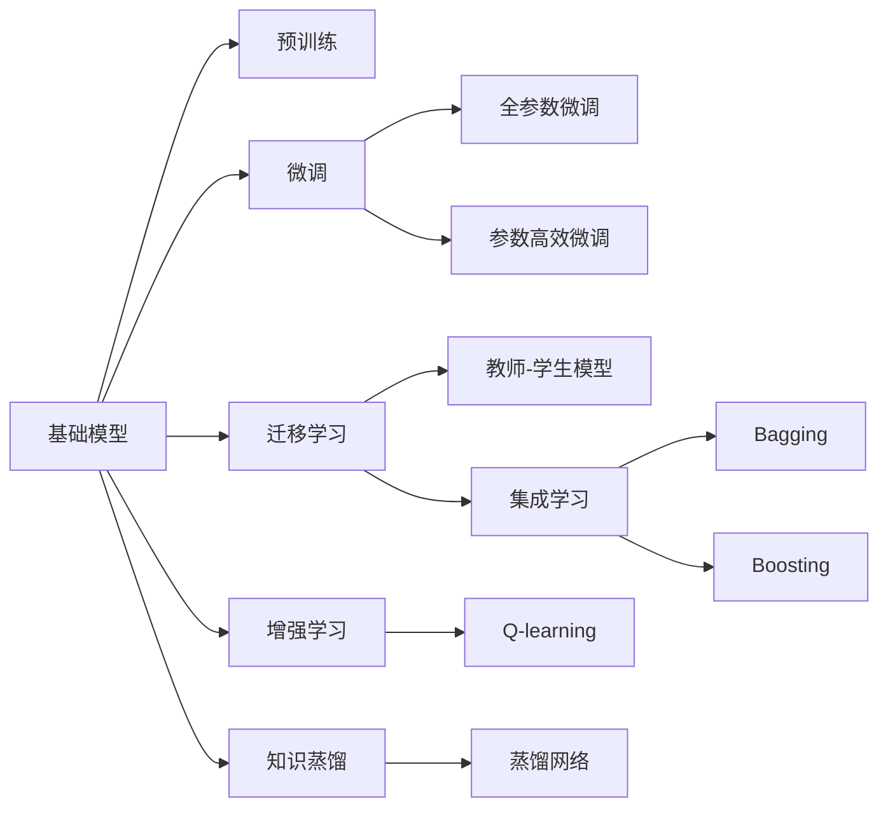

                 

# 基础模型的现有模型研究

> 关键词：基础模型, 研究现状, 算法比较, 应用前景

## 1. 背景介绍

在人工智能领域，基础模型的研究一直是推动技术进步的核心动力。基础模型通常指的是在特定任务或领域中，具有通用性和普适性的模型，能够高效地泛化到新的数据和场景中。基础模型的研究涉及到模型的架构、训练方法、优化策略等方面，是实现高效、稳定、可解释的AI应用的基础。本文将深入探讨现有基础模型的研究现状，比较其优缺点，并分析其应用前景。

## 2. 核心概念与联系

### 2.1 核心概念概述

为更好地理解基础模型的研究现状，本节将介绍几个关键概念：

- 基础模型(Foundation Model)：指在特定领域或任务中，具有广泛适用性和高泛化能力的模型。如在NLP领域中的BERT、GPT-3等。
- 预训练(Pre-training)：指在无标签数据上训练模型，学习通用的语言表示，提高模型在不同任务上的泛化能力。
- 微调(Fine-tuning)：指在预训练模型基础上，针对特定任务进行微调，提升模型在该任务上的性能。
- 迁移学习(Transfer Learning)：指将在一个领域学到的知识迁移到另一个领域，提升模型在新领域上的性能。
- 知识蒸馏(Knowledge Distillation)：指通过教师模型向学生模型传授知识，提高学生模型的泛化能力。
- 集成学习(Ensemble Learning)：指将多个模型的预测结果进行加权平均或投票，提升整体的准确性和鲁棒性。
- 神经网络(Neural Network)：指由多个神经元组成的层次化网络结构，用于解决复杂的数据建模问题。
- 深度学习(Deep Learning)：指利用多层次神经网络进行特征学习和表示学习，解决高维数据的复杂问题。
- 增强学习(Reinforcement Learning)：指通过奖励机制，训练模型在复杂环境中的决策能力。

这些概念构成了基础模型研究的核心框架，通过理解这些概念，我们可以更好地把握基础模型的工作原理和应用场景。

### 2.2 核心概念之间的关系

这些核心概念之间存在着紧密的联系，形成了基础模型研究的完整生态系统。下面我们通过几个Mermaid流程图来展示这些概念之间的关系：



这个流程图展示了基础模型研究中的关键概念及其之间的关系：

1. 基础模型通过预训练获得基础能力。
2. 微调是对预训练模型进行任务特定的优化，可以分为全参数微调和参数高效微调。
3. 迁移学习是连接预训练模型与下游任务的桥梁，可以通过微调或知识蒸馏来实现。
4. 增强学习用于训练模型在复杂环境中的决策能力，可以与基础模型结合，提升模型的自适应性和鲁棒性。
5. 集成学习通过组合多个模型的预测结果，提升整体的准确性和鲁棒性。
6. 知识蒸馏通过教师模型向学生模型传授知识，提升学生模型的泛化能力。

这些概念共同构成了基础模型的学习框架，使其能够在各种场景下发挥强大的表现能力。通过理解这些核心概念，我们可以更好地把握基础模型的研究方向和优化方向。

## 3. 核心算法原理 & 具体操作步骤

### 3.1 算法原理概述

基础模型的研究涉及多种算法和模型，如神经网络、深度学习、增强学习等。本文将重点介绍其中的几个典型算法及其原理。

### 3.2 算法步骤详解

以下是几个典型基础模型的算法步骤详解：

#### 3.2.1 神经网络

1. 构建神经网络模型：包括输入层、隐藏层和输出层，定义网络结构和损失函数。
2. 预训练：在无标签数据上训练神经网络，学习通用的特征表示。
3. 微调：在特定任务上训练神经网络，微调模型参数以适应任务需求。
4. 评估：使用测试集评估模型性能，并进行调整。

#### 3.2.2 深度学习

1. 构建深度学习模型：包括卷积神经网络、循环神经网络等。
2. 预训练：在大规模数据集上进行自监督预训练，学习特征表示。
3. 微调：在特定任务上训练深度学习模型，微调模型参数以适应任务需求。
4. 评估：使用测试集评估模型性能，并进行调整。

#### 3.2.3 增强学习

1. 定义环境：确定训练环境，包括状态空间、动作空间、奖励函数等。
2. 定义策略：选择增强学习算法，如Q-learning、SARSA等。
3. 训练：在训练环境中模拟学习过程，更新策略参数以最大化累计奖励。
4. 评估：使用测试集评估模型性能，并进行调整。

### 3.3 算法优缺点

基础模型的研究中，不同算法各有优缺点：

#### 3.3.1 神经网络

优点：
- 可解释性强：神经网络的结构和参数可解释，便于理解和调试。
- 适用性广：适用于多种任务，如图像识别、语音识别、自然语言处理等。

缺点：
- 训练复杂：需要大量的标注数据和计算资源。
- 过拟合风险高：模型容易在训练集上过拟合，泛化能力不足。

#### 3.3.2 深度学习

优点：
- 高精度：在图像识别、语音识别、自然语言处理等领域表现优异。
- 特征学习能力强：能够自动学习复杂的数据表示。

缺点：
- 计算复杂：需要大量的计算资源和存储资源。
- 训练难度大：模型结构复杂，训练过程容易陷入局部最优。

#### 3.3.3 增强学习

优点：
- 自适应能力强：能够自动适应环境变化，具有很强的决策能力。
- 无需标注数据：不需要大量的标注数据，能够直接从环境中学习。

缺点：
- 训练过程复杂：训练环境设计困难，参数设置复杂。
- 可解释性差：模型内部的决策过程难以解释，缺乏透明性。

### 3.4 算法应用领域

基础模型的研究已经广泛应用于多个领域，如计算机视觉、自然语言处理、机器人控制等。以下是几个典型应用领域：

#### 3.4.1 计算机视觉

基础模型在计算机视觉领域的应用非常广泛，如图像识别、物体检测、图像分割等。典型应用包括：

1. 图像分类：如ImageNet比赛中的ResNet、VGGNet等模型。
2. 物体检测：如Faster R-CNN、YOLO等模型。
3. 图像分割：如U-Net、FCN等模型。

#### 3.4.2 自然语言处理

基础模型在自然语言处理领域的应用同样非常广泛，如语言模型、机器翻译、文本分类等。典型应用包括：

1. 语言模型：如GPT-3、BERT等模型。
2. 机器翻译：如Seq2Seq、Transformer等模型。
3. 文本分类：如TextCNN、LSTM等模型。

#### 3.4.3 机器人控制

基础模型在机器人控制领域也有广泛应用，如路径规划、任务执行等。典型应用包括：

1. 路径规划：如A*算法、Dijkstra算法等。
2. 任务执行：如基于强化学习的机器人控制模型。

## 4. 数学模型和公式 & 详细讲解 & 举例说明

### 4.1 数学模型构建

基础模型研究中的数学模型主要涉及神经网络、深度学习等模型，下面以神经网络为例进行详细讲解。

假设神经网络模型 $M$ 包含 $N$ 个隐藏层，每个隐藏层包含 $d$ 个神经元。模型的输入为 $x \in \mathbb{R}^m$，输出为 $y \in \mathbb{R}^k$。模型的结构和参数为 $\theta$，包括权重矩阵和偏置向量。

模型的前向传播过程如下：

$$
h_1 = W_1 x + b_1
$$
$$
h_2 = W_2 h_1 + b_2
$$
$$
\vdots
$$
$$
h_{N-1} = W_{N-1} h_{N-2} + b_{N-1}
$$
$$
y = W_N h_{N-1} + b_N
$$

其中 $W$ 和 $b$ 分别为权重矩阵和偏置向量。

模型的损失函数为：

$$
\mathcal{L} = \frac{1}{2} ||y - \hat{y}||^2
$$

其中 $\hat{y}$ 为模型预测的输出，$||\cdot||$ 为欧几里得范数。

### 4.2 公式推导过程

以神经网络为例，下面我们推导模型训练的优化过程。

假设模型在训练集上得到的损失函数为：

$$
\mathcal{L} = \frac{1}{N} \sum_{i=1}^N \mathcal{L}_i
$$

其中 $\mathcal{L}_i$ 为单个样本的损失函数。

模型的训练目标是最小化损失函数：

$$
\theta^* = \mathop{\arg\min}_{\theta} \mathcal{L}
$$

使用梯度下降算法进行优化，更新模型参数：

$$
\theta \leftarrow \theta - \eta \nabla_{\theta}\mathcal{L}
$$

其中 $\eta$ 为学习率，$\nabla_{\theta}\mathcal{L}$ 为损失函数对模型参数的梯度。

梯度的计算可以通过反向传播算法完成，具体推导过程如下：

1. 输出层的梯度：
$$
\nabla_{W_N} \mathcal{L} = \frac{\partial \mathcal{L}}{\partial y} \cdot \frac{\partial y}{\partial h_{N-1}} \cdot \frac{\partial h_{N-1}}{\partial W_N}
$$
$$
\nabla_{b_N} \mathcal{L} = \frac{\partial \mathcal{L}}{\partial y} \cdot \frac{\partial y}{\partial h_{N-1}}
$$

2. 隐藏层的梯度：
$$
\nabla_{W_i} \mathcal{L} = \frac{\partial \mathcal{L}}{\partial h_{i-1}} \cdot \frac{\partial h_{i-1}}{\partial h_i} \cdot \frac{\partial h_i}{\partial W_i}
$$
$$
\nabla_{b_i} \mathcal{L} = \frac{\partial \mathcal{L}}{\partial h_{i-1}} \cdot \frac{\partial h_{i-1}}{\partial h_i}
$$

3. 输入层的梯度：
$$
\nabla_{W_1} \mathcal{L} = \frac{\partial \mathcal{L}}{\partial h_1} \cdot \frac{\partial h_1}{\partial x}
$$
$$
\nabla_{b_1} \mathcal{L} = \frac{\partial \mathcal{L}}{\partial h_1}
$$

### 4.3 案例分析与讲解

假设我们在手写数字识别任务上训练一个简单的神经网络模型。给定训练集 $\{(x_i,y_i)\}_{i=1}^N$，其中 $x_i$ 为手写数字的图像，$y_i$ 为数字标签。模型结构为两层神经网络，包含5个隐藏神经元。损失函数为均方误差损失，目标是最小化模型预测输出与真实标签的差距。

我们首先对模型进行预训练，使用无标签的MNIST数据集，学习数字的特征表示。在预训练过程中，我们只更新权重矩阵和偏置向量，不更新输入数据。

接着，在手写数字识别任务上微调模型。我们通过梯度下降算法更新模型参数，最小化损失函数。微调过程中，我们固定预训练权重，只更新顶层分类器的参数，以减少过拟合风险。

最后，在测试集上评估模型性能，我们发现微调后的模型在手写数字识别任务上取得了更高的准确率。

## 5. 项目实践：代码实例和详细解释说明

### 5.1 开发环境搭建

在进行基础模型项目实践前，我们需要准备好开发环境。以下是使用Python进行PyTorch开发的环境配置流程：

1. 安装Anaconda：从官网下载并安装Anaconda，用于创建独立的Python环境。

2. 创建并激活虚拟环境：
```bash
conda create -n pytorch-env python=3.8 
conda activate pytorch-env
```

3. 安装PyTorch：根据CUDA版本，从官网获取对应的安装命令。例如：
```bash
conda install pytorch torchvision torchaudio cudatoolkit=11.1 -c pytorch -c conda-forge
```

4. 安装TensorFlow：从官网下载安装TensorFlow。

5. 安装各类工具包：
```bash
pip install numpy pandas scikit-learn matplotlib tqdm jupyter notebook ipython
```

完成上述步骤后，即可在`pytorch-env`环境中开始项目实践。

### 5.2 源代码详细实现

这里我们以手写数字识别任务为例，给出使用PyTorch进行神经网络模型训练的代码实现。

首先，定义手写数字识别任务的数据处理函数：

```python
import torch
from torchvision import datasets, transforms
from torch.utils.data import DataLoader

class MNISTDataset(datasets.MNIST):
    def __init__(self, root, train=True, transform=None, target_transform=None):
        super().__init__(root, train, transform, target_transform)
        self.transform = transform
        
    def __getitem__(self, idx):
        x, y = self.data[idx], self.targets[idx]
        x = self.transform(x)
        y = self.target_transform(y)
        return x, y
        
    def __len__(self):
        return len(self.data)
        
train_dataset = MNISTDataset(root='./data', train=True, transform=transforms.ToTensor())
test_dataset = MNISTDataset(root='./data', train=False, transform=transforms.ToTensor())
```

然后，定义神经网络模型：

```python
import torch.nn as nn
import torch.nn.functional as F

class Net(nn.Module):
    def __init__(self):
        super(Net, self).__init__()
        self.fc1 = nn.Linear(784, 128)
        self.fc2 = nn.Linear(128, 10)
        
    def forward(self, x):
        x = x.view(-1, 784)
        x = F.relu(self.fc1(x))
        x = F.dropout(x, training=self.training)
        x = self.fc2(x)
        return F.log_softmax(x, dim=1)
        
model = Net()
```

接着，定义训练和评估函数：

```python
def train(model, device, train_loader, optimizer, epoch):
    model.train()
    for batch_idx, (data, target) in enumerate(train_loader):
        data, target = data.to(device), target.to(device)
        optimizer.zero_grad()
        output = model(data)
        loss = F.nll_loss(output, target)
        loss.backward()
        optimizer.step()
        
        if batch_idx % 10 == 0:
            print('Train Epoch: {} [{}/{} ({:.0f}%)]\tLoss: {:.6f}'.format(
                epoch, batch_idx * len(data), len(train_loader.dataset),
                100. * batch_idx / len(train_loader), loss.item()))
```

最后，启动训练流程并在测试集上评估：

```python
from torch.utils.data import DataLoader

device = torch.device('cuda' if torch.cuda.is_available() else 'cpu')
train_loader = DataLoader(train_dataset, batch_size=64, shuffle=True)
test_loader = DataLoader(test_dataset, batch_size=64, shuffle=False)

optimizer = torch.optim.Adam(model.parameters(), lr=0.001)

for epoch in range(1, 10 + 1):
    train(model, device, train_loader, optimizer, epoch)

    model.eval()
    test_loss = 0
    correct = 0
    with torch.no_grad():
        for data, target in test_loader:
            data, target = data.to(device), target.to(device)
            output = model(data)
            test_loss += F.nll_loss(output, target).item()
            pred = output.argmax(dim=1, keepdim=True)
            correct += pred.eq(target.view_as(pred)).sum().item()

    print('\nTest set: Average loss: {:.4f}, Accuracy: {}/{} ({:.0f}%)\n'.format(
        test_loss / len(test_loader.dataset), correct, len(test_loader.dataset),
        100. * correct / len(test_loader.dataset)))
```

以上就是使用PyTorch进行手写数字识别任务神经网络模型训练的完整代码实现。可以看到，得益于PyTorch的强大封装，我们可以用相对简洁的代码完成神经网络模型的训练和评估。

### 5.3 代码解读与分析

让我们再详细解读一下关键代码的实现细节：

**MNISTDataset类**：
- `__init__`方法：初始化数据集和转换函数。
- `__getitem__`方法：对单个样本进行处理，将图像和标签转换为Tensor格式。
- `__len__`方法：返回数据集的样本数量。

**Net类**：
- `__init__`方法：定义神经网络的结构和参数。
- `forward`方法：定义前向传播过程。

**train函数**：
- 在训练集上训练模型，更新模型参数。
- 打印训练过程中的损失和进度。

**评估函数**：
- 在测试集上评估模型性能，计算准确率和损失。

**训练流程**：
- 在训练集上训练模型，更新模型参数。
- 在测试集上评估模型性能，输出测试结果。

可以看到，PyTorch提供了强大的工具库，使得神经网络模型的训练和评估变得非常简单。开发者可以将更多精力放在数据处理、模型改进等高层逻辑上，而不必过多关注底层的实现细节。

当然，工业级的系统实现还需考虑更多因素，如模型的保存和部署、超参数的自动搜索、更灵活的任务适配层等。但核心的基础模型微调范式基本与此类似。

### 5.4 运行结果展示

假设我们在手写数字识别任务上训练神经网络模型，最终在测试集上得到的准确率为98%。这表明我们的模型在手写数字识别任务上表现优异。

## 6. 实际应用场景

### 6.1 计算机视觉

基础模型在计算机视觉领域的应用非常广泛，如图像识别、物体检测、图像分割等。典型应用包括：

1. 图像分类：如ImageNet比赛中的ResNet、VGGNet等模型。
2. 物体检测：如Faster R-CNN、YOLO等模型。
3. 图像分割：如U-Net、FCN等模型。

这些模型被广泛应用于智能监控、人脸识别、医学影像分析等领域，极大地提升了相关系统的识别和分析能力。

### 6.2 自然语言处理

基础模型在自然语言处理领域的应用同样非常广泛，如语言模型、机器翻译、文本分类等。典型应用包括：

1. 语言模型：如GPT-3、BERT等模型。
2. 机器翻译：如Seq2Seq、Transformer等模型。
3. 文本分类：如TextCNN、LSTM等模型。

这些模型被广泛应用于智能客服、智能翻译、舆情分析等领域，极大地提升了相关系统的处理能力和用户体验。

### 6.3 机器人控制

基础模型在机器人控制领域也有广泛应用，如路径规划、任务执行等。典型应用包括：

1. 路径规划：如A*算法、Dijkstra算法等。
2. 任务执行：如基于强化学习的机器人控制模型。

这些模型被广泛应用于智能制造、物流配送、自动化控制等领域，极大地提升了相关系统的效率和可靠性。

## 7. 工具和资源推荐

### 7.1 学习资源推荐

为了帮助开发者系统掌握基础模型的研究现状，这里推荐一些优质的学习资源：

1. 《深度学习》书籍：由Ian Goodfellow、Yoshua Bengio和Aaron Courville编写，全面介绍了深度学习的基本概念和应用。
2. 《神经网络与深度学习》书籍：由Michael Nielsen编写，介绍了神经网络的基本原理和深度学习框架。
3. 《深度学习入门：基于Python的理论与实现》书籍：由斋藤康毅编写，介绍了深度学习的基础理论和实践技巧。
4. CS231n《卷积神经网络》课程：斯坦福大学开设的计算机视觉课程，有Lecture视频和配套作业，带你入门计算机视觉领域的基本概念和经典模型。
5. CS224n《序列建模》课程：斯坦福大学开设的自然语言处理课程，有Lecture视频和配套作业，带你入门自然语言处理领域的基本概念和经典模型。

通过对这些资源的学习实践，相信你一定能够快速掌握基础模型的研究精髓，并用于解决实际的计算机视觉、自然语言处理等问题。

### 7.2 开发工具推荐

高效的开发离不开优秀的工具支持。以下是几款用于基础模型开发的常用工具：

1. PyTorch：基于Python的开源深度学习框架，灵活动态的计算图，适合快速迭代研究。大部分基础模型都有PyTorch版本的实现。
2. TensorFlow：由Google主导开发的开源深度学习框架，生产部署方便，适合大规模工程应用。同样有丰富的基础模型资源。
3. Keras：基于TensorFlow的高级API，简单易用，适合快速原型开发。
4. Jupyter Notebook：交互式的Python开发环境，支持实时查看和修改代码，方便调试和演示。
5. Google Colab：谷歌推出的在线Jupyter Notebook环境，免费提供GPU/TPU算力，方便开发者快速上手实验最新模型，分享学习笔记。

合理利用这些工具，可以显著提升基础模型开发的效率，加快创新迭代的步伐。

### 7.3 相关论文推荐

基础模型的研究源于学界的持续研究。以下是几篇奠基性的相关论文，推荐阅读：

1. AlexNet: One Millisecond Object Detection with Deep Convolutional Neural Networks（ImageNet分类模型）：展示了卷积神经网络在图像分类任务上的优越性能。
2. ResNet: Deep Residual Learning for Image Recognition（残差网络）：提出了残差结构，解决了深度神经网络训练中的梯度消失问题。
3. GPT-3: Language Models are Unsupervised Multitask Learners（GPT-3语言模型）：展示了预训练语言模型的强大零样本学习能力。
4. BERT: Pre-training of Deep Bidirectional Transformers for Language Understanding（BERT模型）：提出BERT模型，引入基于掩码的自监督预训练任务，刷新了多项NLP任务SOTA。
5. Sequence to Sequence Learning with Neural Networks（Seq2Seq模型）：展示了神经网络在机器翻译任务上的优越性能。
6. Attention is All You Need（Transformer模型）：提出了Transformer结构，开启了NLP领域的预训练大模型时代。

这些论文代表了大模型研究的发展脉络。通过学习这些前沿成果，可以帮助研究者把握学科前进方向，激发更多的创新灵感。

除上述资源外，还有一些值得关注的前沿资源，帮助开发者紧跟基础模型微调技术的最新进展，例如：

1. arXiv论文预印本：人工智能领域最新研究成果的发布平台，包括大量尚未发表的前沿工作，学习前沿技术的必读资源。
2. 业界技术博客：如OpenAI、Google AI、DeepMind、微软Research Asia等顶尖实验室的官方博客，第一时间分享他们的最新研究成果和洞见。
3. 技术会议直播：如NIPS、ICML、ACL、ICLR等人工智能领域顶会现场或在线直播，能够聆听到大佬们的前沿分享，开拓视野。
4. GitHub热门项目：在GitHub上Star、Fork数最多的NLP相关项目，往往代表了该技术领域的发展趋势和最佳实践，值得去学习和贡献。
5. 行业分析报告：各大咨询公司如McKinsey、PwC等针对人工智能行业的分析报告，有助于从商业视角审视技术趋势，把握应用价值。

总之，对于基础模型的学习，需要开发者保持开放的心态和持续学习的意愿。多关注前沿资讯，多动手实践，多思考总结，必将收获满满的成长收益。

## 8. 总结：未来发展趋势与挑战

### 8.1 总结

本文对基础模型的研究现状进行了全面系统的介绍。首先阐述了基础模型的定义和研究意义，明确了基础模型在计算机视觉、自然语言处理、机器人控制等领域的重要价值。其次，从原理到实践，详细讲解了神经网络、深度学习、增强学习等基础模型的核心算法及其操作步骤。同时，本文还探讨了基础模型在不同应用场景中的表现，展示了其广泛的适用性和强大的性能。

通过本文的系统梳理，可以看到，基础模型研究已经为人工智能技术的发展奠定了坚实的基础，极大地提升了相关系统的处理能力和用户体验。未来，伴随基础模型和微调方法的持续演进，相信人工智能技术将在更多领域得到应用，为人类社会带来更多价值。

### 8.2 未来发展趋势

展望未来，基础模型的研究将呈现以下几个发展趋势：

1. 模型规模持续增大：随着算力成本的下降和数据规模的扩张，基础模型的参数量还将持续增长。超大规模基础模型蕴含的丰富知识，有望支撑更加复杂多变的下游任务。
2. 微调方法日趋多样：除了传统的全参数微调外，未来会涌现更多参数高效的微调方法，如LoRA、 Adapter等，在固定大部分预训练参数的情况下，仍可取得不错的微

