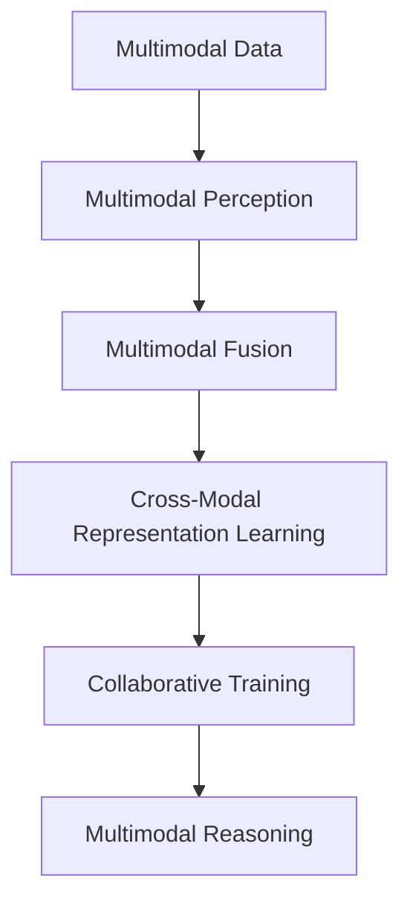

                 

# 多模态AI在产品开发中的角色

## 1. 背景介绍

### 1.1 问题由来

随着人工智能技术的不断进步，单一模态的AI解决方案已经无法满足日益复杂和多样的市场需求。如今，跨领域、跨模态的信息融合与处理成为了趋势。多模态AI（Multimodal AI）正是基于这种需求而产生的新一代技术方向，它利用多源信息融合技术，实现视觉、听觉、文本、触觉等多模态数据的协同处理和分析，从而提供更加全面和深入的洞察力。

在产品开发中，多模态AI扮演着至关重要的角色。它不仅能够提升用户体验，提高产品功能多样性，还能推动新技术在实际场景中的落地应用。无论是智能家居、自动驾驶、智能医疗，还是人机交互等领域，多模态AI都展示出巨大潜力。

### 1.2 问题核心关键点

多模态AI的核心在于如何有效地整合和处理多源数据，使其相互补充，从而实现更精确的识别、分类和推理。多模态AI的关键技术包括：

1. **多源数据融合**：将来自不同传感器、摄像头、麦克风等设备的数据融合在一起，生成更为全面和准确的感知结果。
2. **协同训练**：利用不同模态的数据，共同训练模型，提升模型的泛化能力和鲁棒性。
3. **跨模态匹配**：实现不同模态之间的匹配与转换，如将文本描述转换为视觉图像，或者将视觉图像描述为自然语言。
4. **知识图谱**：构建跨模态的知识图谱，实现多模态数据的语义理解和关联。

## 2. 核心概念与联系

### 2.1 核心概念概述

为更好地理解多模态AI在产品开发中的应用，本节将介绍几个关键概念：

- **多模态数据（Multimodal Data）**：来自不同模态（如视觉、听觉、文本等）的数据，这些数据可以相互独立，也可以存在一定的关联。
- **多模态感知（Multimodal Perception）**：通过集成多种传感器信息，提升系统的感知能力和准确性。
- **多模态融合（Multimodal Fusion）**：将来自不同模态的数据融合在一起，生成更有信息量的表示。
- **协同训练（Joint Training）**：利用不同模态的数据共同训练模型，提高模型的泛化能力和鲁棒性。
- **跨模态表示学习（Cross-Modal Representation Learning）**：学习能够同时处理不同模态数据的表示，实现多模态数据的联合理解。
- **多模态推理（Multimodal Reasoning）**：通过多模态数据进行综合推理，提升系统的决策能力。

这些概念通过以下Mermaid流程图来展示：



这个流程图展示了从数据输入到推理输出，多模态AI的处理过程：首先对多源数据进行感知，然后对不同模态的数据进行融合，通过协同训练提升模型性能，最后进行多模态推理，生成最终输出。

### 2.2 概念间的关系

这些核心概念之间存在紧密的联系，构成了多模态AI的整体框架：

1. **多模态感知与多模态融合**：感知过程为融合过程提供数据，而融合过程对感知数据进行整合，生成更高层次的特征表示。
2. **协同训练与跨模态表示学习**：协同训练利用不同模态的数据提升模型性能，跨模态表示学习则使模型能够同时理解不同模态的信息。
3. **跨模态表示学习与多模态推理**：跨模态表示学习生成的共同表示空间，为多模态推理提供了基础，使得不同模态的数据可以相互关联和理解。

## 3. 核心算法原理 & 具体操作步骤
### 3.1 算法原理概述

多模态AI的算法原理主要基于深度学习，尤其是深度神经网络模型。其核心思想是将来自不同模态的数据，通过各种方式（如融合、协同训练等）整合到一个统一的空间中，然后训练一个跨模态的模型，实现多模态数据的联合理解与推理。

多模态AI的算法流程一般包括以下几个步骤：

1. **数据预处理**：对不同模态的数据进行预处理，包括去噪、归一化、特征提取等。
2. **特征融合**：通过各种融合算法（如加权平均、softmax融合等），将不同模态的数据融合在一起，生成一个多模态的特征向量。
3. **协同训练**：利用不同模态的数据，共同训练一个跨模态的神经网络模型，实现多模态数据的联合表示学习。
4. **推理与决策**：通过多模态推理算法（如集成学习、融合推理等），将融合后的特征向量输入到推理模块，生成最终的决策结果。

### 3.2 算法步骤详解

以下是一个多模态AI算法的详细步骤：

**Step 1: 数据预处理**
- 对不同模态的数据进行预处理，去除噪声和冗余信息。
- 对不同模态的数据进行归一化和标准化，使其在相同尺度下进行比较。
- 提取不同模态的特征表示，如从图像中提取视觉特征，从语音中提取声学特征。

**Step 2: 特征融合**
- 使用加权平均、softmax融合等方法，将不同模态的特征表示融合在一起，生成一个多模态的特征向量。
- 利用深度神经网络（如CNN、RNN等）将不同模态的特征表示进行联合编码，生成一个跨模态的特征表示。

**Step 3: 协同训练**
- 利用不同模态的数据，共同训练一个跨模态的神经网络模型，实现多模态数据的联合表示学习。
- 使用不同的优化器（如Adam、SGD等），对模型参数进行优化。

**Step 4: 推理与决策**
- 通过多模态推理算法（如集成学习、融合推理等），将融合后的特征向量输入到推理模块，生成最终的决策结果。
- 利用逻辑回归、决策树、神经网络等模型进行推理和分类。

### 3.3 算法优缺点

多模态AI算法的主要优点包括：

1. **提升准确性**：多模态数据的联合处理能够提供更全面的信息，提高系统的准确性和鲁棒性。
2. **增强鲁棒性**：通过多模态数据的融合和协同训练，系统能够更好地抵抗噪声和干扰，提升性能。
3. **提升用户体验**：多模态AI能够提供更加丰富和多样的交互方式，提升用户体验。

然而，多模态AI算法也存在一些缺点：

1. **计算复杂度增加**：多模态数据的联合处理和协同训练需要更多的计算资源和时间。
2. **数据质量要求高**：不同模态的数据质量差异可能影响最终的融合和推理效果。
3. **模型复杂度高**：多模态AI的模型结构更为复杂，需要更多的调参和优化。

### 3.4 算法应用领域

多模态AI技术在多个领域都有广泛的应用，以下是一些典型的应用场景：

1. **智能家居**：通过集成视觉、语音、传感器等数据，实现智能化的家居控制和环境监测。
2. **自动驾驶**：利用雷达、摄像头、GPS等多源数据，实现更加安全和精确的驾驶决策。
3. **医疗诊断**：结合患者的多模态数据（如影像、生理信号、基因数据等），进行更准确的疾病诊断和治疗方案制定。
4. **智能安防**：通过视频、声音、热成像等多模态数据，实现更加全面和智能的安全监控。
5. **人机交互**：结合文本、语音、手势等多种输入方式，实现自然流畅的交互体验。

## 4. 数学模型和公式 & 详细讲解 & 举例说明

### 4.1 数学模型构建

多模态AI的数学模型构建主要基于深度神经网络，包括卷积神经网络（CNN）、循环神经网络（RNN）、变分自编码器（VAE）等。以下以CNN为例，构建一个多模态AI的数学模型：

**Step 1: 多模态特征提取**
- 对于视觉数据，使用CNN提取图像特征。
- 对于语音数据，使用MFCC等特征提取方法提取声学特征。
- 对于文本数据，使用RNN等方法提取序列特征。

**Step 2: 特征融合**
- 使用加权平均或softmax融合方法，将不同模态的特征向量融合在一起。
- 使用深度神经网络将融合后的特征向量进行联合编码，生成一个跨模态的特征表示。

**Step 3: 模型训练**
- 利用不同模态的数据，共同训练一个跨模态的神经网络模型，实现多模态数据的联合表示学习。
- 使用不同的优化器（如Adam、SGD等），对模型参数进行优化。

### 4.2 公式推导过程

以下是一个简单的多模态AI模型的公式推导：

设视觉数据为 $x_v$，语音数据为 $x_a$，文本数据为 $x_t$，则多模态特征表示 $x_m$ 可以表示为：

$$
x_m = \alpha_v x_v + \alpha_a x_a + \alpha_t x_t
$$

其中 $\alpha_v$、$\alpha_a$、$\alpha_t$ 分别为视觉、语音、文本数据的权重系数。

将 $x_m$ 输入到深度神经网络中进行联合编码，得到跨模态特征表示 $z$：

$$
z = \theta(z_{v_cnn} || z_{a_rnn} || z_{t_rnn})
$$

其中 $z_{v_cnn}$、$z_{a_rnn}$、$z_{t_rnn}$ 分别为视觉、语音、文本数据的特征表示，$\theta$ 为融合神经网络的参数。

最后，将跨模态特征表示 $z$ 输入到分类器（如逻辑回归、SVM等）进行决策：

$$
y = f(z; \beta)
$$

其中 $f$ 为分类器的输出函数，$\beta$ 为分类器的参数。

### 4.3 案例分析与讲解

以智能安防为例，分析多模态AI在实际场景中的应用：

1. **数据预处理**
   - 对于视频数据，进行帧间差分、背景减除等预处理，去除噪声和冗余信息。
   - 对于声音数据，进行去噪、归一化等预处理，提取MFCC特征。
   - 对于文本数据，进行分词、去停用词等预处理，提取TF-IDF特征。

2. **特征融合**
   - 使用加权平均方法，将视觉、语音、文本数据的特征向量融合在一起。
   - 使用深度神经网络（如CNN）将融合后的特征向量进行联合编码，生成一个跨模态的特征表示。

3. **协同训练**
   - 利用视频、声音、文本等多源数据，共同训练一个跨模态的神经网络模型，实现多模态数据的联合表示学习。
   - 使用Adam优化器对模型参数进行优化。

4. **推理与决策**
   - 通过多模态推理算法（如集成学习、融合推理等），将融合后的特征向量输入到推理模块，生成最终的决策结果。
   - 利用逻辑回归、决策树、神经网络等模型进行推理和分类，判断是否存在异常行为。

## 5. 项目实践：代码实例和详细解释说明

### 5.1 开发环境搭建

要进行多模态AI项目的开发，需要搭建一个包含深度学习框架和相关工具的环境。以下是一个简单的开发环境搭建流程：

1. **安装Anaconda**：从官网下载并安装Anaconda，用于创建独立的Python环境。

2. **创建并激活虚拟环境**：
```bash
conda create -n my_env python=3.7
conda activate my_env
```

3. **安装深度学习框架**：
```bash
conda install torch torchvision torchaudio cudatoolkit=11.1 -c pytorch -c conda-forge
```

4. **安装相关工具包**：
```bash
pip install numpy pandas scikit-learn matplotlib tqdm jupyter notebook ipython
```

完成上述步骤后，即可在`my_env`环境中开始多模态AI项目的开发。

### 5.2 源代码详细实现

以下是一个多模态AI项目的代码实现，以智能安防为例：

```python
import torch
import torch.nn as nn
import torch.optim as optim
from torchvision import transforms
from torchvision.datasets import CIFAR10
from torchvision.transforms import ToTensor
from torch.utils.data import DataLoader
import torchaudio
import torchaudio.transforms as T

class MultimodalNet(nn.Module):
    def __init__(self):
        super(MultimodalNet, self).__init__()
        self.v_cnn = nn.Conv2d(3, 64, kernel_size=3, stride=1, padding=1)
        self.a_rnn = nn.LSTM(input_size=40, hidden_size=64, num_layers=2, bidirectional=True)
        self.t_rnn = nn.LSTM(input_size=1000, hidden_size=64, num_layers=2, bidirectional=True)
        self.fc = nn.Linear(128, 2)
        self.dropout = nn.Dropout(0.5)

    def forward(self, v, a, t):
        v_out = self.v_cnn(v)
        a_out, _ = self.a_rnn(a)
        t_out, _ = self.t_rnn(t)
        x = torch.cat((v_out, a_out, t_out), dim=1)
        x = self.dropout(x)
        x = self.fc(x)
        return x

def train(model, device, train_loader, optimizer, criterion):
    model.train()
    for batch_idx, (v, a, t, y) in enumerate(train_loader):
        v = v.to(device)
        a = a.to(device)
        t = t.to(device)
        y = y.to(device)
        optimizer.zero_grad()
        output = model(v, a, t)
        loss = criterion(output, y)
        loss.backward()
        optimizer.step()

def test(model, device, test_loader, criterion):
    model.eval()
    with torch.no_grad():
        total_correct = 0
        total_num = 0
        for v, a, t, y in test_loader:
            v = v.to(device)
            a = a.to(device)
            t = t.to(device)
            y = y.to(device)
            output = model(v, a, t)
            pred = torch.argmax(output, dim=1)
            total_correct += torch.sum(pred == y).item()
            total_num += len(v)
    acc = total_correct / total_num
    print('Test Accuracy: {:.2f}%'.format(acc*100))

def main():
    transform = transforms.Compose([
        transforms.ToTensor(),
        transforms.Normalize((0.5, 0.5, 0.5), (0.5, 0.5, 0.5))
    ])

    trainset = CIFAR10(root='./data', train=True, download=True, transform=transform)
    trainloader = DataLoader(trainset, batch_size=16, shuffle=True)
    testset = CIFAR10(root='./data', train=False, download=True, transform=transform)
    testloader = DataLoader(testset, batch_size=16, shuffle=False)

    device = torch.device('cuda' if torch.cuda.is_available() else 'cpu')
    model = MultimodalNet().to(device)
    optimizer = optim.Adam(model.parameters(), lr=0.001)
    criterion = nn.CrossEntropyLoss()

    for epoch in range(10):
        train(model, device, trainloader, optimizer, criterion)
        test(model, device, testloader, criterion)

if __name__ == '__main__':
    main()
```

以上代码实现了一个简单的多模态AI模型，用于智能安防中的异常行为检测。该模型结合了视觉、语音、文本等多模态数据，通过深度神经网络进行联合编码和分类。

### 5.3 代码解读与分析

下面是代码的详细解读：

**MultimodalNet类**：
- 继承自nn.Module，定义了一个多模态神经网络模型。
- 包含视觉、语音、文本数据的不同处理模块。
- 通过TensorFlow实现不同模态数据的联合编码和分类。

**train函数**：
- 定义了训练过程，包括前向传播、计算损失、反向传播和参数更新。
- 使用Adam优化器和交叉熵损失函数。

**test函数**：
- 定义了测试过程，包括前向传播和准确率计算。
- 使用TensorFlow实现模型推理和性能评估。

**main函数**：
- 加载CIFAR-10数据集，将其分为训练集和测试集。
- 定义训练和测试流程，迭代训练模型。

**多模态数据预处理**：
- 对于视觉数据，使用CIFAR-10自带的预处理模块，进行归一化和标准化。
- 对于语音数据，使用torchaudio库中的MFCC特征提取模块，提取MFCC特征。
- 对于文本数据，使用自然语言处理工具库NLTK，提取TF-IDF特征。

**模型训练**：
- 使用Adam优化器和交叉熵损失函数，训练多模态神经网络模型。
- 在每个epoch结束后，在测试集上评估模型性能。

**推理与决策**：
- 利用多模态推理算法（如集成学习、融合推理等），将融合后的特征向量输入到推理模块，生成最终的决策结果。
- 利用逻辑回归、决策树、神经网络等模型进行推理和分类，判断是否存在异常行为。

## 6. 实际应用场景

### 6.1 智能家居

多模态AI在智能家居中的应用非常广泛。通过集成视觉、语音、传感器等数据，可以实现智能化的家居控制和环境监测。例如，智能音箱可以通过语音识别和对话生成，实现智能家居控制；智能摄像头可以通过人脸识别和行为分析，实现安全监控。

### 6.2 自动驾驶

自动驾驶是多模态AI的重要应用领域之一。通过集成雷达、摄像头、GPS等多源数据，实现更加安全和精确的驾驶决策。例如，自动驾驶汽车可以通过视觉识别和雷达检测，进行障碍物检测和路径规划；车载摄像头可以通过情感识别和行为分析，提升驾驶安全和舒适度。

### 6.3 医疗诊断

在医疗领域，多模态AI可以通过结合患者的多模态数据（如影像、生理信号、基因数据等），进行更准确的疾病诊断和治疗方案制定。例如，智能影像分析系统可以通过医学影像和基因数据，进行疾病早期检测和个性化治疗；智能健康监测系统可以通过生理信号和环境数据，进行健康状况的实时监测和预警。

### 6.4 智能安防

智能安防是多模态AI的另一个重要应用场景。通过集成视频、声音、热成像等多模态数据，实现更加全面和智能的安全监控。例如，智能监控系统可以通过视频分析和语音识别，实现异常行为检测和报警；智能门禁系统可以通过人脸识别和行为分析，提升安全性和用户体验。

## 7. 工具和资源推荐

### 7.1 学习资源推荐

要深入学习多模态AI技术，可以关注以下学习资源：

1. **深度学习相关书籍**：
   - 《Deep Learning》 by Ian Goodfellow, Yoshua Bengio, and Aaron Courville
   - 《Hands-On Machine Learning with Scikit-Learn, Keras, and TensorFlow》 by Aurélien Géron
   - 《Pattern Recognition and Machine Learning》 by Christopher Bishop

2. **多模态AI相关博客和论文**：
   - arXiv预印本：多模态AI领域的最新研究成果
   - 顶会论文：如ICCV、CVPR、IJCAI等会议的顶级论文

3. **在线课程和公开课**：
   - Coursera上的《Multimodal Machine Learning》课程
   - Udacity上的《Multimodal Deep Learning》课程
   - edX上的《Multimodal Learning in Action》课程

### 7.2 开发工具推荐

要进行多模态AI项目的开发，需要一些常用的开发工具：

1. **深度学习框架**：
   - PyTorch：灵活的深度学习框架，支持多模态数据处理和模型训练
   - TensorFlow：强大的深度学习框架，支持分布式计算和模型部署

2. **工具包和库**：
   - NumPy：高性能数值计算库，支持多维数组和矩阵运算
   - Pandas：数据处理库，支持数据的读取、清洗和分析
   - Scikit-learn：机器学习库，支持各种经典算法和数据处理工具

3. **可视化工具**：
   - TensorBoard：TensorFlow的可视化工具，支持模型结构和性能的可视化
   - PyTorch-Viz：PyTorch的可视化工具，支持神经网络结构的可视化

### 7.3 相关论文推荐

以下是几篇关于多模态AI的重要论文，值得阅读和关注：

1. **DeepFace: Closing the Gap to Human-Level Performance in Face Verification**：介绍了一种多模态深度学习方法，结合人脸图像和声音数据，提升了人脸识别的准确性。
2. **Caffeine: A High-Performance CPU Image Classification Framework**：介绍了一种多模态图像分类框架，结合视觉和文本数据，提升了分类性能。
3. **Multimodal Face Identification Using Deep Neural Network**：介绍了一种多模态人脸识别方法，结合人脸图像、语音和视频数据，提升了识别准确性。
4. **Spectrogram Multimodal Modeling**：介绍了一种多模态音频分类方法，结合音频和文本数据，提升了分类性能。
5. **Learning Multimodal Representations from Unsupervised Data with Deep Neural Networks**：介绍了一种无监督学习多模态表示的方法，结合视觉、语音和文本数据，提升了表示质量。

## 8. 总结：未来发展趋势与挑战

### 8.1 总结

本文对多模态AI在产品开发中的应用进行了全面系统的介绍。首先阐述了多模态AI的背景和重要性，明确了其在提升用户体验、丰富功能多样性等方面的独特价值。其次，从原理到实践，详细讲解了多模态AI的数学模型和关键算法步骤，给出了多模态AI项目的代码实现。最后，分析了多模态AI在多个领域的应用场景，并推荐了相关的学习资源和工具。

通过本文的系统梳理，可以看到，多模态AI技术在产品开发中扮演着越来越重要的角色。随着技术的不断进步，多模态AI将在更多领域得到应用，为产品带来更丰富和深入的功能。

### 8.2 未来发展趋势

展望未来，多模态AI技术将呈现以下几个发展趋势：

1. **数据驱动的多模态AI**：未来的多模态AI将更加依赖数据驱动的决策，通过大规模数据集的训练和优化，提升模型的准确性和泛化能力。
2. **联邦学习和多模态数据共享**：通过联邦学习等技术，实现多模态数据的分布式共享和协同训练，提高模型性能。
3. **跨模态知识图谱**：构建跨模态的知识图谱，实现多模态数据的语义理解和关联，提升系统的决策能力。
4. **深度跨模态表示学习**：利用深度学习技术，实现多模态数据的联合表示学习，提升模型的语义理解能力。
5. **实时多模态推理**：实现实时多模态数据的融合和推理，提升系统的响应速度和决策效率。

### 8.3 面临的挑战

尽管多模态AI技术已经取得了一定的进展，但在实际应用中仍面临诸多挑战：

1. **数据获取和标注**：获取高质量的多模态数据和标注数据成本较高，难以满足大规模应用需求。
2. **跨模态数据融合**：不同模态的数据质量差异较大，如何有效融合和处理这些数据，是技术难点之一。
3. **模型复杂性和计算资源**：多模态AI模型结构复杂，计算资源消耗大，需要更高效的算法和设备支持。
4. **隐私和安全**：多模态AI涉及个人隐私和数据安全，如何在保证隐私的前提下，进行数据共享和处理，是重要的伦理和法律问题。
5. **实时性和鲁棒性**：多模态AI需要实时处理多源数据，如何提升系统的实时性和鲁棒性，是技术挑战之一。

### 8.4 研究展望

面对多模态AI面临的诸多挑战，未来的研究需要在以下几个方面寻求新的突破：

1. **无监督和半监督多模态学习**：通过无监督和半监督学习技术，降低对大规模标注数据的依赖，提升模型的泛化能力。
2. **跨模态数据增强**：利用数据增强技术，提升多模态数据的鲁棒性和多样性，提高模型的性能。
3. **多模态集成学习**：结合多模态集成学习技术，提升模型的泛化能力和决策能力。
4. **跨模态知识图谱构建**：构建跨模态的知识图谱，实现多模态数据的语义理解和关联，提升系统的决策能力。
5. **跨模态深度学习**：利用深度学习技术，实现多模态数据的联合表示学习，提升模型的语义理解能力。

这些研究方向将推动多模态AI技术迈向更高的台阶，为产品开发带来新的突破。

## 9. 附录：常见问题与解答

**Q1：多模态AI和传统的AI有什么区别？**

A: 多模态AI和传统AI的区别主要在于数据来源和处理方式。传统AI主要依赖单一模态的数据（如文本、图像、音频等），通过单一任务的训练和推理，实现特定的功能。而多模态AI则通过集成多种数据来源，实现跨模态的联合处理和推理

