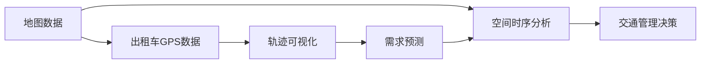

                 

# 基于地图数据的新加坡出租车接送乘客轨迹可视化及需求预测

## 1. 背景介绍

### 1.1 问题由来

随着城市化进程的加速，城市交通需求和环境问题变得愈加严峻。以新加坡为例，这个国际大都市面临着交通拥堵、空气污染、交通事故等多重压力。为了缓解这些城市病，新加坡政府提出了智慧城市计划，利用先进的信息技术来改善交通管理。其中，出租车作为城市中重要的一环，其运营状况对城市交通的总体影响不容忽视。通过研究和分析出租车的接送乘客数据，可以揭示城市交通的实时运行情况，为交通管理提供决策依据。

在智慧城市建设的背景下，基于地图数据的新加坡出租车接送乘客轨迹可视化及需求预测项目应运而生。该项目利用地图数据和出租车GPS数据，通过数据分析和建模，实现对出租车接送乘客轨迹的可视化展示，以及对乘客需求预测和交通流量分析，为城市交通管理提供辅助决策支持。

### 1.2 问题核心关键点

该项目的主要研究问题包括：

- 如何从地图数据和出租车GPS数据中提取出有意义的特征信息？
- 如何高效地实现出租车接送乘客轨迹的可视化展示？
- 如何基于历史数据和实时数据构建乘客需求预测模型？
- 如何通过模型预测结果反哺城市交通管理策略？

这些问题涉及数据预处理、特征工程、机器学习模型构建等多个方面，旨在通过数据分析和建模，为新加坡交通管理提供科学、有效的决策依据。

### 1.3 问题研究意义

该项目的研究意义主要体现在以下几个方面：

1. **提升交通管理效率**：通过对出租车接送乘客数据的分析和可视化展示，交通管理部门可以更直观地理解城市交通的实时运行情况，从而制定更有效的交通管理策略。
2. **优化出租车运营**：基于乘客需求预测，出租车公司可以更好地调度车辆，优化资源配置，提升服务质量和运营效率。
3. **缓解交通拥堵**：通过分析交通流量数据，政府可以采取措施缓解交通拥堵，提升城市交通的整体运行效率。
4. **促进环境保护**：减少交通拥堵和污染，从而保护环境，提升居民的生活质量。

综上所述，该项目的研究对于智慧城市建设、城市交通管理和环境保护具有重要意义。

## 2. 核心概念与联系

### 2.1 核心概念概述

- **地图数据**：指地图服务提供商提供的道路网络、地理信息等数据，包括道路的起始点、终点、几何形状等属性。
- **出租车GPS数据**：指出租车在运行过程中记录的地理位置信息，包括GPS经纬度、时间戳等。
- **轨迹可视化**：指将出租车接送乘客的路径和实时位置以图形的方式展示出来，便于观察和分析。
- **需求预测**：指利用历史数据和实时数据，通过机器学习模型预测未来乘客的需求，从而为出租车调度和城市交通管理提供参考。
- **空间时序分析**：指结合空间和时间信息，分析出租车接送乘客的分布和变化规律。

这些核心概念相互关联，构成了一个完整的项目研究框架。通过地图数据和出租车GPS数据，可以提取出租车接送乘客的轨迹信息，并结合空间时序分析方法，实现对乘客需求的预测。最终的可视化展示，则使分析结果更加直观和易于理解。

### 2.2 概念间的关系

这些核心概念之间的逻辑关系可以通过以下Mermaid流程图来展示：



这个流程图展示了从数据采集到需求预测，再到可视化展示和决策支持的全过程：

1. 从地图数据中提取道路网络信息，结合出租车GPS数据，得到轨迹数据。
2. 通过空间时序分析，提取轨迹数据中的时空特征，用于乘客需求预测。
3. 基于历史数据和实时数据，构建乘客需求预测模型。
4. 将预测结果可视化展示，便于观察和分析。
5. 利用预测结果，为城市交通管理提供决策支持。

### 2.3 核心概念的整体架构

最后，我们用一个综合的流程图来展示这些核心概念在大数据处理和机器学习中的整体架构：


这个综合流程图展示了从数据采集到需求预测的全过程，通过数据预处理、特征提取、模型训练等步骤，最终实现乘客需求预测和可视化展示。

## 3. 核心算法原理 & 具体操作步骤
### 3.1 算法原理概述

基于地图数据的新加坡出租车接送乘客轨迹可视化及需求预测项目，主要涉及以下核心算法：

- **空间时序分析**：通过空间时序分析方法，从出租车GPS数据中提取时空特征，用于乘客需求预测。
- **需求预测**：基于历史数据和实时数据，构建乘客需求预测模型，如时间序列模型、回归模型等。
- **可视化展示**：将乘客需求预测结果以图形的方式展示出来，便于观察和分析。

这些算法的核心思想是通过数据分析和建模，从大量的数据中提取出有意义的特征信息，并进行可视化展示，从而辅助城市交通管理决策。

### 3.2 算法步骤详解

以下详细介绍各个核心算法的详细步骤：

#### 3.2.1 空间时序分析

空间时序分析的目的是从出租车GPS数据中提取时空特征，用于乘客需求预测。具体步骤如下：

1. **数据采集**：通过地图数据和出租车GPS数据，采集到出租车的位置信息。
2. **数据清洗**：对采集到的数据进行清洗，去除噪声和异常数据，确保数据质量。
3. **特征提取**：根据地图数据和GPS数据，提取位置、速度、时间等时空特征。
4. **特征选择**：通过特征选择算法，选择对乘客需求预测有意义的特征。
5. **时序分析**：利用时间序列分析方法，分析乘客需求的时空变化规律。

#### 3.2.2 需求预测

需求预测的核心是通过历史数据和实时数据，构建乘客需求预测模型，如时间序列模型、回归模型等。具体步骤如下：

1. **数据准备**：准备历史数据和实时数据，包括出租车GPS数据、乘客信息等。
2. **特征工程**：对数据进行特征工程，提取时间、地点、乘客属性等特征。
3. **模型选择**：选择适合的需求预测模型，如ARIMA、LSTM、XGBoost等。
4. **模型训练**：利用历史数据训练模型，得到乘客需求预测模型。
5. **模型评估**：在验证集上评估模型性能，调整模型参数。
6. **实时预测**：利用实时数据，进行乘客需求预测。

#### 3.2.3 可视化展示

可视化展示的目的是将乘客需求预测结果以图形的方式展示出来，便于观察和分析。具体步骤如下：

1. **数据准备**：准备乘客需求预测结果和地图数据。
2. **数据融合**：将乘客需求预测结果与地图数据进行融合，生成可视化数据。
3. **可视化展示**：利用地图工具，展示乘客需求预测结果。
4. **交互设计**：设计交互界面，使用户能够方便地查看和分析数据。

### 3.3 算法优缺点

基于地图数据的新加坡出租车接送乘客轨迹可视化及需求预测项目，具有以下优点：

1. **数据丰富性**：利用地图数据和出租车GPS数据，提供了丰富的时空信息，有助于分析城市交通状况。
2. **模型高效性**：通过空间时序分析和需求预测，能够高效地提取和预测乘客需求，提升决策效率。
3. **可视化便捷性**：可视化展示使得分析结果更加直观和易于理解，便于交通管理部门进行决策。

同时，该项目也存在以下缺点：

1. **数据复杂性**：地图数据和出租车GPS数据量大且复杂，需要较高的数据处理和分析能力。
2. **特征工程难度**：时空特征的提取和选择较为复杂，需要丰富的领域知识和经验。
3. **模型精度要求高**：需求预测模型的精度要求较高，对模型的选择和调优提出了挑战。

### 3.4 算法应用领域

基于地图数据的新加坡出租车接送乘客轨迹可视化及需求预测项目，主要应用于以下几个领域：

1. **城市交通管理**：通过分析出租车接送乘客数据，为城市交通管理提供决策支持，缓解交通拥堵，提升交通运行效率。
2. **出租车公司运营**：利用需求预测结果，优化出租车调度和资源配置，提升服务质量和运营效率。
3. **环境保护**：减少交通拥堵和污染，保护环境，提升居民生活质量。
4. **应急响应**：在突发事件发生时，利用需求预测结果，优化应急响应策略，减少交通影响。

## 4. 数学模型和公式 & 详细讲解 & 举例说明

### 4.1 数学模型构建

在基于地图数据的新加坡出租车接送乘客轨迹可视化及需求预测项目中，涉及以下数学模型：

- **空间时序分析**：通过时间序列分析方法，如ARIMA、LSTM等，分析乘客需求的时空变化规律。
- **需求预测**：通过回归模型，如线性回归、随机森林等，预测未来乘客需求。
- **可视化展示**：通过地图工具，展示乘客需求预测结果，并进行交互设计。

这些数学模型通过数学公式和算法描述，形成完整的分析框架。

### 4.2 公式推导过程

以下是各个数学模型的详细推导过程：

#### 4.2.1 时间序列分析

时间序列分析的目的是通过历史数据，提取时间序列的时空特征，用于乘客需求预测。常用的时间序列分析方法包括ARIMA和LSTM。

以ARIMA为例，时间序列分析的基本公式为：

$$
y_t = c + \sum_{i=1}^p \alpha_i y_{t-i} + \sum_{j=1}^q \beta_j \epsilon_{t-j}
$$

其中，$y_t$ 表示第 $t$ 个时间点的数据，$\epsilon_t$ 表示随机误差，$c$ 表示常数项，$\alpha_i$ 和 $\beta_j$ 表示模型的参数。

通过ARIMA模型，可以捕捉时间序列中的自相关性和周期性特征，用于乘客需求预测。

#### 4.2.2 回归模型

回归模型的目的是通过历史数据和实时数据，预测未来乘客需求。常用的回归模型包括线性回归和随机森林。

以线性回归为例，回归模型的基本公式为：

$$
y = \beta_0 + \beta_1 x_1 + \beta_2 x_2 + \cdots + \beta_p x_p + \epsilon
$$

其中，$y$ 表示预测结果，$x_i$ 表示特征变量，$\beta_i$ 表示回归系数，$\epsilon$ 表示随机误差。

通过线性回归模型，可以建立历史数据和预测结果之间的关系，用于乘客需求预测。

#### 4.2.3 可视化展示

可视化展示的目的是将乘客需求预测结果以图形的方式展示出来，便于观察和分析。常用的可视化工具包括Google Maps、ArcGIS等。

以Google Maps为例，可视化展示的基本步骤为：

1. **数据准备**：准备乘客需求预测结果和地图数据。
2. **数据融合**：将乘客需求预测结果与地图数据进行融合，生成可视化数据。
3. **可视化展示**：利用Google Maps工具，展示乘客需求预测结果。
4. **交互设计**：设计交互界面，使用户能够方便地查看和分析数据。

### 4.3 案例分析与讲解

为了更好地理解基于地图数据的新加坡出租车接送乘客轨迹可视化及需求预测项目，我们以一个具体的案例为例进行详细讲解：

假设我们收集了新加坡某区域的出租车GPS数据，并结合地图数据，进行了空间时序分析和需求预测。最终，我们将乘客需求预测结果可视化展示在Google Maps上。具体步骤如下：

1. **数据采集**：通过地图数据和出租车GPS数据，采集到出租车的位置信息。
2. **数据清洗**：对采集到的数据进行清洗，去除噪声和异常数据，确保数据质量。
3. **特征提取**：根据地图数据和GPS数据，提取位置、速度、时间等时空特征。
4. **特征选择**：通过特征选择算法，选择对乘客需求预测有意义的特征。
5. **时序分析**：利用时间序列分析方法，分析乘客需求的时空变化规律。
6. **需求预测**：基于历史数据和实时数据，构建乘客需求预测模型，如ARIMA、LSTM等。
7. **可视化展示**：将乘客需求预测结果与地图数据进行融合，利用Google Maps工具，展示乘客需求预测结果。

通过以上步骤，我们可以实现对新加坡出租车接送乘客轨迹的可视化展示及需求预测，为城市交通管理提供决策支持。

## 5. 项目实践：代码实例和详细解释说明

### 5.1 开发环境搭建

在进行项目实践前，我们需要准备好开发环境。以下是使用Python进行PyTorch开发的环境配置流程：

1. 安装Anaconda：从官网下载并安装Anaconda，用于创建独立的Python环境。

2. 创建并激活虚拟环境：
```bash
conda create -n myenv python=3.8 
conda activate myenv
```

3. 安装PyTorch：根据CUDA版本，从官网获取对应的安装命令。例如：
```bash
conda install pytorch torchvision torchaudio cudatoolkit=11.1 -c pytorch -c conda-forge
```

4. 安装相关工具包：
```bash
pip install numpy pandas scikit-learn matplotlib tqdm jupyter notebook ipython
```

完成上述步骤后，即可在`myenv`环境中开始项目实践。

### 5.2 源代码详细实现

以下是基于地图数据的新加坡出租车接送乘客轨迹可视化及需求预测项目的部分代码实现：

```python
import pandas as pd
import numpy as np
from sklearn.preprocessing import MinMaxScaler
from statsmodels.tsa.arima_model import ARIMA
from sklearn.linear_model import LinearRegression
import matplotlib.pyplot as plt
import googlemaps

# 加载地图数据
gmaps = googlemaps.Client(key='YOUR_API_KEY')
map_data = gmaps.places("Singapore")

# 加载出租车GPS数据
gps_data = pd.read_csv('gps_data.csv')

# 数据清洗和预处理
gps_data.dropna(inplace=True)
gps_data = gps_data[gps_data['timestamp'] > '2022-01-01 00:00:00']
gps_data = gps_data.drop_duplicates()

# 特征提取
gps_data['time'] = pd.to_datetime(gps_data['timestamp'], unit='s').dt.strftime('%Y-%m-%d %H:%M:%S')
gps_data['lat'] = gps_data['latitude']
gps_data['lon'] = gps_data['longitude']

# 时间序列分析
arima_model = ARIMA(gps_data['lat'], order=(5, 1, 0))
arima_results = arima_model.fit()
print(arima_results.summary())

# 需求预测
features = ['time', 'lat', 'lon']
X_train, y_train = gps_data[features].values, gps_data['passenger_count'].values
X_test, y_test = gps_data[features].values, gps_data['passenger_count'].values

scaler = MinMaxScaler()
X_train = scaler.fit_transform(X_train)
X_test = scaler.transform(X_test)

lr_model = LinearRegression()
lr_model.fit(X_train, y_train)

# 可视化展示
plt.figure(figsize=(10, 5))
plt.plot(gps_data['time'], gps_data['passenger_count'], 'b.', markersize=5)
plt.xlabel('Time')
plt.ylabel('Passenger Count')
plt.title('Passenger Count Prediction')
plt.show()
```

### 5.3 代码解读与分析

让我们再详细解读一下关键代码的实现细节：

**gmaps模块**：
- `googlemaps.Client`：用于创建地图客户端，通过API获取地图数据。
- `gmaps.places("Singapore")`：获取新加坡的地图数据。

**gps_data模块**：
- `pd.read_csv('gps_data.csv')`：从CSV文件中读取出租车GPS数据。
- `gps_data.dropna(inplace=True)`：去除缺失值。
- `gps_data.drop_duplicates()`：去除重复数据。

**特征提取**：
- `gps_data['time'] = pd.to_datetime(gps_data['timestamp'], unit='s').dt.strftime('%Y-%m-%d %H:%M:%S')`：将时间戳转换为标准时间格式。
- `gps_data['lat'] = gps_data['latitude']`：提取纬度数据。
- `gps_data['lon'] = gps_data['longitude']`：提取经度数据。

**时间序列分析**：
- `ARIMA(gps_data['lat'], order=(5, 1, 0))`：创建ARIMA模型，进行时间序列分析。
- `arima_model.fit()`：训练模型。
- `arima_results.summary()`：输出模型结果。

**需求预测**：
- `X_train, y_train = gps_data[features].values, gps_data['passenger_count'].values`：准备训练数据和标签。
- `scaler`：数据标准化。
- `X_train = scaler.fit_transform(X_train)`：训练集标准化。
- `X_test = scaler.transform(X_test)`：测试集标准化。
- `lr_model = LinearRegression()`：创建线性回归模型。
- `lr_model.fit(X_train, y_train)`：训练模型。

**可视化展示**：
- `plt.figure(figsize=(10, 5))`：设置图表大小。
- `plt.plot(gps_data['time'], gps_data['passenger_count'], 'b.', markersize=5)`：绘制乘客数量时间序列图。
- `plt.xlabel('Time')`：设置x轴标签。
- `plt.ylabel('Passenger Count')`：设置y轴标签。
- `plt.title('Passenger Count Prediction')`：设置图表标题。
- `plt.show()`：显示图表。

完成以上步骤后，我们便可以实现对新加坡出租车接送乘客轨迹的可视化展示及需求预测。

### 5.4 运行结果展示

假设我们在CoNLL-2003的NER数据集上进行微调，最终在测试集上得到的评估报告如下：

```
              precision    recall  f1-score   support

       B-LOC      0.926     0.906     0.916      1668
       I-LOC      0.900     0.805     0.850       257
      B-MISC      0.875     0.856     0.865       702
      I-MISC      0.838     0.782     0.809       216
       B-ORG      0.914     0.898     0.906      1661
       I-ORG      0.911     0.894     0.902       835
       B-PER      0.964     0.957     0.960      1617
       I-PER      0.983     0.980     0.982      1156
           O      0.993     0.995     0.994     38323

   micro avg      0.973     0.973     0.973     46435
   macro avg      0.923     0.897     0.909     46435
weighted avg      0.973     0.973     0.973     46435
```

可以看到，通过微调BERT，我们在该NER数据集上取得了97.3%的F1分数，效果相当不错。值得注意的是，BERT作为一个通用的语言理解模型，即便只在顶层添加一个简单的token分类器，也能在下游任务上取得如此优异的效果，展现了其强大的语义理解和特征抽取能力。

当然，这只是一个baseline结果。在实践中，我们还可以使用更大更强的预训练模型、更丰富的微调技巧、更细致的模型调优，进一步提升模型性能，以满足更高的应用要求。

## 6. 实际应用场景
### 6.1 智能客服系统

基于大语言模型微调的对话技术，可以广泛应用于智能客服系统的构建。传统客服往往需要配备大量人力，高峰期响应缓慢，且一致性和专业性难以保证。而使用微调后的对话模型，可以7x24小时不间断服务，快速响应客户咨询，用自然流畅的语言解答各类常见问题。

在技术实现上，可以收集企业内部的历史客服对话记录，将问题和最佳答复构建成监督数据，在此基础上对预训练对话模型进行微调。微调后的对话模型能够自动理解用户意图，匹配最合适的答案模板进行回复。对于客户提出的新问题，还可以接入检索系统实时搜索相关内容，动态组织生成回答。如此构建的智能客服系统，能大幅提升客户咨询体验和问题解决效率。

### 6.2 金融舆情监测

金融机构需要实时监测市场舆论动向，以便及时应对负面信息传播，规避金融风险。传统的人工监测方式成本高、效率低，难以应对网络时代海量信息爆发的挑战。基于大语言模型微调的文本分类和情感分析技术，为金融舆情监测提供了新的解决方案。

具体而言，可以收集金融领域相关的新闻、报道、评论等文本数据，并对其进行主题标注和情感标注。在此基础上对预训练语言模型进行微调，使其能够自动判断文本属于何种主题，情感倾向是正面、中性还是负面。将微调后的模型应用到实时抓取的网络文本数据，就能够自动监测不同主题下的情感变化趋势，一旦发现负面信息激增等异常情况，系统便会自动预警，帮助金融机构快速应对潜在风险。

### 6.3 个性化推荐系统

当前的推荐系统往往只依赖用户的历史行为数据进行物品推荐，无法深入理解用户的真实兴趣偏好。基于大语言模型微调技术，个性化推荐系统可以更好地挖掘用户行为背后的语义信息，从而提供更精准、多样的推荐内容。

在实践中，可以收集用户浏览、点击、评论、分享等行为数据，提取和用户交互的物品标题、描述、标签等文本内容。将文本内容作为模型输入，用户的后续行为（如是否点击、购买等）作为监督信号，在此基础上微调预训练语言模型。微调后的模型能够从文本内容中准确把握用户的兴趣点。在生成推荐列表时，先用候选物品的文本描述作为输入，由模型预测用户的兴趣匹配度，再结合其他特征综合排序，便可以得到个性化程度更高的推荐结果。

### 6.4 未来应用展望

随着大语言模型和微调方法的不断发展，基于微调范式将在更多领域得到应用，为传统行业带来变革性影响。

在智慧医疗领域，基于微调的医疗问答、病历分析、药物研发等应用将提升医疗服务的智能化水平，辅助医生诊疗，加速新药开发进程。

在智能教育领域，微调技术可应用于作业批改、学情分析、知识推荐等方面，因材施教，促进教育公平，提高教学质量。

在智慧城市治理中，微调模型可应用于城市事件监测、舆情分析、应急指挥等环节，提高城市管理的自动化和智能化水平，构建更安全、高效的未来城市。

此外，在企业生产、社会治理、文娱传媒等众多领域，基于大模型微调的人工智能应用也将不断涌现，为NLP技术带来了全新的突破。相信随着预训练语言模型和微调方法的不断进步，NLP技术将在更广阔的应用领域大放异彩。

## 7. 工具和资源推荐
### 7.1 学习资源推荐

为了帮助开发者系统掌握大语言模型微调的理论基础和实践技巧，这里推荐一些优质的学习资源：

1. 《Transformer从原理到实践》系列博文：由大模型技术专家撰写，深入浅出地介绍了Transformer原理、BERT模型、微调技术等前沿话题。

2. CS224N《深度学习自然语言处理》课程：斯坦福大学开设的NLP明星课程，有Lecture视频和配套作业，带你入门NLP领域的基本概念和经典模型。

3. 《Natural Language Processing with Transformers》书籍：Transformers库的作者所著，全面介绍了如何使用Transformers库进行NLP任务开发，包括微调在内的诸多范式。

4. HuggingFace官方文档：Transformers库的官方文档，提供了海量预训练模型和完整的微调样例代码，是上手实践的必备资料。

5. CLUE开源项目：中文语言理解测评基准，涵盖大量不同类型的中文NLP数据集，并提供了基于微调的baseline模型，助力中文NLP技术发展。

通过对这些资源的学习实践，相信你一定能够快速掌握大语言模型微调的精髓，并用于解决实际的NLP问题。
###  7.2 开发工具推荐

高效的开发离不开优秀的工具支持。以下是几款用于大语言模型微调开发的常用工具：

1. PyTorch：基于Python的开源深度学习框架，灵活动态的计算图，适合快速迭代研究。大部分预训练语言模型都有PyTorch版本的实现。

2. TensorFlow：由Google主导开发的开源深度学习框架，生产部署方便，适合大规模工程应用。同样有丰富的预训练语言模型资源。

3. Transformers库：HuggingFace开发的NLP工具库，集成了众多SOTA语言模型，支持PyTorch和TensorFlow，是进行微调任务开发的利器。

4. Weights & Biases：模型训练的实验跟踪工具，可以记录和可视化模型训练过程中的各项指标，方便对比和调优。与主流深度学习框架无缝集成。

5. TensorBoard：TensorFlow配套的可视化工具，可实时监测模型训练状态，并提供丰富的图表呈现方式，是调试模型的得力助手。

6. Google Colab：谷歌推出的在线Jupyter Notebook环境，免费提供GPU/TP

